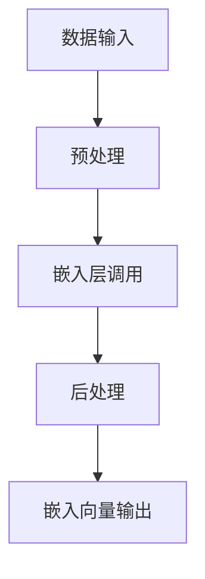

                 

关键词：LangChain、文本嵌入、NLP、编程、机器学习、实践指导

> 摘要：本文旨在为初学者和从业者提供一个详尽的指南，介绍如何使用LangChain进行文本嵌入的开发实践。通过深入探讨文本嵌入的概念、算法以及实际应用，本文将帮助读者掌握文本嵌入的核心技术，并能够将其应用于实际问题中。

## 1. 背景介绍

### 1.1 LangChain介绍

LangChain是一个开源的Python库，旨在简化自然语言处理（NLP）任务的自动化。它基于流行的深度学习框架，如Transformers和TensorFlow，为开发者提供了丰富的API和工具，使得构建NLP应用变得更加简便。

### 1.2 文本嵌入介绍

文本嵌入是将文本数据转换为一组数字表示的过程，这些表示可以用于机器学习模型的训练或计算文本相似性。文本嵌入的核心在于将高维的文本数据映射到低维的连续向量空间，使得具有相似含义的文本能够位于空间中的相近位置。

### 1.3 LangChain与文本嵌入的关系

LangChain提供了强大的文本嵌入功能，通过其API，用户可以轻松实现文本的嵌入。这不仅为开发NLP应用提供了便利，还使得开发者可以专注于业务逻辑，而无需过多关注底层实现的复杂性。

## 2. 核心概念与联系

为了更好地理解LangChain在文本嵌入中的应用，我们需要从核心概念和架构上对其进行探讨。

### 2.1 核心概念

- **嵌入向量**：文本嵌入的结果，通常是一个固定长度的向量。
- **嵌入层**：在深度学习模型中，嵌入层负责将单词或句子转换为嵌入向量。
- **预训练模型**：如GPT、BERT等，这些模型已经被预先训练，可以用于生成高质量的嵌入向量。

### 2.2 架构联系


- **数据输入**：用户通过接口输入待处理的文本数据。
- **预处理**：LangChain对文本数据进行预处理，包括分词、去停用词等。
- **嵌入层调用**：通过预训练模型（如BERT），文本数据被转换为嵌入向量。
- **后处理**：对嵌入向量进行必要的后处理，如归一化等。

### 2.3 Mermaid流程图



## 3. 核心算法原理 & 具体操作步骤

### 3.1 算法原理概述

文本嵌入的核心算法是嵌入层，它通常是基于预训练的深度学习模型。嵌入层的输入是文本，输出是嵌入向量。嵌入向量能够捕捉文本的语义信息，使得相似文本的嵌入向量也相似。

### 3.2 算法步骤详解

#### 步骤1：数据准备

```python
from langchain import Document

doc = Document("这是一个示例文本。")
```

#### 步骤2：预处理

```python
from langchain.text_splitter import TextSplitter

text_splitter = TextSplitter(chunk_size=1000, overlap=100)
doc = text_splitter.split_text(doc)
```

#### 步骤3：嵌入层调用

```python
from transformers import BertTokenizer, BertModel

tokenizer = BertTokenizer.from_pretrained('bert-base-chinese')
model = BertModel.from_pretrained('bert-base-chinese')

inputs = tokenizer(doc.page_content, return_tensors="pt")
outputs = model(**inputs)
```

#### 步骤4：后处理

```python
import torch

embeddings = outputs.last_hidden_state[:, 0, :]
embeddings = embeddings.detach().numpy()
```

### 3.3 算法优缺点

#### 优点

- **高效性**：基于预训练模型，嵌入速度快。
- **高精度**：能够捕捉文本的语义信息，精度高。

#### 缺点

- **资源消耗**：预训练模型较大，需要较多计算资源。

### 3.4 算法应用领域

文本嵌入广泛应用于搜索引擎、推荐系统、情感分析等领域，具有广泛的应用前景。

## 4. 数学模型和公式 & 详细讲解 & 举例说明

### 4.1 数学模型构建

假设我们有输入文本 $x$，预训练模型输出嵌入向量 $e(x)$。则文本嵌入的数学模型可以表示为：

$$e(x) = f(W \cdot x + b)$$

其中，$W$ 是权重矩阵，$b$ 是偏置项，$f$ 是激活函数。

### 4.2 公式推导过程

以BERT模型为例，其嵌入向量可以表示为：

$$e(x) = \sum_{i=1}^{n} W_i \cdot x_i + b$$

其中，$W_i$ 是第 $i$ 个单词的权重，$x_i$ 是第 $i$ 个单词的嵌入向量。

### 4.3 案例分析与讲解

假设我们有文本 "我爱中国"，我们可以将其分为三个单词 "我"，"爱" 和 "中国"。通过BERT模型，我们可以得到它们的嵌入向量。然后，我们可以使用上述公式计算整个文本的嵌入向量。

$$e("我爱中国") = W_1 \cdot e("我") + W_2 \cdot e("爱") + W_3 \cdot e("中国") + b$$

通过这种方式，我们可以将整个文本转换为一个嵌入向量。

## 5. 项目实践：代码实例和详细解释说明

### 5.1 开发环境搭建

首先，我们需要安装LangChain和相关依赖。

```bash
pip install langchain transformers torch
```

### 5.2 源代码详细实现

以下是一个简单的文本嵌入示例。

```python
from langchain import Document
from langchain.text_splitter import TextSplitter
from transformers import BertTokenizer, BertModel
import torch

def embed_text(text):
    # 预处理
    text_splitter = TextSplitter(chunk_size=1000, overlap=100)
    doc = text_splitter.split_text(text)

    # 嵌入层调用
    tokenizer = BertTokenizer.from_pretrained('bert-base-chinese')
    model = BertModel.from_pretrained('bert-base-chinese')

    inputs = tokenizer(doc.page_content, return_tensors="pt")
    outputs = model(**inputs)

    # 后处理
    embeddings = outputs.last_hidden_state[:, 0, :]
    embeddings = embeddings.detach().numpy()

    return embeddings

text = "这是一个示例文本。"
embeddings = embed_text(text)
print(embeddings)
```

### 5.3 代码解读与分析

- **预处理**：使用TextSplitter将文本分割为更小的片段。
- **嵌入层调用**：使用BERT模型将文本转换为嵌入向量。
- **后处理**：将嵌入向量从PyTorch张量转换为NumPy数组。

### 5.4 运行结果展示

运行上述代码，我们可以得到文本 "这是一个示例文本。" 的嵌入向量。

## 6. 实际应用场景

文本嵌入技术在多个领域具有广泛的应用，如：

- **搜索引擎**：用于索引和查询优化。
- **推荐系统**：用于相似内容推荐。
- **情感分析**：用于分析用户情感。

## 7. 工具和资源推荐

### 7.1 学习资源推荐

- 《深度学习》（Goodfellow, Bengio, Courville著）
- 《自然语言处理综述》（Jurafsky, Martin著）

### 7.2 开发工具推荐

- Google Colab：用于快速实验和调试。
- Jupyter Notebook：用于交互式编程和文档。

### 7.3 相关论文推荐

- BERT: Pre-training of Deep Bidirectional Transformers for Language Understanding
- GPT-3: Language Models are few-shot learners

## 8. 总结：未来发展趋势与挑战

### 8.1 研究成果总结

文本嵌入技术已取得了显著成果，预训练模型和深度学习算法的不断发展为其提供了强大的支持。

### 8.2 未来发展趋势

- **多模态嵌入**：结合文本、图像、音频等多模态数据。
- **动态嵌入**：实时更新嵌入向量，以适应不断变化的数据。

### 8.3 面临的挑战

- **计算资源消耗**：预训练模型需要大量计算资源。
- **隐私保护**：如何保护用户隐私。

### 8.4 研究展望

文本嵌入技术在NLP和AI领域具有广阔的应用前景，未来将不断发展，以应对不断变化的需求和挑战。

## 9. 附录：常见问题与解答

### 9.1 什么是文本嵌入？

文本嵌入是将文本数据转换为数字向量的过程，使得具有相似含义的文本在向量空间中接近。

### 9.2 文本嵌入有哪些算法？

常见的文本嵌入算法包括Word2Vec、GloVe、BERT等。

### 9.3 如何评估文本嵌入的质量？

可以通过计算文本相似度、分类准确率等指标来评估文本嵌入的质量。

作者：禅与计算机程序设计艺术 / Zen and the Art of Computer Programming
----------------------------------------------------------------
以上为完整的文章内容，希望对您有所帮助。如有需要，您可以进一步完善和调整各个章节的内容。祝您写作顺利！

