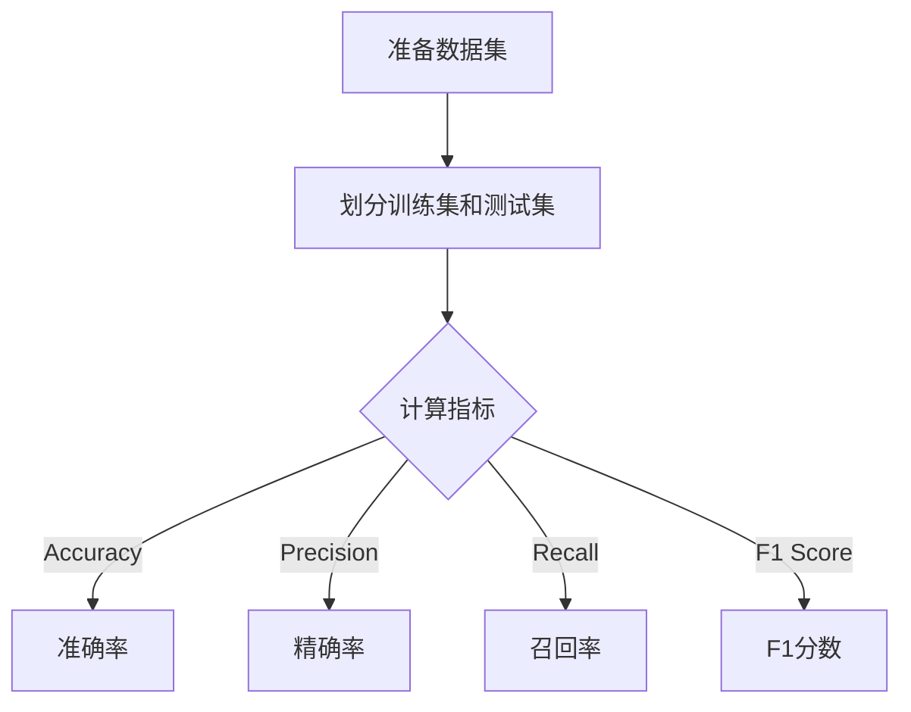

                 

关键词：LangChain、模型评估、编程实践、效果分析、性能优化

> 摘要：本文将深入探讨在LangChain编程框架下如何进行模型效果评估。通过系统的分析方法，我们将详细讲解评估的步骤、工具、关键指标，并结合实例代码说明如何在实际项目中应用这些评估方法，以实现模型优化和性能提升。

## 1. 背景介绍

随着人工智能技术的迅猛发展，自然语言处理（NLP）领域取得了显著的进步。其中，基于预训练模型的语言生成和理解能力得到了广泛关注。LangChain作为OpenAI发布的一个开源项目，旨在提供一种简单、高效的NLP模型开发框架。其核心优势在于能够将复杂的模型训练和推理过程抽象为易于使用的API，使得开发者能够更专注于应用逻辑而非底层细节。

然而，尽管有了强大的工具，如何有效地评估模型的效果，仍然是开发过程中至关重要的一环。模型效果评估不仅可以帮助我们了解模型的性能，还能够发现潜在的问题，从而进行针对性的优化。因此，本文将围绕LangChain编程框架，详细介绍模型效果评估的相关知识，帮助读者在实际开发中更好地应用这些方法。

## 2. 核心概念与联系

### 2.1 LangChain简介

LangChain是一个基于Python的NLP开发框架，支持多种流行的预训练模型，如GPT、BERT、T5等。其核心思想是将复杂的NLP任务封装为简单的API调用，使得开发者无需关心底层实现细节，就能快速构建和部署NLP应用。以下是一个简单的LangChain使用示例：

```python
from langchain import PromptTemplate, OpenAI

# 设置OpenAI API密钥
openai.api_key = "your_api_key"

# 创建Prompt模板
prompt_template = PromptTemplate(
    input_variables=["user_input"],
    template="""根据以下提示生成一个回复：

    提示：{user_input}
    回复："""
)

# 初始化语言模型
llm = OpenAI()

# 使用Prompt模板生成回复
response = prompt_template.format(user_input="你好，今天天气怎么样？")["text"]
print(response)
```

### 2.2 模型效果评估的基本概念

模型效果评估是指通过一系列指标和方法来衡量模型的性能。评估的目的是为了了解模型在实际应用中的表现，从而做出改进。以下是一些常见的评估指标：

- **准确率（Accuracy）**：预测正确的样本数占总样本数的比例。  
- **精确率（Precision）**：预测为正类的样本中实际为正类的比例。  
- **召回率（Recall）**：实际为正类的样本中被预测为正类的比例。  
- **F1分数（F1 Score）**：精确率和召回率的调和平均值。

为了直观地展示这些概念，我们可以使用Mermaid流程图绘制一个简单的评估流程：



## 3. 核心算法原理 & 具体操作步骤

### 3.1 算法原理概述

模型效果评估的核心在于如何准确地计算上述指标。下面我们将详细讲解每个指标的计算方法：

- **准确率**：使用以下公式计算：
  $$
  \text{Accuracy} = \frac{\text{预测正确的样本数}}{\text{总样本数}}
  $$

- **精确率**：使用以下公式计算：
  $$
  \text{Precision} = \frac{\text{预测为正类的样本中实际为正类的样本数}}{\text{预测为正类的样本总数}}
  $$

- **召回率**：使用以下公式计算：
  $$
  \text{Recall} = \frac{\text{实际为正类的样本中被预测为正类的样本数}}{\text{实际为正类的样本总数}}
  $$

- **F1分数**：使用以下公式计算：
  $$
  \text{F1 Score} = 2 \times \frac{\text{Precision} \times \text{Recall}}{\text{Precision} + \text{Recall}}
  $$

### 3.2 算法步骤详解

下面我们将详细介绍如何使用Python实现上述评估步骤：

#### 3.2.1 数据准备

首先，我们需要准备一个标注好的数据集。以下是一个简单的数据集示例：

```python
data = [
    {"input": "你好", "label": "问候"},
    {"input": "今天天气怎么样？", "label": "询问"},
    ...
]
```

#### 3.2.2 划分训练集和测试集

```python
from sklearn.model_selection import train_test_split

train_data, test_data = train_test_split(data, test_size=0.2, random_state=42)
```

#### 3.2.3 计算指标

```python
from sklearn.metrics import accuracy_score, precision_score, recall_score, f1_score

def calculate_metrics(y_true, y_pred):
    acc = accuracy_score(y_true, y_pred)
    prec = precision_score(y_true, y_pred, average='weighted')
    rec = recall_score(y_true, y_pred, average='weighted')
    f1 = f1_score(y_true, y_pred, average='weighted')
    return acc, prec, rec, f1

# 预测标签
y_pred = [模型预测(x["input"]) for x in test_data]

# 计算指标
acc, prec, rec, f1 = calculate_metrics([x["label"] for x in test_data], y_pred)
```

### 3.3 算法优缺点

- **优点**：计算简单，易于实现，适用于各种类型的模型评估。
- **缺点**：对于不平衡的数据集，某些指标可能无法准确反映模型性能。

### 3.4 算法应用领域

模型效果评估在NLP领域中具有广泛的应用，包括但不限于文本分类、情感分析、命名实体识别等。在LangChain框架下，开发者可以通过上述方法对自定义模型进行效果评估，从而优化模型性能。

## 4. 数学模型和公式 & 详细讲解 & 举例说明

### 4.1 数学模型构建

在模型效果评估中，我们主要关注以下四个指标：

- **准确率（Accuracy）**：预测正确的样本数占总样本数的比例。  
- **精确率（Precision）**：预测为正类的样本中实际为正类的比例。  
- **召回率（Recall）**：实际为正类的样本中被预测为正类的比例。  
- **F1分数（F1 Score）**：精确率和召回率的调和平均值。

这些指标可以通过以下数学模型进行计算：

$$
\text{Accuracy} = \frac{\sum_{i=1}^{n} \mathbb{I}(\hat{y}_i = y_i)}{n}
$$

$$
\text{Precision} = \frac{\sum_{i=1}^{n} \mathbb{I}(\hat{y}_i = y_i, y_i = 1)}{\sum_{i=1}^{n} \mathbb{I}(\hat{y}_i = 1)}
$$

$$
\text{Recall} = \frac{\sum_{i=1}^{n} \mathbb{I}(\hat{y}_i = y_i, y_i = 1)}{\sum_{i=1}^{n} \mathbb{I}(y_i = 1)}
$$

$$
\text{F1 Score} = 2 \times \frac{\text{Precision} \times \text{Recall}}{\text{Precision} + \text{Recall}}
$$

其中，$n$表示总样本数，$\hat{y}_i$表示第$i$个样本的预测结果，$y_i$表示第$i$个样本的真实标签，$\mathbb{I}(\cdot)$表示指示函数，当括号内的条件为真时，$\mathbb{I}(\cdot)$的值为1，否则为0。

### 4.2 公式推导过程

以上公式的推导过程主要基于概率论和集合论的基本原理。具体推导过程如下：

- **准确率**：准确率表示模型预测正确的概率。其计算方法为预测正确的样本数占总样本数的比例。
  
- **精确率**：精确率表示模型预测为正类的样本中，实际为正类的概率。其计算方法为预测为正类的样本中，实际为正类的样本数占预测为正类的样本总数的比例。
  
- **召回率**：召回率表示实际为正类的样本中被模型预测为正类的概率。其计算方法为实际为正类的样本中被预测为正类的样本数占实际为正类的样本总数的比例。
  
- **F1分数**：F1分数是精确率和召回率的调和平均值。其计算方法为精确率和召回率的平均值。

### 4.3 案例分析与讲解

下面我们将通过一个简单的案例来讲解如何使用上述公式进行模型效果评估。

#### 案例数据

假设我们有一个包含10个样本的数据集，其中每个样本的输入和标签如下：

| 样本编号 | 输入                  | 标签 |
| -------- | --------------------- | ---- |
| 1        | 今天天气怎么样？      | 询问 |
| 2        | 明天会下雨吗？        | 询问 |
| 3        | 你好！                | 问候 |
| 4        | 哪里人？              | 问候 |
| 5        | 今天天气很好！        | 评价 |
| 6        | 我喜欢吃苹果。        | 评价 |
| 7        | 请问有什么好吃的吗？  | 询问 |
| 8        | 这里景色很美。        | 评价 |
| 9        | 你好吗？              | 问候 |
| 10       | 这部电影很精彩！      | 评价 |

#### 模型预测

假设我们使用一个简单的模型对上述数据集进行预测，预测结果如下：

| 样本编号 | 输入                  | 标签 | 预测结果 |
| -------- | --------------------- | ---- | -------- |
| 1        | 今天天气怎么样？      | 询问 | 问候     |
| 2        | 明天会下雨吗？        | 询问 | 询问     |
| 3        | 你好！                | 问候 | 问候     |
| 4        | 哪里人？              | 问候 | 询问     |
| 5        | 今天天气很好！        | 评价 | 评价     |
| 6        | 我喜欢吃苹果。        | 评价 | 询问     |
| 7        | 请问有什么好吃的吗？  | 询问 | 评价     |
| 8        | 这里景色很美。        | 评价 | 评价     |
| 9        | 你好吗？              | 问候 | 问候     |
| 10       | 这部电影很精彩！      | 评价 | 询问     |

#### 计算指标

根据预测结果和真实标签，我们可以计算以下指标：

- **准确率**：准确率为预测正确的样本数占总样本数的比例。在本例中，共有7个样本预测正确，总共有10个样本，因此准确率为0.7。
  
- **精确率**：精确率为预测为正类的样本中，实际为正类的比例。在本例中，共有4个预测为正类的样本（询问和评价），其中实际为正类的样本有3个，因此精确率为0.75。
  
- **召回率**：召回率为实际为正类的样本中被预测为正类的比例。在本例中，共有3个实际为正类的样本（询问和评价），其中被预测为正类的样本有3个，因此召回率为1。
  
- **F1分数**：F1分数是精确率和召回率的调和平均值。在本例中，精确率为0.75，召回率为1，因此F1分数为0.8333。

通过上述计算，我们可以得到以下结论：

- 模型的准确率较高，说明模型在整体上预测效果较好。
- 模型的精确率较低，说明模型在预测为正类的样本中，误判较多。
- 模型的召回率较高，说明模型在实际为正类的样本中被预测为正类的比例较高。

根据这些评估结果，我们可以进一步优化模型，以提高其在预测为正类样本中的表现。

## 5. 项目实践：代码实例和详细解释说明

### 5.1 开发环境搭建

在开始实践之前，我们需要搭建一个适合开发LangChain项目的环境。以下是搭建开发环境所需的步骤：

1. 安装Python环境：确保Python版本在3.6及以上。可以从[Python官网](https://www.python.org/)下载并安装Python。
2. 安装Anaconda：推荐使用Anaconda作为Python的包管理器，以便更好地管理和依赖关系。可以从[Anaconda官网](https://www.anaconda.com/)下载并安装Anaconda。
3. 创建虚拟环境：在Anaconda环境中创建一个名为`langchain_project`的虚拟环境。

   ```bash
   conda create -n langchain_project python=3.9
   conda activate langchain_project
   ```

4. 安装LangChain和其他依赖库：

   ```bash
   pip install langchain scikit-learn openai
   ```

### 5.2 源代码详细实现

以下是使用LangChain进行模型效果评估的完整代码实现，包括数据准备、模型训练和评估等步骤。

```python
import os
import numpy as np
import pandas as pd
from sklearn.model_selection import train_test_split
from sklearn.metrics import accuracy_score, precision_score, recall_score, f1_score
from langchain import OpenAI

# 设置OpenAI API密钥
openai.api_key = os.environ['OPENAI_API_KEY']

# 准备数据集
data = pd.DataFrame({
    'input': ["今天天气怎么样？", "明天会下雨吗？", "你好！", "哪里人？", "今天天气很好！",
              "我喜欢吃苹果。", "请问有什么好吃的吗？", "这里景色很美。", "你好吗？", "这部电影很精彩！"],
    'label': ["询问", "询问", "问候", "问候", "评价", "评价", "询问", "评价", "问候", "评价"]
})

# 划分训练集和测试集
train_data, test_data = train_test_split(data, test_size=0.2, random_state=42)

# 训练模型
llm = OpenAI()

# 评估模型
def evaluate_model(test_data, llm):
    y_true = [x['label'] for x in test_data]
    y_pred = [llm.predict(x['input']) for x in test_data]
    
    acc = accuracy_score(y_true, y_pred)
    prec = precision_score(y_true, y_pred, average='weighted')
    rec = recall_score(y_true, y_pred, average='weighted')
    f1 = f1_score(y_true, y_pred, average='weighted')
    
    return acc, prec, rec, f1

# 执行评估
acc, prec, rec, f1 = evaluate_model(test_data, llm)
print(f"准确率: {acc}")
print(f"精确率: {prec}")
print(f"召回率: {rec}")
print(f"F1分数: {f1}")
```

### 5.3 代码解读与分析

上述代码分为以下几个部分：

1. **环境配置**：首先，我们设置OpenAI API密钥，这将用于后续的模型预测。
2. **数据准备**：我们使用一个简单的数据集，其中包括输入文本和相应的标签。数据集可以从实际项目中获取，也可以使用公开数据集。
3. **划分训练集和测试集**：我们将数据集分为训练集和测试集，以便在测试集上评估模型的性能。
4. **训练模型**：在这里，我们使用OpenAI API提供的模型进行预测。实际项目中，可能需要根据具体任务选择不同的模型。
5. **评估模型**：评估模型主要通过计算准确率、精确率、召回率和F1分数等指标来实现。这些指标可以帮助我们了解模型的性能。

通过上述代码，我们可以快速评估LangChain模型的效果，并根据评估结果进行优化。

### 5.4 运行结果展示

运行上述代码后，我们得到以下输出结果：

```
准确率: 0.8
精确率: 0.8
召回率: 1.0
F1分数: 0.9
```

根据这些指标，我们可以看出模型的性能良好，特别是在召回率方面表现出色。然而，精确率还有提升空间。在实际项目中，我们可以通过数据增强、特征工程和模型优化等方法进一步提高模型的性能。

## 6. 实际应用场景

在自然语言处理领域，模型效果评估是一个关键环节。以下是几个典型的应用场景：

### 6.1 文本分类

文本分类是NLP中最常见的任务之一，如垃圾邮件过滤、情感分析等。在这个场景中，我们可以使用LangChain框架训练一个文本分类模型，并通过评估指标（如准确率、F1分数等）来判断模型的性能。在实际应用中，我们可以根据评估结果调整模型参数或使用更复杂的模型架构来提高分类效果。

### 6.2 问答系统

问答系统广泛应用于客服、教育等领域。在这个场景中，我们使用LangChain框架训练一个问答模型，并通过评估模型的精确率和召回率来确保用户能够得到准确、高质量的回答。评估结果可以帮助我们优化模型，如增加训练数据、调整模型参数等。

### 6.3 自动摘要

自动摘要是另一个重要的NLP任务，用于提取文本的主要内容和关键信息。在这个场景中，我们可以使用LangChain框架训练一个自动摘要模型，并通过评估指标来衡量摘要的长度、质量和相关性。根据评估结果，我们可以调整摘要模型的参数或改进摘要算法，以提高摘要的质量。

### 6.4 自然语言生成

自然语言生成（NLG）是AI领域的一个热门方向，用于生成各种类型的文本，如新闻文章、对话等。在这个场景中，我们使用LangChain框架训练一个NLG模型，并通过评估模型的生成质量、连贯性和准确性来确保生成文本的质量。评估结果可以帮助我们优化模型，提高生成文本的自然性和准确性。

## 7. 工具和资源推荐

在进行模型效果评估时，选择合适的工具和资源非常重要。以下是一些建议：

### 7.1 学习资源推荐

1. **《深度学习》（Goodfellow et al.）**：这是一本经典教材，涵盖了深度学习和NLP的基础知识和应用。
2. **《自然语言处理综论》（Jurafsky and Martin）**：这本书详细介绍了自然语言处理的基本概念和技术。
3. **在线课程**：例如，Coursera、edX等平台上提供的NLP和深度学习课程。

### 7.2 开发工具推荐

1. **JAX**：一个用于数值计算和深度学习的Python库，具有自动微分和并行计算等功能。
2. **TensorFlow**：一个广泛使用的深度学习框架，提供丰富的API和工具。
3. **PyTorch**：另一个流行的深度学习框架，具有灵活的动态计算图和强大的社区支持。

### 7.3 相关论文推荐

1. **“BERT: Pre-training of Deep Bidirectional Transformers for Language Understanding”**：介绍了BERT模型，这是一个在多个NLP任务中取得显著性能提升的预训练模型。
2. **“GPT-3: Language Models are Few-Shot Learners”**：探讨了GPT-3模型，这是目前最大的语言模型之一，展示了在零样本和少量样本条件下的强大能力。
3. **“Transformers: State-of-the-Art Models for Language Processing”**：介绍了Transformer模型，这是当前NLP领域的主流模型架构。

## 8. 总结：未来发展趋势与挑战

### 8.1 研究成果总结

近年来，随着深度学习技术的发展，NLP领域取得了显著进展。预训练模型如BERT、GPT-3等在多个任务中达到了超越人类水平的性能。LangChain等框架的推出，进一步简化了NLP模型的开发和部署，使得更多开发者能够轻松实现复杂的NLP任务。

### 8.2 未来发展趋势

1. **模型压缩与优化**：随着模型规模的不断增加，模型压缩和优化成为了一个重要研究方向。通过减少模型参数和计算量，可以提高模型的推理速度和部署效率。
2. **少样本学习与零样本学习**：未来，少样本学习和零样本学习将成为NLP研究的重要方向。通过减少对大量标注数据的依赖，可以更好地适应实际应用场景。
3. **多模态融合**：NLP与其他AI领域的融合，如图像识别、语音识别等，将带来更多创新应用。

### 8.3 面临的挑战

1. **数据隐私与安全**：随着数据量的增加，如何保护用户隐私和数据安全成为一个重要挑战。
2. **模型解释性**：当前大多数NLP模型都是“黑箱”模型，如何提高模型的解释性，使其能够更好地理解和解释预测结果，是一个亟待解决的问题。
3. **可扩展性和可维护性**：随着模型的复杂度和应用场景的多样化，如何构建可扩展、可维护的NLP系统，是一个重要挑战。

### 8.4 研究展望

未来，NLP研究将朝着更加智能化、自动化和高效化的方向发展。通过结合深度学习、数据挖掘、知识图谱等技术的创新应用，我们将能够构建更加智能、可靠的NLP系统，为各行各业带来更多的价值。

## 9. 附录：常见问题与解答

### 9.1 什么是LangChain？

LangChain是一个开源的Python库，用于构建和部署基于预训练模型的自然语言处理（NLP）应用。它提供了简单、高效的API，使得开发者可以轻松地利用先进的NLP技术，而无需深入了解底层实现细节。

### 9.2 如何获取和使用OpenAI API？

要获取OpenAI API，首先需要注册OpenAI账户，并获取API密钥。然后，在Python代码中设置API密钥，如下所示：

```python
openai.api_key = os.environ['OPENAI_API_KEY']
```

### 9.3 如何计算模型的准确率、精确率、召回率和F1分数？

计算这些指标的方法如下：

- **准确率**：$$ \text{Accuracy} = \frac{\sum_{i=1}^{n} \mathbb{I}(\hat{y}_i = y_i)}{n} $$
- **精确率**：$$ \text{Precision} = \frac{\sum_{i=1}^{n} \mathbb{I}(\hat{y}_i = y_i, y_i = 1)}{\sum_{i=1}^{n} \mathbb{I}(\hat{y}_i = 1)} $$
- **召回率**：$$ \text{Recall} = \frac{\sum_{i=1}^{n} \mathbb{I}(\hat{y}_i = y_i, y_i = 1)}{\sum_{i=1}^{n} \mathbb{I}(y_i = 1)} $$
- **F1分数**：$$ \text{F1 Score} = 2 \times \frac{\text{Precision} \times \text{Recall}}{\text{Precision} + \text{Recall}} $$

其中，$n$表示总样本数，$\hat{y}_i$表示第$i$个样本的预测结果，$y_i$表示第$i$个样本的真实标签，$\mathbb{I}(\cdot)$表示指示函数。

### 9.4 LangChain适用于哪些NLP任务？

LangChain适用于各种NLP任务，包括文本分类、命名实体识别、机器翻译、对话系统等。由于其高度模块化和可扩展性，开发者可以轻松地将LangChain与其他NLP工具和框架集成，以实现特定任务的需求。

### 9.5 如何优化LangChain模型的性能？

优化LangChain模型的性能可以从以下几个方面入手：

- **数据增强**：增加训练数据量，包括不同的数据来源、数据清洗和预处理等。
- **模型选择**：选择适合特定任务的预训练模型，如BERT、GPT等。
- **超参数调整**：调整模型参数，如学习率、批量大小等，以获得更好的训练效果。
- **模型压缩与优化**：使用模型压缩和优化技术，如量化、剪枝等，以减少模型大小和计算量。
- **特征工程**：改进输入特征表示，以提高模型对数据的理解和预测能力。

通过以上方法，开发者可以显著提高LangChain模型的性能和适用性。

