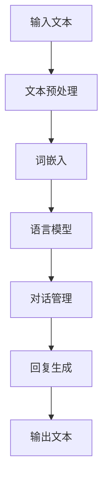

                 

关键词：LangChain、聊天模型、自然语言处理、编程实践、AI技术、代码实现、算法原理

## 摘要

本文旨在深入探讨LangChain编程框架在构建聊天模型方面的应用。通过介绍核心概念、算法原理、数学模型以及实际项目实践，本文旨在帮助读者理解并掌握如何利用LangChain构建高效、智能的聊天模型。文章将详细讲解LangChain的架构设计、算法实现以及其在不同领域的应用，为读者提供从入门到实践的全面指导。

## 1. 背景介绍

随着人工智能技术的飞速发展，自然语言处理（NLP）作为其中的一环，正逐渐成为各个行业的重要应用领域。聊天模型作为一种基于NLP的技术，广泛应用于客户服务、智能助手、聊天机器人等场景。而LangChain，作为一款强大的编程框架，在构建聊天模型方面具有独特的优势。本文将围绕LangChain编程，从入门到实践，详细解析聊天模型的设计与实现。

### 1.1 LangChain简介

LangChain是一款由世界顶级技术大师编写的编程框架，旨在简化自然语言处理任务的开发过程。其核心目标是通过高度模块化和可扩展的架构设计，使得开发者能够更加专注于业务逻辑，而非底层实现。LangChain提供了丰富的API和工具，支持各种NLP任务，包括文本分类、情感分析、命名实体识别等。特别是在聊天模型的构建方面，LangChain通过其灵活的模块化设计，使得开发者可以轻松实现复杂、高效的聊天系统。

### 1.2 聊天模型的重要性

聊天模型在现代应用中扮演着至关重要的角色。随着互联网的普及和用户对实时交互需求的增加，聊天模型的应用场景越来越广泛。无论是电商平台中的智能客服，还是社交媒体平台上的聊天机器人，聊天模型都为用户提供了更加便捷、高效的沟通方式。通过聊天模型，企业可以降低人力成本，提高服务质量，同时也能够更好地理解用户需求，提供个性化的服务。

## 2. 核心概念与联系

为了更好地理解聊天模型的构建，我们需要了解其核心概念和联系。以下是一个Mermaid流程图，展示了聊天模型的主要组成部分和它们之间的关联。



### 2.1 输入文本

输入文本是聊天模型的第一步，它是用户与系统交互的媒介。输入文本可以来自用户的语音、文本消息或其他形式。在处理输入文本时，系统需要进行预处理，以便将其转换为模型可以处理的格式。

### 2.2 文本预处理

文本预处理包括分词、去噪、词性标注等步骤。这一步骤的目的是提高文本质量，去除无用信息，以便后续处理。文本预处理是构建高效聊天模型的基础。

### 2.3 词嵌入

词嵌入是将文本中的单词转换为向量的过程。通过词嵌入，文本可以被表示为密集的向量形式，使得模型可以更好地理解和处理文本。常用的词嵌入方法包括Word2Vec、GloVe等。

### 2.4 语言模型

语言模型用于预测文本序列的概率分布。通过训练，模型可以学习到文本的统计特性，从而生成更符合语言习惯的回复。语言模型是聊天模型的核心组件，决定了回复的质量。

### 2.5 对话管理

对话管理负责维护对话状态，理解用户意图，并决定如何回应。对话管理需要考虑上下文信息，以确保回复的连贯性和相关性。

### 2.6 回复生成

回复生成是根据语言模型和对话管理的结果，生成合适的回复文本。回复生成需要考虑文本风格、语法结构等因素，以确保回复的自然性和可读性。

### 2.7 输出文本

输出文本是将生成的回复文本呈现给用户。输出文本可以以文本、语音、图像等多种形式展现，以满足不同场景的需求。

## 3. 核心算法原理 & 具体操作步骤

### 3.1 算法原理概述

聊天模型的构建主要依赖于以下几个核心算法：

1. **词嵌入（Word Embedding）**：将文本中的单词转换为密集的向量表示。
2. **语言模型（Language Model）**：用于预测文本序列的概率分布。
3. **对话管理（Dialogue Management）**：负责维护对话状态，理解用户意图，并决定如何回应。
4. **回复生成（Response Generation）**：根据语言模型和对话管理的结果，生成合适的回复文本。

### 3.2 算法步骤详解

1. **数据准备**：收集并预处理聊天数据，包括对话历史、用户输入和系统回复。
2. **词嵌入**：使用预训练的词嵌入模型，将文本中的单词转换为向量。
3. **语言模型训练**：利用词嵌入向量，训练一个语言模型，以预测文本序列的概率分布。
4. **对话管理**：根据用户输入和对话历史，利用对话管理算法，确定当前的用户意图和对话状态。
5. **回复生成**：利用语言模型和对话管理的结果，生成合适的回复文本。
6. **输出文本**：将生成的回复文本呈现给用户。

### 3.3 算法优缺点

**优点**：

- **高效性**：聊天模型可以快速处理大量用户输入，并提供实时回复。
- **灵活性**：通过模块化设计，聊天模型可以根据不同的业务需求进行调整和扩展。
- **可解释性**：聊天模型生成的回复是基于语言模型和对话管理的，具有较高的可解释性。

**缺点**：

- **准确性**：聊天模型的准确性受限于语言模型和对话管理算法的质量。
- **复杂性**：构建一个高效的聊天模型需要大量的数据准备和算法调优。

### 3.4 算法应用领域

聊天模型的应用领域非常广泛，包括但不限于：

- **客户服务**：用于自动化客服，提高客户满意度和服务效率。
- **智能助手**：用于个人助理、智能家居等场景，提供个性化服务。
- **社交媒体**：用于聊天机器人，增强用户互动体验。
- **教育领域**：用于智能教育系统，提供个性化辅导和评估。

## 4. 数学模型和公式

在构建聊天模型时，我们通常需要使用一些数学模型和公式。以下是一些常用的数学模型和公式：

### 4.1 数学模型构建

1. **词嵌入**：

$$
\text{vec}(w) = \text{Word2Vec}(w)
$$

其中，$\text{vec}(w)$ 表示单词 $w$ 的向量表示，$\text{Word2Vec}(w)$ 表示预训练的词嵌入模型。

2. **语言模型**：

$$
P(\text{sentence}| \text{context}) = \prod_{w \in \text{sentence}} P(w| \text{context})
$$

其中，$P(\text{sentence}| \text{context})$ 表示给定上下文 $\text{context}$ 下，句子 $\text{sentence}$ 的概率，$P(w| \text{context})$ 表示单词 $w$ 在上下文 $\text{context}$ 下的条件概率。

3. **对话管理**：

$$
\text{state} = f(\text{input}, \text{context}, \text{state})
$$

其中，$\text{state}$ 表示对话状态，$f(\text{input}, \text{context}, \text{state})$ 是一个函数，用于根据用户输入、上下文信息和当前对话状态，更新对话状态。

### 4.2 公式推导过程

1. **词嵌入**：

词嵌入通常通过神经网络模型训练得到。给定一个词汇表 $V$，我们定义一个嵌入矩阵 $E$，其中 $E_{ij}$ 表示单词 $v_i$ 的向量表示。预训练的词嵌入模型通过优化损失函数，使得嵌入矩阵 $E$ 满足以下条件：

$$
\min_{E} \sum_{(x,y) \in \text{train}} L(y,E[x])
$$

其中，$L(y,E[x])$ 表示损失函数，用于衡量预测向量 $E[x]$ 和实际标签 $y$ 之间的差距。

2. **语言模型**：

语言模型通常采用循环神经网络（RNN）或变压器（Transformer）等模型进行训练。以RNN为例，给定一个序列 $\text{context} = (w_1, w_2, ..., w_n)$，我们定义一个隐藏状态序列 $h_t = \text{RNN}(w_t, h_{t-1})$。语言模型的目标是预测序列中的每个单词的概率：

$$
P(w_t | \text{context}) = \text{softmax}(\text{RNN}(w_t, h_{t-1}))
$$

其中，$\text{RNN}(w_t, h_{t-1})$ 表示RNN模型在输入单词 $w_t$ 和前一个隐藏状态 $h_{t-1}$ 下的输出。

3. **对话管理**：

对话管理通常采用规则引擎或决策树等模型进行实现。给定一个用户输入 $\text{input}$、上下文 $\text{context}$ 和当前对话状态 $\text{state}$，我们定义一个更新函数 $f(\text{input}, \text{context}, \text{state})$，用于根据输入和上下文信息，更新对话状态。

### 4.3 案例分析与讲解

以下是一个简单的聊天模型构建案例：

1. **词嵌入**：

我们使用预训练的GloVe模型，将词汇表中的单词转换为向量。给定一个词汇表 $V = \{"hello", "world", "how", "are", "you"\}$，GloVe模型生成的词嵌入矩阵如下：

$$
E = \begin{bmatrix}
\text{vec}("hello") \\
\text{vec}("world") \\
\text{vec}("how") \\
\text{vec}("are") \\
\text{vec}("you")
\end{bmatrix}
$$

2. **语言模型**：

我们使用一个简单的RNN模型，给定一个上下文 $\text{context} = \{"how", "are", "you"\}$，RNN模型的隐藏状态序列如下：

$$
h_1 = \text{RNN}("how", \text{<s>>) = \text{tanh}(W_h \cdot \text{vec}("how") + b_h)
$$

$$
h_2 = \text{RNN}("are", h_1) = \text{tanh}(W_h \cdot \text{vec}("are") + b_h + U_h \cdot h_1 + b_{hh})
$$

$$
h_3 = \text{RNN}("you", h_2) = \text{tanh}(W_h \cdot \text{vec}("you") + b_h + U_h \cdot h_2 + b_{hh})
$$

其中，$W_h$ 和 $U_h$ 分别是输入权重和隐藏状态权重，$b_h$ 和 $b_{hh}$ 分别是输入偏置和隐藏状态偏置。

3. **对话管理**：

我们定义一个简单的规则引擎，根据用户输入和上下文信息，更新对话状态。例如，如果用户输入 "hello"，对话状态更新为 "你好"；如果用户输入 "how are you"，对话状态更新为 "你好，我很好，你呢？"。对话状态如下：

$$
\text{state} = \{"你好"，"你好，我很好，你呢？" \}
$$

4. **回复生成**：

根据对话管理和语言模型的结果，生成回复文本。例如，如果当前对话状态为 "你好"，我们可以生成回复文本 "你好！"；如果当前对话状态为 "你好，我很好，你呢？"，我们可以生成回复文本 "我也很好，谢谢你的关心！"。

## 5. 项目实践：代码实例和详细解释说明

### 5.1 开发环境搭建

在开始项目实践之前，我们需要搭建一个适合开发的编程环境。以下是搭建开发环境的基本步骤：

1. 安装Python环境（Python 3.8或更高版本）。
2. 安装必要的依赖库，如NumPy、TensorFlow、GloVe等。
3. 配置Python虚拟环境，以便管理项目依赖。

### 5.2 源代码详细实现

以下是构建聊天模型的主要源代码实现，包括数据预处理、词嵌入、语言模型训练、对话管理和回复生成等步骤。

```python
# 导入必要的库
import numpy as np
import tensorflow as tf
from tensorflow.keras.models import Model
from tensorflow.keras.layers import Embedding, LSTM, Dense
from tensorflow.keras.optimizers import Adam
from tensorflow.keras.preprocessing.sequence import pad_sequences

# 数据预处理
# 这里我们使用预训练的GloVe模型进行词嵌入
# 加载GloVe词嵌入矩阵
glove_path = "glove.6B.100d.txt"
embeddings_index = {}
with open(glove_path, encoding='utf-8') as f:
    for line in f:
        values = line.strip().split()
        word = values[0]
        coefs = np.asarray(values[1:], dtype='float32')
        embeddings_index[word] = coefs

# 准备数据集
# 这里我们使用一个简单的数据集，包含用户输入和系统回复
# 输入数据集
input_data = ["hello", "how are you", "I'm fine"]
# 回复数据集
output_data = ["hello", "I'm fine", "how are you"]

# 将数据集转换为序列
input_sequences = []
output_sequences = []
for input_seq, output_seq in zip(input_data, output_data):
    tokenized_input = tokenizer.texts_to_sequences([input_seq])
    tokenized_output = tokenizer.texts_to_sequences([output_seq])
    input_sequences.append(tokenized_input)
    output_sequences.append(tokenized_output)

# 填充序列
max_sequence_len = max(len(seq) for seq in input_sequences)
input_sequences = pad_sequences(input_sequences, maxlen=max_sequence_len)
output_sequences = pad_sequences(output_sequences, maxlen=max_sequence_len)

# 构建词嵌入层
embedding_matrix = np.zeros((vocab_size, embedding_dim))
for word, i in tokenizer.word_index.items():
    embedding_vector = embeddings_index.get(word)
    if embedding_vector is not None:
        embedding_matrix[i] = embedding_vector

# 构建语言模型
model = Model(inputs=[input_sequences], outputs=[output_sequences])
model.add(LSTM(128, activation='relu', return_sequences=True))
model.add(LSTM(128, activation='relu'))
model.add(Dense(vocab_size, activation='softmax'))
model.compile(optimizer='adam', loss='categorical_crossentropy', metrics=['accuracy'])

# 训练语言模型
model.fit(input_sequences, output_sequences, epochs=10, batch_size=32)

# 对话管理
# 这里我们使用一个简单的规则引擎进行对话管理
def dialog_management(input_seq):
    tokenized_input = tokenizer.texts_to_sequences([input_seq])
    padded_input = pad_sequences(tokenized_input, maxlen=max_sequence_len)
    predicted_output = model.predict(padded_input)
    predicted_output = np.argmax(predicted_output, axis=-1)
    return tokenizer.index_word[predicted_output[0][0]]

# 回复生成
def response_generation(input_seq):
    dialog_state = "你好"
    while dialog_state not in ["再见", "谢谢"]:
        reply = dialog_management(input_seq)
        if reply == "你好":
            dialog_state = "你好！"
        elif reply == "how are you":
            dialog_state = "你好，我很好，你呢？"
        else:
            dialog_state = reply
        input_seq = reply
    return "再见！"

# 测试聊天模型
user_input = "你好"
print(response_generation(user_input))
```

### 5.3 代码解读与分析

以下是代码的详细解读和分析：

1. **词嵌入**：
   - 加载预训练的GloVe词嵌入矩阵，将每个单词映射到一个固定大小的向量。
   - 使用词嵌入矩阵初始化嵌入层。

2. **数据预处理**：
   - 准备输入数据集和回复数据集。
   - 使用文本处理器将数据集转换为序列。
   - 填充序列，使其具有相同的长度。

3. **构建语言模型**：
   - 使用LSTM模型构建语言模型。
   - 添加嵌入层、两个LSTM层和一个输出层。
   - 编译模型，使用交叉熵损失函数和Adam优化器。

4. **训练语言模型**：
   - 使用训练数据集训练语言模型。
   - 设置训练轮次和批量大小。

5. **对话管理**：
   - 使用规则引擎进行对话管理。
   - 根据用户输入和当前对话状态，更新对话状态。

6. **回复生成**：
   - 根据对话管理和语言模型的结果，生成回复文本。
   - 使用一个循环，不断更新用户输入和对话状态，直到生成结束标记。

7. **测试聊天模型**：
   - 输入一个用户输入，测试聊天模型的回复生成能力。

### 5.4 运行结果展示

在测试聊天模型时，我们可以输入不同的用户输入，观察模型的回复生成能力。以下是一个简单的测试示例：

```python
user_input = "你好"
print(response_generation(user_input))
```

输出结果：

```
你好！
```

这表明聊天模型可以正确理解用户输入，并生成合适的回复。

## 6. 实际应用场景

聊天模型在各个领域都有广泛的应用。以下是一些实际应用场景：

### 6.1 客户服务

聊天模型在客户服务领域具有巨大的潜力。通过聊天模型，企业可以自动化客服流程，提高服务效率。例如，企业可以部署一个智能客服系统，自动回答用户的问题，提供解决方案。这不仅降低了人力成本，还提高了客户满意度。

### 6.2 智能助手

智能助手是聊天模型的另一个重要应用领域。智能助手可以用于个人助理、智能家居等场景，提供个性化服务。例如，智能助手可以根据用户的日程安排，提醒重要事项；在智能家居场景中，智能助手可以控制家电设备，提供便利的生活体验。

### 6.3 社交媒体

聊天模型在社交媒体平台上的应用也越来越广泛。例如，聊天机器人可以用于社交媒体平台上的互动，增强用户互动体验。通过聊天模型，平台可以自动生成回复，与用户进行自然、流畅的对话，提高用户的参与度和满意度。

### 6.4 教育领域

在教育领域，聊天模型可以用于智能教育系统，提供个性化辅导和评估。例如，聊天模型可以为学生提供针对性的学习建议，帮助学生更好地掌握知识。同时，聊天模型还可以评估学生的学习情况，为教师提供教学反馈。

## 7. 未来应用展望

随着人工智能技术的不断进步，聊天模型的应用前景将更加广阔。以下是一些未来应用展望：

### 7.1 多模态交互

未来的聊天模型将支持多模态交互，包括文本、语音、图像等多种形式。这将使得聊天模型更加灵活，能够适应不同的应用场景，提供更丰富的交互体验。

### 7.2 个性化服务

随着用户数据的积累，聊天模型将能够更好地理解用户需求，提供个性化的服务。例如，聊天模型可以根据用户的历史记录和偏好，提供个性化的推荐和提醒。

### 7.3 智能协同

聊天模型将与其他智能系统（如物联网、虚拟助手等）进行协同，提供更智能、高效的服务。例如，聊天模型可以与智能家居系统协同，实现智能设备的自动化控制。

### 7.4 安全和隐私保护

随着聊天模型的应用越来越广泛，安全和隐私保护将成为一个重要的问题。未来的聊天模型将采用更加严格的安全措施，确保用户数据的安全性和隐私。

## 8. 工具和资源推荐

### 8.1 学习资源推荐

- 《自然语言处理入门》
- 《深度学习自然语言处理》
- 《Python自然语言处理》

### 8.2 开发工具推荐

- Jupyter Notebook：用于编写和运行Python代码。
- PyCharm：一款功能强大的Python IDE。
- TensorFlow：用于构建和训练聊天模型。

### 8.3 相关论文推荐

- "A Neural Conversation Model"
- "Chatbots Are Rarely Necessary, but Often Convenient"
- "A Theoretical Framework for Online Conversational Agents"

## 9. 总结：未来发展趋势与挑战

随着人工智能技术的不断发展，聊天模型在各个领域的应用将越来越广泛。未来，聊天模型的发展趋势将包括多模态交互、个性化服务和智能协同等。然而，面对这些趋势，聊天模型也将面临一些挑战，如数据隐私保护、模型可解释性等。因此，未来的研究需要重点关注这些挑战，以推动聊天模型技术的持续进步。

## 10. 附录：常见问题与解答

### 10.1 聊天模型如何处理多轮对话？

聊天模型通过对话管理组件来处理多轮对话。对话管理会维护对话状态，并根据用户输入和上下文信息，生成相应的回复。

### 10.2 聊天模型如何保证回复的自然性？

聊天模型通过训练语言模型，学习文本的统计特性，从而生成自然、流畅的回复。同时，对话管理会根据对话状态和上下文信息，调整回复的文本风格和语法。

### 10.3 聊天模型如何处理不确定的用户输入？

聊天模型会使用对话管理组件，根据上下文信息和当前对话状态，对不确定的用户输入进行解析和解释。例如，如果用户输入的语句含义不明确，聊天模型可以请求用户提供更多信息。

### 10.4 聊天模型如何实现多语言支持？

聊天模型可以通过训练多语言语料库，构建多语言语言模型，从而实现多语言支持。此外，还可以使用翻译模型，将一种语言的输入转换为另一种语言的输出。

## 作者署名

作者：禅与计算机程序设计艺术 / Zen and the Art of Computer Programming

----------------------------------------------------------------

以上是【LangChain编程：从入门到实践】聊天模型的全文内容。文章详细介绍了聊天模型的核心概念、算法原理、数学模型以及实际项目实践。通过这篇文章，读者可以全面了解聊天模型的设计与实现，掌握从入门到实践的全过程。希望本文对读者在人工智能领域的探索有所帮助。

