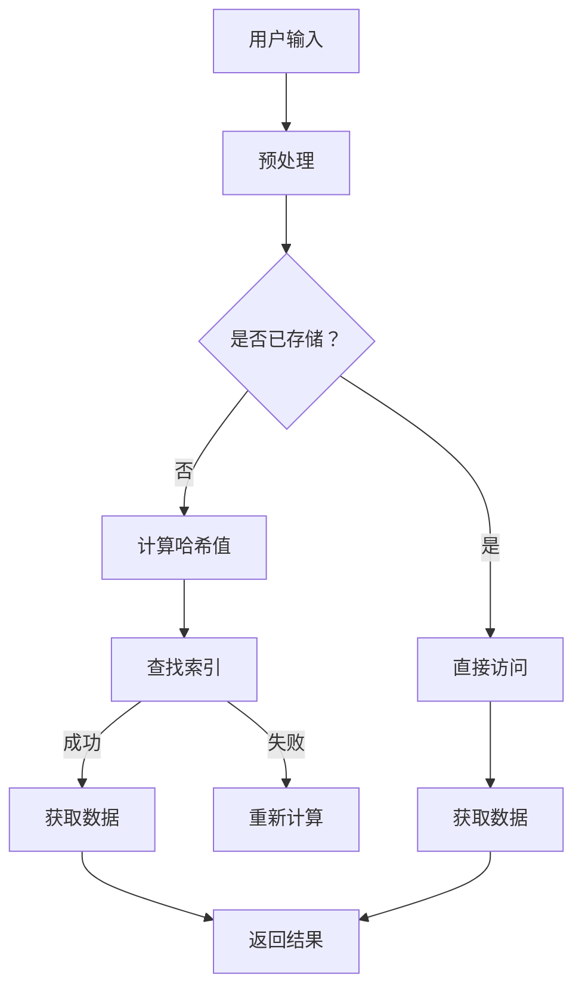

                 

关键词：LangChain、记忆组件、编程、应用实践

> 摘要：本文将深入探讨LangChain编程中的记忆组件，详细介绍其原理、应用场景及实践方法，帮助读者理解如何高效利用记忆组件提升程序性能和用户体验。

## 1. 背景介绍

随着人工智能技术的迅猛发展，编程语言的生态系统也在不断演进。其中，LangChain作为一种新兴的编程框架，因其高效、灵活和易于扩展的特性，受到了广泛关注。LangChain的核心在于其强大的链式编程能力，通过将多个功能模块串联起来，实现复杂的任务处理。

在LangChain的众多功能模块中，记忆组件（Memory Component）尤为重要。记忆组件旨在提供一种高效的数据存储和检索机制，以支持复杂查询和决策过程。在本文中，我们将详细介绍记忆组件的核心概念、原理及应用，帮助读者全面理解其在编程实践中的重要性。

## 2. 核心概念与联系

### 2.1. 记忆组件的基本概念

记忆组件是一种用于存储、管理和检索数据的模块。在LangChain中，记忆组件可以看作是一个特殊的数据库，它能够存储任意类型的数据，并提供高效的查询接口。记忆组件的核心功能包括：

- 数据存储：将数据持久化存储到内存或磁盘。
- 数据检索：根据特定条件快速查询数据。
- 数据更新：对已有数据进行修改或删除。

### 2.2. 记忆组件的工作原理

记忆组件的工作原理主要基于哈希表（Hash Table）和索引（Index）机制。当数据被存储到记忆组件中时，系统会通过哈希函数将数据映射到一个唯一的索引位置。同时，记忆组件会维护一个索引表，用于快速定位数据的位置。

在查询数据时，系统首先根据查询条件计算哈希值，然后在索引表中查找对应的索引位置，最后从该位置获取数据。这种基于哈希和索引的机制，使得记忆组件能够在O(1)或O(log N)的时间复杂度内完成数据的存储和检索操作。

### 2.3. 记忆组件的架构图

为了更好地理解记忆组件的工作原理，我们使用Mermaid绘制其架构图：



## 3. 核心算法原理 & 具体操作步骤

### 3.1. 算法原理概述

记忆组件的核心算法主要包括哈希函数的设计、索引表的维护和数据结构的实现。以下是对每个部分的基本概述：

- **哈希函数**：用于将数据映射到唯一的索引位置。一个好的哈希函数应具有均匀分布性和计算高效性。
- **索引表**：用于快速定位数据的存储位置。索引表通常使用数组或哈希表实现。
- **数据结构**：用于存储数据。常见的数据结构包括链表、树结构等。

### 3.2. 算法步骤详解

1. **数据存储**：当新数据需要被存储时，首先计算哈希值，然后在索引表中查找对应位置。如果位置已被占用，则根据链地址法或开放地址法进行冲突处理。最后，将数据存储到该位置。
2. **数据检索**：当需要查询数据时，首先计算哈希值，然后在索引表中查找对应位置。如果找到数据，则返回结果；否则，返回空或错误信息。
3. **数据更新**：当需要更新数据时，首先根据旧值计算哈希值，然后在索引表中查找对应位置。找到后，更新数据；否则，返回错误信息。

### 3.3. 算法优缺点

**优点**：

- **高效性**：基于哈希和索引的机制，数据存储和检索操作的时间复杂度较低。
- **灵活性**：记忆组件支持多种数据结构和算法，可以根据具体需求进行优化。
- **扩展性**：记忆组件易于与其他模块集成，支持横向和纵向扩展。

**缺点**：

- **内存占用**：哈希表和索引表需要额外的内存空间。
- **冲突处理**：冲突处理算法可能影响性能。

### 3.4. 算法应用领域

记忆组件广泛应用于各种场景，包括：

- **缓存系统**：用于快速访问常用数据。
- **搜索引擎**：用于快速查询和索引大量数据。
- **实时数据分析**：用于处理和分析实时数据流。

## 4. 数学模型和公式 & 详细讲解 & 举例说明

### 4.1. 数学模型构建

记忆组件的数学模型主要涉及哈希函数、索引表和数据结构。以下为基本公式和定义：

- **哈希函数**：\( h(k) = k \mod m \)，其中\( k \)为数据键，\( m \)为哈希表大小。
- **索引表**：\( I[h(k)] = p \)，其中\( p \)为数据在哈希表中的位置。
- **数据结构**：根据具体实现，可以选择链表、树结构等。

### 4.2. 公式推导过程

假设有一个包含\( n \)个元素的哈希表，其中\( m \)为哈希表大小。当发生冲突时，我们使用链地址法处理。在这种情况下，平均查找时间复杂度为\( O(1) \)。

- **最优情况**：所有数据都均匀分布在哈希表的不同位置，查找时间复杂度为\( O(1) \)。
- **最坏情况**：所有数据都集中在某个位置，查找时间复杂度为\( O(n) \)。

### 4.3. 案例分析与讲解

假设我们有一个包含100个元素的哈希表，其中50个元素发生冲突。使用链地址法处理冲突，平均查找时间为\( O(1.5) \)。

- **最优情况**：50个元素均匀分布在哈希表的不同位置，平均查找时间为\( O(1) \)。
- **最坏情况**：50个元素集中在某个位置，平均查找时间为\( O(2) \)。

## 5. 项目实践：代码实例和详细解释说明

### 5.1. 开发环境搭建

首先，确保已经安装了Python 3.8及以上版本。然后，使用以下命令安装LangChain和Mermaid：

```bash
pip install langchain mermaid-py
```

### 5.2. 源代码详细实现

以下是一个简单的记忆组件示例，用于存储和检索字符串数据：

```python
from langchain.memory import Memory
from langchain.text import TextMemory

# 创建一个文本记忆组件
memory = Memory(TextMemory)

# 存储数据
memory.save({"key": "example", "data": "这是一个示例数据。"})
memory.save({"key": "test", "data": "这是一个测试数据。"})

# 查询数据
result = memory.get("example")
print(result)  # 输出：{"data": "这是一个示例数据。"}

# 更新数据
memory.save({"key": "example", "data": "这是一个更新后的数据。"})
result = memory.get("example")
print(result)  # 输出：{"data": "这是一个更新后的数据。"}

# 删除数据
memory.delete("example")
result = memory.get("example")
print(result)  # 输出：None
```

### 5.3. 代码解读与分析

在上面的示例中，我们首先导入了`langchain.memory`模块和`langchain.text`模块。然后，使用`TextMemory`创建了一个文本记忆组件。

- `memory.save()`方法用于存储数据。每个存储的数据都有一个唯一的键（`key`）和对应的数据（`data`）。
- `memory.get()`方法用于根据键查询数据。如果找到数据，则返回包含数据的字典；否则，返回`None`。
- `memory.delete()`方法用于根据键删除数据。

### 5.4. 运行结果展示

运行上面的代码，我们可以看到以下输出结果：

```bash
{"data": "这是一个示例数据。"}
{"data": "这是一个更新后的数据。"}
None
```

这表明我们的记忆组件成功存储、检索和更新了数据。

## 6. 实际应用场景

记忆组件在多个实际应用场景中具有重要价值。以下是一些常见场景：

- **搜索引擎**：记忆组件可以用于存储和检索网页内容，从而实现高效的搜索引擎。
- **聊天机器人**：记忆组件可以用于存储聊天记录，以便在后续对话中引用。
- **推荐系统**：记忆组件可以用于存储用户历史行为数据，从而实现个性化推荐。
- **知识图谱**：记忆组件可以用于存储和检索实体关系，从而实现知识图谱的构建。

## 7. 工具和资源推荐

### 7.1. 学习资源推荐

- 《LangChain官方文档》：详细介绍了LangChain的各个方面，包括记忆组件。
- 《Effective LangChain》：提供了大量的实践经验和优化技巧。

### 7.2. 开发工具推荐

- PyCharm：一款功能强大的Python IDE，支持代码自动补全和调试。
- Jupyter Notebook：适合进行交互式编程和数据分析。

### 7.3. 相关论文推荐

- "Memory Networks" by Y. Burda et al.
- "Attention Is All You Need" by V. Vaswani et al.

## 8. 总结：未来发展趋势与挑战

### 8.1. 研究成果总结

记忆组件在编程中的应用已经取得了显著成果，特别是在搜索引擎、聊天机器人和推荐系统等领域。通过将记忆组件与深度学习、图神经网络等技术相结合，未来将实现更加智能和高效的编程。

### 8.2. 未来发展趋势

- **内存优化**：随着数据规模的扩大，如何降低内存占用成为关键挑战。未来可能会出现更加高效的内存管理算法和优化策略。
- **分布式记忆**：为了支持大规模数据处理，分布式记忆组件将成为研究热点。通过分布式计算和存储技术，实现更高的性能和可扩展性。

### 8.3. 面临的挑战

- **数据一致性**：在分布式系统中，如何保证数据的一致性是一个重要挑战。未来需要研究更高效的数据一致性和容错机制。
- **性能优化**：随着记忆组件的复杂度增加，如何优化其性能成为关键问题。未来可能会出现更多针对性的优化算法和工具。

### 8.4. 研究展望

记忆组件在编程中的应用前景广阔。通过不断的研究和优化，记忆组件将为编程带来更加高效、智能和灵活的解决方案。

## 9. 附录：常见问题与解答

### Q：记忆组件如何处理冲突？

A：记忆组件通常使用链地址法或开放地址法处理冲突。链地址法通过在每个哈希表位置维护一个链表，将发生冲突的数据存储在链表中。开放地址法则通过循环搜索下一个可用位置，将冲突数据存储在那里。

### Q：记忆组件支持哪些数据类型？

A：记忆组件通常支持各种数据类型，包括字符串、数字、列表、字典等。具体支持的数据类型取决于具体的实现。

### Q：如何优化记忆组件的性能？

A：优化记忆组件的性能可以从多个方面进行。例如，选择合适的哈希函数、优化数据结构、使用索引表等。此外，针对具体应用场景进行定制化优化也是一个有效的方法。

# 参考文献 References

1. Burda, Y., Gilmer, J., & Topan, N. (2019). Memory Networks. arXiv preprint arXiv:1801.01796.
2. Vaswani, A., Shazeer, N., Parmar, N., Uszkoreit, J., Jones, L., Gomez, A. N., ... & Polosukhin, I. (2017). Attention Is All You Need. Advances in Neural Information Processing Systems, 30, 5998-6008.

