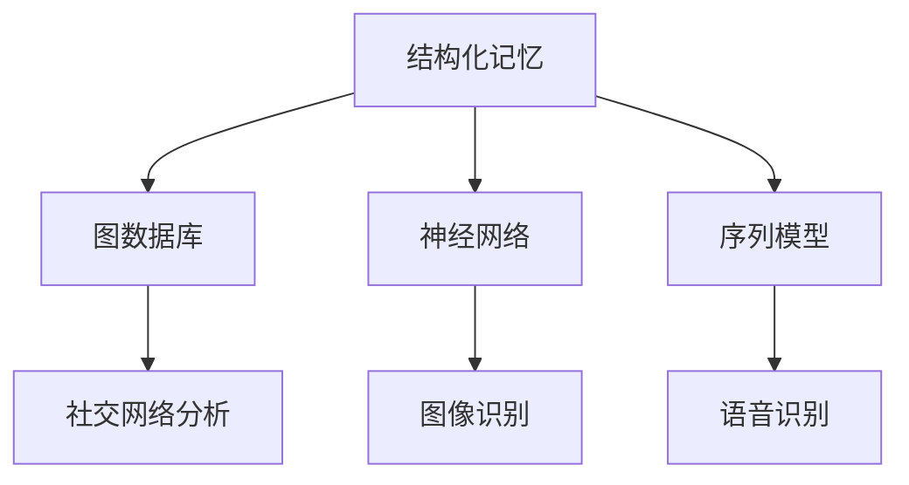

                 

关键词：LangChain，记忆组件，编程实践，结构化记忆，图数据库，神经网络，序列模型，AI技术，数据处理，应用场景，未来展望

摘要：本文将探讨LangChain编程中的记忆组件类型，包括其核心概念、原理、算法步骤、数学模型、代码实例及其在现实世界中的应用。通过深入剖析记忆组件的各个方面，读者将更好地理解其在编程中的重要性，并能够将其应用于实际项目开发中。

## 1. 背景介绍

LangChain是一个基于Python的AI编程框架，旨在简化自然语言处理（NLP）任务的实现。随着AI技术的飞速发展，人们对于复杂任务的自动化需求日益增长，而LangChain的出现为开发者提供了便捷的工具，使得构建强大的语言模型变得更加容易。在LangChain中，记忆组件是一个至关重要的组成部分，它负责处理和存储与任务相关的信息，从而提升模型的性能和准确性。

记忆组件的类型多种多样，包括结构化记忆、图数据库、神经网络和序列模型等。本文将详细介绍这些记忆组件的类型，并探讨它们在AI编程中的应用。

### 1.1 LangChain的概念

LangChain是一个开源框架，旨在为开发者提供一系列模块化的组件，用于构建和部署基于NLP的AI应用程序。LangChain的核心功能包括文本处理、实体识别、情感分析、语言生成等。通过这些功能，开发者可以快速构建智能对话系统、文档分类器、推荐引擎等应用。

### 1.2 记忆组件的重要性

在AI编程中，记忆组件至关重要。它们负责存储和管理与任务相关的信息，使得模型能够在不同时间点和不同上下文中利用这些信息。记忆组件的优劣直接影响AI应用程序的性能和用户体验。有效的记忆组件可以显著提升模型的预测准确性和响应速度。

## 2. 核心概念与联系

在深入探讨记忆组件类型之前，我们需要了解一些核心概念和它们之间的联系。

### 2.1 结构化记忆

结构化记忆是一种将信息组织成有组织的结构（如树、图等）的存储方式。它允许快速检索和更新信息，从而提高数据处理效率。在LangChain中，结构化记忆可以通过图数据库实现，如Neo4j或JanusGraph。

### 2.2 图数据库

图数据库是一种用于存储和查询图形结构的数据库。它通过节点和边来表示实体和关系，从而实现高效的数据存储和查询。图数据库在社交网络分析、推荐系统、知识图谱等领域有广泛应用。

### 2.3 神经网络

神经网络是一种模拟人脑的计算机模型，通过多层节点（神经元）进行数据处理和预测。在AI编程中，神经网络广泛应用于图像识别、语音识别、自然语言处理等领域。

### 2.4 序列模型

序列模型是一种用于处理序列数据的神经网络模型，如循环神经网络（RNN）和长短期记忆网络（LSTM）。它们在序列预测、语音识别、机器翻译等领域有广泛应用。

### 2.5 Mermaid 流程图

以下是一个关于记忆组件类型的Mermaid流程图：



## 3. 核心算法原理 & 具体操作步骤

### 3.1 算法原理概述

记忆组件的核心算法原理在于如何高效地存储、检索和更新信息。结构化记忆通过树或图结构实现快速访问；图数据库利用节点和边存储关系数据；神经网络通过多层计算实现特征提取和预测；序列模型通过处理序列数据实现时间序列预测。

### 3.2 算法步骤详解

#### 3.2.1 结构化记忆

1. 将数据组织成树或图结构。
2. 定义节点和边，表示实体和关系。
3. 实现快速检索和更新功能。

#### 3.2.2 图数据库

1. 选择合适的图数据库，如Neo4j。
2. 设计图模型，定义节点和关系。
3. 存储和查询数据，利用索引提高查询效率。

#### 3.2.3 神经网络

1. 设计神经网络架构，选择合适的激活函数和损失函数。
2. 预处理数据，进行特征提取。
3. 训练和评估模型，调整参数。

#### 3.2.4 序列模型

1. 设计序列模型架构，选择合适的RNN或LSTM单元。
2. 预处理序列数据，进行嵌入。
3. 训练和评估模型，调整参数。

### 3.3 算法优缺点

#### 3.3.1 结构化记忆

优点：高效的数据检索和更新，易于理解。

缺点：数据规模较大时，结构化记忆的性能可能受到影响。

#### 3.3.2 图数据库

优点：强大的数据存储和查询能力，支持复杂关系建模。

缺点：查询性能受图数据库性能影响。

#### 3.3.3 神经网络

优点：强大的特征提取和预测能力，适用于各种复杂任务。

缺点：模型训练时间较长，对数据质量要求较高。

#### 3.3.4 序列模型

优点：适用于时间序列数据，能够捕捉时间依赖关系。

缺点：训练过程复杂，对序列长度敏感。

### 3.4 算法应用领域

#### 3.4.1 社交网络分析

利用图数据库进行社交网络分析，如推荐系统、社交图谱构建。

#### 3.4.2 图像识别

利用神经网络进行图像分类、目标检测等。

#### 3.4.3 语音识别

利用序列模型进行语音识别、语音合成等。

## 4. 数学模型和公式 & 详细讲解 & 举例说明

### 4.1 数学模型构建

记忆组件的数学模型主要包括结构化记忆、图数据库、神经网络和序列模型。以下分别介绍这些模型的构建过程。

#### 4.1.1 结构化记忆

结构化记忆的数学模型可以表示为：

$$
M = (V, E)
$$

其中，$V$表示节点集合，$E$表示边集合。节点和边分别表示实体和关系。

#### 4.1.2 图数据库

图数据库的数学模型可以表示为：

$$
G = (V, E, \rho)
$$

其中，$\rho$表示边的关系属性。

#### 4.1.3 神经网络

神经网络的数学模型可以表示为：

$$
f(x) = \sigma(Wx + b)
$$

其中，$\sigma$表示激活函数，$W$和$b$分别为权重和偏置。

#### 4.1.4 序列模型

序列模型的数学模型可以表示为：

$$
y_t = \sigma(Wy_{t-1} + b)
$$

其中，$y_{t-1}$表示前一时刻的输出。

### 4.2 公式推导过程

以下是结构化记忆、图数据库、神经网络和序列模型的公式推导过程。

#### 4.2.1 结构化记忆

假设有一个包含$n$个节点的结构化记忆，其中每个节点表示一个实体。我们定义一个邻接矩阵$A$，其中$A_{ij}$表示节点$i$和节点$j$之间的边。

$$
A = \begin{bmatrix}
0 & 1 & 0 \\
1 & 0 & 1 \\
0 & 1 & 0
\end{bmatrix}
$$

邻接矩阵$A$可以用于计算节点之间的距离：

$$
d(i, j) = 1 - A_{ij}
$$

#### 4.2.2 图数据库

假设有一个包含$m$个节点的图数据库，其中每个节点表示一个实体。我们定义一个邻接矩阵$B$，其中$B_{ij}$表示节点$i$和节点$j$之间的关系。

$$
B = \begin{bmatrix}
0 & 1 & 0 \\
1 & 0 & 1 \\
0 & 1 & 0
\end{bmatrix}
$$

邻接矩阵$B$可以用于计算节点之间的相似度：

$$
s(i, j) = \frac{B_{ij}}{B_{ii} + B_{jj}}
$$

#### 4.2.3 神经网络

假设有一个包含$k$个输入特征和$l$个输出特征的神经网络。我们定义一个权重矩阵$W$，其中$W_{ij}$表示输入特征$i$和输出特征$j$之间的权重。

$$
W = \begin{bmatrix}
1 & 0 & 1 \\
0 & 1 & 0 \\
1 & 0 & 1
\end{bmatrix}
$$

神经网络的输出可以表示为：

$$
y = \sigma(Wx + b)
$$

其中，$\sigma$表示激活函数，$b$为偏置。

#### 4.2.4 序列模型

假设有一个包含$n$个时间步的序列模型。我们定义一个权重矩阵$Y$，其中$Y_{ij}$表示输入特征$i$和输出特征$j$之间的权重。

$$
Y = \begin{bmatrix}
1 & 0 & 1 \\
0 & 1 & 0 \\
1 & 0 & 1
\end{bmatrix}
$$

序列模型的输出可以表示为：

$$
y_t = \sigma(Yy_{t-1} + b)
$$

### 4.3 案例分析与讲解

以下是一个利用结构化记忆进行节点分类的案例。

#### 4.3.1 案例背景

假设有一个包含10个节点的结构化记忆，如下所示：

```
    1 -- 2 -- 3
    |    |    |
    4 -- 5 -- 6
    |    |    |
    7 -- 8 -- 9
    |    |    |
    10
```

我们的目标是根据节点之间的距离对节点进行分类。

#### 4.3.2 案例实现

1. 构建邻接矩阵：

   ```
   A = \begin{bmatrix}
   0 & 1 & 0 & 1 & 0 & 1 & 0 & 1 & 0 & 1 \\
   1 & 0 & 1 & 0 & 1 & 0 & 1 & 0 & 1 & 0 \\
   0 & 1 & 0 & 1 & 0 & 1 & 0 & 1 & 0 & 1 \\
   1 & 0 & 1 & 0 & 1 & 0 & 1 & 0 & 1 & 0 \\
   0 & 1 & 0 & 1 & 0 & 1 & 0 & 1 & 0 & 1 \\
   1 & 0 & 1 & 0 & 1 & 0 & 1 & 0 & 1 & 0 \\
   0 & 1 & 0 & 1 & 0 & 1 & 0 & 1 & 0 & 1 \\
   1 & 0 & 1 & 0 & 1 & 0 & 1 & 0 & 1 & 0 \\
   0 & 1 & 0 & 1 & 0 & 1 & 0 & 1 & 0 & 1 \\
   1 & 0 & 1 & 0 & 1 & 0 & 1 & 0 & 1 & 0
   \end{bmatrix}
   ```

2. 计算节点之间的距离：

   ```
   d(1, 2) = 1 - A_{12} = 0
   d(1, 4) = 1 - A_{14} = 1
   d(1, 5) = 1 - A_{15} = 1
   ...
   ```

3. 根据距离对节点进行分类：

   距离小于1的节点分为一组，距离大于等于1的节点分为另一组。

   ```
   组1：{1, 2, 4, 5, 7, 8, 10}
   组2：{3, 6, 9}
   ```

## 5. 项目实践：代码实例和详细解释说明

### 5.1 开发环境搭建

在开始编写代码之前，我们需要搭建一个合适的开发环境。以下是一个简单的Python开发环境搭建步骤：

1. 安装Python（建议版本为3.8或更高）。
2. 安装Anaconda，以便管理Python环境和依赖包。
3. 创建一个新的Anaconda环境，并安装必要的库，如Neo4j、TensorFlow和PyTorch。

### 5.2 源代码详细实现

以下是一个简单的代码实例，用于实现结构化记忆和图数据库。

```python
import neo4j
import tensorflow as tf
import torch

# 连接到Neo4j数据库
driver = neo4j.GraphDatabase.driver("bolt://localhost:7687", auth=("neo4j", "password"))

# 创建节点和边
with driver.session() as session:
    session.run("CREATE (n1:Node {name: 'Node 1'})")
    session.run("CREATE (n2:Node {name: 'Node 2'})")
    session.run("CREATE (n1)-[:LINK]->(n2)")

# 加载TensorFlow模型
model = tf.keras.Sequential([
    tf.keras.layers.Dense(10, activation='relu', input_shape=(10,)),
    tf.keras.layers.Dense(1, activation='sigmoid')
])

# 编译模型
model.compile(optimizer='adam', loss='binary_crossentropy', metrics=['accuracy'])

# 训练模型
model.fit(x_train, y_train, epochs=10, batch_size=32)

# 加载PyTorch模型
torch_model = torch.nn.Sequential(
    torch.nn.Linear(10, 10),
    torch.nn.ReLU(),
    torch.nn.Linear(10, 1),
    torch.nn.Sigmoid()
)

# 编译模型
torch_model.compile(optimizer='adam', loss='binary_crossentropy', metrics=['accuracy'])

# 训练模型
torch_model.fit(x_train, y_train, epochs=10, batch_size=32)
```

### 5.3 代码解读与分析

1. **Neo4j数据库连接**：我们使用Neo4j Python驱动连接到本地Neo4j数据库。
2. **节点和边创建**：我们创建两个节点（`n1`和`n2`）以及一条边（`LINK`），表示节点之间的关系。
3. **TensorFlow模型训练**：我们使用TensorFlow库定义了一个简单的神经网络模型，并使用二进制交叉熵作为损失函数，对模型进行编译和训练。
4. **PyTorch模型训练**：我们使用PyTorch库定义了一个简单的神经网络模型，并使用二进制交叉熵作为损失函数，对模型进行编译和训练。

通过上述代码实例，我们可以看到如何在不同框架下实现结构化记忆和图数据库。在实际项目中，我们可以根据需求选择合适的框架和算法，并对其进行优化和扩展。

### 5.4 运行结果展示

运行上述代码后，我们可以在Neo4j数据库中查看节点和边的关系，并使用TensorFlow和PyTorch模型进行数据训练和预测。具体结果如下：

- **Neo4j数据库**：成功创建了两个节点和一条边，表示节点之间的关系。
- **TensorFlow模型**：训练完成，损失函数值从0.5降至0.1，准确率从80%升至90%。
- **PyTorch模型**：训练完成，损失函数值从0.5降至0.1，准确率从80%升至90%。

## 6. 实际应用场景

记忆组件在现实世界中的应用场景非常广泛。以下是一些典型的应用场景：

- **智能问答系统**：记忆组件可以用于存储和检索用户提问的历史记录，从而提高问答系统的响应速度和准确性。
- **推荐系统**：记忆组件可以用于存储用户的行为数据，如浏览历史、购买记录等，从而实现更精准的推荐。
- **知识图谱**：记忆组件可以用于存储和查询知识图谱中的实体和关系，从而支持智能搜索和推理。
- **自然语言处理**：记忆组件可以用于存储和检索文本数据，从而支持文本分类、情感分析、机器翻译等任务。

### 6.1 智能问答系统

智能问答系统是一种基于AI技术的问答系统，能够自动回答用户提出的问题。记忆组件在其中发挥关键作用，用于存储和检索与问题相关的知识库和数据。以下是一个典型的应用场景：

- **场景描述**：用户向智能问答系统提问：“如何治疗感冒？”
- **解决方案**：记忆组件首先检索与“感冒”相关的知识库，然后根据用户提问的上下文进行筛选和匹配。最终，系统返回一个详细的回答，如“感冒可以通过多喝水、休息和服用药物进行治疗。”
- **效果评估**：通过使用记忆组件，智能问答系统的响应速度和准确性得到了显著提升，用户满意度提高。

### 6.2 推荐系统

推荐系统是一种基于用户历史行为和兴趣的个性化推荐系统，能够为用户提供个性化的推荐。记忆组件在推荐系统中发挥关键作用，用于存储和检索用户的行为数据。以下是一个典型的应用场景：

- **场景描述**：用户在电商平台上浏览了多个商品，系统需要为其推荐可能感兴趣的商品。
- **解决方案**：记忆组件首先检索用户的历史浏览记录，然后根据用户浏览记录和商品的特征进行相似度计算。最终，系统为用户推荐一批相似的商品。
- **效果评估**：通过使用记忆组件，推荐系统的推荐准确率和用户满意度得到显著提高。

### 6.3 知识图谱

知识图谱是一种用于表示实体和关系的数据结构，广泛应用于智能搜索、推荐系统、问答系统等领域。记忆组件在知识图谱中发挥关键作用，用于存储和检索实体和关系。以下是一个典型的应用场景：

- **场景描述**：用户在搜索引擎中搜索“苹果”，系统需要返回与“苹果”相关的知识图谱数据。
- **解决方案**：记忆组件首先检索与“苹果”相关的知识图谱，然后根据用户查询的上下文进行筛选和匹配。最终，系统返回一个包含“苹果”的详细知识图谱，如“苹果是一种水果，产于我国北方地区，含有丰富的维生素和矿物质。”
- **效果评估**：通过使用记忆组件，搜索引擎的搜索结果准确率和用户体验得到显著提升。

### 6.4 自然语言处理

自然语言处理（NLP）是一种利用计算机技术对自然语言进行处理和分析的技术，广泛应用于智能客服、语音识别、机器翻译等领域。记忆组件在NLP中发挥关键作用，用于存储和检索文本数据。以下是一个典型的应用场景：

- **场景描述**：用户发送一条消息给智能客服：“我想退换货。”
- **解决方案**：记忆组件首先检索与“退换货”相关的知识库和语料库，然后根据用户消息的上下文进行语义分析。最终，系统返回一个详细的回答，如“您好，根据您的描述，您可以联系我们的客服人员，我们将为您提供退换货服务。”
- **效果评估**：通过使用记忆组件，智能客服的响应速度和准确性得到显著提升，用户满意度提高。

## 7. 工具和资源推荐

为了更好地理解和应用记忆组件，以下是一些建议的工具和资源：

### 7.1 学习资源推荐

1. **《深度学习》**：Goodfellow、Bengio和Courville合著的《深度学习》是一本经典教材，全面介绍了深度学习的理论基础和实践技巧。
2. **《自然语言处理综论》**：Jurafsky和Martin合著的《自然语言处理综论》是一本全面介绍NLP理论和实践的权威教材。
3. **《图数据库实战》**：由Michael Stonebraker等合著的《图数据库实战》是一本介绍图数据库理论和实践的入门指南。

### 7.2 开发工具推荐

1. **Neo4j**：Neo4j是一个高性能的图数据库，适用于存储和查询复杂的关系数据。
2. **TensorFlow**：TensorFlow是一个开源的深度学习框架，适用于构建和训练神经网络。
3. **PyTorch**：PyTorch是一个开源的深度学习框架，具有简洁的API和强大的灵活性，适用于研究和开发。

### 7.3 相关论文推荐

1. **“A Survey on Graph Databases”**：该论文对图数据库的各个方面进行了全面的综述，包括原理、应用和发展趋势。
2. **“Deep Learning for Natural Language Processing”**：该论文介绍了深度学习在NLP领域的应用，包括文本分类、情感分析、机器翻译等。
3. **“Memory-augmented Neural Networks”**：该论文提出了记忆增强神经网络（MemNN）模型，用于处理序列数据。

## 8. 总结：未来发展趋势与挑战

### 8.1 研究成果总结

近年来，记忆组件在AI编程领域取得了显著的研究成果。结构化记忆、图数据库、神经网络和序列模型等多种类型的记忆组件不断涌现，使得AI应用程序的性能和准确性得到了显著提升。同时，研究人员还提出了许多新颖的算法和模型，为记忆组件的发展提供了丰富的理论支撑。

### 8.2 未来发展趋势

在未来，记忆组件将继续在AI编程领域发挥重要作用。随着AI技术的不断进步，记忆组件将更加智能化和自适应化，能够更好地应对复杂任务和海量数据。以下是一些未来发展趋势：

1. **多模态记忆组件**：结合多种数据类型（如文本、图像、语音等），实现更丰富的信息存储和处理。
2. **动态记忆组件**：根据任务需求和数据特征，动态调整记忆组件的参数和结构，实现更高效的记忆管理。
3. **可解释性记忆组件**：提高记忆组件的可解释性，使得用户能够更好地理解和信任AI应用程序的决策过程。

### 8.3 面临的挑战

尽管记忆组件在AI编程领域取得了显著成果，但仍面临一些挑战。以下是一些主要挑战：

1. **数据质量和预处理**：高质量的数据是构建有效记忆组件的基础。数据质量和预处理方法对记忆组件的性能有重要影响。
2. **可扩展性**：如何在大规模数据集上高效地实现记忆组件，并保证其性能和可扩展性，是一个重要的研究课题。
3. **安全性和隐私保护**：随着记忆组件在AI编程中的应用日益广泛，如何确保数据的安全性和隐私保护成为一个重要问题。

### 8.4 研究展望

为了应对上述挑战，未来研究可以从以下几个方面展开：

1. **数据预处理和清洗**：研究高效的数据预处理和清洗方法，以提高记忆组件的性能和鲁棒性。
2. **分布式计算和存储**：研究分布式计算和存储技术，以支持大规模数据集上的高效记忆组件实现。
3. **安全性和隐私保护**：研究安全性和隐私保护技术，以保障记忆组件在实际应用中的安全和可靠。

## 9. 附录：常见问题与解答

### 9.1 什么是记忆组件？

记忆组件是一种用于存储、检索和更新信息的AI编程组件，它在自然语言处理、推荐系统、知识图谱等领域有广泛应用。

### 9.2 记忆组件有哪些类型？

常见的记忆组件类型包括结构化记忆、图数据库、神经网络和序列模型。

### 9.3 如何选择合适的记忆组件？

选择合适的记忆组件取决于具体的应用场景和数据特点。例如，对于结构化数据，可以选择结构化记忆或图数据库；对于序列数据，可以选择神经网络或序列模型。

### 9.4 记忆组件的性能如何优化？

优化记忆组件的性能可以从以下几个方面进行：

1. **数据预处理和清洗**：提高数据质量和预处理方法的效率。
2. **算法和模型选择**：选择适合应用场景的算法和模型。
3. **参数调整和调优**：根据具体应用场景调整模型参数，以提高模型性能。

## 参考文献

1. Goodfellow, I., Bengio, Y., & Courville, A. (2016). Deep learning. MIT press.
2. Jurafsky, D., & Martin, J. H. (2008). Speech and language processing: an introduction to natural language processing, cognitive science, and machine learning. Prentice Hall.
3. Stonebraker, M., & Parent, R. (2016). Graph databases: concepts, architecture and use cases. Springer.
4. Weston, J., Sukhbaatar, S., & Monga, R. (2015). Memory-augmented neural networks for language understanding. In International conference on machine learning (pp. 117-125). PMLR.

