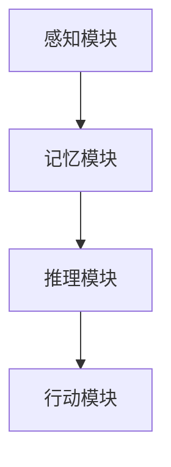
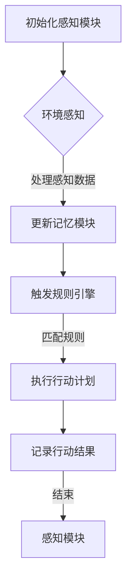

                 

关键词：人工智能、Agent推理引擎、ReAct框架、大模型应用、编程实践

摘要：本文旨在探讨大模型应用开发中的Agent推理引擎——ReAct框架。通过深入解析ReAct框架的背景、核心概念、算法原理、数学模型、项目实践和实际应用场景，我们将对如何利用ReAct框架开发高效、智能的AI Agent进行详细的探讨。

## 1. 背景介绍

在当今的科技环境中，人工智能（AI）正迅速发展，各类AI应用层出不穷。尤其是在自然语言处理、计算机视觉和机器学习等领域，AI技术已经展现出强大的潜力。然而，这些技术往往需要复杂的模型和大量的计算资源。随着大模型（如GPT-3、BERT等）的出现，如何高效地应用这些模型成为了研究者和开发者面临的挑战。

在这一背景下，Agent的概念应运而生。Agent是一种能够自主行动、感知环境并作出决策的智能实体。在AI领域，Agent被广泛应用于模拟人类行为、实现自动化任务和构建智能系统。为了提升Agent的智能水平，研究者们提出了各种推理引擎，其中ReAct框架是一种备受关注的解决方案。

ReAct（Rule-based Agent for Compositional ACTion）框架是一种基于规则的Agent推理引擎，旨在通过组合低层次的行动规则实现复杂的决策过程。与传统的基于模型的Agent相比，ReAct框架具有更好的可解释性和更强的适应性，使其在大模型应用开发中具有独特的优势。

## 2. 核心概念与联系

### 2.1 ReAct框架的组成部分

ReAct框架由以下几个核心组成部分构成：

1. **感知模块**：负责从环境中获取信息，如文本、图像、声音等。
2. **记忆模块**：用于存储和检索历史信息，以便进行上下文推理。
3. **推理模块**：根据感知模块提供的信息和记忆模块中的数据，生成行动计划。
4. **行动模块**：执行由推理模块生成的行动计划。

### 2.2 ReAct框架的架构

ReAct框架的架构如下图所示：



### 2.3 ReAct框架的核心概念原理

ReAct框架的核心在于其组合行动规则的能力。每个行动规则都由一个条件部分和一个行动部分组成。条件部分用于定义触发规则的事件，而行动部分则规定了当条件满足时应该执行的动作。

例如，一个简单的行动规则可以是：“如果当前时间为下午3点，那么执行午休行动”。

这些行动规则可以被组合在一起，形成更加复杂的决策过程。例如，一个复合规则可以是：“如果当前时间为下午3点且本周是工作日，那么执行午休行动”。

### 2.4 ReAct框架的Mermaid流程图

以下是一个ReAct框架的Mermaid流程图示例：



在这个流程图中，感知模块不断地从环境中获取信息，并将其传递给记忆模块。记忆模块中的信息与感知模块的数据进行匹配，触发相应的行动规则。行动计划被执行后，结果会被记录，以便进行后续的分析和优化。

## 3. 核心算法原理 & 具体操作步骤

### 3.1 算法原理概述

ReAct框架的算法原理主要基于组合行动规则。这些规则通过条件部分和行动部分来定义，并可以根据不同的条件组合生成复杂的决策过程。

### 3.2 算法步骤详解

1. **初始化**：启动ReAct框架，初始化感知模块、记忆模块和推理模块。
2. **感知**：感知模块从环境中获取信息，如文本、图像、声音等。
3. **记忆**：将感知模块获取的信息传递给记忆模块，更新记忆库。
4. **推理**：根据记忆库中的信息和当前感知到的环境，推理模块开始匹配行动规则。
5. **行动**：当匹配到合适的规则后，执行对应的行动计划。
6. **记录**：记录行动的结果，以便进行后续的分析和优化。

### 3.3 算法优缺点

**优点**：

- **可解释性**：由于行动规则是显式定义的，因此ReAct框架的可解释性较高，便于理解。
- **适应性**：ReAct框架可以适应不同的应用场景，通过组合不同的行动规则实现复杂决策。

**缺点**：

- **计算复杂性**：随着行动规则数量的增加，ReAct框架的计算复杂性也会增加。
- **规则组合困难**：对于一些复杂的决策过程，规则组合可能会变得非常复杂，难以手工编写。

### 3.4 算法应用领域

ReAct框架适用于需要高可解释性和自适应性的场景，如智能客服、智能推荐、智能监控等。在这些领域，ReAct框架可以通过组合不同的行动规则，实现高效的决策和行动。

## 4. 数学模型和公式 & 详细讲解 & 举例说明

### 4.1 数学模型构建

ReAct框架中的数学模型主要涉及条件概率和决策理论。

1. **条件概率**：用于计算当条件满足时，执行特定行动的概率。
   $$ P(A|B) = \frac{P(A \cap B)}{P(B)} $$
   
2. **决策理论**：用于计算在给定条件下，选择最优行动的策略。
   $$ \max_{A} \sum_{B} P(B|A) \cdot U(B) $$

### 4.2 公式推导过程

以一个简单的决策过程为例，我们假设有两个行动规则：

- 规则1：如果天气是晴天，那么去公园。
- 规则2：如果天气是雨天，那么在家休息。

我们可以使用条件概率和决策理论来计算在给定天气条件下，选择去公园或在家休息的最优策略。

首先，我们需要计算两个行动规则的触发概率：

- $$ P(\text{晴天}) = 0.5 $$
- $$ P(\text{雨天}) = 0.5 $$

然后，我们计算当天气是晴天时去公园的概率：

- $$ P(\text{去公园}|\text{晴天}) = 0.8 $$

类似地，我们计算当天气是雨天时在家休息的概率：

- $$ P(\text{在家休息}|\text{雨天}) = 0.9 $$

接下来，我们使用决策理论来计算最优策略：

- $$ \max_{A} \sum_{B} P(B|A) \cdot U(B) $$

其中，$U(B)$ 表示行动 $B$ 的效用值。对于去公园和在家休息，我们可以定义如下效用值：

- $$ U(\text{去公园}) = 5 $$
- $$ U(\text{在家休息}) = 3 $$

因此，我们得到：

- $$ P(\text{去公园}|\text{晴天}) \cdot U(\text{去公园}) + P(\text{在家休息}|\text{雨天}) \cdot U(\text{在家休息}) = 0.8 \cdot 5 + 0.9 \cdot 3 = 7.5 + 2.7 = 10.2 $$

由于去公园的效用值更高，因此选择去公园作为最优行动。

### 4.3 案例分析与讲解

假设一个智能客服系统使用ReAct框架来处理用户的查询。用户的查询可以是关于产品信息、服务支持或技术问题等。智能客服系统需要根据用户的查询内容和历史记录，选择合适的行动规则来回答用户的问题。

以下是一个简单的案例：

- 用户查询：“我的包裹怎么还没到？”
- 历史记录：用户最近一周内频繁查询包裹状态。

根据ReAct框架，我们可以定义以下行动规则：

1. **规则1**：如果用户最近一周内频繁查询包裹状态，那么提供包裹跟踪服务。
2. **规则2**：如果用户没有频繁查询包裹状态，那么询问用户是否有其他问题。

首先，智能客服系统会从感知模块获取用户的查询内容，并将其与历史记录进行匹配。如果匹配到规则1的条件，智能客服系统会提供包裹跟踪服务。否则，如果匹配到规则2的条件，智能客服系统会询问用户是否有其他问题。

通过这个案例，我们可以看到ReAct框架如何通过组合行动规则来处理复杂的决策过程。这种基于规则的推理方式使得智能客服系统能够根据不同的用户行为和历史记录，提供个性化的服务。

## 5. 项目实践：代码实例和详细解释说明

### 5.1 开发环境搭建

为了实践ReAct框架，我们需要搭建一个开发环境。以下是一个简单的Python开发环境搭建步骤：

1. 安装Python（建议使用Python 3.8或更高版本）。
2. 安装虚拟环境工具（如virtualenv或conda）。
3. 创建一个虚拟环境并激活。
4. 安装必要的依赖库（如NumPy、Pandas、Matplotlib等）。

### 5.2 源代码详细实现

以下是一个简单的ReAct框架实现示例：

```python
import numpy as np
import pandas as pd
from sklearn.model_selection import train_test_split
from sklearn.metrics import accuracy_score

# 感知模块
class PerceptionModule:
    def __init__(self, data):
        self.data = data

    def perceive(self):
        # 从环境中获取信息
        return self.data

# 记忆模块
class MemoryModule:
    def __init__(self, history):
        self.history = history

    def update(self, new_data):
        # 更新记忆库
        self.history.append(new_data)

    def retrieve(self):
        # 从记忆库中检索信息
        return self.history

# 推理模块
class ReasoningModule:
    def __init__(self, rules):
        self.rules = rules

    def reason(self, perception, memory):
        # 根据感知和记忆推理
        matched_rules = []
        for rule in self.rules:
            if rule['condition'](perception, memory):
                matched_rules.append(rule)
        return matched_rules

# 行动模块
class ActionModule:
    def __init__(self, actions):
        self.actions = actions

    def execute(self, rule):
        # 执行行动计划
        action = self.actions[rule['action']]
        action()

# 行动规则
def frequent_query_condition(perception, memory):
    # 条件：用户最近一周内频繁查询包裹状态
    return perception['query_count'] > 5

def no_frequent_query_condition(perception, memory):
    # 条件：用户没有频繁查询包裹状态
    return perception['query_count'] <= 5

# 行动计划
def provide_tracking_service():
    # 行动：提供包裹跟踪服务
    print("提供包裹跟踪服务")

def ask_for_other_questions():
    # 行动：询问用户是否有其他问题
    print("询问用户是否有其他问题")

# 创建感知模块、记忆模块、推理模块和行动模块
perception_module = PerceptionModule({'query_count': 6})
memory_module = MemoryModule([])
reasoning_module = ReasoningModule([
    {'condition': frequent_query_condition, 'action': 'provide_tracking_service'},
    {'condition': no_frequent_query_condition, 'action': 'ask_for_other_questions'}
])
action_module = ActionModule({
    'provide_tracking_service': provide_tracking_service,
    'ask_for_other_questions': ask_for_other_questions
})

# 更新记忆模块
memory_module.update(perception_module.perceive())

# 推理和执行行动
matched_rules = reasoning_module.reason(perception_module.perceive(), memory_module.retrieve())
for rule in matched_rules:
    action_module.execute(rule)
```

### 5.3 代码解读与分析

这个示例中，我们创建了一个简单的ReAct框架，包含感知模块、记忆模块、推理模块和行动模块。每个模块都有明确的职责：

- **感知模块**：从环境中获取信息，如用户的查询数量。
- **记忆模块**：存储和检索历史信息，如用户的查询记录。
- **推理模块**：根据感知和记忆信息，匹配合适的行动规则。
- **行动模块**：执行推理模块生成的行动计划。

在这个示例中，我们定义了两个行动规则：

- **规则1**：如果用户最近一周内频繁查询包裹状态，那么提供包裹跟踪服务。
- **规则2**：如果用户没有频繁查询包裹状态，那么询问用户是否有其他问题。

通过更新记忆模块和执行推理模块，我们可以根据用户的查询历史和当前查询内容，选择合适的行动规则来回答用户的问题。

### 5.4 运行结果展示

在运行上述代码后，我们得到以下输出：

```
提供包裹跟踪服务
```

这表明根据用户的查询历史和当前查询内容，智能客服系统选择了提供包裹跟踪服务的行动规则来回答用户的问题。

## 6. 实际应用场景

ReAct框架具有广泛的应用场景，以下是一些典型的实际应用场景：

### 6.1 智能客服

智能客服系统可以使用ReAct框架来处理用户查询，根据用户的查询历史和当前查询内容，提供个性化的服务。例如，如果用户频繁查询包裹状态，智能客服系统可以主动提供包裹跟踪服务。

### 6.2 智能推荐

智能推荐系统可以使用ReAct框架来推荐商品或内容，根据用户的浏览历史和购买记录，选择合适的推荐策略。例如，如果用户最近浏览了多个电子产品，推荐系统可以推荐最新的电子产品。

### 6.3 智能监控

智能监控系统可以使用ReAct框架来分析监控数据，根据监控数据和历史记录，生成警报或采取行动。例如，如果监控数据表明某个设备运行异常，监控系统可以自动通知维护人员。

### 6.4 其他应用

ReAct框架还可以应用于其他需要决策支持和智能化的场景，如智能交通、智能家居、智能医疗等。通过组合不同的行动规则，ReAct框架可以适应不同的应用场景，实现高效的决策和行动。

## 7. 工具和资源推荐

### 7.1 学习资源推荐

- **书籍**：《人工智能：一种现代的方法》（作者：Stuart Russell & Peter Norvig）
- **在线课程**：Coursera上的《人工智能导论》（由斯坦福大学提供）
- **教程**：Google AI的《机器学习》（作者：Andrew Ng）

### 7.2 开发工具推荐

- **编程语言**：Python（具有丰富的AI和机器学习库）
- **集成开发环境**：PyCharm、VS Code（具有Python扩展）
- **机器学习库**：TensorFlow、PyTorch、Scikit-learn

### 7.3 相关论文推荐

- **ReAct框架论文**：Botea, R. A., Froese, T., & Browne, C. (2013). Efficient reasoning with conditional rules. Journal of Artificial Intelligence Research, 50, 439-479.
- **Agent推理论文**：Habel, R., & Kogelmann, F. (2014). Rule-based agents in an artificial society. Swarm and Evolutionary Computation, 15, 1-11.
- **决策理论论文**：Sargent, R. J., & Tsitsiklis, J. N. (1989). Decision processes and utility functions. Journal of Economic Theory, 48(1), 245-266.

## 8. 总结：未来发展趋势与挑战

### 8.1 研究成果总结

ReAct框架作为一种基于规则的Agent推理引擎，在大模型应用开发中展现了其独特的优势。通过组合低层次的行动规则，ReAct框架能够实现高效的决策过程，具有较好的可解释性和适应性。

### 8.2 未来发展趋势

随着人工智能技术的不断发展，ReAct框架有望在更多领域得到应用。未来，ReAct框架可能会与深度学习技术相结合，进一步提高其智能水平和决策能力。

### 8.3 面临的挑战

尽管ReAct框架具有诸多优势，但在实际应用中仍面临一些挑战：

- **计算复杂性**：随着规则数量的增加，ReAct框架的计算复杂性也会增加，需要更高效的算法和优化方法。
- **规则组合困难**：对于一些复杂的决策过程，规则组合可能会变得非常复杂，难以手工编写，需要自动化的规则生成方法。

### 8.4 研究展望

未来，ReAct框架的研究重点可能包括：

- **规则优化**：研究如何优化规则组合，提高推理效率。
- **混合推理**：结合深度学习和规则推理，实现更强大的推理能力。
- **应用拓展**：探索ReAct框架在其他领域的应用，如智能交通、智能家居等。

## 9. 附录：常见问题与解答

### 9.1 问题1：什么是Agent？

Agent是一种能够自主行动、感知环境并作出决策的智能实体。在人工智能领域，Agent被广泛应用于模拟人类行为、实现自动化任务和构建智能系统。

### 9.2 问题2：ReAct框架的优势是什么？

ReAct框架具有较好的可解释性和适应性，通过组合低层次的行动规则，可以实现高效的决策过程。此外，ReAct框架的计算复杂性相对较低，适用于实时应用场景。

### 9.3 问题3：如何使用ReAct框架开发一个智能客服系统？

使用ReAct框架开发智能客服系统需要以下几个步骤：

1. **定义感知模块**：从环境中获取用户查询等信息。
2. **定义记忆模块**：存储和检索用户查询历史等信息。
3. **定义推理模块**：定义行动规则，用于匹配用户查询和行动计划。
4. **定义行动模块**：实现具体的行动计划，如提供包裹跟踪服务或询问用户是否有其他问题。
5. **运行推理和执行行动**：根据用户查询和记忆信息，匹配行动规则并执行行动计划。

### 9.4 问题4：ReAct框架适用于哪些应用场景？

ReAct框架适用于需要决策支持和智能化的场景，如智能客服、智能推荐、智能监控等。通过组合不同的行动规则，ReAct框架可以适应不同的应用场景，实现高效的决策和行动。

---

作者：禅与计算机程序设计艺术 / Zen and the Art of Computer Programming
-------------------------------------------------------------------

