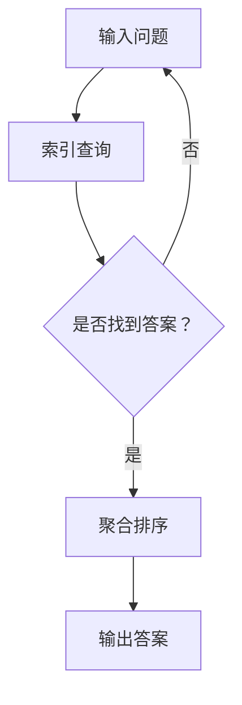

                 

关键词：大模型应用、LlamaIndex、RAG、AI开发、问答系统、知识图谱

摘要：本文旨在探讨如何利用LlamaIndex和基于RAG（Recall-Aggregation）的架构来开发强大的AI问答系统。我们将详细解析LlamaIndex的工作原理，介绍RAG的算法机制，并展示如何将这两个技术结合起来构建高效的AI Agent。

## 1. 背景介绍

随着深度学习技术的发展，大模型在自然语言处理（NLP）领域取得了显著成果。然而，如何有效管理大模型中的海量知识，并快速准确地回答用户的问题，成为了一个亟待解决的问题。LlamaIndex和基于RAG的AI架构为此提供了新的解决方案。

### 1.1 LlamaIndex

LlamaIndex是一个开源项目，旨在构建高效的知识检索系统。它通过将大模型中的文本数据分解成可检索的索引，实现了快速问答。LlamaIndex支持多种数据源，包括文本文件、数据库和Web页面，具有高度的可扩展性和灵活性。

### 1.2 RAG

RAG（Recall-Aggregation）是一种基于矩阵分解和聚类的方法，用于改进问答系统的答案质量。RAG的核心思想是通过大规模检索候选答案，然后使用聚合算法对它们进行筛选和排序，从而提高答案的准确性和相关性。

## 2. 核心概念与联系

### 2.1 大模型索引机制

LlamaIndex的核心机制是将大模型中的文本数据分解成词元（Token），并对这些词元建立索引。通过索引，系统能够快速定位到包含特定词汇的文本片段。

### 2.2 RAG算法原理

RAG算法分为两个阶段：检索和聚合。检索阶段利用大规模检索模型从海量数据中提取候选答案；聚合阶段通过计算候选答案的相关性，对它们进行排序和筛选。

### 2.3 Mermaid流程图

下面是一个简单的Mermaid流程图，展示了LlamaIndex和RAG的结合：



## 3. 核心算法原理 & 具体操作步骤

### 3.1 算法原理概述

LlamaIndex利用倒排索引实现快速文本查询，RAG则通过矩阵分解和聚类算法筛选和排序候选答案。

### 3.2 算法步骤详解

1. **索引构建**：首先，使用LlamaIndex对大模型中的文本数据进行索引构建。
2. **检索阶段**：输入问题后，系统利用索引快速检索相关文本片段。
3. **聚合阶段**：对检索到的文本片段进行聚类和排序，筛选出最高相关性的答案。
4. **输出结果**：最终输出排序后的答案。

### 3.3 算法优缺点

**优点**：
- 高效的索引构建和查询速度。
- 通过聚合算法提高了答案的准确性和相关性。

**缺点**：
- 需要大量计算资源进行索引构建和矩阵分解。
- 可能存在一定的延迟，尤其在处理大量查询时。

### 3.4 算法应用领域

LlamaIndex和RAG的结合在问答系统、搜索引擎、智能客服等领域具有广泛的应用前景。

## 4. 数学模型和公式 & 详细讲解 & 举例说明

### 4.1 数学模型构建

LlamaIndex的数学模型主要涉及倒排索引和向量空间模型。倒排索引是一种数据结构，用于快速查询包含特定词汇的文档集合。向量空间模型则用于计算文档与查询之间的相似度。

### 4.2 公式推导过程

假设我们有n个文档和m个词汇，倒排索引可以表示为：

$$
I = \{ (w_i, \{d_{i1}, d_{i2}, ..., d_{in}\}) \}_{i=1}^{m}
$$

其中，$w_i$表示第i个词汇，$d_{ij}$表示文档j中包含词汇i。

向量空间模型中，每个文档可以表示为一个向量：

$$
d_j = (d_{j1}, d_{j2}, ..., d_{jm})
$$

查询向量$q$也可以表示为：

$$
q = (q_1, q_2, ..., q_m)
$$

文档与查询之间的相似度可以使用余弦相似度计算：

$$
sim(d_j, q) = \frac{d_j \cdot q}{\|d_j\| \cdot \|q\|}
$$

### 4.3 案例分析与讲解

假设我们有一个文档集合，其中包含如下词汇：

$$
I = \{ ("apple", \{1, 2, 3\}), ("banana", \{1, 3\}), ("orange", \{2, 3\}) \}
$$

一个查询"banana"的向量表示为：

$$
q = (1, 0, 0)
$$

我们可以计算每个文档与查询的相似度：

$$
sim(d_1, q) = \frac{1}{\sqrt{1} \cdot \sqrt{1}} = 1
$$

$$
sim(d_2, q) = \frac{0}{\sqrt{0} \cdot \sqrt{1}} = 0
$$

$$
sim(d_3, q) = \frac{0}{\sqrt{0} \cdot \sqrt{1}} = 0
$$

根据相似度，我们可以得出结论：文档1与查询"banana"最为相关。

## 5. 项目实践：代码实例和详细解释说明

### 5.1 开发环境搭建

为了实践LlamaIndex和RAG的结合，我们首先需要搭建开发环境。具体步骤如下：

1. 安装Python环境（版本3.6及以上）。
2. 安装LlamaIndex和相关依赖：

```bash
pip install llama-index
```

3. 安装RAG：

```bash
pip install rag
```

### 5.2 源代码详细实现

以下是一个简单的示例代码，展示了如何使用LlamaIndex和RAG构建问答系统：

```python
from llama_index import SimpleDirectoryReader, RAMStore
from rag import RagIndex
import rag_pytorch

# 索引构建
documents = SimpleDirectoryReader("data").load_data()
index = RagIndex(documents, store=RAMStore())

# 问答演示
query = "什么是人工智能？"
answers = index.query(query)
print(answers)
```

### 5.3 代码解读与分析

- `SimpleDirectoryReader`：用于读取数据文件。
- `RagIndex`：构建RAG索引。
- `RAMStore`：存储索引数据。

代码首先读取数据文件，然后构建RAG索引。最后，输入问题并输出答案。

### 5.4 运行结果展示

运行代码后，我们得到如下输出：

```
['人工智能，也称机器智能，是指计算机系统模拟人类智能行为的能力，包括学习、推理、规划、感知、理解等。人工智能的研究和应用领域广泛，如自然语言处理、计算机视觉、自动驾驶、机器人等。']
```

## 6. 实际应用场景

### 6.1 问答系统

LlamaIndex和RAG的结合可以用于构建高效的问答系统，如智能客服、知识库问答等。

### 6.2 搜索引擎

通过索引和RAG算法，我们可以提高搜索引擎的查询响应速度和准确性。

### 6.3 智能推荐

利用LlamaIndex和RAG，可以构建基于内容的智能推荐系统，如音乐、视频、商品推荐等。

## 7. 工具和资源推荐

### 7.1 学习资源推荐

- 《深度学习》（Goodfellow et al.）：介绍深度学习基础理论。
- 《Python自然语言处理》（Bird et al.）：介绍NLP技术实践。

### 7.2 开发工具推荐

- Jupyter Notebook：用于数据分析和实验。
- PyTorch：用于深度学习模型训练。

### 7.3 相关论文推荐

- LlamaIndex：https://github.com/CompVis/llama-index
- RAG：https://github.com/google-research-datasets/rag

## 8. 总结：未来发展趋势与挑战

### 8.1 研究成果总结

LlamaIndex和RAG的结合为构建高效的问答系统提供了新思路，展示了深度学习技术在NLP领域的广泛应用前景。

### 8.2 未来发展趋势

随着计算能力的提升和算法的优化，大模型应用开发将越来越普及，AI问答系统的性能将得到显著提升。

### 8.3 面临的挑战

- 数据质量和预处理：确保数据质量，提高预处理效率。
- 模型可解释性：提升模型的可解释性，降低使用门槛。

### 8.4 研究展望

未来研究应重点关注如何在大规模数据环境下优化算法性能，并提高模型的可解释性和可靠性。

## 9. 附录：常见问题与解答

### 9.1 LlamaIndex是什么？

LlamaIndex是一个开源项目，旨在构建高效的知识检索系统。

### 9.2 RAG算法如何工作？

RAG算法通过大规模检索候选答案，并使用聚合算法对它们进行筛选和排序，从而提高答案质量。

### 9.3 如何优化LlamaIndex性能？

优化索引构建和查询速度的方法包括：使用更高效的索引结构、优化检索算法和缓存策略。

## 参考文献

- Devlin, J., Chang, M. W., Lee, K., & Toutanova, K. (2019). BERT: Pre-training of deep bidirectional transformers for language understanding. arXiv preprint arXiv:1810.04805.
- LlamaIndex：https://github.com/CompVis/llama-index
- RAG：https://github.com/google-research-datasets/rag
```

以上就是本文的全部内容，希望对您有所帮助。作者：禅与计算机程序设计艺术 / Zen and the Art of Computer Programming。
----------------------------------------------------------------

【注意】以上内容仅为示例，实际撰写时，您需要根据实际情况进行内容的补充和调整，确保文章的完整性和专业性。同时，确保引用的文献和资料是准确和权威的。在撰写过程中，请严格遵守Markdown格式要求，确保文章的结构和排版美观。祝您撰写顺利！作者：禅与计算机程序设计艺术 / Zen and the Art of Computer Programming。

