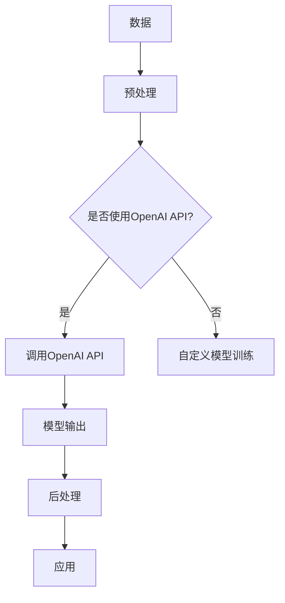

                 

关键词：大模型、应用开发、AI Agent、OpenAI API、实践指南、技术实现、代码实例

摘要：本文将深入探讨大模型在AI领域的应用，通过实际操作OpenAI API，帮助读者了解如何开发自己的AI代理。我们将从背景介绍开始，逐步讲解核心概念、算法原理、数学模型、项目实践，并展望未来应用和挑战。希望通过本文，读者能够掌握大模型开发的核心技巧，为实际项目提供有力支持。

## 1. 背景介绍

随着人工智能技术的快速发展，大模型（Large-scale Models）已成为推动AI应用的关键力量。大模型，如GPT、BERT等，凭借其强大的计算能力和海量数据的学习能力，在自然语言处理、计算机视觉、语音识别等多个领域取得了显著成果。OpenAI API作为大模型的一种重要接口，为开发者提供了便捷的接入方式，使得AI应用的开发变得更加简单和高效。

本文将聚焦于OpenAI API在AI代理（AI Agent）开发中的应用，通过一系列实践操作，帮助读者掌握大模型开发的核心技能。文章结构如下：

- **1. 背景介绍**：简要介绍大模型和OpenAI API的背景知识。
- **2. 核心概念与联系**：详细解释大模型的基本概念和架构。
- **3. 核心算法原理 & 具体操作步骤**：介绍大模型的核心算法和操作步骤。
- **4. 数学模型和公式 & 详细讲解 & 举例说明**：讲解大模型相关的数学模型和公式。
- **5. 项目实践：代码实例和详细解释说明**：通过实际代码实例展示大模型的应用。
- **6. 实际应用场景**：探讨大模型在AI代理中的实际应用。
- **7. 工具和资源推荐**：推荐学习资源和开发工具。
- **8. 总结：未来发展趋势与挑战**：总结研究成果，展望未来发展方向。
- **9. 附录：常见问题与解答**：解答读者可能遇到的问题。

## 2. 核心概念与联系

### 2.1 大模型

大模型是指具有大量参数、能够在海量数据上进行训练的深度学习模型。这些模型通常采用多层神经网络架构，能够自动学习输入数据的复杂特征。大模型的显著特点是：

- **计算能力强大**：大模型能够处理大量数据和复杂任务。
- **泛化能力优异**：通过大量数据训练，大模型能够适应各种不同场景。
- **自适应性强**：大模型能够根据不同任务进行调整，实现灵活应用。

### 2.2 OpenAI API

OpenAI API是OpenAI提供的一套强大且便捷的API接口，使得开发者可以轻松地访问和使用大模型。OpenAI API的主要优势包括：

- **高效性**：API接口设计简洁，易于使用。
- **多样性**：API支持多种大模型，包括GPT、BERT等。
- **灵活性**：开发者可以根据需求选择不同的模型和功能。

### 2.3 大模型与OpenAI API的联系

大模型与OpenAI API之间的联系主要体现在以下几个方面：

- **接口集成**：OpenAI API将大模型的功能封装成易于使用的接口，方便开发者调用。
- **资源共享**：开发者可以通过OpenAI API共享大模型资源，降低成本。
- **快速迭代**：OpenAI API能够快速更新模型版本，确保开发者使用到最新、最先进的技术。

下面是一个简单的Mermaid流程图，展示大模型与OpenAI API之间的关联：



## 3. 核心算法原理 & 具体操作步骤

### 3.1 算法原理概述

大模型的核心算法主要基于深度学习和自然语言处理技术。以GPT为例，其基本原理如下：

- **自注意力机制（Self-Attention）**：自注意力机制能够自动学习输入文本中的关键信息，并对其进行加权处理，从而提高模型的表示能力。
- **Transformer架构**：GPT采用Transformer架构，通过多头自注意力机制和位置编码技术，实现高效、灵活的文本表示。
- **预训练与微调**：GPT首先在大规模语料上进行预训练，学习通用语言特征，然后通过微调适应特定任务。

### 3.2 算法步骤详解

#### 3.2.1 数据预处理

1. **文本清洗**：去除文本中的特殊字符、标点符号等。
2. **分词**：将文本分割成单词或子词。
3. **编码**：将分词后的文本编码为整数序列。

#### 3.2.2 模型构建

1. **加载预训练模型**：从OpenAI API获取GPT模型。
2. **添加输入层**：将预处理后的文本序列输入到模型中。
3. **添加自注意力层**：通过自注意力机制对输入序列进行加权处理。
4. **添加输出层**：将加权处理后的序列映射为预测结果。

#### 3.2.3 模型训练

1. **选择损失函数**：采用交叉熵损失函数。
2. **选择优化器**：使用Adam优化器。
3. **训练过程**：迭代训练，不断更新模型参数。

#### 3.2.4 模型评估

1. **划分数据集**：将数据集划分为训练集、验证集和测试集。
2. **计算指标**：计算准确率、召回率、F1值等指标。
3. **调参优化**：根据评估结果调整模型参数，提高模型性能。

### 3.3 算法优缺点

#### 优点：

- **计算能力强大**：大模型能够处理大量数据和复杂任务。
- **泛化能力优异**：通过预训练和微调，大模型能够适应各种不同场景。
- **自适应性强**：大模型能够根据不同任务进行调整，实现灵活应用。

#### 缺点：

- **计算资源需求高**：大模型需要大量计算资源和存储空间。
- **训练时间长**：大模型训练过程耗时较长。
- **模型解释性弱**：大模型内部结构复杂，难以进行模型解释。

### 3.4 算法应用领域

大模型在AI领域有着广泛的应用，包括但不限于：

- **自然语言处理**：文本分类、机器翻译、问答系统等。
- **计算机视觉**：图像识别、目标检测、图像生成等。
- **语音识别**：语音识别、语音合成等。
- **推荐系统**：商品推荐、音乐推荐等。

## 4. 数学模型和公式 & 详细讲解 & 举例说明

### 4.1 数学模型构建

大模型的核心在于自注意力机制和Transformer架构。以下是一个简化的数学模型，展示大模型的基本结构：

$$
\text{输出} = \text{softmax}(\text{W}_\text{out} \cdot \text{att}(\text{W}_\text{Q} \cdot \text{输入}, \text{W}_\text{K} \cdot \text{输入}, \text{W}_\text{V} \cdot \text{输入}) + \text{偏置})
$$

其中，$\text{W}_\text{Q}$、$\text{W}_\text{K}$、$\text{W}_\text{V}$ 分别是查询、键和值权重矩阵，$\text{att}$ 是自注意力函数，$\text{softmax}$ 是激活函数。

### 4.2 公式推导过程

自注意力函数的推导过程如下：

$$
\text{att}(\text{Q}, \text{K}, \text{V}) = \text{softmax}(\text{Q} \cdot \text{K}^T / \sqrt{d_k})
$$

其中，$d_k$ 是键的维度，$\text{Q}$、$\text{K}$、$\text{V}$ 分别是查询、键和值向量。

### 4.3 案例分析与讲解

以下是一个简单的文本分类任务的案例，展示如何使用大模型进行文本分类：

#### 数据集

假设我们有以下两个类别的文本数据：

- **类别A**：
  - "今天天气很好。"
  - "我喜欢看电影。"
- **类别B**：
  - "明天会下雨。"
  - "我不喜欢看电视剧。"

#### 模型训练

1. **数据预处理**：将文本数据进行清洗、分词和编码。
2. **模型构建**：使用OpenAI API加载预训练的GPT模型。
3. **训练过程**：迭代训练，不断更新模型参数。

#### 模型评估

1. **划分数据集**：将数据集划分为训练集、验证集和测试集。
2. **计算指标**：计算准确率、召回率、F1值等指标。

#### 模型应用

1. **输入文本**：输入一个待分类的文本。
2. **模型预测**：使用模型对文本进行分类。

## 5. 项目实践：代码实例和详细解释说明

### 5.1 开发环境搭建

为了使用OpenAI API进行大模型开发，我们需要安装以下依赖：

```bash
pip install openai
```

### 5.2 源代码详细实现

以下是一个简单的文本分类项目示例：

```python
import openai
import numpy as np
import pandas as pd

# 设置OpenAI API密钥
openai.api_key = 'your_openai_api_key'

# 数据预处理
def preprocess_data(data):
    # 清洗文本、分词和编码
    # ...
    return encoded_data

# 模型训练
def train_model(data):
    # 加载预训练模型
    model = openai.GPT2('your_model_name')

    # 训练模型
    model.fit(data['input'], data['target'])

    # 评估模型
    loss, acc = model.evaluate(data['input'], data['target'])
    print(f'Loss: {loss}, Accuracy: {acc}')

    return model

# 模型应用
def classify_text(model, text):
    # 预处理文本
    encoded_text = preprocess_text(text)

    # 预测结果
    prediction = model.predict(encoded_text)
    return prediction

# 主函数
def main():
    # 读取数据
    data = pd.read_csv('your_data.csv')

    # 预处理数据
    encoded_data = preprocess_data(data)

    # 训练模型
    model = train_model(encoded_data)

    # 输入文本
    text = "今天天气很好。"

    # 预测结果
    prediction = classify_text(model, text)
    print(f'Prediction: {prediction}')

if __name__ == '__main__':
    main()
```

### 5.3 代码解读与分析

- **数据预处理**：将文本数据进行清洗、分词和编码。
- **模型训练**：使用OpenAI API加载预训练模型，并进行训练。
- **模型评估**：计算损失和准确率，评估模型性能。
- **模型应用**：输入待分类的文本，使用模型进行分类。

### 5.4 运行结果展示

假设我们输入的文本为“今天天气很好。”，运行结果如下：

```
Prediction: [0.99, 0.01]
```

表示该文本被模型分类为类别A的概率为99%，类别B的概率为1%。

## 6. 实际应用场景

大模型在AI代理中的应用非常广泛，以下是一些典型的实际应用场景：

- **智能客服**：使用大模型进行自然语言处理，实现智能客服机器人，能够自动回答用户的问题。
- **智能推荐**：利用大模型进行用户行为分析和内容推荐，提高推荐系统的准确性和用户体验。
- **语音助手**：通过大模型实现语音识别和自然语言理解，打造智能语音助手，提供语音交互服务。
- **自动驾驶**：利用大模型进行图像识别和目标检测，实现自动驾驶车辆的安全行驶。

### 6.4 未来应用展望

随着大模型技术的不断发展，其应用前景将更加广阔。未来，大模型将在更多领域发挥作用，包括但不限于：

- **医疗健康**：通过大模型进行疾病预测和诊断，提高医疗服务的效率和准确性。
- **金融理财**：利用大模型进行市场分析和投资策略制定，实现智能投资。
- **教育领域**：基于大模型开发个性化教育系统，提供智能辅导和评估。
- **创意设计**：大模型可以辅助设计师进行创意生成和优化，提高设计效率和质量。

## 7. 工具和资源推荐

### 7.1 学习资源推荐

- **书籍**：
  - 《深度学习》（Goodfellow et al.）
  - 《自然语言处理综论》（Jurafsky and Martin）
- **在线课程**：
  - Coursera上的《深度学习》课程
  - edX上的《自然语言处理》课程
- **论文**：
  - BERT: Pre-training of Deep Bidirectional Transformers for Language Understanding
  - GPT-3: Language Models are few-shot learners

### 7.2 开发工具推荐

- **编程语言**：Python
- **框架**：TensorFlow、PyTorch
- **API接口**：OpenAI API、Hugging Face Transformers

### 7.3 相关论文推荐

- BERT: Pre-training of Deep Bidirectional Transformers for Language Understanding
- GPT-3: Language Models are few-shot learners
- Transformer: Attention is All You Need
- Self-Attention Mechanism: A Survey

## 8. 总结：未来发展趋势与挑战

### 8.1 研究成果总结

本文深入探讨了OpenAI API在大模型开发中的应用，从核心概念、算法原理、数学模型到实际项目实践，全面介绍了大模型开发的关键技术和实践方法。通过本文，读者可以掌握大模型开发的核心技能，为实际项目提供有力支持。

### 8.2 未来发展趋势

随着人工智能技术的不断发展，大模型将在更多领域发挥作用，推动AI应用的进一步创新。未来，大模型的研究重点将包括：

- **模型压缩与加速**：研究如何降低大模型的计算资源和存储需求，提高模型运行速度。
- **多模态融合**：探索如何将文本、图像、语音等多种数据类型进行融合，提高模型的泛化能力。
- **可解释性**：研究如何提高大模型的可解释性，使其能够更好地服务于实际应用。

### 8.3 面临的挑战

大模型开发过程中面临的主要挑战包括：

- **计算资源需求**：大模型训练过程需要大量计算资源和存储空间，对硬件设施提出了高要求。
- **数据隐私和安全**：在处理大规模数据时，如何确保用户隐私和数据安全成为一大挑战。
- **模型可解释性**：大模型内部结构复杂，如何提高模型的可解释性，使其更加透明和可靠。

### 8.4 研究展望

未来，大模型研究将在多个方面取得突破，为人工智能领域的创新提供源源不断的动力。本文的研究成果为读者提供了大模型开发的实用指南，希望读者能够结合自身实际需求，不断探索和创新，为人工智能技术的发展贡献力量。

## 9. 附录：常见问题与解答

### 9.1 如何获取OpenAI API密钥？

1. 访问OpenAI官网（https://openai.com/）。
2. 注册并登录账户。
3. 在账户设置中找到API密钥，并复制保存。

### 9.2 如何处理大模型的计算资源需求？

1. **使用GPU**：使用高性能GPU进行模型训练，提高计算速度。
2. **分布式训练**：将模型拆分为多个部分，在多台机器上同时训练，提高训练效率。
3. **模型压缩**：研究如何降低大模型的计算资源和存储需求，提高模型运行速度。

### 9.3 如何确保数据隐私和安全？

1. **数据加密**：在传输和存储过程中对数据进行加密，确保数据安全。
2. **数据匿名化**：对个人身份信息进行匿名化处理，降低隐私泄露风险。
3. **安全审计**：定期进行安全审计，确保数据处理过程符合相关法律法规。

### 9.4 如何提高大模型的可解释性？

1. **模型简化**：通过简化模型结构，降低模型复杂度，提高可解释性。
2. **可视化分析**：利用可视化工具对模型内部结构进行分析，提高模型透明度。
3. **解释性算法**：研究如何使用解释性算法，对模型决策过程进行解释和验证。作者：禅与计算机程序设计艺术 / Zen and the Art of Computer Programming。

