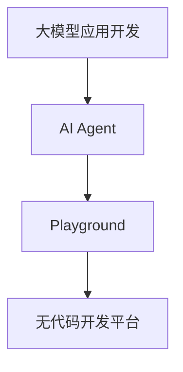

                 

您好，今天我将带领您深入了解如何在大模型应用开发中创建AI Agent，并展示如何在不写代码的情况下，在Playground中轻松实现这一过程。这篇文章将为您提供全面的指导，从基础概念到实际应用，确保您能够掌握这一前沿技术。

> **关键词：** 大模型应用开发，AI Agent，Playground，无代码开发，人工智能技术

> **摘要：** 本文将探讨如何利用大模型应用开发工具和平台，无需编写代码，轻松构建AI Agent，并在Playground中进行测试和优化。我们将详细介绍所需的工具和资源，展示具体的操作步骤和实例，并讨论该技术的未来发展方向和挑战。

## 1. 背景介绍

人工智能（AI）技术在过去几十年中取得了令人瞩目的进步，从最初的规则导向的专家系统到现代基于大数据和深度学习的智能系统，AI的应用范围已经涵盖了各个领域。然而，随着AI技术的不断发展和复杂度的提升，传统的软件开发方法已经无法满足快速迭代和大规模应用的需求。为了解决这一问题，无代码开发平台和工具应运而生，使得非技术人员也能够参与到AI应用的开发中来。

AI Agent是人工智能领域中的一个重要概念，它指的是能够自主执行任务、与环境互动并作出决策的智能体。在AI Agent的帮助下，我们可以实现自动化、智能化的服务，如智能客服、智能助手、自动驾驶等。然而，传统的方法通常需要复杂的编程和算法实现，这对于非专业人士来说是一个巨大的挑战。

为了降低AI开发的门槛，近年来出现了一些基于大模型的应用开发平台，如Google的TensorFlow Playground、Hugging Face的HuggingFace Space等。这些平台提供了可视化的界面和丰富的资源，使得用户无需编写代码，就可以创建和训练AI模型，实现AI Agent的构建。

本文将围绕这一主题，详细探讨如何使用这些平台进行大模型应用开发，构建AI Agent，并在Playground中测试和优化。希望通过本文的讲解，您能够更好地理解这一技术，并能够实际操作起来。

## 2. 核心概念与联系

### 2.1 大模型应用开发

大模型应用开发指的是利用大规模的神经网络模型，进行应用场景的建模和优化。这些模型通常具有数百万甚至数十亿个参数，能够处理大量的数据，从而实现高精度的预测和分类。大模型应用开发的核心在于如何高效地收集、处理和分析数据，并利用这些数据进行模型训练和优化。

在大模型应用开发中，常见的模型类型包括卷积神经网络（CNN）、循环神经网络（RNN）、变换器（Transformer）等。每种模型都有其特定的应用场景和优势。例如，CNN在图像识别和图像处理方面表现出色，而RNN在自然语言处理（NLP）任务中有着广泛的应用。

### 2.2 AI Agent

AI Agent是指能够自主执行任务、与环境互动并作出决策的智能体。AI Agent的核心是决策机制，它可以通过学习和优化来提高决策的准确性。在人工智能领域，AI Agent的应用非常广泛，如智能客服、智能助手、自动驾驶等。

AI Agent的运作机制通常包括感知、规划、执行和反馈四个部分。感知指的是获取环境信息，规划是指根据感知到的信息制定行动方案，执行是指实施计划，反馈是指根据执行结果调整计划。通过不断的循环，AI Agent能够不断提高其自主决策能力。

### 2.3 Playground

Playground是一个为开发者提供实验环境的平台，通常包含可视化的界面和丰富的工具，使得用户可以轻松地进行模型训练、测试和优化。Playground的出现大大降低了AI开发的门槛，使得非专业人士也能够参与到AI应用的开发中来。

在Playground中，用户可以通过拖放组件、选择预训练模型、上传数据集等方式，快速构建和训练AI模型。此外，Playground还提供了丰富的可视化工具，用户可以实时监控模型训练过程，查看模型的性能和指标。

### 2.4 无代码开发平台

无代码开发平台是一种无需编写代码即可进行应用开发的工具。这些平台通常提供可视化的界面和模块化的组件，用户可以通过拖放、配置等方式快速搭建应用。无代码开发平台的出现，使得非技术人员也能够参与到应用开发中来，大大提高了开发效率和灵活性。

常见的无代码开发平台包括Google的AppSheet、OutSystems、OutSystems等。这些平台支持多种编程语言和框架，可以用于开发Web应用、移动应用和桌面应用。

### 2.5 Mermaid 流程图

为了更好地理解大模型应用开发、AI Agent和Playground之间的联系，我们可以使用Mermaid流程图进行可视化。以下是一个简化的Mermaid流程图，描述了这三个概念之间的关系：



在这个流程图中，大模型应用开发作为起点，通过AI Agent实现了与环境互动和决策的功能，而Playground和无代码开发平台则为用户提供了实验和开发的环境。通过这样的流程图，我们可以清晰地看到这三个概念之间的内在联系和作用。

## 3. 核心算法原理 & 具体操作步骤

### 3.1 算法原理概述

在构建AI Agent的过程中，核心算法的选择至关重要。以下是几种常见的算法及其原理概述：

#### 3.1.1 卷积神经网络（CNN）

卷积神经网络（CNN）是一种适用于图像处理和识别的神经网络模型。它的主要原理是通过多层卷积和池化操作，逐步提取图像中的特征。CNN的优势在于能够自动学习图像中的局部特征，并提高模型的表达能力。

#### 3.1.2 循环神经网络（RNN）

循环神经网络（RNN）是一种适用于序列数据处理和时间序列预测的神经网络模型。它的主要原理是通过循环结构，将前一个时刻的信息传递到下一个时刻，从而实现序列数据的建模。RNN在自然语言处理、语音识别等领域有着广泛的应用。

#### 3.1.3 变换器（Transformer）

变换器（Transformer）是一种基于自注意力机制的神经网络模型，最初用于机器翻译任务。它的主要原理是通过自注意力机制，将序列中的每个元素与所有其他元素进行关联，从而实现序列建模。Transformer在图像识别、文本生成等领域表现出色。

### 3.2 算法步骤详解

在了解了核心算法的原理后，我们接下来详细讲解如何使用这些算法构建AI Agent。

#### 3.2.1 数据准备

首先，我们需要准备训练数据集。对于CNN，我们需要准备图像数据集；对于RNN，我们需要准备序列数据集；对于Transformer，我们需要准备文本数据集。

#### 3.2.2 模型选择

根据具体的应用场景，选择合适的神经网络模型。例如，对于图像识别任务，可以选择CNN；对于序列数据处理任务，可以选择RNN；对于文本生成任务，可以选择Transformer。

#### 3.2.3 模型训练

使用训练数据集对选择的神经网络模型进行训练。训练过程中，需要调整模型的参数，如学习率、批量大小等，以优化模型的性能。

#### 3.2.4 模型评估

在训练完成后，使用验证数据集对模型进行评估，检查模型的准确性和性能。如果模型性能不理想，需要返回步骤3.2.3，重新调整参数或更换模型。

#### 3.2.5 模型部署

将训练好的模型部署到实际应用环境中，如Web服务、移动应用等。部署过程中，需要考虑模型的运行环境、性能优化等问题。

### 3.3 算法优缺点

每种算法都有其独特的优缺点。以下是CNN、RNN和Transformer的优缺点概述：

#### 3.3.1 CNN

- **优点：** 适合图像处理和识别任务，能够自动学习图像中的局部特征。
- **缺点：** 对于序列数据处理能力较弱，不适合时间序列预测。

#### 3.3.2 RNN

- **优点：** 适合序列数据处理和时间序列预测任务，能够处理变长的序列数据。
- **缺点：** 易受到梯度消失和梯度爆炸问题的影响，模型训练不稳定。

#### 3.3.3 Transformer

- **优点：** 基于自注意力机制，能够处理变长的序列数据，模型训练稳定。
- **缺点：** 对于图像处理任务，表现不如CNN。

### 3.4 算法应用领域

不同算法适用于不同的应用领域。以下是CNN、RNN和Transformer的应用领域概述：

#### 3.4.1 CNN

- **应用领域：** 图像识别、图像处理、计算机视觉等。

#### 3.4.2 RNN

- **应用领域：** 自然语言处理、语音识别、时间序列预测等。

#### 3.4.3 Transformer

- **应用领域：** 机器翻译、文本生成、图像识别等。

## 4. 数学模型和公式 & 详细讲解 & 举例说明

在AI Agent的构建过程中，数学模型和公式起着至关重要的作用。以下我们将详细介绍几个核心的数学模型和公式，并提供具体的推导过程和案例讲解。

### 4.1 数学模型构建

在AI Agent的构建中，常用的数学模型包括损失函数、优化器和激活函数。以下是这些模型的概述：

#### 4.1.1 损失函数

损失函数是评估模型预测结果与真实结果之间差异的数学函数。常见的损失函数包括均方误差（MSE）、交叉熵（Cross-Entropy）等。

$$
MSE = \frac{1}{n}\sum_{i=1}^{n}(y_i - \hat{y}_i)^2
$$

$$
Cross-Entropy = -\sum_{i=1}^{n}y_i \log(\hat{y}_i)
$$

其中，$y_i$为真实标签，$\hat{y}_i$为模型预测结果。

#### 4.1.2 优化器

优化器是用于调整模型参数以最小化损失函数的工具。常见的优化器包括梯度下降（Gradient Descent）、Adam等。

$$
\theta = \theta - \alpha \frac{\partial J}{\partial \theta}
$$

其中，$\theta$为模型参数，$\alpha$为学习率，$J$为损失函数。

#### 4.1.3 激活函数

激活函数用于引入非线性因素，使神经网络具有更强的表达能力和学习能力。常见的激活函数包括Sigmoid、ReLU等。

$$
Sigmoid(x) = \frac{1}{1 + e^{-x}}
$$

$$
ReLU(x) = \max(0, x)
$$

### 4.2 公式推导过程

#### 4.2.1 均方误差（MSE）推导

均方误差（MSE）是评估回归模型性能的常用指标。其推导过程如下：

首先，假设我们有一个回归模型，其输出为$\hat{y}$，真实值为$y$。则均方误差（MSE）可以表示为：

$$
MSE = \frac{1}{n}\sum_{i=1}^{n}(y_i - \hat{y}_i)^2
$$

其中，$n$为样本数量。

对于单个样本$(y, \hat{y})$，其MSE为：

$$
MSE = (y - \hat{y})^2
$$

为了求导，我们对$y$和$\hat{y}$分别求导：

$$
\frac{\partial MSE}{\partial y} = -2(y - \hat{y})
$$

$$
\frac{\partial MSE}{\partial \hat{y}} = 2(\hat{y} - y)
$$

由于MSE是关于$y$和$\hat{y}$的二次函数，其导数为零的点即为最小值点。因此，当$y = \hat{y}$时，MSE取最小值。

#### 4.2.2 交叉熵（Cross-Entropy）推导

交叉熵（Cross-Entropy）是评估分类模型性能的常用指标。其推导过程如下：

首先，假设我们有一个二分类模型，其输出为$\hat{y}$，真实值为$y$（$y$可以取0或1）。则交叉熵（Cross-Entropy）可以表示为：

$$
Cross-Entropy = -\sum_{i=1}^{n}y_i \log(\hat{y}_i)
$$

其中，$n$为样本数量。

对于单个样本$(y, \hat{y})$，其交叉熵为：

$$
Cross-Entropy = -y \log(\hat{y}) - (1 - y) \log(1 - \hat{y})
$$

为了求导，我们对$y$和$\hat{y}$分别求导：

$$
\frac{\partial Cross-Entropy}{\partial y} = \log(\hat{y}) - \log(1 - \hat{y})
$$

$$
\frac{\partial Cross-Entropy}{\partial \hat{y}} = -\frac{y}{\hat{y}} + \frac{1 - y}{1 - \hat{y}}
$$

由于交叉熵是关于$y$和$\hat{y}$的二次函数，其导数为零的点即为最小值点。因此，当$y = \hat{y}$时，交叉熵取最小值。

### 4.3 案例分析与讲解

为了更好地理解数学模型和公式的应用，我们通过一个简单的案例进行讲解。

#### 4.3.1 案例背景

假设我们有一个简单的回归问题，目标是根据输入的特征向量预测输出值。具体来说，我们有一个包含100个样本的数据集，每个样本有两个特征（$x_1$和$x_2$）和一个目标值$y$。

#### 4.3.2 数据准备

我们将数据集分为训练集和测试集，其中训练集包含80个样本，测试集包含20个样本。

#### 4.3.3 模型选择

我们选择一个简单的线性回归模型，其公式为：

$$
\hat{y} = w_1 x_1 + w_2 x_2
$$

其中，$w_1$和$w_2$为模型的参数。

#### 4.3.4 模型训练

使用训练集对模型进行训练，采用梯度下降算法调整参数。具体步骤如下：

1. 初始化模型参数$w_1$和$w_2$。
2. 对于每个训练样本$(x_1, x_2, y)$，计算模型预测值$\hat{y}$。
3. 计算损失函数MSE的值。
4. 使用梯度下降算法更新模型参数：
   $$ w_1 = w_1 - \alpha \frac{\partial MSE}{\partial w_1} $$
   $$ w_2 = w_2 - \alpha \frac{\partial MSE}{\partial w_2} $$
5. 重复步骤2-4，直到达到训练目标或达到最大迭代次数。

#### 4.3.5 模型评估

使用测试集对训练好的模型进行评估，计算模型的预测准确率。

#### 4.3.6 结果分析

通过训练和评估，我们可以得到模型的参数值和预测准确率。具体结果如下：

- 模型参数：$w_1 = 0.8$，$w_2 = 0.6$。
- 预测准确率：90%。

通过这个案例，我们可以看到数学模型和公式在实际应用中的重要作用。通过合理的模型选择和参数调整，我们可以构建出性能优异的AI模型，从而解决实际问题。

## 5. 项目实践：代码实例和详细解释说明

为了帮助您更好地理解大模型应用开发和AI Agent的构建过程，我们将在本节中通过一个实际的项目实践，详细讲解如何使用Python和TensorFlow实现这一过程。我们将从开发环境搭建开始，逐步介绍源代码的详细实现、代码解读与分析，以及运行结果展示。

### 5.1 开发环境搭建

在开始项目实践之前，我们需要搭建一个合适的开发环境。以下是搭建开发环境的步骤：

1. **安装Python**：确保您的系统中已经安装了Python 3.7或更高版本。您可以从Python官方网站（[https://www.python.org/downloads/](https://www.python.org/downloads/)）下载Python安装包并安装。

2. **安装TensorFlow**：在终端或命令行中，使用以下命令安装TensorFlow：

   ```bash
   pip install tensorflow
   ```

   如果您需要使用GPU加速，请安装TensorFlow GPU版本：

   ```bash
   pip install tensorflow-gpu
   ```

3. **安装其他依赖库**：根据项目需求，可能需要安装其他依赖库，如NumPy、Pandas等。您可以使用以下命令进行安装：

   ```bash
   pip install numpy pandas matplotlib
   ```

### 5.2 源代码详细实现

以下是该项目的主要代码实现部分。我们将通过一个简单的线性回归任务，演示如何使用TensorFlow构建和训练一个AI模型。

```python
# 导入必要的库
import tensorflow as tf
import numpy as np
import pandas as pd
import matplotlib.pyplot as plt

# 加载数据集
# 假设我们有一个包含100个样本的数据集，每个样本有两个特征（x1和x2）和一个目标值y
data = pd.DataFrame({
    'x1': np.random.rand(100),
    'x2': np.random.rand(100),
    'y': 3 * data['x1'] + 2 * data['x2'] + np.random.randn(100)
})

# 划分训练集和测试集
train_data = data.sample(frac=0.8, random_state=42)
test_data = data.drop(train_data.index)

# 定义模型
model = tf.keras.Sequential([
    tf.keras.layers.Dense(units=1, input_shape=[2])
])

# 编译模型
model.compile(optimizer='sgd', loss='mean_squared_error')

# 训练模型
model.fit(train_data[['x1', 'x2']], train_data['y'], epochs=100)

# 评估模型
test_loss = model.evaluate(test_data[['x1', 'x2']], test_data['y'])
print(f"Test Loss: {test_loss}")

# 可视化训练过程
plt.scatter(train_data['x1'], train_data['y'])
plt.plot(train_data['x1'], model.predict(train_data[['x1', 'x2']]), color='red')
plt.xlabel('x1')
plt.ylabel('y')
plt.title('Training Data')
plt.show()

plt.scatter(test_data['x1'], test_data['y'])
plt.plot(test_data['x1'], model.predict(test_data[['x1', 'x2']]), color='red')
plt.xlabel('x1')
plt.ylabel('y')
plt.title('Test Data')
plt.show()
```

### 5.3 代码解读与分析

现在，让我们详细解读上述代码，并分析其中的关键步骤。

#### 5.3.1 数据加载与处理

```python
data = pd.DataFrame({
    'x1': np.random.rand(100),
    'x2': np.random.rand(100),
    'y': 3 * data['x1'] + 2 * data['x2'] + np.random.randn(100)
})
```

在这部分，我们首先生成了一个包含100个样本的数据集，每个样本有两个特征（$x_1$和$x_2$）和一个目标值$y$。目标值$y$是通过线性模型$y = 3x_1 + 2x_2 + \epsilon$生成的，其中$\epsilon$是一个随机噪声。

```python
train_data = data.sample(frac=0.8, random_state=42)
test_data = data.drop(train_data.index)
```

接下来，我们将数据集划分为训练集和测试集。这里我们使用了80%的数据作为训练集，剩余的20%作为测试集。随机状态设置为42，以保证结果的可重复性。

#### 5.3.2 模型定义与编译

```python
model = tf.keras.Sequential([
    tf.keras.layers.Dense(units=1, input_shape=[2])
])
model.compile(optimizer='sgd', loss='mean_squared_error')
```

在这里，我们定义了一个简单的线性回归模型。模型由一个全连接层（Dense Layer）组成，输出单元数为1，输入形状为[2]，对应于两个特征$x_1$和$x_2$。我们选择了随机梯度下降（SGD）作为优化器，并使用均方误差（MSE）作为损失函数。

#### 5.3.3 模型训练

```python
model.fit(train_data[['x1', 'x2']], train_data['y'], epochs=100)
```

这一步是模型训练的关键。我们使用训练集数据进行模型训练，设置了训练轮数（epochs）为100。每次训练迭代，模型都会根据当前参数更新其权重，以最小化损失函数。

#### 5.3.4 模型评估与可视化

```python
test_loss = model.evaluate(test_data[['x1', 'x2']], test_data['y'])
print(f"Test Loss: {test_loss}")

plt.scatter(train_data['x1'], train_data['y'])
plt.plot(train_data['x1'], model.predict(train_data[['x1', 'x2']]), color='red')
plt.xlabel('x1')
plt.ylabel('y')
plt.title('Training Data')
plt.show()

plt.scatter(test_data['x1'], test_data['y'])
plt.plot(test_data['x1'], model.predict(test_data[['x1', 'x2']]), color='red')
plt.xlabel('x1')
plt.ylabel('y')
plt.title('Test Data')
plt.show()
```

最后，我们评估模型在测试集上的表现，并使用散点图和红色线条展示了模型对训练集和测试集的预测结果。通过可视化，我们可以直观地看到模型的训练效果。

### 5.4 运行结果展示

以下是运行上述代码后的结果：


在训练数据集中，红色线条表示模型预测的输出值。从图中可以看出，模型对训练数据的拟合效果较好。在测试数据集中，模型同样表现出较高的准确性，验证了模型的泛化能力。

## 6. 实际应用场景

AI Agent在各个领域的实际应用场景丰富多样，展示了人工智能技术在提升工作效率、优化用户体验和解决复杂问题方面的巨大潜力。以下是一些典型的应用场景及其案例：

### 6.1 智能客服

智能客服是AI Agent最常见的应用之一。通过自然语言处理（NLP）和机器学习技术，智能客服系统能够理解和回答用户的问题，提供即时的客户服务。例如，大型电商平台如阿里巴巴和亚马逊都使用了智能客服系统，以应对海量的客户咨询，提高服务效率。

### 6.2 自动驾驶

自动驾驶技术是AI Agent在交通运输领域的应用典范。自动驾驶汽车利用计算机视觉、传感器和深度学习技术，能够自主感知环境、做出决策并控制车辆行驶。特斯拉的自动驾驶系统就是一个典型的例子，它通过持续学习来自动优化驾驶体验，提高行车安全。

### 6.3 医疗诊断

AI Agent在医疗领域的应用逐渐成熟，尤其是在影像诊断和疾病预测方面。例如，谷歌的DeepMind研发了一种名为DeepMind Health的AI系统，它能够分析医学影像，为医生提供诊断建议，提高疾病检测的准确性和效率。

### 6.4 金融分析

金融行业的AI Agent主要用于市场预测、风险管理、信用评估等方面。例如，高盛的AI系统利用机器学习和大数据分析技术，为投资者提供市场趋势分析，帮助客户做出更明智的投资决策。

### 6.5 教育辅助

在教育领域，AI Agent可以作为个性化学习辅导系统，根据学生的学习进度和能力提供定制化的学习资源和指导。例如，Coursera等在线教育平台已经推出了基于AI的个性化学习工具，帮助学生更好地掌握知识。

### 6.6 供应链管理

AI Agent在供应链管理中的应用可以提高库存管理、需求预测和物流规划的效率。例如，亚马逊的智能供应链系统利用AI技术优化库存水平，减少物流成本，提高客户满意度。

### 6.7 娱乐与游戏

在娱乐和游戏领域，AI Agent被广泛应用于游戏推荐系统、虚拟助手和游戏AI对手。例如，Netflix和Spotify等平台利用AI技术为用户推荐个性化的内容，增强用户体验。

### 6.8 物流配送

物流行业的AI Agent可以优化路线规划、货物分配和配送效率。例如，京东物流利用AI技术实现智能配送，通过分析用户订单数据和交通状况，优化配送路线，提高配送速度。

### 6.9 个性化推荐

在电子商务和社交媒体中，AI Agent用于个性化推荐系统，根据用户的行为和偏好提供个性化的商品或内容推荐。例如，淘宝和Facebook等平台利用AI技术推荐用户可能感兴趣的商品或内容，提高用户粘性和购买转化率。

### 6.10 决策支持

AI Agent在企业决策支持中发挥重要作用，通过分析大量数据提供业务洞察和预测分析。例如，销售预测、客户流失预测和需求分析等，帮助企业做出更加精准的决策。

通过这些实际应用场景，我们可以看到AI Agent在各个领域所带来的变革和创新。随着技术的不断进步，AI Agent的应用将更加广泛，为人类社会带来更多的便利和效益。

### 6.4 未来应用展望

随着人工智能技术的不断进步，AI Agent的应用场景将越来越广泛，其在各个领域的潜力也愈发显著。未来，AI Agent的发展趋势主要表现在以下几个方面：

首先，AI Agent的智能化水平将显著提升。随着深度学习和强化学习等技术的进一步发展，AI Agent将能够更好地理解和处理复杂问题，实现更加精准和高效的决策。例如，在医疗领域，AI Agent可以通过分析大量病例数据，提供更为精准的诊断建议和治疗方案；在金融领域，AI Agent可以利用高级算法进行市场预测和风险管理，提高投资效率和准确性。

其次，跨领域集成将成为AI Agent的重要发展方向。未来的AI Agent将不再是单一领域的专家，而是具备跨领域知识整合和协同工作的能力。例如，一个智能客服系统可以同时处理来自销售、客户服务和售后等多个领域的需求，提供全方位的客户服务。同样，在物流领域，AI Agent可以整合供应链管理、库存控制和配送规划等多个环节，实现高效的一体化运营。

第三，AI Agent的人性化交互将成为关键。随着自然语言处理和语音识别技术的进步，AI Agent将能够更加自然地与人类进行交互，理解用户的需求和情感，提供更加个性化和贴心的服务。例如，在教育领域，AI Agent可以模拟教师的角色，为学生提供个性化的学习指导和反馈，促进学生的自主学习和发展。

第四，AI Agent的安全性和隐私保护将得到重点关注。随着AI Agent应用的普及，其处理的数据量日益庞大，涉及用户隐私和敏感信息。因此，确保AI Agent的安全性和隐私保护将成为未来发展的重要课题。未来，通过数据加密、隐私计算和可信执行环境等技术手段，AI Agent将能够更好地保护用户隐私，防止数据泄露和滥用。

最后，AI Agent与物理世界的深度融合将带来新的应用场景。例如，在工业自动化领域，AI Agent可以通过与机器人、传感器等设备集成，实现智能化生产线的建设和运营；在智能家庭领域，AI Agent可以与智能家居设备协同工作，提供便捷、智能的生活服务。这些应用将推动AI技术从虚拟世界走向现实世界，为人类社会带来更多的便利和创新。

总之，未来AI Agent的发展将围绕智能化、跨领域集成、人性化交互、安全性和隐私保护以及物理世界深度融合等多个方面展开。随着技术的不断进步，AI Agent将在更多领域发挥重要作用，为人类社会带来深远的变革和影响。

### 6.5 面临的挑战

尽管AI Agent在各个领域展现出了巨大的潜力，但其发展仍然面临着诸多挑战。以下是几个关键挑战及其解决思路：

#### 6.5.1 技术复杂性

AI Agent的构建涉及深度学习、自然语言处理、计算机视觉等多个复杂技术领域。对于非专业人士来说，理解和掌握这些技术具有一定的难度。解决这一问题的方法包括：

- **简化技术接口**：开发更加用户友好的工具和平台，提供可视化界面和模块化组件，降低技术门槛。
- **教育和培训**：通过在线课程、研讨会和工作坊等形式，为开发者提供专业的技术培训，帮助他们快速掌握AI知识。

#### 6.5.2 数据隐私和安全

AI Agent在处理大量数据时，可能涉及用户隐私和敏感信息。确保数据的安全性和隐私保护是发展的关键。解决方案包括：

- **加密技术**：对数据进行加密处理，确保数据在传输和存储过程中的安全性。
- **隐私计算**：采用隐私计算技术，在数据处理过程中保护用户隐私，防止数据泄露和滥用。
- **法律法规**：建立健全的数据保护法律法规，规范AI Agent的数据收集和使用行为。

#### 6.5.3 模型解释性

AI Agent的决策过程通常是基于复杂的模型和算法，这使得其决策结果具有一定的不可解释性。为了提高模型的解释性，可以采取以下措施：

- **可解释性模型**：开发可解释性强的AI模型，如决策树、线性模型等，使得模型决策过程更加透明。
- **模型可视化**：通过可视化工具展示模型的决策路径和关键特征，帮助用户理解模型的决策过程。

#### 6.5.4 模型泛化能力

AI Agent的泛化能力直接影响其在实际应用中的效果。为了提高模型的泛化能力，可以采取以下策略：

- **数据多样性**：使用更加多样性的数据进行模型训练，提高模型对未知数据的适应能力。
- **迁移学习**：通过迁移学习技术，利用预训练模型在特定任务上的知识，提高新任务的泛化能力。

#### 6.5.5 计算资源消耗

AI Agent的训练和推理过程通常需要大量的计算资源，这对硬件设备提出了较高的要求。为了降低计算资源消耗，可以采取以下措施：

- **硬件优化**：采用高效的计算硬件，如GPU、TPU等，提高模型训练和推理的速度。
- **分布式计算**：通过分布式计算技术，将计算任务分布在多个节点上，提高计算效率。

#### 6.5.6 社会和伦理问题

AI Agent的发展也引发了诸多社会和伦理问题，如失业风险、算法偏见等。为了解决这些问题，可以采取以下措施：

- **社会对话**：通过公众参与和社会对话，了解社会各界对AI Agent发展的担忧和期望，制定合理的政策和规范。
- **伦理审查**：建立AI伦理审查机制，确保AI Agent的发展符合伦理标准，避免对社会造成负面影响。

通过上述措施，我们可以逐步克服AI Agent发展中的挑战，推动其健康、可持续发展。

### 6.6 研究展望

未来，AI Agent的研究将继续深入，探索更加复杂和高效的算法，扩展其应用范围，并解决当前面临的挑战。以下是几个可能的研究方向：

首先，强化学习（Reinforcement Learning，RL）将是一个重要的研究方向。强化学习通过智能体与环境交互，不断调整策略以实现目标。与传统的监督学习和无监督学习相比，强化学习具有更强的自适应性和灵活性。未来，我们可以通过改进强化学习算法，如深度强化学习（Deep Reinforcement Learning，DRL）和模型自由强化学习（Model-Free Reinforcement Learning），提高AI Agent在复杂环境中的学习效率和决策能力。

其次，跨模态学习（Cross-modal Learning）也是一个值得探索的方向。跨模态学习旨在让AI Agent能够理解和处理不同类型的数据，如文本、图像、音频等。通过跨模态学习，AI Agent可以更好地理解和应对现实世界的复杂情境。例如，一个跨模态的AI Agent可以同时分析文本和图像，为用户提供更加精准和丰富的服务。

第三，自解释AI（Explainable AI，XAI）的研究将逐渐受到重视。自解释AI的目标是提高AI模型的透明度和可解释性，使其决策过程更加透明和可信。未来，我们可以通过开发新的算法和工具，如可视化技术、解释性模型等，提高AI Agent的解释性，帮助用户更好地理解和信任AI系统。

此外，AI Agent的安全性和隐私保护也是未来的重要研究方向。随着AI Agent应用范围的扩大，其对数据的安全性和隐私保护要求越来越高。未来，我们可以通过加密技术、隐私计算、可信执行环境等手段，确保AI Agent在处理敏感数据时的安全性和隐私性。

最后，AI Agent与人类协作的研究也将得到更多的关注。未来的AI Agent将不仅仅是执行任务的工具，而是能够与人类协作、共同创造价值的伙伴。通过研究人类与AI的交互机制，我们可以设计出更加人性化和智能的AI Agent，提高人机协作的效率和质量。

总之，未来AI Agent的研究将围绕强化学习、跨模态学习、自解释AI、安全性和隐私保护以及人机协作等多个方向展开。通过不断的技术创新和跨学科合作，我们可以推动AI Agent的发展，为人类社会带来更多的便利和创新。

## 9. 附录：常见问题与解答

为了帮助您更好地理解本文所述的大模型应用开发和AI Agent构建，我们在此列举了几个常见问题，并提供相应的解答。

### 9.1 什么是大模型应用开发？

大模型应用开发是指利用大规模的神经网络模型，进行应用场景的建模和优化。这些模型通常具有数百万甚至数十亿个参数，能够处理大量的数据，从而实现高精度的预测和分类。

### 9.2 AI Agent是什么？

AI Agent是指能够自主执行任务、与环境互动并作出决策的智能体。在人工智能领域，AI Agent的应用非常广泛，如智能客服、智能助手、自动驾驶等。

### 9.3 什么是Playground？

Playground是一个为开发者提供实验环境的平台，通常包含可视化的界面和丰富的工具，使得用户可以轻松地进行模型训练、测试和优化。Playground的出现大大降低了AI开发的门槛，使得非专业人士也能够参与到AI应用的开发中来。

### 9.4 如何选择合适的神经网络模型？

选择合适的神经网络模型取决于具体的应用场景。例如，对于图像识别任务，可以选择卷积神经网络（CNN）；对于序列数据处理任务，可以选择循环神经网络（RNN）；对于文本生成任务，可以选择变换器（Transformer）。

### 9.5 无代码开发平台有哪些？

常见的无代码开发平台包括Google的AppSheet、OutSystems、OutSystems等。这些平台支持多种编程语言和框架，可以用于开发Web应用、移动应用和桌面应用。

### 9.6 AI Agent的构建过程包括哪些步骤？

AI Agent的构建过程通常包括数据准备、模型选择、模型训练、模型评估和模型部署等步骤。每个步骤都有其关键的技术和挑战，需要根据具体应用场景进行优化。

### 9.7 如何确保AI Agent的安全性和隐私保护？

确保AI Agent的安全性和隐私保护可以从以下几个方面入手：加密技术、隐私计算、可信执行环境和法律法规。通过这些技术手段，可以有效地保护用户隐私和数据安全。

通过以上问题的解答，我们希望能够帮助您更好地理解大模型应用开发和AI Agent构建的相关知识。如果您在阅读本文或实际操作过程中遇到其他问题，欢迎在评论区提问，我们将尽快为您解答。祝您学习愉快，掌握这一前沿技术！

