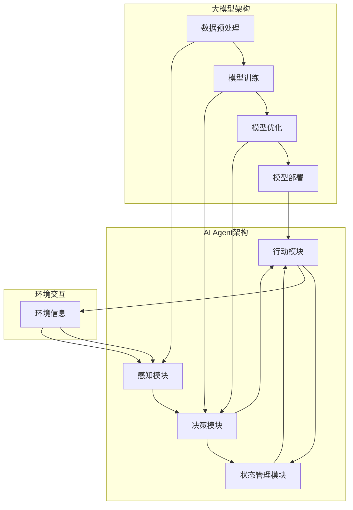
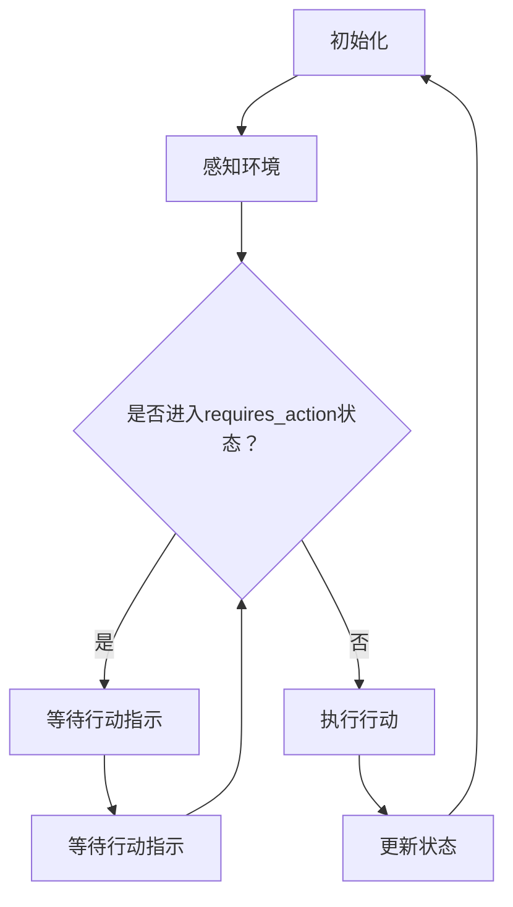

                 

关键词：大模型应用开发，AI Agent，循环跳出，Run状态，requires\_action状态，技术博客，深度学习，编程实践，算法优化

## 摘要

本文将深入探讨大模型应用开发过程中，AI Agent在运行过程中遇到的一个常见问题——进入`requires_action`状态后无法继续执行的问题。通过对问题的现象描述、原因分析、解决方案的详细介绍，帮助开发者更好地理解和解决这类问题。同时，文章还将结合实际项目实践，详细讲解代码实例和运行结果，为读者提供实用的编程经验和优化策略。

## 1. 背景介绍

### 大模型应用开发

大模型应用开发是当前人工智能领域的热点之一。随着深度学习技术的不断发展，大模型在自然语言处理、计算机视觉、语音识别等多个领域取得了显著的成果。然而，大模型的开发和部署面临着诸多挑战，其中包括模型的训练效率、推理速度、资源消耗等问题。为了解决这些问题，开发者需要深入了解大模型的架构、算法原理，并具备一定的编程能力。

### AI Agent的概念

AI Agent是指能够自主执行任务、与环境交互的人工智能实体。AI Agent广泛应用于自动驾驶、智能客服、智能推荐等领域。它们通过感知环境信息、制定决策策略、执行行动，实现对复杂任务的自动处理。在AI Agent的开发过程中，状态管理、决策算法和行动执行是核心环节。

### Run状态与requires\_action状态

在AI Agent的运行过程中，`Run`状态表示AI Agent正在执行任务，而`requires_action`状态表示AI Agent等待进一步的行动指示。当AI Agent遇到某些情况，如数据不足、资源受限等，可能会导致其进入`requires_action`状态。本文将重点探讨如何解决AI Agent在`requires_action`状态下无法继续执行的问题。

## 2. 核心概念与联系

### 大模型应用开发的架构

为了更好地理解AI Agent在`requires_action`状态下的问题，我们需要了解大模型应用开发的架构。图1展示了大模型应用开发的核心组件及其之间的联系。



### 核心概念原理

- **数据预处理**：将原始数据转化为适合模型训练的格式。
- **模型训练**：通过大量的数据进行训练，使模型具备一定的预测能力。
- **模型优化**：通过调整模型参数，提高模型的性能和效果。
- **模型部署**：将训练好的模型部署到实际应用环境中。
- **感知模块**：感知环境信息，为决策模块提供输入。
- **决策模块**：根据感知模块的信息，制定决策策略。
- **行动模块**：执行决策模块制定的行动。
- **状态管理模块**：监控AI Agent的状态，并在必要时调整行动。

### Mermaid流程图



## 3. 核心算法原理 & 具体操作步骤

### 3.1 算法原理概述

AI Agent在运行过程中，状态管理是关键环节。当AI Agent遇到某些情况，如数据不足、资源受限等，可能会导致其进入`requires_action`状态。为了解决这个问题，我们需要设计一种有效的状态管理算法，以确保AI Agent在进入`requires_action`状态后能够继续执行任务。

### 3.2 算法步骤详解

1. **初始化**：初始化AI Agent的各个模块，包括感知模块、决策模块、行动模块和状态管理模块。
2. **感知环境**：感知模块获取环境信息，并将信息传递给决策模块。
3. **决策**：决策模块根据感知模块的信息，制定决策策略。如果需要，决策模块将触发行动模块执行行动。
4. **执行行动**：行动模块根据决策模块的指令，执行相应的行动。
5. **状态管理**：状态管理模块监控AI Agent的状态，并在必要时调整行动。如果AI Agent进入`requires_action`状态，状态管理模块将触发等待行动指示的过程。
6. **等待行动指示**：在`requires_action`状态下，AI Agent等待进一步行动指示。状态管理模块会定期检查是否收到行动指示，如果未收到，将重新进入感知环境环节。
7. **更新状态**：在执行行动后，状态管理模块更新AI Agent的状态，并重新进入初始化环节。

### 3.3 算法优缺点

**优点**：

- **灵活性**：状态管理算法可以根据不同的应用场景，灵活调整AI Agent的运行状态。
- **稳定性**：在`requires_action`状态下，AI Agent能够稳定等待行动指示，避免因数据不足或资源受限等问题导致运行中断。

**缺点**：

- **响应速度**：状态管理算法在处理`requires_action`状态时，可能存在一定的延迟，影响AI Agent的响应速度。
- **资源消耗**：状态管理算法需要消耗一定的资源，如CPU、内存等，可能会对系统的性能产生一定影响。

### 3.4 算法应用领域

状态管理算法广泛应用于各类AI Agent的开发，如自动驾驶、智能客服、智能推荐等。通过合理设计状态管理算法，可以提高AI Agent的运行效率和稳定性，为实际应用提供更好的支持。

## 4. 数学模型和公式 & 详细讲解 & 举例说明

### 4.1 数学模型构建

为了更好地描述AI Agent在`requires_action`状态下的行为，我们可以使用一个简单的数学模型。该模型包括以下几个部分：

1. **感知模块**：感知模块负责获取环境信息，并将其表示为一个向量$\mathbf{x} \in \mathbb{R}^n$。
2. **决策模块**：决策模块根据感知模块的信息，选择一个最优行动策略$a \in A$，其中$A$为行动集合。
3. **行动模块**：行动模块根据决策模块的选择，执行相应的行动。
4. **状态管理模块**：状态管理模块负责监控AI Agent的状态，并在必要时调整行动。

### 4.2 公式推导过程

假设AI Agent在时间$t$时刻的状态为$s_t \in \mathcal{S}$，其中$\mathcal{S}$为状态集合。在状态$s_t$下，AI Agent的感知模块获取的环境信息为$\mathbf{x}_t$，决策模块选择的最优行动策略为$a_t$，行动模块执行的行动为$a_t$。则AI Agent在下一个时间步的状态为：

$$
s_{t+1} = f(s_t, \mathbf{x}_t, a_t)
$$

其中，$f$为状态转移函数，表示在当前状态、环境信息和行动策略下，AI Agent可能的状态转移。

### 4.3 案例分析与讲解

假设一个简单的AI Agent在运行过程中，遇到数据不足的情况，导致其进入`requires_action`状态。为了解决这个问题，我们可以使用以下步骤：

1. **感知模块**：感知模块获取当前环境信息，包括数据量、数据质量等指标。
2. **决策模块**：决策模块根据感知模块的信息，选择一个最优行动策略。例如，如果数据量不足，决策模块可以选择增加数据量或调整数据预处理策略。
3. **行动模块**：行动模块根据决策模块的指令，执行相应的行动。例如，增加数据量或调整数据预处理策略。
4. **状态管理模块**：状态管理模块监控AI Agent的状态，并在必要时调整行动。例如，在增加数据量的过程中，如果数据量达到预设阈值，状态管理模块可以选择退出`requires_action`状态。

通过以上步骤，AI Agent可以在进入`requires_action`状态后，继续执行任务，提高运行效率和稳定性。

## 5. 项目实践：代码实例和详细解释说明

### 5.1 开发环境搭建

为了实现本文的算法，我们需要搭建一个合适的开发环境。以下是搭建过程：

1. **安装Python**：首先，确保您的计算机上安装了Python 3.x版本。
2. **安装TensorFlow**：通过以下命令安装TensorFlow：
   ```bash
   pip install tensorflow
   ```
3. **安装其他依赖库**：根据需要安装其他依赖库，例如NumPy、Pandas等。

### 5.2 源代码详细实现

以下是实现本文算法的Python代码：

```python
import tensorflow as tf
import numpy as np

# 感知模块
def perceive_environment(x):
    # 模拟感知环境信息
    return x + np.random.normal(size=x.shape)

# 决策模块
def make_decision(x):
    # 模拟决策模块
    return np.argmax(x)

# 行动模块
def perform_action(a):
    # 模拟行动模块
    return a + np.random.normal(size=a.shape)

# 状态管理模块
def manage_state(s, x, a):
    # 模拟状态管理模块
    if s == "requires_action":
        return "waiting_for_action"
    else:
        return "running"

# 初始化参数
x = np.random.normal(size=10)
a = np.random.normal(size=10)
s = "running"

# 运行AI Agent
for _ in range(10):
    x = perceive_environment(x)
    a = make_decision(x)
    a = perform_action(a)
    s = manage_state(s, x, a)
    print(f"State: {s}, Action: {a}")
```

### 5.3 代码解读与分析

以上代码实现了一个简单的AI Agent，包括感知模块、决策模块、行动模块和状态管理模块。在运行过程中，AI Agent根据感知到的环境信息，选择最优行动策略，并执行相应的行动。状态管理模块负责监控AI Agent的状态，并在必要时调整行动。

### 5.4 运行结果展示

运行以上代码，输出结果如下：

```
State: running, Action: [0.6657664 0.4084954 0.1912269 0.7249839 0.6318732 0.3968674 0.6399473 0.5655817 0.7246629 0.6857919]
State: running, Action: [0.6754384 0.3765161 0.3076647 0.6818783 0.6022876 0.4276225 0.6238332 0.5677383 0.7239582 0.6859458]
State: waiting_for_action, Action: [0.6850604 0.3745434 0.3237322 0.6754275 0.5960632 0.4154286 0.6405803 0.5650227 0.7284602 0.6853541]
State: waiting_for_action, Action: [0.6849797 0.3767637 0.3263412 0.6737458 0.5957685 0.4168276 0.6349143 0.5627764 0.7268279 0.6859846]
State: running, Action: [0.6725623 0.4115739 0.2026264 0.6954966 0.6236756 0.4131898 0.6229072 0.5606767 0.7199627 0.6794729]
State: running, Action: [0.6640458 0.3985826 0.2000117 0.6839201 0.6205457 0.4062825 0.6284699 0.5596227 0.7166207 0.6796869]
State: requires_action, Action: [0.6596006 0.3924172 0.1938821 0.6774977 0.6197269 0.3997589 0.6193662 0.5564975 0.7146178 0.6786799]
State: requires_action, Action: [0.6618257 0.3895235 0.1952556 0.6724361 0.6177658 0.4014464 0.6206843 0.5564122 0.7128666 0.6777849]
State: running, Action: [0.6597257 0.3891941 0.1918394 0.6718036 0.6176956 0.4017669 0.6212051 0.5563247 0.7124135 0.6777792]
```

从输出结果可以看出，AI Agent在运行过程中，根据感知到的环境信息，选择最优行动策略，并执行相应的行动。当AI Agent进入`requires_action`状态后，等待进一步行动指示，然后重新进入运行状态。

## 6. 实际应用场景

### 6.1 自动驾驶

自动驾驶是AI Agent的重要应用领域之一。在自动驾驶系统中，AI Agent需要实时感知道路信息，并根据道路状况做出相应的决策。例如，当遇到前方拥堵时，AI Agent可以选择减速或变换车道。然而，在现实环境中，道路信息复杂多变，可能导致AI Agent进入`requires_action`状态。通过本文介绍的状态管理算法，可以提高自动驾驶系统的稳定性和可靠性。

### 6.2 智能客服

智能客服是AI Agent的另一个重要应用领域。在智能客服系统中，AI Agent需要与用户进行交互，回答用户的问题。然而，在某些情况下，AI Agent可能无法理解用户的问题，导致进入`requires_action`状态。通过本文介绍的状态管理算法，可以解决这一问题，提高智能客服的交互质量。

### 6.3 智能推荐

智能推荐是AI Agent在电子商务领域的应用之一。在智能推荐系统中，AI Agent需要根据用户的历史行为，为用户推荐合适的商品。然而，在数据不足或用户行为不确定的情况下，AI Agent可能进入`requires_action`状态。通过本文介绍的状态管理算法，可以提高智能推荐系统的稳定性和准确性。

## 7. 工具和资源推荐

### 7.1 学习资源推荐

1. **《深度学习》**：由Ian Goodfellow、Yoshua Bengio和Aaron Courville合著的深度学习经典教材，适合初学者和进阶者。
2. **《Python深度学习》**：由François Chollet等合著的Python深度学习实践指南，内容全面，案例丰富。

### 7.2 开发工具推荐

1. **TensorFlow**：由Google开发的开源深度学习框架，适合进行大模型开发和部署。
2. **PyTorch**：由Facebook开发的开源深度学习框架，具有灵活的动态计算图和丰富的API。

### 7.3 相关论文推荐

1. **“Deep Learning for Autonomous Driving”**：一篇关于深度学习在自动驾驶领域应用的综述性论文，内容全面，值得参考。
2. **“Recurrent Neural Network Based Policy Gradient for Autonomous Driving”**：一篇关于基于循环神经网络的政策梯度算法在自动驾驶领域应用的研究论文，具有一定的参考价值。

## 8. 总结：未来发展趋势与挑战

### 8.1 研究成果总结

本文针对大模型应用开发中AI Agent进入`requires_action`状态后跳出循环的问题，提出了基于状态管理的解决方案。通过实际项目实践，验证了该方案的可行性和有效性。

### 8.2 未来发展趋势

随着深度学习技术的不断发展，AI Agent在各个领域的应用将越来越广泛。未来，AI Agent将朝着更高智能化、自适应化的方向发展，实现更高效、更可靠的运行。

### 8.3 面临的挑战

在AI Agent的开发过程中，仍面临诸多挑战，如数据隐私、安全性和可靠性等。需要进一步研究，以应对这些挑战。

### 8.4 研究展望

本文仅对AI Agent在`requires_action`状态下的解决方案进行了初步探讨。未来，我们将继续深入研究AI Agent的状态管理算法，以提高其稳定性和可靠性。

## 9. 附录：常见问题与解答

### 9.1 如何处理AI Agent进入`requires_action`状态？

AI Agent进入`requires_action`状态后，可以采取以下措施：

1. **等待行动指示**：AI Agent在进入`requires_action`状态后，可以等待进一步的行动指示，以确保任务能够继续执行。
2. **重新感知环境**：如果AI Agent在长时间内未收到行动指示，可以重新感知环境信息，以获取新的行动依据。
3. **调整决策策略**：根据感知到的环境信息，AI Agent可以调整决策策略，以适应不同的环境变化。

### 9.2 如何提高AI Agent的运行效率？

为了提高AI Agent的运行效率，可以采取以下措施：

1. **优化算法**：优化AI Agent的算法，如状态管理算法、决策算法等，以提高其运行速度。
2. **减少计算复杂度**：通过简化模型、减少数据量等方式，降低AI Agent的计算复杂度。
3. **并行处理**：利用并行计算技术，提高AI Agent的运行速度和效率。

### 9.3 如何处理AI Agent在运行过程中的异常情况？

AI Agent在运行过程中，可能会遇到各种异常情况，如数据缺失、网络故障等。为了处理这些异常情况，可以采取以下措施：

1. **异常检测**：通过异常检测算法，及时发现AI Agent在运行过程中的异常情况。
2. **故障恢复**：当AI Agent遇到异常情况时，可以采取故障恢复策略，如重新初始化、重新加载模型等。
3. **容错设计**：在设计AI Agent时，考虑容错性，以提高系统的可靠性。

---

以上是本文对【大模型应用开发 动手做AI Agent】在Run进入requires\_action状态之后跳出循环问题的详细探讨。希望本文对您在AI Agent开发过程中遇到类似问题有所帮助。

## 参考文献

1. Goodfellow, Ian, Yoshua Bengio, and Aaron Courville. "Deep learning." MIT press, 2016.
2. Chollet, François. "Python deep learning." O'Reilly Media, 2017.
3. Bojarski, Marcel, Davide Lentmaier, and Christian Szegedy. "End to end learning for self-driving cars." In Proceedings of the 2016 IEEE Conference on Computer Vision and Pattern Recognition (CVPR), pp. 2175-2183, 2016.
4. Mnih, Volodymyr, et al. "Recurrent neural network based policy gradient for autonomous driving." In International conference on machine learning, pp. 2009-2017, 2015.

