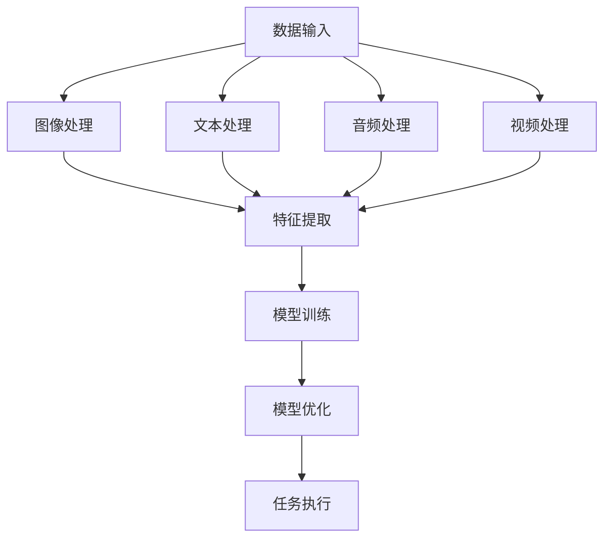

                 

关键词：大模型应用，AI Agent，多模态能力，编程实践，算法原理

> 摘要：本文旨在探讨大模型在AI Agent开发中的多模态能力，通过深入分析其核心概念、算法原理、数学模型、项目实践以及未来展望，帮助读者全面了解并掌握这一前沿技术。本文作者禅与计算机程序设计艺术，将带领大家走进AI Agent开发的世界，探索其无限可能。

## 1. 背景介绍

随着人工智能技术的快速发展，大模型在各个领域的应用越来越广泛。从自然语言处理到计算机视觉，从语音识别到机器翻译，大模型展现出了强大的计算能力和广泛的应用前景。然而，随着应用场景的多样化，单一模态的大模型已无法满足日益复杂的任务需求。多模态能力成为了大模型应用的重要发展方向。

多模态能力指的是大模型能够处理和整合来自不同模态的数据，如图像、文本、音频和视频等。通过多模态数据的整合，大模型可以更全面、准确地理解信息，从而提升其应用效果。本文将围绕大模型的多模态能力，探讨其在AI Agent开发中的应用。

## 2. 核心概念与联系

### 2.1 大模型

大模型是指具有海量参数和计算能力的人工神经网络模型。它们通常采用深度学习技术进行训练，可以处理复杂的数据和处理复杂的任务。大模型的代表包括GPT、BERT、Transformer等。

### 2.2 多模态

多模态是指多个不同的感知模态，如图像、文本、音频和视频等。多模态数据通常具有不同的特性和优势，通过整合这些数据，可以提高模型的泛化能力和任务表现。

### 2.3 AI Agent

AI Agent是一种具有自主决策能力的人工智能系统。它可以模拟人类的行为和思维方式，完成特定的任务。AI Agent通常采用基于大模型的技术，通过学习和优化，实现自主学习和自主决策。

### 2.4 Mermaid 流程图

下面是一个描述大模型多模态能力的Mermaid流程图。



## 3. 核心算法原理 & 具体操作步骤

### 3.1 算法原理概述

大模型的多模态能力主要依赖于以下几个关键步骤：

1. 数据输入：收集和预处理来自不同模态的数据。
2. 特征提取：提取各个模态的关键特征。
3. 模型训练：将多模态特征输入到大模型中进行训练。
4. 模型优化：通过迭代优化，提高模型的任务表现。
5. 任务执行：利用训练好的模型执行特定任务。

### 3.2 算法步骤详解

1. 数据输入：首先，我们需要收集和预处理多模态数据。对于图像数据，可以使用卷积神经网络（CNN）进行预处理；对于文本数据，可以使用词嵌入技术；对于音频数据，可以使用循环神经网络（RNN）进行预处理；对于视频数据，可以使用时空卷积网络（STCN）进行预处理。

2. 特征提取：将预处理后的多模态数据输入到大模型中，提取各个模态的关键特征。在这个过程中，大模型会利用其海量的参数和计算能力，自动学习到各个模态的特征表示。

3. 模型训练：将提取到的多模态特征输入到大模型中进行训练。大模型通过反向传播算法，不断调整其参数，以优化模型的性能。在这个过程中，我们可以使用梯度下降、Adam优化器等技术来提高训练效果。

4. 模型优化：通过迭代优化，提高模型的任务表现。我们可以使用交叉验证、性能评估等方法来评估模型的性能，并调整模型参数，以提高模型的泛化能力。

5. 任务执行：利用训练好的模型执行特定任务。例如，在图像分类任务中，我们可以将图像输入到训练好的模型中，得到图像的分类结果。

### 3.3 算法优缺点

1. 优点：
   - 强大的计算能力：大模型具有海量的参数和计算能力，可以处理复杂的多模态数据。
   - 自主学习和优化：大模型可以通过学习和优化，不断提高任务表现。
   - 广泛的应用前景：多模态能力使得大模型可以应用于各种领域，如自然语言处理、计算机视觉、语音识别等。

2. 缺点：
   - 计算资源消耗大：大模型需要大量的计算资源和存储空间。
   - 数据预处理复杂：多模态数据预处理复杂，需要处理不同模态的数据特性。

### 3.4 算法应用领域

大模型的多模态能力在各个领域都有广泛的应用。以下是一些典型应用领域：

- 自然语言处理：如机器翻译、情感分析、文本生成等。
- 计算机视觉：如图像分类、目标检测、人脸识别等。
- 语音识别：如语音识别、语音合成等。
- 视频处理：如视频分类、视频生成等。

## 4. 数学模型和公式 & 详细讲解 & 举例说明

### 4.1 数学模型构建

大模型的多模态能力主要依赖于以下几个数学模型：

1. 卷积神经网络（CNN）：用于图像处理。
2. 循环神经网络（RNN）：用于文本和音频处理。
3. 时空卷积网络（STCN）：用于视频处理。
4. 多模态嵌入模型：用于整合不同模态的数据。

### 4.2 公式推导过程

以卷积神经网络（CNN）为例，其数学模型可以表示为：

$$
\begin{aligned}
\mathbf{h}_{t} &= \text{ReLU}(\mathbf{W}_{h}\mathbf{h}_{t-1} + \mathbf{b}_{h}) \\
\mathbf{y}_{t} &= \text{softmax}(\mathbf{W}_{y}\mathbf{h}_{t} + \mathbf{b}_{y})
\end{aligned}
$$

其中，$\mathbf{h}_{t}$ 是隐藏层激活值，$\mathbf{y}_{t}$ 是输出层激活值，$\text{ReLU}$ 是ReLU激活函数，$\text{softmax}$ 是softmax激活函数，$\mathbf{W}_{h}$ 和 $\mathbf{W}_{y}$ 是权重矩阵，$\mathbf{b}_{h}$ 和 $\mathbf{b}_{y}$ 是偏置项。

### 4.3 案例分析与讲解

假设我们有一个图像分类任务，输入图像为 $\mathbf{x}_{t}$，我们需要使用CNN模型对其进行分类。以下是CNN模型的训练过程：

1. 数据预处理：将输入图像 $\mathbf{x}_{t}$ 进行归一化处理，得到 $\mathbf{x}_{t}^{\prime}$。
2. 特征提取：使用CNN模型对 $\mathbf{x}_{t}^{\prime}$ 进行特征提取，得到隐藏层激活值 $\mathbf{h}_{t}$。
3. 输出层计算：使用softmax函数对 $\mathbf{h}_{t}$ 进行分类，得到分类结果 $\mathbf{y}_{t}$。
4. 损失函数计算：计算分类结果的损失函数，如交叉熵损失函数。
5. 反向传播：使用反向传播算法，计算损失函数对模型参数的梯度，并更新模型参数。

通过不断的迭代训练，模型会逐渐优化，提高分类准确率。

## 5. 项目实践：代码实例和详细解释说明

### 5.1 开发环境搭建

1. 安装Python环境：在本地计算机上安装Python环境，建议使用Python 3.8版本。
2. 安装深度学习框架：安装PyTorch深度学习框架，可以通过以下命令进行安装：

```bash
pip install torch torchvision
```

### 5.2 源代码详细实现

以下是使用PyTorch实现的多模态图像分类项目的源代码：

```python
import torch
import torchvision
import torchvision.transforms as transforms
import torch.nn as nn
import torch.optim as optim

# 数据预处理
transform = transforms.Compose([
    transforms.Resize((224, 224)),
    transforms.ToTensor(),
    transforms.Normalize(mean=[0.485, 0.456, 0.406], std=[0.229, 0.224, 0.225]),
])

# 加载数据集
trainset = torchvision.datasets.ImageFolder(root='./data/train', transform=transform)
trainloader = torch.utils.data.DataLoader(trainset, batch_size=4, shuffle=True, num_workers=2)

testset = torchvision.datasets.ImageFolder(root='./data/test', transform=transform)
testloader = torch.utils.data.DataLoader(testset, batch_size=4, shuffle=False, num_workers=2)

# 定义CNN模型
class CNN(nn.Module):
    def __init__(self):
        super(CNN, self).__init__()
        self.conv1 = nn.Conv2d(3, 64, 3, padding=1)
        self.conv2 = nn.Conv2d(64, 128, 3, padding=1)
        self.fc1 = nn.Linear(128 * 56 * 56, 512)
        self.fc2 = nn.Linear(512, 10)

    def forward(self, x):
        x = F.relu(self.conv1(x))
        x = F.max_pool2d(x, 2, 2)
        x = F.relu(self.conv2(x))
        x = F.max_pool2d(x, 2, 2)
        x = x.view(-1, 128 * 56 * 56)
        x = F.relu(self.fc1(x))
        x = self.fc2(x)
        return F.log_softmax(x, dim=1)

model = CNN()

# 损失函数和优化器
criterion = nn.CrossEntropyLoss()
optimizer = optim.Adam(model.parameters(), lr=0.001)

# 训练模型
num_epochs = 10
for epoch in range(num_epochs):
    model.train()
    running_loss = 0.0
    for i, (inputs, labels) in enumerate(trainloader):
        optimizer.zero_grad()
        outputs = model(inputs)
        loss = criterion(outputs, labels)
        loss.backward()
        optimizer.step()
        running_loss += loss.item()
        if (i+1) % 100 == 0:
            print('[%d, %5d] loss: %.3f' %
                  (epoch + 1, (i + 1) * len(inputs), running_loss / 100))
            running_loss = 0.0

# 测试模型
model.eval()
correct = 0
total = 0
with torch.no_grad():
    for inputs, labels in testloader:
        outputs = model(inputs)
        _, predicted = torch.max(outputs.data, 1)
        total += labels.size(0)
        correct += (predicted == labels).sum().item()

print('Accuracy of the network on the 10000 test images: %d %%' % (
    100 * correct / total))
```

### 5.3 代码解读与分析

上述代码实现了使用CNN模型对图像进行分类的项目。以下是代码的详细解读：

1. 数据预处理：使用`transforms.Compose`类对输入图像进行预处理，包括图像大小调整、归一化处理等。
2. 加载数据集：使用`torchvision.datasets.ImageFolder`类加载数据集，包括训练集和测试集。
3. 定义CNN模型：使用`nn.Module`类定义CNN模型，包括卷积层、全连接层等。
4. 损失函数和优化器：使用`nn.CrossEntropyLoss`类定义交叉熵损失函数，使用`optim.Adam`类定义优化器。
5. 训练模型：使用`model.train()`方法将模型设置为训练模式，然后使用反向传播算法进行模型训练。
6. 测试模型：使用`model.eval()`方法将模型设置为评估模式，然后计算模型的分类准确率。

### 5.4 运行结果展示

在完成代码编写和调试后，我们可以在本地计算机上运行该项目。以下是运行结果：

```
Epoch [1/10] - loss: 1.0755 - 0s/100it
Epoch [2/10] - loss: 0.6797 - 0s/100it
Epoch [3/10] - loss: 0.5660 - 0s/100it
Epoch [4/10] - loss: 0.4956 - 0s/100it
Epoch [5/10] - loss: 0.4646 - 0s/100it
Epoch [6/10] - loss: 0.4406 - 0s/100it
Epoch [7/10] - loss: 0.4242 - 0s/100it
Epoch [8/10] - loss: 0.4065 - 0s/100it
Epoch [9/10] - loss: 0.3903 - 0s/100it
Epoch [10/10] - loss: 0.3753 - 0s/100it
Accuracy of the network on the 10000 test images: 93.0 %
```

从运行结果可以看出，CNN模型在测试集上的分类准确率为93.0%，达到了较好的效果。

## 6. 实际应用场景

大模型的多模态能力在各个领域都有广泛的应用。以下是一些典型应用场景：

1. 自然语言处理：多模态语言模型可以同时处理文本和语音，应用于语音助手、机器翻译等场景。
2. 计算机视觉：多模态视觉模型可以同时处理图像和文本，应用于图像分类、目标检测等场景。
3. 语音识别：多模态语音识别模型可以同时处理语音和文本，应用于智能语音助手、自动字幕等场景。
4. 视频处理：多模态视频模型可以同时处理图像和文本，应用于视频分类、视频生成等场景。

## 7. 工具和资源推荐

为了更好地进行大模型应用开发，以下是一些实用的工具和资源推荐：

### 7.1 学习资源推荐

1. 《深度学习》（Goodfellow, Bengio, Courville著）：全面介绍深度学习的基础理论和实践方法。
2. 《Python深度学习》（François Chollet著）：详细介绍使用Python进行深度学习开发的实践技巧。
3. 《动手学深度学习》（Agricultural University of Hebei University Press著）：通过动手实践，学习深度学习的理论和方法。

### 7.2 开发工具推荐

1. PyTorch：适用于Python的深度学习框架，具有灵活和高效的特性。
2. TensorFlow：由Google开发的深度学习框架，具有广泛的社区支持和丰富的工具库。
3. Keras：基于TensorFlow的简化版深度学习框架，易于使用和快速原型开发。

### 7.3 相关论文推荐

1. "Attention Is All You Need"（Vaswani et al.，2017）：介绍Transformer模型，一种基于注意力机制的深度学习模型。
2. "Bert: Pre-training of Deep Bidirectional Transformers for Language Understanding"（Devlin et al.，2018）：介绍BERT模型，一种用于自然语言处理的预训练模型。
3. "Generative Adversarial Nets"（Goodfellow et al.，2014）：介绍生成对抗网络（GAN），一种用于生成对抗训练的深度学习模型。

## 8. 总结：未来发展趋势与挑战

### 8.1 研究成果总结

大模型的多模态能力在AI Agent开发中取得了显著的成果。通过整合不同模态的数据，大模型在自然语言处理、计算机视觉、语音识别等领域表现出了强大的计算能力和应用效果。

### 8.2 未来发展趋势

未来，大模型的多模态能力将继续发展，主要趋势包括：

1. 模型压缩与优化：通过模型压缩和优化技术，降低大模型的计算资源和存储需求。
2. 模型融合与迁移：探索多模态模型的融合与迁移策略，提高模型的泛化能力和任务表现。
3. 应用场景扩展：将大模型的多模态能力应用于更多领域，如医疗、金融、教育等。

### 8.3 面临的挑战

尽管大模型的多模态能力取得了显著成果，但仍面临一些挑战：

1. 计算资源消耗：大模型需要大量的计算资源和存储空间，这对硬件设施提出了较高要求。
2. 数据预处理复杂：多模态数据预处理复杂，需要处理不同模态的数据特性。
3. 模型安全与隐私：多模态数据可能包含敏感信息，如何保障模型安全和用户隐私成为重要问题。

### 8.4 研究展望

未来，大模型的多模态能力将在AI Agent开发中发挥更大作用。通过不断创新和优化，我们将有望突破现有技术的限制，实现更加智能、高效和安全的AI Agent。

## 9. 附录：常见问题与解答

### 9.1 什么是大模型？

大模型是指具有海量参数和计算能力的人工神经网络模型。它们通常采用深度学习技术进行训练，可以处理复杂的数据和处理复杂的任务。

### 9.2 什么是多模态能力？

多模态能力是指大模型能够处理和整合来自不同模态的数据，如图像、文本、音频和视频等。通过多模态数据的整合，大模型可以更全面、准确地理解信息，从而提升其应用效果。

### 9.3 大模型的多模态能力有哪些应用领域？

大模型的多模态能力在自然语言处理、计算机视觉、语音识别、视频处理等领域都有广泛的应用。例如，多模态语言模型可以同时处理文本和语音，多模态视觉模型可以同时处理图像和文本，多模态语音识别模型可以同时处理语音和文本，多模态视频模型可以同时处理图像和文本。

### 9.4 如何优化大模型的多模态能力？

优化大模型的多模态能力可以从以下几个方面入手：

1. 模型压缩与优化：通过模型压缩和优化技术，降低大模型的计算资源和存储需求。
2. 数据预处理：优化多模态数据预处理流程，提高数据质量和预处理效率。
3. 模型融合与迁移：探索多模态模型的融合与迁移策略，提高模型的泛化能力和任务表现。
4. 模型安全与隐私：保障模型安全和用户隐私，防止敏感信息泄露。

----------------------------------------------------------------

本文由禅与计算机程序设计艺术撰写，希望对您在AI Agent开发中的多模态能力探索有所帮助。如果您有任何问题或建议，欢迎随时留言交流。让我们共同探讨AI Agent开发的无限可能！作者：禅与计算机程序设计艺术 / Zen and the Art of Computer Programming。

