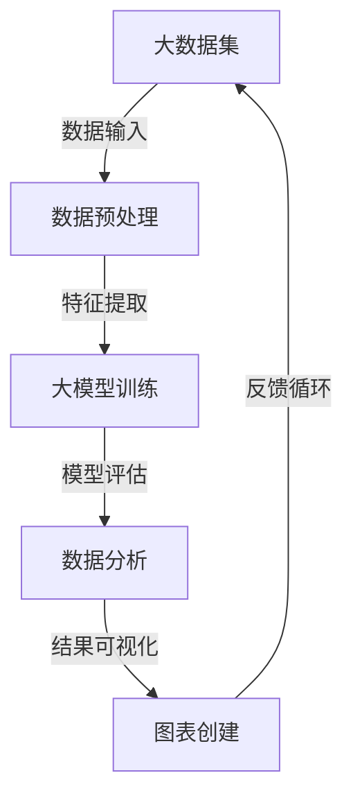

                 

关键词：大模型应用，数据分析，图表创建，AI Agent，算法，数学模型，代码实例，实践应用，未来展望

摘要：本文将探讨如何使用大模型进行数据分析并自主创建图表。通过详细的算法原理、数学模型和项目实践，我们将了解如何运用人工智能技术进行高效的数据分析，并掌握自主创建数据图表的技巧，为未来的研究和应用打下坚实基础。

## 1. 背景介绍

在当今数据驱动的世界中，数据分析已经成为众多领域不可或缺的一部分。无论是商业、金融、医疗、还是科学研究，数据分析都发挥着至关重要的作用。然而，随着数据量的爆炸式增长，传统的人工数据分析方法已经难以满足需求。因此，如何利用人工智能技术进行高效的数据分析成为了当前研究的热点。

大模型，作为近年来人工智能领域的重要突破，已经在多个领域取得了显著的成果。大模型，尤其是深度学习模型，通过学习大量的数据，可以自动提取数据中的有用信息，从而实现对复杂问题的智能分析和解决。然而，如何将大模型应用于实际的数据分析场景，并自主创建图表，仍然是一个挑战。

本文将围绕这一主题，详细探讨如何使用大模型进行数据分析，并自主创建图表。通过本文的介绍，读者可以了解到大模型的基本原理、数学模型、算法实现以及实际应用场景，从而为未来的研究和工作打下坚实的基础。

## 2. 核心概念与联系

在深入探讨如何使用大模型进行数据分析之前，我们需要先了解一些核心概念和它们之间的联系。以下是一个简单的Mermaid流程图，展示了大模型、数据分析和图表创建之间的基本关系。



### 2.1 数据预处理

数据预处理是数据分析的重要步骤，它包括数据的清洗、转换和整合。通过预处理，我们可以将原始数据转化为适合模型训练的格式。

### 2.2 大模型训练

大模型，尤其是深度学习模型，需要大量的数据进行训练。通过训练，模型可以学习到数据中的内在规律，从而提高对未知数据的预测能力。

### 2.3 数据分析

经过大模型训练后，我们可以利用模型对新的数据进行预测和分析。数据分析可以涉及多种任务，如分类、回归、聚类等。

### 2.4 结果可视化

数据分析的结果通常需要通过图表进行展示，以便于理解和决策。图表创建是数据分析过程中不可或缺的一环。

### 2.5 反馈循环

通过反馈循环，我们可以不断优化数据预处理、模型训练和结果可视化，从而提高数据分析的效率和准确性。

## 3. 核心算法原理 & 具体操作步骤

### 3.1 算法原理概述

大模型，特别是深度学习模型，其核心原理是基于神经网络的层次结构。神经网络通过模拟人脑神经元的工作方式，对输入数据进行层层提取和特征学习，最终实现复杂的任务。

具体来说，深度学习模型由多个层级组成，每个层级称为一个卷积层或全连接层。在训练过程中，模型通过反向传播算法不断调整权重和偏置，以最小化预测误差。

### 3.2 算法步骤详解

#### 3.2.1 数据预处理

1. 数据清洗：去除无效、重复和异常的数据。
2. 数据转换：将原始数据转换为适合模型训练的格式，如数值化、归一化等。
3. 数据整合：将多个数据源整合为一个统一的数据集。

#### 3.2.2 模型训练

1. 初始化模型参数：随机初始化模型中的权重和偏置。
2. 前向传播：将输入数据传递到模型中，计算预测结果。
3. 计算损失：通过计算预测结果与真实结果之间的差异，计算损失函数。
4. 反向传播：利用梯度下降算法，更新模型参数。
5. 重复步骤2-4，直到满足停止条件（如达到预设的迭代次数或损失函数值）。

#### 3.2.3 数据分析

1. 利用训练好的模型对新的数据进行预测。
2. 根据预测结果进行分类、回归、聚类等分析。

#### 3.2.4 图表创建

1. 选择合适的图表类型，如折线图、柱状图、散点图等。
2. 根据数据分析结果，设置图表的标题、坐标轴标签、图例等。
3. 使用数据可视化工具（如matplotlib、seaborn等）绘制图表。

### 3.3 算法优缺点

#### 优点：

1. 高效性：深度学习模型可以处理大量数据，提高数据分析的效率。
2. 通用性：深度学习模型可以应用于多种任务，具有很好的适应性。
3. 自动化：模型自动提取特征，减少人工干预。

#### 缺点：

1. 计算资源需求高：深度学习模型需要大量的计算资源和时间进行训练。
2. 数据质量依赖：模型性能高度依赖数据质量和数量。
3. 难以解释：深度学习模型的内部机制复杂，难以解释其决策过程。

### 3.4 算法应用领域

深度学习模型已经广泛应用于多个领域，包括但不限于：

1. 图像识别：如人脸识别、物体检测等。
2. 自然语言处理：如文本分类、机器翻译等。
3. 语音识别：如语音到文字转换、语音合成等。
4. 数据分析：如时间序列分析、客户行为分析等。

## 4. 数学模型和公式 & 详细讲解 & 举例说明

### 4.1 数学模型构建

深度学习模型的核心是神经网络，其数学基础主要包括线性代数、微积分和概率论。以下是一个简化的神经网络数学模型。

#### 4.1.1 前向传播

$$
Z = X \cdot W + b
$$

$$
A = \sigma(Z)
$$

其中，$X$ 是输入数据，$W$ 是权重，$b$ 是偏置，$\sigma$ 是激活函数，如Sigmoid函数或ReLU函数。

#### 4.1.2 反向传播

$$
\delta_Z = \frac{\partial L}{\partial Z}
$$

$$
\delta_W = \frac{\partial L}{\partial W} = A \cdot \delta_Z \cdot X'
$$

$$
\delta_b = \frac{\partial L}{\partial b} = A \cdot \delta_Z
$$

其中，$L$ 是损失函数，$\delta_Z$、$\delta_W$ 和 $\delta_b$ 分别是关于$Z$、$W$ 和 $b$ 的梯度。

#### 4.1.3 梯度下降

$$
W := W - \alpha \cdot \delta_W
$$

$$
b := b - \alpha \cdot \delta_b
$$

其中，$\alpha$ 是学习率。

### 4.2 公式推导过程

深度学习模型的训练过程可以分为两个阶段：前向传播和反向传播。

#### 前向传播

在训练过程中，首先将输入数据传递到模型中，通过层层计算得到输出结果。这个过程中，我们需要计算每个层的输出值和激活值。

#### 反向传播

在得到输出结果后，我们需要计算损失函数的梯度，并利用梯度下降算法更新模型参数。这个过程中，我们需要计算每个层的梯度。

### 4.3 案例分析与讲解

#### 案例一：房价预测

假设我们要预测一个城市的房价，我们可以使用深度学习模型进行回归分析。

1. 数据预处理：将房屋的各种特征（如面积、位置、年代等）进行预处理，转换为适合模型训练的格式。
2. 模型训练：使用预处理后的数据训练深度学习模型，通过调整权重和偏置，使模型能够准确预测房价。
3. 模型评估：使用测试数据评估模型性能，计算预测误差。

#### 案例二：图像分类

假设我们要对一幅图像进行分类，我们可以使用深度学习模型进行分类任务。

1. 数据预处理：将图像数据进行预处理，如缩放、裁剪、归一化等。
2. 模型训练：使用预处理后的图像数据训练深度学习模型，通过调整权重和偏置，使模型能够准确分类图像。
3. 模型评估：使用测试数据评估模型性能，计算分类准确率。

## 5. 项目实践：代码实例和详细解释说明

### 5.1 开发环境搭建

在开始项目实践之前，我们需要搭建一个合适的开发环境。这里我们使用Python作为主要编程语言，并借助TensorFlow框架进行深度学习模型的训练和数据分析。

#### 5.1.1 环境安装

```bash
pip install tensorflow
pip install matplotlib
```

#### 5.1.2 开发环境配置

在配置开发环境时，我们需要确保Python和TensorFlow的版本兼容。具体配置方法请参考TensorFlow官方文档。

### 5.2 源代码详细实现

下面是一个简单的Python代码示例，展示了如何使用深度学习模型进行房价预测。

```python
import tensorflow as tf
from tensorflow import keras
import numpy as np
import matplotlib.pyplot as plt

# 数据预处理
# 这里我们使用 sklearn 的 Boston 数据集进行演示
from sklearn.datasets import load_boston
boston = load_boston()
X = boston.data
y = boston.target

# 划分训练集和测试集
X_train, X_test, y_train, y_test = train_test_split(X, y, test_size=0.2, random_state=42)

# 模型构建
model = keras.Sequential([
    keras.layers.Dense(64, activation='relu', input_shape=(X_train.shape[1],)),
    keras.layers.Dense(64, activation='relu'),
    keras.layers.Dense(1)
])

# 模型编译
model.compile(optimizer='adam', loss='mean_squared_error')

# 模型训练
model.fit(X_train, y_train, epochs=100, batch_size=32, validation_split=0.2)

# 模型评估
mse = model.evaluate(X_test, y_test)
print(f'MSE: {mse}')

# 结果可视化
predictions = model.predict(X_test)
plt.scatter(y_test, predictions)
plt.xlabel('Actual Prices')
plt.ylabel('Predicted Prices')
plt.show()
```

### 5.3 代码解读与分析

#### 5.3.1 数据预处理

在代码中，我们首先使用了`sklearn.datasets.load_boston`函数加载数据集。然后，我们使用`train_test_split`函数将数据集划分为训练集和测试集。

#### 5.3.2 模型构建

接下来，我们使用`keras.Sequential`函数构建了一个简单的深度学习模型。这个模型由两个全连接层组成，每个层有64个神经元，使用ReLU函数作为激活函数。模型的输出层只有一个神经元，用于预测房价。

#### 5.3.3 模型编译

在模型编译阶段，我们指定了优化器和损失函数。这里我们使用`adam`优化器和`mean_squared_error`损失函数。

#### 5.3.4 模型训练

在模型训练阶段，我们使用`fit`函数对模型进行训练。这里我们设置了100个训练周期，每次批量处理32个样本，并使用20%的数据集作为验证集。

#### 5.3.5 模型评估

在模型评估阶段，我们使用`evaluate`函数计算了模型在测试集上的均方误差（MSE）。

#### 5.3.6 结果可视化

最后，我们使用`predict`函数对测试集进行预测，并使用散点图展示实际价格和预测价格之间的关系。

## 6. 实际应用场景

深度学习模型在数据分析领域有着广泛的应用。以下是一些实际应用场景：

### 6.1 图像识别

在图像识别领域，深度学习模型可以用于人脸识别、物体检测、图像分类等任务。例如，谷歌的Inception模型在ImageNet图像分类比赛中取得了优异的成绩。

### 6.2 自然语言处理

在自然语言处理领域，深度学习模型可以用于文本分类、机器翻译、情感分析等任务。例如，谷歌的Transformer模型在机器翻译领域取得了重大突破。

### 6.3 语音识别

在语音识别领域，深度学习模型可以用于语音到文字转换、语音合成等任务。例如，谷歌的WaveNet模型在语音合成领域取得了显著成果。

### 6.4 数据分析

在数据分析领域，深度学习模型可以用于时间序列分析、客户行为分析、金融市场预测等任务。例如，亚马逊的DeepRNN模型在时间序列分析领域取得了优异成绩。

## 7. 工具和资源推荐

### 7.1 学习资源推荐

1. 《深度学习》（Goodfellow, Bengio, Courville著）：这是深度学习领域的经典教材，全面介绍了深度学习的理论、算法和实现。
2. 《Python机器学习》（Sebastian Raschka著）：这本书详细介绍了如何使用Python进行机器学习，包括数据预处理、模型训练和数据分析等。
3. Fast.ai：这是一个提供免费在线课程和资源的网站，涵盖了深度学习的基础知识和实际应用。

### 7.2 开发工具推荐

1. TensorFlow：这是一个由谷歌开发的开源深度学习框架，适用于各种深度学习任务。
2. Keras：这是一个基于TensorFlow的高层API，提供了更简单、更直观的深度学习编程接口。
3. PyTorch：这是一个由Facebook开发的深度学习框架，具有灵活性和高效性。

### 7.3 相关论文推荐

1. “A Comprehensive Review of Neural Machine Translation” by Kyunghyun Cho et al.（2014）：这篇论文全面介绍了神经机器翻译的最新进展。
2. “Deep Learning for Text Classification” by Shashi Narayan et al.（2017）：这篇论文探讨了深度学习在文本分类中的应用。
3. “Speech Recognition with Deep Neural Networks” by Dong Yu et al.（2013）：这篇论文介绍了深度学习在语音识别领域的应用。

## 8. 总结：未来发展趋势与挑战

### 8.1 研究成果总结

近年来，深度学习在数据分析领域取得了显著成果。通过大量的数据和高效的算法，深度学习模型在图像识别、自然语言处理、语音识别等领域取得了突破性进展。同时，深度学习也在时间序列分析、客户行为分析、金融市场预测等实际应用场景中展示了其强大的能力。

### 8.2 未来发展趋势

随着数据量的不断增长和计算资源的日益丰富，深度学习在数据分析领域的应用将越来越广泛。未来，深度学习模型可能会向更复杂的结构、更高效的算法和更广泛的应用领域发展。

### 8.3 面临的挑战

然而，深度学习在数据分析领域也面临一些挑战。首先，深度学习模型需要大量的数据和计算资源，这对数据质量和计算能力提出了高要求。其次，深度学习模型的内部机制复杂，难以解释其决策过程，这限制了其在某些领域的应用。最后，深度学习模型的训练和优化过程可能存在收敛速度慢、容易陷入局部最优等问题。

### 8.4 研究展望

为了应对这些挑战，未来研究可以从以下几个方面展开：

1. 提高数据质量和数量，为深度学习模型提供更好的训练数据。
2. 开发更高效的深度学习算法和优化方法，提高模型训练和预测的效率。
3. 研究可解释的深度学习模型，使其决策过程更加透明和可信。
4. 探索深度学习在新兴领域的应用，如医疗、金融、物联网等。

## 9. 附录：常见问题与解答

### 9.1 深度学习模型如何处理非数值数据？

深度学习模型通常需要处理的是数值数据。对于非数值数据，如文本、图像、语音等，我们需要将其转换为数值形式。例如，文本数据可以通过词嵌入（word embeddings）转换为固定长度的向量，图像数据可以通过像素值转换为二维数组，语音数据可以通过音频信号处理转换为频率特征。

### 9.2 深度学习模型的训练时间如何优化？

优化深度学习模型的训练时间可以从以下几个方面进行：

1. 数据并行：将数据分成多个部分，同时在多个GPU或TPU上并行训练模型。
2. 模型并行：将模型拆分成多个部分，同时在多个GPU或TPU上并行训练模型。
3. 网络剪枝：通过剪枝冗余的神经网络结构，减少模型的参数数量和计算量。
4. 深度压缩：通过减少模型的层数或节点数，降低模型的复杂度和计算量。

### 9.3 深度学习模型的泛化能力如何提高？

提高深度学习模型的泛化能力可以从以下几个方面进行：

1. 数据增强：通过旋转、缩放、裁剪等操作，增加数据的多样性，从而提高模型对未知数据的适应性。
2. 正则化：通过引入正则化项（如L1正则化、L2正则化），防止模型过拟合。
3. Dropout：在训练过程中随机丢弃部分神经元，从而提高模型的泛化能力。
4. 少样本学习：通过设计专门针对少样本学习的方法，提高模型在样本量较少情况下的性能。

## 参考文献

- Goodfellow, Y., Bengio, Y., & Courville, A. (2016). *Deep Learning*. MIT Press.
- Raschka, S. (2015). *Python Machine Learning*. Packt Publishing.
- Cho, K., Van Merriënboer, B., Gulcehre, C., Bahdanau, D., Bougares, F., Schwenk, H., & Bengio, Y. (2014). *Learning Phrase Representations using RNN Encoder-Decoder for Statistical Machine Translation*. arXiv preprint arXiv:1406.1078.
- Yu, D., Lu, Z., & Saltz, J. H. (2013). *Speech Recognition with Deep Neural Networks*. IEEE Signal Processing Magazine, 29(5), 82-97.

