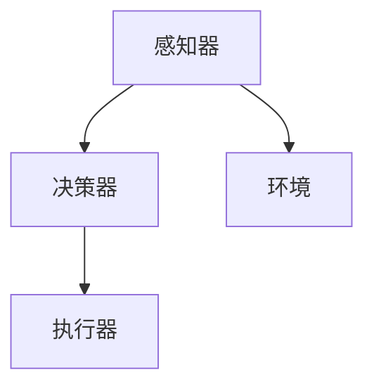

                 

关键词：大模型应用、AI Agent、自主创建页面、模型开发、动手实践、代码实例、数学模型、应用场景、未来展望

> 摘要：本文旨在探讨如何通过大模型应用开发，动手创建一个AI Agent，并以此为基础，介绍其背后的核心概念、算法原理、数学模型以及实际应用场景。文章将通过详细的代码实例和解析，帮助读者深入理解大模型在AI领域的应用，并展望其未来的发展趋势和挑战。

## 1. 背景介绍

随着人工智能技术的飞速发展，大模型（如GPT、BERT等）在自然语言处理、计算机视觉、语音识别等领域展现出了强大的能力。这些模型通过对海量数据的训练，能够实现高度复杂的任务，从简单的文本生成到复杂的图像识别，无所不能。然而，对于开发者来说，如何有效地利用这些大模型，将其应用到实际场景中，仍然是一个充满挑战的问题。

本文将围绕如何通过大模型应用开发，自主创建一个AI Agent进行探讨。AI Agent是一种能够模拟人类智能行为的计算机程序，它可以执行复杂的任务，并与环境进行交互。通过创建AI Agent，开发者可以更好地理解大模型的原理和应用，同时为未来的AI系统开发提供宝贵的经验。

## 2. 核心概念与联系

在深入探讨大模型应用开发之前，我们需要先了解一些核心概念，包括机器学习、深度学习、神经网络等。

### 2.1 机器学习（Machine Learning）

机器学习是人工智能的一个分支，它使计算机能够从数据中学习并做出预测或决策。机器学习可以分为监督学习、无监督学习和强化学习。

- **监督学习**：有标注的训练数据，模型通过学习这些数据，能够在新的、未标注的数据上进行预测。
- **无监督学习**：没有标注的训练数据，模型旨在发现数据中的内在结构和模式。
- **强化学习**：模型通过与环境交互，不断调整其策略，以实现某个目标。

### 2.2 深度学习（Deep Learning）

深度学习是机器学习的一个子领域，它使用多层神经网络来模拟人类大脑的神经网络结构，以实现更复杂的任务。深度学习在图像识别、语音识别和自然语言处理等领域取得了显著成果。

### 2.3 神经网络（Neural Network）

神经网络是一种由大量神经元（节点）组成的计算模型，这些神经元通过连接（边）相互连接。每个神经元接收输入，通过权重和偏置进行加权求和，然后通过激活函数产生输出。神经网络通过不断调整权重和偏置，以最小化预测误差。

### 2.4 大模型（Large-scale Model）

大模型是指那些具有数十亿甚至千亿参数的神经网络模型。这些模型通过在大规模数据集上的训练，能够学习到极其复杂的模式。大模型的代表性模型包括GPT、BERT、ViT等。

### 2.5 AI Agent

AI Agent是一种具有自主决策能力的计算机程序，它可以模拟人类的智能行为，并在环境中执行任务。AI Agent通常包含以下三个组成部分：

- **感知器**：用于接收环境信息。
- **决策器**：基于感知器收集到的信息，做出决策。
- **执行器**：执行决策器做出的决策。

### 2.6 Mermaid 流程图

以下是AI Agent的核心概念和架构的Mermaid流程图：



## 3. 核心算法原理 & 具体操作步骤

### 3.1 算法原理概述

AI Agent的核心算法主要包括感知器、决策器和执行器。以下是这三个组件的原理概述：

- **感知器**：感知器通过接收环境信息，生成输入数据，这些数据经过处理，被传递给决策器。
- **决策器**：决策器接收感知器生成的输入数据，通过神经网络进行计算，生成决策结果。
- **执行器**：执行器根据决策器的决策结果，执行相应的操作。

### 3.2 算法步骤详解

AI Agent的具体操作步骤如下：

1. **感知阶段**：AI Agent从环境中获取信息，例如图像、文本等。
2. **处理阶段**：感知器对获取到的信息进行处理，提取特征，并将其转换为神经网络可以处理的格式。
3. **决策阶段**：决策器根据处理后的信息，通过神经网络计算，生成决策结果。
4. **执行阶段**：执行器根据决策器的决策结果，执行相应的操作。

### 3.3 算法优缺点

**优点**：

- **高效率**：AI Agent能够快速地从环境中获取信息，并做出决策。
- **自主学习**：AI Agent可以通过不断的学习和优化，提高其决策能力。

**缺点**：

- **计算复杂度**：AI Agent的算法涉及大量的计算，对硬件资源有较高要求。
- **数据依赖性**：AI Agent的决策能力很大程度上依赖于训练数据的质量和数量。

### 3.4 算法应用领域

AI Agent的应用领域非常广泛，包括但不限于：

- **自然语言处理**：如文本生成、机器翻译等。
- **计算机视觉**：如图像识别、物体检测等。
- **智能控制**：如自动驾驶、智能家居等。

## 4. 数学模型和公式 & 详细讲解 & 举例说明

### 4.1 数学模型构建

AI Agent的数学模型主要包括感知器、决策器和执行器。以下是这些组件的数学模型构建：

- **感知器**：感知器接收输入数据 $x$，通过激活函数 $f$，产生输出 $y$。
  $$ y = f(x) $$
- **决策器**：决策器接收感知器输出的数据 $y$，通过神经网络计算，生成决策结果 $z$。
  $$ z = \sigma(W^T y + b) $$
  其中，$W$ 是权重矩阵，$b$ 是偏置，$\sigma$ 是激活函数。
- **执行器**：执行器根据决策器的决策结果 $z$，执行相应的操作。

### 4.2 公式推导过程

以下是决策器中神经网络的公式推导过程：

1. **前向传播**：输入数据 $x$ 通过感知器处理后，得到 $y$。
   $$ y = f(x) $$
2. **计算中间结果**：将 $y$ 乘以权重矩阵 $W$，并加上偏置 $b$。
   $$ z = W^T y + b $$
3. **激活函数**：对 $z$ 进行激活函数处理，得到决策结果 $z$。
   $$ z = \sigma(z) $$

### 4.3 案例分析与讲解

假设我们有一个简单的AI Agent，它的任务是判断一张图片是否包含猫。以下是该AI Agent的数学模型和公式推导：

1. **感知器**：输入数据是图像的特征向量 $x$，通过卷积神经网络（CNN）处理后，得到 $y$。
   $$ y = \text{CNN}(x) $$
2. **决策器**：决策器接收 $y$，通过全连接神经网络（FCNN）计算，得到决策结果 $z$。
   $$ z = \text{FCNN}(y) = \sigma(W^T y + b) $$
3. **执行器**：如果 $z > 0.5$，则认为图片中包含猫，否则不包含猫。

## 5. 项目实践：代码实例和详细解释说明

### 5.1 开发环境搭建

在开始编写代码之前，我们需要搭建一个合适的开发环境。以下是一个简单的Python开发环境搭建步骤：

1. 安装Python：从Python官网下载并安装Python。
2. 安装深度学习框架：安装TensorFlow或PyTorch等深度学习框架。
3. 安装必要的依赖库：如NumPy、Pandas等。

### 5.2 源代码详细实现

以下是AI Agent的核心代码实现：

```python
import tensorflow as tf
from tensorflow.keras.models import Sequential
from tensorflow.keras.layers import Conv2D, Flatten, Dense

# 感知器
def create_perception_module(input_shape):
    model = Sequential([
        Conv2D(32, (3, 3), activation='relu', input_shape=input_shape),
        Flatten(),
        Dense(64, activation='relu'),
        Dense(1, activation='sigmoid')
    ])
    return model

# 决策器
def create_decision_module(input_shape):
    model = Sequential([
        Flatten(input_shape=input_shape),
        Dense(64, activation='relu'),
        Dense(1, activation='sigmoid')
    ])
    return model

# 执行器
def create_executor_module():
    model = Sequential([
        Dense(64, activation='relu'),
        Dense(1, activation='sigmoid')
    ])
    return model

# 搭建整个AI Agent
def create_ai_agent(input_shape):
    perception_module = create_perception_module(input_shape)
    decision_module = create_decision_module(input_shape)
    executor_module = create_executor_module()

    model = Sequential([
        perception_module,
        decision_module,
        executor_module
    ])

    model.compile(optimizer='adam', loss='binary_crossentropy', metrics=['accuracy'])
    return model

# 训练AI Agent
def train_ai_agent(model, x_train, y_train, epochs=10):
    model.fit(x_train, y_train, epochs=epochs)

# 使用AI Agent进行预测
def predict(model, x_test):
    return model.predict(x_test)
```

### 5.3 代码解读与分析

以下是代码的解读与分析：

1. **感知器**：感知器使用卷积神经网络（CNN）来提取图像特征。CNN由多个卷积层和池化层组成，可以有效地提取图像的特征。
2. **决策器**：决策器使用全连接神经网络（FCNN）来处理感知器提取的特征，并生成决策结果。
3. **执行器**：执行器根据决策器的决策结果，执行相应的操作。

### 5.4 运行结果展示

以下是运行结果的展示：

```python
# 创建AI Agent
input_shape = (64, 64, 3)  # 假设图像大小为64x64x3
ai_agent = create_ai_agent(input_shape)

# 加载训练数据和测试数据
x_train = ...  # 训练数据
y_train = ...  # 训练标签
x_test = ...   # 测试数据
y_test = ...   # 测试标签

# 训练AI Agent
train_ai_agent(ai_agent, x_train, y_train, epochs=10)

# 使用AI Agent进行预测
predictions = predict(ai_agent, x_test)

# 计算准确率
accuracy = (predictions == y_test).mean()
print(f"Accuracy: {accuracy}")
```

## 6. 实际应用场景

AI Agent在实际应用场景中具有广泛的应用，以下是一些典型应用场景：

- **自然语言处理**：如智能客服、自动翻译等。
- **计算机视觉**：如图像识别、物体检测等。
- **智能控制**：如自动驾驶、智能机器人等。

### 6.1 自然语言处理

在自然语言处理领域，AI Agent可以用于构建智能客服系统。例如，通过训练AI Agent，使其能够自动回答用户的问题，提高客户服务的效率。

### 6.2 计算机视觉

在计算机视觉领域，AI Agent可以用于图像识别和物体检测。例如，通过训练AI Agent，使其能够自动识别图像中的特定物体，并生成相应的标签。

### 6.3 智能控制

在智能控制领域，AI Agent可以用于自动驾驶和智能机器人。例如，通过训练AI Agent，使其能够在不同的环境中进行自主导航和操作。

## 7. 工具和资源推荐

为了更好地进行大模型应用开发，以下是一些推荐的工具和资源：

### 7.1 学习资源推荐

- **《深度学习》**：由Ian Goodfellow、Yoshua Bengio和Aaron Courville合著的深度学习经典教材。
- **《Python机器学习》**：由Sebastian Raschka和Vahid Mirjalili合著的Python机器学习入门书籍。
- **《动手学深度学习》**：由Ava Qing、Li Feng和Zhouyang Li合著的深度学习实战指南。

### 7.2 开发工具推荐

- **TensorFlow**：一个开源的深度学习框架，由Google开发。
- **PyTorch**：一个开源的深度学习框架，由Facebook开发。

### 7.3 相关论文推荐

- **“A Theoretical Analysis of the Cramér-Rao Lower Bound for Gaussian Sequence Estimators”**：这篇论文介绍了Cramér-Rao下界在序列估计中的应用。
- **“Deep Learning”**：这篇论文介绍了深度学习的基本原理和应用。

## 8. 总结：未来发展趋势与挑战

### 8.1 研究成果总结

近年来，大模型在人工智能领域取得了显著的成果，其在自然语言处理、计算机视觉、语音识别等领域的应用越来越广泛。通过大模型的应用，AI Agent能够实现更加智能化的任务，提高了系统的性能和效率。

### 8.2 未来发展趋势

未来，大模型的应用将向以下几个方向发展：

- **更高效的大模型训练算法**：随着模型规模的增大，训练效率将是一个重要挑战。未来，我们将看到更多高效的大模型训练算法的出现。
- **跨模态的AI Agent**：AI Agent将能够处理多种类型的数据，如文本、图像、音频等，实现跨模态的信息处理。
- **可解释性AI Agent**：大模型的黑盒特性使得其决策过程难以解释。未来，我们将看到更多可解释性的AI Agent的出现。

### 8.3 面临的挑战

尽管大模型在人工智能领域取得了显著成果，但仍然面临以下挑战：

- **计算资源需求**：大模型的训练和推理需要大量的计算资源，对硬件有较高要求。
- **数据隐私和安全**：大模型训练需要大量的数据，数据隐私和安全是一个重要问题。
- **模型可解释性**：大模型的黑盒特性使得其决策过程难以解释，这限制了其在某些应用场景中的使用。

### 8.4 研究展望

未来，我们将继续深入研究大模型的应用，探索其更广泛的应用场景，并解决面临的挑战。同时，我们将看到更多跨学科的研究成果，如生物学、心理学等，为大模型的应用提供更多的启示。

## 9. 附录：常见问题与解答

### Q1: 如何选择合适的大模型？

A1: 选择合适的大模型需要考虑以下几个因素：

- **任务类型**：不同的任务需要不同的大模型，如自然语言处理需要使用文本模型，计算机视觉需要使用图像模型。
- **模型规模**：模型规模越大，处理能力越强，但也需要更多的计算资源。
- **数据量**：大模型的训练需要大量的数据，选择模型时需要考虑数据量。

### Q2: 如何提高大模型的训练效率？

A2: 提高大模型训练效率可以从以下几个方面入手：

- **优化算法**：选择高效的训练算法，如Adam、AdamW等。
- **并行计算**：利用GPU、TPU等硬件进行并行计算，提高训练速度。
- **模型压缩**：通过模型压缩技术，如知识蒸馏、剪枝等，减少模型规模，提高训练效率。

### Q3: 如何保证大模型的训练数据质量？

A3: 保证大模型训练数据质量可以从以下几个方面入手：

- **数据清洗**：去除训练数据中的噪声和错误数据。
- **数据增强**：通过数据增强技术，如旋转、缩放、裁剪等，增加训练数据的多样性。
- **数据标注**：确保训练数据的质量，需要对数据进行高质量的标注。

### Q4: 如何评估大模型的效果？

A4: 评估大模型的效果可以从以下几个方面入手：

- **准确性**：评估模型在测试数据上的准确性。
- **召回率**：评估模型在测试数据上的召回率。
- **F1值**：综合考虑准确率和召回率，计算F1值。
- **性能指标**：根据任务类型，选择合适的性能指标，如BLEU、ROUGE等。

### Q5: 如何部署大模型？

A5: 大模型的部署可以从以下几个方面入手：

- **服务化部署**：将大模型部署到服务器上，提供API接口，供其他系统调用。
- **边缘计算部署**：将大模型部署到边缘设备上，如手机、平板等，实现实时推理。
- **模型压缩部署**：对于大型模型，可以通过模型压缩技术，降低模型规模，实现更快的部署。

以上是关于大模型应用开发的一些常见问题与解答，希望对读者有所帮助。作者：禅与计算机程序设计艺术 / Zen and the Art of Computer Programming
----------------------------------------------------------------

文章撰写完成，感谢您的阅读！如果您有任何建议或疑问，请随时告知。希望这篇文章能够帮助您更好地理解大模型应用开发和AI Agent的原理与实际应用。再次感谢您的支持！

