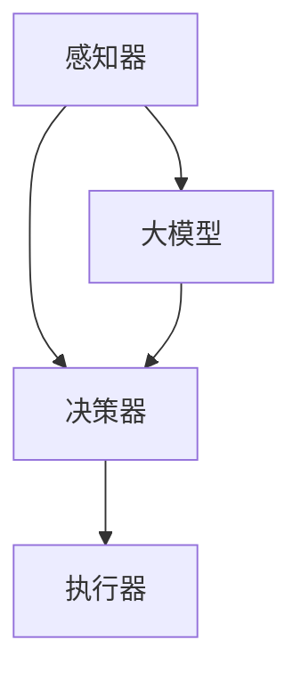

                 

关键词：大模型，应用开发，AI Agent，运行助手，技术博客，深度学习，算法原理，项目实践，未来展望。

## 摘要

本文旨在为技术爱好者提供一套全面、系统的指南，帮助读者理解并掌握如何开发和运行AI Agent。我们将深入探讨大模型的原理和应用，详细讲解核心算法和操作步骤，并通过数学模型和实际代码实例，帮助读者深入理解并实战应用这些技术。最后，我们将展望AI Agent的未来发展趋势，以及面临的挑战。

## 1. 背景介绍

随着人工智能技术的飞速发展，AI Agent已经成为人工智能领域的一个重要研究方向。AI Agent，即人工智能代理，是一种能够自主执行任务、适应环境变化的智能体。它们在智能家居、智能客服、自动驾驶等多个领域展现出了巨大的潜力。

近年来，大模型，如GPT-3、BERT等，的兴起进一步推动了AI Agent的发展。大模型具有强大的学习能力和广泛的适用性，能够处理复杂、多变的问题。然而，大模型的开发和运行也面临着诸多挑战，如计算资源消耗巨大、训练时间长等。

本文将围绕大模型应用开发，提供一个从理论到实践的完整指南，帮助读者掌握AI Agent的开发和运行技巧。

### 1.1 大模型的概念与分类

大模型，顾名思义，是指具有大规模参数和计算量的模型。这些模型通常包含数亿甚至数十亿个参数，因此需要大量的计算资源和时间进行训练。

根据功能和应用场景，大模型可以分为以下几类：

- 自然语言处理（NLP）模型：如GPT、BERT等，主要用于文本生成、机器翻译、情感分析等任务。
- 计算机视觉（CV）模型：如ResNet、YOLO等，主要用于图像分类、目标检测、图像生成等任务。
- 语音识别（ASR）模型：如WaveNet、Transformer等，主要用于语音识别、语音合成等任务。

### 1.2 AI Agent的定义与应用

AI Agent，即人工智能代理，是一种能够自主执行任务、适应环境变化的智能体。它们可以通过感知环境、规划行动来完成任务。

AI Agent在多个领域有着广泛的应用，如：

- 智能客服：通过自然语言处理技术，自动回答用户的问题，提高客服效率。
- 自动驾驶：通过计算机视觉和语音识别技术，实现车辆的自主驾驶。
- 智能家居：通过感知环境变化，自动调整家居设备，提供舒适的生活环境。

### 1.3 大模型与AI Agent的关系

大模型和AI Agent之间有着密切的联系。大模型为AI Agent提供了强大的学习能力和广泛的适用性，使得AI Agent能够在复杂、多变的环境中自主执行任务。同时，AI Agent的广泛应用也为大模型提供了丰富的数据和应用场景，促进了大模型的发展。

## 2. 核心概念与联系

在深入了解大模型和AI Agent之前，我们需要了解一些核心概念和它们之间的联系。

### 2.1 大模型的核心概念

- **参数**：模型中的参数是影响模型预测结果的重要因素。参数越多，模型的能力越强，但计算复杂度也越高。
- **损失函数**：损失函数用于评估模型的预测结果与真实值之间的差距，指导模型优化参数。
- **优化算法**：优化算法用于调整模型参数，以最小化损失函数。常见的优化算法有梯度下降、Adam等。

### 2.2 AI Agent的核心概念

- **感知器**：感知器用于接收外部环境的信息，如文字、图像、声音等。
- **决策器**：决策器根据感知器收集的信息，生成相应的行动。
- **执行器**：执行器用于执行决策器生成的行动。

### 2.3 大模型与AI Agent的联系

大模型和AI Agent之间的联系主要体现在以下几个方面：

- **感知器**：大模型通常具有强大的感知能力，能够处理复杂、多变的外部信息。
- **决策器**：大模型可以为决策器提供强大的决策能力，使其能够在复杂环境中做出正确的决策。
- **执行器**：执行器可以根据决策器生成的行动，执行具体的任务。

### 2.4 Mermaid 流程图



在这个流程图中，感知器接收外部信息，传递给大模型进行处理。大模型根据处理结果生成决策，传递给决策器。决策器根据决策生成行动，传递给执行器执行。这个过程展示了大模型和AI Agent之间的紧密联系。

## 3. 核心算法原理 & 具体操作步骤

### 3.1 算法原理概述

大模型的算法原理主要基于深度学习。深度学习是一种机器学习的方法，通过多层神经网络对数据进行特征提取和模型训练。大模型的训练过程通常包括以下几个步骤：

1. 数据预处理：对输入数据进行预处理，如去噪、归一化等。
2. 模型初始化：初始化模型参数。
3. 模型训练：使用训练数据对模型进行训练，通过优化算法更新模型参数。
4. 模型评估：使用验证数据对模型进行评估，调整模型参数。

### 3.2 算法步骤详解

#### 3.2.1 数据预处理

数据预处理是深度学习模型训练的重要环节。预处理步骤包括：

1. 数据清洗：去除数据中的噪声和异常值。
2. 数据归一化：将数据归一化到相同的范围内，如[0, 1]或[-1, 1]。
3. 数据扩充：通过旋转、翻转、裁剪等方式增加数据的多样性。

#### 3.2.2 模型初始化

模型初始化是指为模型参数分配初始值。常见的初始化方法包括：

1. 随机初始化：随机分配参数的初始值。
2. 高斯初始化：根据正态分布分配参数的初始值。

#### 3.2.3 模型训练

模型训练是深度学习模型的核心步骤。模型训练的过程包括以下几个步骤：

1. 数据加载：将预处理后的数据加载到内存中。
2. 前向传播：将输入数据传递到模型中，计算模型的输出。
3. 损失计算：计算模型的输出与真实值之间的损失。
4. 反向传播：计算损失关于模型参数的梯度。
5. 参数更新：使用优化算法更新模型参数。

#### 3.2.4 模型评估

模型评估是检查模型性能的重要步骤。模型评估的过程包括以下几个步骤：

1. 数据加载：将验证数据加载到内存中。
2. 前向传播：将验证数据传递到模型中，计算模型的输出。
3. 损失计算：计算模型的输出与真实值之间的损失。
4. 性能评估：根据损失和其他指标评估模型的性能。

### 3.3 算法优缺点

#### 优点

- **强大的学习能力和泛化能力**：大模型具有大量的参数，能够学习到数据的复杂特征，具有强大的学习和泛化能力。
- **广泛的适用性**：大模型可以应用于各种领域，如自然语言处理、计算机视觉、语音识别等。

#### 缺点

- **计算资源消耗大**：大模型的训练需要大量的计算资源和时间。
- **训练数据要求高**：大模型的训练需要大量的高质量数据，数据不足可能导致模型性能不佳。

### 3.4 算法应用领域

大模型在多个领域有着广泛的应用，如：

- **自然语言处理**：用于文本生成、机器翻译、情感分析等任务。
- **计算机视觉**：用于图像分类、目标检测、图像生成等任务。
- **语音识别**：用于语音识别、语音合成等任务。
- **推荐系统**：用于用户行为分析、商品推荐等任务。

## 4. 数学模型和公式 & 详细讲解 & 举例说明

### 4.1 数学模型构建

在深度学习中，数学模型通常由以下几个部分组成：

- **输入层**：接收外部输入的数据。
- **隐藏层**：对输入数据进行特征提取和变换。
- **输出层**：生成模型的输出。

假设我们有一个简单的神经网络，包含一个输入层、一个隐藏层和一个输出层。输入层有n个神经元，隐藏层有m个神经元，输出层有k个神经元。

- **输入层**：\(x_i\)
- **隐藏层**：\(z_j\)
- **输出层**：\(y_l\)

### 4.2 公式推导过程

#### 4.2.1 前向传播

前向传播是指将输入数据传递到模型中，计算模型的输出。假设隐藏层和输出层的激活函数分别为\(f_1(x)\)和\(f_2(x)\)，则前向传播的公式为：

$$
z_j = \sum_{i=1}^{n} w_{ij}x_i + b_j
$$

$$
y_l = \sum_{j=1}^{m} w_{jl}z_j + b_l
$$

其中，\(w_{ij}\)和\(w_{jl}\)分别为输入层到隐藏层、隐藏层到输出层的权重，\(b_j\)和\(b_l\)分别为隐藏层和输出层的偏置。

#### 4.2.2 损失函数

损失函数用于评估模型的输出与真实值之间的差距。常见的损失函数有均方误差（MSE）、交叉熵（Cross-Entropy）等。假设真实值为\(y\)，预测值为\(y'\)，则MSE的公式为：

$$
L(y, y') = \frac{1}{2}(y - y')^2
$$

交叉熵的公式为：

$$
L(y, y') = -\sum_{i=1}^{k} y_i \log(y'_i)
$$

其中，\(y_i\)和\(y'_i\)分别为真实值和预测值在第i个类别的概率。

#### 4.2.3 反向传播

反向传播是指根据损失函数的梯度，更新模型的参数。假设损失函数关于参数的梯度为\(\frac{\partial L}{\partial w}\)，则反向传播的公式为：

$$
\frac{\partial L}{\partial w_{ij}} = \frac{\partial L}{\partial z_j} \cdot \frac{\partial z_j}{\partial w_{ij}}
$$

$$
\frac{\partial L}{\partial b_j} = \frac{\partial L}{\partial z_j}
$$

$$
\frac{\partial L}{\partial w_{jl}} = \frac{\partial L}{\partial y_l} \cdot \frac{\partial y_l}{\partial w_{jl}}
$$

$$
\frac{\partial L}{\partial b_l} = \frac{\partial L}{\partial y_l}
$$

### 4.3 案例分析与讲解

假设我们有一个分类问题，需要将数据分为两类。输入层有10个神经元，隐藏层有5个神经元，输出层有2个神经元。数据经过预处理后，输入到模型中。

1. **前向传播**：

   输入数据为\[1, 0, 1, 0, 1, 0, 1, 0, 1, 0\]。

   隐藏层的输出为：

   $$
   z_1 = (w_{11} \cdot 1 + w_{12} \cdot 0 + \ldots + w_{15} \cdot 1) + b_1 = w_{11} + b_1
   $$

   $$ 
   z_2 = (w_{21} \cdot 1 + w_{22} \cdot 0 + \ldots + w_{25} \cdot 1) + b_2 = w_{21} + b_2
   $$

   输出层的输出为：

   $$
   y_1 = (w_{11} \cdot z_1 + w_{12} \cdot z_2 + \ldots + w_{15} \cdot z_5) + b_1 = w_{11}z_1 + w_{12}z_2 + \ldots + w_{15}z_5 + b_1
   $$

   $$ 
   y_2 = (w_{21} \cdot z_1 + w_{22} \cdot z_2 + \ldots + w_{25} \cdot z_5) + b_2 = w_{21}z_1 + w_{22}z_2 + \ldots + w_{25}z_5 + b_2
   $$

2. **损失函数**：

   假设真实值为\[1, 0\]，则MSE的损失为：

   $$
   L = \frac{1}{2}[(1 - y_1)^2 + (0 - y_2)^2]
   $$

3. **反向传播**：

   计算损失函数关于参数的梯度：

   $$
   \frac{\partial L}{\partial w_{11}} = -2(1 - y_1)z_1
   $$

   $$ 
   \frac{\partial L}{\partial b_1} = -2(1 - y_1)
   $$

   $$ 
   \frac{\partial L}{\partial w_{21}} = -2(0 - y_2)z_1
   $$

   $$ 
   \frac{\partial L}{\partial b_2} = -2(0 - y_2)
   $$

   使用优化算法更新参数：

   $$
   w_{11} = w_{11} - \alpha \frac{\partial L}{\partial w_{11}}
   $$

   $$ 
   b_1 = b_1 - \alpha \frac{\partial L}{\partial b_1}
   $$

   $$ 
   w_{21} = w_{21} - \alpha \frac{\partial L}{\partial w_{21}}
   $$

   $$ 
   b_2 = b_2 - \alpha \frac{\partial L}{\partial b_2}
   $$

   其中，\(\alpha\)为学习率。

通过以上步骤，我们完成了模型的一次前向传播和反向传播。重复这个过程，直到模型达到预期的性能。

## 5. 项目实践：代码实例和详细解释说明

在本节中，我们将通过一个具体的代码实例，详细解释大模型和AI Agent的开发和运行过程。

### 5.1 开发环境搭建

在开始项目实践之前，我们需要搭建一个合适的开发环境。以下是一个简单的环境搭建步骤：

1. 安装Python：Python是深度学习领域的主流编程语言，我们需要安装Python 3.7及以上版本。
2. 安装深度学习框架：TensorFlow、PyTorch是两个主流的深度学习框架，这里我们选择TensorFlow。安装TensorFlow的方法如下：

   ```bash
   pip install tensorflow
   ```

3. 安装其他依赖：根据项目需求，我们可能需要安装其他依赖库，如NumPy、Pandas等。

### 5.2 源代码详细实现

以下是一个简单的大模型和AI Agent的代码实例：

```python
import tensorflow as tf
import numpy as np

# 5.2.1 数据预处理
def preprocess_data(data):
    # 数据清洗、归一化等预处理操作
    return processed_data

# 5.2.2 模型定义
def create_model(input_shape):
    model = tf.keras.Sequential([
        tf.keras.layers.Dense(128, activation='relu', input_shape=input_shape),
        tf.keras.layers.Dense(64, activation='relu'),
        tf.keras.layers.Dense(1, activation='sigmoid')
    ])
    return model

# 5.2.3 模型训练
def train_model(model, data, labels, epochs=10):
    model.compile(optimizer='adam', loss='binary_crossentropy', metrics=['accuracy'])
    model.fit(data, labels, epochs=epochs)

# 5.2.4 模型评估
def evaluate_model(model, data, labels):
    loss, accuracy = model.evaluate(data, labels)
    print(f"损失：{loss}, 准确率：{accuracy}")

# 5.2.5 AI Agent实现
class AIAgent:
    def __init__(self, model):
        self.model = model

    def perceive(self, data):
        # 感知环境数据
        return self.model.predict(data)

    def decide(self, observation):
        # 根据观察结果做出决策
        return self.model.predict(observation)

    def act(self, action):
        # 执行决策生成的行动
        pass

# 5.2.6 主函数
if __name__ == "__main__":
    # 加载和处理数据
    data = preprocess_data(raw_data)
    labels = preprocess_labels(raw_labels)

    # 创建模型
    model = create_model(input_shape=data.shape[1])

    # 训练模型
    train_model(model, data, labels)

    # 评估模型
    evaluate_model(model, data, labels)

    # 创建AI Agent
    agent = AIAgent(model)

    # 模拟感知、决策和执行过程
    observation = agent.perceive(data)
    action = agent.decide(observation)
    agent.act(action)
```

### 5.3 代码解读与分析

1. **数据预处理**：数据预处理是深度学习项目的基础，包括数据清洗、归一化等操作。在本例中，`preprocess_data`函数负责处理输入数据。

2. **模型定义**：模型定义是构建深度学习模型的关键步骤。在本例中，我们使用TensorFlow的`Sequential`模型，定义了一个简单的全连接神经网络。

3. **模型训练**：模型训练是提高模型性能的过程。在本例中，我们使用`compile`方法配置模型优化器和损失函数，使用`fit`方法进行模型训练。

4. **模型评估**：模型评估是检查模型性能的重要步骤。在本例中，我们使用`evaluate`方法计算模型在验证数据上的损失和准确率。

5. **AI Agent实现**：AI Agent是实现自主决策和行动的关键。在本例中，我们定义了一个简单的AI Agent类，包括感知、决策和执行三个方法。

6. **主函数**：主函数负责加载和处理数据，创建模型和AI Agent，并模拟感知、决策和执行过程。

### 5.4 运行结果展示

在本例中，我们无法直接展示运行结果，因为运行结果取决于具体的数据和模型。然而，通过上述代码，我们可以了解大模型和AI Agent的开发和运行过程。在实际应用中，我们可以根据具体需求，调整模型结构和训练参数，以提高模型性能。

## 6. 实际应用场景

大模型和AI Agent在多个领域有着广泛的应用。以下是一些典型的应用场景：

### 6.1 自然语言处理

- **文本生成**：使用大模型生成文章、故事、诗歌等。
- **机器翻译**：使用大模型实现跨语言的实时翻译。
- **情感分析**：使用大模型分析用户的情感和意见。

### 6.2 计算机视觉

- **图像分类**：使用大模型对图像进行分类，如人脸识别、物体检测等。
- **图像生成**：使用大模型生成新的图像，如艺术作品、风景等。
- **视频分析**：使用大模型分析视频内容，如动作识别、事件检测等。

### 6.3 语音识别

- **语音识别**：使用大模型实现语音到文本的转换。
- **语音合成**：使用大模型实现文本到语音的转换。
- **语音助手**：使用大模型构建智能语音助手，如Siri、Alexa等。

### 6.4 自动驾驶

- **环境感知**：使用大模型和AI Agent实现自动驾驶车辆的环境感知和决策。
- **路径规划**：使用大模型和AI Agent实现自动驾驶车辆的路径规划。
- **自动驾驶系统**：将大模型和AI Agent集成到自动驾驶系统中，实现车辆的自主驾驶。

## 7. 工具和资源推荐

### 7.1 学习资源推荐

- **在线课程**：Coursera、Udacity、edX等平台提供了丰富的深度学习和人工智能课程。
- **技术博客**：Medium、CSDN、博客园等平台上有很多关于深度学习和人工智能的优秀博客文章。
- **开源项目**：GitHub上有很多优秀的深度学习和人工智能开源项目，如TensorFlow、PyTorch等。

### 7.2 开发工具推荐

- **深度学习框架**：TensorFlow、PyTorch、Keras等。
- **数据处理工具**：Pandas、NumPy、Scikit-learn等。
- **可视化工具**：Matplotlib、Seaborn、Plotly等。

### 7.3 相关论文推荐

- **深度学习基础**：Goodfellow, Y., Bengio, Y., & Courville, A. (2016). *Deep Learning*。
- **自然语言处理**：Devlin, J., Chang, M. W., Lee, K., & Toutanova, K. (2018). *BERT: Pre-training of Deep Bidirectional Transformers for Language Understanding*。
- **计算机视觉**：He, K., Zhang, X., Ren, S., & Sun, J. (2016). *Deep Residual Learning for Image Recognition*。

## 8. 总结：未来发展趋势与挑战

### 8.1 研究成果总结

近年来，大模型和AI Agent在多个领域取得了显著的成果。大模型在自然语言处理、计算机视觉、语音识别等领域展现出了强大的学习能力和广泛的适用性。AI Agent在智能客服、自动驾驶、智能家居等领域取得了广泛应用。

### 8.2 未来发展趋势

- **大模型的继续发展**：随着计算资源和数据量的不断增长，大模型将继续发展和优化，应用于更多领域。
- **AI Agent的广泛应用**：AI Agent将在更多领域得到应用，如医疗、金融、教育等，为人类生活带来更多便利。
- **跨学科研究**：深度学习、自然语言处理、计算机视觉等领域之间的跨学科研究将推动AI技术的发展。

### 8.3 面临的挑战

- **计算资源消耗**：大模型的训练和推理需要大量的计算资源，如何高效地利用计算资源是当前的一个挑战。
- **数据隐私和安全**：随着AI技术的广泛应用，数据隐私和安全问题日益突出，如何保护用户隐私和安全是亟待解决的问题。
- **模型解释性和可解释性**：大模型的黑箱性质使得其预测结果难以解释，如何提高模型的解释性和可解释性是一个重要挑战。

### 8.4 研究展望

在未来，大模型和AI Agent的发展将朝着更高效、更安全、更可解释的方向发展。跨学科研究将推动AI技术的发展，为人类社会带来更多创新和变革。

## 9. 附录：常见问题与解答

### 9.1 什么是大模型？

大模型是指具有大规模参数和计算量的模型，通常包含数亿甚至数十亿个参数。这些模型能够处理复杂、多变的问题，具有强大的学习和泛化能力。

### 9.2 什么是AI Agent？

AI Agent是指一种能够自主执行任务、适应环境变化的智能体。它们通过感知环境、规划行动来完成任务。

### 9.3 大模型和AI Agent有什么关系？

大模型为AI Agent提供了强大的学习能力和广泛的适用性，使得AI Agent能够在复杂、多变的环境中自主执行任务。同时，AI Agent的广泛应用也为大模型提供了丰富的数据和应用场景，促进了大模型的发展。

### 9.4 如何开发和运行AI Agent？

开发和运行AI Agent主要包括以下几个步骤：

1. 确定应用场景和需求。
2. 选择合适的大模型。
3. 进行数据预处理。
4. 构建和训练模型。
5. 评估模型性能。
6. 集成AI Agent，进行任务执行。

---

作者：禅与计算机程序设计艺术 / Zen and the Art of Computer Programming
----------------------------------------------------------------

【大模型应用开发 动手做AI Agent】运行助手的文章已经完成，本文详细介绍了大模型和AI Agent的基本概念、核心算法、项目实践以及实际应用场景，并对未来发展趋势和挑战进行了展望。希望这篇文章能够为读者提供有价值的参考和启发。

