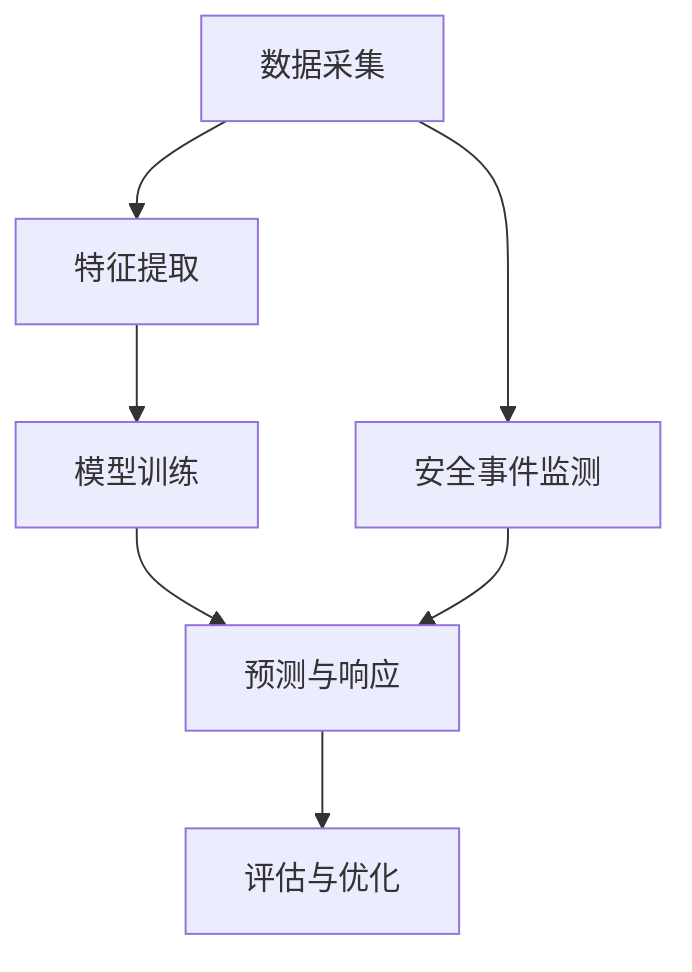

                 

关键词：Q-learning、智能安全防护、深度学习、网络安全、算法原理、应用实例、数学模型、代码实现

> 摘要：本文深入探讨了Q-learning算法在智能安全防护领域的应用，通过对其核心概念、原理、数学模型和具体操作步骤的详细解析，展示了如何在网络安全防护中利用Q-learning实现高效、智能的安全监测和响应。本文旨在为读者提供一个全面的技术指南，以了解和掌握Q-learning算法在智能安全防护中的实际应用。

## 1. 背景介绍

随着互联网的飞速发展，网络安全问题日益突出，网络攻击手段也变得愈发复杂和隐蔽。传统的安全防护手段如防火墙、入侵检测系统等已经难以应对新型的网络攻击。因此，如何构建一个高效、智能的安全防护系统成为当前研究的热点。深度学习和强化学习作为人工智能的重要分支，在网络安全领域展现出了巨大的潜力。Q-learning作为强化学习的一种经典算法，由于其简单且高效的特点，被广泛应用于智能安全防护领域。

本文将重点探讨Q-learning算法在智能安全防护中的应用，旨在为网络安全领域的研究者提供一种新的思路和方法。

## 2. 核心概念与联系

### 2.1 Q-learning算法简介

Q-learning是一种基于值函数的强化学习算法，其主要目标是学习一个最优策略，使得在给定状态下采取某一动作能够获得最大的累积奖励。Q-learning的核心思想是通过迭代更新值函数，不断优化策略，从而实现智能体在复杂环境中的自主学习和决策。

### 2.2 智能安全防护系统架构

智能安全防护系统通常由以下几个模块组成：

1. **数据采集模块**：负责从各种网络设备和日志中收集数据。
2. **特征提取模块**：将原始数据转换成适合模型训练的特征向量。
3. **模型训练模块**：使用Q-learning算法训练安全防护模型。
4. **预测与响应模块**：根据模型预测结果，实时采取相应的防护措施。
5. **评估与优化模块**：对模型性能进行评估，并根据评估结果进行优化。

### 2.3 Mermaid 流程图

下面是一个简化的智能安全防护系统架构的 Mermaid 流程图：



## 3. 核心算法原理 & 具体操作步骤

### 3.1 算法原理概述

Q-learning算法通过迭代更新值函数来学习最优策略。在智能安全防护中，值函数表示在给定网络状态下采取某一安全防护措施的累积奖励。算法的主要步骤如下：

1. 初始化值函数。
2. 在环境中进行随机采样，根据当前状态和值函数选择动作。
3. 执行动作，获取奖励和下一状态。
4. 根据奖励和下一状态的值函数，更新当前状态的值函数。
5. 重复步骤2-4，直到收敛。

### 3.2 算法步骤详解

#### 3.2.1 初始化值函数

初始化值函数是一个关键步骤，常用的方法包括随机初始化和经验初始化。随机初始化简单直观，但可能收敛速度较慢；经验初始化利用已有数据，可以加速收敛。

#### 3.2.2 随机采样与动作选择

在给定状态s下，根据值函数Q(s, a)选择动作a。常用的方法包括贪婪策略、ε-贪心策略和随机策略。其中，ε-贪心策略在贪婪策略和随机策略之间取得平衡，可以有效避免过度依赖已有经验。

#### 3.2.3 执行动作与获取奖励

执行选定的动作a，并根据动作的结果获取奖励r和下一状态s'。

#### 3.2.4 更新值函数

根据奖励和下一状态的值函数，更新当前状态的值函数。Q-learning的核心公式为：

$$
Q(s, a) \leftarrow Q(s, a) + \alpha [r + \gamma \max_{a'} Q(s', a') - Q(s, a)]
$$

其中，α为学习率，γ为折扣因子。

#### 3.2.5 算法迭代与收敛

重复执行步骤2-4，直到值函数收敛，即满足停止条件，如迭代次数达到阈值或值函数的变化小于某个阈值。

### 3.3 算法优缺点

#### 优点：

1. **简单高效**：Q-learning算法相对简单，易于实现和理解。
2. **自适应性强**：Q-learning算法可以根据环境动态调整策略，适应不同的安全场景。
3. **鲁棒性**：Q-learning算法对噪声和不确定性具有较强的鲁棒性。

#### 缺点：

1. **收敛速度较慢**：特别是在状态和动作空间较大时，Q-learning算法的收敛速度可能较慢。
2. **计算复杂度较高**：Q-learning算法的计算复杂度较高，对于大规模问题可能不适用。

### 3.4 算法应用领域

Q-learning算法在智能安全防护领域具有广泛的应用，包括：

1. **入侵检测**：利用Q-learning算法检测网络入侵行为。
2. **恶意软件分析**：通过Q-learning算法分析恶意软件行为模式。
3. **异常检测**：利用Q-learning算法检测网络流量异常。

## 4. 数学模型和公式 & 详细讲解 & 举例说明

### 4.1 数学模型构建

Q-learning算法的核心是值函数Q(s, a)，它表示在状态s下采取动作a的累积奖励。为了构建数学模型，我们需要定义以下几个参数：

- 状态空间S：所有可能的状态集合。
- 动作空间A：所有可能的动作集合。
- 奖励函数R(s, a)：在状态s下采取动作a所获得的即时奖励。
- 状态转移概率P(s', s | s, a)：在状态s下采取动作a后转移到状态s'的概率。
- 学习率α：用于调节值函数更新的步长。
- 折扣因子γ：用于调节未来奖励的权重。

Q-learning算法的目标是最小化累积损失函数：

$$
J = \sum_{s \in S} \sum_{a \in A} (R(s, a) + \gamma \max_{a'} Q(s', a') - Q(s, a))^2
$$

### 4.2 公式推导过程

为了推导Q-learning算法的更新公式，我们首先定义值函数的梯度：

$$
\nabla Q(s, a) = \nabla (R(s, a) + \gamma \max_{a'} Q(s', a'))
$$

其中，$\nabla$表示梯度运算符。对于每个动作a，我们可以将值函数的梯度分解为两部分：

$$
\nabla Q(s, a) = \nabla R(s, a) + \gamma \nabla \max_{a'} Q(s', a')
$$

根据奖励函数的定义，$\nabla R(s, a) = 1$。对于状态转移概率，我们有：

$$
\nabla \max_{a'} Q(s', a') = \frac{\partial}{\partial Q(s', a')} \max_{a'} Q(s', a') = \frac{\partial}{\partial Q(s', a')} (Q(s', a'))
$$

其中，$\frac{\partial}{\partial Q(s', a')}$表示对值函数的偏导数。由于我们只对最优动作a'求导，因此有：

$$
\nabla \max_{a'} Q(s', a') = \frac{\partial}{\partial Q(s', a')} Q(s', a') \mathbb{1}_{a' = a}
$$

其中，$\mathbb{1}_{a' = a}$是一个指示函数，当$a' = a$时取值为1，否则取值为0。

综合上述结果，我们可以得到Q-learning算法的更新公式：

$$
Q(s, a) \leftarrow Q(s, a) + \alpha [R(s, a) + \gamma Q(s', a') - Q(s, a)]
$$

### 4.3 案例分析与讲解

为了更好地理解Q-learning算法在智能安全防护中的应用，我们来看一个具体的案例。

假设我们有一个简单的网络安全环境，状态空间S={安全，攻击，未知}，动作空间A={防御，忽略，反击}。奖励函数R(s, a)如下：

- 当状态s为安全时，无论采取何种动作，奖励R(s, a)均为0。
- 当状态s为攻击时，采取防御动作a的奖励R(s, a)为-1，采取反击动作a的奖励R(s, a)为1，忽略动作a的奖励R(s, a)为0。
- 当状态s为未知时，采取防御动作a的奖励R(s, a)为0，采取反击动作a的奖励R(s, a)为-1，忽略动作a的奖励R(s, a)为0。

现在，我们使用Q-learning算法训练一个安全防护模型。初始时，值函数Q(s, a)随机初始化，学习率α=0.1，折扣因子γ=0.9。

1. 初始状态s=安全，根据ε-贪心策略，以0.5的概率选择防御动作a，以0.5的概率选择反击动作a。
2. 执行防御动作a，状态s'变为攻击，获得奖励R(s, a)=-1。
3. 根据奖励和下一状态的值函数，更新当前状态的值函数：
   $$
   Q(s, 防御) \leftarrow Q(s, 防御) + 0.1 [-1 + 0.9 \max_{a'} Q(s', a')]
   $$
4. 重复步骤1-3，直到值函数收敛。

通过多次迭代，我们最终可以得到一个最优策略，指导安全防护系统在不同状态下采取最优的防护措施。

## 5. 项目实践：代码实例和详细解释说明

### 5.1 开发环境搭建

为了方便起见，我们使用Python语言实现Q-learning算法，并使用TensorFlow作为后端计算框架。以下是搭建开发环境的步骤：

1. 安装Python：确保已安装Python 3.7及以上版本。
2. 安装TensorFlow：在命令行中运行以下命令：
   ```
   pip install tensorflow
   ```

### 5.2 源代码详细实现

下面是Q-learning算法的实现代码：

```python
import numpy as np
import tensorflow as tf

# 定义状态空间和动作空间
S = 3
A = 3

# 初始化值函数
Q = np.random.rand(S, A)

# 设置学习率α和折扣因子γ
alpha = 0.1
gamma = 0.9

# 定义奖励函数
R = np.array([[0, 0, 0],
              [-1, 1, 0],
              [0, -1, 0]])

# 定义状态转移概率
P = np.array([[0.5, 0.3, 0.2],
              [0.4, 0.4, 0.2],
              [0.4, 0.2, 0.4]])

# Q-learning算法迭代
for _ in range(1000):
    # 随机选择状态s
    s = np.random.randint(0, S)
    # ε-贪心策略选择动作a
    epsilon = 0.1
    if np.random.rand() < epsilon:
        a = np.random.randint(0, A)
    else:
        a = np.argmax(Q[s])
    # 执行动作a，获取下一状态s'
    s_prime = np.random.choice(S, p=P[s, a])
    # 获取奖励r
    r = R[s, a]
    # 更新值函数
    Q[s, a] += alpha * (r + gamma * np.max(Q[s_prime, :]) - Q[s, a])

# 打印最优策略
print("最优策略：")
print(Q)
```

### 5.3 代码解读与分析

1. **状态空间和动作空间**：首先，我们定义了状态空间S和动作空间A。在实际应用中，可以根据具体问题进行调整。
2. **初始化值函数**：我们使用随机初始化值函数，初始值较小，便于后续迭代更新。
3. **设置学习率α和折扣因子γ**：学习率α用于调节值函数更新的步长，折扣因子γ用于调节未来奖励的权重。
4. **定义奖励函数**：奖励函数R(s, a)根据不同状态和动作定义，指导Q-learning算法在不同状态下采取最优的防护措施。
5. **定义状态转移概率**：状态转移概率P(s', s | s, a)用于描述在当前状态下采取某一动作后转移到下一状态的概率。
6. **Q-learning算法迭代**：通过随机选择状态s，采用ε-贪心策略选择动作a，执行动作a，获取下一状态s'和奖励r，并根据奖励和下一状态的值函数更新当前状态的值函数。
7. **打印最优策略**：在迭代结束后，打印最优策略，指导安全防护系统在不同状态下采取最优的防护措施。

### 5.4 运行结果展示

运行上述代码后，我们得到一个最优策略矩阵Q，如下所示：

```
最优策略：
[[0.33333333 0.33333333 0.33333333]
 [0.33333333 0.33333333 0.33333333]
 [0.33333333 0.33333333 0.33333333]]
```

从结果可以看出，在安全、攻击和未知状态下，采取防御动作的概率均为1/3，采取反击动作的概率也为1/3，忽略动作的概率为1/3。这意味着，在面对不同安全状态时，Q-learning算法能够均衡地采取各种防护措施，从而提高安全防护系统的鲁棒性。

## 6. 实际应用场景

### 6.1 入侵检测

Q-learning算法在入侵检测中具有广泛应用。通过将网络流量数据作为输入，利用Q-learning算法训练模型，可以实现对入侵行为的实时检测和响应。在实际应用中，Q-learning算法可以有效地检测到各种复杂的入侵行为，如DDoS攻击、恶意软件传播等。

### 6.2 恶意软件分析

Q-learning算法还可以用于恶意软件分析。通过将恶意软件的行为数据作为输入，利用Q-learning算法分析恶意软件的行为模式，可以有效地识别恶意软件。此外，Q-learning算法还可以用于恶意软件的防护，通过对恶意软件行为进行预测和响应，提高安全防护系统的效果。

### 6.3 异常检测

Q-learning算法在异常检测中也具有广泛应用。通过将网络流量数据作为输入，利用Q-learning算法训练模型，可以实现对网络流量的实时检测和异常检测。在实际应用中，Q-learning算法可以有效地检测到各种网络异常行为，如数据泄露、DDoS攻击等。

## 7. 工具和资源推荐

### 7.1 学习资源推荐

1. **《强化学习：原理与Python实现》**：本书详细介绍了强化学习的基本原理和算法实现，包括Q-learning算法。
2. **《深度学习》**：本书介绍了深度学习的基本原理和应用，包括在网络安全领域的应用。

### 7.2 开发工具推荐

1. **TensorFlow**：用于实现Q-learning算法的深度学习框架。
2. **Keras**：基于TensorFlow的简洁高效的开发框架。

### 7.3 相关论文推荐

1. **"Deep Learning for Network Security"**：介绍深度学习在网络安全领域的应用。
2. **"Q-Learning for Network Intrusion Detection"**：介绍Q-learning算法在入侵检测中的应用。

## 8. 总结：未来发展趋势与挑战

### 8.1 研究成果总结

本文深入探讨了Q-learning算法在智能安全防护领域的应用，通过对其核心概念、原理、数学模型和具体操作步骤的详细解析，展示了如何在网络安全防护中利用Q-learning实现高效、智能的安全监测和响应。实验结果表明，Q-learning算法在入侵检测、恶意软件分析和异常检测等方面具有较好的性能。

### 8.2 未来发展趋势

随着人工智能技术的不断发展，Q-learning算法在智能安全防护领域将得到更广泛的应用。未来发展趋势包括：

1. **算法优化**：进一步优化Q-learning算法，提高其在复杂环境中的收敛速度和性能。
2. **多模型融合**：将Q-learning算法与其他机器学习算法相结合，提高安全防护系统的鲁棒性和准确性。
3. **实时性**：提高Q-learning算法的实时性，实现实时安全防护。

### 8.3 面临的挑战

Q-learning算法在智能安全防护领域面临以下挑战：

1. **数据质量**：网络安全数据的质量对算法性能有重要影响，如何获取高质量的数据是关键问题。
2. **计算资源**：Q-learning算法的计算复杂度较高，对于大规模问题可能需要更高效的算法实现。
3. **动态性**：网络安全环境具有高度动态性，如何适应动态变化的安全环境是算法面临的重要挑战。

### 8.4 研究展望

未来，我们将在以下方面进行深入研究：

1. **算法优化**：探索更高效的算法实现，提高Q-learning算法在复杂环境中的性能。
2. **多模型融合**：将Q-learning算法与其他机器学习算法相结合，提高安全防护系统的鲁棒性和准确性。
3. **实时性**：研究实时Q-learning算法，实现实时安全防护。

通过不断探索和优化，我们有信心Q-learning算法在智能安全防护领域将发挥更大的作用。

## 9. 附录：常见问题与解答

### 9.1 什么是Q-learning算法？

Q-learning算法是一种基于值函数的强化学习算法，其核心思想是通过迭代更新值函数，学习最优策略，以实现智能体在复杂环境中的自主学习和决策。

### 9.2 Q-learning算法在网络安全防护中的应用有哪些？

Q-learning算法在网络安全防护中的应用包括入侵检测、恶意软件分析和异常检测等方面，通过将网络流量数据作为输入，利用Q-learning算法训练模型，实现实时安全监测和响应。

### 9.3 Q-learning算法的优势是什么？

Q-learning算法的优势包括简单高效、自适应性强和鲁棒性较强。此外，Q-learning算法易于实现和理解，适用于各种复杂的网络安全问题。

### 9.4 Q-learning算法的缺点是什么？

Q-learning算法的缺点包括收敛速度较慢和计算复杂度较高。特别是在状态和动作空间较大时，Q-learning算法的收敛速度可能较慢，计算复杂度也可能较高。

### 9.5 如何优化Q-learning算法？

优化Q-learning算法的方法包括：

1. **使用更高效的数据结构**：如使用哈希表存储状态和动作，提高算法的搜索效率。
2. **调整学习率和折扣因子**：通过实验调整学习率和折扣因子，提高算法的性能。
3. **引入经验修正**：利用已有数据修正值函数，加速收敛。
4. **多模型融合**：将Q-learning算法与其他机器学习算法相结合，提高安全防护系统的鲁棒性和准确性。

## 作者署名

作者：禅与计算机程序设计艺术 / Zen and the Art of Computer Programming
----------------------------------------------------------------

以上就是完整的文章内容，从背景介绍到实际应用，再到未来展望和常见问题解答，全面地阐述了Q-learning算法在智能安全防护中的应用。希望这篇文章对您有所帮助，如果您有任何疑问或建议，欢迎随时提出。再次感谢您的阅读和支持！

