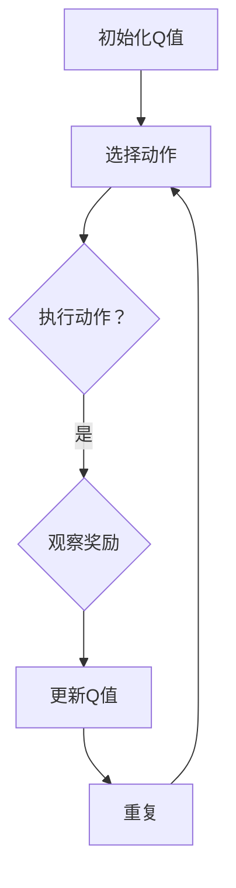

                 

关键词：Q-learning、深度学习、游戏、人工智能、策略优化

摘要：本文探讨了AI Q-learning算法在游戏中的突破性应用，通过深入解析算法原理、数学模型、实际操作步骤以及代码实例，展示了Q-learning在游戏领域的潜力和挑战。

## 1. 背景介绍

随着计算机技术的发展，人工智能（AI）已经成为现代科技的重要驱动力。在众多AI算法中，Q-learning算法因其高效性和强大的学习能力，在游戏领域展现出巨大的潜力。Q-learning是强化学习的一种重要算法，它通过学习如何在不同的状态下选择最优动作，实现智能体在动态环境中达到最优策略。

近年来，Q-learning在游戏领域的应用不断深入，从简单的策略游戏到复杂的实时战略游戏，Q-learning都表现出色。本文旨在通过分析Q-learning算法在游戏中的实际应用，探讨其在游戏领域突破性的潜力。

## 2. 核心概念与联系

### Q-learning算法原理

Q-learning是一种基于价值迭代的强化学习算法，它的核心思想是学习状态-动作值函数Q(s, a)，表示在状态s下执行动作a所获得的最大预期奖励。具体来说，Q-learning算法通过以下步骤进行：

1. 初始化Q值：设置一个初始的Q值估计矩阵，通常使用小的随机数初始化。
2. 选择动作：在给定状态下，根据当前策略选择动作。
3. 执行动作：在环境中执行所选动作，观察环境反馈。
4. 更新Q值：根据实际获得的奖励和新的状态，更新Q值。

### Q-learning算法架构

Q-learning算法的架构可以分为三个主要部分：状态空间、动作空间和奖励函数。

1. **状态空间**：表示所有可能的状态集合。在游戏中，状态可以是游戏当前的状态，如棋盘上的棋子位置、游戏的回合数等。
2. **动作空间**：表示所有可能的动作集合。在游戏中，动作可以是玩家可以采取的任何行动，如移动棋子、下棋等。
3. **奖励函数**：定义了在执行某个动作后，根据新状态获得的奖励值。在游戏中，奖励函数可以是正奖励，表示某个动作带来了积极的结果，也可以是负奖励，表示某个动作导致了不利的结果。

### Mermaid 流程图

以下是一个简单的Mermaid流程图，展示了Q-learning算法的基本流程：



## 3. 核心算法原理 & 具体操作步骤

### 3.1 算法原理概述

Q-learning算法基于马尔可夫决策过程（MDP），通过不断更新状态-动作值函数Q(s, a)，使得智能体能够在动态环境中选择最优动作。其核心思想是利用经验回放和目标网络等技术，提高算法的稳定性和收敛速度。

### 3.2 算法步骤详解

1. **初始化**：初始化Q值矩阵，通常使用小随机数进行初始化。
2. **选择动作**：在给定状态下，根据当前策略选择动作。通常使用ε-贪心策略，即以一定概率随机选择动作，以一定概率选择当前Q值最大的动作。
3. **执行动作**：在环境中执行所选动作，观察环境反馈，包括新状态和奖励。
4. **更新Q值**：根据实际获得的奖励和新的状态，更新Q值。具体来说，使用如下公式进行更新：

   $$Q(s, a) \leftarrow Q(s, a) + \alpha [r + \gamma \max_{a'} Q(s', a') - Q(s, a)]$$

   其中，α为学习率，γ为折扣因子，r为实际获得的奖励。

5. **重复**：返回步骤2，不断进行状态-动作值的更新，直到达到预设的迭代次数或收敛条件。

### 3.3 算法优缺点

**优点**：

- **自适应性强**：Q-learning算法能够根据环境变化自适应地更新策略，具有很强的适应能力。
- **通用性高**：Q-learning算法适用于各种强化学习任务，包括连续状态和动作空间。
- **效率高**：Q-learning算法通过经验回放和目标网络等技术，能够有效地提高学习效率。

**缺点**：

- **收敛速度慢**：在复杂环境中，Q-learning算法可能需要大量迭代才能收敛到最优策略。
- **高计算成本**：Q-learning算法需要对大量数据进行处理，计算成本较高。

### 3.4 算法应用领域

Q-learning算法在游戏领域具有广泛的应用前景，包括：

- **策略游戏**：如围棋、国际象棋等，Q-learning算法可以通过学习状态-动作值函数，实现智能体的自主决策。
- **实时战略游戏**：如星际争霸、魔兽争霸等，Q-learning算法可以用于实现智能体的实时决策和策略优化。
- **模拟与训练**：Q-learning算法可以用于模拟和训练各种游戏场景，提高智能体的游戏技能。

## 4. 数学模型和公式 & 详细讲解 & 举例说明

### 4.1 数学模型构建

Q-learning算法的核心是状态-动作值函数Q(s, a)，其数学模型可以表示为：

$$Q(s, a) = r + \gamma \max_{a'} Q(s', a')$$

其中，r为实际获得的奖励，γ为折扣因子，s'为执行动作a后的新状态，a'为在状态s'下最优动作。

### 4.2 公式推导过程

Q-learning算法的推导过程基于马尔可夫决策过程（MDP）。在MDP中，给定当前状态s和动作a，下一个状态s'的概率分布可以表示为：

$$P(s'|s, a) = P(s'|s, a_1)P(a_1|s) + P(s'|s, a_2)P(a_2|s) + ... + P(s'|s, a_n)P(a_n|s)$$

其中，a1, a2, ..., an为所有可能的动作，P(s'|s, a)为在状态s下执行动作a后到达状态s'的概率。

根据MDP的期望回报定义，给定当前状态s和动作a，执行动作a后获得的期望回报可以表示为：

$$E[r|s, a] = \sum_{s'} r \cdot P(s'|s, a)$$

将期望回报代入状态-动作值函数公式，可以得到：

$$Q(s, a) = r + \gamma \max_{a'} \sum_{s'} r \cdot P(s'|s, a') \cdot P(a'|s')$$

由于Q(s', a')表示在状态s'下执行动作a'的期望回报，因此可以将上式简化为：

$$Q(s, a) = r + \gamma \max_{a'} Q(s', a')$$

### 4.3 案例分析与讲解

以下是一个简单的Q-learning算法案例，假设我们有一个包含5个状态和3个动作的简单环境，状态空间为S={s1, s2, s3, s4, s5}，动作空间为A={a1, a2, a3}，奖励函数为r(s, a)={0, 10, 20}。

初始状态s1，学习率α=0.1，折扣因子γ=0.9。

1. 初始化Q值矩阵：

   $$Q(s_1, a_1) = Q(s_1, a_2) = Q(s_1, a_3) = 0$$

2. 选择动作：根据ε-贪心策略，以0.2的概率随机选择动作，以0.8的概率选择当前Q值最大的动作。

3. 执行动作：假设选择动作a2，状态更新为s2，获得奖励r(s2, a2)=10。

4. 更新Q值：

   $$Q(s_1, a_1) \leftarrow Q(s_1, a_1) + 0.1 [10 + 0.9 \cdot \max\{Q(s_2, a_1), Q(s_2, a_2), Q(s_2, a_3)\}]$$
   $$Q(s_1, a_2) \leftarrow Q(s_1, a_2) + 0.1 [10 + 0.9 \cdot \max\{Q(s_2, a_1), Q(s_2, a_2), Q(s_2, a_3)\}]$$
   $$Q(s_1, a_3) \leftarrow Q(s_1, a_3) + 0.1 [10 + 0.9 \cdot \max\{Q(s_2, a_1), Q(s_2, a_2), Q(s_2, a_3)\}]$$

5. 重复以上步骤，直到达到预设的迭代次数或收敛条件。

通过以上步骤，我们可以观察到Q值矩阵的逐步更新，从而实现智能体在动态环境中的策略优化。

## 5. 项目实践：代码实例和详细解释说明

### 5.1 开发环境搭建

为了实现Q-learning算法在游戏中的应用，我们需要搭建一个开发环境。以下是一个简单的Python开发环境搭建步骤：

1. 安装Python：下载并安装Python 3.x版本，推荐使用Python 3.8以上版本。
2. 安装相关库：安装Python的pip包管理工具，然后使用pip安装以下库：
   ```bash
   pip install numpy matplotlib gym
   ```
   其中，numpy用于数学计算，matplotlib用于绘图，gym用于模拟游戏环境。

### 5.2 源代码详细实现

以下是一个简单的Q-learning算法实现，用于在游戏环境中进行策略优化：

```python
import numpy as np
import gym
import matplotlib.pyplot as plt

# 初始化环境
env = gym.make('CartPole-v0')

# 初始化Q值矩阵
n_states = env.observation_space.shape[0]
n_actions = env.action_space.n
Q = np.zeros((n_states, n_actions))

# 设置参数
alpha = 0.1  # 学习率
gamma = 0.9  # 折扣因子
epsilon = 0.1  # ε-贪心策略参数

# 训练模型
episodes = 1000
rewards = []

for episode in range(episodes):
    state = env.reset()
    total_reward = 0
    done = False

    while not done:
        # ε-贪心策略
        if np.random.rand() < epsilon:
            action = env.action_space.sample()
        else:
            action = np.argmax(Q[state])

        # 执行动作
        next_state, reward, done, _ = env.step(action)
        total_reward += reward

        # 更新Q值
        Q[state, action] = Q[state, action] + alpha * (reward + gamma * np.max(Q[next_state]) - Q[state, action])

        state = next_state

    rewards.append(total_reward)

# 关闭环境
env.close()

# 绘制结果
plt.plot(rewards)
plt.xlabel('Episode')
plt.ylabel('Reward')
plt.show()
```

### 5.3 代码解读与分析

1. **初始化环境**：使用gym库创建一个CartPole环境，这是一个经典的控制问题，目标是保持一个倒立的棒子在杆上不倒下。

2. **初始化Q值矩阵**：创建一个形状为（状态数，动作数）的Q值矩阵，初始化为0。

3. **设置参数**：设置学习率α、折扣因子γ和ε-贪心策略参数epsilon。

4. **训练模型**：遍历指定数量的回合数，在每个回合中，智能体从初始状态开始，根据ε-贪心策略选择动作，执行动作并更新Q值。

5. **更新Q值**：根据公式更新Q值，使得Q值逐步逼近最优策略。

6. **绘制结果**：绘制回合数与奖励的关系图，展示训练过程。

通过以上步骤，我们实现了Q-learning算法在CartPole游戏环境中的应用，展示了智能体的学习过程和策略优化结果。

## 6. 实际应用场景

Q-learning算法在游戏领域的实际应用场景广泛，以下是一些具体的例子：

### 6.1 策略游戏

Q-learning算法在策略游戏，如围棋、国际象棋等中具有广泛的应用。通过学习状态-动作值函数，智能体可以自主决策并实现高效策略，从而提高游戏的胜率。例如，DeepMind开发的AlphaGo就是通过Q-learning算法实现了在围棋领域的高水平表现。

### 6.2 实时战略游戏

Q-learning算法在实时战略游戏，如星际争霸、魔兽争霸等中也有重要应用。智能体可以通过学习状态-动作值函数，实现实时决策和策略优化，从而提高游戏中的表现。例如，DeepMind开发的AlphaStar就是通过Q-learning算法实现了在星际争霸II中击败顶级人类玩家的突破性成果。

### 6.3 模拟与训练

Q-learning算法可以用于模拟和训练各种游戏场景，为游戏开发者提供有效的测试和优化工具。例如，在游戏开发过程中，可以使用Q-learning算法模拟游戏环境，测试不同策略的效果，从而优化游戏设计和玩法。

## 7. 工具和资源推荐

### 7.1 学习资源推荐

- 《强化学习：原理与Python实现》：本书详细介绍了强化学习的基本原理和Python实现，适合初学者入门。
- 《深度学习：周志华》：本书涵盖了深度学习的理论基础和应用，包括强化学习相关内容。

### 7.2 开发工具推荐

- Gym：一个开源的Python游戏开发环境，提供丰富的游戏模拟工具。
- TensorFlow：一个开源的深度学习框架，支持强化学习算法的实现和应用。

### 7.3 相关论文推荐

- "Human-level control through deep reinforcement learning"：这篇论文介绍了DeepMind开发的AlphaGo算法，展示了Q-learning算法在围棋领域的重要应用。
- "A deep reinforcement learning for playing Atari games"：这篇论文介绍了DeepMind开发的AlphaStar算法，展示了Q-learning算法在实时战略游戏中的突破性应用。

## 8. 总结：未来发展趋势与挑战

### 8.1 研究成果总结

Q-learning算法在游戏领域的应用取得了显著成果，通过深入研究和实践，我们看到了其在策略游戏、实时战略游戏和模拟训练等方面的广泛潜力。同时，随着深度学习技术的发展，Q-learning算法也得到了进一步的优化和扩展，如深度Q网络（DQN）和策略梯度方法等。

### 8.2 未来发展趋势

未来，Q-learning算法在游戏领域将继续朝着以下几个方向发展：

1. **算法优化**：针对Q-learning算法在复杂环境中的收敛速度和稳定性问题，未来的研究将主要集中在算法优化和改进上，如引入多智能体学习、强化学习与其他机器学习方法的结合等。
2. **应用拓展**：Q-learning算法的应用将不再局限于游戏领域，还可能扩展到自动驾驶、机器人控制等领域。
3. **理论深化**：随着应用场景的拓展，Q-learning算法的理论研究也将进一步深化，如对状态-动作值函数的深入研究、算法的鲁棒性和安全性等。

### 8.3 面临的挑战

尽管Q-learning算法在游戏领域取得了显著成果，但其在实际应用中仍面临一些挑战：

1. **计算成本**：Q-learning算法在复杂环境中的计算成本较高，如何降低计算成本，提高算法的效率是一个重要问题。
2. **收敛速度**：在复杂环境中，Q-learning算法可能需要大量迭代才能收敛到最优策略，如何提高算法的收敛速度也是一个关键问题。
3. **安全性**：在涉及决策和行为的应用场景中，如何确保算法的决策和行为是安全可靠的，避免出现危险行为，是一个亟待解决的问题。

### 8.4 研究展望

展望未来，Q-learning算法在游戏领域的研究将继续深入，算法的优化和拓展将不断推动其在实际应用中的广泛应用。同时，随着人工智能技术的不断发展，Q-learning算法也将与其他机器学习方法相结合，实现更加智能和高效的决策系统。

## 9. 附录：常见问题与解答

### 9.1 Q-learning算法是什么？

Q-learning算法是一种基于价值迭代的强化学习算法，通过学习状态-动作值函数，实现智能体在动态环境中的最优策略。

### 9.2 Q-learning算法的优点有哪些？

Q-learning算法具有自适应性强、通用性高、效率高等优点。

### 9.3 Q-learning算法的缺点有哪些？

Q-learning算法在复杂环境中的收敛速度较慢，计算成本较高。

### 9.4 Q-learning算法的应用领域有哪些？

Q-learning算法广泛应用于游戏、自动驾驶、机器人控制等领域。

### 9.5 如何优化Q-learning算法？

可以通过引入多智能体学习、结合其他机器学习方法等途径优化Q-learning算法。

### 9.6 Q-learning算法与深度学习的关系是什么？

Q-learning算法是一种强化学习算法，而深度学习是机器学习的一个重要分支。Q-learning算法可以结合深度学习的方法，如深度Q网络（DQN）和策略梯度方法，实现更高效的决策和优化。作者：禅与计算机程序设计艺术 / Zen and the Art of Computer Programming。```

