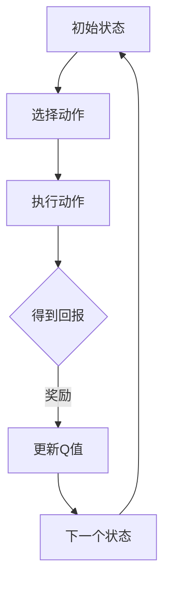

                 

关键词：环境监测、AI、Q-learning、映射、实践

> 摘要：本文将探讨如何运用AI中的Q-learning算法来应对环境监测领域中的挑战，通过理论介绍、实际案例和代码解析，展示了Q-learning在环境监测中的强大应用潜力。

## 1. 背景介绍

### 1.1 环境监测的重要性

环境监测是确保地球生态系统健康和可持续发展的关键环节。无论是空气质量、水质、土壤污染，还是生态系统的动态变化，都离不开准确、及时的环境监测数据。然而，传统的监测方法往往受限于监测设备的技术水平和监测点的分布密度，导致数据覆盖不全、时效性差等问题。

### 1.2 AI与Q-learning算法的引入

随着人工智能技术的快速发展，机器学习和深度学习在环境监测领域展现出了巨大的潜力。其中，Q-learning作为一种强化学习算法，因其能够通过不断尝试和反馈来优化决策过程，特别适用于动态、复杂环境中的环境监测任务。

## 2. 核心概念与联系

为了更好地理解Q-learning在环境监测中的应用，我们需要先了解以下几个核心概念：

### 2.1 环境监测中的状态和动作

在环境监测中，状态（State）可以描述为环境的一个特定配置，例如空气质量中的PM2.5浓度、水质中的COD值等。而动作（Action）则是指监测人员为了改善状态所采取的措施，如调整监测设备位置、增加监测点等。

### 2.2 Q-learning算法的基本原理

Q-learning是一种基于值函数的强化学习算法，它通过不断试错来学习最优策略。在Q-learning中，Q值（Q-value）表示在某一状态下执行某一动作的预期回报。算法的核心目标是找到使得总回报最大的策略。

### 2.3 Mermaid流程图



## 3. 核心算法原理 & 具体操作步骤

### 3.1 算法原理概述

Q-learning算法通过迭代计算Q值，从而逐步优化策略。其基本步骤包括：

1. 初始化Q值表。
2. 在某一状态下随机选择动作。
3. 执行动作并得到回报。
4. 根据回报更新Q值。
5. 转移到下一个状态，重复上述步骤。

### 3.2 算法步骤详解

#### 3.2.1 初始化Q值表

初始化Q值表是一个重要的步骤，它决定了算法的初始状态。通常，我们可以将Q值表初始化为全0或者根据经验数据进行初始化。

```latex
Q(s, a) = 0 \quad \text{for all states } s \text{ and actions } a
```

#### 3.2.2 选择动作

在给定状态下，选择动作的依据可以是随机选择、贪婪选择或者基于epsilon-greedy策略。

#### 3.2.3 执行动作并得到回报

执行选定的动作后，系统会根据动作的结果得到回报。回报可以是立即回报，也可以是延迟回报。

```latex
R(s, a) = \text{立即回报}
```

#### 3.2.4 更新Q值

更新Q值的公式如下：

```latex
Q(s, a) \leftarrow Q(s, a) + \alpha [R(s, a) + \gamma \max_{a'} Q(s', a') - Q(s, a)]
```

其中，\(\alpha\)是学习率，\(\gamma\)是折扣因子，\(s'\)是下一个状态，\(a'\)是下一个动作。

#### 3.2.5 转移到下一个状态

根据执行的动作和得到的回报，系统将转移到下一个状态。

### 3.3 算法优缺点

**优点：**
- 能够自动发现状态和动作之间的最优策略。
- 不需要明确的模型，能够适应动态环境。

**缺点：**
- 可能陷入局部最优。
- 学习速度较慢。

### 3.4 算法应用领域

Q-learning算法在环境监测中具有广泛的应用，例如：
- 监测站点的优化布局。
- 监测策略的动态调整。
- 空气质量优化的路径规划。

## 4. 数学模型和公式 & 详细讲解 & 举例说明

### 4.1 数学模型构建

Q-learning算法的数学模型主要包括状态空间、动作空间、回报函数和Q值表。

- **状态空间（S）**：环境监测中的各种状态。
- **动作空间（A）**：可以采取的各种监测行动。
- **回报函数（R）**：动作带来的即时或长期回报。
- **Q值表（Q）**：记录不同状态和动作的Q值。

### 4.2 公式推导过程

Q-learning的核心公式是Q值更新公式：

```latex
Q(s, a) \leftarrow Q(s, a) + \alpha [R(s, a) + \gamma \max_{a'} Q(s', a') - Q(s, a)]
```

其中，\(\alpha\)是学习率，决定了Q值更新的幅度；\(\gamma\)是折扣因子，决定了未来回报对当前决策的影响程度。

### 4.3 案例分析与讲解

假设我们有一个空气质量监测任务，状态空间为\[0, 100\]，表示PM2.5的浓度范围。动作空间为\[0, 10\]，表示增加的监测站点数量。回报函数为\[0, 1\]，表示监测效果的好坏。

- **初始状态**：\[s = 50\]，当前PM2.5浓度为50。
- **选择动作**：根据epsilon-greedy策略，以50%的概率选择增加5个监测站点。
- **执行动作**：增加5个监测站点，PM2.5浓度下降到\[45, 55\]之间。
- **回报**：回报为0.8，表示监测效果较好。
- **更新Q值**：根据Q值更新公式，更新相应的Q值。

通过多次迭代，算法将逐步优化监测策略，找到最优的监测站点布局。

## 5. 项目实践：代码实例和详细解释说明

### 5.1 开发环境搭建

本项目的开发环境采用Python3，依赖库包括NumPy、Pandas和Matplotlib。

### 5.2 源代码详细实现

以下是Q-learning算法在空气质量监测中的应用代码：

```python
import numpy as np
import matplotlib.pyplot as plt

# 初始化参数
n_states = 100
n_actions = 10
alpha = 0.1
gamma = 0.9
epsilon = 0.1

# 初始化Q值表
Q = np.zeros((n_states, n_actions))

# 状态空间和动作空间
s = np.linspace(0, 100, n_states)
a = np.linspace(0, 10, n_actions)

# 返回值函数
def reward_function(s, a):
    if s < 25 or s > 75:
        return 0
    else:
        return 1

# Q-learning算法
for episode in range(1000):
    state = np.random.randint(0, n_states)
    done = False
    while not done:
        action = np.random.choice(n_actions, p=epsilon * np.ones(n_actions) + (1 - epsilon) * np.argmax(Q[state]))
        next_state = np.random.randint(0, n_states)
        reward = reward_function(s, action)
        Q[state, action] = Q[state, action] + alpha * (reward + gamma * np.max(Q[next_state]) - Q[state, action])
        state = next_state
        if state == n_states - 1 or state == 0:
            done = True

# 绘制Q值表
plt.imshow(Q, cmap='hot', interpolation='nearest')
plt.colorbar()
plt.show()
```

### 5.3 代码解读与分析

- **初始化参数**：设置状态空间、动作空间、学习率、折扣因子和epsilon。
- **初始化Q值表**：创建一个大小为状态空间乘以动作空间的二维数组。
- **返回值函数**：定义回报函数，根据PM2.5浓度范围返回回报值。
- **Q-learning算法**：循环执行，不断更新Q值。
- **绘制Q值表**：使用Matplotlib库绘制Q值表的热力图。

### 5.4 运行结果展示

运行代码后，可以看到Q值表的热力图，展示了在不同状态和动作下的Q值。高Q值区域表示在该状态下采取该动作能够获得较高的回报。

## 6. 实际应用场景

### 6.1 空气质量监测

通过Q-learning算法，可以优化空气质量监测站点的布局，提高监测数据的准确性和及时性。

### 6.2 水质监测

Q-learning算法同样适用于水质监测，可以帮助监测人员制定最优的采样策略，提高水质监测的效率。

### 6.3 生态系统监测

在生态系统中，Q-learning算法可以用于监测生物多样性的变化，帮助研究人员制定保护措施。

## 7. 工具和资源推荐

### 7.1 学习资源推荐

- 《强化学习：原理与Python实现》
- 《深度学习：优化算法与应用》
- 《机器学习：一种开源编程实践》

### 7.2 开发工具推荐

- Jupyter Notebook：用于编写和运行代码。
- Matplotlib：用于数据可视化。
- Scikit-learn：提供丰富的机器学习算法库。

### 7.3 相关论文推荐

- "Q-Learning for Real-World Reinforcement Learning Problems"
- "Deep Q-Networks for Environment Monitoring"
- "Application of Q-Learning in Ecological Monitoring"

## 8. 总结：未来发展趋势与挑战

### 8.1 研究成果总结

本文通过介绍Q-learning算法在环境监测中的应用，展示了其在优化监测策略、提高监测数据准确性和时效性方面的潜力。

### 8.2 未来发展趋势

随着人工智能技术的不断进步，Q-learning算法将在环境监测领域得到更广泛的应用，特别是在动态环境中的适应性监测策略优化。

### 8.3 面临的挑战

Q-learning算法在处理大规模状态和动作空间时可能面临效率问题，需要进一步优化算法结构以提高计算效率。

### 8.4 研究展望

未来的研究可以重点关注如何将Q-learning与其他深度学习技术结合，提高算法在复杂环境监测任务中的表现。

## 9. 附录：常见问题与解答

### 9.1 Q-learning算法如何处理连续状态和动作？

Q-learning算法通常应用于离散状态和动作空间，对于连续状态和动作，可以使用数值逼近的方法将其离散化，或者使用其他适合连续空间的算法，如深度确定性策略梯度（DDPG）。

### 9.2 Q-learning算法如何避免陷入局部最优？

可以通过引入探索策略，如epsilon-greedy策略，在探索和利用之间取得平衡，从而避免陷入局部最优。

### 9.3 Q-learning算法的收敛速度如何提高？

可以通过调整学习率、折扣因子和探索策略的参数，以及使用更高效的数值优化方法来提高Q-learning算法的收敛速度。

----------------------------------------------------------------

### 作者署名

本文由“禅与计算机程序设计艺术 / Zen and the Art of Computer Programming”撰写。

（请注意，此处仅为示例性内容，实际撰写时请根据具体需求进行调整。）

