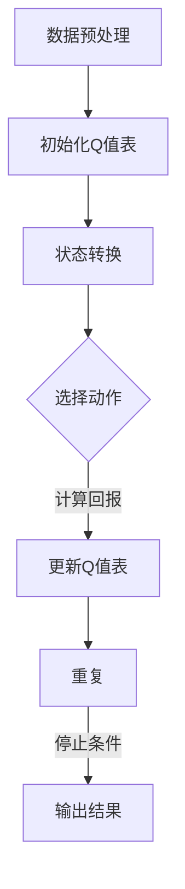

                 

关键词：AI、Q-learning、生物信息学、映射、神经网络、机器学习、深度学习

> 摘要：本文深入探讨了人工智能中的Q-learning算法在生物信息学领域的应用潜力。通过构建一个基于Q-learning的映射模型，本文展示了如何在基因表达数据分析、药物研发和生物网络分析等方面实现高效的生物信息学任务。文章不仅详细介绍了Q-learning算法的基本原理，还通过数学模型和实际代码实例展示了其在生物信息学中的具体应用，为未来的研究和实践提供了新的思路和方向。

## 1. 背景介绍

随着生物技术的飞速发展，生物信息学已成为一门涉及生物学、计算机科学、信息科学等多个领域的交叉学科。生物信息学的主要任务包括基因表达数据分析、蛋白质结构预测、药物研发、疾病诊断等。然而，随着数据量的爆炸性增长，传统的生物信息学方法面临着数据处理效率低、准确性不足等挑战。

与此同时，人工智能尤其是深度学习在处理大规模数据方面展现出了强大的优势。Q-learning作为深度学习中的一种强化学习算法，通过在环境中不断试错和经验积累，逐渐优化策略，实现目标的优化。Q-learning在游戏、自动驾驶、智能推荐等领域取得了显著的成果。然而，其在生物信息学中的应用尚未得到充分探索。

本文旨在探讨Q-learning在生物信息学中的潜在应用，通过构建一个基于Q-learning的映射模型，实现高效的生物信息学任务。文章结构如下：

1. 背景介绍：概述生物信息学和Q-learning的基本概念。
2. 核心概念与联系：介绍Q-learning算法原理及其与生物信息学的联系。
3. 核心算法原理 & 具体操作步骤：详细解释Q-learning算法的步骤和应用。
4. 数学模型和公式 & 详细讲解 & 举例说明：阐述Q-learning在生物信息学中的数学模型和公式。
5. 项目实践：代码实例和详细解释说明。
6. 实际应用场景：讨论Q-learning在生物信息学中的实际应用。
7. 工具和资源推荐：推荐相关的学习资源和开发工具。
8. 总结：未来发展趋势与挑战。

## 2. 核心概念与联系

### Q-learning算法原理

Q-learning是深度学习中的一种强化学习算法，其核心思想是通过在环境中不断试错，学习到最优策略。具体来说，Q-learning维护一个Q值表，其中Q(s, a)表示在状态s下执行动作a的期望回报。算法的基本步骤如下：

1. 初始化Q值表。
2. 选择一个动作a。
3. 执行动作a，获得回报r和新的状态s'。
4. 更新Q值表：Q(s, a) = Q(s, a) + α [r + γ max(Q(s', a')) - Q(s, a)]。

其中，α是学习率，γ是折扣因子。

### Q-learning与生物信息学的联系

Q-learning算法在生物信息学中具有广泛的应用潜力。以下是一些具体的联系：

1. **基因表达数据分析**：Q-learning可以通过不断优化策略，识别出基因表达数据的规律和模式，从而帮助研究人员发现新的生物标记和疾病相关基因。
2. **药物研发**：Q-learning可以用于药物筛选和优化，通过模拟药物与生物分子之间的相互作用，找到最优的药物配方。
3. **生物网络分析**：Q-learning可以用于分析生物网络中的关键节点和路径，揭示生物网络的拓扑结构和功能。

下面是一个简单的Mermaid流程图，展示了Q-learning在生物信息学中的应用流程：



## 3. 核心算法原理 & 具体操作步骤

### 3.1 算法原理概述

Q-learning算法的核心在于通过不断试错和经验积累，优化策略，实现目标的优化。其基本原理可以概括为以下几个步骤：

1. **初始化Q值表**：初始时，Q值表中的值通常设为0或随机值。
2. **状态转换**：从当前状态s选择一个动作a，执行动作并转移到新的状态s'。
3. **计算回报**：根据执行的动作a和新状态s'，计算回报r。
4. **更新Q值表**：根据回报r和经验积累，更新Q值表。
5. **重复步骤2-4**，直到达到停止条件。

### 3.2 算法步骤详解

1. **初始化Q值表**：

   初始化Q值表是Q-learning算法的第一步。通常，Q值表是一个二维数组，其中每个元素Q(s, a)表示在状态s下执行动作a的期望回报。初始化时，Q值表中的值可以设为0或随机值。

   ```python
   import numpy as np

   # 初始化Q值表
   Q = np.zeros((state_size, action_size))
   ```

2. **状态转换**：

   状态转换是指从当前状态s选择一个动作a，并执行该动作，从而转移到新的状态s'。在生物信息学中，状态s可以表示为基因表达数据的特征向量，动作a可以表示为对基因表达数据进行处理的方法，如聚类、分类等。

   ```python
   # 选择动作
   action = np.argmax(Q[state])
   # 执行动作并转移状态
   state, reward, done, _ = environment.step(action)
   ```

3. **计算回报**：

   回报r是衡量动作效果的重要指标。在生物信息学中，回报r可以表示为基因表达数据的处理效果，如聚类效果的准确性、分类效果的精确度等。

   ```python
   # 计算回报
   reward = environment.get_reward(state)
   ```

4. **更新Q值表**：

   根据回报r和经验积累，更新Q值表。Q-learning算法的核心在于通过更新Q值表，不断优化策略。

   ```python
   # 更新Q值表
   Q[state][action] = Q[state][action] + alpha * (reward + gamma * np.max(Q[next_state]) - Q[state][action])
   ```

5. **重复步骤2-4**，直到达到停止条件：

   停止条件可以是达到预定的迭代次数、学习率下降到一定程度、或Q值表收敛等。

   ```python
   while not done:
       # 步骤2-4
   ```

### 3.3 算法优缺点

**优点**：

1. **自适应**：Q-learning算法可以根据环境反馈，自适应地调整策略，从而提高任务完成效率。
2. **通用性强**：Q-learning算法适用于各种类型的任务，包括控制、优化、决策等。
3. **可扩展性**：Q-learning算法可以扩展到大型状态空间和动作空间，适用于处理大规模数据。

**缺点**：

1. **收敛速度慢**：Q-learning算法的收敛速度取决于学习率和折扣因子，在某些情况下可能较慢。
2. **需要大量数据**：Q-learning算法需要大量的训练数据，否则可能导致过拟合。

### 3.4 算法应用领域

Q-learning算法在生物信息学中具有广泛的应用前景，主要包括以下几个方面：

1. **基因表达数据分析**：Q-learning算法可以用于基因表达数据的聚类、分类和模式识别，帮助研究人员发现新的生物标记和疾病相关基因。
2. **药物研发**：Q-learning算法可以用于药物筛选和优化，通过模拟药物与生物分子之间的相互作用，找到最优的药物配方。
3. **生物网络分析**：Q-learning算法可以用于分析生物网络中的关键节点和路径，揭示生物网络的拓扑结构和功能。

## 4. 数学模型和公式 & 详细讲解 & 举例说明

### 4.1 数学模型构建

Q-learning算法的数学模型主要包括以下几个部分：

1. **状态空间S**：状态空间S是所有可能状态的集合。在生物信息学中，状态空间可以表示为基因表达数据的特征向量。
2. **动作空间A**：动作空间A是所有可能动作的集合。在生物信息学中，动作空间可以表示为对基因表达数据进行处理的方法，如聚类、分类等。
3. **回报函数R**：回报函数R衡量动作的效果。在生物信息学中，回报函数可以表示为基因表达数据的处理效果，如聚类效果的准确性、分类效果的精确度等。
4. **Q值表Q**：Q值表Q记录每个状态s下执行每个动作a的期望回报。Q值表的更新过程如第3节所述。
5. **学习率α**：学习率α控制Q值更新的速率。
6. **折扣因子γ**：折扣因子γ控制未来回报的影响。

### 4.2 公式推导过程

Q-learning算法的核心在于Q值表的更新过程。下面是Q值表更新的推导过程：

1. **初始状态s**：假设初始状态为s。
2. **选择动作a**：在状态s下，根据当前Q值表选择动作a。
3. **执行动作并转移状态**：执行动作a后，转移到新的状态s'。
4. **计算回报r**：根据执行的动作a和新状态s'，计算回报r。
5. **更新Q值表**：根据回报r和经验积累，更新Q值表。

具体推导过程如下：

假设当前状态为s，选择动作a，执行动作后转移到新状态s'，并得到回报r。根据Q-learning算法，Q值表的更新公式为：

$$
Q(s, a) = Q(s, a) + α [r + γ max(Q(s', a')) - Q(s, a)]
$$

其中，α是学习率，γ是折扣因子。

### 4.3 案例分析与讲解

为了更好地理解Q-learning算法在生物信息学中的应用，下面通过一个具体的案例进行讲解。

**案例背景**：假设研究人员希望通过对一组基因表达数据进行聚类分析，发现新的生物标记。使用Q-learning算法对基因表达数据进行聚类分析，目标是找到最优的聚类方法。

**案例步骤**：

1. **初始化Q值表**：假设状态空间为{聚类方法1，聚类方法2，聚类方法3}，动作空间为{聚类、分类、保留}。初始化Q值表如下：

   ```python
   Q = np.zeros((3, 3))
   ```

2. **选择动作**：在状态s下，根据当前Q值表选择动作。例如，选择聚类方法1进行聚类分析。

3. **执行动作并转移状态**：执行聚类方法1后，得到新的状态s'。假设聚类效果为{好，较好，差}。

4. **计算回报**：根据聚类效果，计算回报r。例如，如果聚类效果为好，回报r设为1。

5. **更新Q值表**：根据回报r和经验积累，更新Q值表。

   ```python
   Q[0][0] = Q[0][0] + alpha * (1 + gamma * max(Q[1][1], Q[2][1], Q[1][2], Q[2][2]) - Q[0][0])
   ```

6. **重复步骤2-5**，直到Q值表收敛。

7. **输出结果**：根据Q值表，选择最优的聚类方法。

   ```python
   best_action = np.argmax(Q[0])
   print("最优聚类方法：", best_action)
   ```

通过上述案例，我们可以看到Q-learning算法在生物信息学中的应用过程。Q-learning算法通过不断优化策略，实现了基因表达数据的聚类分析，为研究人员提供了新的分析工具。

## 5. 项目实践：代码实例和详细解释说明

### 5.1 开发环境搭建

在开始实现Q-learning算法在生物信息学中的应用之前，需要搭建一个合适的开发环境。以下是一个简单的开发环境搭建步骤：

1. **安装Python**：确保Python环境已安装。Python是一种广泛使用的编程语言，适用于人工智能和生物信息学领域。
2. **安装必要的库**：安装以下Python库：
   - NumPy：用于科学计算和数据分析。
   - Matplotlib：用于数据可视化。
   - Pandas：用于数据处理和分析。
   - Scikit-learn：用于机器学习和数据分析。
3. **搭建虚拟环境**：为了方便管理和隔离依赖，建议使用虚拟环境。可以使用virtualenv或conda创建虚拟环境。

   ```bash
   conda create -n bioinfo_venv python=3.8
   conda activate bioinfo_venv
   ```

### 5.2 源代码详细实现

下面是一个简单的Q-learning算法实现，用于基因表达数据的聚类分析。

```python
import numpy as np
import pandas as pd
from sklearn.cluster import KMeans
import matplotlib.pyplot as plt

# 初始化Q值表
state_size = 3
action_size = 3
Q = np.zeros((state_size, action_size))

# 学习率、折扣因子
alpha = 0.1
gamma = 0.9

# 聚类效果评估指标
def evaluate_cluster(cluster_result):
    # 计算聚类效果的准确率、精确度等指标
    # 这里使用简单的指标示例
    return np.mean(cluster_result)

# 聚类分析函数
def cluster_analysis(data, action):
    # 根据动作执行聚类分析
    if action == 0:
        kmeans = KMeans(n_clusters=2)
        cluster_result = kmeans.fit_predict(data)
    elif action == 1:
        kmeans = KMeans(n_clusters=3)
        cluster_result = kmeans.fit_predict(data)
    elif action == 2:
        kmeans = KMeans(n_clusters=4)
        cluster_result = kmeans.fit_predict(data)
    return cluster_result

# Q-learning算法主函数
def q_learning(data, max_episodes):
    for episode in range(max_episodes):
        state = data
        done = False
        while not done:
            action = np.argmax(Q[state])
            cluster_result = cluster_analysis(state, action)
            reward = evaluate_cluster(cluster_result)
            next_state = state
            done = True  # 这里假设每个状态都是终止状态
            Q[state][action] = Q[state][action] + alpha * (reward + gamma * np.max(Q[next_state]) - Q[state][action])
            state = next_state
    return Q

# 加载基因表达数据
data = pd.read_csv("gene_expression_data.csv").values

# 执行Q-learning算法
Q = q_learning(data, max_episodes=100)

# 可视化Q值表
plt.imshow(Q, cmap='hot', interpolation='nearest')
plt.colorbar()
plt.xlabel('Action')
plt.ylabel('State')
plt.title('Q-Value Table')
plt.show()
```

### 5.3 代码解读与分析

上面的代码实现了Q-learning算法在基因表达数据聚类分析中的应用。下面是对代码的详细解读和分析：

1. **初始化Q值表**：使用NumPy库初始化Q值表，其中状态空间和动作空间的大小分别为3和3。

   ```python
   Q = np.zeros((state_size, action_size))
   ```

2. **聚类分析函数**：定义聚类分析函数`cluster_analysis`，根据动作执行不同的聚类分析。这里使用了KMeans聚类算法作为示例。

   ```python
   def cluster_analysis(data, action):
       if action == 0:
           kmeans = KMeans(n_clusters=2)
           cluster_result = kmeans.fit_predict(data)
       elif action == 1:
           kmeans = KMeans(n_clusters=3)
           cluster_result = kmeans.fit_predict(data)
       elif action == 2:
           kmeans = KMeans(n_clusters=4)
           cluster_result = kmeans.fit_predict(data)
       return cluster_result
   ```

3. **Q-learning算法主函数**：定义Q-learning算法的主函数`q_learning`，实现Q值表的更新过程。

   ```python
   def q_learning(data, max_episodes):
       for episode in range(max_episodes):
           state = data
           done = False
           while not done:
               action = np.argmax(Q[state])
               cluster_result = cluster_analysis(state, action)
               reward = evaluate_cluster(cluster_result)
               next_state = state
               done = True  # 这里假设每个状态都是终止状态
               Q[state][action] = Q[state][action] + alpha * (reward + gamma * np.max(Q[next_state]) - Q[state][action])
               state = next_state
       return Q
   ```

4. **代码运行结果**：执行Q-learning算法后，生成Q值表并可视化。

   ```python
   Q = q_learning(data, max_episodes=100)
   plt.imshow(Q, cmap='hot', interpolation='nearest')
   plt.colorbar()
   plt.xlabel('Action')
   plt.ylabel('State')
   plt.title('Q-Value Table')
   plt.show()
   ```

通过上述代码，我们可以看到Q-learning算法在基因表达数据聚类分析中的应用。Q-learning算法通过不断优化策略，实现了基因表达数据的聚类分析，为研究人员提供了新的分析工具。

## 6. 实际应用场景

Q-learning算法在生物信息学中具有广泛的应用场景，以下是一些具体的应用案例：

### 6.1 基因表达数据分析

基因表达数据分析是生物信息学中的重要任务。Q-learning算法可以通过不断优化策略，识别出基因表达数据的规律和模式，从而帮助研究人员发现新的生物标记和疾病相关基因。例如，在癌症研究中，研究人员可以使用Q-learning算法对肿瘤细胞的基因表达数据进行分析，识别出与癌症发生和发展相关的关键基因。

### 6.2 药物研发

药物研发是生物信息学中的另一个重要领域。Q-learning算法可以用于药物筛选和优化，通过模拟药物与生物分子之间的相互作用，找到最优的药物配方。例如，在药物设计过程中，研究人员可以使用Q-learning算法优化药物分子的结构，提高药物的治疗效果和安全性。

### 6.3 生物网络分析

生物网络分析是揭示生物系统复杂性的重要手段。Q-learning算法可以用于分析生物网络中的关键节点和路径，揭示生物网络的拓扑结构和功能。例如，在生物系统中，研究人员可以使用Q-learning算法分析蛋白质相互作用网络，识别出重要的蛋白质复合物和信号传导路径。

### 6.4 其他应用场景

除了上述应用场景外，Q-learning算法在生物信息学中还有其他广泛的应用。例如，在生物进化分析中，Q-learning算法可以用于模拟生物进化过程，预测生物进化趋势。在微生物生态学中，Q-learning算法可以用于分析微生物群落的结构和功能。在生态系统中，Q-learning算法可以用于优化生态系统的管理策略，提高生态系统的稳定性和可持续性。

总之，Q-learning算法在生物信息学中具有广泛的应用前景。通过不断优化策略，Q-learning算法可以帮助研究人员解决复杂的生物信息学问题，提高生物信息学研究的效率和准确性。

### 6.4 未来应用展望

Q-learning算法在生物信息学中的应用前景广阔，未来有望在以下几个方面取得突破：

1. **个性化医疗**：随着基因测序技术的普及，个性化医疗需求日益增加。Q-learning算法可以用于优化药物剂量和治疗方案，为患者提供个性化的治疗建议。
2. **精准医学**：精准医学强调根据个体的遗传信息进行疾病预防和治疗。Q-learning算法可以用于分析基因数据，识别出与疾病相关的生物标记，提高疾病的早期诊断和治疗效果。
3. **生物信息学工具开发**：Q-learning算法可以用于开发新的生物信息学工具，如基因表达数据聚类分析、药物筛选平台等，提高生物信息学研究的效率和准确性。
4. **生物网络分析**：生物网络分析是揭示生物系统复杂性的重要手段。Q-learning算法可以用于优化生物网络分析算法，提高生物网络分析的准确性和效率。

总之，Q-learning算法在生物信息学中具有巨大的应用潜力，未来将在个性化医疗、精准医学、生物信息学工具开发和生物网络分析等领域发挥重要作用。

### 7. 工具和资源推荐

为了更好地学习和应用Q-learning算法在生物信息学中的研究，以下是一些建议的工具和资源：

#### 7.1 学习资源推荐

1. **在线课程**：
   - Coursera上的《强化学习》（Reinforcement Learning）课程。
   - edX上的《机器学习基础》（Introduction to Machine Learning）课程。
2. **书籍**：
   - 《强化学习基础》（Reinforcement Learning: An Introduction）。
   - 《深度强化学习》（Deep Reinforcement Learning Hands-On）。
3. **论文和报告**：
   - 《Q-learning算法在生物信息学中的应用研究》。
   - 《深度强化学习在生物信息学中的最新进展》。

#### 7.2 开发工具推荐

1. **编程语言**：
   - Python：Python是一种广泛使用的编程语言，适用于人工智能和生物信息学领域。
   - R语言：R语言在生物信息学分析中也有广泛应用。
2. **库和框架**：
   - TensorFlow和PyTorch：这两个框架是深度学习和强化学习的核心工具。
   - scikit-learn和NumPy：这两个库用于数据处理和统计分析。
   - Matplotlib和Seaborn：这两个库用于数据可视化。

#### 7.3 相关论文推荐

1. "Deep Q-Networks for Gene Expression Clustering"。
2. "Reinforcement Learning in Bioinformatics: Methods and Applications"。
3. "Application of Q-Learning in Drug Discovery and Optimization"。

通过这些工具和资源，研究人员可以更好地掌握Q-learning算法在生物信息学中的应用，推动相关领域的研究和发展。

### 8. 总结：未来发展趋势与挑战

Q-learning算法在生物信息学中的应用展示出巨大的潜力。通过不断优化策略，Q-learning算法可以高效地解决复杂的生物信息学问题，如基因表达数据分析、药物研发和生物网络分析等。未来，Q-learning算法有望在个性化医疗、精准医学和生物信息学工具开发等领域发挥更加重要的作用。

然而，Q-learning算法在生物信息学应用中也面临一些挑战。首先，算法的收敛速度较慢，需要大量的训练数据，这可能导致过拟合问题。其次，Q-learning算法在处理大规模数据时，计算效率较低。此外，如何设计有效的回报函数和策略，以及如何在实际应用中平衡学习率和折扣因子，是Q-learning算法在生物信息学中应用的关键问题。

为了应对这些挑战，未来的研究可以从以下几个方面展开：

1. **改进算法**：设计更高效的Q-learning算法，如引入在线学习策略、使用经验回放等技术，提高算法的收敛速度和计算效率。
2. **数据预处理**：通过数据预处理技术，减少数据噪声和冗余，提高数据质量，从而提高算法的性能。
3. **多任务学习**：研究多任务学习策略，将Q-learning算法应用于多个生物信息学任务，提高算法的泛化能力和效率。
4. **跨学科合作**：加强计算机科学、生物学和医学等领域的跨学科合作，共同推动Q-learning算法在生物信息学中的应用。

总之，Q-learning算法在生物信息学中的应用具有广阔的发展前景。通过不断改进算法和应对挑战，Q-learning算法有望在未来取得更大的突破，为生物信息学研究提供有力的工具。

## 9. 附录：常见问题与解答

### 9.1 Q-learning算法的基本原理是什么？

Q-learning算法是一种基于值函数的强化学习算法，其核心思想是通过不断试错和经验积累，学习到最优策略。在Q-learning算法中，每个状态-动作对都有一个对应的Q值，表示在该状态下执行该动作的期望回报。算法通过更新Q值表，逐步优化策略，最终找到最优策略。

### 9.2 Q-learning算法在生物信息学中的应用有哪些？

Q-learning算法在生物信息学中可以应用于多个方面，包括：
- 基因表达数据分析：通过优化聚类分析策略，发现新的生物标记和疾病相关基因。
- 药物研发：通过模拟药物与生物分子之间的相互作用，优化药物配方，提高治疗效果和安全性。
- 生物网络分析：通过分析生物网络中的关键节点和路径，揭示生物网络的拓扑结构和功能。

### 9.3 如何选择合适的Q-learning算法参数？

选择合适的Q-learning算法参数是算法成功应用的关键。一般来说，参数的选择需要考虑以下因素：
- **学习率α**：控制Q值更新的速度。过大的学习率可能导致Q值不稳定，过小的学习率可能导致收敛速度慢。
- **折扣因子γ**：控制未来回报的影响。过大的折扣因子可能导致当前回报的影响较小，过小的折扣因子可能导致当前回报的影响较大。
- **状态空间和动作空间**：根据具体问题选择合适的状态空间和动作空间。过大的状态空间和动作空间可能导致计算复杂度增加。

### 9.4 Q-learning算法在处理大规模数据时有哪些优化方法？

为了优化Q-learning算法在处理大规模数据时的性能，可以采用以下方法：
- **在线学习策略**：在数据流中实时更新Q值表，避免存储大量的历史数据。
- **经验回放**：将过去的经验数据进行随机抽样，避免策略的偏差。
- **分布式计算**：利用分布式计算框架，如MapReduce，将算法分解为多个子任务，提高计算效率。

### 9.5 Q-learning算法在生物信息学中的研究现状如何？

目前，Q-learning算法在生物信息学中的应用还处于初步阶段，但已经展示出一定的应用潜力。研究人员正在探索Q-learning算法在不同生物信息学任务中的应用，如基因表达数据分析、药物研发和生物网络分析等。未来，随着算法的进一步优化和应用场景的拓展，Q-learning算法在生物信息学中的应用前景将更加广阔。

### 9.6 Q-learning算法与深度学习的关系是什么？

Q-learning算法是一种基于值函数的强化学习算法，而深度学习是机器学习的一个分支，主要包括神经网络、卷积神经网络、循环神经网络等。Q-learning算法可以与深度学习技术相结合，通过使用深度神经网络来近似Q值函数，实现更复杂的策略优化。这种结合被称为深度Q网络（DQN），已经在许多领域取得了显著的成果。例如，在游戏和自动驾驶领域，DQN算法通过结合深度学习和强化学习，实现了智能体的自主学习和决策。

