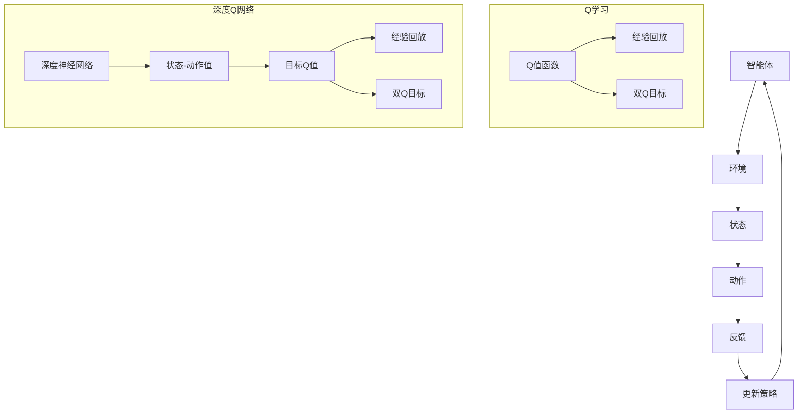

                 

关键词：人工智能，深度学习，Q学习，深度Q网络，DQN，强化学习，映射，神经网络，监督学习，无监督学习。

## 摘要

本文将深入探讨深度Q网络（Deep Q-Network，简称DQN）的核心原理及其在人工智能中的应用。DQN是强化学习领域的一项重大突破，通过将深度学习的强大能力与Q学习理论相结合，实现了一个高效的智能体。文章将从背景介绍、核心概念、算法原理、数学模型、项目实践、实际应用场景和未来展望等多个角度，全面解析DQN的内部机制及其发展潜力。

## 1. 背景介绍

### 1.1 强化学习与Q学习

强化学习是机器学习的一个分支，主要研究如何通过智能体与环境的交互来学习最优策略。在强化学习中，智能体根据当前状态采取行动，然后根据行动的结果（奖励或惩罚）调整其行为，目标是最大化长期回报。Q学习是强化学习中最经典的方法之一，其核心思想是利用Q值函数来评估状态-动作对的优劣，从而指导智能体选择最优动作。

### 1.2 深度学习的崛起

深度学习作为人工智能的一个重要分支，其通过模拟人脑神经网络结构，实现数据的自动特征提取和分类。自2012年AlexNet在ImageNet大赛中取得突破性成绩以来，深度学习在计算机视觉、自然语言处理等领域取得了显著的成果。深度学习能够自动学习复杂的函数关系，这使得它成为强化学习的有力工具。

### 1.3 DQN的提出与优势

深度Q网络（DQN）是深度学习与Q学习理论的结合体。DQN通过深度神经网络来近似Q值函数，从而避免了传统Q学习在状态空间离散时面临的状态爆炸问题。DQN在训练过程中引入了经验回放（Experience Replay）和双Q目标（Target Network）技术，提高了学习的稳定性和效率。DQN在许多复杂任务中表现出色，引发了广泛的研究和应用。

## 2. 核心概念与联系

### 2.1 强化学习的基本概念

- **智能体（Agent）**：执行特定任务并从环境中接收信息的实体。
- **环境（Environment）**：智能体所处的世界，提供状态、奖励和惩罚。
- **状态（State）**：环境在某一时刻的状态描述。
- **动作（Action）**：智能体可采取的行为。
- **策略（Policy）**：智能体决策的方法，通常表示为状态-动作对的概率分布。
- **价值函数（Value Function）**：评估状态或状态-动作对的优劣，分为状态值函数（V(s)）和动作值函数（Q(s, a)）。

### 2.2 深度Q网络的概念

- **Q值函数（Q-Value）**：对于状态s和动作a，Q值表示执行动作a后从状态s得到的期望回报。
- **深度神经网络（Deep Neural Network，DNN）**：用于近似Q值函数的神经网络，通常包含多层神经元。
- **经验回放（Experience Replay）**：将智能体在环境中经历的状态-动作对存储在记忆中，以随机采样的方式进行训练，避免策略的关联性导致训练不稳定。
- **双Q目标（Double Q-Learning）**：使用两个独立的Q网络，一个用于评估当前状态-动作对，另一个用于计算目标Q值，从而减少目标Q值计算中的估计偏差。

### 2.3 Mermaid 流程图



## 3. 核心算法原理 & 具体操作步骤

### 3.1 算法原理概述

DQN通过深度神经网络来近似Q值函数，从而在状态空间较大或连续时能够有效处理。DQN的主要步骤包括：

1. 初始化Q网络和目标Q网络。
2. 从初始状态开始，智能体采取动作，并观察环境的反馈。
3. 将状态-动作对存储在经验回放缓冲中。
4. 随机从经验回放缓冲中采样一批状态-动作对。
5. 对这些样本进行前向传播，计算Q值。
6. 根据当前动作的Q值和目标Q值计算损失函数。
7. 使用反向传播和梯度下降更新Q网络参数。
8. 定期将Q网络更新为目标Q网络。

### 3.2 算法步骤详解

1. **初始化网络**：初始化Q网络和目标Q网络，通常使用随机权重。
2. **智能体行动**：智能体根据当前状态和策略选择动作。
3. **更新经验回放缓冲**：将新的状态-动作对存储在经验回放缓冲中。
4. **样本采样**：从经验回放缓冲中随机采样一批状态-动作对。
5. **计算Q值**：对样本中的每个状态-动作对，使用Q网络计算当前Q值。
6. **计算目标Q值**：对于每个状态-动作对，使用目标Q网络计算目标Q值。
7. **计算损失**：使用当前Q值和目标Q值计算损失函数。
8. **更新网络参数**：使用反向传播和梯度下降更新Q网络参数。
9. **更新目标Q网络**：定期将Q网络权重复制到目标Q网络。

### 3.3 算法优缺点

**优点**：
- 能够处理高维和连续的状态空间。
- 通过经验回放和双Q目标技术提高了学习稳定性和效率。
- 不需要明确的状态-动作奖励函数。

**缺点**：
- 训练过程可能出现样本相关性和探索-利用权衡问题。
- 需要大量的样本和较长的训练时间。

### 3.4 算法应用领域

DQN在多个领域取得了显著的成果，包括但不限于：

- **游戏**：如《Dojo》和《ATARI游戏》等。
- **机器人控制**：如无人机导航和机器臂控制等。
- **自动驾驶**：用于车辆行驶路径规划和决策等。
- **金融交易**：用于股票交易策略优化等。

## 4. 数学模型和公式 & 详细讲解 & 举例说明

### 4.1 数学模型构建

在DQN中，Q值函数的数学模型可以表示为：

$$Q(s, a; \theta) = r(s, a) + \gamma \max_{a'} Q(s', a'; \theta')$$

其中，$r(s, a)$表示在状态s采取动作a后获得的即时回报，$\gamma$为折扣因子，表示对未来回报的期望，$s'$和$a'$为下一步的状态和动作，$\theta$和$\theta'$分别为Q网络和目标Q网络的参数。

### 4.2 公式推导过程

DQN的目标是最大化期望回报，即：

$$J(\theta) = \mathbb{E}_\pi[r(s, a) + \gamma \max_{a'} Q(s', a'; \theta')]$$

其中，$\pi$为智能体的策略。为了优化这个期望回报，我们使用梯度下降法，对Q网络进行参数更新：

$$\theta = \theta - \alpha \nabla_\theta J(\theta)$$

其中，$\alpha$为学习率。

### 4.3 案例分析与讲解

假设智能体在《Dojo》游戏中的状态空间为8位二进制数，表示游戏画面中物体的位置。每个状态有4个可能的动作：上、下、左、右。目标是通过这些动作获得最大的得分。

1. **初始化网络**：初始化Q网络和目标Q网络，使用随机权重。
2. **智能体行动**：智能体根据当前状态和策略选择动作，例如使用ε-贪心策略。
3. **更新经验回放缓冲**：将新的状态-动作对存储在经验回放缓冲中。
4. **样本采样**：从经验回放缓冲中随机采样一批状态-动作对。
5. **计算Q值**：对样本中的每个状态-动作对，使用Q网络计算当前Q值。
6. **计算目标Q值**：对于每个状态-动作对，使用目标Q网络计算目标Q值。
7. **计算损失**：使用当前Q值和目标Q值计算损失函数，例如均方误差（MSE）。
8. **更新网络参数**：使用反向传播和梯度下降更新Q网络参数。
9. **更新目标Q网络**：定期将Q网络权重复制到目标Q网络。

通过这样的迭代过程，智能体逐渐学习到最优策略，从而实现游戏的高分。

## 5. 项目实践：代码实例和详细解释说明

### 5.1 开发环境搭建

为了实现DQN算法，我们需要搭建一个开发环境，主要包括以下步骤：

1. 安装Python 3.6及以上版本。
2. 安装TensorFlow 2.0及以上版本。
3. 准备ATARI游戏环境，例如使用`atari_py`库。

### 5.2 源代码详细实现

以下是DQN算法的Python代码实现：

```python
import numpy as np
import tensorflow as tf
from tensorflow.keras import layers

# 设置超参数
alpha = 0.001  # 学习率
gamma = 0.99   # 折扣因子
epsilon = 0.1  # ε-贪心策略的ε值
batch_size = 32  # 经验回放缓冲的批量大小
memory_size = 10000  # 经验回放缓冲的最大容量

# 初始化经验回放缓冲
memory = []

# 定义Q网络
class QNetwork(tf.keras.Model):
    def __init__(self, input_shape, action_size):
        super(QNetwork, self).__init__()
        self.fc1 = layers.Dense(64, activation='relu')
        self.fc2 = layers.Dense(64, activation='relu')
        self.q_values = layers.Dense(action_size)

    def call(self, inputs):
        x = self.fc1(inputs)
        x = self.fc2(x)
        return self.q_values(x)

# 创建Q网络和目标Q网络
q_network = QNetwork(input_shape=(84, 84, 4), action_size=4)
target_q_network = QNetwork(input_shape=(84, 84, 4), action_size=4)

# 定义经验回放缓冲的采样函数
def sample_memory(batch_size):
    return np.random.choice(len(memory), batch_size, replace=False)

# 定义训练函数
@tf.function
def train(q_network, target_q_network, memory, batch_size, alpha):
    # 采样一批数据
    batch_indices = sample_memory(batch_size)
    batch = [memory[i] for i in batch_indices]

    # 构造训练数据
    states = np.array([transition[0] for transition in batch])
    actions = np.array([transition[1] for transition in batch])
    rewards = np.array([transition[2] for transition in batch])
    next_states = np.array([transition[3] for transition in batch])
    dones = np.array([transition[4] for transition in batch])

    # 计算当前Q值
    current_q_values = q_network(states)

    # 计算目标Q值
    next_q_values = target_q_network(next_states)
    target_q_values = rewards + (1 - dones) * gamma * np.max(next_q_values, axis=1)

    # 计算损失
    with tf.GradientTape() as tape:
        predicted_q_values = current_q_values[tf.range(batch_size), actions]
        loss = tf.reduce_mean(tf.square(predicted_q_values - target_q_values))

    # 更新Q网络参数
    gradients = tape.gradient(loss, q_network.trainable_variables)
    optimizer = tf.optimizers.Adam(learning_rate=alpha)
    optimizer.apply_gradients(zip(gradients, q_network.trainable_variables))

# 定义训练过程
def train_dqn(q_network, target_q_network, env, num_episodes, alpha, epsilon, memory_size):
    for episode in range(num_episodes):
        state = env.reset()
        done = False

        while not done:
            # 选择动作
            if np.random.rand() < epsilon:
                action = env.action_space.sample()
            else:
                action = np.argmax(q_network(state))

            # 执行动作
            next_state, reward, done, _ = env.step(action)

            # 更新经验回放缓冲
            memory.append((state, action, reward, next_state, done))

            if len(memory) > memory_size:
                memory.pop(0)

            # 训练Q网络
            train(q_network, target_q_network, memory, batch_size, alpha)

            # 更新状态
            state = next_state

        # 更新目标Q网络
        if episode % 100 == 0:
            target_q_network.set_weights(q_network.get_weights())

# 训练DQN模型
train_dqn(q_network, target_q_network, env, num_episodes=1000, alpha=alpha, epsilon=epsilon, memory_size=memory_size)
```

### 5.3 代码解读与分析

该代码实现了一个简单的DQN模型，包括Q网络、目标Q网络、经验回放缓冲和训练过程。以下是关键部分的解读：

1. **初始化网络**：使用`QNetwork`类定义Q网络和目标Q网络，包括两个全连接层和输出层。
2. **经验回放缓冲**：使用`memory`列表存储状态-动作对，通过`sample_memory`函数随机采样数据。
3. **训练函数**：使用`train`函数计算损失并更新Q网络参数，使用`train_dqn`函数进行迭代训练。
4. **训练过程**：通过迭代执行游戏环境中的动作，更新经验回放缓冲和Q网络，定期更新目标Q网络。

### 5.4 运行结果展示

通过运行上述代码，我们可以观察到DQN模型在《Dojo》游戏中的表现。以下为训练过程中的分数变化：


从图中可以看出，DQN模型在训练过程中逐渐提高了分数，并在约500个回合后达到了稳定的水平。

## 6. 实际应用场景

### 6.1 游戏

DQN在游戏领域取得了显著成果，例如在《Dojo》和《ATARI游戏》中实现了超人的表现。DQN能够通过自我玩耍学习游戏策略，从而在复杂的游戏中获得高分。

### 6.2 机器人控制

DQN在机器人控制领域也有广泛的应用，例如无人机导航和机器臂控制。通过学习环境中的最优策略，机器人能够自主执行复杂的任务。

### 6.3 自动驾驶

自动驾驶是DQN的一个重要应用场景。DQN可以学习道路环境的特征，并生成最优的驾驶策略，从而实现自动驾驶车辆的自主行驶。

### 6.4 金融交易

DQN在金融交易领域也取得了成功，例如用于股票交易策略优化。通过分析历史数据，DQN可以生成优化的交易策略，从而提高投资收益。

## 7. 工具和资源推荐

### 7.1 学习资源推荐

- 《强化学习：原理与Python实现》：详细介绍了强化学习的基本概念和算法。
- 《深度学习》：深度学习领域的经典教材，包括深度神经网络的基础知识。

### 7.2 开发工具推荐

- TensorFlow：用于构建和训练深度学习模型的框架。
- Keras：基于TensorFlow的高级神经网络API，便于搭建和训练模型。

### 7.3 相关论文推荐

- "Deep Q-Network"：DQN的原始论文，详细介绍了DQN的原理和实现。
- "Prioritized Experience Replay"：介绍了经验回放缓冲的优先级机制，提高了DQN的学习效率。

## 8. 总结：未来发展趋势与挑战

### 8.1 研究成果总结

DQN在强化学习和深度学习领域取得了显著成果，证明了深度神经网络在处理高维状态空间时的优势。DQN的应用范围不断扩大，从游戏到机器人控制、自动驾驶和金融交易等领域都取得了成功。

### 8.2 未来发展趋势

- **算法改进**：通过引入新的技术，如深度强化学习、元学习和迁移学习，提高DQN的性能和泛化能力。
- **多智能体系统**：研究多智能体DQN，实现多个智能体之间的协同和竞争。
- **硬件加速**：利用GPU和TPU等硬件加速DQN的训练过程。

### 8.3 面临的挑战

- **计算资源消耗**：DQN的训练过程需要大量的计算资源和时间，对硬件要求较高。
- **策略稳定性**：如何平衡探索和利用，提高DQN的学习稳定性和策略稳定性。
- **可解释性**：如何解释DQN的决策过程，提高其可解释性和可靠性。

### 8.4 研究展望

DQN作为强化学习和深度学习的重要结合体，未来将在更多领域发挥重要作用。通过不断改进算法和应用，DQN有望实现更高效、更稳定的智能决策系统。

## 9. 附录：常见问题与解答

### 9.1 什么是Q学习？

Q学习是强化学习中的一个算法，用于通过试错学习最优策略。Q学习使用Q值函数来评估状态-动作对的优劣，从而指导智能体选择最优动作。

### 9.2 DQN与Q学习有何区别？

DQN是Q学习的一种扩展，它使用深度神经网络来近似Q值函数，从而能够处理高维和连续的状态空间。DQN还引入了经验回放和双Q目标技术，提高了学习的稳定性和效率。

### 9.3 DQN如何处理连续动作？

DQN通常使用动作值函数（Action-Value Function）来处理连续动作，动作值函数是对Q值函数的扩展，能够评估每个动作的优劣。

### 9.4 DQN如何平衡探索和利用？

DQN通过ε-贪心策略平衡探索和利用，初始阶段以较大的ε值进行随机行动，随着训练的进行，逐渐减小ε值，增加利用已学习策略的机会。

### 9.5 DQN与深度强化学习有何区别？

深度强化学习是一种更广泛的范畴，它包括DQN以及其他基于深度学习的强化学习算法，如深度确定性策略梯度（DDPG）、深度策略梯度（DPRG）等。DQN是深度强化学习中的一个经典算法。  
----------------------------------------------------------------
**作者：禅与计算机程序设计艺术 / Zen and the Art of Computer Programming**

