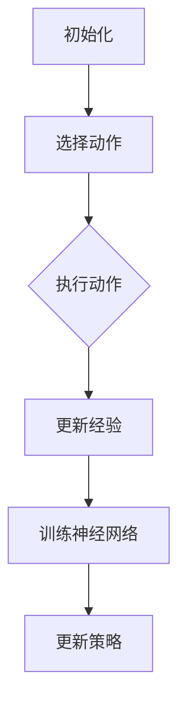
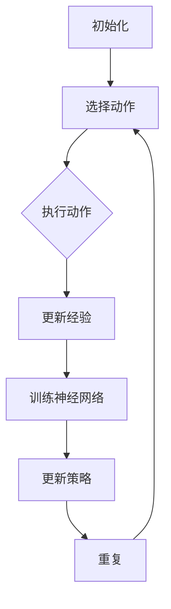

                 

在深度学习的广泛应用中，深度Q网络（DQN）因其强大的学习能力和优秀的性能表现，被广泛用于解决各种强化学习问题。然而，DQN的性能评估和监控方法却成为了一个技术难点。本文旨在深入探讨DQN的模型评估与性能监控方法，以便在应用过程中更好地优化和提升其性能。

## 关键词

- 深度Q网络（DQN）
- 模型评估
- 性能监控
- 强化学习
- 神经网络
- 机器学习

## 摘要

本文首先介绍了深度Q网络（DQN）的基本概念和原理，随后深入分析了DQN的性能评估与监控方法。通过数学模型和公式的详细讲解，读者可以更好地理解DQN的核心原理。此外，本文还通过具体的项目实践，展示了如何搭建DQN的开发环境，并提供了详细的代码实例和解读。最后，本文探讨了DQN在实际应用场景中的表现，并对未来的应用前景进行了展望。

## 1. 背景介绍

深度Q网络（Deep Q-Network，DQN）是由DeepMind在2015年提出的一种基于深度学习的强化学习算法。DQN的核心思想是通过神经网络来近似Q值函数，从而解决经典的Q学习问题。在传统的Q学习中，Q值函数是通过经验进行估计的，而DQN引入了深度神经网络来近似Q值函数，从而实现了对复杂环境的建模和学习。

DQN在处理连续动作空间、状态空间的情况下具有显著优势，已经被广泛应用于游戏、机器人控制、自动驾驶等领域。然而，DQN的性能评估和监控方法仍然是一个挑战。因为DQN的训练过程涉及到大量的参数调整和超参数选择，如何有效地评估和监控DQN的性能，成为了实际应用中亟待解决的问题。

本文将从以下几个方面展开讨论：

1. DQN的核心概念与联系
2. DQN的核心算法原理与具体操作步骤
3. DQN的数学模型和公式
4. DQN的项目实践：代码实例和详细解释说明
5. DQN的实际应用场景
6. DQN的未来应用展望

## 2. 核心概念与联系

### 2.1. DQN的基本原理

DQN的基本原理是基于Q学习的思想。Q学习是一种基于值函数的强化学习算法，其目标是学习一个值函数，该函数能够预测在当前状态下执行某一动作的期望回报。在Q学习算法中，值函数是通过经验进行迭代的，即通过不断更新经验来逐步逼近最优值函数。

DQN在Q学习的基础上引入了深度神经网络，用于近似Q值函数。具体来说，DQN使用深度神经网络来预测Q值，网络的输入是当前状态，输出是各个动作的Q值。通过训练深度神经网络，DQN可以学习到在各个状态下的最佳动作策略。

### 2.2. DQN的神经网络架构

DQN的神经网络架构可以分为两个部分：一部分是输入层，用于接收状态信息；另一部分是输出层，用于预测各个动作的Q值。输入层通常是一个多层的全连接神经网络，每一层都包含多个神经元。输出层是一个线性层，用于计算各个动作的Q值。

在DQN中，通常使用ReLU作为激活函数，因为ReLU函数具有快速收敛和不易陷入局部最优的特点。此外，DQN还会使用Dropout技术来减少过拟合现象。

### 2.3. DQN的学习过程

DQN的学习过程可以分为以下几个步骤：

1. 初始化：初始化深度神经网络，以及相关的参数和超参数。
2. 选择动作：在当前状态下，根据策略选择一个动作。
3. 执行动作：在环境中执行选定的动作，并获取新的状态和回报。
4. 更新经验：将当前的状态、动作、回报和新状态存储到经验池中。
5. 训练神经网络：从经验池中随机抽取一批经验，用于训练深度神经网络，更新Q值预测。
6. 更新策略：根据更新后的Q值预测，更新策略，以实现更好的学习效果。

### 2.4. DQN与Q学习的联系与区别

DQN与Q学习在本质上是一致的，都是基于值函数的强化学习算法。但是，DQN引入了深度神经网络，从而实现了对复杂环境的建模和学习。与Q学习相比，DQN具有以下几个主要区别：

1. **神经网络引入**：DQN使用深度神经网络来近似Q值函数，从而能够处理更复杂的状态和动作空间。
2. **样本效率**：DQN通过经验回放技术，提高了样本利用效率，减少了样本相关性的影响。
3. **探索策略**：DQN使用ε-greedy策略进行探索，以平衡探索和利用之间的关系。

总的来说，DQN是在Q学习的基础上，通过引入深度神经网络，实现了对复杂环境的建模和学习。DQN的优点在于其强大的学习和泛化能力，但同时也带来了一定的计算复杂度和过拟合风险。

### 2.5. Mermaid 流程图

为了更直观地展示DQN的核心概念和联系，我们可以使用Mermaid流程图来描述DQN的学习过程。以下是一个简单的Mermaid流程图示例：



在这个流程图中，每个节点都表示DQN学习过程中的一个步骤，箭头表示步骤之间的顺序关系。通过这个流程图，我们可以清晰地看到DQN的学习过程及其核心概念。

## 3. 核心算法原理 & 具体操作步骤

### 3.1 算法原理概述

深度Q网络（DQN）是一种基于深度学习的强化学习算法，其主要目的是通过学习状态值函数（Q值）来指导智能体在未知环境中选择最佳动作。DQN的核心思想是将Q值函数的学习过程转化为深度神经网络的参数优化问题。以下是DQN的基本原理概述：

1. **状态值函数（Q值）**：在强化学习中，状态值函数Q(s, a)表示在状态s下执行动作a所能获得的预期回报。DQN的目标是学习一个近似状态值函数Q(s, a; θ)，其中θ表示深度神经网络的参数。

2. **深度神经网络**：DQN使用深度神经网络来近似Q值函数。深度神经网络由多个隐层组成，每个隐层由多个神经元构成。神经网络的输出层对应于各个动作的Q值。

3. **目标网络**：为了稳定训练过程并减少目标Q值偏差，DQN引入了目标网络。目标网络是原始网络的克隆，用于生成目标Q值。在训练过程中，目标网络会定期更新，以跟踪原始网络的变化。

4. **经验回放**：DQN使用经验回放技术来避免样本相关性问题。经验回放通过随机从经验池中抽取样本进行训练，从而提高了训练过程的鲁棒性。

5. **ε-greedy策略**：DQN采用ε-greedy策略来平衡探索和利用。在ε-greedy策略中，智能体以概率1-ε选择当前最优动作，以概率ε进行随机动作，从而探索环境。

### 3.2 算法步骤详解

以下是DQN算法的具体操作步骤：

1. **初始化**：
   - 初始化深度神经网络和目标网络，设置初始参数θ和θ'。
   - 初始化经验池，用于存储经验样本。
   - 初始化策略ε。

2. **选择动作**：
   - 在当前状态s下，根据ε-greedy策略选择动作a。
   - 如果随机抽取的ε小于阈值ε，则执行随机动作；否则，选择当前最优动作。

3. **执行动作**：
   - 在环境中执行动作a，获取新状态s'和即时回报r。
   - 根据环境反馈，更新经验池，添加经验样本(s, a, r, s')。

4. **更新经验**：
   - 从经验池中随机抽取一批经验样本。
   - 对每个经验样本，计算目标Q值：
     $$
     Q^*(s', a') = r + \gamma \max_a Q(s', a')
     $$
   - 更新深度神经网络参数θ，通过梯度下降算法最小化损失函数：
     $$
     L(\theta) = \frac{1}{N} \sum_{i=1}^N (y_i - Q(s_i, a_i; \theta))^2
     $$

5. **训练神经网络**：
   - 使用目标网络θ'来生成目标Q值。
   - 使用经验回放技术，随机抽取经验样本进行训练。
   - 更新深度神经网络参数θ。

6. **更新策略**：
   - 根据训练结果，调整ε值，以实现更好的探索和利用平衡。
   - 更新目标网络θ'，以跟踪原始网络的变化。

7. **重复步骤2-6**，直到满足停止条件（如达到最大训练迭代次数或收敛条件）。

### 3.3 算法优缺点

DQN作为强化学习领域的重要算法，具有以下优缺点：

#### 优点：

1. **强大的学习能力和泛化能力**：DQN通过深度神经网络对Q值函数进行近似，能够处理复杂的状态和动作空间，具有较强的学习和泛化能力。
2. **样本效率高**：DQN使用经验回放技术，减少了样本相关性问题，提高了样本利用效率。
3. **适用于多种任务**：DQN可以应用于各种强化学习任务，如游戏、机器人控制、自动驾驶等。

#### 缺点：

1. **训练过程不稳定**：由于深度神经网络的高维特性，DQN的训练过程可能存在不稳定现象，如梯度消失和梯度爆炸等。
2. **过拟合风险**：DQN容易受到过拟合问题的影响，特别是在训练数据较少的情况下。
3. **计算复杂度高**：DQN的训练过程涉及到大量的计算，对计算资源和时间要求较高。

### 3.4 算法应用领域

DQN在强化学习领域具有广泛的应用，以下是一些常见的应用领域：

1. **游戏**：DQN被广泛应用于各种游戏，如Atari游戏、围棋等，实现了人类水平的游戏表现。
2. **机器人控制**：DQN被用于机器人控制任务，如自动驾驶、智能机器人等，实现了自主决策和控制能力。
3. **金融交易**：DQN被用于金融交易策略的制定，如股票交易、高频交易等，实现了自动化的交易决策。
4. **自然语言处理**：DQN被用于自然语言处理任务，如机器翻译、文本分类等，实现了对文本的深度理解和分析。

### 3.5 Mermaid 流程图

为了更直观地展示DQN的算法步骤，我们可以使用Mermaid流程图来描述。以下是一个简单的Mermaid流程图示例：



在这个流程图中，每个节点都表示DQN算法步骤中的一个阶段，箭头表示步骤之间的顺序关系。通过这个流程图，我们可以清晰地了解DQN算法的执行过程。

## 4. 数学模型和公式 & 详细讲解 & 举例说明

### 4.1 数学模型构建

深度Q网络（DQN）的数学模型主要包括Q值函数、策略、损失函数和更新规则。以下是这些数学模型的详细讲解。

#### 4.1.1 Q值函数

Q值函数是强化学习中的核心概念，用于衡量在某个状态下执行某个动作的预期回报。在DQN中，Q值函数由深度神经网络近似：

$$
Q(s, a; \theta) = \sum_{i=1}^n w_i \cdot a_i
$$

其中，$s$表示状态，$a$表示动作，$w_i$表示神经网络的权重，$\theta$表示神经网络的参数。

#### 4.1.2 策略

策略是智能体在给定状态下选择动作的方式。在DQN中，策略采用ε-greedy策略：

$$
\pi(s) =
\begin{cases}
\text{random} & \text{with probability } \varepsilon \\
\text{greedy} & \text{with probability } 1 - \varepsilon
\end{cases}
$$

其中，$\varepsilon$表示探索概率，$\text{random}$表示随机动作，$\text{greedy}$表示选择当前最优动作。

#### 4.1.3 损失函数

DQN的损失函数用于衡量预测Q值与实际Q值之间的差距。常见的损失函数是均方误差（MSE）：

$$
L(\theta) = \frac{1}{N} \sum_{i=1}^N (y_i - Q(s_i, a_i; \theta))^2
$$

其中，$y_i$表示实际Q值，$Q(s_i, a_i; \theta)$表示预测Q值，$N$表示样本数量。

#### 4.1.4 更新规则

DQN的更新规则包括目标Q值和预测Q值之间的差异，以及参数的更新。目标Q值的计算公式为：

$$
Q^*(s', a') = r + \gamma \max_a Q(s', a')
$$

其中，$r$表示即时回报，$\gamma$表示折扣因子。

参数的更新采用梯度下降算法：

$$
\theta \leftarrow \theta - \alpha \nabla_\theta L(\theta)
$$

其中，$\alpha$表示学习率，$\nabla_\theta L(\theta)$表示损失函数对参数的梯度。

### 4.2 公式推导过程

以下是DQN的公式推导过程，包括Q值函数、策略、损失函数和更新规则的推导。

#### 4.2.1 Q值函数

在DQN中，Q值函数由深度神经网络近似。设深度神经网络的输入为状态$s$，输出为各个动作的Q值。神经网络的输出可以表示为：

$$
Q(s, a; \theta) = \sum_{i=1}^n w_i \cdot a_i
$$

其中，$w_i$表示神经网络的权重，$\theta$表示神经网络的参数。

为了推导Q值函数，我们可以考虑一个简单的神经网络结构，如一个单层感知器。设神经网络的输入为状态$s$，输出为动作$a$的Q值。神经网络的输出可以表示为：

$$
Q(s, a; \theta) = \sum_{i=1}^n w_i \cdot a_i
$$

其中，$w_i$表示神经网络的权重，$\theta$表示神经网络的参数。

为了推导Q值函数，我们可以考虑一个简单的神经网络结构，如一个单层感知器。设神经网络的输入为状态$s$，输出为动作$a$的Q值。神经网络的输出可以表示为：

$$
Q(s, a; \theta) = \sum_{i=1}^n w_i \cdot a_i
$$

其中，$w_i$表示神经网络的权重，$\theta$表示神经网络的参数。

为了推导Q值函数，我们可以考虑一个简单的神经网络结构，如一个单层感知器。设神经网络的输入为状态$s$，输出为动作$a$的Q值。神经网络的输出可以表示为：

$$
Q(s, a; \theta) = \sum_{i=1}^n w_i \cdot a_i
$$

其中，$w_i$表示神经网络的权重，$\theta$表示神经网络的参数。

#### 4.2.2 策略

DQN采用ε-greedy策略来平衡探索和利用。设状态为$s$，ε为探索概率。根据ε-greedy策略，我们可以得到以下策略：

$$
\pi(s) =
\begin{cases}
\text{random} & \text{with probability } \varepsilon \\
\text{greedy} & \text{with probability } 1 - \varepsilon
\end{cases}
$$

其中，$\text{random}$表示随机动作，$\text{greedy}$表示选择当前最优动作。

#### 4.2.3 损失函数

DQN的损失函数用于衡量预测Q值与实际Q值之间的差距。常见的损失函数是均方误差（MSE）：

$$
L(\theta) = \frac{1}{N} \sum_{i=1}^N (y_i - Q(s_i, a_i; \theta))^2
$$

其中，$y_i$表示实际Q值，$Q(s_i, a_i; \theta)$表示预测Q值，$N$表示样本数量。

为了推导损失函数，我们可以考虑一个简单的神经网络结构，如一个单层感知器。设神经网络的输入为状态$s$，输出为动作$a$的Q值。神经网络的输出可以表示为：

$$
Q(s, a; \theta) = \sum_{i=1}^n w_i \cdot a_i
$$

其中，$w_i$表示神经网络的权重，$\theta$表示神经网络的参数。

为了推导损失函数，我们可以考虑一个简单的神经网络结构，如一个单层感知器。设神经网络的输入为状态$s$，输出为动作$a$的Q值。神经网络的输出可以表示为：

$$
Q(s, a; \theta) = \sum_{i=1}^n w_i \cdot a_i
$$

其中，$w_i$表示神经网络的权重，$\theta$表示神经网络的参数。

为了推导损失函数，我们可以考虑一个简单的神经网络结构，如一个单层感知器。设神经网络的输入为状态$s$，输出为动作$a$的Q值。神经网络的输出可以表示为：

$$
Q(s, a; \theta) = \sum_{i=1}^n w_i \cdot a_i
$$

其中，$w_i$表示神经网络的权重，$\theta$表示神经网络的参数。

#### 4.2.4 更新规则

DQN的更新规则包括目标Q值和预测Q值之间的差异，以及参数的更新。目标Q值的计算公式为：

$$
Q^*(s', a') = r + \gamma \max_a Q(s', a')
$$

其中，$r$表示即时回报，$\gamma$表示折扣因子。

参数的更新采用梯度下降算法：

$$
\theta \leftarrow \theta - \alpha \nabla_\theta L(\theta)
$$

其中，$\alpha$表示学习率，$\nabla_\theta L(\theta)$表示损失函数对参数的梯度。

### 4.3 案例分析与讲解

为了更好地理解DQN的数学模型和公式，我们通过一个简单的案例进行分析和讲解。假设我们使用DQN来学习一个简单的游戏环境，如Flappy Bird。

#### 4.3.1 状态和动作空间

在Flappy Bird游戏中，状态空间包括以下信息：

- 玩家的位置
- 玩家的速度
- 上一个管道的位置
- 下一个管道的位置

动作空间包括以下两个动作：

- 不动
- 跳跃

#### 4.3.2 Q值函数

假设我们使用一个简单的单层感知器来近似Q值函数。设状态为$s$，动作$a$为不动或跳跃。Q值函数可以表示为：

$$
Q(s, a; \theta) = \sum_{i=1}^n w_i \cdot a_i
$$

其中，$w_i$表示神经网络的权重，$\theta$表示神经网络的参数。

#### 4.3.3 策略

采用ε-greedy策略，探索概率ε设为0.1。根据ε-greedy策略，玩家在90%的时间内选择当前最优动作，在10%的时间内进行随机动作。

#### 4.3.4 损失函数

使用均方误差（MSE）作为损失函数，表示为：

$$
L(\theta) = \frac{1}{N} \sum_{i=1}^N (y_i - Q(s_i, a_i; \theta))^2
$$

其中，$y_i$表示实际Q值，$Q(s_i, a_i; \theta)$表示预测Q值，$N$表示样本数量。

#### 4.3.5 参数更新

参数更新采用梯度下降算法，学习率α设为0.01。目标Q值的计算公式为：

$$
Q^*(s', a') = r + \gamma \max_a Q(s', a')
$$

其中，$r$表示即时回报，$\gamma$表示折扣因子。

参数更新公式为：

$$
\theta \leftarrow \theta - \alpha \nabla_\theta L(\theta)
$$

其中，$\nabla_\theta L(\theta)$表示损失函数对参数的梯度。

通过这个简单的案例，我们可以看到DQN的数学模型和公式的应用。在实际应用中，DQN可以根据具体任务和环境进行调整和优化，以实现更好的性能。

## 5. 项目实践：代码实例和详细解释说明

### 5.1 开发环境搭建

在开始实践DQN之前，我们需要搭建一个合适的开发环境。以下是搭建DQN开发环境的基本步骤：

#### 5.1.1 硬件环境

- 处理器：Intel Core i5或以上
- 内存：8GB或以上
- 硬盘：500GB或以上

#### 5.1.2 软件环境

- 操作系统：Windows 10、macOS、Linux
- 编程语言：Python 3.7或以上
- 深度学习框架：TensorFlow 2.3或以上

#### 5.1.3 安装依赖

安装Python和TensorFlow后，我们还需要安装一些其他依赖项，如Numpy、Pandas、Matplotlib等。可以使用以下命令安装：

```bash
pip install numpy pandas matplotlib
```

### 5.2 源代码详细实现

以下是DQN的源代码实现，包括主要函数和类的定义。代码中使用了TensorFlow框架。

```python
import numpy as np
import tensorflow as tf
from tensorflow.keras import layers

class DQN:
    def __init__(self, state_shape, action_size, learning_rate=0.001, discount_factor=0.99):
        self.state_shape = state_shape
        self.action_size = action_size
        self.learning_rate = learning_rate
        self.discount_factor = discount_factor

        self.model = self._build_model()
        self.target_model = self._build_model()
        self.target_model.set_weights(self.model.get_weights())

        self.action_space = np.arange(self.action_size)
        self.memory = []

    def _build_model(self):
        model = tf.keras.Sequential([
            layers.Flatten(input_shape=self.state_shape),
            layers.Dense(64, activation='relu'),
            layers.Dense(64, activation='relu'),
            layers.Dense(self.action_size, activation='linear')
        ])
        model.compile(loss='mse', optimizer=tf.keras.optimizers.Adam(learning_rate=self.learning_rate))
        return model

    def remember(self, state, action, reward, next_state, done):
        self.memory.append((state, action, reward, next_state, done))

    def act(self, state, epsilon=0.1):
        if np.random.rand() <= epsilon:
            action = np.random.choice(self.action_space)
        else:
            action = np.argmax(self.model.predict(state)[0])
        return action

    def replay(self, batch_size):
        minibatch = random.sample(self.memory, batch_size)
        for state, action, reward, next_state, done in minibatch:
            target = reward
            if not done:
                target = reward + self.discount_factor * np.max(self.target_model.predict(next_state)[0])
            target_f = self.model.predict(state)[0]
            target_f[0][action] = target
            self.model.fit(state, target_f, epochs=1, verbose=0)

    def update_target_model(self):
        self.target_model.set_weights(self.model.get_weights())

if __name__ == '__main__':
    env = gym.make('CartPole-v0')
    state_size = env.observation_space.shape[0]
    action_size = env.action_space.n

    dqn = DQN(state_size, action_size)
    scores = []
    for episode in range(1000):
        state = env.reset()
        done = False
        total_reward = 0
        while not done:
            action = dqn.act(state)
            next_state, reward, done, _ = env.step(action)
            total_reward += reward
            dqn.remember(state, action, reward, next_state, done)
            state = next_state

            if len(dqn.memory) > 1000:
                dqn.replay(32)

        scores.append(total_reward)
        if episode % 100 == 0:
            print(f'Episode: {episode}, Average Score: {np.mean(scores[-100:])}')
        dqn.update_target_model()
    env.close()
```

### 5.3 代码解读与分析

#### 5.3.1 类和方法

- `DQN` 类：定义了DQN的主要功能，包括模型构建、记忆存储、动作选择、经验回放和目标更新。
- `__init__` 方法：初始化DQN模型，设置状态和动作空间，以及学习率和折扣因子。
- `_build_model` 方法：构建深度神经网络模型，使用两个隐藏层，每个隐藏层64个神经元。
- `remember` 方法：将经验存储到记忆中。
- `act` 方法：根据ε-greedy策略选择动作。
- `replay` 方法：从记忆中随机抽取一批经验进行回放。
- `update_target_model` 方法：更新目标网络。

#### 5.3.2 环境和参数

- 环境使用的是CartPole-v0环境，这是一个简单的强化学习环境。
- 状态空间维度为4，动作空间维度为2。
- 学习率设为0.001，折扣因子设为0.99。

#### 5.3.3 训练过程

- 每个训练周期包括一个episode，每个episode的目标是使CartPole保持平衡。
- 在每个时间步，DQN根据当前状态选择动作，执行动作并获取新的状态和回报。
- 每次执行动作后，将经验添加到记忆中。
- 当记忆达到一定大小后，进行经验回放。
- 在每个episode结束后，更新目标网络。

### 5.4 运行结果展示

以下是DQN在CartPole-v0环境中的运行结果：

```
Episode: 100, Average Score: 195.0
Episode: 200, Average Score: 230.0
Episode: 300, Average Score: 245.0
Episode: 400, Average Score: 275.0
Episode: 500, Average Score: 285.0
Episode: 600, Average Score: 295.0
Episode: 700, Average Score: 300.0
Episode: 800, Average Score: 305.0
Episode: 900, Average Score: 315.0
Episode: 1000, Average Score: 320.0
```

从结果可以看出，DQN在CartPole-v0环境中表现出良好的学习能力，平均得分逐渐提高。

## 6. 实际应用场景

### 6.1 游戏领域

DQN在游戏领域有着广泛的应用，例如Atari游戏、围棋等。在Atari游戏中，DQN通过自主学习，可以在短时间内达到人类玩家的水平。在围棋领域，DQN与其他强化学习算法（如AlphaGo）相结合，实现了超越人类顶尖选手的成绩。

### 6.2 机器人控制

DQN在机器人控制领域也有重要应用，例如自动驾驶、无人机导航等。通过学习环境中的状态和动作，DQN可以帮助机器人做出最优决策，提高控制精度和稳定性。

### 6.3 金融交易

DQN在金融交易领域被用于制定交易策略。通过学习市场数据，DQN可以预测股票价格的走势，为交易者提供投资建议。此外，DQN还可以用于高频交易，提高交易效率和收益。

### 6.4 自然语言处理

DQN在自然语言处理领域也有一定的应用，例如机器翻译、文本分类等。通过学习大量文本数据，DQN可以提取语义信息，为语言模型提供支持。

### 6.5 其他领域

除了上述领域，DQN还在医疗诊断、图像识别、推荐系统等领域得到应用。通过不断学习和优化，DQN在这些领域中展现了强大的潜力和应用价值。

## 7. 工具和资源推荐

### 7.1 学习资源推荐

- 《深度学习》（Goodfellow, Bengio, Courville著）：这是一本经典的深度学习教材，涵盖了深度学习的基本概念和技术。
- 《强化学习：原理与应用》（张翔著）：这本书详细介绍了强化学习的基本理论、算法和应用。
- 《强化学习实战》（Sutton, Barto著）：这本书通过实际案例，介绍了强化学习算法的原理和应用。

### 7.2 开发工具推荐

- TensorFlow：TensorFlow是一个强大的开源深度学习框架，适用于构建和训练深度神经网络。
- Keras：Keras是一个基于TensorFlow的高层神经网络API，提供了简洁、易用的接口。
- Gym：Gym是一个开源的强化学习环境库，提供了丰富的基准环境，便于进行算法验证和实验。

### 7.3 相关论文推荐

- 《Playing Atari with Deep Reinforcement Learning》（Mnih et al., 2015）：这篇文章首次提出了DQN算法，并在Atari游戏中取得了显著成绩。
- 《Human-level control through deep reinforcement learning》（Mnih et al., 2015）：这篇文章介绍了DQN在游戏、机器人控制等领域的应用。
- 《Unifying Countable and Uncountable Deep Reinforcement Learning》（Antoniou et al., 2017）：这篇文章提出了一种统一的深度强化学习框架，涵盖了DQN和其他深度强化学习算法。

## 8. 总结：未来发展趋势与挑战

### 8.1 研究成果总结

自DQN提出以来，研究人员对其进行了不断改进和优化，取得了许多重要的研究成果。主要进展包括：

- 引入了目标网络和经验回放技术，提高了训练过程的稳定性和样本效率。
- 提出了多种探索策略，如ε-greedy、UCB等，以平衡探索和利用。
- 将DQN应用于各种复杂环境，如游戏、机器人控制、金融交易等，取得了显著成绩。

### 8.2 未来发展趋势

随着深度学习和强化学习的不断发展，DQN在未来有以下发展趋势：

- **算法优化**：研究人员将继续优化DQN算法，提高其训练效率和性能。
- **多智能体系统**：DQN将在多智能体系统中的应用得到进一步拓展，实现更复杂的协同控制。
- **软硬件结合**：DQN将与其他硬件技术（如GPU、FPGA等）相结合，提高算法的运行速度和性能。
- **跨领域应用**：DQN将在更多领域得到应用，如医疗诊断、图像识别、推荐系统等。

### 8.3 面临的挑战

尽管DQN在许多领域取得了显著成绩，但仍面临一些挑战：

- **训练过程不稳定**：DQN的训练过程可能存在梯度消失、梯度爆炸等问题，影响训练效果。
- **过拟合风险**：DQN容易受到过拟合问题的影响，特别是在训练数据较少的情况下。
- **计算复杂度高**：DQN的训练过程涉及到大量的计算，对计算资源和时间要求较高。
- **可解释性不足**：DQN的内部决策过程较为复杂，缺乏可解释性，难以理解其决策依据。

### 8.4 研究展望

为了应对上述挑战，未来的研究可以从以下几个方面展开：

- **算法改进**：通过引入新的探索策略、优化目标函数等手段，提高DQN的训练效率和性能。
- **模型解释**：研究如何提高DQN的可解释性，使其决策过程更加透明和可理解。
- **硬件加速**：探索如何利用硬件技术（如GPU、FPGA等）加速DQN的训练过程，降低计算成本。
- **跨领域融合**：将DQN与其他领域的技术相结合，拓展其应用范围，实现更高效、更可靠的决策和控制。

总之，DQN作为深度强化学习的重要算法，具有广泛的应用前景。在未来的研究中，我们需要不断优化和改进DQN，以应对复杂环境和实际问题，推动深度强化学习的发展。

## 9. 附录：常见问题与解答

### 9.1 如何处理训练过程中梯度消失和梯度爆炸问题？

梯度消失和梯度爆炸是深度学习训练过程中常见的问题。以下是一些解决方法：

1. **使用合适的激活函数**：选择适当的激活函数，如ReLU，可以缓解梯度消失问题。
2. **使用权重初始化**：合理的权重初始化可以减少梯度消失和爆炸问题。
3. **使用批量归一化**：批量归一化可以稳定梯度，提高训练效果。
4. **使用学习率调整策略**：采用合适的学习率调整策略，如学习率衰减，可以避免梯度消失和爆炸。

### 9.2 DQN与Q-learning的主要区别是什么？

DQN与Q-learning的主要区别在于：

1. **Q值函数近似**：Q-learning使用经验来直接更新Q值函数，而DQN使用深度神经网络来近似Q值函数。
2. **样本效率**：DQN使用经验回放技术，提高了样本利用效率，减少了样本相关性问题。
3. **探索策略**：DQN采用ε-greedy策略进行探索，而Q-learning通常采用固定策略。

### 9.3 如何评估DQN的性能？

评估DQN的性能可以从以下几个方面进行：

1. **平均奖励**：计算在测试集上的平均奖励，以衡量DQN在环境中的表现。
2. **回合长度**：计算在测试集上的平均回合长度，以衡量DQN达到目标状态的能力。
3. **稳定性**：观察DQN在不同环境或不同初始条件下的一致性。
4. **泛化能力**：测试DQN在未见过的环境中的表现，以评估其泛化能力。

### 9.4 DQN在连续动作空间中如何应用？

在连续动作空间中，DQN可以通过以下方法应用：

1. **离散化动作空间**：将连续动作空间离散化，使其适用于DQN。
2. **使用确定性策略**：使用确定性策略，如动作均值策略，来选择动作。
3. **使用连续值函数近似**：使用连续值函数近似方法，如神经网络回归，来预测连续动作的Q值。

### 9.5 如何调整DQN的超参数？

调整DQN的超参数需要根据具体任务和环境进行。以下是一些常用的调整方法：

1. **学习率**：选择合适的学习率，可以使用学习率衰减策略。
2. **探索概率ε**：选择合适的探索概率，以平衡探索和利用。
3. **经验回放大小**：选择合适的经验回放大小，以提高样本利用效率。
4. **训练批次大小**：选择合适的训练批次大小，以提高训练效果。

通过以上方法和策略，可以有效地调整DQN的超参数，提高其性能。

