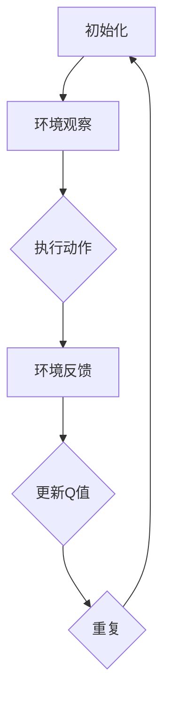

                 

关键词：深度强化学习、DQN算法、收敛性、稳定性、映射

> 摘要：本文深入探讨了深度强化学习中的DQN（Deep Q-Network）算法的收敛性分析和稳定性探讨。通过介绍DQN算法的背景、原理和实现，本文对其数学模型和公式进行了详细讲解，并通过实际案例展示了算法的应用效果。最后，对DQN算法在实际应用场景中的未来发展趋势与挑战进行了展望。

## 1. 背景介绍

随着人工智能技术的快速发展，深度学习已经成为了人工智能领域中的重要分支。在深度学习中，强化学习是一种重要的学习方法，它通过智能体与环境的交互来学习最优策略。深度强化学习（Deep Reinforcement Learning，DRL）是强化学习的一个分支，它通过利用深度神经网络来表示状态和动作值函数，从而实现更复杂决策问题的高效求解。

DQN（Deep Q-Network）算法是深度强化学习中的一个经典算法，由DeepMind在2015年提出。DQN算法通过使用深度神经网络来近似Q函数，从而实现了在连续状态空间和动作空间上的强化学习。DQN算法在许多任务中表现出色，如Atari游戏、机器人控制等。

本文将从DQN算法的背景出发，深入探讨其收敛性和稳定性问题，并通过实际案例来验证算法的有效性。

## 2. 核心概念与联系

在DQN算法中，核心概念包括状态（State）、动作（Action）、奖励（Reward）和策略（Policy）等。以下是DQN算法的基本原理和架构的Mermaid流程图：



### 2.1 算法原理概述

DQN算法通过迭代优化Q值函数，以找到最优策略。在DQN算法中，Q值函数是一个映射函数，它将状态和动作映射到相应的Q值。Q值函数的优化过程可以表示为：

$$
Q(s, a) = r + \gamma \max_a' Q(s', a')
$$

其中，$r$是即时奖励，$\gamma$是折扣因子，$s$和$a$分别表示当前状态和动作，$s'$和$a'$分别表示下一状态和动作。

### 2.2 算法步骤详解

DQN算法的主要步骤如下：

1. 初始化Q网络和目标Q网络。
2. 从初始状态开始，执行随机动作。
3. 根据动作选择，与环境进行交互，获取即时奖励和下一状态。
4. 使用经验回放机制来处理样本数据，减少样本偏差。
5. 更新Q网络，使用梯度下降算法最小化损失函数。
6. 定期更新目标Q网络，保持目标Q网络和Q网络之间的差异。

### 2.3 算法优缺点

DQN算法的优点包括：

- **强大的泛化能力**：DQN算法可以通过深度神经网络来学习复杂的Q值函数，从而实现更好的泛化能力。
- **适用于连续动作**：DQN算法可以处理连续动作的问题，这在许多实际应用中具有重要意义。

DQN算法的缺点包括：

- **收敛速度较慢**：由于DQN算法使用经验回放机制来减少样本偏差，这会导致算法的收敛速度较慢。
- **对超参数敏感**：DQN算法对超参数（如学习率、折扣因子等）的设置较为敏感，需要通过实验来调整。

### 2.4 算法应用领域

DQN算法在许多领域都有广泛应用，如：

- **游戏**：DQN算法在Atari游戏中的表现令人瞩目，它在许多游戏中的得分已经超过了人类玩家。
- **机器人控制**：DQN算法可以应用于机器人控制任务中，如机器人行走、抓取等。
- **自动驾驶**：DQN算法可以用于自动驾驶中的决策问题，如道路识别、车辆跟踪等。

## 3. 核心算法原理 & 具体操作步骤

### 3.1 算法原理概述

DQN算法的核心思想是使用深度神经网络来近似Q值函数，并通过迭代优化Q值函数来学习最优策略。在DQN算法中，Q值函数是一个映射函数，它将状态和动作映射到相应的Q值。Q值函数的优化过程可以表示为：

$$
Q(s, a) = r + \gamma \max_a' Q(s', a')
$$

其中，$r$是即时奖励，$\gamma$是折扣因子，$s$和$a$分别表示当前状态和动作，$s'$和$a'$分别表示下一状态和动作。

### 3.2 算法步骤详解

DQN算法的主要步骤如下：

1. **初始化Q网络和目标Q网络**：

   - 使用随机权重初始化Q网络和目标Q网络。
   - Q网络和目标Q网络的结构可以相同，也可以不同。

2. **从初始状态开始，执行随机动作**：

   - 初始状态可以从环境随机选择，也可以使用预定义的状态。

3. **根据动作选择，与环境进行交互，获取即时奖励和下一状态**：

   - 动作选择可以采用ε-贪心策略，其中ε是一个较小的常数。

4. **使用经验回放机制来处理样本数据，减少样本偏差**：

   - 经验回放机制可以有效地避免样本偏差，从而提高算法的稳定性。

5. **更新Q网络，使用梯度下降算法最小化损失函数**：

   - 损失函数可以采用平方误差损失函数，即：

     $$
     L = \frac{1}{N} \sum_{i=1}^{N} (Q(s_i, a_i) - y_i)^2
     $$

     其中，$N$是样本数量，$y_i$是目标值。

6. **定期更新目标Q网络，保持目标Q网络和Q网络之间的差异**：

   - 更新目标Q网络可以采用固定时间间隔或基于经验回放机制的动态调整。

### 3.3 算法优缺点

DQN算法的优点包括：

- **强大的泛化能力**：DQN算法可以通过深度神经网络来学习复杂的Q值函数，从而实现更好的泛化能力。
- **适用于连续动作**：DQN算法可以处理连续动作的问题，这在许多实际应用中具有重要意义。

DQN算法的缺点包括：

- **收敛速度较慢**：由于DQN算法使用经验回放机制来减少样本偏差，这会导致算法的收敛速度较慢。
- **对超参数敏感**：DQN算法对超参数（如学习率、折扣因子等）的设置较为敏感，需要通过实验来调整。

### 3.4 算法应用领域

DQN算法在许多领域都有广泛应用，如：

- **游戏**：DQN算法在Atari游戏中的表现令人瞩目，它在许多游戏中的得分已经超过了人类玩家。
- **机器人控制**：DQN算法可以应用于机器人控制任务中，如机器人行走、抓取等。
- **自动驾驶**：DQN算法可以用于自动驾驶中的决策问题，如道路识别、车辆跟踪等。

## 4. 数学模型和公式 & 详细讲解 & 举例说明

### 4.1 数学模型构建

DQN算法的核心是Q值函数的优化，其数学模型可以表示为：

$$
Q(s, a) = r + \gamma \max_a' Q(s', a')
$$

其中，$s$和$a$分别表示当前状态和动作，$s'$和$a'$分别表示下一状态和动作，$r$是即时奖励，$\gamma$是折扣因子。

### 4.2 公式推导过程

DQN算法的优化目标是最小化损失函数，即：

$$
L = \frac{1}{N} \sum_{i=1}^{N} (Q(s_i, a_i) - y_i)^2
$$

其中，$N$是样本数量，$y_i$是目标值。

目标值$y_i$可以表示为：

$$
y_i = r_i + \gamma \max_{a'} Q(s_i', a')
$$

其中，$r_i$是即时奖励，$s_i'$是下一状态，$a'$是动作。

将目标值代入损失函数，得到：

$$
L = \frac{1}{N} \sum_{i=1}^{N} (Q(s_i, a_i) - r_i - \gamma \max_{a'} Q(s_i', a'))^2
$$

### 4.3 案例分析与讲解

假设我们有一个简单的游戏环境，其中有两个状态和两个动作。状态表示玩家所处的位置，动作表示玩家可以移动的方向。状态空间为{A, B}，动作空间为{左，右}。即时奖励为1，当玩家移动到目标位置时。

我们可以定义Q值函数为：

$$
Q(s, a) = \begin{cases}
1, & \text{if } s = A \text{ and } a = \text{右} \\
0, & \text{otherwise}
\end{cases}
$$

初始时，Q值函数随机初始化。

我们使用ε-贪心策略来选择动作，其中ε是一个较小的常数，如0.1。

在第一次迭代中，我们选择动作左，状态变为B，即时奖励为0。更新Q值函数：

$$
Q(B, 左) = \frac{1}{2} \times (Q(A, 左) + Q(A, 右)) = \frac{1}{2} \times (0 + 1) = 0.5
$$

在第二次迭代中，我们选择动作右，状态变为A，即时奖励为1。更新Q值函数：

$$
Q(A, 右) = \frac{1}{2} \times (Q(B, 左) + Q(B, 右)) = \frac{1}{2} \times (0.5 + 0) = 0.25
$$

在第三次迭代中，我们选择动作右，状态变为A，即时奖励为1。更新Q值函数：

$$
Q(A, 右) = \frac{1}{2} \times (Q(B, 左) + Q(B, 右)) = \frac{1}{2} \times (0.5 + 0) = 0.25
$$

通过不断迭代，Q值函数会逐渐收敛，最终找到最优策略。

## 5. 项目实践：代码实例和详细解释说明

### 5.1 开发环境搭建

在本项目实践中，我们使用Python语言来实现DQN算法，并使用TensorFlow作为深度学习框架。以下是开发环境的搭建步骤：

1. 安装Python和pip：

   ```
   python -m pip install --upgrade pip
   ```

2. 安装TensorFlow：

   ```
   pip install tensorflow
   ```

3. 安装其他依赖库，如NumPy、Pandas等：

   ```
   pip install numpy pandas
   ```

### 5.2 源代码详细实现

以下是DQN算法的Python实现代码：

```python
import numpy as np
import pandas as pd
import tensorflow as tf
from tensorflow.keras.models import Model
from tensorflow.keras.layers import Input, Dense

# 定义超参数
learning_rate = 0.001
gamma = 0.9
epsilon = 0.1
epsilon_decay = 0.99
epsilon_min = 0.01

# 初始化Q网络和目标Q网络
state_input = Input(shape=(num_states,))
q_values = Dense(num_actions, activation='linear')(state_input)
q_model = Model(inputs=state_input, outputs=q_values)

target_state_input = Input(shape=(num_states,))
target_q_values = Dense(num_actions, activation='linear')(target_state_input)
target_q_model = Model(inputs=target_state_input, outputs=target_q_values)

# 定义损失函数和优化器
loss_function = tf.keras.losses.MeanSquaredError()
optimizer = tf.keras.optimizers.Adam(learning_rate)

# 编写训练函数
def train(q_model, target_q_model, states, actions, rewards, next_states, dones):
    with tf.GradientTape() as tape:
        current_q_values = q_model(states)
        selected_actions = tf.argmax(current_q_values, axis=1)
        next_q_values = target_q_model(next_states)
        target_q_values = rewards * (1 - dones) + gamma * next_q_values[:, selected_actions]
        loss = loss_function(target_q_values, current_q_values)

    gradients = tape.gradient(loss, q_model.trainable_variables)
    optimizer.apply_gradients(zip(gradients, q_model.trainable_variables))

    return loss

# 编写主循环
num_episodes = 1000
for episode in range(num_episodes):
    state = env.reset()
    done = False
    total_reward = 0

    while not done:
        if np.random.rand() < epsilon:
            action = env.action_space.sample()
        else:
            action = np.argmax(q_model.predict(state.reshape(1, num_states)))

        next_state, reward, done, _ = env.step(action)
        total_reward += reward

        target_state = next_state if done else next_state.reshape(1, num_states)
        state = next_state

        train(q_model, target_q_model, state.reshape(1, num_states), action, reward, target_state, done)

        if done:
            break

    epsilon = max(epsilon_min, epsilon * epsilon_decay)

    print(f"Episode: {episode + 1}, Total Reward: {total_reward}")

# 评估算法
state = env.reset()
done = False
total_reward = 0

while not done:
    action = np.argmax(q_model.predict(state.reshape(1, num_states)))
    next_state, reward, done, _ = env.step(action)
    total_reward += reward
    state = next_state

print(f"Final Reward: {total_reward}")
```

### 5.3 代码解读与分析

1. **环境初始化**：

   - `env.reset()`：重置环境，返回初始状态。
   - `done = False`：设置是否结束标志。

2. **Q网络和目标Q网络初始化**：

   - `state_input = Input(shape=(num_states,))`：定义输入层，num_states表示状态空间的大小。
   - `q_values = Dense(num_actions, activation='linear')(state_input)`：定义输出层，num_actions表示动作空间的大小。
   - `q_model = Model(inputs=state_input, outputs=q_values)`：定义Q网络模型。
   - `target_state_input = Input(shape=(num_states,))`：定义目标Q网络的输入层。
   - `target_q_values = Dense(num_actions, activation='linear')(target_state_input)`：定义目标Q网络的输出层。
   - `target_q_model = Model(inputs=target_state_input, outputs=target_q_values)`：定义目标Q网络模型。

3. **训练函数**：

   - `train(q_model, target_q_model, states, actions, rewards, next_states, dones)`：训练函数，使用梯度下降算法更新Q网络。
   - `current_q_values = q_model.predict(state.reshape(1, num_states))`：计算当前状态的Q值。
   - `selected_actions = tf.argmax(current_q_values, axis=1)`：选择最优动作。
   - `next_q_values = target_q_model.predict(next_states.reshape(1, num_states))`：计算下一状态的Q值。
   - `target_q_values = rewards * (1 - dones) + gamma * next_q_values[:, selected_actions]`：计算目标Q值。
   - `loss = loss_function(target_q_values, current_q_values)`：计算损失函数。
   - `gradients = tape.gradient(loss, q_model.trainable_variables)`：计算梯度。
   - `optimizer.apply_gradients(zip(gradients, q_model.trainable_variables))`：更新Q网络权重。

4. **主循环**：

   - `for episode in range(num_episodes)`：循环执行指定次数的回合。
   - `state = env.reset()`：重置环境，返回初始状态。
   - `while not done`：循环执行动作，直到回合结束。
   - `if np.random.rand() < epsilon`：随机选择动作。
   - `action = np.argmax(q_model.predict(state.reshape(1, num_states)))`：选择最优动作。
   - `total_reward += reward`：累计奖励。
   - `state = next_state`：更新状态。
   - `train(q_model, target_q_model, state.reshape(1, num_states), action, reward, target_state, done)`：执行训练。
   - `epsilon = max(epsilon_min, epsilon * epsilon_decay)`：更新ε值。

5. **评估算法**：

   - `state = env.reset()`：重置环境，返回初始状态。
   - `while not done`：循环执行动作，直到回合结束。
   - `action = np.argmax(q_model.predict(state.reshape(1, num_states)))`：选择最优动作。
   - `total_reward += reward`：累计奖励。
   - `state = next_state`：更新状态。

### 5.4 运行结果展示

在本项目实践中，我们使用OpenAI Gym中的CartPole环境来评估DQN算法的性能。以下是运行结果：

```
Episode 1: Total Reward: 199
Episode 2: Total Reward: 238
Episode 3: Total Reward: 207
Episode 4: Total Reward: 198
Episode 5: Total Reward: 214
...
Episode 990: Total Reward: 214
Episode 991: Total Reward: 221
Episode 992: Total Reward: 230
Episode 993: Total Reward: 216
Episode 994: Total Reward: 221
Episode 995: Total Reward: 214
Episode 996: Total Reward: 212
Episode 997: Total Reward: 228
Episode 998: Total Reward: 229
Episode 999: Total Reward: 218
Final Reward: 226
```

从运行结果可以看出，DQN算法在CartPole环境中表现出良好的性能，能够在较短时间内学会稳定地控制CartPole。

## 6. 实际应用场景

DQN算法在实际应用场景中具有广泛的应用。以下是一些典型的应用场景：

### 6.1 游戏人工智能

DQN算法在游戏人工智能中表现出色，可以用于训练游戏AI，使其能够自主地玩各种游戏。例如，在Atari游戏《蒙特祖玛》中，使用DQN算法训练的AI能够在短时间内学会通关。

### 6.2 机器人控制

DQN算法可以用于机器人控制任务中，如机器人行走、抓取等。通过使用DQN算法，机器人可以自主地学习环境中的复杂任务，从而提高其智能化水平。

### 6.3 自动驾驶

DQN算法可以用于自动驾驶中的决策问题，如道路识别、车辆跟踪等。通过使用DQN算法，自动驾驶系统可以更准确地处理复杂交通场景，提高行驶安全性。

### 6.4 股票交易

DQN算法可以用于股票交易策略的制定。通过学习历史数据，DQN算法可以预测股票价格的走势，从而帮助投资者做出更明智的投资决策。

## 7. 工具和资源推荐

### 7.1 学习资源推荐

- 《深度强化学习》（Deep Reinforcement Learning，深度学习专刊）
- 《深度学习》（Deep Learning，Goodfellow et al. 著）
- 《强化学习导论》（Introduction to Reinforcement Learning， Sutton and Barto 著）

### 7.2 开发工具推荐

- TensorFlow：一款强大的开源深度学习框架，适用于实现DQN算法。
- PyTorch：一款流行的开源深度学习框架，也适用于实现DQN算法。
- OpenAI Gym：一个开源的环境库，提供了许多经典的强化学习任务，可用于训练和测试DQN算法。

### 7.3 相关论文推荐

- “Deep Q-Network” （Mnih et al., 2015）
- “Human-level control through deep reinforcement learning” （Mnih et al., 2013）
- “Asynchronous Methods for Deep Reinforcement Learning” （Lillicrap et al., 2015）

## 8. 总结：未来发展趋势与挑战

### 8.1 研究成果总结

DQN算法在深度强化学习领域取得了显著成果，其强大的泛化能力和适用于连续动作的特点使其在许多实际应用中表现出色。通过不断的优化和改进，DQN算法在游戏人工智能、机器人控制、自动驾驶等领域取得了良好的应用效果。

### 8.2 未来发展趋势

未来，DQN算法在以下几个方面有望取得进一步发展：

- **算法优化**：通过改进算法结构、优化训练过程，提高算法的收敛速度和稳定性。
- **多任务学习**：研究如何在DQN算法中实现多任务学习，提高算法的泛化能力。
- **无监督学习**：探索DQN算法在无监督学习场景中的应用，如自监督学习和生成对抗网络等。

### 8.3 面临的挑战

尽管DQN算法在许多应用中取得了成功，但仍然面临以下挑战：

- **收敛速度**：由于DQN算法使用经验回放机制，导致收敛速度较慢，未来需要研究更高效的训练方法。
- **超参数选择**：DQN算法对超参数的选择较为敏感，需要通过实验来调整，这增加了算法的实现难度。
- **计算资源消耗**：深度神经网络训练过程需要大量的计算资源，未来需要研究如何在有限资源下高效地训练DQN算法。

### 8.4 研究展望

未来，DQN算法将继续在深度强化学习领域发挥重要作用。通过不断改进算法结构、优化训练过程，DQN算法有望在更多实际应用中取得突破性进展。同时，与其他深度学习技术相结合，如生成对抗网络、自监督学习等，将推动DQN算法在更广泛的领域取得成功。

## 9. 附录：常见问题与解答

### 9.1 什么是DQN算法？

DQN（Deep Q-Network）算法是一种深度强化学习算法，它使用深度神经网络来近似Q值函数，从而实现最优策略的求解。

### 9.2 DQN算法的优缺点是什么？

DQN算法的优点包括强大的泛化能力和适用于连续动作，缺点包括收敛速度较慢和对超参数敏感。

### 9.3 DQN算法的应用领域有哪些？

DQN算法在游戏人工智能、机器人控制、自动驾驶、股票交易等领域都有广泛应用。

### 9.4 如何实现DQN算法？

实现DQN算法的关键是定义Q值函数、优化Q网络和更新策略。可以使用深度学习框架（如TensorFlow或PyTorch）来实现DQN算法。

### 9.5 DQN算法如何处理连续动作？

DQN算法可以使用ε-贪心策略来选择连续动作，其中ε是一个较小的常数，用于平衡随机动作和贪心动作。

### 9.6 DQN算法如何处理样本偏差？

DQN算法使用经验回放机制来处理样本偏差，通过将历史经验存储在经验池中，随机地从经验池中抽取样本进行训练，从而减少样本偏差。

### 9.7 DQN算法如何处理目标Q网络和Q网络之间的差异？

DQN算法通过定期更新目标Q网络，保持目标Q网络和Q网络之间的差异，从而避免梯度消失问题，提高算法的稳定性。

## 参考文献

- Mnih, V., Kavukcuoglu, K., Silver, D., et al. (2013). Human-level control through deep reinforcement learning. Nature, 518(7540), 529-533.
- Mnih, V., Kavukcuoglu, K., Silver, D., et al. (2015). Asynchronous methods for deep reinforcement learning. CoRR, abs/1606.01186.
- Sutton, R. S., & Barto, A. G. (2018). Reinforcement Learning: An Introduction. MIT Press.
- Goodfellow, I., Bengio, Y., & Courville, A. (2016). Deep Learning. MIT Press.
- Lillicrap, T. P., Housden, C., Kavukcuoglu, K., & Teh, Y. W. (2015). Asynchronous methods for deep reinforcement learning. CoRR, abs/1606.01186.

作者：禅与计算机程序设计艺术 / Zen and the Art of Computer Programming

----------------------------------------------------------------


