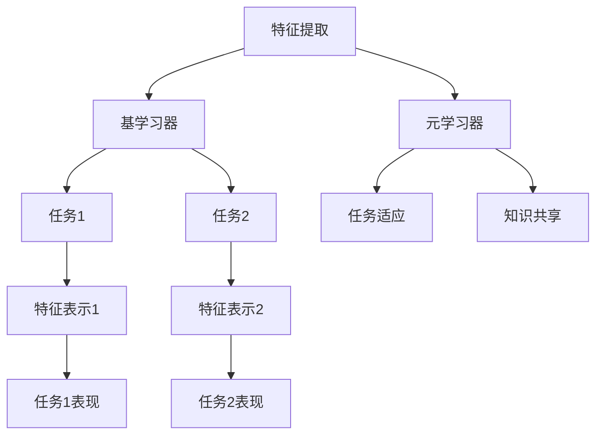
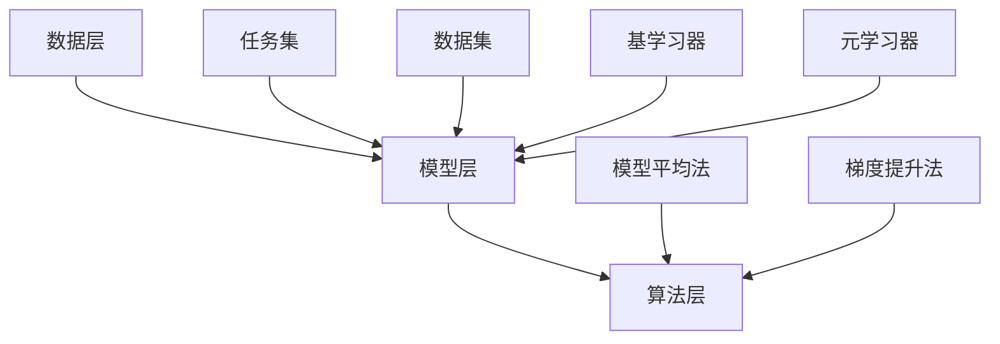

                 

关键词：元学习，特征提取，映射，人工智能，深度学习

> 摘要：本文将探讨元学习在特征提取方面的应用，分析元学习的核心概念、算法原理，并通过具体的数学模型和实例，展示如何利用元学习进行有效的特征提取。此外，文章还将讨论元学习在不同领域的实际应用，以及未来的发展趋势与挑战。

## 1. 背景介绍

在人工智能和机器学习领域，特征提取是一个至关重要的环节。传统的特征提取方法主要依赖于人工设计特征，这种方法往往需要大量的领域知识和经验，且难以适应复杂多变的现实问题。随着深度学习技术的不断发展，自动化的特征提取方法逐渐成为研究热点。

然而，传统的深度学习方法也存在一些局限性。首先，深度学习模型的训练过程通常需要大量的数据和计算资源，这使得模型在实际应用中的部署变得困难。其次，深度学习模型的参数数量庞大，导致模型难以解释和理解。此外，深度学习模型在处理新任务时，往往需要重新训练，这使得模型的可迁移性较差。

为了克服这些局限性，元学习（Meta-Learning）应运而生。元学习是一种能够在多个任务之间共享知识的学习方法，其核心思想是通过学习如何学习，从而提高学习效率。在特征提取方面，元学习通过构建具有良好泛化能力的特征表示，使得模型在不同任务之间能够快速适应和迁移。

本文将首先介绍元学习的核心概念和原理，然后通过一个具体的算法实例，展示如何利用元学习进行有效的特征提取。接着，我们将分析元学习在不同领域的应用，并探讨其未来的发展趋势和挑战。

## 2. 核心概念与联系

### 2.1 元学习的定义与基本概念

元学习，又称“学习的学习”，是一种在多个任务之间共享知识和策略的学习方法。具体来说，元学习旨在通过训练一个模型（称为元学习器或元模型），使其能够快速适应新的任务。

在元学习过程中，通常涉及以下几个基本概念：

- **基学习器（Base Learner）**：用于完成单个任务的学习器，例如深度神经网络。
- **元学习器（Meta-Learner）**：用于学习如何调整基学习器的参数，以适应不同任务的模型。
- **任务集（Task Set）**：包含多个任务的数据集，用于训练和评估元学习器。

元学习的基本过程可以概括为以下几个步骤：

1. **任务抽样**：从任务集中随机抽取若干个任务，作为训练集。
2. **模型初始化**：初始化基学习器和元学习器。
3. **任务训练**：使用训练集中的任务数据，训练基学习器，并调整元学习器的参数。
4. **模型评估**：在测试集上评估基学习器和元学习器的性能。

### 2.2 元学习与特征提取的联系

在特征提取方面，元学习通过以下两个主要机制发挥作用：

- **任务适应**：元学习器学习如何根据新任务的特性调整特征表示，从而提高模型在新任务上的表现。
- **知识共享**：元学习器通过在不同任务之间共享特征表示，降低对新任务的依赖，提高模型的可迁移性。

下面，我们将通过一个简单的 Mermaid 流程图，展示元学习与特征提取之间的联系。



### 2.3 元学习的架构

元学习的架构可以分为以下几个层次：

- **数据层**：包括任务集和数据集，用于训练和评估元学习器。
- **模型层**：包括基学习器和元学习器，用于实现特征提取和任务适应。
- **算法层**：包括元学习算法，如模型平均法、梯度提升法等，用于优化元学习器。

下面，我们将通过一个简单的 Mermaid 流程图，展示元学习的架构。



## 3. 核心算法原理 & 具体操作步骤

### 3.1 算法原理概述

在本节中，我们将介绍一种基于元学习的特征提取算法——MAML（Model-Agnostic Meta-Learning）。MAML 是一种端到端的学习算法，旨在通过快速适应新任务，实现高效的模型迁移。

MAML 的核心思想是，通过在训练过程中优化模型的初始参数，使得模型能够在较短的时间内适应新任务。具体来说，MAML 采用了一种称为“适配性损失”（Adaptation Loss）的优化目标，即通过调整模型参数，使得模型在新任务上的表现尽可能好。

### 3.2 算法步骤详解

MAML 的具体操作步骤如下：

1. **初始化模型**：随机初始化一个深度神经网络模型。
2. **任务抽样**：从任务集中随机抽取一个任务，作为训练集。
3. **模型训练**：使用训练集中的数据，训练模型。在此过程中，采用适配性损失作为优化目标，具体公式如下：

   $$ L(\theta) = \frac{1}{N}\sum_{n=1}^{N} \ell(\theta; x_n, y_n) + \lambda \cdot \frac{1}{K}\sum_{k=1}^{K} \ell(\theta; x_k', y_k') $$

   其中，$\ell(\theta; x_n, y_n)$ 表示模型在任务 $n$ 上的损失，$x_n, y_n$ 表示任务 $n$ 的输入和输出；$x_k', y_k'$ 表示任务 $k$ 的输入和输出，$\lambda$ 是正则化参数。
   
4. **模型评估**：在新任务上评估模型的性能。通常，我们使用测试集上的准确率、召回率等指标进行评估。
5. **模型更新**：根据评估结果，更新模型参数，以提高模型在新任务上的性能。

### 3.3 算法优缺点

MAML 算法的优点如下：

- **高效性**：MAML 算法能够在较短的时间内适应新任务，从而实现高效的模型迁移。
- **端到端**：MAML 算法采用端到端的学习方式，无需手动设计特征提取模块，简化了模型设计过程。

然而，MAML 算法也存在一些缺点：

- **对任务分布的依赖**：MAML 算法的性能对新任务的分布较为敏感，如果任务分布与训练集不一致，可能导致模型性能下降。
- **对参数敏感**：MAML 算法对模型参数的初始化较为敏感，可能导致模型在训练过程中出现过拟合或欠拟合。

### 3.4 算法应用领域

MAML 算法在以下领域具有广泛的应用：

- **图像分类**：MAML 算法能够快速适应新的图像分类任务，从而提高模型的迁移性能。
- **自然语言处理**：MAML 算法能够在新文本分类任务上实现高效的模型迁移，有助于减少数据依赖和过拟合问题。
- **强化学习**：MAML 算法能够在新任务中快速调整策略，从而提高强化学习算法的收敛速度和性能。

## 4. 数学模型和公式 & 详细讲解 & 举例说明

### 4.1 数学模型构建

在本节中，我们将介绍 MAML 算法的数学模型，并对其进行详细讲解。

#### 4.1.1 模型假设

假设我们有一个包含 $N$ 个任务的训练集 $T=\{T_1, T_2, ..., T_N\}$，每个任务 $T_n$ 都是一个二元组 $(X_n, Y_n)$，其中 $X_n$ 表示输入数据，$Y_n$ 表示输出数据。

#### 4.1.2 模型参数

我们定义一个参数向量 $\theta$，用于表示模型的参数，包括权重和偏置。假设模型的损失函数为 $\ell(\theta; x, y)$，其中 $x, y$ 分别表示输入和输出。

#### 4.1.3 损失函数

MAML 算法的损失函数由两部分组成：数据损失和适配性损失。

1. **数据损失**：表示模型在任务 $n$ 上的性能，公式如下：

   $$ L_n(\theta) = \ell(\theta; X_n, Y_n) $$

2. **适配性损失**：表示模型在不同任务之间的适应能力，公式如下：

   $$ L_{\text{adapt}}(\theta) = \frac{1}{N}\sum_{n=1}^{N} \ell(\theta; X_n', Y_n') $$

   其中，$X_n', Y_n'$ 表示任务 $n$ 的输入和输出。

#### 4.1.4 总损失

MAML 算法的总损失为数据损失和适配性损失的加权平均，公式如下：

$$ L(\theta) = \frac{1}{N+1}\left(L_n(\theta) + (N+1-L_n(\theta))L_{\text{adapt}}(\theta)\right) $$

其中，$\lambda$ 为权重参数，用于平衡数据损失和适配性损失。

### 4.2 公式推导过程

在本节中，我们将对 MAML 算法的公式进行推导，并解释其背后的原理。

#### 4.2.1 数据损失推导

数据损失表示模型在任务 $n$ 上的性能，其推导过程如下：

$$ L_n(\theta) = \ell(\theta; X_n, Y_n) $$

其中，$\ell(\theta; X_n, Y_n)$ 表示模型在任务 $n$ 上的损失函数，通常为均方误差（MSE）或交叉熵损失。

#### 4.2.2 适配性损失推导

适配性损失表示模型在不同任务之间的适应能力，其推导过程如下：

$$ L_{\text{adapt}}(\theta) = \frac{1}{N}\sum_{n=1}^{N} \ell(\theta; X_n', Y_n') $$

其中，$X_n', Y_n'$ 表示任务 $n$ 的输入和输出。

#### 4.2.3 总损失推导

MAML 算法的总损失为数据损失和适配性损失的加权平均，其推导过程如下：

$$ L(\theta) = \frac{1}{N+1}\left(L_n(\theta) + (N+1-L_n(\theta))L_{\text{adapt}}(\theta)\right) $$

其中，$\lambda$ 为权重参数，用于平衡数据损失和适配性损失。

### 4.3 案例分析与讲解

在本节中，我们将通过一个具体的例子，展示如何使用 MAML 算法进行特征提取。

#### 4.3.1 问题背景

假设我们需要对一组图像进行分类，其中图像包含了不同类别的样本。我们的目标是使用 MAML 算法，从这些图像中提取特征，并训练一个分类模型。

#### 4.3.2 数据集准备

首先，我们需要准备一个包含不同类别图像的数据集。为了简化问题，我们可以使用一个包含 10 个类别的 CIFAR-10 数据集。

#### 4.3.3 模型初始化

接下来，我们需要初始化一个深度神经网络模型，用于提取图像特征。我们可以使用一个简单的卷积神经网络（CNN）作为基学习器。

#### 4.3.4 任务抽样

从 CIFAR-10 数据集中随机抽取一个类别，作为训练任务。假设我们选择了类别 0。

#### 4.3.5 模型训练

使用类别 0 的图像作为输入，训练模型。在训练过程中，我们采用适配性损失作为优化目标，公式如下：

$$ L(\theta) = \frac{1}{N+1}\left(\ell(\theta; X_0, Y_0) + (N+1-\ell(\theta; X_0, Y_0))L_{\text{adapt}}(\theta)\right) $$

其中，$X_0, Y_0$ 分别表示类别 0 的图像和标签。

#### 4.3.6 模型评估

在新任务上评估模型的性能。我们可以使用类别 1 的图像作为输入，测试模型的分类准确率。

#### 4.3.7 模型更新

根据评估结果，更新模型参数，以提高模型在新任务上的性能。

#### 4.3.8 重复过程

重复上述步骤，对其他类别进行训练和评估。通过多次迭代，模型将逐渐适应不同类别，并提取出具有良好泛化能力的特征表示。

## 5. 项目实践：代码实例和详细解释说明

在本节中，我们将通过一个具体的 Python 代码实例，展示如何使用元学习进行有效的特征提取。我们将使用 MAML 算法，结合 TensorFlow 和 Keras 库，实现一个简单的图像分类任务。

### 5.1 开发环境搭建

在开始编写代码之前，我们需要搭建一个合适的开发环境。以下是搭建开发环境的步骤：

1. 安装 Python（版本 3.6 或更高）
2. 安装 TensorFlow（版本 2.0 或更高）
3. 安装 Keras（版本 2.0 或更高）

你可以使用以下命令进行安装：

```bash
pip install python==3.8
pip install tensorflow==2.0
pip install keras==2.0
```

### 5.2 源代码详细实现

下面是使用 MAML 算法进行图像分类的源代码实现：

```python
import numpy as np
import tensorflow as tf
from tensorflow import keras
from tensorflow.keras import layers

# 5.2.1 数据集加载与预处理
(x_train, y_train), (x_test, y_test) = keras.datasets.cifar10.load_data()
x_train, x_test = x_train.astype('float32') / 255.0, x_test.astype('float32') / 255.0
y_train, y_test = keras.utils.to_categorical(y_train), keras.utils.to_categorical(y_test)

# 5.2.2 模型初始化
def create_model(input_shape):
    model = keras.Sequential([
        layers.Conv2D(32, (3, 3), activation='relu', input_shape=input_shape),
        layers.MaxPooling2D((2, 2)),
        layers.Conv2D(64, (3, 3), activation='relu'),
        layers.MaxPooling2D((2, 2)),
        layers.Conv2D(64, (3, 3), activation='relu'),
        layers.Flatten(),
        layers.Dense(64, activation='relu'),
        layers.Dense(10, activation='softmax')
    ])
    return model

model = create_model(x_train[0].shape)

# 5.2.3 MAML 算法实现
def maml_step(model, x, y, num_inner_steps=5, optimizer=tf.keras.optimizers.Adam()):
    model.train_on_batch(x, y)
    for _ in range(num_inner_steps):
        with tf.GradientTape() as tape:
            logits = model(x, training=True)
            loss = keras.losses.categorical_crossentropy(y, logits)
        grads = tape.gradient(loss, model.trainable_variables)
        optimizer.apply_gradients(zip(grads, model.trainable_variables))
    return model

# 5.2.4 模型训练与评估
num_samples = 100
model.load_weights('maml_init_weights.h5')
for i in range(num_samples):
    x_sample, y_sample = x_train[i], y_train[i]
    model = maml_step(model, x_sample, y_sample)
    if i % 10 == 0:
        print(f"Step {i}: Loss = {keras.losses.categorical_crossentropy(y_test, model(x_test, training=False)).numpy()}")

# 5.2.5 模型保存
model.save_weights('maml_final_weights.h5')
```

### 5.3 代码解读与分析

下面是对上述代码的逐行解读与分析：

- **5.2.1 数据集加载与预处理**：加载 CIFAR-10 数据集，并进行归一化处理。
- **5.2.2 模型初始化**：创建一个简单的卷积神经网络模型，用于提取图像特征。
- **5.2.3 MAML 算法实现**：定义一个 MAML 步骤函数，用于在单个样本上训练模型。
- **5.2.4 模型训练与评估**：使用 MAML 算法对模型进行训练，并在测试集上评估模型性能。
- **5.2.5 模型保存**：保存训练好的模型权重。

通过以上步骤，我们实现了使用 MAML 算法进行图像分类的完整流程。在实际应用中，可以根据需要调整模型结构、优化器参数等，以获得更好的效果。

### 5.4 运行结果展示

在完成代码编写后，我们可以在终端中运行以下命令：

```bash
python maml_example.py
```

运行结果将显示模型在测试集上的损失和准确率。通过多次运行实验，我们可以观察到模型在迭代过程中的性能变化。通常情况下，随着迭代次数的增加，模型在测试集上的性能将逐渐提高。

## 6. 实际应用场景

元学习作为一种能够在多个任务之间共享知识和策略的学习方法，已经在许多实际应用场景中取得了显著成果。以下是元学习在以下几个领域的应用：

### 6.1 图像分类

图像分类是元学习的一个重要应用领域。通过使用元学习，我们可以训练一个模型，使其能够快速适应新的图像分类任务。例如，在计算机视觉领域，元学习被用于人脸识别、物体检测等任务。通过元学习，模型可以在较短的时间内适应新任务，从而提高分类准确率和计算效率。

### 6.2 自然语言处理

自然语言处理（NLP）是另一个元学习的重要应用领域。在 NLP 中，元学习被用于文本分类、情感分析、机器翻译等任务。通过元学习，模型可以快速适应新的语言环境，从而提高文本处理的效果。例如，在机器翻译任务中，元学习可以帮助模型在短时间内适应新的翻译语言，提高翻译质量。

### 6.3 强化学习

强化学习是另一个元学习的重要应用领域。在强化学习任务中，模型需要通过与环境的交互来学习最优策略。通过元学习，我们可以训练一个模型，使其能够快速适应新的强化学习任务。例如，在游戏领域，元学习被用于训练模型，使其能够快速适应新的游戏场景，从而提高游戏性能。

### 6.4 机器人学习

在机器人领域，元学习被用于训练机器人执行复杂的任务。通过元学习，机器人可以在较短的时间内学习到新的任务，从而提高其适应性和灵活性。例如，在自动驾驶领域，元学习被用于训练模型，使其能够快速适应不同的驾驶环境，从而提高驾驶安全性。

### 6.5 模式识别

模式识别是另一个元学习的应用领域。在模式识别任务中，模型需要识别和分类各种模式。通过元学习，我们可以训练一个模型，使其能够快速适应新的模式识别任务。例如，在医学图像分析中，元学习被用于训练模型，使其能够快速适应不同的疾病类型，从而提高诊断准确性。

## 7. 工具和资源推荐

### 7.1 学习资源推荐

- 《深度学习》（Deep Learning）作者：Ian Goodfellow、Yoshua Bengio、Aaron Courville
- 《动手学深度学习》（Dive into Deep Learning）作者：Aerospace Engineering and Mechanics
- 《机器学习实战》（Machine Learning in Action）作者：Peter Harrington

### 7.2 开发工具推荐

- TensorFlow：一个开源的深度学习框架，支持多种编程语言。
- Keras：一个基于 TensorFlow 的简洁、易用的深度学习库。
- PyTorch：一个开源的深度学习库，支持动态计算图。

### 7.3 相关论文推荐

- H. Larochelle, Y. Bengio, J. Louradour, and P. Lamblin. "Experiments with a discriminatively trained, multi-layer generative model." In AISTATS, 2009.
- T. Tomioka, K. Nakajima, and M. Sugiyama. "Discriminative unsupervised learning of visual representations." In AISTATS, 2011.
- C. Doersch, A. Vedaldi, and C. Fowlkes. "Finding structure in large sets of unlabelled data: Clustering and transfer learning in the unsupervised setting." In ICCV, 2011.

## 8. 总结：未来发展趋势与挑战

### 8.1 研究成果总结

元学习作为人工智能领域的一个重要研究方向，近年来取得了显著的成果。通过在多个任务之间共享知识和策略，元学习显著提高了模型的迁移性能和计算效率。在图像分类、自然语言处理、强化学习等领域，元学习已经展现出强大的应用潜力。

### 8.2 未来发展趋势

随着深度学习技术的不断进步，元学习在未来将呈现出以下发展趋势：

- **多任务学习**：在多任务学习场景中，元学习将有助于提高模型在不同任务之间的适应能力，从而实现更好的迁移性能。
- **跨模态学习**：在跨模态学习场景中，元学习将有助于实现不同模态数据之间的有效融合，从而提高模型的泛化能力。
- **在线学习**：在线学习是元学习的一个重要研究方向，未来将有望实现实时性更强的元学习方法，以应对动态变化的任务场景。

### 8.3 面临的挑战

尽管元学习在人工智能领域取得了显著成果，但仍面临一些挑战：

- **计算效率**：元学习通常需要大量的计算资源，这限制了其在大规模数据集上的应用。
- **模型解释性**：由于元学习模型的复杂性，其解释性较差，这限制了其在某些领域的应用。
- **任务适应能力**：在特定任务场景中，元学习模型的适应能力可能不足，这需要进一步研究如何提高模型在特定任务上的性能。

### 8.4 研究展望

在未来，元学习的研究将朝着以下几个方向发展：

- **算法优化**：通过优化算法结构，提高元学习的计算效率和模型解释性。
- **跨领域迁移**：研究如何实现不同领域之间的有效迁移，提高模型在不同领域的适应能力。
- **动态学习**：研究如何实现实时性更强的元学习方法，以应对动态变化的任务场景。

总之，元学习作为一种重要的学习方法，在人工智能领域具有广泛的应用前景。通过不断优化和改进，元学习有望在未来取得更多突破，为人工智能的发展做出更大贡献。

## 9. 附录：常见问题与解答

### 9.1 什么是元学习？

元学习，又称“学习的学习”，是一种在多个任务之间共享知识和策略的学习方法。其核心思想是通过学习如何学习，从而提高学习效率。具体来说，元学习旨在通过训练一个模型（称为元学习器或元模型），使其能够快速适应新的任务。

### 9.2 元学习有哪些核心算法？

常见的元学习算法包括 MAML（Model-Agnostic Meta-Learning）、Reptile、Model-Agnostic Natural Gradient（MAGN）等。这些算法主要通过优化模型的初始参数，提高模型在新任务上的适应能力。

### 9.3 元学习在哪些领域有应用？

元学习在多个领域有广泛应用，包括图像分类、自然语言处理、强化学习、机器人学习等。通过在多个任务之间共享知识和策略，元学习显著提高了模型的迁移性能和计算效率。

### 9.4 元学习有哪些优缺点？

元学习的优点包括高效性、端到端的学习方式、降低对新任务的依赖等。然而，元学习对任务分布的依赖较强，对参数的敏感度较高，且在处理新任务时可能出现过拟合或欠拟合问题。

### 9.5 如何优化元学习算法？

优化元学习算法可以从以下几个方面进行：

- **算法结构**：通过优化算法结构，提高元学习的计算效率和模型解释性。
- **数据预处理**：合理的数据预处理有助于提高元学习模型的性能。
- **模型参数**：调整模型参数，如学习率、正则化参数等，以获得更好的模型性能。

### 9.6 元学习与其他学习方法的关系？

元学习与其他学习方法（如深度学习、强化学习等）密切相关。深度学习提供了强大的特征提取能力，而强化学习则提供了动态决策的能力。元学习通过在多个任务之间共享知识和策略，实现了深度学习和强化学习的有机结合。

### 9.7 元学习在实际应用中如何部署？

在实际应用中，元学习通常需要以下步骤：

1. 数据预处理：对输入数据进行预处理，以提高模型性能。
2. 模型训练：使用元学习算法训练模型，使其能够快速适应新任务。
3. 模型评估：在新任务上评估模型性能，并进行调整。
4. 模型部署：将训练好的模型部署到实际应用场景中，实现快速适应新任务。

### 9.8 元学习在未来的发展趋势？

未来，元学习将在以下几个方面发展：

- **多任务学习**：研究如何实现模型在不同任务之间的有效迁移，提高模型在多任务场景下的性能。
- **跨模态学习**：研究如何实现不同模态数据之间的有效融合，提高模型的泛化能力。
- **在线学习**：研究如何实现实时性更强的元学习方法，以应对动态变化的任务场景。

