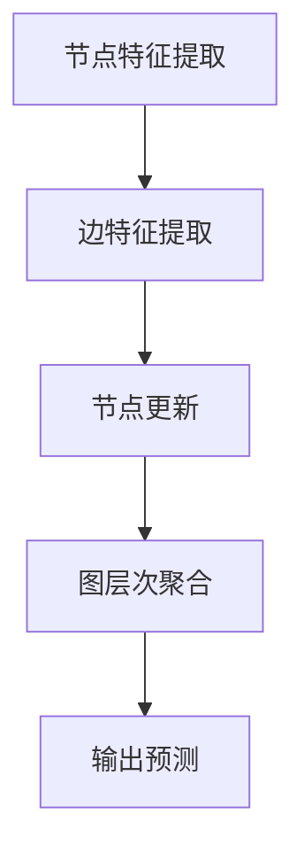

                 

关键词：图神经网络（GNN），映射，数据科学，机器学习，网络分析，人工智能，数据挖掘，图计算，图表示学习，图算法。

> 摘要：本文将深入探讨图神经网络（GNN）的兴起、核心概念、算法原理、数学模型、应用场景以及未来发展趋势。通过详细阐述GNN在数据科学和人工智能领域的潜在影响，本文旨在为读者提供一个全面的图神经网络指南，并展望其未来的发展方向。

## 1. 背景介绍

随着互联网的快速发展，数据类型和规模不断膨胀，传统的基于向量或矩阵的机器学习方法已难以应对复杂网络数据的处理需求。图（Graph）作为一种强大的数据结构，可以直观地表示实体及其关系，从而在多个领域展现出了巨大的潜力。图神经网络（Graph Neural Network，GNN）作为机器学习领域的一个重要分支，旨在通过深度学习的方法对图数据进行建模和分析。

GNN的起源可以追溯到20世纪80年代，当时的图算法主要集中在图论和计算几何领域。然而，随着深度学习的兴起，GNN的概念被重新审视并得到了快速发展。近年来，GNN在社交网络分析、推荐系统、生物信息学、分子建模等领域取得了显著的成果，逐渐成为学术界和工业界关注的热点。

## 2. 核心概念与联系

### 2.1 图（Graph）的基本概念

一个图由节点（Node）和边（Edge）组成。节点代表实体，边表示实体间的关系。图可以分为无向图和有向图，简单图和复合图等类型。常见的图属性包括度（Degree）、邻接矩阵（Adjacency Matrix）、邻接表（Adjacency List）等。

### 2.2 神经网络（Neural Network）的基本概念

神经网络是一种由大量神经元组成的计算模型，通过学习输入和输出数据之间的关系，进行特征提取和分类。神经网络可以分为前馈神经网络、卷积神经网络（CNN）、循环神经网络（RNN）等类型。

### 2.3 图神经网络（GNN）的定义

图神经网络是一种专门用于处理图数据的神经网络。GNN通过学习节点和边之间的特征表示，实现对图数据的深度建模和分析。GNN可以看作是图上的“神经网络”，它将传统神经网络的处理方式扩展到图结构数据上。

### 2.4 Mermaid 流程图

以下是GNN核心概念和架构的Mermaid流程图表示：



## 3. 核心算法原理 & 具体操作步骤

### 3.1 算法原理概述

GNN的核心思想是通过迭代的方式对节点和边进行特征提取和更新。每个迭代步骤中，节点和边的特征会根据其邻接节点的特征进行更新。通过多次迭代，GNN能够学习到图数据中的复杂结构和关系。

### 3.2 算法步骤详解

GNN的基本操作步骤如下：

1. **初始化节点特征和边特征**：给定图数据，初始化每个节点的特征表示和每条边的特征表示。
2. **节点特征提取**：使用节点特征和其邻接节点的特征计算新的节点特征。
3. **边特征提取**：使用边特征和其连接的两个节点的特征计算新的边特征。
4. **节点更新**：根据新的节点特征和边特征，对节点特征进行更新。
5. **图层次聚合**：将节点的特征传递给其邻接节点，实现图层次的聚合。
6. **输出预测**：利用最终的节点特征进行分类、回归或其他预测任务。

### 3.3 算法优缺点

**优点**：
- 能够处理图结构数据，对复杂网络数据具有很好的适应性。
- 能够学习到节点和边之间的复杂关系，提高模型的预测能力。

**缺点**：
- 计算复杂度高，特别是在大规模图数据上。
- 需要对图数据进行预处理，如节点嵌入、边权重等。

### 3.4 算法应用领域

GNN在多个领域都有广泛的应用，包括但不限于：

- **社交网络分析**：用于识别社交网络中的关键节点、社区结构等。
- **推荐系统**：通过图数据建模用户和物品之间的关系，提高推荐系统的准确性。
- **生物信息学**：用于蛋白质结构预测、药物设计等任务。
- **分子建模**：用于分子属性预测、反应路径分析等。

## 4. 数学模型和公式 & 详细讲解 & 举例说明

### 4.1 数学模型构建

GNN的数学模型可以分为节点更新函数、边更新函数和输出函数。以下是这些函数的数学表示：

- **节点更新函数**：$$ h_{t+1}^{(i)} = \sigma(\sum_{j \in N(i)} W^{(l)} h_{t}^{(j)} + b^{(l)}) $$
- **边更新函数**：$$ e_{t+1}^{(i,j)} = \sigma(\sum_{k \in N(i) \cup N(j)} W^{(l)} e_{t}^{(i,j)} + b^{(l)}) $$
- **输出函数**：$$ y = \sigma(\sum_{i=1}^{N} W^{(o)} h_{T}^{(i)} + b^{(o)}) $$

其中，$h_t^{(i)}$表示第$t$次迭代时节点$i$的特征表示，$e_t^{(i,j)}$表示第$t$次迭代时边$(i,j)$的特征表示，$W^{(l)}$和$b^{(l)}$分别为权重矩阵和偏置向量，$\sigma$为激活函数，$N(i)$表示节点$i$的邻接节点集合，$N$表示整个图的节点数，$y$为输出结果。

### 4.2 公式推导过程

GNN的公式推导过程如下：

1. **初始化节点特征和边特征**：给定图数据，初始化每个节点的特征表示和每条边的特征表示。
2. **节点特征提取**：对于每个节点$i$，计算其邻接节点$j$的特征表示$h_t^{(j)}$的加权和，并通过权重矩阵$W^{(l)}$和偏置向量$b^{(l)}$进行线性组合。最后，通过激活函数$\sigma$对结果进行非线性变换。
3. **边特征提取**：对于每条边$(i,j)$，计算其连接的两个节点$i$和$j$的特征表示$h_t^{(i)}$和$h_t^{(j)}$的加权和，并通过权重矩阵$W^{(l)}$和偏置向量$b^{(l)}$进行线性组合。最后，通过激活函数$\sigma$对结果进行非线性变换。
4. **节点更新**：利用新的节点特征和边特征，对原始节点特征进行更新。
5. **图层次聚合**：将节点的特征传递给其邻接节点，实现图层次的聚合。
6. **输出预测**：利用最终的节点特征进行分类、回归或其他预测任务。

### 4.3 案例分析与讲解

以下是一个简单的GNN应用案例：

假设我们有一个社交网络图，其中每个节点代表一个用户，每条边表示用户之间的好友关系。我们希望使用GNN预测用户之间的相似度。

1. **初始化节点特征和边特征**：对于每个用户，初始化一个特征向量，表示用户的基本信息，如年龄、性别等。对于每条边，初始化一个特征向量，表示用户之间的关系强度。
2. **节点特征提取**：对于每个用户$i$，计算其邻接用户$j$的特征表示的加权和，并通过权重矩阵$W^{(l)}$和偏置向量$b^{(l)}$进行线性组合。最后，通过激活函数$\sigma$对结果进行非线性变换。
3. **边特征提取**：对于每条边$(i,j)$，计算其连接的两个用户$i$和$j$的特征表示的加权和，并通过权重矩阵$W^{(l)}$和偏置向量$b^{(l)}$进行线性组合。最后，通过激活函数$\sigma$对结果进行非线性变换。
4. **节点更新**：利用新的节点特征和边特征，对原始节点特征进行更新。
5. **图层次聚合**：将节点的特征传递给其邻接节点，实现图层次的聚合。
6. **输出预测**：利用最终的节点特征，计算用户之间的相似度得分。

## 5. 项目实践：代码实例和详细解释说明

### 5.1 开发环境搭建

为了演示GNN的应用，我们使用Python编程语言和PyTorch深度学习框架。在开始之前，确保您的环境中已经安装了Python和PyTorch。

### 5.2 源代码详细实现

以下是一个简单的GNN实现示例：

```python
import torch
import torch.nn as nn
import torch.optim as optim
from torch_geometric.nn import GCNConv

# 数据预处理（此处以简单社交网络数据为例）
# 生成随机图和节点特征
num_nodes = 100
node_features = torch.randn(num_nodes, 10)
edge_index = torch.randint(0, num_nodes, (2, 1000), dtype=torch.long)

# 构建GNN模型
class GCNModel(nn.Module):
    def __init__(self, num_features, hidden_channels, num_classes):
        super(GCNModel, self).__init__()
        self.conv1 = GCNConv(num_features, hidden_channels)
        self.conv2 = GCNConv(hidden_channels, num_classes)

    def forward(self, data):
        x, edge_index = data.x, data.edge_index
        x = self.conv1(x, edge_index)
        x = F.relu(x)
        x = self.conv2(x, edge_index)
        return F.log_softmax(x, dim=1)

# 初始化模型、优化器和损失函数
model = GCNModel(num_features=10, hidden_channels=16, num_classes=2)
optimizer = optim.Adam(model.parameters(), lr=0.01)
criterion = nn.NLLLoss()

# 训练模型
for epoch in range(200):
    optimizer.zero_grad()
    out = model(data)
    loss = criterion(out, data.y)
    loss.backward()
    optimizer.step()
    if (epoch + 1) % 10 == 0:
        print(f'Epoch {epoch + 1}: loss = {loss.item()}')

# 测试模型
with torch.no_grad():
    test_acc = (model(data).max(1)[1] == data.y).sum().item() / len(data.y)
    print(f'Test accuracy: {test_acc}')
```

### 5.3 代码解读与分析

以上代码实现了一个简单的图卷积网络（GCN）模型。以下是代码的详细解读：

- **数据预处理**：生成一个随机社交网络图和节点特征。
- **构建模型**：定义GCN模型，包含两个GCNConv层。
- **初始化优化器和损失函数**：使用Adam优化器和交叉熵损失函数。
- **训练模型**：进行200个epoch的训练，打印每个epoch的损失。
- **测试模型**：计算测试集上的准确率。

## 6. 实际应用场景

GNN在多个实际应用场景中展现了其强大的能力。以下是一些典型的应用场景：

- **社交网络分析**：用于识别社交网络中的关键节点、社区结构等。
- **推荐系统**：通过图数据建模用户和物品之间的关系，提高推荐系统的准确性。
- **生物信息学**：用于蛋白质结构预测、药物设计等任务。
- **分子建模**：用于分子属性预测、反应路径分析等。

### 6.4 未来应用展望

随着图数据规模的不断扩大和计算能力的提升，GNN在未来的应用前景十分广阔。以下是一些可能的发展方向：

- **图神经网络的优化**：研究更高效的算法和优化方法，以降低计算复杂度。
- **多模态数据融合**：将图神经网络与其他数据类型（如图像、文本等）进行融合，提高模型的泛化能力。
- **图表示学习**：进一步探索图表示学习的理论和方法，以更好地捕捉图数据中的结构信息。

## 7. 工具和资源推荐

### 7.1 学习资源推荐

- **书籍**：《图神经网络》（Graph Neural Networks）和《图表示学习》（Graph Representation Learning）。
- **在线课程**：Coursera、Udacity等平台上关于图神经网络和深度学习的课程。
- **论文**：Google Scholar上关于GNN的最新论文和综述。

### 7.2 开发工具推荐

- **框架**：PyTorch Geometric、DGL、PyTorchdrug等。
- **库**：NetworkX、GraphFrames等。

### 7.3 相关论文推荐

- **经典论文**：《Graph Neural Networks: A Review》和《Message Passing Mechanism in Graph Neural Networks》。
- **最新论文**：在AAAI、NeurIPS、ICLR等顶级会议和期刊上发表的最新论文。

## 8. 总结：未来发展趋势与挑战

### 8.1 研究成果总结

GNN在数据科学和人工智能领域取得了显著的成果，成为解决复杂网络数据问题的重要工具。随着图数据的广泛应用和深度学习的发展，GNN的研究和应用前景将越来越广阔。

### 8.2 未来发展趋势

- **算法优化**：研究更高效的算法和优化方法，降低计算复杂度。
- **多模态数据融合**：将图神经网络与其他数据类型进行融合，提高模型的泛化能力。
- **图表示学习**：进一步探索图表示学习的理论和方法，以更好地捕捉图数据中的结构信息。

### 8.3 面临的挑战

- **计算复杂度**：如何在高维度和高稀疏度的图数据上进行有效的计算。
- **可解释性**：如何提高GNN模型的可解释性，使其更容易被用户理解和接受。

### 8.4 研究展望

随着技术的不断进步，GNN将在更多领域得到广泛应用，成为人工智能领域的重要分支。未来的研究将重点关注算法优化、多模态数据融合和可解释性等方面，以推动GNN的发展和落地应用。

## 9. 附录：常见问题与解答

### 9.1 GNN与传统机器学习方法的区别是什么？

GNN与传统机器学习方法的主要区别在于数据处理方式和模型结构。传统方法通常基于向量或矩阵进行数据处理，而GNN则针对图结构数据进行建模，能够更好地捕捉图数据中的复杂关系。

### 9.2 GNN如何处理大规模图数据？

GNN可以处理大规模图数据，但需要考虑计算复杂度。一些优化方法，如图分解、异步计算等，可以降低GNN的计算复杂度，使其适用于大规模图数据。

### 9.3 GNN在哪些领域有广泛应用？

GNN在社交网络分析、推荐系统、生物信息学、分子建模等领域有广泛应用。随着图数据的不断增长，GNN的应用领域将不断扩展。

### 9.4 GNN模型如何进行调优？

GNN模型的调优可以从以下几个方面进行：

- **超参数调整**：调整学习率、批量大小、隐藏层神经元数量等超参数。
- **优化算法选择**：选择更高效的优化算法，如Adam、SGD等。
- **正则化技术**：应用正则化技术，如L1、L2正则化，防止过拟合。

---

作者：禅与计算机程序设计艺术 / Zen and the Art of Computer Programming

[END]

