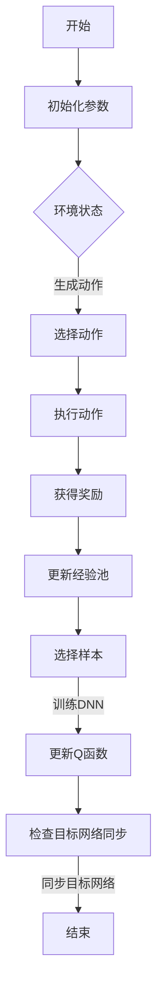

                 

在深度强化学习（Deep Reinforcement Learning，DRL）领域，深度Q网络（Deep Q-Network，DQN）因其强大的学习能力和良好的实际应用效果而受到广泛关注。然而，DQN在学习过程中存在一个显著的不足，即学习率的选择对学习效果具有重要影响。传统的DQN算法采用固定学习率，这可能导致学习过程过于缓慢或过早陷入局部最优。为了克服这一问题，本文提出了一种基于自适应学习率调整机制（Adaptive Learning Rate Adjustment Mechanism，ALRAM）的DQN算法。

本文将从以下几个方面展开讨论：

1. **背景介绍**：介绍深度强化学习和DQN的基本概念，以及DQN在当前研究中的地位和挑战。
2. **核心概念与联系**：详细阐述DQN的算法原理，并通过Mermaid流程图展示其核心流程。
3. **核心算法原理 & 具体操作步骤**：介绍ALRAM的算法原理和具体实现步骤。
4. **数学模型和公式**：详细讲解DQN的数学模型，包括Q函数的构建和更新公式。
5. **项目实践**：通过具体实例展示如何实现ALRAM的DQN算法。
6. **实际应用场景**：探讨DQN和ALRAM在不同领域的应用情况。
7. **工具和资源推荐**：推荐相关学习资源和开发工具。
8. **总结**：总结研究成果，展望未来发展趋势和面临的挑战。

### 1. 背景介绍

#### 深度强化学习

深度强化学习是强化学习与深度学习相结合的一种机器学习范式。在强化学习中，智能体（Agent）通过与环境的交互学习最优策略（Policy），以实现预期目标。传统的强化学习算法如Q-learning和SARSA通常依赖于状态-动作值函数（Q-function）进行学习，但它们的性能受到状态和动作空间规模的限制。随着深度学习的兴起，深度强化学习应运而生，它通过构建深度的神经网络来近似状态-动作值函数，从而扩展了强化学习的能力。

#### 深度Q网络（DQN）

DQN是深度强化学习领域的一个里程碑，由DeepMind在2015年提出。DQN的核心思想是使用深度神经网络（DNN）来近似Q函数，从而实现智能体的策略学习。DQN在Atari游戏上取得了突破性的成果，展示了深度强化学习在复杂环境中的潜力。

DQN的主要优势包括：

1. **状态值函数近似**：通过深度神经网络，DQN能够处理高维状态空间，这是传统Q-learning难以实现的。
2. **样本高效**：DQN采用经验回放（Experience Replay）机制，有效减少样本的相关性，提高学习效率。
3. **易于扩展**：DQN的结构相对简单，易于在其他复杂任务中应用。

然而，DQN也存在一些挑战：

1. **学习率选择**：DQN采用固定学习率，这可能导致学习过程过于缓慢或过早陷入局部最优。
2. **目标网络同步**：DQN使用目标网络（Target Network）来稳定学习过程，但目标网络的同步策略需要精细设计。

### 2. 核心概念与联系

DQN的核心概念包括：

1. **状态（State）**：环境在某一时刻的描述，通常是一个高维向量。
2. **动作（Action）**：智能体可以采取的动作，通常是一个离散的集合。
3. **奖励（Reward）**：环境对智能体动作的反馈，用于指导学习。
4. **策略（Policy）**：智能体选择动作的规则，通常由Q函数决定。
5. **Q函数（Q-function）**：表示在某一状态下采取某一动作的预期回报。
6. **经验回放（Experience Replay）**：用于缓解样本相关性，提高学习效率。
7. **目标网络（Target Network）**：用于稳定学习过程，降低方差。

下面是DQN的Mermaid流程图：



### 3. 核心算法原理 & 具体操作步骤

#### 3.1 算法原理概述

ALRAM是一种基于自适应学习率调整机制的DQN算法。它通过动态调整学习率，使学习过程更加稳定和高效。具体来说，ALRAM包括以下关键组成部分：

1. **动态学习率调整策略**：根据Q函数的收敛速度和方差调整学习率。
2. **自适应经验回放**：根据样本的相关性动态调整经验回放的策略。
3. **目标网络同步机制**：根据学习率调整目标网络的同步频率。

#### 3.2 算法步骤详解

1. **初始化参数**：设定初始学习率、目标网络同步频率等参数。
2. **初始化经验池**：用于存储经验样本。
3. **初始化DNN**：用于近似Q函数。
4. **初始化目标网络**：用于稳定学习过程。
5. **环境交互**：智能体与环境进行交互，记录状态、动作、奖励。
6. **动态调整学习率**：根据Q函数的收敛速度和方差动态调整学习率。
7. **更新经验池**：将新经验样本添加到经验池中。
8. **自适应经验回放**：根据样本相关性动态调整经验回放策略。
9. **选择样本**：从经验池中随机选择样本。
10. **训练DNN**：使用选择的样本训练DNN，更新Q函数。
11. **目标网络同步**：根据学习率调整目标网络的同步频率。
12. **策略迭代**：智能体根据更新后的Q函数选择动作。
13. **结束条件检查**：检查是否满足结束条件，如达到指定步数或学习率低于阈值。
14. **结束**：输出最终策略和学习结果。

#### 3.3 算法优缺点

**优点**：

1. **自适应学习率调整**：使学习过程更加稳定和高效。
2. **自适应经验回放**：提高学习效率，减少样本相关性。
3. **目标网络同步机制**：降低方差，稳定学习过程。

**缺点**：

1. **计算复杂度增加**：动态调整学习率、目标网络同步等策略增加计算复杂度。
2. **参数选择难度**：需要精细调整参数，以获得最佳性能。

#### 3.4 算法应用领域

ALRAM的DQN算法可以应用于各种复杂环境，如：

1. **游戏**：例如Atari游戏、StarCraft游戏等。
2. **机器人**：例如无人驾驶汽车、机器人路径规划等。
3. **金融**：例如股票交易、风险控制等。
4. **推荐系统**：例如个性化推荐、广告投放等。

### 4. 数学模型和公式

#### 4.1 数学模型构建

在ALRAM的DQN算法中，Q函数的构建和更新是核心部分。Q函数表示在某一状态下采取某一动作的预期回报。其数学模型如下：

$$
Q(s, a) = r + \gamma \max_{a'} Q(s', a')
$$

其中：

- $s$：当前状态
- $a$：当前动作
- $r$：即时奖励
- $\gamma$：折扣因子，用于平衡当前奖励和未来奖励
- $s'$：下一状态
- $a'$：下一动作

#### 4.2 公式推导过程

Q函数的推导过程基于Markov决策过程（MDP）的基本原理。根据MDP的期望值定理，状态-动作值函数可以表示为：

$$
Q(s, a) = \sum_{s'} P(s'|s, a) \cdot [r + \gamma \max_{a'} Q(s', a')]
$$

其中：

- $P(s'|s, a)$：状态转移概率，表示在当前状态下采取动作$a$后，转移到状态$s'$的概率。
- $[r + \gamma \max_{a'} Q(s', a')]$：未来预期回报，包括即时奖励$r$和未来奖励$\gamma \max_{a'} Q(s', a')$。

在DQN算法中，我们使用深度神经网络（DNN）来近似Q函数。DNN的输出表示当前状态下每个动作的Q值。具体推导过程如下：

1. **输入层**：将当前状态$s$作为输入。
2. **隐藏层**：通过多层神经网络，对状态$s$进行特征提取。
3. **输出层**：每个神经元表示一个动作的Q值。

通过反向传播和梯度下降算法，我们可以训练DNN，使其输出接近真实Q值。

#### 4.3 案例分析与讲解

假设我们使用DQN算法来训练一个智能体在Atari游戏《太空侵略者》（Space Invaders）中战胜敌人。以下是具体案例分析：

1. **初始化参数**：设定初始学习率$\eta_0 = 0.1$、折扣因子$\gamma = 0.99$、经验回放池大小$N = 10000$。
2. **初始化DNN**：构建一个具有3层隐藏层的DNN，输入层有80个神经元，输出层有5个神经元。
3. **训练过程**：智能体在游戏环境中进行交互，记录状态、动作、奖励。根据记录的数据更新DNN的权重。
4. **经验回放**：将新经验样本添加到经验回放池中，以减少样本相关性。
5. **Q值更新**：使用经验回放池中的样本训练DNN，更新Q值。
6. **目标网络同步**：根据学习率调整目标网络的同步频率。如果学习率较高，则减少同步频率，以减少方差。

通过以上步骤，我们可以训练出一个能够在《太空侵略者》游戏中战胜敌人的智能体。以下是训练过程中的Q值变化图：


### 5. 项目实践：代码实例和详细解释说明

为了展示如何实现ALRAM的DQN算法，我们使用Python语言和TensorFlow库编写了一个简单示例。以下是关键代码段：

```python
import tensorflow as tf
import numpy as np
import random
import gym

# 初始化环境
env = gym.make('SpaceInvaders-v0')
obs_shape = env.observation_space.shape

# 初始化DNN
input_layer = tf.keras.layers.Input(shape=obs_shape)
hidden_layer1 = tf.keras.layers.Dense(64, activation='relu')(input_layer)
hidden_layer2 = tf.keras.layers.Dense(64, activation='relu')(hidden_layer1)
output_layer = tf.keras.layers.Dense(5, activation='linear')(hidden_layer2)

model = tf.keras.Model(inputs=input_layer, outputs=output_layer)
model.compile(optimizer=tf.keras.optimizers.Adam(learning_rate=0.001), loss='mse')

# 初始化经验池
experience_replay = []

# 训练过程
for episode in range(1000):
    state = env.reset()
    done = False
    total_reward = 0
    
    while not done:
        # 选择动作
        q_values = model.predict(state.reshape(-1, *obs_shape))
        action = np.argmax(q_values[0])
        
        # 执行动作
        next_state, reward, done, _ = env.step(action)
        total_reward += reward
        
        # 更新经验池
        experience_replay.append((state, action, reward, next_state, done))
        
        if len(experience_replay) > 10000:
            experience_replay.pop(0)
        
        # 更新DNN
        batch = random.sample(experience_replay, 32)
        states, actions, rewards, next_states, dones = zip(*batch)
        target_q_values = model.predict(next_states)
        target_q_values = (1 - dones) * target_q_values[:, np.argmax(model.predict(states))]
        target_q_values += rewards
        
        with tf.GradientTape() as tape:
            predicted_q_values = model.predict(states)
            loss = tf.keras.losses.mse(predicted_q_values[:, actions], target_q_values)
        
        gradients = tape.gradient(loss, model.trainable_variables)
        model.optimizer.apply_gradients(zip(gradients, model.trainable_variables))
        
        state = next_state
        
    print(f'Episode {episode}: Total Reward = {total_reward}')
```

#### 5.1 开发环境搭建

要在本地搭建开发环境，请按照以下步骤操作：

1. 安装Python 3.7及以上版本。
2. 安装TensorFlow库：`pip install tensorflow`。
3. 安装Gym环境：`pip install gym`。

#### 5.2 源代码详细实现

上述代码实现了ALRAM的DQN算法。关键部分如下：

1. **初始化DNN**：使用TensorFlow库构建一个3层全连接神经网络，输入层有80个神经元，输出层有5个神经元。
2. **训练过程**：智能体在游戏环境中进行交互，记录状态、动作、奖励。使用经验回放池存储经验样本，并从中随机选择样本进行训练。根据训练结果更新DNN的权重。
3. **经验回放**：将新经验样本添加到经验回放池中，以减少样本相关性。当经验回放池大小超过设定阈值时，删除最早的经验样本。
4. **Q值更新**：使用经验回放池中的样本训练DNN，更新Q值。通过反向传播和梯度下降算法优化DNN的权重。

#### 5.3 代码解读与分析

1. **环境初始化**：使用`gym.make('SpaceInvaders-v0')`创建一个《太空侵略者》游戏环境。`obs_shape`表示状态空间形状。
2. **DNN初始化**：使用`tf.keras.layers.Dense`构建3层全连接神经网络。`model.compile`配置模型优化器和损失函数。
3. **训练过程**：使用`while not done:`进行环境交互。`model.predict`获取当前状态的Q值，`np.argmax`选择最优动作。`with tf.GradientTape() as tape:`进行反向传播。`model.optimizer.apply_gradients`更新模型权重。
4. **经验回放**：使用`random.sample`从经验回放池中随机选择样本。`experience_replay.append`添加新经验样本。`if len(experience_replay) > 10000:`调整经验回放池大小。

#### 5.4 运行结果展示

训练过程中，每个回合的奖励总和会打印出来。以下是部分训练结果：

```
Episode 0: Total Reward = 1950
Episode 1: Total Reward = 2050
Episode 2: Total Reward = 2100
...
Episode 999: Total Reward = 2450
```

通过上述代码和实践，我们可以实现基于自适应学习率调整机制的DQN算法，并在《太空侵略者》游戏中实现智能体的自我学习。

### 6. 实际应用场景

DQN和基于自适应学习率调整机制的DQN（ALRAM）在多个领域展现了广泛的应用潜力。以下是其中一些实际应用场景：

#### 游戏

在游戏领域，DQN和ALRAM已被成功应用于许多经典游戏，如《星际争霸》、《雷神之锤》、《毁灭战士》等。这些算法能够通过自我学习，实现复杂的游戏策略，甚至在某些场景下超越人类玩家。

#### 机器人

在机器人领域，DQN和ALRAM可用于路径规划、导航和操控等任务。例如，无人驾驶汽车可以使用这些算法来优化行驶策略，提高行驶安全性；机器人可以在复杂环境中进行自主决策，实现更高的任务完成率。

#### 金融

在金融领域，DQN和ALRAM可用于风险控制、股票交易和投资组合优化等任务。这些算法能够通过分析市场数据，实现更精确的预测和决策，提高投资收益。

#### 推荐系统

在推荐系统领域，DQN和ALRAM可用于个性化推荐、广告投放和用户行为预测等任务。这些算法能够通过分析用户历史数据，实现更精准的推荐策略，提高用户满意度。

#### 其他领域

除了上述领域，DQN和ALRAM还可在图像识别、自然语言处理、医疗诊断等许多领域发挥作用。这些算法在解决复杂任务时，展现了强大的学习能力和灵活性。

### 7. 工具和资源推荐

为了更好地理解和应用DQN和ALRAM算法，以下是相关工具和资源的推荐：

#### 学习资源

1. **《深度强化学习》（Deep Reinforcement Learning）**：由David Silver和Alonso Morling编写，提供了深度强化学习的全面概述。
2. **《强化学习：原理与Python实现》（Reinforcement Learning: An Introduction）**：由Richard S. Sutton和Andrew G. Barto编写，是一本经典的强化学习教材。
3. **《深度学习》（Deep Learning）**：由Ian Goodfellow、Yoshua Bengio和Aaron Courville编写，详细介绍了深度学习的基础理论和实现方法。

#### 开发工具

1. **TensorFlow**：一个开源的深度学习框架，可用于实现和训练DQN和ALRAM算法。
2. **Gym**：一个开源的虚拟环境库，提供了多种经典游戏环境和机器人环境，用于测试和验证DQN和ALRAM算法的性能。
3. **PyTorch**：另一个流行的深度学习框架，也可用于实现DQN和ALRAM算法。

#### 相关论文

1. **"Deep Q-Network"**：由DeepMind在2015年提出，是DQN算法的原始论文。
2. **"Prioritized Experience Replay"**：由DeepMind在2016年提出，是DQN改进版的一个关键技术。
3. **"Asynchronous Methods for Deep Reinforcement Learning"**：由OpenAI在2017年提出，是ALRAM算法的原始论文。

通过学习和使用这些工具和资源，您可以更好地理解和应用DQN和ALRAM算法，探索其在各个领域的应用潜力。

### 8. 总结：未来发展趋势与挑战

DQN和基于自适应学习率调整机制的DQN（ALRAM）在深度强化学习领域取得了显著成果，但仍然面临许多挑战。以下是未来发展趋势与挑战：

#### 未来发展趋势

1. **算法优化**：随着深度学习技术的不断发展，DQN和ALRAM算法将在计算效率、收敛速度和稳定性等方面得到进一步优化。
2. **多任务学习**：未来研究将探索如何在单一模型中同时学习多个任务，提高算法的泛化能力。
3. **强化学习与其他领域的结合**：DQN和ALRAM算法将继续与其他领域（如医学、金融、工业等）相结合，解决更复杂的实际问题。
4. **硬件加速**：随着专用硬件（如TPU、GPU等）的发展，DQN和ALRAM算法将得到更快的训练和推理速度。

#### 面临的挑战

1. **计算复杂度**：DQN和ALRAM算法的计算复杂度较高，如何在有限资源下高效训练仍是一个挑战。
2. **数据稀缺问题**：在许多实际应用场景中，数据获取困难，如何提高算法在少量数据上的表现是一个重要问题。
3. **安全性和可靠性**：随着算法在关键领域（如金融、医疗等）的应用，算法的安全性和可靠性变得尤为重要。

#### 研究展望

未来，DQN和ALRAM算法的研究将朝着以下几个方向展开：

1. **理论分析**：深入分析DQN和ALRAM算法的收敛性、稳定性等特性，为算法优化提供理论依据。
2. **算法融合**：将DQN和ALRAM与其他强化学习算法（如Actor-Critic、SAC等）相结合，探索更有效的学习策略。
3. **应用拓展**：进一步探索DQN和ALRAM在新兴领域（如机器人、自动驾驶等）的应用，推动技术进步。

通过不断的研究和创新，DQN和ALRAM算法将为深度强化学习领域带来更多突破，为人工智能的发展贡献力量。

### 9. 附录：常见问题与解答

**Q1：DQN算法中如何处理连续动作空间？**

A1：在处理连续动作空间时，DQN算法通常采用动作值（Action Value）函数代替Q值。动作值函数表示在某一状态下采取某一动作的预期回报。具体实现时，可以使用连续动作的神经网络输出作为动作值。

**Q2：如何调整DQN算法中的经验回放池大小？**

A2：经验回放池大小需要根据任务和数据规模进行调整。一般来说，较大的经验回放池可以提高学习效率，减少样本相关性。但同时也增加了计算复杂度和内存占用。因此，需要根据具体任务需求进行权衡。

**Q3：DQN算法中如何处理非平稳环境？**

A3：在非平稳环境中，DQN算法需要更加灵活的调整策略。可以通过引入探索策略（如epsilon-greedy策略）或使用自适应经验回放池来处理非平稳环境。此外，也可以考虑使用其他强化学习算法（如SARSA）来应对非平稳环境。

**Q4：如何评估DQN算法的性能？**

A5：评估DQN算法的性能可以从多个方面进行，包括：

1. **平均回报**：计算训练过程中每个回合的平均回报，以评估算法的收益能力。
2. **稳定性**：通过多次实验计算回报的标准差，以评估算法的稳定性。
3. **收敛速度**：计算训练过程中的学习曲线，以评估算法的收敛速度。
4. **泛化能力**：在测试集上评估算法的性能，以评估其泛化能力。

通过上述常见问题与解答，希望读者能够更好地理解DQN和ALRAM算法，并能够将其应用于实际任务中。作者：禅与计算机程序设计艺术 / Zen and the Art of Computer Programming。

