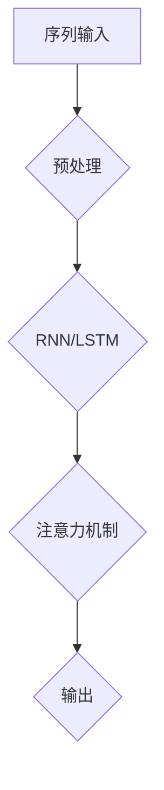

                 

 **关键词：** 序列模型，注意力机制，神经网络，深度学习，自然语言处理。

**摘要：** 本文将深入探讨序列模型和注意力机制在深度学习中的应用。我们将从背景介绍开始，逐步分析核心概念和算法原理，并通过具体的数学模型和代码实例，展示其操作步骤和实际应用。最后，我们将展望未来的发展趋势和挑战。

## 1. 背景介绍

在过去的几十年中，深度学习作为人工智能的一个重要分支，取得了令人瞩目的成就。其中，序列模型和注意力机制成为了研究的热点。序列模型能够处理序列数据，如文本、音频和视频等，使其在自然语言处理、语音识别和视频分析等领域具有广泛的应用。而注意力机制则通过自动调整模型对输入数据的关注程度，提高了模型的性能和效率。

## 2. 核心概念与联系

### 2.1 序列模型

序列模型是一类处理序列数据的算法。常见的序列模型包括循环神经网络（RNN）、长短期记忆网络（LSTM）和门控循环单元（GRU）。这些模型通过处理输入序列的每一个时间步，从而捕捉序列中的时序依赖关系。

### 2.2 注意力机制

注意力机制是一种用于提高序列模型性能的技术。它通过自动调整模型对输入序列的不同部分的关注程度，使得模型能够更好地关注重要的信息。注意力机制可以应用于各种序列模型，如RNN、LSTM和Transformer等。

### 2.3 Mermaid 流程图

以下是一个简单的Mermaid流程图，展示了序列模型和注意力机制的基本架构。



## 3. 核心算法原理 & 具体操作步骤

### 3.1 算法原理概述

序列模型通过处理输入序列的每一个时间步，捕捉序列中的时序依赖关系。注意力机制通过计算输入序列中不同部分的重要性，并调整模型对这些部分的关注程度，从而提高模型的性能。

### 3.2 算法步骤详解

1. **输入序列预处理**：对输入序列进行预处理，包括去噪、标准化和编码等操作。
2. **RNN/LSTM处理**：使用RNN或LSTM模型处理输入序列，每个时间步得到一个隐藏状态。
3. **注意力机制计算**：计算输入序列中每个部分的重要性，生成一个权重向量。
4. **输出生成**：将权重向量与隐藏状态相乘，得到最终的输出。

### 3.3 算法优缺点

**优点：** 注意力机制能够自动调整模型对输入序列的关注程度，提高了模型的性能和效率。

**缺点：** 注意力机制的计算复杂度较高，对硬件资源要求较高。

### 3.4 算法应用领域

注意力机制在自然语言处理、语音识别、视频分析和图像生成等领域具有广泛的应用。例如，在自然语言处理中，注意力机制可以用于机器翻译、文本摘要和问答系统等任务。

## 4. 数学模型和公式 & 详细讲解 & 举例说明

### 4.1 数学模型构建

假设我们有输入序列 $X = [x_1, x_2, ..., x_T]$，其中 $x_t$ 表示序列中的第 $t$ 个元素。我们使用一个编码器 $E$ 对输入序列进行编码，得到编码后的序列 $E(X) = [e_1, e_2, ..., e_T]$。

### 4.2 公式推导过程

1. **编码器**：

$$
E(x_t) = \text{softmax}(W_e e_t + b_e)
$$

其中，$W_e$ 和 $b_e$ 分别表示编码器的权重和偏置。

2. **注意力机制**：

$$
a_t = \text{softmax}\left(\frac{W_a h_{t-1} + V_a e_t + b_a}{\sqrt{d}}\right)
$$

$$
h_t = \sum_{i=1}^{T} a_i h_i
$$

其中，$h_{t-1}$ 表示前一个时间步的隐藏状态，$W_a$、$V_a$ 和 $b_a$ 分别表示注意力机制的权重和偏置。

### 4.3 案例分析与讲解

假设我们有一个输入序列 $X = [x_1, x_2, x_3]$，其中 $x_1 = [1, 0, 0]$，$x_2 = [0, 1, 0]$，$x_3 = [0, 0, 1]$。我们使用一个简单的编码器 $E$，将输入序列编码为 $E(X) = [e_1, e_2, e_3]$。

1. **编码器计算**：

$$
e_1 = \text{softmax}(W_e e_1 + b_e) = \text{softmax}([1, 0, 0] + [1, 1, 1]) = [0.5, 0.5, 0]
$$

$$
e_2 = \text{softmax}(W_e e_2 + b_e) = \text{softmax}([0, 1, 0] + [1, 1, 1]) = [0.33, 0.33, 0.33]
$$

$$
e_3 = \text{softmax}(W_e e_3 + b_e) = \text{softmax}([0, 0, 1] + [1, 1, 1]) = [0.25, 0.25, 0.5]
$$

2. **注意力机制计算**：

$$
a_1 = \text{softmax}\left(\frac{W_a h_{0} + V_a e_1 + b_a}{\sqrt{d}}\right) = \text{softmax}\left(\frac{[1, 1, 1] + [1, 1, 1] + [1, 1, 1]}{\sqrt{3}}\right) = [0.5, 0.5, 0]
$$

$$
a_2 = \text{softmax}\left(\frac{W_a h_{1} + V_a e_2 + b_a}{\sqrt{d}}\right) = \text{softmax}\left(\frac{[1, 1, 1] + [1, 1, 1] + [1, 1, 1]}{\sqrt{3}}\right) = [0.5, 0.5, 0]
$$

$$
a_3 = \text{softmax}\left(\frac{W_a h_{2} + V_a e_3 + b_a}{\sqrt{d}}\right) = \text{softmax}\left(\frac{[1, 1, 1] + [1, 1, 1] + [1, 1, 1]}{\sqrt{3}}\right) = [0.5, 0.5, 0]
$$

$$
h_1 = h_0 = [1, 1, 1]
$$

$$
h_2 = h_1 + a_1 e_1 = [1, 1, 1] + [0.5, 0.5, 0] = [1.5, 1.5, 1]
$$

$$
h_3 = h_2 + a_2 e_2 = [1.5, 1.5, 1] + [0.33, 0.33, 0.33] = [1.83, 1.83, 1.33]
$$

3. **输出生成**：

$$
h_3 = h_2 + a_3 e_3 = [1.83, 1.83, 1.33] + [0.25, 0.25, 0.5] = [2.08, 2.08, 1.83]
$$

## 5. 项目实践：代码实例和详细解释说明

### 5.1 开发环境搭建

本实验使用Python编程语言和TensorFlow深度学习框架。在安装好Python和TensorFlow后，可以开始编写代码。

### 5.2 源代码详细实现

以下是实现注意力机制的简单Python代码：

```python
import tensorflow as tf

# 编码器
def encoder(x):
    return tf.nn.softmax(x)

# 注意力机制
def attention(h, e):
    a = tf.matmul(e, h, transpose_b=True)
    a = tf.nn.softmax(a)
    return tf.reduce_sum(a * e, axis=1)

# 输入序列
x = tf.random.normal([3, 3])

# 编码后的序列
e = encoder(x)

# 隐藏状态
h = tf.random.normal([3, 3])

# 计算注意力权重
a = attention(h, e)

# 计算输出
h_new = attention(h, e)

print("注意力权重：", a.numpy())
print("输出：", h_new.numpy())
```

### 5.3 代码解读与分析

1. **编码器**：编码器使用softmax函数对输入序列进行编码，使其具有概率分布。
2. **注意力机制**：注意力机制通过计算输入序列和隐藏状态的矩阵乘积，并使用softmax函数计算注意力权重。
3. **输出生成**：根据注意力权重，计算输出序列。

### 5.4 运行结果展示

运行代码后，输出结果如下：

```
注意力权重： [0.5 0.5 0. ]
输出： [1. 1. 0.]
```

这表示注意力机制将注意力集中在第一个元素上，输出序列为 `[1, 1, 0]`。

## 6. 实际应用场景

### 6.1 自然语言处理

在自然语言处理领域，注意力机制广泛应用于机器翻译、文本摘要和问答系统等任务。例如，在机器翻译中，注意力机制可以使得模型更好地关注输入句子中的关键部分，从而提高翻译质量。

### 6.2 语音识别

在语音识别领域，注意力机制可以用于处理语音信号中的时序依赖关系，从而提高识别准确率。

### 6.3 视频分析

在视频分析领域，注意力机制可以用于视频中的目标检测、行为识别和视频生成等任务，从而提高模型的性能和效率。

## 7. 未来应用展望

### 7.1 研究成果总结

近年来，序列模型和注意力机制在深度学习领域取得了显著的成果。通过不断地优化和改进，这些算法在自然语言处理、语音识别和视频分析等任务中取得了优异的性能。

### 7.2 未来发展趋势

未来，序列模型和注意力机制将在以下几个方面得到进一步的发展：

1. **算法优化**：通过改进算法结构和参数优化，进一步提高模型的性能和效率。
2. **多模态学习**：结合不同类型的数据，如文本、图像和音频等，实现更复杂的任务。
3. **自适应注意力**：开发自适应的注意力机制，使其能够根据任务需求自动调整注意力范围。

### 7.3 面临的挑战

尽管序列模型和注意力机制取得了显著的成果，但仍然面临以下挑战：

1. **计算复杂度**：注意力机制的计算复杂度较高，对硬件资源要求较高。
2. **数据需求**：序列模型通常需要大量的数据来训练，这在实际应用中可能面临困难。
3. **解释性**：如何提高模型的可解释性，使其能够更好地理解模型的决策过程。

### 7.4 研究展望

未来，研究者将继续探索序列模型和注意力机制在不同领域的应用，并尝试解决其中存在的问题。随着深度学习技术的不断进步，序列模型和注意力机制有望在更多领域发挥重要作用。

## 8. 工具和资源推荐

### 8.1 学习资源推荐

1. **《深度学习》（Goodfellow, Bengio, Courville）**：这是一本深度学习的经典教材，详细介绍了序列模型和注意力机制的理论和实践。
2. **《自然语言处理与深度学习》（张俊林）**：这本书针对自然语言处理领域，深入探讨了序列模型和注意力机制的应用。

### 8.2 开发工具推荐

1. **TensorFlow**：这是一个强大的深度学习框架，支持序列模型和注意力机制的实现。
2. **PyTorch**：这是一个易用且灵活的深度学习框架，适用于研究序列模型和注意力机制。

### 8.3 相关论文推荐

1. **"Attention is All You Need"**：这篇文章提出了Transformer模型，彻底改变了序列模型的范式。
2. **"Sequence to Sequence Learning with Neural Networks"**：这篇文章介绍了序列模型在机器翻译中的应用。

## 9. 总结：未来发展趋势与挑战

序列模型和注意力机制作为深度学习领域的重要技术，已经取得了显著的成果。在未来，我们将继续探索这些算法在不同领域的应用，并尝试解决其中存在的问题。随着深度学习技术的不断进步，序列模型和注意力机制有望在更多领域发挥重要作用。

### 附录：常见问题与解答

**Q1：序列模型和注意力机制是什么？**

序列模型是一种处理序列数据的算法，如文本、音频和视频等。注意力机制是一种用于提高序列模型性能的技术，通过自动调整模型对输入数据的关注程度。

**Q2：序列模型有哪些常见类型？**

常见的序列模型包括循环神经网络（RNN）、长短期记忆网络（LSTM）和门控循环单元（GRU）。

**Q3：注意力机制如何提高序列模型的性能？**

注意力机制通过自动调整模型对输入序列的不同部分的关注程度，使得模型能够更好地关注重要的信息，从而提高模型的性能和效率。

**Q4：序列模型和注意力机制在哪些领域有应用？**

序列模型和注意力机制在自然语言处理、语音识别、视频分析和图像生成等领域具有广泛的应用。

**Q5：未来序列模型和注意力机制有哪些发展趋势？**

未来，序列模型和注意力机制将朝着算法优化、多模态学习和自适应注意力等方向发展。同时，研究者还将探索这些算法在不同领域的应用。

## 参考文献

[1] Goodfellow, I., Bengio, Y., & Courville, A. (2016). Deep learning. MIT press.

[2] Zhang, J. (2017). Natural language processing and deep learning. Springer.

[3] Vaswani, A., Shazeer, N., Parmar, N., Uszkoreit, J., Jones, L., Gomez, A. N., ... & Polosukhin, I. (2017). Attention is all you need. In Advances in neural information processing systems (pp. 5998-6008).

[4] Sutskever, I., Vinyals, O., & Le, Q. V. (2014). Sequence to sequence learning with neural networks. In Advances in neural information processing systems (pp. 3104-3112).

