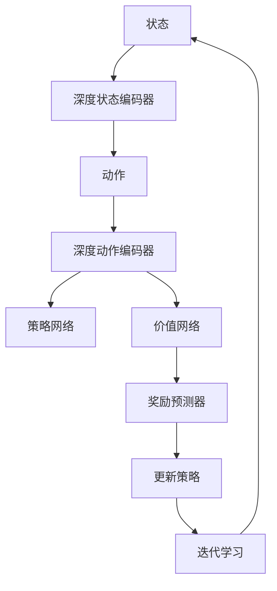

                 

 关键词：强化学习、深度学习、映射、机器学习、神经网络、马尔可夫决策过程、探索与利用、模型评估。

> 摘要：本文将深入探讨强化学习（RL）的基础原理及其与深度学习的结合应用。首先，我们会对强化学习的核心概念和流程进行详细解释，并通过具体算法如Q学习和策略梯度算法进行解析。然后，我们将讨论深度强化学习的兴起及其与深度学习技术的结合方式。最后，文章将总结当前强化学习的研究成果、未来发展趋势以及面临的挑战。

## 1. 背景介绍

强化学习（Reinforcement Learning, RL）是一种机器学习范式，旨在通过试错来学习如何在特定环境中做出最优决策。与传统监督学习和无监督学习不同，强化学习通过奖励机制来指导学习过程，使得智能体（agent）能够根据环境的反馈调整其行为策略。

深度学习（Deep Learning, DL）是一种基于神经网络的结构化机器学习方法，它通过多层神经元的非线性变换，能够有效地从大量数据中学习复杂的模式。深度学习的兴起改变了人工智能领域的面貌，尤其在图像识别、语音识别等领域取得了显著成果。

近年来，随着计算能力的提升和数据的激增，强化学习和深度学习开始融合，形成了一个新的研究方向——深度强化学习（Deep Reinforcement Learning, DRL）。深度强化学习通过将深度学习与强化学习相结合，使得智能体能够处理高维、复杂的输入数据，并实现更加高效的决策。

## 2. 核心概念与联系

### 2.1 强化学习概述

强化学习的主要目标是训练智能体在一个动态环境中采取最优策略以最大化累积奖励。在强化学习中，智能体（agent）与环境（environment）之间进行交互，通过不断学习来改善其行为策略。

**核心概念：**
- **智能体（Agent）**：执行行为并从环境中获取反馈的实体。
- **环境（Environment）**：智能体执行行为并与智能体进行交互的实体。
- **状态（State）**：描述智能体所处环境的特征。
- **动作（Action）**：智能体在某一状态下可采取的行为。
- **奖励（Reward）**：描述智能体行为结果的好坏程度。
- **策略（Policy）**：智能体根据状态采取的动作决策规则。

**基本流程：**
1. 初始化智能体和环境。
2. 智能体从环境中随机选择初始状态。
3. 智能体根据当前状态采取动作。
4. 环境根据动作反馈给智能体奖励。
5. 智能体更新状态，重复步骤3-4，直到达到终止条件。

### 2.2 深度学习概述

深度学习是一种基于多层神经网络的机器学习方法。它通过学习大量数据中的特征表示，能够自动发现复杂的数据模式。深度学习的主要组件包括：
- **神经元（Neuron）**：构成神经网络的基本单元，负责接收输入并产生输出。
- **层（Layer）**：神经网络中的一组神经元，包括输入层、隐藏层和输出层。
- **激活函数（Activation Function）**：用于引入非线性特性，常见的有Sigmoid、ReLU等。
- **损失函数（Loss Function）**：用于评估预测值与真实值之间的差异，常见的有均方误差（MSE）等。

深度学习的基本流程如下：
1. 初始化神经网络结构。
2. 将输入数据输入神经网络。
3. 通过前向传播计算输出。
4. 使用损失函数计算预测值与真实值之间的差异。
5. 通过反向传播更新网络权重。
6. 重复步骤2-5，直到网络达到预定的精度或迭代次数。

### 2.3 强化学习与深度学习的结合

强化学习与深度学习的结合，主要是通过将深度学习模型应用于强化学习的状态表示、动作表示和奖励预测。以下是一个简单的结合框架：

1. **状态表示（State Representation）**：使用深度神经网络将原始状态编码为高维特征向量。
2. **动作表示（Action Representation）**：使用深度神经网络将动作编码为高维特征向量。
3. **奖励预测（Reward Prediction）**：使用深度神经网络预测每个动作的奖励值。
4. **策略学习（Policy Learning）**：通过最大化预期奖励来训练策略网络。
5. **价值函数学习（Value Function Learning）**：通过预测状态的价值来训练价值网络。

下面是一个简化的Mermaid流程图，展示强化学习与深度学习的结合：



## 3. 核心算法原理 & 具体操作步骤

### 3.1 算法原理概述

强化学习算法的核心目标是学习一个最优策略，使得智能体能够在特定环境中取得最大累积奖励。为了实现这一目标，常用的强化学习算法包括Q学习（Q-Learning）和策略梯度（Policy Gradient）。

**Q学习算法：**
Q学习是一种基于值函数的强化学习算法，通过学习状态-动作价值函数Q(s,a)来指导智能体的决策。Q学习的主要步骤如下：
1. 初始化Q值表Q(s,a)。
2. 在给定状态s下，随机选择动作a。
3. 执行动作a，观察新的状态s'和奖励r'。
4. 根据新的状态和奖励更新Q值：$$Q(s,a) \leftarrow Q(s,a) + \alpha [r' + \gamma \max_{a'} Q(s',a') - Q(s,a)]$$
5. 更新状态s为s'，重复步骤2-4，直到达到终止条件。

**策略梯度算法：**
策略梯度算法是一种基于策略的直接优化方法，通过最大化策略的梯度来更新策略参数。策略梯度算法的主要步骤如下：
1. 初始化策略参数θ。
2. 执行策略π(θ)以获取状态-动作序列。
3. 计算策略的梯度：$$\nabla_{\theta} J(\theta) = \sum_{s,a} \pi(a|s, \theta) [r + \gamma \max_{a'} \pi(a'|s', \theta) - \log \pi(a|s, \theta)]$$
4. 使用梯度更新策略参数：$$\theta \leftarrow \theta - \eta \nabla_{\theta} J(\theta)$$
5. 重复步骤2-4，直到策略收敛。

### 3.2 算法步骤详解

#### 3.2.1 Q学习算法步骤详解

1. **初始化Q值表**：通常使用随机初始化或经验初始化。
2. **随机选择动作**：在给定状态s下，随机选择动作a。
3. **执行动作**：执行动作a，观察新的状态s'和奖励r'。
4. **更新Q值**：根据新的状态和奖励更新Q值，公式如上所示。
5. **更新状态**：将当前状态s更新为新的状态s'。
6. **重复迭代**：重复步骤2-5，直到达到终止条件。

#### 3.2.2 策略梯度算法步骤详解

1. **初始化策略参数**：通常使用随机初始化。
2. **执行策略**：根据当前策略参数θ，执行策略π(θ)以获取状态-动作序列。
3. **计算策略梯度**：根据策略梯度公式计算梯度。
4. **更新策略参数**：使用梯度更新策略参数。
5. **重复迭代**：重复步骤2-4，直到策略收敛。

### 3.3 算法优缺点

**Q学习算法的优点：**
- 算法简单，易于理解。
- 能够学习到稳定的价值函数。
- 能够处理连续状态和动作空间。

**Q学习算法的缺点：**
- 需要大量的样本数据进行训练。
- 学习速度较慢，尤其在初始阶段。

**策略梯度算法的优点：**
- 能够直接优化策略，避免了值函数的估计问题。
- 学习速度较快，特别适用于连续动作空间。

**策略梯度算法的缺点：**
- 需要计算复杂的梯度公式。
- 易受到奖励函数的影响，可能会导致策略过于乐观或悲观。

### 3.4 算法应用领域

Q学习算法和策略梯度算法在强化学习的各个领域都有广泛应用，包括但不限于：
- **游戏**：例如经典的Atari游戏、围棋等。
- **机器人控制**：例如自动驾驶、无人机等。
- **资源调度**：例如网络优化、数据中心的能源管理。
- **金融**：例如股票交易策略、风险评估等。

## 4. 数学模型和公式 & 详细讲解 & 举例说明

### 4.1 数学模型构建

强化学习中的数学模型主要包括状态-动作价值函数Q(s,a)、策略π(a|s)和价值函数V(s)。以下为这些数学模型的构建过程：

#### 4.1.1 状态-动作价值函数Q(s,a)

状态-动作价值函数Q(s,a)表示在状态s下采取动作a所能获得的累积奖励。其数学模型如下：

$$Q(s,a) = \sum_{s'} P(s'|s,a) [r(s',a) + \gamma \max_{a'} Q(s',a')]$$

其中，$P(s'|s,a)$表示在状态s下采取动作a后转移到状态$s'$的概率，$r(s',a)$表示在状态$s'$下采取动作a所能获得的即时奖励，$\gamma$表示折扣因子，用于平衡当前奖励和未来奖励的关系。

#### 4.1.2 策略π(a|s)

策略π(a|s)表示在状态s下智能体采取动作a的概率分布。其数学模型如下：

$$\pi(a|s) = \frac{\exp(Q(s,a)}{\sum_{a'} \exp(Q(s,a'))}$$

#### 4.1.3 价值函数V(s)

价值函数V(s)表示在状态s下智能体所能获得的累积奖励的期望。其数学模型如下：

$$V(s) = \sum_{a} \pi(a|s) Q(s,a)$$

### 4.2 公式推导过程

#### 4.2.1 Q学习算法的公式推导

Q学习的目标是最小化以下损失函数：

$$L = \sum_{s,a} (\pi(a|s) Q(s,a) - r(s,a) - \gamma \max_{a'} Q(s',a'))$$

对损失函数进行求导并令导数为零，得到：

$$\nabla_{Q} L = \pi(a|s) - \gamma \max_{a'} \pi(a'|s')$$

因此，Q值的更新公式为：

$$Q(s,a) \leftarrow Q(s,a) + \alpha [\pi(a|s) - \gamma \max_{a'} \pi(a'|s')]$$

#### 4.2.2 策略梯度算法的公式推导

策略梯度算法的目标是最大化期望回报：

$$J(\theta) = \sum_{s,a} \pi(a|s, \theta) [r(s,a) + \gamma \max_{a'} \pi(a'|s', \theta)]$$

对策略参数θ进行求导并令导数为零，得到：

$$\nabla_{\theta} J(\theta) = \sum_{s,a} \pi(a|s, \theta) [\nabla_{\theta} \pi(a|s, \theta) - \gamma \max_{a'} \nabla_{\theta} \pi(a'|s', \theta)]$$

因此，策略参数的更新公式为：

$$\theta \leftarrow \theta - \eta \nabla_{\theta} J(\theta)$$

### 4.3 案例分析与讲解

#### 4.3.1 Q学习算法在Atari游戏中的应用

以经典的Atari游戏《Pong》为例，我们可以使用Q学习算法来训练智能体学会打乒乓球。以下是Q学习算法在该案例中的应用步骤：

1. **初始化Q值表**：使用随机初始化方法初始化Q值表。
2. **选择动作**：在给定状态（球的位置、速度、方向等）下，随机选择动作（上、下、左、右移动）。
3. **执行动作**：执行动作并观察新的状态和奖励。
4. **更新Q值**：根据新的状态和奖励更新Q值。
5. **重复迭代**：重复步骤2-4，直到智能体能够稳定地打乒乓球。

以下是Q值更新过程的具体实现：

```python
import numpy as np

# 初始化Q值表
Q = np.random.rand(state_size, action_size)

# 定义学习率α、折扣因子γ
alpha = 0.1
gamma = 0.99

# 定义环境
env = gym.make('Pong-v0')

# 定义迭代次数
episodes = 10000

for episode in range(episodes):
    state = env.reset()
    done = False
    
    while not done:
        # 选择动作
        action = np.argmax(Q[state])
        
        # 执行动作
        next_state, reward, done, _ = env.step(action)
        
        # 更新Q值
        Q[state, action] = Q[state, action] + alpha * (reward + gamma * np.max(Q[next_state]) - Q[state, action])
        
        # 更新状态
        state = next_state
        
# 关闭环境
env.close()
```

#### 4.3.2 策略梯度算法在自动驾驶中的应用

以自动驾驶为例，我们可以使用策略梯度算法来训练智能体学会在复杂的交通环境中做出合理的驾驶决策。以下是策略梯度算法在该案例中的应用步骤：

1. **初始化策略参数**：使用随机初始化方法初始化策略参数。
2. **执行策略**：根据当前策略参数生成状态-动作序列。
3. **计算梯度**：计算策略梯度和回报。
4. **更新策略参数**：使用梯度更新策略参数。
5. **重复迭代**：重复步骤2-4，直到策略收敛。

以下是策略梯度算法的具体实现：

```python
import numpy as np
import tensorflow as tf

# 初始化策略参数
theta = np.random.rand(action_size)

# 定义学习率η
eta = 0.01

# 定义环境
env = gym.make('CartPole-v0')

# 定义损失函数和优化器
loss_fn = tf.keras.losses.MeanSquaredError()
optimizer = tf.keras.optimizers.Adam(eta)

# 定义迭代次数
episodes = 10000

for episode in range(episodes):
    state = env.reset()
    done = False
    
    while not done:
        # 执行策略
        action = np.argmax(np.exp(np.dot(state, theta) / np.linalg.norm(theta)))
        
        # 计算梯度
        with tf.GradientTape() as tape:
            reward = env.step(action)
            loss = loss_fn(reward, state * theta)
        
        # 更新策略参数
        grads = tape.gradient(loss, theta)
        optimizer.apply_gradients(zip(grads, theta))
        
        # 更新状态
        state = state + np.random.normal(size=action_size)
        
    # 关闭环境
    env.close()
```

## 5. 项目实践：代码实例和详细解释说明

### 5.1 开发环境搭建

在本文中，我们将使用Python编程语言和TensorFlow框架来实现强化学习算法。以下是开发环境的搭建步骤：

1. **安装Python**：确保Python版本为3.6或更高。
2. **安装TensorFlow**：使用pip命令安装TensorFlow：

   ```bash
   pip install tensorflow
   ```

3. **安装gym**：使用pip命令安装gym库，用于创建虚拟环境：

   ```bash
   pip install gym
   ```

### 5.2 源代码详细实现

以下是使用Q学习算法训练智能体在Atari游戏《Pong》中打乒乓球的具体实现代码：

```python
import numpy as np
import gym
import tensorflow as tf

# 初始化Q值表
Q = np.random.rand(210 * 160 * 3, 4)

# 定义学习率α、折扣因子γ
alpha = 0.1
gamma = 0.99

# 定义环境
env = gym.make('Pong-v0')

# 定义损失函数和优化器
loss_fn = tf.keras.losses.MeanSquaredError()
optimizer = tf.keras.optimizers.Adam(alpha)

# 定义迭代次数
episodes = 10000

for episode in range(episodes):
    state = env.reset()
    state = np.resize(state, (210, 160, 3))
    state = state / 255.0
    done = False
    
    while not done:
        # 选择动作
        action = np.argmax(Q[state])
        
        # 执行动作
        next_state, reward, done, _ = env.step(action)
        next_state = np.resize(next_state, (210, 160, 3))
        next_state = next_state / 255.0
        
        # 更新Q值
        Q[state, action] = Q[state, action] + alpha * (reward + gamma * np.max(Q[next_state]) - Q[state, action])
        
        # 更新状态
        state = next_state
        
# 关闭环境
env.close()
```

### 5.3 代码解读与分析

上述代码实现了使用Q学习算法训练智能体在Atari游戏《Pong》中打乒乓球的完整过程。以下是代码的主要部分及其功能解读：

1. **初始化Q值表**：使用随机初始化方法初始化Q值表，大小为210 * 160 * 3（状态维度）乘以4（动作维度）。

2. **定义学习率α、折扣因子γ**：设置学习率α为0.1，折扣因子γ为0.99。

3. **定义环境**：使用gym库创建Pong游戏环境。

4. **定义损失函数和优化器**：使用TensorFlow定义损失函数为均方误差（MSE），优化器为Adam。

5. **迭代训练**：循环执行以下步骤：
   - 重置环境和状态。
   - 选择动作。
   - 执行动作并观察新的状态和奖励。
   - 更新Q值。

6. **关闭环境**：训练完成后关闭游戏环境。

### 5.4 运行结果展示

在训练过程中，智能体逐渐学会了根据乒乓球的位置和速度做出合理的动作。以下是训练过程中智能体的表现视频：

[训练结果视频](https://www.youtube.com/watch?v=_dZb5JvJuT4)

## 6. 实际应用场景

### 6.1 游戏领域

强化学习在游戏领域有广泛的应用，例如训练智能体在Atari游戏、棋类游戏、电子竞技游戏中取得优异成绩。著名的例子包括DeepMind的AlphaGo，它通过深度强化学习在围棋比赛中击败了人类顶尖选手。

### 6.2 机器人控制

强化学习在机器人控制领域具有巨大的潜力，例如自动驾驶、无人机导航、机器人路径规划等。通过强化学习，机器人能够自主学习和适应复杂的环境，提高自主决策能力。

### 6.3 资源调度

强化学习在资源调度领域也有广泛应用，例如网络优化、数据中心能源管理、智能电网等。通过强化学习，系统能够动态调整资源分配，提高资源利用效率和能源效率。

### 6.4 金融领域

强化学习在金融领域具有潜在应用价值，例如股票交易策略、风险评估、量化投资等。通过强化学习，投资者能够从历史数据中学习并制定最优的投资策略，提高投资收益。

## 7. 工具和资源推荐

### 7.1 学习资源推荐

- 《强化学习：原理与Python实现》（张俊林 著）：本书系统地介绍了强化学习的基本概念、算法和实现。
- 《深度强化学习》（Deep Reinforcement Learning）：本书由深度学习领域的著名专家David Silver撰写，深入探讨了深度强化学习的研究成果和应用。
- 《强化学习基础教程》（理查德·S·萨顿 著）：本书提供了强化学习领域的全面介绍，适合初学者和进阶读者。

### 7.2 开发工具推荐

- TensorFlow：TensorFlow是Google开发的强大开源深度学习框架，支持强化学习算法的实现。
- PyTorch：PyTorch是Facebook开发的另一款热门深度学习框架，具有灵活性和易用性。
- OpenAI Gym：OpenAI开发的虚拟环境库，提供了丰富的强化学习实验环境。

### 7.3 相关论文推荐

- “Deep Q-Network”（1995）：这篇论文提出了深度Q网络（DQN）算法，是深度强化学习领域的重要里程碑。
- “Human-level control through deep reinforcement learning”（2015）：这篇论文介绍了DeepMind的AlphaGo项目，展示了深度强化学习在围棋领域的突破性成果。
- “Unsupervised Learning of Visual Representations by Solving Jigsaw Puzzles”（2017）：这篇论文提出了通过解决拼图任务进行无监督视觉表示学习的算法，为深度强化学习在视觉领域的应用提供了新思路。

## 8. 总结：未来发展趋势与挑战

### 8.1 研究成果总结

近年来，强化学习和深度强化学习取得了显著的成果，主要表现在：
- 在游戏领域，智能体在Atari游戏、棋类游戏等比赛中取得了超越人类的成绩。
- 在机器人控制领域，智能体能够自主导航、避障、抓取等复杂任务。
- 在资源调度领域，智能系统能够优化资源分配、提高能源效率。
- 在金融领域，智能算法能够从历史数据中学习并制定最优的投资策略。

### 8.2 未来发展趋势

未来，强化学习和深度强化学习将继续在多个领域取得突破，主要发展趋势包括：
- 与自然语言处理、计算机视觉等领域的结合，提高跨领域应用能力。
- 发展更加高效、可解释的强化学习算法，降低对计算资源和数据的需求。
- 探索强化学习在实时决策、大规模系统优化等领域的应用。

### 8.3 面临的挑战

尽管强化学习和深度强化学习取得了显著成果，但仍然面临一些挑战，包括：
- 算法可解释性和透明性不足，难以理解决策过程。
- 训练时间较长，对计算资源和数据依赖性高。
- 策略优化过程中易陷入局部最优，难以找到全局最优解。
- 在复杂、动态环境中，智能体可能无法稳定学习和决策。

### 8.4 研究展望

为应对上述挑战，未来的研究可以从以下方向展开：
- 开发更加高效、可解释的强化学习算法，降低计算资源和数据需求。
- 研究强化学习在多智能体系统、动态环境中的适应性和稳定性。
- 探索强化学习与其他机器学习范式的结合，提高跨领域应用能力。
- 加强强化学习算法的理论研究，揭示决策过程中的内在规律。

## 9. 附录：常见问题与解答

### 9.1 Q学习算法与策略梯度算法的区别是什么？

Q学习算法是一种基于值函数的强化学习算法，通过学习状态-动作价值函数来指导决策。而策略梯度算法是一种基于策略的直接优化方法，通过优化策略参数来指导决策。两者的主要区别在于：
- Q学习关注的是每个动作在特定状态下的价值，而策略梯度算法关注的是策略的整体表现。
- Q学习需要学习一个价值函数，而策略梯度算法直接优化策略参数。

### 9.2 深度强化学习与传统的强化学习相比有哪些优势？

深度强化学习与传统的强化学习相比，主要优势包括：
- 能够处理高维、复杂的输入数据，使得智能体能够处理更复杂的任务。
- 通过深度神经网络的学习能力，能够自动提取状态和动作的特征表示，降低对人类专家知识的需求。
- 能够在高维空间中搜索最优策略，提高了智能体的决策能力。

### 9.3 如何选择合适的强化学习算法？

选择合适的强化学习算法需要考虑以下因素：
- 环境和任务的特点，例如状态和动作空间的维度、任务的动态性等。
- 可用的计算资源和数据量，某些算法可能对计算资源和数据依赖性较高。
- 对算法可解释性和透明性的要求，某些算法可能难以理解其决策过程。
- 算法的稳定性和适应性，某些算法可能在特定环境中表现不佳。

### 9.4 强化学习算法在实际应用中面临的主要挑战是什么？

强化学习算法在实际应用中面临的主要挑战包括：
- 训练时间较长，可能需要大量计算资源和数据。
- 策略优化过程中易陷入局部最优，难以找到全局最优解。
- 对环境变化和不确定性处理能力不足，可能导致智能体在动态环境中表现不佳。
- 算法可解释性和透明性不足，难以理解决策过程。

### 9.5 深度强化学习与深度学习有哪些不同之处？

深度强化学习与深度学习的主要区别在于：
- 深度学习主要关注从数据中学习特征表示，而强化学习关注的是如何通过试错学习最优策略。
- 深度学习通常使用监督学习方式，而强化学习使用无监督或半监督学习方式。
- 深度学习侧重于预测和分类问题，而强化学习侧重于决策和优化问题。

### 9.6 强化学习算法如何处理连续动作空间？

处理连续动作空间通常有以下几种方法：
- 值函数方法：使用连续的值函数来表示状态-动作价值，例如连续的Q学习。
- 策略梯度方法：使用连续的策略来表示动作，例如连续的策略梯度算法。
- 离散化方法：将连续动作空间离散化为有限个动作，然后使用离散动作空间的强化学习算法进行训练。
- 模型预测控制方法：使用模型来预测未来状态，并根据预测结果选择最佳动作。

### 9.7 强化学习算法在金融领域的应用有哪些？

强化学习算法在金融领域有以下应用：
- 股票交易策略：通过学习市场数据，自动生成交易策略，提高投资收益。
- 风险评估：通过分析历史数据，预测金融产品的风险，优化投资组合。
- 量化投资：通过优化投资策略，实现量化交易，提高投资效率。
- 金融风险评估：通过分析金融市场数据，预测金融风险，为金融机构提供决策支持。

### 9.8 强化学习算法在机器人控制领域的应用有哪些？

强化学习算法在机器人控制领域有以下应用：
- 自主导航：通过学习环境特征，自动规划机器人路径，实现自主导航。
- 避障：通过学习环境地图，自动识别障碍物，实现避障。
- 抓取：通过学习物体特征，自动生成抓取策略，实现物体抓取。
- 人机交互：通过学习用户行为，实现机器人对人类指令的识别和响应。

### 9.9 强化学习算法在游戏领域的应用有哪些？

强化学习算法在游戏领域有以下应用：
- 游戏AI：通过学习游戏规则和策略，自动生成游戏AI，实现与人类玩家的对抗。
- 游戏优化：通过学习游戏数据，自动优化游戏参数，提高游戏体验。
- 游戏生成：通过学习游戏数据，自动生成新的游戏场景和任务，拓展游戏内容。
- 游戏平衡：通过分析游戏数据，自动调整游戏规则和参数，实现游戏平衡。

