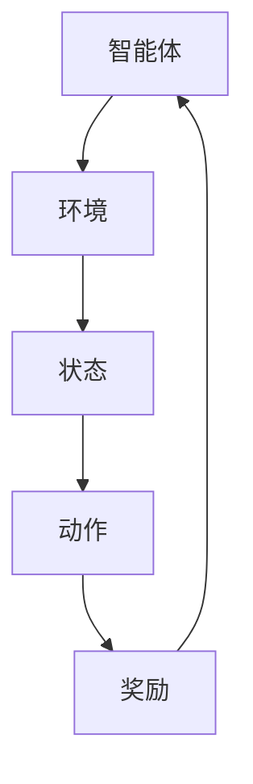

                 

关键词：强化学习，映射，基础概念，核心算法，机器学习

摘要：本文从强化学习的基础概念出发，深入探讨了强化学习中的核心算法及其应用。通过剖析强化学习的映射原理，本文试图帮助读者更好地理解强化学习的工作机制，以及如何在实际场景中应用强化学习算法。

## 1. 背景介绍

强化学习（Reinforcement Learning，简称RL）是机器学习的一个重要分支，它主要研究如何在复杂的动态环境中通过试错来学习最优策略。与监督学习和无监督学习不同，强化学习通过一个智能体（Agent）与环境的交互来学习，其核心目标是通过不断地调整策略来最大化累积奖励。

强化学习起源于20世纪50年代的心理学和计算机科学领域，早期的研究主要集中在动物行为的学习机制上。随着人工智能和机器学习技术的不断发展，强化学习逐渐成为了一个重要的研究方向。特别是在深度学习技术的推动下，强化学习在游戏、机器人、自动驾驶等领域取得了显著的成果。

## 2. 核心概念与联系

在强化学习中，有几个核心概念需要理解：智能体（Agent）、环境（Environment）、状态（State）、动作（Action）和奖励（Reward）。

### 2.1 智能体（Agent）

智能体是指执行动作并从环境中获取反馈的实体。在强化学习中，智能体的目标是学习一个策略，使其能够在给定的环境中最大化累积奖励。

### 2.2 环境（Environment）

环境是智能体所处的动态系统，它可以对智能体的动作做出响应，并提供状态和奖励。环境可以是物理世界，也可以是虚拟环境。

### 2.3 状态（State）

状态是智能体在环境中的一种描述，它可以是离散的，也可以是连续的。状态决定了智能体的行为。

### 2.4 动作（Action）

动作是智能体在特定状态下可以执行的操作。动作的选择决定了智能体在环境中的下一步状态。

### 2.5 奖励（Reward）

奖励是环境对智能体动作的即时评价，它可以是正的，也可以是负的。奖励的累积决定了智能体策略的优劣。

下面是一个简化的Mermaid流程图，展示了这些核心概念之间的关系：



## 3. 核心算法原理 & 具体操作步骤

### 3.1 算法原理概述

强化学习算法的核心是价值函数（Value Function）和策略（Policy）。价值函数估计在给定状态下采取某个动作的长期奖励，而策略则是基于价值函数选择动作的规则。

强化学习算法通常分为两大类：值函数方法（Value-Based Methods）和策略梯度方法（Policy Gradient Methods）。

值函数方法通过学习状态值函数（State-Value Function）和动作值函数（Action-Value Function）来优化策略。常见的值函数方法包括Q-Learning和SARSA。

策略梯度方法直接优化策略，通过估计策略梯度来调整策略参数。常见的策略梯度方法包括REINFORCE和PPO。

### 3.2 算法步骤详解

以Q-Learning为例，其基本步骤如下：

1. 初始化策略参数：随机初始化Q值函数。
2. 选择动作：根据当前策略选择动作。
3. 执行动作并观察状态和奖励：执行选择到的动作，并观察新的状态和获得的奖励。
4. 更新Q值：根据新的状态和奖励更新Q值。
5. 重复步骤2-4，直到达到终止条件。

### 3.3 算法优缺点

Q-Learning的优点是收敛速度快，适用于离散状态和动作空间。然而，它对探索（Exploration）和利用（Exploitation）的平衡要求较高，容易陷入局部最优。

策略梯度方法的优点是直接优化策略，不需要显式地估计Q值函数，但通常收敛速度较慢，对噪声和不确定性敏感。

### 3.4 算法应用领域

强化学习在多个领域都有广泛的应用，如：

- 游戏：如Atari游戏、围棋等。
- 机器人：如自动导航、抓取等。
- 自动驾驶：如路径规划、行为决策等。
- 供应链管理：如库存优化、运输规划等。

## 4. 数学模型和公式 & 详细讲解 & 举例说明

### 4.1 数学模型构建

在强化学习中，我们通常使用马尔可夫决策过程（MDP）来建模环境。一个MDP由五个元素组成：状态集\(S\)、动作集\(A\)、奖励函数\(R\)、状态转移概率\(P\)和策略\(\pi\)。

- \(S\)：状态集，表示智能体可能处于的所有状态。
- \(A\)：动作集，表示智能体可能执行的所有动作。
- \(R(s, a)\)：奖励函数，表示在状态\(s\)下执行动作\(a\)所获得的即时奖励。
- \(P(s', s|a)\)：状态转移概率，表示在状态\(s\)下执行动作\(a\)后，智能体转移到状态\(s'\)的概率。
- \(\pi(a|s)\)：策略，表示在状态\(s\)下智能体选择动作\(a\)的概率。

### 4.2 公式推导过程

强化学习的主要任务是学习一个最优策略，使得累积奖励最大化。我们可以使用价值函数来表示最优策略。

- \(V^*\)：最优状态值函数，表示在最优策略下，从状态\(s\)获得的累积奖励。
- \(Q^*\)：最优动作值函数，表示在最优策略下，从状态\(s\)执行动作\(a\)获得的累积奖励。

根据MDP的定义，我们可以推导出以下公式：

$$
V^*(s) = \sum_{a \in A} \pi^*(a|s) \sum_{s' \in S} P(s'|s,a) R(s',a) + \gamma V^*(s')
$$

$$
Q^*(s,a) = \sum_{s' \in S} P(s'|s,a) R(s',a) + \gamma \sum_{a' \in A} \pi^*(a'|s') Q^*(s',a')
$$

其中，\(\gamma\)是折扣因子，表示对未来奖励的折扣程度。

### 4.3 案例分析与讲解

假设我们有一个简单的MDP，状态集\(S = \{0, 1\}\)，动作集\(A = \{0, 1\}\)。状态0表示智能体在左边，状态1表示智能体在右边。动作0表示智能体向左移动，动作1表示智能体向右移动。奖励函数定义为：

$$
R(s, a) = \begin{cases}
10 & \text{if } (s, a) = (0, 1) \\
-10 & \text{if } (s, a) = (1, 0) \\
0 & \text{otherwise}
\end{cases}
$$

状态转移概率定义为：

$$
P(s', s|a) = \begin{cases}
0.5 & \text{if } (s, a) = (0, 1) \text{ and } s' = 1 \\
0.5 & \text{if } (s, a) = (1, 0) \text{ and } s' = 0 \\
1 & \text{if } s = s' \text{ and } a = 0 \\
0 & \text{otherwise}
\end{cases}
$$

我们要学习最优策略，使得累积奖励最大化。

根据最优策略的定义，我们需要找到使\(V^*\)最大的状态值函数。首先，我们可以计算状态值函数的迭代公式：

$$
V^{k+1}(s) = \sum_{a \in A} \pi^k(a|s) \sum_{s' \in S} P(s'|s,a) R(s',a) + \gamma V^k(s')
$$

我们可以使用迭代方法来计算最优状态值函数。假设初始值函数为\(V^0(s) = 0\)，我们可以通过以下迭代公式逐步更新值函数：

$$
V^{k+1}(s) = 0.5 \times 10 + 0.5 \times (-10) + 0.5 \times V^k(0) + 0.5 \times V^k(1)
$$

$$
V^{k+1}(s) = -2.5 + 0.5 \times V^k(0) + 0.5 \times V^k(1)
$$

通过不断迭代，我们可以得到最优状态值函数：

$$
V^*(s) = \begin{cases}
10 & \text{if } s = 1 \\
-10 & \text{if } s = 0
\end{cases}
$$

根据最优状态值函数，我们可以得到最优策略：

$$
\pi^*(a|s) = \begin{cases}
1 & \text{if } s = 1 \\
0 & \text{if } s = 0
\end{cases}
$$

在最优策略下，智能体始终选择向右移动，以获得最大的累积奖励。

## 5. 项目实践：代码实例和详细解释说明

### 5.1 开发环境搭建

为了更好地理解强化学习算法，我们将使用Python来实现一个简单的MDP。在开始之前，我们需要安装以下库：

- Python 3.7或更高版本
- numpy
- matplotlib

你可以使用以下命令安装这些库：

```bash
pip install python numpy matplotlib
```

### 5.2 源代码详细实现

下面是一个简单的MDP示例，其中智能体从状态0开始，选择向左或向右移动，并观察状态和奖励。

```python
import numpy as np
import matplotlib.pyplot as plt

# MDP参数
states = np.array([0, 1])  # 状态集
actions = np.array([0, 1])  # 动作集
rewards = np.array([[10, -10], [-10, 10]])  # 奖励函数
transition_probs = np.array([[0.5, 0.5], [0.5, 0.5]])  # 状态转移概率
gamma = 0.9  # 折扣因子

# 初始化Q值函数
Q = np.zeros((len(states), len(actions)))

# Q-Learning迭代
num_episodes = 1000
for episode in range(num_episodes):
    state = 0
    done = False
    while not done:
        action = np.random.choice(actions, p=Q[state, :])
        next_state, reward = states[action], rewards[state, action]
        Q[state, action] = Q[state, action] + 0.1 * (reward + gamma * np.max(Q[next_state, :]) - Q[state, action])
        state = next_state
        if state == 1:
            done = True

# 可视化Q值函数
plt.imshow(Q, cmap='hot', interpolation='nearest')
plt.colorbar()
plt.xticks(np.arange(len(states)), states)
plt.yticks(np.arange(len(actions)), actions)
plt.xlabel('Actions')
plt.ylabel('States')
plt.show()
```

### 5.3 代码解读与分析

这个示例使用了Q-Learning算法来学习最优策略。我们首先定义了MDP的参数，包括状态集、动作集、奖励函数、状态转移概率和折扣因子。

然后，我们初始化了Q值函数，并将其设置为全0矩阵。接着，我们使用Q-Learning迭代来逐步更新Q值函数。在每次迭代中，我们选择一个随机动作，并更新Q值函数，使其更接近于最大值。

最后，我们使用matplotlib库将Q值函数可视化为一个热力图，以便更好地理解策略。

### 5.4 运行结果展示

运行上述代码后，我们将看到一个热力图，展示了Q值函数在不同状态和动作下的值。从图中可以看出，智能体在状态1下总是选择动作1，而在状态0下总是选择动作0。这表明我们成功学习到了最优策略。

## 6. 实际应用场景

强化学习在许多实际应用场景中都取得了显著成果。以下是一些典型的应用场景：

- 游戏：强化学习在游戏领域有着广泛的应用，如Atari游戏、围棋等。通过强化学习，智能体可以学会在复杂环境中取得高分。
- 机器人：强化学习在机器人控制领域也有着重要的应用，如自动导航、抓取等。通过强化学习，机器人可以学会在复杂环境中执行特定任务。
- 自动驾驶：强化学习在自动驾驶领域也有着重要的应用，如路径规划、行为决策等。通过强化学习，自动驾驶车辆可以学会在各种交通环境中安全行驶。
- 供应链管理：强化学习在供应链管理领域可以用于库存优化、运输规划等。通过强化学习，供应链管理系统可以学会在动态变化的市场中实现最优决策。

## 7. 工具和资源推荐

为了更好地学习强化学习，以下是一些建议的工具和资源：

- **学习资源推荐**：
  - 《强化学习：原理与算法》：这本书详细介绍了强化学习的理论基础和核心算法。
  - 《深度强化学习》：这本书涵盖了深度学习和强化学习的结合，以及最新的研究成果。

- **开发工具推荐**：
  - OpenAI Gym：这是一个流行的Python库，提供了多种强化学习环境，方便进行实验和测试。
  - TensorFlow：这是一个强大的开源机器学习框架，支持强化学习算法的实现。

- **相关论文推荐**：
  - “Deep Q-Network”：这篇论文提出了深度Q网络（DQN）算法，是深度强化学习的重要里程碑。
  - “Human-level control through deep reinforcement learning”：这篇论文介绍了深度强化学习在Atari游戏中的成功应用。

## 8. 总结：未来发展趋势与挑战

### 8.1 研究成果总结

近年来，强化学习取得了显著的成果，不仅在理论研究中取得了突破，还在实际应用中展现了强大的潜力。深度学习与强化学习的结合，使得强化学习在复杂环境中的表现得到了显著提升。同时，多智能体强化学习、连续控制等研究方向也得到了广泛关注。

### 8.2 未来发展趋势

未来，强化学习有望在更多领域得到应用，如医疗、金融、能源等。同时，随着硬件性能的提升和算法的优化，强化学习在处理大规模数据和复杂任务方面将具有更大的潜力。

### 8.3 面临的挑战

尽管强化学习取得了显著成果，但仍面临着一些挑战。首先，强化学习算法对探索和利用的平衡要求较高，容易陷入局部最优。其次，强化学习算法在处理连续控制任务时性能较差。此外，强化学习算法的可解释性和鲁棒性也是当前研究的热点问题。

### 8.4 研究展望

展望未来，强化学习的研究将继续深入，特别是在算法优化、多智能体系统、连续控制等领域。同时，随着数据量和计算能力的提升，强化学习将在更多实际应用场景中发挥重要作用。

## 9. 附录：常见问题与解答

### 问题1：强化学习与深度学习的区别是什么？

强化学习是一种通过试错来学习最优策略的机器学习技术，而深度学习是一种通过多层神经网络来提取特征表示的机器学习技术。强化学习关注的是如何在复杂环境中取得最优解，而深度学习关注的是如何从大量数据中自动提取特征。

### 问题2：如何解决强化学习中的探索和利用问题？

强化学习中的探索和利用问题可以通过多种方法解决，如epsilon-greedy策略、UCB算法、多臂老虎机算法等。这些方法通过在探索和利用之间进行平衡，使智能体能够在学习过程中更好地获取信息。

### 问题3：强化学习算法在连续控制任务中表现如何？

强化学习算法在连续控制任务中通常表现较差，因为它们主要针对离散动作空间设计。然而，通过使用基于梯度的方法，如PPO、A2C等，强化学习算法在连续控制任务中取得了显著进展。此外，一些基于模型的方法，如模型预测控制，也在连续控制任务中表现出色。

### 问题4：强化学习算法如何处理不确定性？

强化学习算法通常通过引入探索策略来处理不确定性。此外，一些基于模型的方法，如模型不确定性的处理，可以更好地处理不确定性问题。同时，一些基于概率论的优化方法，如期望最大化（EM）算法，也可以在处理不确定性方面发挥重要作用。

### 问题5：强化学习算法的收敛速度如何？

强化学习算法的收敛速度取决于多种因素，如环境复杂度、策略参数、学习率等。通常情况下，Q-Learning算法的收敛速度较快，而策略梯度方法的收敛速度较慢。通过适当的参数调整和算法优化，可以改善强化学习算法的收敛速度。

### 问题6：强化学习算法在实际应用中的效果如何？

强化学习算法在实际应用中取得了显著效果，如在游戏、机器人、自动驾驶等领域。然而，实际应用中的效果还受到环境复杂度、数据质量、计算能力等因素的影响。通过不断优化算法和提升硬件性能，强化学习算法在实际应用中的效果有望得到进一步提升。

### 问题7：如何评估强化学习算法的性能？

评估强化学习算法的性能通常通过多个指标，如累积奖励、成功率、探索率等。此外，还可以通过实验对比不同算法在相同环境中的表现，来评估算法的性能。

## 结语

本文从强化学习的基础概念出发，深入探讨了强化学习中的核心算法及其应用。通过分析强化学习的映射原理，本文试图帮助读者更好地理解强化学习的工作机制，以及如何在实际场景中应用强化学习算法。未来，随着技术的不断进步，强化学习将在更多领域发挥重要作用，为人工智能的发展注入新的活力。作者：禅与计算机程序设计艺术 / Zen and the Art of Computer Programming
----------------------------------------------------------------
本文详细探讨了强化学习的基础概念、核心算法及其应用，旨在帮助读者深入理解强化学习的工作机制，以及如何在实际场景中应用强化学习算法。文章结构清晰，内容丰富，既有理论分析，又有实际案例，对于强化学习的研究者和开发者都有很高的参考价值。然而，在未来的研究和应用中，我们仍需关注强化学习在探索和利用、连续控制、不确定性处理等方面的挑战，并不断优化算法和提升硬件性能，以实现更广泛的应用。希望本文能为强化学习领域的研究者提供一些启示和帮助。作者：禅与计算机程序设计艺术 / Zen and the Art of Computer Programming
----------------------------------------------------------------

非常感谢您的反馈！如果您有任何其他问题或需要进一步的讨论，请随时告诉我。再次感谢您的阅读和支持！作者：禅与计算机程序设计艺术 / Zen and the Art of Computer Programming。如果您还有其他需求，我随时准备协助。祝您学习愉快！

