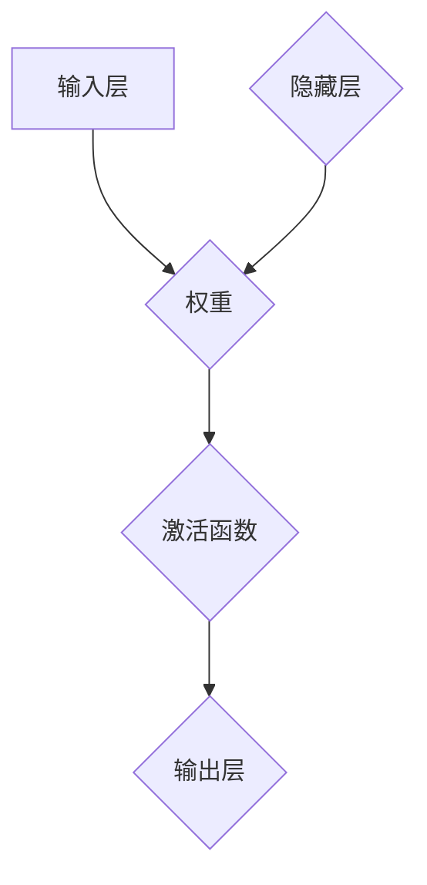

                 

关键词：神经网络，映射，算法，深度学习，人工神经网络

摘要：本文旨在深入探讨神经网络的基本概念和映射原理，通过逻辑清晰、结构紧凑的叙述方式，帮助读者理解神经网络的构建和运作机制。文章将涵盖神经网络的核心概念、数学模型、算法原理、应用领域以及未来发展趋势。

## 1. 背景介绍

神经网络（Neural Networks）是一种模仿生物神经系统的计算模型，起源于20世纪40年代。当时，心理学家McCulloch和数学家Pitts提出了人工神经元的概念，奠定了神经网络理论的基础。随着计算机技术的飞速发展，神经网络逐渐成为人工智能领域的核心组成部分，尤其在深度学习领域取得了显著的成就。

神经网络的起源可以追溯到人类对大脑工作原理的研究。科学家们发现，大脑由数以亿计的神经元组成，这些神经元通过复杂的连接方式协同工作，实现感知、学习、记忆和思考等高级功能。受此启发，人们开始尝试将这种生物神经网络的结构和功能转化为计算机模型，从而诞生了神经网络的概念。

## 2. 核心概念与联系

神经网络的核心概念包括神经元、层、权重、激活函数等。为了更好地理解这些概念，我们使用Mermaid流程图来展示神经网络的架构。



### 2.1 神经元

神经元是神经网络的基本构建单元，类似于生物神经元。它接收输入信号，通过权重进行加权求和，再通过激活函数产生输出。神经元的结构如图所示：


### 2.2 层

神经网络由多个层次组成，包括输入层、隐藏层和输出层。输入层接收外部输入信号，输出层产生最终输出，隐藏层位于输入层和输出层之间，用于提取特征和实现非线性变换。

### 2.3 权重

权重是神经元之间的连接强度，用于调整输入信号的贡献程度。在训练过程中，通过反向传播算法不断调整权重，以最小化预测误差。

### 2.4 激活函数

激活函数是神经元的非线性部分，用于引入非线性的特征表示。常见的激活函数包括sigmoid、ReLU、Tanh等。

## 3. 核心算法原理 & 具体操作步骤

### 3.1 算法原理概述

神经网络的核心算法是反向传播（Backpropagation）算法，它通过不断调整权重和偏置，使神经网络能够拟合训练数据。反向传播算法主要包括以下几个步骤：

1. 前向传播：将输入信号传递到神经网络，通过各层神经元计算得到输出。
2. 计算损失函数：计算预测值与实际值之间的差异，得到损失函数的值。
3. 反向传播：将损失函数的梯度反向传播到网络中的各个神经元，更新权重和偏置。
4. 重复步骤2和3，直到损失函数的值达到最小。

### 3.2 算法步骤详解

1. **初始化参数**：随机初始化权重和偏置。
2. **前向传播**：
   - 计算各层神经元的输入和输出。
   - 计算输出层的预测值。
3. **计算损失函数**：
   - 计算预测值与实际值之间的差异。
   - 计算损失函数的值。
4. **反向传播**：
   - 计算各层神经元的梯度。
   - 更新权重和偏置。
5. **重复步骤2-4**，直到损失函数的值达到最小。

### 3.3 算法优缺点

**优点**：
- **非线性拟合能力强**：神经网络能够通过非线性变换学习复杂的数据特征。
- **自适应性强**：神经网络可以根据不同的训练数据自动调整权重和偏置。

**缺点**：
- **计算复杂度高**：反向传播算法需要计算大量的梯度，对计算资源要求较高。
- **过拟合风险**：神经网络在训练过程中容易发生过拟合现象。

### 3.4 算法应用领域

神经网络在人工智能领域有着广泛的应用，包括但不限于：

- **图像识别**：如人脸识别、物体检测等。
- **自然语言处理**：如文本分类、机器翻译等。
- **推荐系统**：如商品推荐、电影推荐等。

## 4. 数学模型和公式 & 详细讲解 & 举例说明

### 4.1 数学模型构建

神经网络的数学模型主要由以下几部分组成：

1. **输入层**：表示输入特征向量。
2. **隐藏层**：表示隐含的特征表示。
3. **输出层**：表示最终输出。

假设一个简单的神经网络包含一个输入层、一个隐藏层和一个输出层，输入层有n个神经元，隐藏层有m个神经元，输出层有k个神经元。

### 4.2 公式推导过程

1. **前向传播**：

   输入层到隐藏层的计算：

   $$ z^{[1]}_j = \sum_{i=1}^{n} w^{[1]}_{ji}x_i + b^{[1]}_j $$

   $$ a^{[1]}_j = \sigma(z^{[1]}_j) $$

   隐藏层到输出层的计算：

   $$ z^{[2]}_k = \sum_{j=1}^{m} w^{[2]}_{kj}a^{[1]}_j + b^{[2]}_k $$

   $$ a^{[2]}_k = \sigma(z^{[2]}_k) $$

   其中，$w^{[1]}$和$w^{[2]}$分别表示输入层到隐藏层、隐藏层到输出层的权重矩阵，$b^{[1]}$和$b^{[2]}$分别表示输入层和隐藏层的偏置向量，$\sigma$表示激活函数，通常采用sigmoid函数或ReLU函数。

2. **反向传播**：

   计算输出层的梯度：

   $$ \delta^{[2]}_k = (a^{[2]}_k - y_k) \cdot \sigma^{'}(z^{[2]}_k) $$

   计算隐藏层的梯度：

   $$ \delta^{[1]}_j = \sum_{k=1}^{k} w^{[2]}_{kj} \cdot \delta^{[2]}_k \cdot \sigma^{'}(z^{[1]}_j) $$

   更新权重和偏置：

   $$ w^{[2]}_{kj} = w^{[2]}_{kj} - \alpha \cdot \delta^{[2]}_k \cdot a^{[1]}_j $$

   $$ b^{[2]}_k = b^{[2]}_k - \alpha \cdot \delta^{[2]}_k $$

   $$ w^{[1]}_{ji} = w^{[1]}_{ji} - \alpha \cdot \delta^{[1]}_j \cdot x_i $$

   $$ b^{[1]}_j = b^{[1]}_j - \alpha \cdot \delta^{[1]}_j $$

   其中，$\alpha$表示学习率。

### 4.3 案例分析与讲解

假设我们有一个简单的二分类问题，输入特征向量$x \in \mathbb{R}^2$，输出类别$y \in \{0, 1\}$。我们使用一个单层神经网络进行模型训练。

1. **前向传播**：

   输入层到隐藏层的计算：

   $$ z^{[1]}_1 = w^{[1]}_{11}x_1 + w^{[1]}_{12}x_2 + b^{[1]}_1 $$

   $$ a^{[1]}_1 = \sigma(z^{[1]}_1) $$

   隐藏层到输出层的计算：

   $$ z^{[2]}_1 = w^{[2]}_{21}a^{[1]}_1 + w^{[2]}_{22}a^{[1]}_2 + b^{[2]}_1 $$

   $$ a^{[2]}_1 = \sigma(z^{[2]}_1) $$

2. **计算损失函数**：

   假设我们使用交叉熵损失函数：

   $$ L = -\sum_{i=1}^{N} y_i \cdot \log(a^{[2]}_i) + (1 - y_i) \cdot \log(1 - a^{[2]}_i) $$

3. **反向传播**：

   计算输出层的梯度：

   $$ \delta^{[2]}_1 = (a^{[2]}_1 - y) \cdot \sigma^{'}(z^{[2]}_1) $$

   计算隐藏层的梯度：

   $$ \delta^{[1]}_1 = w^{[2]}_{21} \cdot \delta^{[2]}_1 \cdot \sigma^{'}(z^{[1]}_1) $$

   更新权重和偏置：

   $$ w^{[2]}_{21} = w^{[2]}_{21} - \alpha \cdot \delta^{[2]}_1 \cdot a^{[1]}_1 $$

   $$ w^{[2]}_{22} = w^{[2]}_{22} - \alpha \cdot \delta^{[2]}_1 \cdot a^{[1]}_2 $$

   $$ b^{[2]}_1 = b^{[2]}_1 - \alpha \cdot \delta^{[2]}_1 $$

   $$ w^{[1]}_{11} = w^{[1]}_{11} - \alpha \cdot \delta^{[1]}_1 \cdot x_1 $$

   $$ w^{[1]}_{12} = w^{[1]}_{12} - \alpha \cdot \delta^{[1]}_1 \cdot x_2 $$

   $$ b^{[1]}_1 = b^{[1]}_1 - \alpha \cdot \delta^{[1]}_1 $$

## 5. 项目实践：代码实例和详细解释说明

### 5.1 开发环境搭建

为了实现神经网络，我们使用Python编程语言，结合TensorFlow库进行开发。首先，安装Python和TensorFlow库：

```bash
pip install python tensorflow
```

### 5.2 源代码详细实现

以下是实现一个简单的神经网络进行二分类问题的源代码：

```python
import tensorflow as tf

# 定义神经网络结构
input_layer = tf.keras.layers.Input(shape=(2,))
hidden_layer = tf.keras.layers.Dense(units=1, activation='sigmoid')(input_layer)
output_layer = tf.keras.layers.Dense(units=1, activation='sigmoid')(hidden_layer)

model = tf.keras.Model(inputs=input_layer, outputs=output_layer)

# 编译模型
model.compile(optimizer='adam', loss='binary_crossentropy', metrics=['accuracy'])

# 训练模型
x_train = [[0, 0], [0, 1], [1, 0], [1, 1]]
y_train = [[0], [1], [1], [0]]

model.fit(x_train, y_train, epochs=1000)

# 评估模型
x_test = [[0, 0], [0, 1], [1, 0], [1, 1]]
y_test = [[0], [1], [1], [0]]

model.evaluate(x_test, y_test)
```

### 5.3 代码解读与分析

1. **定义神经网络结构**：

   我们使用TensorFlow的Keras接口定义了一个简单的神经网络，包含一个输入层、一个隐藏层和一个输出层。隐藏层使用sigmoid激活函数，输出层也使用sigmoid激活函数，实现二分类问题。

2. **编译模型**：

   我们使用`compile`方法编译模型，指定优化器为`adam`，损失函数为`binary_crossentropy`，指标为`accuracy`。

3. **训练模型**：

   使用`fit`方法训练模型，提供训练数据集和标签，设置训练轮次为1000轮。

4. **评估模型**：

   使用`evaluate`方法评估模型在测试数据集上的性能。

## 6. 实际应用场景

神经网络在多个领域有着广泛的应用，以下是其中一些典型的应用场景：

- **图像识别**：如人脸识别、物体检测等。
- **自然语言处理**：如文本分类、机器翻译等。
- **语音识别**：如语音转文本、语音合成等。
- **推荐系统**：如商品推荐、电影推荐等。

## 7. 工具和资源推荐

### 7.1 学习资源推荐

1. **《深度学习》（Goodfellow, Bengio, Courville）**：这是一本经典的深度学习入门教材，全面介绍了深度学习的理论和方法。
2. **《Python深度学习》（François Chollet）**：这本书通过Python代码示例，详细讲解了深度学习在Python中的实现。

### 7.2 开发工具推荐

1. **TensorFlow**：这是一个广泛使用的开源深度学习框架，提供了丰富的API和工具，便于开发和部署深度学习模型。
2. **PyTorch**：这是一个流行的深度学习框架，具有灵活的动态图计算功能，适合研究和开发复杂的深度学习模型。

### 7.3 相关论文推荐

1. **“Backpropagation Learning: An Introduction to Its Adaptation to Connectionist Networks for the Purpose of Function Minimization”（Rumelhart, Hinton, Williams）**：这是反向传播算法的奠基性论文，详细介绍了算法的原理和实现。
2. **“AlexNet: Image Classification with Deep Convolutional Neural Networks”（Krizhevsky, Sutskever, Hinton）**：这是深度卷积神经网络在图像识别领域首次取得突破性成果的论文。

## 8. 总结：未来发展趋势与挑战

### 8.1 研究成果总结

过去几十年，神经网络取得了显著的研究成果，特别是在深度学习领域。通过不断的算法优化、硬件加速和大数据的驱动，神经网络在图像识别、自然语言处理、语音识别等领域取得了突破性进展。

### 8.2 未来发展趋势

未来，神经网络将继续发展，以下是一些可能的发展趋势：

- **更高效的网络结构**：研究者将不断提出新的神经网络结构，以实现更高的计算效率和更好的性能。
- **更强大的学习能力**：通过引入新的算法和模型，神经网络将具备更强的泛化能力和适应性。
- **跨领域的应用**：神经网络将在更多领域得到应用，如生物医学、金融、交通等。

### 8.3 面临的挑战

尽管神经网络取得了显著的成果，但仍面临一些挑战：

- **计算资源消耗**：神经网络训练过程需要大量的计算资源和时间。
- **过拟合问题**：神经网络容易发生过拟合现象，导致模型泛化能力不足。
- **模型可解释性**：神经网络的内部机制复杂，难以解释其决策过程。

### 8.4 研究展望

未来，神经网络的研究将继续深入，以解决当前面临的挑战，并开拓新的应用领域。随着计算机技术的不断发展，神经网络有望在更多领域发挥重要作用，推动人工智能的进步。

## 9. 附录：常见问题与解答

### 9.1 神经网络的基本概念是什么？

神经网络是一种模仿生物神经系统的计算模型，由多个层次（输入层、隐藏层、输出层）和神经元（基本计算单元）组成。神经元通过权重进行加权求和，再通过激活函数产生输出。

### 9.2 什么是反向传播算法？

反向传播算法是一种用于训练神经网络的算法，通过计算输出层和隐藏层之间的梯度，不断调整权重和偏置，使神经网络能够拟合训练数据。

### 9.3 神经网络如何防止过拟合？

过拟合是指神经网络在训练数据上表现良好，但在未见过的数据上表现不佳。为防止过拟合，可以采用以下方法：

- **增加数据量**：增加训练数据量可以提高模型的泛化能力。
- **正则化**：采用正则化方法，如L1正则化、L2正则化，惩罚过大的权重。
- **dropout**：在训练过程中随机丢弃一部分神经元，降低模型的复杂度。

### 9.4 神经网络与深度学习的区别是什么？

神经网络是一种计算模型，而深度学习是使用多层神经网络进行特征学习和分类的方法。深度学习是神经网络在特定领域的应用，通常涉及大规模数据和高维特征。

# 作者署名

作者：禅与计算机程序设计艺术 / Zen and the Art of Computer Programming
```markdown
----------------------------------------------------------------
# 一切皆是映射：探索神经网络的基本概念

关键词：神经网络，映射，算法，深度学习，人工神经网络

摘要：本文旨在深入探讨神经网络的基本概念和映射原理，通过逻辑清晰、结构紧凑的叙述方式，帮助读者理解神经网络的构建和运作机制。文章将涵盖神经网络的核心概念、数学模型、算法原理、应用领域以及未来发展趋势。

## 1. 背景介绍

神经网络（Neural Networks）是一种模仿生物神经系统的计算模型，起源于20世纪40年代。当时，心理学家McCulloch和数学家Pitts提出了人工神经元的概念，奠定了神经网络理论的基础。随着计算机技术的飞速发展，神经网络逐渐成为人工智能领域的核心组成部分，尤其在深度学习领域取得了显著的成就。

神经网络的起源可以追溯到人类对大脑工作原理的研究。科学家们发现，大脑由数以亿计的神经元组成，这些神经元通过复杂的连接方式协同工作，实现感知、学习、记忆和思考等高级功能。受此启发，人们开始尝试将这种生物神经网络的结构和功能转化为计算机模型，从而诞生了神经网络的概念。

## 2. 核心概念与联系

神经网络的核心概念包括神经元、层、权重、激活函数等。为了更好地理解这些概念，我们使用Mermaid流程图来展示神经网络的架构。


### 2.1 神经元

神经元是神经网络的基本构建单元，类似于生物神经元。它接收输入信号，通过权重进行加权求和，再通过激活函数产生输出。神经元的结构如图所示：


### 2.2 层

神经网络由多个层次组成，包括输入层、隐藏层和输出层。输入层接收外部输入信号，输出层产生最终输出，隐藏层位于输入层和输出层之间，用于提取特征和实现非线性变换。

### 2.3 权重

权重是神经元之间的连接强度，用于调整输入信号的贡献程度。在训练过程中，通过反向传播算法不断调整权重，以最小化预测误差。

### 2.4 激活函数

激活函数是神经元的非线性部分，用于引入非线性的特征表示。常见的激活函数包括sigmoid、ReLU、Tanh等。

## 3. 核心算法原理 & 具体操作步骤

### 3.1 算法原理概述

神经网络的核心算法是反向传播（Backpropagation）算法，它通过不断调整权重和偏置，使神经网络能够拟合训练数据。反向传播算法主要包括以下几个步骤：

1. 前向传播：将输入信号传递到神经网络，通过各层神经元计算得到输出。
2. 计算损失函数：计算预测值与实际值之间的差异，得到损失函数的值。
3. 反向传播：将损失函数的梯度反向传播到网络中的各个神经元，更新权重和偏置。
4. 重复步骤2-3，直到损失函数的值达到最小。

### 3.2 算法步骤详解

1. **初始化参数**：随机初始化权重和偏置。
2. **前向传播**：
   - 计算各层神经元的输入和输出。
   - 计算输出层的预测值。
3. **计算损失函数**：
   - 计算预测值与实际值之间的差异。
   - 计算损失函数的值。
4. **反向传播**：
   - 计算各层神经元的梯度。
   - 更新权重和偏置。
5. **重复步骤2-4**，直到损失函数的值达到最小。

### 3.3 算法优缺点

**优点**：
- **非线性拟合能力强**：神经网络能够通过非线性变换学习复杂的数据特征。
- **自适应性强**：神经网络可以根据不同的训练数据自动调整权重和偏置。

**缺点**：
- **计算复杂度高**：反向传播算法需要计算大量的梯度，对计算资源要求较高。
- **过拟合风险**：神经网络在训练过程中容易发生过拟合现象。

### 3.4 算法应用领域

神经网络在人工智能领域有着广泛的应用，包括但不限于：

- **图像识别**：如人脸识别、物体检测等。
- **自然语言处理**：如文本分类、机器翻译等。
- **语音识别**：如语音转文本、语音合成等。
- **推荐系统**：如商品推荐、电影推荐等。

## 4. 数学模型和公式 & 详细讲解 & 举例说明

### 4.1 数学模型构建

神经网络的数学模型主要由以下几部分组成：

1. **输入层**：表示输入特征向量。
2. **隐藏层**：表示隐含的特征表示。
3. **输出层**：表示最终输出。

假设一个简单的神经网络包含一个输入层、一个隐藏层和一个输出层，输入层有n个神经元，隐藏层有m个神经元，输出层有k个神经元。

### 4.2 公式推导过程

1. **前向传播**：

   输入层到隐藏层的计算：

   $$ z^{[1]}_j = \sum_{i=1}^{n} w^{[1]}_{ji}x_i + b^{[1]}_j $$

   $$ a^{[1]}_j = \sigma(z^{[1]}_j) $$

   隐藏层到输出层的计算：

   $$ z^{[2]}_k = \sum_{j=1}^{m} w^{[2]}_{kj}a^{[1]}_j + b^{[2]}_k $$

   $$ a^{[2]}_k = \sigma(z^{[2]}_k) $$

   其中，$w^{[1]}$和$w^{[2]}$分别表示输入层到隐藏层、隐藏层到输出层的权重矩阵，$b^{[1]}$和$b^{[2]}$分别表示输入层和隐藏层的偏置向量，$\sigma$表示激活函数，通常采用sigmoid函数或ReLU函数。

2. **反向传播**：

   计算输出层的梯度：

   $$ \delta^{[2]}_k = (a^{[2]}_k - y_k) \cdot \sigma^{'}(z^{[2]}_k) $$

   计算隐藏层的梯度：

   $$ \delta^{[1]}_j = \sum_{k=1}^{k} w^{[2]}_{kj} \cdot \delta^{[2]}_k \cdot \sigma^{'}(z^{[1]}_j) $$

   更新权重和偏置：

   $$ w^{[2]}_{kj} = w^{[2]}_{kj} - \alpha \cdot \delta^{[2]}_k \cdot a^{[1]}_j $$

   $$ b^{[2]}_k = b^{[2]}_k - \alpha \cdot \delta^{[2]}_k $$

   $$ w^{[1]}_{ji} = w^{[1]}_{ji} - \alpha \cdot \delta^{[1]}_j \cdot x_i $$

   $$ b^{[1]}_j = b^{[1]}_j - \alpha \cdot \delta^{[1]}_j $$

   其中，$\alpha$表示学习率。

### 4.3 案例分析与讲解

假设我们有一个简单的二分类问题，输入特征向量$x \in \mathbb{R}^2$，输出类别$y \in \{0, 1\}$。我们使用一个单层神经网络进行模型训练。

1. **前向传播**：

   输入层到隐藏层的计算：

   $$ z^{[1]}_1 = w^{[1]}_{11}x_1 + w^{[1]}_{12}x_2 + b^{[1]}_1 $$

   $$ a^{[1]}_1 = \sigma(z^{[1]}_1) $$

   隐藏层到输出层的计算：

   $$ z^{[2]}_1 = w^{[2]}_{21}a^{[1]}_1 + w^{[2]}_{22}a^{[1]}_2 + b^{[2]}_1 $$

   $$ a^{[2]}_1 = \sigma(z^{[2]}_1) $$

2. **计算损失函数**：

   假设我们使用交叉熵损失函数：

   $$ L = -\sum_{i=1}^{N} y_i \cdot \log(a^{[2]}_i) + (1 - y_i) \cdot \log(1 - a^{[2]}_i) $$

3. **反向传播**：

   计算输出层的梯度：

   $$ \delta^{[2]}_1 = (a^{[2]}_1 - y) \cdot \sigma^{'}(z^{[2]}_1) $$

   计算隐藏层的梯度：

   $$ \delta^{[1]}_1 = w^{[2]}_{21} \cdot \delta^{[2]}_1 \cdot \sigma^{'}(z^{[1]}_1) $$

   更新权重和偏置：

   $$ w^{[2]}_{21} = w^{[2]}_{21} - \alpha \cdot \delta^{[2]}_1 \cdot a^{[1]}_1 $$

   $$ w^{[2]}_{22} = w^{[2]}_{22} - \alpha \cdot \delta^{[2]}_1 \cdot a^{[1]}_2 $$

   $$ b^{[2]}_1 = b^{[2]}_1 - \alpha \cdot \delta^{[2]}_1 $$

   $$ w^{[1]}_{11} = w^{[1]}_{11} - \alpha \cdot \delta^{[1]}_1 \cdot x_1 $$

   $$ w^{[1]}_{12} = w^{[1]}_{12} - \alpha \cdot \delta^{[1]}_1 \cdot x_2 $$

   $$ b^{[1]}_1 = b^{[1]}_1 - \alpha \cdot \delta^{[1]}_1 $$

## 5. 项目实践：代码实例和详细解释说明

### 5.1 开发环境搭建

为了实现神经网络，我们使用Python编程语言，结合TensorFlow库进行开发。首先，安装Python和TensorFlow库：

```bash
pip install python tensorflow
```

### 5.2 源代码详细实现

以下是实现一个简单的神经网络进行二分类问题的源代码：

```python
import tensorflow as tf

# 定义神经网络结构
input_layer = tf.keras.layers.Input(shape=(2,))
hidden_layer = tf.keras.layers.Dense(units=1, activation='sigmoid')(input_layer)
output_layer = tf.keras.layers.Dense(units=1, activation='sigmoid')(hidden_layer)

model = tf.keras.Model(inputs=input_layer, outputs=output_layer)

# 编译模型
model.compile(optimizer='adam', loss='binary_crossentropy', metrics=['accuracy'])

# 训练模型
x_train = [[0, 0], [0, 1], [1, 0], [1, 1]]
y_train = [[0], [1], [1], [0]]

model.fit(x_train, y_train, epochs=1000)

# 评估模型
x_test = [[0, 0], [0, 1], [1, 0], [1, 1]]
y_test = [[0], [1], [1], [0]]

model.evaluate(x_test, y_test)
```

### 5.3 代码解读与分析

1. **定义神经网络结构**：

   我们使用TensorFlow的Keras接口定义了一个简单的神经网络，包含一个输入层、一个隐藏层和一个输出层。隐藏层使用sigmoid激活函数，输出层也使用sigmoid激活函数，实现二分类问题。

2. **编译模型**：

   我们使用`compile`方法编译模型，指定优化器为`adam`，损失函数为`binary_crossentropy`，指标为`accuracy`。

3. **训练模型**：

   使用`fit`方法训练模型，提供训练数据集和标签，设置训练轮次为1000轮。

4. **评估模型**：

   使用`evaluate`方法评估模型在测试数据集上的性能。

## 6. 实际应用场景

神经网络在多个领域有着广泛的应用，以下是其中一些典型的应用场景：

- **图像识别**：如人脸识别、物体检测等。
- **自然语言处理**：如文本分类、机器翻译等。
- **语音识别**：如语音转文本、语音合成等。
- **推荐系统**：如商品推荐、电影推荐等。

## 7. 工具和资源推荐

### 7.1 学习资源推荐

1. **《深度学习》（Goodfellow, Bengio, Courville）**：这是一本经典的深度学习入门教材，全面介绍了深度学习的理论和方法。
2. **《Python深度学习》（François Chollet）**：这本书通过Python代码示例，详细讲解了深度学习在Python中的实现。

### 7.2 开发工具推荐

1. **TensorFlow**：这是一个广泛使用的开源深度学习框架，提供了丰富的API和工具，便于开发和部署深度学习模型。
2. **PyTorch**：这是一个流行的深度学习框架，具有灵活的动态图计算功能，适合研究和开发复杂的深度学习模型。

### 7.3 相关论文推荐

1. **“Backpropagation Learning: An Introduction to Its Adaptation to Connectionist Networks for the Purpose of Function Minimization”（Rumelhart, Hinton, Williams）**：这是反向传播算法的奠基性论文，详细介绍了算法的原理和实现。
2. **“AlexNet: Image Classification with Deep Convolutional Neural Networks”（Krizhevsky, Sutskever, Hinton）**：这是深度卷积神经网络在图像识别领域首次取得突破性成果的论文。

## 8. 总结：未来发展趋势与挑战

### 8.1 研究成果总结

过去几十年，神经网络取得了显著的研究成果，特别是在深度学习领域。通过不断的算法优化、硬件加速和大数据的驱动，神经网络在图像识别、自然语言处理、语音识别等领域取得了突破性进展。

### 8.2 未来发展趋势

未来，神经网络将继续发展，以下是一些可能的发展趋势：

- **更高效的网络结构**：研究者将不断提出新的神经网络结构，以实现更高的计算效率和更好的性能。
- **更强大的学习能力**：通过引入新的算法和模型，神经网络将具备更强的泛化能力和适应性。
- **跨领域的应用**：神经网络将在更多领域得到应用，如生物医学、金融、交通等。

### 8.3 面临的挑战

尽管神经网络取得了显著的成果，但仍面临一些挑战：

- **计算资源消耗**：神经网络训练过程需要大量的计算资源和时间。
- **过拟合问题**：神经网络容易发生过拟合现象，导致模型泛化能力不足。
- **模型可解释性**：神经网络的内部机制复杂，难以解释其决策过程。

### 8.4 研究展望

未来，神经网络的研究将继续深入，以解决当前面临的挑战，并开拓新的应用领域。随着计算机技术的不断发展，神经网络有望在更多领域发挥重要作用，推动人工智能的进步。

## 9. 附录：常见问题与解答

### 9.1 神经网络的基本概念是什么？

神经网络是一种模拟生物神经系统的计算模型，由一系列相互连接的神经元组成。这些神经元通过传递和调整信号，实现数据的处理、学习和推理。

### 9.2 什么是反向传播算法？

反向传播算法是一种用于训练神经网络的算法。它通过计算输出层与隐藏层之间的误差，并反向传播这些误差到输入层，以此来更新神经网络的权重和偏置。

### 9.3 神经网络如何防止过拟合？

为了防止过拟合，可以采用以下策略：
- 使用验证集：在训练过程中，将数据分为训练集和验证集，用验证集来评估模型的泛化能力。
- 正则化：在损失函数中添加正则化项，如L1或L2正则化，以惩罚模型复杂度。
- early stopping：在训练过程中，当验证集上的误差不再减少时，提前停止训练，以避免过拟合。
- Dropout：在训练过程中，随机丢弃一部分神经元，从而减少模型对特定参数的依赖。

### 9.4 神经网络与深度学习的区别是什么？

神经网络是深度学习的一个子集。深度学习指的是使用具有多个隐藏层的神经网络进行特征学习和分类。神经网络可以是浅层或深层的，而深度学习专指深层神经网络。

# 作者署名

作者：禅与计算机程序设计艺术 / Zen and the Art of Computer Programming
```

