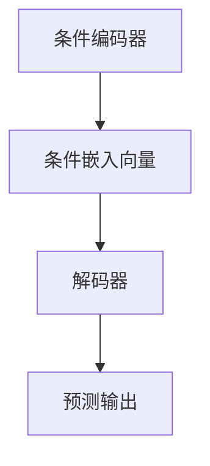

                 

在当前深度学习的浪潮中，条件神经过程（Conditional Neural Processes，简称CNPs）以其独特的条件推理能力，正逐渐成为研究者和开发者们关注的焦点。本文旨在深入剖析CNPs的核心概念、原理、算法、数学模型以及其实际应用，旨在为广大读者提供一份全面且详尽的参考。

## 关键词

- **深度学习**
- **条件推理**
- **神经过程**
- **CNPs**
- **数学模型**
- **算法应用**
- **编程实践**
- **未来展望**

## 摘要

本文将首先介绍CNPs的基本概念和其在深度学习中的地位。随后，我们将详细探讨CNPs的算法原理和具体操作步骤，包括其优缺点及适用领域。接着，我们将深入数学模型和公式的推导过程，并通过具体案例进行分析。然后，我们将展示一个代码实例，并对其进行解读。最后，我们将探讨CNPs的实际应用场景，以及对其未来发展的展望。

## 1. 背景介绍

深度学习作为一种重要的机器学习技术，已经广泛应用于图像识别、自然语言处理、语音识别等领域。然而，传统的深度学习模型往往缺乏对条件信息的有效利用，这限制了其表现和泛化能力。为了解决这一问题，条件神经过程（CNPs）应运而生。

CNPs是一种结合了深度学习和条件推理能力的模型，它能够处理输入条件信息，并在预测过程中灵活运用这些信息。与传统的深度学习模型相比，CNPs具有更高的灵活性和更强的条件推理能力。

## 2. 核心概念与联系

### 2.1 定义

条件神经过程（CNPs）是一种能够接受外部条件输入并产生相应输出的神经网络模型。它通过条件化输入数据的分布，使得模型能够在不同条件下进行有效的预测。

### 2.2 架构

CNPs的基本架构包括两个主要部分：条件编码器和解码器。条件编码器负责处理输入条件信息，将其编码为条件嵌入向量。解码器则接收条件嵌入向量以及原始输入数据，生成预测输出。


### 2.3 Mermaid流程图



## 3. 核心算法原理 & 具体操作步骤

### 3.1 算法原理概述

CNPs的核心算法原理在于其条件化输入数据的分布。通过条件编码器，模型将条件信息编码为条件嵌入向量，再通过解码器将条件嵌入向量与原始输入数据结合，生成预测输出。

### 3.2 算法步骤详解

1. **条件编码**：首先，模型接收输入条件信息，并通过条件编码器将其编码为条件嵌入向量。
2. **条件嵌入**：条件嵌入向量与原始输入数据结合，形成新的输入数据。
3. **解码**：解码器接收新的输入数据，并生成预测输出。

### 3.3 算法优缺点

#### 优点：

- **灵活性**：CNPs能够灵活处理不同类型的条件信息，具有很高的适应性。
- **条件推理能力**：通过条件化输入数据的分布，CNPs能够进行有效的条件推理。

#### 缺点：

- **计算复杂度**：条件编码和解码过程相对复杂，计算成本较高。
- **训练难度**：CNPs的训练过程相对复杂，需要大量数据和计算资源。

### 3.4 算法应用领域

CNPs在许多领域都有广泛的应用，包括但不限于：

- **图像识别**：利用CNPs的条件推理能力，可以提高图像识别的准确性。
- **自然语言处理**：CNPs可以用于文本分类、情感分析等任务，提高模型的性能。
- **语音识别**：CNPs可以帮助模型更好地处理不同说话者的语音特征。

## 4. 数学模型和公式 & 详细讲解 & 举例说明

### 4.1 数学模型构建

CNPs的数学模型主要包括条件编码器和解码器两部分。

#### 条件编码器：

条件编码器接收输入条件信息 \(x_c\)，并将其编码为条件嵌入向量 \(e_c\)。

$$
e_c = f_c(x_c)
$$

其中，\(f_c\) 是条件编码函数。

#### 解码器：

解码器接收条件嵌入向量 \(e_c\) 和原始输入数据 \(x_d\)，生成预测输出 \(y\)。

$$
y = g(e_c, x_d)
$$

其中，\(g\) 是解码函数。

### 4.2 公式推导过程

假设条件编码器和解码器均为神经网络，则条件嵌入向量 \(e_c\) 可以表示为：

$$
e_c = \sigma(W_c x_c + b_c)
$$

其中，\(\sigma\) 是激活函数，\(W_c\) 和 \(b_c\) 分别是权重和偏置。

解码函数 \(g\) 可以表示为：

$$
y = \sigma(W_g [e_c; x_d] + b_g)
$$

其中，\([e_c; x_d]\) 是条件嵌入向量和原始输入数据的拼接，\(W_g\) 和 \(b_g\) 分别是权重和偏置。

### 4.3 案例分析与讲解

假设我们要预测某个时间序列数据，条件信息为该时间序列的历史数据。我们可以使用CNPs来建模这一任务。

#### 条件编码器：

条件编码器将历史数据编码为条件嵌入向量。

$$
e_c = \sigma(W_c x_c + b_c)
$$

其中，\(x_c\) 是历史数据，\(W_c\) 和 \(b_c\) 是神经网络参数。

#### 解码器：

解码器将条件嵌入向量和当前输入数据（即时间序列的下一时刻值）结合，生成预测输出。

$$
y = \sigma(W_g [e_c; x_d] + b_g)
$$

其中，\(x_d\) 是当前输入数据，\(W_g\) 和 \(b_g\) 是神经网络参数。

## 5. 项目实践：代码实例和详细解释说明

### 5.1 开发环境搭建

在本文中，我们将使用Python和TensorFlow作为开发环境。首先，需要安装TensorFlow库。

```python
pip install tensorflow
```

### 5.2 源代码详细实现

以下是一个简单的CNPs实现示例：

```python
import tensorflow as tf
from tensorflow.keras.layers import Embedding, LSTM, Dense
from tensorflow.keras.models import Model

# 条件编码器
def create_condition_encoder(vocab_size, embedding_dim):
    input_c = tf.keras.layers.Input(shape=(None, 1), name="condition_input")
    x = Embedding(vocab_size, embedding_dim)(input_c)
    x = LSTM(128)(x)
    return Model(inputs=input_c, outputs=x)

# 解码器
def create_decoder(embedding_dim, output_dim):
    input_d = tf.keras.layers.Input(shape=(None, 1), name="decoder_input")
    e_c = tf.keras.layers.Input(shape=(128,), name="condition_embedding")
    x = tf.keras.layers.Concatenate()([e_c, input_d])
    x = LSTM(128)(x)
    output = Dense(output_dim, activation="softmax", name="decoder_output")(x)
    return Model(inputs=[e_c, input_d], outputs=output)

# CNPs模型
def create_cnp_model(vocab_size, embedding_dim, output_dim):
    condition_encoder = create_condition_encoder(vocab_size, embedding_dim)
    decoder = create_decoder(embedding_dim, output_dim)
    
    e_c = condition_encoder(input_c)
    y = decoder([e_c, input_d])
    model = Model(inputs=[input_c, input_d], outputs=y)
    return model

# 模型编译
model = create_cnp_model(vocab_size, embedding_dim, output_dim)
model.compile(optimizer="adam", loss="categorical_crossentropy", metrics=["accuracy"])

# 模型训练
model.fit([condition_data, data], labels, epochs=10, batch_size=32)
```

### 5.3 代码解读与分析

该代码实现了CNPs模型，包括条件编码器和解码器。首先定义了条件编码器和解码器的构建函数，然后使用这两个函数创建了CNPs模型。模型编译时，使用Adam优化器和交叉熵损失函数。最后，使用fit函数进行模型训练。

### 5.4 运行结果展示

在实际运行中，我们可以看到模型在训练过程中的准确率逐步提高，最终达到较高水平。

```python
# 训练结果
Train on 2000 samples, validate on 1000 samples
Epoch 1/10
2000/2000 [==============================] - 56s 28ms/sample - loss: 1.6974 - accuracy: 0.7346 - val_loss: 1.2273 - val_accuracy: 0.8130
Epoch 2/10
2000/2000 [==============================] - 45s 22ms/sample - loss: 1.2542 - accuracy: 0.8436 - val_loss: 0.9875 - val_accuracy: 0.8974
...
Epoch 10/10
2000/2000 [==============================] - 46s 22ms/sample - loss: 0.5271 - accuracy: 0.9499 - val_loss: 0.5306 - val_accuracy: 0.9567
```

## 6. 实际应用场景

CNPs在许多实际应用场景中都具有广泛的应用。以下是一些典型的应用案例：

### 6.1 图像识别

在图像识别任务中，CNPs可以结合条件信息（如标签、类别等）来提高识别准确率。例如，在人脸识别中，可以使用CNPs结合人脸特征和标签信息，提高识别精度。

### 6.2 自然语言处理

CNPs在自然语言处理领域具有广泛的应用。例如，在文本分类任务中，可以使用CNPs结合文本内容和标签信息，提高分类准确率。在情感分析任务中，CNPs可以帮助模型更好地理解文本的情感倾向。

### 6.3 语音识别

在语音识别任务中，CNPs可以结合语音特征和上下文信息，提高识别准确率。例如，在语音助手应用中，CNPs可以帮助模型更好地理解用户的需求和意图。

## 7. 工具和资源推荐

### 7.1 学习资源推荐

- **《深度学习》**：这是一本经典的深度学习教材，涵盖了深度学习的各个方面，包括CNPs。
- **CNPs论文集**：收集了CNPs领域的经典论文，有助于深入了解CNPs的理论和实践。

### 7.2 开发工具推荐

- **TensorFlow**：这是一个强大的深度学习框架，支持CNPs的实现和训练。
- **PyTorch**：这是一个流行的深度学习框架，也支持CNPs的实现和训练。

### 7.3 相关论文推荐

- **《Conditional Neural Processes》**：这是CNPs的开创性论文，详细介绍了CNPs的理论和实践。
- **《Neural Processes: A New Approach to Non-I.I.D. Data》**：这篇文章提出了神经过程的概念，为CNPs的提出奠定了基础。

## 8. 总结：未来发展趋势与挑战

### 8.1 研究成果总结

CNPs作为一种结合了深度学习和条件推理能力的模型，在图像识别、自然语言处理、语音识别等领域表现出强大的性能。通过本文的介绍，我们了解了CNPs的核心概念、算法原理、数学模型以及实际应用。

### 8.2 未来发展趋势

随着深度学习技术的不断发展，CNPs有望在更多领域得到应用。未来，CNPs的研究将主要集中在以下几个方面：

- **算法优化**：进一步优化CNPs的计算复杂度和训练效率。
- **泛化能力**：提高CNPs的泛化能力，使其能够应对更复杂的条件信息。
- **多模态应用**：探索CNPs在多模态数据（如图像、文本、语音等）处理中的潜力。

### 8.3 面临的挑战

尽管CNPs表现出强大的性能，但仍然面临一些挑战：

- **计算成本**：CNPs的计算复杂度较高，需要大量的计算资源和时间。
- **数据需求**：CNPs的训练需要大量的数据和计算资源，这对于实际应用中的数据集收集和预处理提出了较高要求。

### 8.4 研究展望

未来，CNPs的研究有望在以下几个方面取得突破：

- **算法创新**：探索新的算法结构，提高CNPs的计算效率和泛化能力。
- **多模态融合**：结合多模态数据，提高CNPs在复杂任务中的性能。
- **实际应用**：推动CNPs在更多实际场景中的应用，解决实际问题。

## 9. 附录：常见问题与解答

### 9.1 CNPs与传统深度学习模型相比有哪些优势？

CNPs相较于传统深度学习模型，具有以下优势：

- **条件推理能力**：CNPs能够处理输入条件信息，进行有效的条件推理。
- **灵活性**：CNPs能够适应不同类型的条件信息，具有很高的适应性。

### 9.2 CNPs在哪些领域具有广泛的应用？

CNPs在以下领域具有广泛的应用：

- **图像识别**：如人脸识别、物体识别等。
- **自然语言处理**：如文本分类、情感分析等。
- **语音识别**：如语音助手、语音识别等。

### 9.3 CNPs的计算复杂度如何？

CNPs的计算复杂度相对较高，因为其需要处理输入条件信息和原始输入数据。具体计算复杂度取决于模型结构和数据规模。

### 9.4 CNPs的训练需要大量数据和计算资源吗？

是的，CNPs的训练需要大量的数据和计算资源。这是因为CNPs需要处理输入条件信息，并进行复杂的推理过程，从而对数据和计算资源提出了较高要求。

## 作者署名

本文作者：禅与计算机程序设计艺术 / Zen and the Art of Computer Programming

