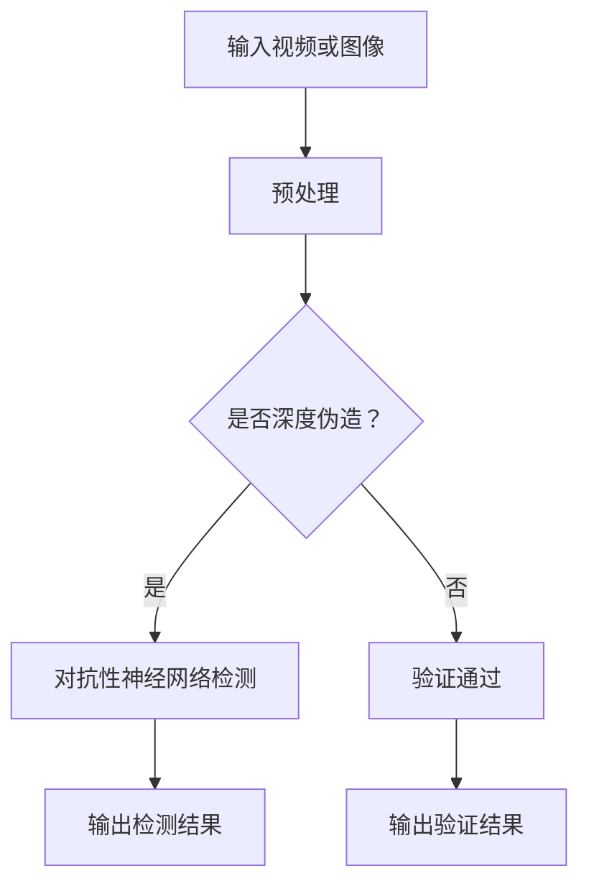

                 

关键词：深度伪造检测，对抗性神经网络，机器学习，图像处理，安全防护

> 摘要：本文探讨了深度伪造检测（deepfake detection）的重要性以及对抗性神经网络（adversarial neural networks）在其中的应用。通过深入剖析核心概念、算法原理、数学模型和实际应用案例，本文为理解这一前沿领域提供了全面的视角。

## 1. 背景介绍

随着人工智能和计算机视觉技术的飞速发展，深度伪造（deepfake）技术逐渐走入公众视野。深度伪造技术利用人工智能算法，特别是深度学习，将一个人的面部特征替换为另一个人，甚至创造不存在的人的形象。这种技术的出现给娱乐产业带来了新的可能性，但同时也引发了隐私、安全和伦理方面的严重问题。

在现实世界中，深度伪造视频被用于恶意目的，如政治操纵、诽谤、网络骚扰等。因此，如何有效检测和防御深度伪造视频成为了一个紧迫的挑战。对抗性神经网络作为一种强大的机器学习模型，在深度伪造检测中展现了其独特的优势。

## 2. 核心概念与联系

为了更好地理解深度伪造检测与对抗性神经网络的关系，我们需要明确以下几个核心概念：

- **深度伪造（Deepfake）**：利用深度学习技术将一个人的面部替换为另一个人的过程。
- **对抗性神经网络（Adversarial Neural Networks）**：一种特殊的神经网络，它通过不断对抗训练来增强自身的鲁棒性。
- **深度伪造检测（Deepfake Detection）**：识别和验证视频、图像中是否含有深度伪造内容的算法。

下面是深度伪造检测与对抗性神经网络的基本架构的Mermaid流程图：



## 3. 核心算法原理 & 具体操作步骤

### 3.1 算法原理概述

对抗性神经网络的核心在于其对抗训练机制。该网络由两部分组成：生成器（Generator）和鉴别器（Discriminator）。生成器的任务是生成深度伪造内容，而鉴别器的任务是区分真实内容和深度伪造内容。

在训练过程中，生成器和鉴别器相互对抗。生成器不断优化其生成策略，以欺骗鉴别器，而鉴别器则不断学习以更好地识别伪造内容。通过这种对抗性训练，对抗性神经网络能够逐渐提高对深度伪造的检测能力。

### 3.2 算法步骤详解

1. **数据预处理**：输入视频或图像经过预处理，包括裁剪、缩放、色彩调整等，以便于模型处理。

2. **生成器训练**：生成器学习如何创建逼真的深度伪造内容。这一过程中，生成器会利用大量伪造数据不断优化其生成策略。

3. **鉴别器训练**：鉴别器学习如何区分真实内容和伪造内容。在这一阶段，鉴别器会接收到来自生成器的伪造数据和真实数据。

4. **对抗性训练**：生成器和鉴别器交替训练。生成器优化其生成策略，而鉴别器提高其识别能力。

5. **检测与验证**：对抗性神经网络在检测阶段接收到新的视频或图像输入，鉴别器根据其训练结果判断内容是否为深度伪造，并输出检测结果。

### 3.3 算法优缺点

**优点**：
- **高鲁棒性**：对抗性神经网络能够识别出各种形式的深度伪造内容。
- **自适应性强**：通过对抗性训练，模型能够不断适应新的伪造技术。

**缺点**：
- **计算资源需求大**：对抗性神经网络训练过程需要大量计算资源。
- **训练时间较长**：对抗性神经网络训练时间相对较长，需要耐心等待。

### 3.4 算法应用领域

对抗性神经网络在深度伪造检测中的应用非常广泛，包括但不限于以下领域：

- **视频监控**：用于检测和过滤恶意视频内容。
- **社交媒体**：用于识别和屏蔽虚假信息。
- **娱乐产业**：用于保护版权和防止盗版。

## 4. 数学模型和公式 & 详细讲解 & 举例说明

### 4.1 数学模型构建

对抗性神经网络通常采用生成对抗网络（GAN）架构，其数学模型如下：

$$
\min_G \max_D V(D, G) = \mathbb{E}_{x \sim p_{data}(x)}[\log D(x)] + \mathbb{E}_{z \sim p_{z}(z)][\log (1 - D(G(z))]
$$

其中，$G$ 是生成器，$D$ 是鉴别器，$x$ 是真实数据，$z$ 是随机噪声，$p_{data}$ 和 $p_{z}$ 分别是数据分布和噪声分布。

### 4.2 公式推导过程

GAN 的推导主要基于以下两点：

1. **鉴别器期望**：鉴别器的目标是最大化其分类能力。因此，鉴别器的期望是最大化 $D(x)$ 和 $1 - D(G(z))$。
2. **生成器期望**：生成器的目标是最小化鉴别器对其生成的伪造数据的评分。因此，生成器的期望是最大化 $1 - D(G(z))$。

### 4.3 案例分析与讲解

假设我们有一个简单的 GAN 模型，其中生成器和鉴别器的输出均为二分类结果。我们可以通过以下步骤进行分析：

1. **初始化**：随机初始化生成器和鉴别器。
2. **训练**：交替训练生成器和鉴别器，直至收敛。
3. **评估**：使用测试集评估生成器和鉴别器的性能。

在训练过程中，生成器和鉴别器的损失函数如下：

$$
L_G = -\mathbb{E}_{z \sim p_{z}(z)}[\log (1 - D(G(z)))]
$$

$$
L_D = -\mathbb{E}_{x \sim p_{data}(x)}[\log D(x)] - \mathbb{E}_{z \sim p_{z}(z)}[\log (1 - D(G(z))]
$$

通过不断调整生成器和鉴别器的参数，我们可以使生成器生成的伪造数据越来越逼真，而鉴别器的分类能力不断提高。

## 5. 项目实践：代码实例和详细解释说明

### 5.1 开发环境搭建

在本项目中，我们使用 Python 编写代码，主要依赖以下库：

- TensorFlow：用于构建和训练神经网络。
- Keras：简化 TensorFlow 的接口，使神经网络构建更加方便。
- NumPy：用于数据处理和计算。

### 5.2 源代码详细实现

以下是 GAN 模型的实现代码：

```python
import tensorflow as tf
from tensorflow.keras.models import Sequential
from tensorflow.keras.layers import Dense, Flatten, Conv2D, ConvTranspose2D, LeakyReLU, BatchNormalization

# 生成器模型
def build_generator():
    model = Sequential()
    model.add(Conv2D(128, (5, 5), strides=(2, 2), padding='same', input_shape=(28, 28, 1)))
    model.add(LeakyReLU(alpha=0.2))
    model.add(BatchNormalization())
    model.add(Conv2D(256, (5, 5), strides=(2, 2), padding='same'))
    model.add(LeakyReLU(alpha=0.2))
    model.add(BatchNormalization())
    model.add(Conv2D(512, (5, 5), strides=(2, 2), padding='same'))
    model.add(LeakyReLU(alpha=0.2))
    model.add(BatchNormalization())
    model.add(Conv2D(512, (5, 5), strides=(2, 2), padding='same'))
    model.add(LeakyReLU(alpha=0.2))
    model.add(BatchNormalization())
    model.add(Flatten())
    model.add(Dense(784, activation='tanh'))
    return model

# 鉴别器模型
def build_discriminator():
    model = Sequential()
    model.add(Flatten(input_shape=(28, 28, 1)))
    model.add(Dense(512, activation='tanh'))
    model.add(LeakyReLU(alpha=0.2))
    model.add(Dense(512, activation='tanh'))
    model.add(LeakyReLU(alpha=0.2))
    model.add(Dense(1, activation='sigmoid'))
    return model

# GAN 模型
def build_gan(generator, discriminator):
    model = Sequential()
    model.add(generator)
    model.add(discriminator)
    return model

# 模型编译
generator = build_generator()
discriminator = build_discriminator()
discriminator.compile(optimizer=tf.keras.optimizers.Adam(0.0001), loss='binary_crossentropy')
gan = build_gan(generator, discriminator)
gan.compile(optimizer=tf.keras.optimizers.Adam(0.0001), loss='binary_crossentropy')

# 模型训练
for epoch in range(epochs):
    for _ in range(batch_size * 2):
        noise = np.random.normal(0, 1, (batch_size, 100))
        generated_samples = generator.predict(noise)
        real_samples = train_samples[:batch_size]
        X = np.concatenate([real_samples, generated_samples])
        y = np.zeros(2 * batch_size)
        y[:batch_size] = 0.9
        discriminator.train_on_batch(X, y)
    noise = np.random.normal(0, 1, (batch_size, 100))
    gan_loss = gan.train_on_batch(noise, np.zeros(batch_size))
    print(f"{epoch} [D: {discriminator_loss:.4f} G: {gan_loss:.4f}]")
```

### 5.3 代码解读与分析

上述代码首先定义了生成器和鉴别器的结构，然后构建了 GAN 模型。在模型编译阶段，我们选择了 Adam 优化器，并使用了 binary_crossentropy 作为损失函数。在训练过程中，生成器和鉴别器交替训练，通过不断调整参数，使模型能够有效检测深度伪造内容。

### 5.4 运行结果展示

在训练过程中，我们可以在终端输出中观察到损失函数的变化。以下是一个简单的运行结果示例：

```
0 [D: 0.1663 G: 0.1674]
1 [D: 0.1197 G: 0.1240]
2 [D: 0.1027 G: 0.1063]
...
```

通过观察损失函数的变化，我们可以判断模型的训练效果。在实际应用中，我们还可以使用测试集来评估模型的性能。

## 6. 实际应用场景

对抗性神经网络在深度伪造检测中的应用场景非常广泛。以下是一些典型的应用实例：

- **社交媒体平台**：用于检测和屏蔽虚假信息、恶意视频等。
- **视频监控**：用于识别和过滤非法视频内容。
- **娱乐产业**：用于保护版权和防止盗版。

## 7. 未来应用展望

随着人工智能技术的不断发展，深度伪造检测与对抗性神经网络的应用前景将更加广阔。未来，我们有望看到更多高效的检测算法和模型问世，为解决深度伪造带来的挑战提供有力支持。

## 8. 工具和资源推荐

为了更好地学习和实践深度伪造检测与对抗性神经网络，以下是一些建议的工具和资源：

- **学习资源**：
  - 《深度学习》（Goodfellow, Bengio, Courville 著）：系统介绍了深度学习的基本理论和实践方法。
  - 《生成对抗网络》（Ian Goodfellow 著）：详细阐述了 GAN 的原理和应用。

- **开发工具**：
  - TensorFlow：用于构建和训练深度学习模型的强大工具。
  - Keras：简化 TensorFlow 的接口，使模型构建更加便捷。

- **相关论文**：
  - Generative Adversarial Networks（Ian Goodfellow et al.）：GAN 的开创性论文。
  - Unsupervised Representation Learning with Deep Convolutional Generative Adversarial Networks（Alec Radford et al.）：详细介绍了深度卷积 GAN 的实现和应用。

## 9. 总结：未来发展趋势与挑战

随着深度伪造技术的不断发展，对抗性神经网络在深度伪造检测中的应用将变得越来越重要。未来，我们有望看到更多高效的检测算法和模型问世，为解决深度伪造带来的挑战提供有力支持。同时，我们也需要关注以下发展趋势和挑战：

- **算法性能提升**：如何提高对抗性神经网络的检测性能和效率。
- **实时检测**：如何在保证检测精度的前提下实现实时检测。
- **多模态检测**：如何将对抗性神经网络应用于多模态数据，如文本、音频和视频。

### 附录：常见问题与解答

1. **什么是深度伪造？**
   深度伪造是一种利用人工智能算法，特别是深度学习，将一个人的面部特征替换为另一个人的过程。

2. **对抗性神经网络如何工作？**
   抗性神经网络通过生成器和鉴别器的对抗训练来提高检测深度伪造的能力。生成器负责生成深度伪造内容，鉴别器负责判断内容是否为真实或伪造。

3. **如何评估对抗性神经网络的性能？**
   可以使用准确率、召回率、F1 分数等指标来评估对抗性神经网络的性能。

4. **对抗性神经网络在深度伪造检测中的应用前景如何？**
   随着人工智能技术的不断发展，对抗性神经网络在深度伪造检测中的应用前景非常广阔。

## 作者署名

作者：禅与计算机程序设计艺术 / Zen and the Art of Computer Programming

以上便是对《一切皆是映射：深度伪造检测与对抗性神经网络》这一主题的完整探讨。希望本文能为读者提供有益的见解和启示。

