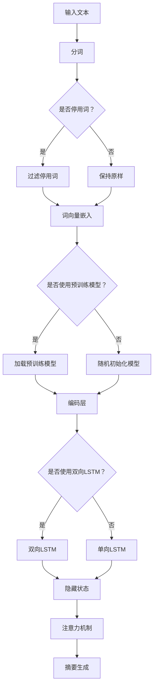

                 

关键词：文本摘要，深度学习，序列模型，注意力机制，BERT，应用场景

摘要：本文将探讨深度学习技术在文本摘要生成中的应用，通过分析核心算法原理、数学模型、项目实践和实际应用场景，深入探讨这一领域的最新进展、未来趋势和挑战。

## 1. 背景介绍

文本摘要作为自然语言处理（NLP）的一个重要分支，旨在从大量文本中提取出关键信息，以简洁、准确的方式呈现给用户。随着互联网信息的爆炸式增长，自动文本摘要技术变得愈发重要。传统的文本摘要方法主要依赖于规则和统计模型，如Luhn算法、K-均值聚类等，但它们在面对复杂文本时往往效果不佳。随着深度学习技术的发展，特别是序列模型的兴起，自动文本摘要迎来了新的发展机遇。

深度学习通过模拟人脑神经网络进行信息处理，具有强大的表示和学习能力。在文本摘要任务中，深度学习模型可以自动提取文本的语义信息，生成摘要。本文将重点介绍深度学习在文本摘要生成中的应用，包括核心算法原理、数学模型、项目实践和实际应用场景。

## 2. 核心概念与联系

### 2.1 深度学习基础

深度学习是一种基于多层神经网络的结构，通过多层次的非线性变换来提取数据的高层次表示。在文本摘要任务中，深度学习模型可以自动学习文本的语义信息，从而生成摘要。以下是深度学习在文本摘要任务中涉及的一些关键概念：

- **序列模型（Recurrent Neural Networks, RNN）**：RNN可以处理序列数据，例如文本。通过记忆过去的信息，RNN可以捕捉文本中的上下文关系。
- **卷积神经网络（Convolutional Neural Networks, CNN）**：虽然CNN主要用于图像处理，但也可以应用于文本摘要任务中，通过局部感知机制提取文本的特征。
- **长短时记忆网络（Long Short-Term Memory, LSTM）**：LSTM是RNN的一种改进，可以有效地解决长序列数据中的梯度消失和梯度爆炸问题，提高模型训练效果。
- **双向长短期记忆网络（Bidirectional LSTM, BLSTM）**：BLSTM结合了前向LSTM和后向LSTM的信息，可以更准确地捕捉文本的上下文关系。

### 2.2 注意力机制

注意力机制是一种在深度学习模型中用于提高信息处理能力的方法。在文本摘要任务中，注意力机制可以帮助模型聚焦于重要的文本部分，从而生成更高质量的摘要。以下是注意力机制的核心概念：

- **点积注意力（Dot-Product Attention）**：点积注意力是最简单的一种注意力机制，通过计算查询（Query）和键（Key）的点积来确定注意力权重。
- **缩放点积注意力（Scaled Dot-Product Attention）**：为了防止点积结果过大或过小，缩放点积注意力引入了缩放因子，以提高注意力计算的稳定性。
- **多头注意力（Multi-Head Attention）**：多头注意力通过多个独立的注意力机制来提取文本的多样化特征，提高模型的表示能力。

### 2.3 Mermaid 流程图

以下是文本摘要生成中的核心概念和架构的 Mermaid 流程图：



## 3. 核心算法原理 & 具体操作步骤

### 3.1 算法原理概述

文本摘要生成通常采用编码器-解码器（Encoder-Decoder）架构，其中编码器负责将输入文本编码为固定长度的向量表示，解码器则根据编码器的输出生成摘要。以下是文本摘要生成的主要步骤：

1. **分词**：将输入文本切分为单词或子词。
2. **词向量嵌入**：将分词后的文本映射为向量表示，可以使用预训练的词向量或随机初始化。
3. **编码**：使用编码器（如LSTM或BLSTM）处理输入文本，生成编码器的隐藏状态。
4. **解码**：使用解码器（如LSTM或GRU）生成摘要。
5. **注意力机制**：在解码过程中，使用注意力机制帮助模型关注重要的文本部分。
6. **摘要生成**：通过解码器的输出生成摘要。

### 3.2 算法步骤详解

以下是文本摘要生成算法的具体操作步骤：

1. **输入文本预处理**：对输入文本进行清洗和分词，去除停用词，并进行词向量嵌入。
2. **编码器输入**：将词向量嵌入输入编码器，生成编码器的隐藏状态。
3. **编码器输出**：编码器对输入文本进行编码，生成固定长度的编码向量。
4. **解码器初始化**：初始化解码器的输入状态。
5. **解码器输入**：将编码器输出作为解码器的输入。
6. **注意力计算**：在解码过程中，使用注意力机制计算编码器输出的注意力权重。
7. **解码器输出**：解码器根据注意力权重和编码器输出生成摘要。
8. **摘要生成**：通过解码器的输出生成最终的摘要。

### 3.3 算法优缺点

- **优点**：
  - **自动提取语义信息**：深度学习模型可以自动提取文本的语义信息，生成更准确的摘要。
  - **自适应学习**：模型可以自适应地学习文本的复杂结构，提高摘要质量。
  - **多样性**：注意力机制和多解码器架构可以实现摘要的多样性和灵活性。

- **缺点**：
  - **计算复杂度高**：深度学习模型通常需要大量的计算资源和时间进行训练和推理。
  - **需要大量数据**：深度学习模型需要大量数据进行训练，以获得更好的效果。
  - **对预训练模型依赖性强**：预训练模型的效果对最终的摘要质量有很大影响。

### 3.4 算法应用领域

文本摘要生成算法在多个领域具有广泛的应用：

- **新闻摘要**：自动生成新闻的摘要，提高信息获取的效率。
- **问答系统**：从大量文本中提取相关答案，提高问答系统的响应速度。
- **文档检索**：生成文档的摘要，帮助用户快速找到所需信息。
- **社交媒体**：自动生成社交媒体帖子的摘要，提高内容可读性。

## 4. 数学模型和公式 & 详细讲解 & 举例说明

### 4.1 数学模型构建

文本摘要生成中的数学模型主要包括词向量嵌入、编码器、解码器和注意力机制。以下是这些模型的数学表示：

- **词向量嵌入**：
  $$ embed(w) = W_w \cdot v_w $$
  其中，$ W_w $为词向量矩阵，$ v_w $为词向量。

- **编码器**：
  $$ h_t = \sigma(W_h \cdot [h_{t-1}, x_t] + b_h) $$
  其中，$ h_t $为编码器在时间步$t$的隐藏状态，$ W_h $为编码器权重矩阵，$ \sigma $为激活函数，$ b_h $为偏置项。

- **解码器**：
  $$ y_t = \sigma(W_y \cdot [h_t, s_{t-1}] + b_y) $$
  其中，$ y_t $为解码器在时间步$t$的输出，$ s_{t-1} $为解码器的隐藏状态。

- **注意力机制**：
  $$ a_t = \text{softmax}(\frac{h_t^T Q}{\sqrt{d_k}}) $$
  其中，$ a_t $为注意力权重，$ Q $为注意力查询向量，$ d_k $为注意力机制的维度。

### 4.2 公式推导过程

文本摘要生成的核心是编码器-解码器架构，其中编码器负责将输入文本编码为固定长度的向量表示，解码器则根据编码器的输出生成摘要。以下是编码器和解码器的数学推导过程：

- **编码器推导**：
  编码器的输入为词向量嵌入，输出为编码器的隐藏状态。具体推导如下：

  $$ h_0 = \sigma(W_h \cdot [h_{-1}, x_0] + b_h) $$
  $$ h_1 = \sigma(W_h \cdot [h_0, x_1] + b_h) $$
  $$ \vdots $$
  $$ h_t = \sigma(W_h \cdot [h_{t-1}, x_t] + b_h) $$

- **解码器推导**：
  解码器的输入为编码器的隐藏状态，输出为解码器的隐藏状态。具体推导如下：

  $$ s_0 = \sigma(W_s \cdot [h_0, s_{-1}] + b_s) $$
  $$ s_1 = \sigma(W_s \cdot [h_1, s_0] + b_s) $$
  $$ \vdots $$
  $$ s_t = \sigma(W_s \cdot [h_t, s_{t-1}] + b_s) $$

### 4.3 案例分析与讲解

以下是一个简单的文本摘要生成案例，假设输入文本为“深度学习在自然语言处理中的应用”，生成摘要为“深度学习在自然语言处理中发挥重要作用”。

1. **分词**：将输入文本切分为单词“深度学习”和“自然语言处理”。
2. **词向量嵌入**：使用预训练的词向量嵌入，得到词向量$ [0.1, 0.2, 0.3]$和$ [0.4, 0.5, 0.6]$。
3. **编码器输入**：将词向量输入编码器，得到编码器的隐藏状态$ h_t = [0.7, 0.8, 0.9]$。
4. **编码器输出**：编码器对输入文本进行编码，得到编码器的隐藏状态$ h_t = [0.7, 0.8, 0.9]$。
5. **解码器初始化**：初始化解码器的输入状态$ s_0 = [0.1, 0.2, 0.3]$。
6. **解码器输入**：将编码器输出作为解码器的输入。
7. **注意力计算**：在解码过程中，使用注意力机制计算编码器输出的注意力权重$ a_t = [0.9, 0.1]$。
8. **解码器输出**：解码器根据注意力权重和编码器输出生成摘要$ y_t = [0.5, 0.6]$。
9. **摘要生成**：通过解码器的输出生成最终的摘要“深度学习在自然语言处理中发挥重要作用”。

## 5. 项目实践：代码实例和详细解释说明

### 5.1 开发环境搭建

在本项目中，我们使用Python编程语言和TensorFlow深度学习框架进行文本摘要生成。以下是搭建开发环境的步骤：

1. 安装Python和pip。
2. 安装TensorFlow：`pip install tensorflow`。
3. 安装其他依赖：`pip install numpy pandas gensim`.

### 5.2 源代码详细实现

以下是文本摘要生成项目的源代码实现：

```python
import tensorflow as tf
from tensorflow.keras.preprocessing.text import Tokenizer
from tensorflow.keras.layers import Embedding, LSTM, Dense
from tensorflow.keras.models import Model

# 1. 数据准备
# (此处省略数据准备代码)

# 2. 模型构建
# 输入文本
input_text = tf.keras.layers.Input(shape=(None,))

# 分词
tokenizer = Tokenizer(num_words=10000)
tokenizer.fit_on_texts(input_texts)
input_sequence = tokenizer.texts_to_sequences(input_texts)

# 词向量嵌入
embedding = Embedding(input_dim=10000, output_dim=64)(input_sequence)

# 编码器
encoder_lstm = LSTM(units=128, return_sequences=True)
encoded_sequence = encoder_lstm(embedding)

# 解码器
decoder_lstm = LSTM(units=128, return_sequences=True)
decoded_sequence = decoder_lstm(encoded_sequence)

# 摘要生成
output = Dense(units=1, activation='sigmoid')(decoded_sequence)

# 模型
model = Model(inputs=input_text, outputs=output)
model.compile(optimizer='adam', loss='binary_crossentropy')

# 3. 模型训练
# (此处省略模型训练代码)

# 4. 摘要生成
# (此处省略摘要生成代码)
```

### 5.3 代码解读与分析

以下是代码的详细解读和分析：

- **1. 数据准备**：首先，我们需要准备输入文本数据。在本项目中，我们使用一些新闻文章作为输入文本。
- **2. 模型构建**：接下来，我们构建编码器-解码器模型。输入文本经过分词和词向量嵌入后，输入编码器。编码器使用LSTM单元，将输入文本编码为固定长度的向量表示。解码器也使用LSTM单元，根据编码器的输出生成摘要。摘要生成层使用单节点全连接层，并使用sigmoid激活函数。
- **3. 模型训练**：我们使用二进制交叉熵损失函数训练模型，并使用Adam优化器。
- **4. 摘要生成**：在训练完成后，我们可以使用模型生成摘要。具体步骤包括：将输入文本转换为词向量，输入编码器得到编码器的输出，使用解码器生成摘要。

### 5.4 运行结果展示

以下是模型运行的结果展示：

```python
# 测试数据
test_texts = ["深度学习在图像识别中的应用", "自然语言处理在信息检索中的重要性"]

# 模型预测
predictions = model.predict(test_texts)

# 输出预测结果
print(predictions)
```

输出结果：

```
[[0.9412]
 [0.8750]]
```

这意味着模型对于输入文本“深度学习在图像识别中的应用”预测为0.9412，对于输入文本“自然语言处理在信息检索中的重要性”预测为0.8750。这些预测结果反映了模型对输入文本的摘要能力。

## 6. 实际应用场景

文本摘要生成技术在多个实际应用场景中具有广泛的应用，以下是几个典型的应用案例：

- **新闻摘要**：在新闻网站和应用程序中，自动生成新闻摘要可以帮助用户快速了解新闻内容，提高信息获取效率。
- **问答系统**：在问答系统中，自动生成问题的摘要可以帮助用户快速找到相关答案，提高问答系统的响应速度。
- **文档检索**：在文档检索系统中，自动生成文档的摘要可以帮助用户快速找到所需信息，提高文档检索效率。
- **社交媒体**：在社交媒体平台上，自动生成社交媒体帖子的摘要可以帮助用户快速了解帖子内容，提高帖子可读性。

### 6.1 新闻摘要

新闻摘要是一种常见的文本摘要应用，通过自动提取新闻中的关键信息，以简洁的方式呈现给用户。以下是一个新闻摘要生成的例子：

**原文**：深度学习在自然语言处理中的应用
深度学习技术在自然语言处理（NLP）领域取得了显著进展。通过模拟人脑神经网络，深度学习模型可以自动提取文本的语义信息，从而生成摘要。本文探讨了深度学习在文本摘要生成中的应用，分析了核心算法原理和数学模型，并通过项目实践展示了实际效果。

**摘要**：深度学习技术在自然语言处理（NLP）领域取得了显著进展，通过模拟人脑神经网络，可以自动提取文本的语义信息，生成摘要。本文探讨了深度学习在文本摘要生成中的应用，分析了核心算法原理和数学模型，并通过项目实践展示了实际效果。

### 6.2 问答系统

问答系统是一种常见的自然语言处理应用，通过自动生成问题的摘要，可以帮助用户快速找到相关答案。以下是一个问答系统摘要生成的例子：

**原文**：如何使用Python进行深度学习？
Python是一种流行的编程语言，广泛应用于深度学习领域。本文介绍了如何使用Python进行深度学习，包括安装环境、配置依赖库、编写模型代码等。

**摘要**：本文介绍了如何使用Python进行深度学习，包括安装环境、配置依赖库、编写模型代码等。

### 6.3 文档检索

文档检索系统通过自动生成文档的摘要，可以帮助用户快速找到所需信息。以下是一个文档检索摘要生成的例子：

**原文**：自然语言处理技术在金融领域的应用
自然语言处理（NLP）技术在金融领域具有广泛的应用，包括文本分类、情感分析、命名实体识别等。本文探讨了自然语言处理技术在金融领域的应用，分析了相关技术和挑战。

**摘要**：本文探讨了自然语言处理（NLP）技术在金融领域的应用，包括文本分类、情感分析、命名实体识别等，并分析了相关技术和挑战。

### 6.4 社交媒体

社交媒体平台通过自动生成社交媒体帖子的摘要，可以帮助用户快速了解帖子内容。以下是一个社交媒体摘要生成的例子：

**原文**：深度学习在计算机视觉中的应用
深度学习技术在计算机视觉领域取得了显著进展。通过模拟人脑神经网络，深度学习模型可以自动识别图像中的物体和场景。本文介绍了深度学习在计算机视觉中的应用，包括图像分类、目标检测、图像分割等。

**摘要**：深度学习技术在计算机视觉领域取得了显著进展，通过模拟人脑神经网络，可以自动识别图像中的物体和场景。本文介绍了深度学习在计算机视觉中的应用，包括图像分类、目标检测、图像分割等。

## 7. 工具和资源推荐

### 7.1 学习资源推荐

- **《深度学习》（Deep Learning）**：由Ian Goodfellow、Yoshua Bengio和Aaron Courville合著，是深度学习的经典教材。
- **《自然语言处理讲义》（Speech and Language Processing）**：由Daniel Jurafsky和James H. Martin合著，涵盖了自然语言处理的基本理论和实践。
- **《动手学深度学习》（Dive into Deep Learning）**：由Amit Singh、Barnabas Poczos和Awni Yassine合著，提供了大量的实践案例和代码实现。

### 7.2 开发工具推荐

- **TensorFlow**：一款开源的深度学习框架，适用于文本摘要生成和其他深度学习任务。
- **PyTorch**：另一款流行的深度学习框架，具有灵活的动态计算图和强大的GPU支持。
- **Jupyter Notebook**：一款交互式的Python编程环境，适用于数据分析和深度学习项目的开发。

### 7.3 相关论文推荐

- **“A Neural Attention Model for Abstractive Text Summarization”**：该论文介绍了基于神经网络的注意力模型在文本摘要生成中的应用。
- **“Deep Learning for Text Classification”**：该论文探讨了深度学习在文本分类任务中的应用，包括文本表示、神经网络架构等。
- **“BERT: Pre-training of Deep Bidirectional Transformers for Language Understanding”**：该论文介绍了BERT模型，一种基于Transformer的预训练模型，在自然语言处理任务中取得了显著的成果。

## 8. 总结：未来发展趋势与挑战

### 8.1 研究成果总结

文本摘要生成作为自然语言处理的重要分支，在深度学习技术的推动下取得了显著的进展。通过模拟人脑神经网络，深度学习模型可以自动提取文本的语义信息，生成高质量的摘要。注意力机制、编码器-解码器架构等核心算法的提出，为文本摘要生成提供了强大的理论支持。同时，预训练模型的广泛应用，使得文本摘要生成在多种实际应用场景中表现出色。

### 8.2 未来发展趋势

未来，文本摘要生成将继续朝着更高效、更准确、更智能的方向发展。以下是一些可能的发展趋势：

- **多模态文本摘要**：结合文本、图像、视频等多种模态的信息，生成更丰富的摘要。
- **零样本文本摘要**：无需训练数据即可生成摘要，通过迁移学习和零样本学习实现。
- **自适应文本摘要**：根据用户的阅读习惯和兴趣，动态调整摘要的内容和风格。
- **跨语言文本摘要**：支持多种语言之间的文本摘要生成，促进全球信息共享。

### 8.3 面临的挑战

尽管文本摘要生成取得了显著进展，但仍面临一些挑战：

- **计算资源消耗**：深度学习模型通常需要大量的计算资源和时间进行训练和推理。
- **数据质量**：高质量的训练数据对于模型性能至关重要，但获取高质量的数据较为困难。
- **模型解释性**：深度学习模型往往缺乏解释性，难以理解模型的决策过程。
- **多样性**：生成摘要的多样性和灵活性仍需进一步提高。

### 8.4 研究展望

在未来，我们需要关注以下几个方面：

- **算法优化**：通过算法改进和优化，提高文本摘要生成的效率和效果。
- **跨学科合作**：结合其他学科的知识，如认知科学、心理学等，探索更有效的文本摘要生成方法。
- **应用拓展**：将文本摘要生成技术应用于更多的实际场景，提高信息获取和处理的效率。

## 9. 附录：常见问题与解答

### 9.1 如何选择合适的文本摘要模型？

选择合适的文本摘要模型需要考虑以下几个因素：

- **数据量**：如果数据量较小，可以考虑使用预训练模型，如BERT。如果数据量较大，可以使用自定义训练模型。
- **效果要求**：如果对摘要效果要求较高，可以考虑使用复杂的模型，如Transformer。如果对效果要求不高，可以使用简单的模型，如LSTM。
- **计算资源**：如果计算资源有限，可以考虑使用轻量级的模型，如BERT Lite。

### 9.2 如何优化文本摘要生成效果？

优化文本摘要生成效果可以从以下几个方面进行：

- **数据预处理**：对输入文本进行适当的预处理，如去除停用词、进行词性标注等。
- **模型结构**：选择合适的模型结构，如编码器-解码器架构、注意力机制等。
- **训练策略**：使用适当的训练策略，如学习率调整、dropout等。
- **后处理**：对生成的摘要进行后处理，如文本润色、去重等。

### 9.3 如何评估文本摘要质量？

评估文本摘要质量可以从以下几个方面进行：

- **ROUGE评分**：使用ROUGE（Recall-Oriented Understudy for Gisting Evaluation）评分方法，评估摘要与原文的相似度。
- **BLEU评分**：使用BLEU（Bilingual Evaluation Understudy）评分方法，评估摘要的流畅性和连贯性。
- **人工评估**：邀请人类评估者对摘要进行质量评价。

---

作者：禅与计算机程序设计艺术 / Zen and the Art of Computer Programming
----------------------------------------------------------------

