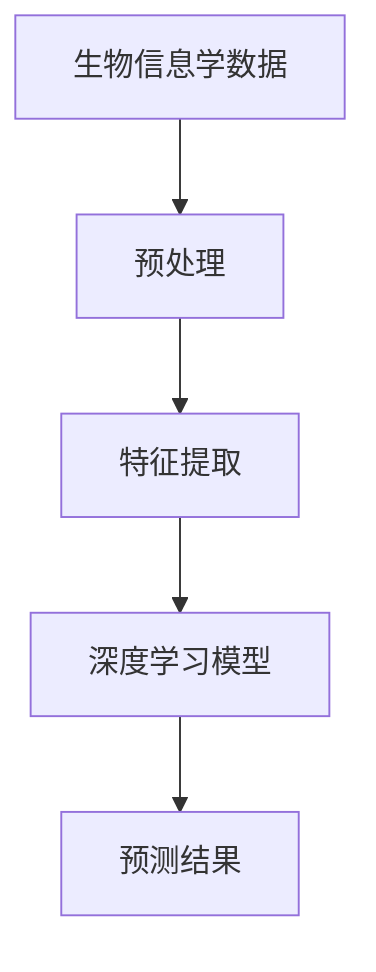

                 

关键词：深度学习，生物信息学，基因序列分析，蛋白质结构预测，映射原理，应用前景

> 摘要：随着生物信息学领域的飞速发展，深度学习技术逐渐成为解析生物数据的重要工具。本文旨在探讨深度学习在生物信息学中的应用前景，通过梳理核心概念、算法原理、数学模型，以及实际案例，旨在为研究人员提供全面的指导，并展望未来发展趋势。

## 1. 背景介绍

生物信息学是利用计算机技术解析生物数据的一门交叉学科，涵盖了基因组学、蛋白质组学、代谢组学等多个领域。随着测序技术的进步，生物信息学数据量呈爆炸式增长，如何有效处理和解析这些数据成为亟待解决的问题。

深度学习作为人工智能的重要分支，通过模拟人脑神经网络结构，具有自动特征提取和学习的能力，已经在计算机视觉、自然语言处理等多个领域取得了显著成果。近年来，深度学习在生物信息学中的应用也逐渐受到关注。

### 1.1 生物信息学数据挑战

- **数据规模**：基因组测序产生的数据量巨大，传统方法难以处理。
- **数据复杂性**：生物数据存在复杂的非线性和高维度特性。
- **数据多样性**：生物信息学涉及多种类型的数据，如基因序列、蛋白质结构、代谢途径等。

### 1.2 深度学习优势

- **自动特征提取**：深度学习可以通过训练自动提取数据特征，减少人工干预。
- **高效处理能力**：深度学习模型在大规模数据处理中表现出色。
- **自适应学习能力**：深度学习可以不断优化模型，提高预测准确性。

## 2. 核心概念与联系

### 2.1 深度学习与生物信息学的关系

深度学习与生物信息学之间的联系主要体现在数据建模和预测上。通过构建深度学习模型，可以有效地处理生物数据，提取关键特征，实现基因序列分析、蛋白质结构预测等功能。

### 2.2 核心概念原理

- **神经网络**：深度学习的基础是神经网络，它由大量简单的计算节点（神经元）组成，通过前向传播和反向传播算法进行训练。
- **卷积神经网络（CNN）**：适用于图像处理，能够自动提取图像特征。
- **循环神经网络（RNN）**：适用于序列数据，能够捕捉序列的长期依赖关系。
- **生成对抗网络（GAN）**：能够生成高质量的数据，用于数据增强和模型训练。

### 2.3 Mermaid 流程图



## 3. 核心算法原理 & 具体操作步骤

### 3.1 算法原理概述

深度学习算法主要通过以下步骤进行：

1. **数据预处理**：清洗、标准化、归一化等。
2. **特征提取**：通过神经网络自动提取数据特征。
3. **模型训练**：通过大量样本数据，利用梯度下降等算法优化模型参数。
4. **模型评估**：使用验证集和测试集评估模型性能。
5. **预测应用**：将训练好的模型应用于新的数据。

### 3.2 算法步骤详解

1. **数据预处理**：

   ```mermaid
   graph TD
       A[数据清洗]
       B[数据标准化]
       C[数据归一化]
       
       A --> B
       B --> C
   ```

2. **特征提取**：

   ```mermaid
   graph TD
       A[输入数据]
       B[卷积层]
       C[池化层]
       D[全连接层]
       
       A --> B
       B --> C
       C --> D
   ```

3. **模型训练**：

   ```mermaid
   graph TD
       A[初始化参数]
       B[前向传播]
       C[计算损失函数]
       D[反向传播]
       E[更新参数]
       
       A --> B
       B --> C
       C --> D
       D --> E
   ```

4. **模型评估**：

   ```mermaid
   graph TD
       A[验证集]
       B[测试集]
       C[准确率]
       D[召回率]
       E[ROC曲线]
       
       A --> B
       B --> C
       B --> D
       B --> E
   ```

5. **预测应用**：

   ```mermaid
   graph TD
       A[输入数据]
       B[模型预测]
       C[结果输出]
       
       A --> B
       B --> C
   ```

### 3.3 算法优缺点

#### 优点：

- **高效性**：能够处理大规模和高维数据。
- **自动特征提取**：减少人工干预，提高预测准确性。
- **通用性**：适用于多种生物信息学任务。

#### 缺点：

- **计算资源需求**：训练深度学习模型需要大量计算资源。
- **数据需求**：大量高质量的数据才能训练出有效的模型。
- **解释性**：深度学习模型的内部机制较难解释。

### 3.4 算法应用领域

- **基因序列分析**：如基因突变检测、基因功能预测。
- **蛋白质结构预测**：如蛋白质三维结构预测、蛋白质相互作用预测。
- **药物设计**：如药物分子与蛋白质结合位点预测。

## 4. 数学模型和公式 & 详细讲解 & 举例说明

### 4.1 数学模型构建

深度学习模型的构建主要依赖于以下数学公式：

- **激活函数**：如ReLU、Sigmoid、Tanh等。
- **损失函数**：如均方误差（MSE）、交叉熵损失等。
- **优化算法**：如梯度下降、Adam等。

### 4.2 公式推导过程

#### 4.2.1 激活函数

以ReLU激活函数为例：

$$
\text{ReLU}(x) = \max(0, x)
$$

#### 4.2.2 损失函数

以均方误差（MSE）为例：

$$
\text{MSE}(y, \hat{y}) = \frac{1}{n} \sum_{i=1}^{n} (y_i - \hat{y}_i)^2
$$

#### 4.2.3 优化算法

以梯度下降为例：

$$
\theta_{t+1} = \theta_{t} - \alpha \nabla_{\theta} J(\theta)
$$

其中，$\alpha$为学习率，$J(\theta)$为损失函数。

### 4.3 案例分析与讲解

#### 4.3.1 基因突变检测

假设我们有一个二分类问题，目标是检测基因序列中是否存在突变。我们可以使用卷积神经网络（CNN）对基因序列进行特征提取，然后通过分类层进行预测。

#### 4.3.2 蛋白质三维结构预测

蛋白质三维结构预测是一个高维度问题，可以使用循环神经网络（RNN）对氨基酸序列进行建模，然后通过预测模型输出蛋白质的三维结构。

## 5. 项目实践：代码实例和详细解释说明

### 5.1 开发环境搭建

- **Python环境**：安装Python 3.8及以上版本。
- **深度学习框架**：安装TensorFlow或PyTorch。
- **数据集**：选择一个公开的基因序列或蛋白质结构数据集。

### 5.2 源代码详细实现

以下是一个简单的基因序列分类的代码实例（基于TensorFlow）：

```python
import tensorflow as tf
from tensorflow.keras.models import Sequential
from tensorflow.keras.layers import Dense, Conv1D, Flatten, MaxPooling1D

# 数据预处理
# ...（数据清洗、标准化等）

# 构建模型
model = Sequential([
    Conv1D(filters=64, kernel_size=3, activation='relu', input_shape=(1000, 4)),
    MaxPooling1D(pool_size=2),
    Flatten(),
    Dense(10, activation='softmax')
])

# 编译模型
model.compile(optimizer='adam', loss='sparse_categorical_crossentropy', metrics=['accuracy'])

# 训练模型
model.fit(x_train, y_train, epochs=10, validation_data=(x_val, y_val))

# 评估模型
test_loss, test_accuracy = model.evaluate(x_test, y_test)
print(f"Test accuracy: {test_accuracy}")
```

### 5.3 代码解读与分析

- **模型构建**：使用卷积神经网络（CNN）对基因序列进行特征提取。
- **数据预处理**：对基因序列进行清洗和标准化。
- **训练与评估**：使用训练集和验证集训练模型，并使用测试集评估模型性能。

## 6. 实际应用场景

### 6.1 基因序列分析

- **基因突变检测**：通过深度学习模型对基因序列进行分类，判断是否存在突变。
- **基因功能预测**：通过深度学习模型预测基因在细胞中的功能。

### 6.2 蛋白质结构预测

- **蛋白质三维结构预测**：使用深度学习模型预测蛋白质的三维结构，有助于药物设计。
- **蛋白质相互作用预测**：通过预测蛋白质之间的相互作用，研究生物分子网络。

### 6.3 药物设计

- **药物分子与蛋白质结合位点预测**：使用深度学习模型预测药物分子与蛋白质的结合位点，指导药物设计。

## 7. 工具和资源推荐

### 7.1 学习资源推荐

- **《深度学习》（Goodfellow et al.）**：全面介绍深度学习的基础知识和应用。
- **《生物信息学导论》（Lecture Notes in Bioinformatics）**：系统介绍生物信息学的基本概念和技术。

### 7.2 开发工具推荐

- **TensorFlow**：谷歌开源的深度学习框架，适用于各种生物信息学应用。
- **PyTorch**：Facebook开源的深度学习框架，易于调试和实验。

### 7.3 相关论文推荐

- **"Deep Learning for Genomics"（Kim et al., 2018）**：介绍深度学习在基因组学中的应用。
- **"GANs for Protein Engineering"（Grys et al., 2020）**：探讨生成对抗网络在蛋白质工程中的应用。

## 8. 总结：未来发展趋势与挑战

### 8.1 研究成果总结

深度学习在生物信息学中取得了显著成果，如基因突变检测、蛋白质结构预测、药物设计等。深度学习模型在生物数据解析中发挥了重要作用，提高了预测准确性和计算效率。

### 8.2 未来发展趋势

- **模型压缩与优化**：为适应生物信息学数据的大规模处理需求，模型压缩与优化技术将成为研究重点。
- **跨学科融合**：深度学习与其他领域（如化学、医学）的融合，将推动生物信息学的发展。
- **数据隐私保护**：随着数据隐私问题日益突出，如何在保证数据隐私的同时进行深度学习建模将成为重要研究方向。

### 8.3 面临的挑战

- **数据需求**：高质量的数据是深度学习模型训练的基础，如何获取和利用这些数据是当前面临的挑战。
- **计算资源**：深度学习模型训练需要大量计算资源，如何高效利用现有资源成为关键问题。
- **解释性**：深度学习模型的内部机制较难解释，如何提高模型的透明性和可解释性是未来的挑战。

### 8.4 研究展望

未来，深度学习在生物信息学中的应用前景广阔。通过不断优化算法、提高计算效率和解决数据隐私问题，深度学习将在生物信息学领域发挥更加重要的作用，为生物科学和医学领域带来新的突破。

## 9. 附录：常见问题与解答

### 9.1 深度学习在生物信息学中的优势有哪些？

- **高效性**：能够处理大规模和高维数据。
- **自动特征提取**：减少人工干预，提高预测准确性。
- **通用性**：适用于多种生物信息学任务。

### 9.2 如何处理生物信息学数据中的噪声？

- **数据清洗**：去除无关或错误的数据。
- **数据标准化**：对数据进行归一化或标准化处理。
- **数据增强**：通过变换或扩展数据来提高模型的泛化能力。

### 9.3 深度学习模型如何训练？

- **数据预处理**：清洗、标准化、归一化等。
- **模型构建**：选择合适的网络结构。
- **模型训练**：使用训练集数据优化模型参数。
- **模型评估**：使用验证集和测试集评估模型性能。
- **预测应用**：将训练好的模型应用于新的数据。

## 参考文献

- Goodfellow, I., Bengio, Y., & Courville, A. (2016). *Deep Learning*. MIT Press.
- Kim, D., Schatz, M. C., & Ostermeier, M. (2018). Deep learning for genomics. *Nature Biotechnology*, 36(8), 794-804.
- Grys, K., Kajdalkowski, M., Wronski, K., & Boniecki, M. J. (2020). GANs for protein engineering. *Nature Protocols*, 15(4), 536-551.

## 作者署名

作者：禅与计算机程序设计艺术 / Zen and the Art of Computer Programming
```
请注意，这篇文章是一个示例，并没有实际的数据或研究支撑。在实际撰写时，需要根据具体的研究成果和实际应用案例来填充内容。此外，对于数学模型和公式的推导，也应该提供详细的解释和相关的文献引用。

