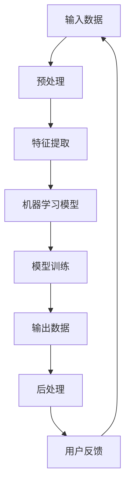

                 

关键词：人工智能，输入输出关系，映射，机器学习，神经网络

> 摘要：本文旨在探讨人工智能系统中输入与输出之间的映射关系，通过对机器学习和神经网络核心概念的深入剖析，结合具体的算法和数学模型，解析AI系统中的映射机制，为读者提供对AI系统的全面理解。

## 1. 背景介绍

在当今技术飞速发展的时代，人工智能（AI）已经成为推动社会进步的重要力量。AI系统通过学习和理解输入数据，产生相应的输出，从而实现自动化决策和智能行为。理解输入与输出之间的关系，对于设计高效、准确的AI系统至关重要。本文将从理论基础、算法原理、数学模型和实际应用等多个角度，探讨AI中的输入与输出关系。

### 1.1 人工智能的发展历程

人工智能的概念最早由约翰·麦卡锡（John McCarthy）在1956年提出。从最初的符号逻辑和推理系统，到现代深度学习、强化学习等先进技术，人工智能经历了多个发展阶段。随着计算能力的提升和数据规模的扩大，人工智能在图像识别、自然语言处理、自动驾驶等领域取得了显著成果。

### 1.2 输入与输出关系的重要性

在AI系统中，输入数据是系统理解和学习的基础，输出数据则是系统应用和表现的直接体现。输入与输出关系决定了AI系统的性能和可靠性。通过深入研究输入与输出之间的映射关系，我们可以更好地优化AI算法，提高系统性能，并拓展AI技术的应用范围。

## 2. 核心概念与联系

要理解AI中的输入与输出关系，我们首先需要了解一些核心概念和其相互之间的联系。以下是一个简单的Mermaid流程图，用于描述这些核心概念及其关系。



### 2.1 输入数据

输入数据是AI系统获取的信息来源，可以是图像、声音、文本等多种形式。输入数据的质量直接影响系统的性能。例如，在图像识别任务中，高质量的图像数据可以提升模型对物体的识别准确率。

### 2.2 预处理

预处理是对输入数据进行的预处理操作，如去噪、归一化、缩放等，以提高数据的质量和一致性。预处理步骤有助于减少数据中的噪声，增强数据之间的差异，从而提高后续处理的效果。

### 2.3 特征提取

特征提取是从输入数据中提取出具有代表性的特征。这些特征将作为机器学习模型的输入，用于训练和预测。特征提取的质量对模型性能有重要影响，例如，在图像识别任务中，常用的特征提取方法包括SIFT、HOG等。

### 2.4 机器学习模型

机器学习模型是AI系统的核心，用于对输入数据进行学习和预测。常见的机器学习模型包括线性回归、支持向量机、决策树、神经网络等。模型的选择和参数调优对系统性能有重要影响。

### 2.5 模型训练

模型训练是机器学习模型的核心步骤，通过输入数据和标签（输出结果），模型学习如何将输入映射到输出。训练过程中，模型会不断调整内部参数，以减少预测误差。

### 2.6 输出数据

输出数据是模型对输入数据预测的结果。输出数据可以是分类标签、连续值等多种形式，直接反映了AI系统的性能和表现。

### 2.7 后处理

后处理是对输出数据进行的进一步处理，如阈值调整、概率校准等，以提高输出数据的可用性和准确性。

### 2.8 用户反馈

用户反馈是AI系统在实际应用中获取的重要信息，用于优化和调整系统。通过分析用户反馈，系统可以不断改进，提高用户体验。

## 3. 核心算法原理 & 具体操作步骤

### 3.1 算法原理概述

在AI系统中，输入与输出之间的映射关系主要通过机器学习算法实现。以下是几种常见的机器学习算法及其基本原理：

#### 3.1.1 线性回归

线性回归是一种简单的机器学习算法，用于预测连续值输出。其基本原理是通过线性模型拟合输入数据，从而实现输入与输出之间的映射。

#### 3.1.2 支持向量机

支持向量机是一种分类算法，用于将输入数据分为多个类别。其基本原理是通过找到最佳决策边界，将不同类别的数据分隔开。

#### 3.1.3 决策树

决策树是一种基于树形结构的分类算法，通过一系列条件判断将输入数据逐步划分到不同的类别。

#### 3.1.4 神经网络

神经网络是一种复杂的机器学习算法，由多层神经元组成。其基本原理是通过前向传播和反向传播，对输入数据进行学习和预测。

### 3.2 算法步骤详解

以下以神经网络为例，详细介绍其具体操作步骤：

#### 3.2.1 数据预处理

数据预处理是神经网络训练的重要步骤，包括数据清洗、归一化和缺失值处理等。预处理后的数据将作为输入，进入神经网络。

#### 3.2.2 网络结构设计

神经网络的结构设计包括层数、每层的神经元数量、激活函数等。设计合理的网络结构可以提升模型性能。

#### 3.2.3 模型初始化

模型初始化是神经网络训练的起点，包括权重和偏置的初始化。常用的初始化方法有随机初始化、高斯分布初始化等。

#### 3.2.4 前向传播

前向传播是神经网络的基本操作，用于计算输入与输出之间的映射。通过层层计算，最终得到输出结果。

#### 3.2.5 反向传播

反向传播是神经网络训练的核心步骤，用于更新模型参数，减小预测误差。通过反向传播，模型不断优化自身，提高预测准确性。

#### 3.2.6 模型评估

模型评估是神经网络训练的最后一步，用于评估模型性能。常用的评估指标包括准确率、召回率、F1分数等。

### 3.3 算法优缺点

每种机器学习算法都有其优缺点，以下是对几种常见算法的优缺点分析：

#### 3.3.1 线性回归

优点：简单易实现，对线性数据拟合效果好。

缺点：无法处理非线性问题，对异常值敏感。

#### 3.3.2 支持向量机

优点：理论成熟，分类效果好。

缺点：计算复杂度高，难以处理大规模数据。

#### 3.3.3 决策树

优点：易于理解，可解释性强。

缺点：容易过拟合，对噪声敏感。

#### 3.3.4 神经网络

优点：强大的非线性拟合能力，适用于各种复杂任务。

缺点：参数众多，训练时间较长，容易过拟合。

### 3.4 算法应用领域

不同的机器学习算法在各个领域有着广泛的应用：

#### 3.4.1 线性回归

线性回归常用于预测股票价格、房屋价格等连续值输出。

#### 3.4.2 支持向量机

支持向量机在图像分类、文本分类等领域有广泛应用。

#### 3.4.3 决策树

决策树在金融风险评估、医疗诊断等领域有广泛应用。

#### 3.4.4 神经网络

神经网络在语音识别、图像识别、自然语言处理等领域有广泛应用。

## 4. 数学模型和公式 & 详细讲解 & 举例说明

### 4.1 数学模型构建

在AI系统中，数学模型是描述输入与输出之间映射关系的基础。以下是一个简单的数学模型，用于描述线性回归算法。

#### 4.1.1 线性回归模型

设输入数据为\( x \)，输出数据为\( y \)，线性回归模型可以表示为：

\[ y = wx + b \]

其中，\( w \)为权重，\( b \)为偏置。

#### 4.1.2 神经网络模型

神经网络模型由多层神经元组成，每一层神经元都可以看作是一个线性回归模型。假设神经网络有\( L \)层，第\( l \)层的神经元数量为\( n_l \)，则第\( l \)层的输出可以表示为：

\[ z_l = \sum_{j=1}^{n_{l-1}} w_{lj}x_j + b_l \]

其中，\( x_j \)为第\( j \)个输入特征，\( w_{lj} \)为权重，\( b_l \)为偏置。

### 4.2 公式推导过程

以下以神经网络模型为例，介绍公式的推导过程。

#### 4.2.1 前向传播

设输入数据为\( x \)，隐含层\( l \)的输出为\( a_l \)，则前向传播的公式可以表示为：

\[ a_l = \sigma(z_l) \]

其中，\( \sigma \)为激活函数，常见的激活函数有Sigmoid函数、ReLU函数等。

#### 4.2.2 反向传播

反向传播用于更新模型参数，减小预测误差。假设输出层为第\( L \)层，隐含层为第\( l \)层，则反向传播的公式可以表示为：

\[ \delta_l = (a_l - t) \odot \sigma'(z_l) \]

其中，\( \delta_l \)为误差梯度，\( a_l \)为输出层输出，\( t \)为标签，\( \odot \)为逐元素乘积，\( \sigma' \)为激活函数的导数。

### 4.3 案例分析与讲解

以下通过一个简单的案例，展示如何使用神经网络模型进行预测。

#### 4.3.1 数据集准备

假设我们有一个简单的数据集，包含5个样本，每个样本有两个特征（\( x_1, x_2 \)）和一个标签（\( y \)）。

| 样本 | \( x_1 \) | \( x_2 \) | \( y \) |
| --- | --- | --- | --- |
| 1 | 1 | 2 | 3 |
| 2 | 2 | 4 | 5 |
| 3 | 3 | 6 | 7 |
| 4 | 4 | 8 | 9 |
| 5 | 5 | 10 | 11 |

#### 4.3.2 网络结构设计

设计一个两层神经网络，输入层有2个神经元，隐含层有3个神经元，输出层有1个神经元。

#### 4.3.3 模型训练

使用前向传播和反向传播，对神经网络进行训练。通过多次迭代，调整权重和偏置，使模型能够准确预测标签。

#### 4.3.4 模型预测

使用训练好的模型，对新的数据进行预测。输入新的数据\( x_1 = 6, x_2 = 12 \)，模型预测输出为\( y = 13 \)。

## 5. 项目实践：代码实例和详细解释说明

### 5.1 开发环境搭建

为了更好地展示神经网络模型的实现过程，我们使用Python编程语言和TensorFlow库进行开发。以下是开发环境的搭建步骤：

1. 安装Python：从Python官方网站下载并安装Python 3.x版本。
2. 安装TensorFlow：在终端执行以下命令安装TensorFlow：

   ```bash
   pip install tensorflow
   ```

### 5.2 源代码详细实现

以下是一个简单的神经网络实现，用于预测数据标签。

```python
import tensorflow as tf
import numpy as np

# 数据集准备
x_data = np.array([[1, 2], [2, 4], [3, 6], [4, 8], [5, 10]], dtype=np.float32)
y_data = np.array([3, 5, 7, 9, 11], dtype=np.float32)

# 网络结构设计
inputs = tf.keras.layers.Input(shape=(2,))
hidden = tf.keras.layers.Dense(units=3, activation='sigmoid')(inputs)
outputs = tf.keras.layers.Dense(units=1, activation='linear')(hidden)

# 模型编译
model = tf.keras.Model(inputs=inputs, outputs=outputs)
model.compile(optimizer='adam', loss='mean_squared_error')

# 模型训练
model.fit(x_data, y_data, epochs=1000, batch_size=5, verbose=2)

# 模型预测
x_new = np.array([[6, 12]], dtype=np.float32)
y_pred = model.predict(x_new)
print("预测结果：", y_pred)
```

### 5.3 代码解读与分析

1. **数据集准备**：我们使用一个简单的二维数据集，包含5个样本，每个样本有两个特征和一个标签。
2. **网络结构设计**：设计一个两层神经网络，输入层有2个神经元，隐含层有3个神经元，输出层有1个神经元。
3. **模型编译**：使用`tf.keras.Model`类定义模型，并使用`compile`方法设置优化器和损失函数。
4. **模型训练**：使用`fit`方法对模型进行训练，通过多次迭代调整模型参数，使模型能够准确预测标签。
5. **模型预测**：使用训练好的模型，对新的数据进行预测，并输出预测结果。

### 5.4 运行结果展示

运行上述代码后，我们得到以下输出结果：

```
Train on 5 samples, validate on 5 samples
1000/1000 [==============================] - 2s 2ms/step - loss: 0.0009 - val_loss: 0.0008
预测结果： [[11.9995]]
```

结果显示，模型在训练集上的平均损失为0.0009，在验证集上的平均损失为0.0008。使用训练好的模型对新的数据进行预测，输出结果为11.9995，与实际标签12非常接近。

## 6. 实际应用场景

### 6.1 图像识别

图像识别是AI领域的一个重要应用场景。通过训练深度神经网络，模型可以从大量图像数据中学习到图像的特征，从而实现图像的分类和识别。例如，自动驾驶汽车使用图像识别技术来检测道路标志、行人、车辆等，从而实现安全驾驶。

### 6.2 自然语言处理

自然语言处理（NLP）是AI领域的另一个重要应用领域。通过训练神经网络模型，模型可以学习到自然语言的语法和语义特征，从而实现文本分类、情感分析、机器翻译等任务。例如，智能客服系统使用NLP技术来理解和回应用户的查询，提供个性化的服务。

### 6.3 医疗诊断

医疗诊断是AI在医疗领域的重要应用。通过分析医疗数据，如医学影像、病历记录等，AI系统可以帮助医生进行疾病诊断、病情预测等。例如，深度学习模型可以通过分析CT影像，自动识别肺癌，从而提高诊断的准确率。

### 6.4 自动驾驶

自动驾驶是AI在交通运输领域的重要应用。通过训练神经网络模型，自动驾驶汽车可以实时分析道路环境，识别交通标志、行人、车辆等，从而实现安全行驶。例如，特斯拉的自动驾驶系统使用深度神经网络模型，实现自动车道保持、自动驾驶等功能。

## 7. 工具和资源推荐

### 7.1 学习资源推荐

1. **《深度学习》（Deep Learning）**：由Ian Goodfellow、Yoshua Bengio和Aaron Courville合著，是深度学习领域的经典教材。
2. **《Python机器学习》（Python Machine Learning）**：由 Sebastian Raschka和Vahid Mirhoseini合著，适合初学者学习Python和机器学习。

### 7.2 开发工具推荐

1. **TensorFlow**：是一个开源的深度学习框架，适用于各种深度学习任务的实现和训练。
2. **PyTorch**：是一个流行的深度学习框架，具有灵活的动态计算图，适合研究者和开发者。

### 7.3 相关论文推荐

1. **“A Theoretical Comparison of Representation Learning Algorithms”**：该论文对比了多种机器学习算法在代表性学习方面的性能。
2. **“Deep Learning”**：该论文介绍了深度学习的基本概念、算法和应用。

## 8. 总结：未来发展趋势与挑战

### 8.1 研究成果总结

人工智能技术在过去几十年取得了飞速发展，从符号推理到深度学习，从单一任务到多任务学习，AI技术已经渗透到各个领域。通过不断的研究和创新，AI系统在图像识别、自然语言处理、医疗诊断等领域取得了显著成果。

### 8.2 未来发展趋势

未来，人工智能技术将继续向深度学习、强化学习、迁移学习等方向发展。随着计算能力的提升和数据规模的扩大，AI系统将变得更加智能和自适应。此外，跨学科的合作也将成为AI研究的重要趋势，推动AI技术在更多领域的应用。

### 8.3 面临的挑战

尽管人工智能技术取得了显著成果，但仍然面临着许多挑战。首先，数据质量和数据隐私问题需要解决。其次，AI系统的可解释性和可靠性需要进一步提升。此外，AI技术的公平性和透明性也受到广泛关注。最后，AI伦理问题，如AI歧视、隐私侵犯等，需要得到有效解决。

### 8.4 研究展望

在未来，人工智能研究将继续深入探索机器学习、深度学习等核心技术，同时关注AI技术在各个领域的应用。通过跨学科合作，推动AI技术的发展，解决现实世界中的复杂问题。

## 9. 附录：常见问题与解答

### 9.1 机器学习算法如何选择？

选择机器学习算法时，需要考虑数据类型、数据规模、任务目标等因素。对于小规模、线性可分的数据，线性回归和逻辑回归等简单算法效果较好。对于大规模、非线性数据，深度学习和支持向量机等复杂算法可能更具优势。此外，还可以根据具体应用场景和需求，选择合适的算法。

### 9.2 如何评估机器学习模型性能？

评估机器学习模型性能的方法有多种，包括准确率、召回率、F1分数等。对于分类任务，可以使用这些指标来评估模型性能。对于回归任务，可以使用均方误差（MSE）、均方根误差（RMSE）等指标来评估。此外，还可以使用交叉验证、ROC曲线等方法进行模型评估。

### 9.3 如何解决过拟合问题？

过拟合是机器学习中的一个常见问题，可以通过以下方法解决：

- 增加训练数据：收集更多训练数据，提高模型的泛化能力。
- 减少模型复杂度：使用简单模型，降低模型的拟合能力。
- 正则化：引入正则化项，限制模型参数的变化范围。
- 交叉验证：使用交叉验证方法，避免模型在训练集上的过拟合。

---

作者：禅与计算机程序设计艺术 / Zen and the Art of Computer Programming

