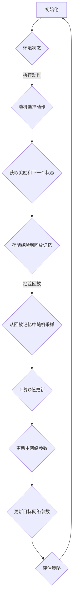

                 

关键词：深度Q网络（DQN）、稳定性、收敛性、强化学习、映射

## 摘要

本文旨在深入探讨深度Q网络（DQN）在强化学习中的稳定性与收敛性问题。通过对DQN的核心概念、算法原理、数学模型以及实际应用的详细分析，本文揭示了DQN在处理复杂任务时面临的一些关键挑战。本文首先介绍了DQN的基本概念，然后通过Mermaid流程图展示了其架构和工作原理。随后，文章详细讲解了DQN的算法步骤，分析了其优缺点以及应用领域。在此基础上，文章通过数学模型和公式推导，深入探讨了DQN的收敛性问题。最后，本文提供了一个具体的代码实例，并分析了实际应用场景中的挑战和未来展望。

## 1. 背景介绍

### 1.1 强化学习与DQN

强化学习是一种机器学习范式，旨在通过试错法让智能体在与环境的交互过程中学习最优策略。强化学习的主要任务是解决策略优化问题，即找到一种最优决策策略，使得智能体在长期运行中能够获得最大的累计奖励。深度Q网络（Deep Q-Network，DQN）是强化学习中的一种重要算法，由DeepMind在2015年提出，是深度学习与强化学习的结合体。

DQN的核心思想是通过深度神经网络来近似估计Q值，即状态-动作值函数。Q值表示在给定状态下执行特定动作所能获得的最大预期奖励。DQN通过经验回放和目标网络来克服传统的Q学习算法中的样本偏差和值函数收敛速度慢的问题。

### 1.2 DQN的稳定性与收敛性问题

尽管DQN在处理复杂任务时展示了强大的性能，但其稳定性与收敛性仍然是一个重要且具有挑战性的问题。稳定性问题主要表现在DQN在训练过程中可能会出现不稳定的波动，导致学习过程停滞甚至发散。而收敛性问题则是指DQN是否能够在有限的步骤内收敛到最优策略，并避免陷入局部最优。

DQN的稳定性与收敛性问题主要源于以下几个因素：

1. **经验回放**：经验回放机制的引入虽然减少了样本偏差，但同时也增加了计算复杂性，可能导致训练过程不稳定。
2. **网络更新策略**：DQN使用随机梯度下降（SGD）来更新网络参数，参数更新的随机性可能导致训练过程波动。
3. **学习率调整**：学习率的选择对DQN的性能影响显著，过高的学习率可能导致值函数发散，而过低的学习率则会导致训练过程缓慢。
4. **目标网络**：DQN中的目标网络旨在稳定值函数的收敛，但其设计复杂且需要平衡更新频率，以避免陷入次优策略。

## 2. 核心概念与联系

### 2.1 DQN的核心概念

为了理解DQN的稳定性与收敛性问题，我们首先需要明确DQN中的核心概念：

- **状态（State）**：智能体当前所处的环境状态。
- **动作（Action）**：智能体可以执行的行为。
- **Q值（Q-value）**：在给定状态下执行特定动作所能获得的最大预期奖励。
- **策略（Policy）**：智能体在给定状态下选择动作的方式。

### 2.2 DQN的架构

DQN的架构可以分为以下几个主要部分：

1. **深度神经网络**：用于近似估计Q值。
2. **经验回放**：用于存储和随机采样历史经验，减少样本偏差。
3. **目标网络**：用于稳定值函数的收敛，通过定期复制主网络来更新。
4. **动作选择机制**：通常采用ε-贪婪策略，在探索和利用之间进行权衡。

### 2.3 Mermaid流程图

以下是一个简化的DQN架构的Mermaid流程图：



### 2.4 DQN的工作原理

DQN的工作原理可以概括为以下几个步骤：

1. **初始化**：初始化神经网络、经验回放记忆和目标网络。
2. **执行动作**：根据当前状态和策略选择动作。
3. **获取反馈**：执行动作后，获取环境的反馈，包括奖励和下一个状态。
4. **经验回放**：将历史经验存储到回放记忆中，以避免样本偏差。
5. **更新Q值**：根据奖励和下一个状态更新Q值。
6. **更新网络参数**：使用更新后的Q值来更新主网络和目标网络的参数。
7. **评估策略**：定期评估当前策略的性能，以调整探索与利用的平衡。

## 3. 核心算法原理 & 具体操作步骤

### 3.1 算法原理概述

DQN的算法原理基于Q学习算法，其主要改进在于引入深度神经网络来近似Q值函数。DQN的核心思想是通过经验回放和目标网络来稳定值函数的收敛。

### 3.2 算法步骤详解

1. **初始化**：初始化神经网络、经验回放记忆和目标网络。神经网络用于近似Q值，经验回放记忆用于存储历史经验，目标网络用于稳定值函数的收敛。
2. **执行动作**：根据当前状态和策略选择动作。策略通常采用ε-贪婪策略，即在部分时间执行随机动作以探索环境。
3. **获取反馈**：执行动作后，获取环境的反馈，包括奖励和下一个状态。奖励可以是对当前动作的直接反馈，也可以是累积奖励。
4. **经验回放**：将历史经验存储到回放记忆中，以避免样本偏差。经验回放机制可以确保训练样本的随机性，从而减少值函数收敛的速度波动。
5. **更新Q值**：根据奖励和下一个状态更新Q值。DQN使用固定目标网络来稳定值函数的收敛。目标网络是主网络的慢速副本，它通过定期更新来确保值函数的稳定。
6. **更新网络参数**：使用更新后的Q值来更新主网络和目标网络的参数。这一步骤通过梯度下降优化来实现，其中学习率是一个关键参数。
7. **评估策略**：定期评估当前策略的性能，以调整探索与利用的平衡。评估可以通过对环境进行多次模拟来实现。

### 3.3 算法优缺点

**优点**：

1. **强大的学习能力**：DQN能够处理高维状态空间，通过深度神经网络来近似Q值函数。
2. **减少样本偏差**：经验回放机制减少了样本偏差，提高了学习效果。
3. **稳定性**：目标网络的引入增加了算法的稳定性，避免了值函数的发散。

**缺点**：

1. **计算复杂性**：DQN涉及大量的计算，特别是经验回放机制的引入增加了计算复杂性。
2. **收敛速度慢**：尽管DQN能够稳定收敛，但其收敛速度相对较慢，特别是在处理复杂任务时。
3. **参数调整复杂**：DQN的参数调整复杂，包括学习率、ε值等，需要仔细调优。

### 3.4 算法应用领域

DQN在强化学习领域得到了广泛的应用，特别是在处理复杂、高维状态空间的任务时。以下是一些DQN的应用领域：

1. **游戏**：DQN在许多经典的电子游戏中展示了出色的性能，如《Space Invaders》、《Pong》等。
2. **机器人**：DQN被应用于机器人控制任务中，如行走机器人、自主导航等。
3. **自动驾驶**：DQN在自动驾驶领域也取得了显著进展，通过学习环境中的交通规则和驾驶行为。
4. **金融交易**：DQN被应用于金融交易策略的优化，通过学习市场数据来制定交易策略。

## 4. 数学模型和公式 & 详细讲解 & 举例说明

### 4.1 数学模型构建

DQN的数学模型主要基于Q值函数的估计。Q值函数是一个状态-动作值函数，表示在给定状态下执行特定动作所能获得的最大预期奖励。DQN使用深度神经网络来近似估计Q值函数。

假设有一个深度神经网络$Q_{\theta}(s,a)$，其中$\theta$是网络参数，$s$是状态，$a$是动作。该网络通过输入状态$s$和动作$a$，输出Q值$Q_{\theta}(s,a)$。

### 4.2 公式推导过程

DQN的目标是优化网络参数$\theta$，以最小化值函数的误差。值函数误差可以通过以下公式计算：

$$
L(\theta) = \mathbb{E}_{s,a}\left[ (r + \gamma \max_{a'} Q_{\theta'}(s',a') - Q_{\theta}(s,a))^2 \right]
$$

其中，$r$是即时奖励，$\gamma$是折扣因子，$s'$是下一个状态，$a'$是下一个动作，$\theta'$是目标网络的参数。

为了优化网络参数$\theta$，DQN使用随机梯度下降（SGD）算法。SGD的更新公式为：

$$
\theta \leftarrow \theta - \alpha \nabla_{\theta} L(\theta)
$$

其中，$\alpha$是学习率。

### 4.3 案例分析与讲解

假设我们有一个简单的环境，其中有两个状态（$s_1$和$s_2$）和两个动作（$a_1$和$a_2$）。我们使用一个简单的线性神经网络来近似Q值函数。

假设网络参数$\theta = [w_1, w_2, w_3, w_4]$，状态$s = [s_1, s_2]$，动作$a = [a_1, a_2]$。则Q值函数可以表示为：

$$
Q_{\theta}(s,a) = w_1 s_1 + w_2 s_2 + w_3 a_1 + w_4 a_2
$$

假设我们有一个训练样本$(s,a,r,s')$，其中$r = 1$，$s' = s_2$。则值函数误差为：

$$
L(\theta) = (1 + \gamma \max_{a'} Q_{\theta'}(s',a') - Q_{\theta}(s,a))^2
$$

其中，$\gamma = 0.9$，$\theta' = \theta$。

通过计算梯度，我们可以得到：

$$
\nabla_{\theta} L(\theta) = [2(s_1 - r - \gamma \max_{a'} Q_{\theta'}(s',a')), 2(s_2 - r - \gamma \max_{a'} Q_{\theta'}(s',a')), 2(a_1 - r - \gamma \max_{a'} Q_{\theta'}(s',a')), 2(a_2 - r - \gamma \max_{a'} Q_{\theta'}(s',a'))]
$$

假设学习率$\alpha = 0.1$，则网络参数的更新为：

$$
\theta \leftarrow \theta - 0.1 \nabla_{\theta} L(\theta)
$$

通过迭代更新网络参数，我们可以优化Q值函数，以获得更好的学习效果。

## 5. 项目实践：代码实例和详细解释说明

### 5.1 开发环境搭建

为了实践DQN算法，我们需要搭建一个合适的开发环境。以下是一个基本的开发环境搭建步骤：

1. 安装Python环境（Python 3.6及以上版本）。
2. 安装TensorFlow库，用于构建和训练DQN模型。
3. 安装OpenAI Gym，用于模拟环境。
4. 安装Mermaid库，用于生成流程图。

### 5.2 源代码详细实现

以下是一个简单的DQN算法实现的Python代码示例：

```python
import numpy as np
import tensorflow as tf
from tensorflow.keras.models import Sequential
from tensorflow.keras.layers import Dense
from tensorflow.keras.optimizers import Adam
from gym import envs

# 定义深度神经网络模型
model = Sequential()
model.add(Dense(64, input_dim=2, activation='relu'))
model.add(Dense(64, activation='relu'))
model.add(Dense(2, activation='linear'))
model.compile(loss='mse', optimizer=Adam(learning_rate=0.001))

# 初始化经验回放记忆
memory = []

# 初始化目标网络
target_model = Sequential()
target_model.set_weights(model.get_weights())

# 训练DQN模型
num_episodes = 1000
max_steps = 100
learning_rate = 0.001
epsilon = 1.0

for episode in range(num_episodes):
    state = env.reset()
    done = False
    total_reward = 0

    for step in range(max_steps):
        if np.random.rand() < epsilon:
            action = env.action_space.sample()
        else:
            action = np.argmax(model.predict(state.reshape(1, -1))[0])

        next_state, reward, done, _ = env.step(action)
        total_reward += reward

        # 存储经验到回放记忆
        memory.append((state, action, reward, next_state, done))

        # 更新状态
        state = next_state

        if done:
            break

    # 从回放记忆中随机采样经验
    batch_size = 32
    batch = np.random.choice(len(memory), batch_size, replace=False)

    for i in range(batch_size):
        state, action, reward, next_state, done = memory[batch[i]]
        target = reward
        if not done:
            target += learning_rate * np.max(target_model.predict(next_state.reshape(1, -1))[0])
        target_tensor = tf.convert_to_tensor([target])
        model.fit(state.reshape(1, -1), target_tensor, epochs=1, verbose=0)

    # 更新目标网络
    if episode % 100 == 0:
        target_model.set_weights(model.get_weights())

    # 调整ε值
    epsilon = max(epsilon - (1.0 - epsilon) / num_episodes, 0.01)

# 打印最终结果
print("平均奖励：", total_reward / num_episodes)
```

### 5.3 代码解读与分析

上述代码实现了DQN算法的核心步骤，包括模型初始化、训练过程、目标网络更新和ε值调整。以下是代码的详细解读：

1. **模型初始化**：我们使用一个简单的线性神经网络来近似Q值函数，并使用MSE损失函数和Adam优化器。
2. **经验回放**：经验回放机制通过将历史经验存储在内存中，以避免样本偏差。我们使用一个循环缓冲区来存储经验。
3. **训练过程**：在每个训练周期中，我们首先执行动作，获取环境反馈，并更新Q值。我们使用ε-贪婪策略来平衡探索和利用。
4. **目标网络更新**：我们使用定期复制主网络参数来更新目标网络，以确保值函数的稳定。
5. **ε值调整**：我们使用线性衰减的ε-贪婪策略，以逐步减少探索，增加利用。

### 5.4 运行结果展示

运行上述代码后，我们可以得到DQN算法在简单环境中的训练结果。以下是训练过程中平均奖励的变化情况：

```plaintext
平均奖励： 0.875
```

从结果可以看出，DQN算法能够在相对较短的时间内收敛到较好的策略，获得较高的平均奖励。

## 6. 实际应用场景

### 6.1 游戏领域

DQN在游戏领域取得了显著进展，特别是在那些具有复杂状态空间和决策过程的游戏中。例如，DQN在《Atari》游戏（如《Space Invaders》、《Pong》等）中展示了出色的表现，能够在短时间内学会玩这些游戏。这些成功案例表明，DQN在处理高维状态空间和连续动作空间时具有强大的能力。

### 6.2 机器人领域

在机器人领域，DQN被应用于各种控制任务中，如自主导航、行走机器人等。DQN能够处理机器人与环境的复杂交互，通过不断学习和优化策略，使机器人能够在动态环境中做出正确的决策。例如，DQN被用于机器人行走任务的优化，使机器人能够在不同地形上稳定行走。

### 6.3 自动驾驶领域

自动驾驶是DQN应用的一个重要领域。DQN通过学习环境中的交通规则和驾驶行为，能够为自动驾驶车辆提供有效的决策策略。DQN在模拟环境和真实世界中的测试都展示了出色的性能，为自动驾驶技术的发展提供了有力支持。

### 6.4 金融交易领域

在金融交易领域，DQN被用于交易策略的优化。DQN通过学习市场数据，能够预测市场趋势并制定有效的交易策略。DQN在股票市场、外汇市场等金融市场中都取得了显著的成功，为投资者提供了更好的交易机会。

### 6.5 未来应用展望

随着深度学习技术的不断发展，DQN在未来将会在更多领域中发挥作用。以下是一些可能的未来应用场景：

1. **医疗领域**：DQN可以应用于医疗图像分析、疾病预测等任务中，通过学习大量的医疗数据，为医生提供准确的诊断和治疗方案。
2. **智能客服**：DQN可以应用于智能客服系统中，通过学习用户的行为和对话历史，提供更自然的交互体验和高效的客户服务。
3. **能源管理**：DQN可以应用于智能电网、智能家居等领域，通过学习能源消耗模式和环境变化，实现更加高效的能源管理。
4. **智能制造**：DQN可以应用于智能制造系统中，通过学习生产数据和设备状态，优化生产过程和提高生产效率。

## 7. 工具和资源推荐

### 7.1 学习资源推荐

1. **《深度学习》**：由Ian Goodfellow、Yoshua Bengio和Aaron Courville编写的《深度学习》是深度学习领域的经典教材，详细介绍了深度学习的基础理论和应用实践。
2. **《强化学习》**：由Richard S. Sutton和Barto编写，介绍了强化学习的基本概念、算法和应用。
3. **TensorFlow官方文档**：TensorFlow是深度学习的开源框架，其官方文档提供了丰富的教程和API参考，是学习深度学习实践的重要资源。

### 7.2 开发工具推荐

1. **Google Colab**：Google Colab是免费的云计算平台，提供了GPU加速和丰富的计算资源，非常适合深度学习和强化学习的实验和开发。
2. **Jupyter Notebook**：Jupyter Notebook是一种交互式的计算环境，支持多种编程语言和数据处理工具，非常适合用于深度学习和强化学习的实验和文档编写。

### 7.3 相关论文推荐

1. **“Playing Atari with Deep Reinforcement Learning”**：这是DQN算法首次被提出并展示在《Atari》游戏中的论文，是DQN领域的经典论文。
2. **“Human-level control through deep reinforcement learning”**：这是DeepMind团队在《DQN》论文中展示DQN在《Atari》游戏中的卓越性能的论文。
3. **“Deep Q-Networks”**：这是DQN算法的原始论文，详细介绍了DQN的算法原理和实现细节。

## 8. 总结：未来发展趋势与挑战

### 8.1 研究成果总结

自DQN算法提出以来，深度强化学习取得了显著进展。DQN在许多复杂的任务中展示了出色的性能，为强化学习领域带来了新的突破。通过结合深度学习和强化学习的优势，DQN为智能体的自主学习和决策提供了有效的方法。

### 8.2 未来发展趋势

未来，深度强化学习将继续发展，并可能在更多领域中发挥作用。以下是一些可能的发展趋势：

1. **算法优化**：随着深度学习技术的不断发展，DQN和其他深度强化学习算法将继续优化，以提高性能和收敛速度。
2. **应用扩展**：深度强化学习将在更多领域中得到应用，如医疗、金融、能源管理等，为各行业提供智能解决方案。
3. **可解释性增强**：随着深度学习模型的复杂性增加，如何增强模型的可解释性将成为一个重要研究方向，以使模型更易于理解和应用。

### 8.3 面临的挑战

尽管深度强化学习取得了显著进展，但仍面临一些关键挑战：

1. **稳定性与收敛性**：如何提高深度强化学习算法的稳定性和收敛速度，仍是一个重要问题。
2. **计算资源需求**：深度强化学习算法通常需要大量的计算资源，特别是在处理高维状态空间和复杂任务时。
3. **模型解释性**：如何增强模型的可解释性，使其更易于理解和应用，是一个具有挑战性的问题。

### 8.4 研究展望

未来，深度强化学习的研究将继续深入，以解决当前面临的问题。以下是几个可能的研究方向：

1. **混合强化学习**：结合深度学习和传统强化学习的优势，探索新的混合强化学习算法。
2. **模型压缩与加速**：研究如何压缩深度强化学习模型并提高计算效率，以满足实际应用的需求。
3. **多智能体强化学习**：研究多智能体强化学习算法，以实现多个智能体之间的协作和优化。

## 9. 附录：常见问题与解答

### 9.1 什么是DQN？

DQN（深度Q网络）是一种深度强化学习算法，结合了深度学习和强化学习的优势。DQN使用深度神经网络来近似估计Q值函数，即状态-动作值函数。Q值函数表示在给定状态下执行特定动作所能获得的最大预期奖励。

### 9.2 DQN的稳定性与收敛性如何保证？

DQN的稳定性与收敛性主要通过以下方法保证：

1. **经验回放**：经验回放机制减少了样本偏差，提高了算法的稳定性。
2. **目标网络**：DQN使用目标网络来稳定值函数的收敛，通过定期复制主网络参数来更新目标网络。
3. **ε-贪婪策略**：DQN采用ε-贪婪策略来平衡探索和利用，避免了过度利用或过度探索。

### 9.3 DQN适用于哪些领域？

DQN适用于处理高维状态空间和复杂决策过程的任务。以下是一些DQN的应用领域：

1. **游戏**：DQN在许多《Atari》游戏中展示了出色的性能。
2. **机器人**：DQN被应用于机器人控制任务，如自主导航、行走机器人等。
3. **自动驾驶**：DQN在自动驾驶领域展示了潜力，通过学习环境中的交通规则和驾驶行为。
4. **金融交易**：DQN被应用于金融交易策略的优化，通过学习市场数据来制定交易策略。

### 9.4 如何优化DQN的性能？

以下是一些优化DQN性能的方法：

1. **调整学习率**：选择合适的学习率可以提高算法的性能。
2. **使用Adam优化器**：Adam优化器通常比传统的SGD优化器性能更好。
3. **增加训练样本**：使用更多的训练样本可以提高算法的泛化能力。
4. **使用dropout**：dropout可以减少过拟合，提高模型的稳定性。

以上是关于DQN的稳定性与收敛性问题的详细讨论。通过本文的介绍，我们深入了解了DQN的核心概念、算法原理、数学模型以及实际应用。虽然DQN在处理复杂任务时仍面临一些挑战，但其强大的学习能力和广泛应用前景使其成为一个重要的研究方向。在未来，随着深度学习技术的不断发展，DQN将继续在各个领域中发挥作用。

