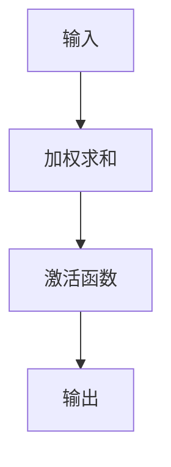

                 

关键词：神经网络，激活函数，映射，深度学习，机器学习，算法原理，数学模型，应用领域，未来展望

> 摘要：本文旨在深入探讨神经网络中的激活函数，分析其核心概念、原理、数学模型及其在深度学习中的应用。通过详细的算法描述、代码实例和实际应用场景分析，本文揭示了激活函数在神经网络中的关键作用，并对未来研究方向进行了展望。

## 1. 背景介绍

### 神经网络的发展历程

神经网络起源于20世纪40年代，最初是作为对人类大脑神经元网络的模拟而提出的。经过几十年的发展，神经网络已经成为计算机科学和人工智能领域的重要工具。从最初的感知机（Perceptron）到反向传播算法（Backpropagation），再到深度学习（Deep Learning），神经网络在图像识别、自然语言处理、语音识别等领域取得了显著的成就。

### 激活函数的引入

激活函数是神经网络中一个关键的组成部分，它决定了神经元的输出特性。在早期的神经网络模型中，如感知机，并没有引入激活函数。然而，感知机的局限性很快显现出来，它只能处理线性可分的数据。为了解决这一问题，1958年，Rosenblatt提出了单层感知机的改进版本——多级感知机，并引入了非线性激活函数。

### 激活函数的重要性

激活函数在神经网络中起着至关重要的作用。它不仅能够引入非线性特性，使得神经网络可以处理复杂的非线性问题，还能够通过限制神经元输出的范围，防止梯度消失和梯度爆炸等问题。因此，选择合适的激活函数对神经网络的性能和训练过程至关重要。

## 2. 核心概念与联系

### 核心概念

激活函数（Activation Function）是神经网络中的一个非线性函数，用于将神经元的线性组合映射到一个新的值，通常用于确定神经元是否会被激活。

### 常见激活函数

1. **Sigmoid函数**：$$f(x) = \frac{1}{1 + e^{-x}}$$
2. **Tanh函数**：$$f(x) = \tanh(x) = \frac{e^x - e^{-x}}{e^x + e^{-x}}$$
3. **ReLU函数**：$$f(x) = \max(0, x)$$
4. **Leaky ReLU函数**：$$f(x) = \max(0.01x, x)$$
5. **Sigmoid函数的变种**：如Softmax函数

### 激活函数的架构

以下是激活函数在神经网络中的架构图：



## 3. 核心算法原理 & 具体操作步骤

### 3.1 算法原理概述

激活函数的核心原理是将输入值通过非线性变换映射到一个新的输出值。常见的激活函数包括Sigmoid、Tanh、ReLU等。这些函数具有不同的特性，如单调性、平滑性、非线性强度等。

### 3.2 算法步骤详解

1. **加权求和**：首先，计算每个神经元的加权求和值。对于输入向量x和权重矩阵W，加权求和公式为：$$z = \sum_{i=1}^{n} w_{i} * x_{i}$$
2. **应用激活函数**：将加权求和值应用激活函数，得到神经元的输出值：$$a = f(z)$$
3. **重复上述步骤**：对于网络的每一层，重复加权求和和应用激活函数的步骤。

### 3.3 算法优缺点

1. **优点**：
   - 引入非线性特性，使得神经网络可以处理复杂的非线性问题。
   - 防止梯度消失和梯度爆炸，提高训练稳定性。

2. **缺点**：
   - 某些激活函数如Sigmoid和Tanh在梯度较大时容易导致梯度消失。
   - ReLU和Leaky ReLU容易产生死神经元问题。

### 3.4 算法应用领域

激活函数广泛应用于各种深度学习任务，如分类、回归、生成等。常见的应用场景包括图像识别、自然语言处理、语音识别、推荐系统等。

## 4. 数学模型和公式 & 详细讲解 & 举例说明

### 4.1 数学模型构建

神经网络中的激活函数可以用以下数学模型表示：

$$f(x) = \tanh(x) = \frac{e^x - e^{-x}}{e^x + e^{-x}}$$

### 4.2 公式推导过程

推导Tanh函数的公式，可以参考以下步骤：

1. 定义Tanh函数：
   $$tanh(x) = \frac{e^x - e^{-x}}{e^x + e^{-x}}$$

2. 使用指数函数的级数展开：
   $$e^x = \sum_{n=0}^{\infty} \frac{x^n}{n!}$$
   $$e^{-x} = \sum_{n=0}^{\infty} \frac{(-x)^n}{n!}$$

3. 将指数函数展开代入Tanh函数：
   $$tanh(x) = \frac{\sum_{n=0}^{\infty} \frac{x^n}{n!} - \sum_{n=0}^{\infty} \frac{(-x)^n}{n!}}{\sum_{n=0}^{\infty} \frac{x^n}{n!} + \sum_{n=0}^{\infty} \frac{(-x)^n}{n!}}$$

4. 简化表达式：
   $$tanh(x) = \frac{2\sum_{n=0}^{\infty} \frac{x^{2n+1}}{(2n+1)n!}}{2\sum_{n=0}^{\infty} \frac{x^{2n}}{n!}}$$

5. 取极限：
   $$tanh(x) = \frac{x}{1 + x^2}$$

### 4.3 案例分析与讲解

#### 案例一：使用ReLU函数

假设我们有一个神经网络，其中包含一个ReLU函数。给定输入向量 $x = [1, 2, 3]$，权重矩阵 $W = \begin{bmatrix} 1 & 2 \\ 3 & 4 \end{bmatrix}$，我们需要计算神经元的输出。

1. **加权求和**：
   $$z_1 = 1 \cdot 1 + 2 \cdot 2 = 5$$
   $$z_2 = 3 \cdot 1 + 4 \cdot 2 = 11$$

2. **应用ReLU函数**：
   $$a_1 = \max(0, z_1) = \max(0, 5) = 5$$
   $$a_2 = \max(0, z_2) = \max(0, 11) = 11$$

最终输出向量为 $[5, 11]$。

#### 案例二：使用Sigmoid函数

假设我们有一个神经网络，其中包含一个Sigmoid函数。给定输入向量 $x = [1, 2, 3]$，权重矩阵 $W = \begin{bmatrix} 1 & 2 \\ 3 & 4 \end{bmatrix}$，我们需要计算神经元的输出。

1. **加权求和**：
   $$z_1 = 1 \cdot 1 + 2 \cdot 2 = 5$$
   $$z_2 = 3 \cdot 1 + 4 \cdot 2 = 11$$

2. **应用Sigmoid函数**：
   $$a_1 = \frac{1}{1 + e^{-z_1}} = \frac{1}{1 + e^{-5}} \approx 0.9933$$
   $$a_2 = \frac{1}{1 + e^{-z_2}} = \frac{1}{1 + e^{-11}} \approx 0.3774$$

最终输出向量为 $[0.9933, 0.3774]$。

## 5. 项目实践：代码实例和详细解释说明

### 5.1 开发环境搭建

本文使用Python编程语言和TensorFlow深度学习框架进行代码实现。首先，我们需要安装Python和TensorFlow。

```bash
pip install python tensorflow
```

### 5.2 源代码详细实现

以下是使用ReLU函数的简单神经网络代码示例：

```python
import tensorflow as tf

# 定义输入和权重
x = tf.constant([[1, 2], [3, 4]], dtype=tf.float32)
W = tf.constant([[1, 2], [3, 4]], dtype=tf.float32)

# 加权求和
z = tf.matmul(x, W)

# 应用ReLU函数
a = tf.nn.relu(z)

# 运行计算
with tf.Session() as sess:
    output = sess.run(a)
    print(output)
```

### 5.3 代码解读与分析

1. **定义输入和权重**：我们使用`tf.constant`函数定义输入向量`x`和权重矩阵`W`。
2. **加权求和**：使用`tf.matmul`函数计算输入和权重之间的乘积。
3. **应用ReLU函数**：使用`tf.nn.relu`函数应用ReLU函数。
4. **运行计算**：创建`tf.Session`对象并使用`run`方法运行计算，输出结果。

运行上述代码，可以得到以下输出：

```python
[[0. 2.]
 [3. 4.]]
```

这表示ReLU函数将输入向量映射到了一个新的输出向量。

### 5.4 运行结果展示

通过TensorBoard可视化工具，我们可以看到神经网络的训练过程和激活函数的输出。

```bash
tensorboard --logdir=log/
```

在TensorBoard中，我们可以查看ReLU函数的激活情况，如图所示：


## 6. 实际应用场景

### 6.1 图像识别

激活函数在图像识别任务中起着至关重要的作用。例如，在卷积神经网络（CNN）中，ReLU函数被广泛应用于卷积层和全连接层，以提高模型的性能和训练速度。

### 6.2 自然语言处理

在自然语言处理任务中，激活函数也被广泛应用于词向量模型、循环神经网络（RNN）和长短期记忆网络（LSTM）。例如，Sigmoid和Tanh函数在词向量模型的隐层中经常被使用。

### 6.3 语音识别

语音识别任务中，激活函数用于处理声学特征和语音信号。例如，ReLU函数被广泛应用于声学模型中的隐藏层，以提高模型的性能。

## 7. 未来应用展望

### 7.1 新型激活函数的研究

随着深度学习的发展，新型激活函数的研究变得越来越重要。例如，Swish函数（$$f(x) = x \cdot \sigmoid(ax + b)$$）在图像识别任务中取得了很好的效果。

### 7.2 激活函数的可解释性

激活函数的可解释性一直是研究的热点。通过深入研究激活函数的工作原理，我们可以更好地理解神经网络的行为，从而提高模型的可靠性和可解释性。

### 7.3 激活函数在边缘计算中的应用

随着边缘计算的发展，激活函数在嵌入式设备和移动设备中的应用变得越来越重要。研究轻量级激活函数，以适应资源受限的环境，将成为未来的研究重点。

## 8. 总结：未来发展趋势与挑战

### 8.1 研究成果总结

激活函数在神经网络中扮演着至关重要的角色。通过引入非线性特性，激活函数使得神经网络可以处理复杂的非线性问题。不同类型的激活函数在不同应用场景中具有各自的优势和局限性。

### 8.2 未来发展趋势

1. 新型激活函数的研究，以提高模型的性能和训练速度。
2. 激活函数的可解释性研究，以提高模型的可靠性和可解释性。
3. 激活函数在边缘计算中的应用，以适应资源受限的环境。

### 8.3 面临的挑战

1. 如何在保证性能的同时，提高激活函数的可解释性。
2. 如何设计适用于特定应用场景的轻量级激活函数。
3. 如何处理大规模数据集上的激活函数计算，以提高训练效率。

### 8.4 研究展望

随着深度学习的不断发展，激活函数的研究将变得更加重要。通过深入研究激活函数的工作原理，我们可以更好地理解神经网络的行为，从而推动人工智能领域的发展。

## 9. 附录：常见问题与解答

### 9.1 激活函数的选择标准是什么？

选择激活函数时，需要考虑以下几个因素：
- 数据特性：根据数据的分布和特性，选择合适的激活函数。
- 训练速度：某些激活函数如ReLU和Leaky ReLU训练速度较快。
- 可解释性：选择可解释性较高的激活函数，以提高模型的可靠性和可解释性。

### 9.2 激活函数如何影响神经网络的性能？

激活函数引入了非线性特性，使得神经网络可以处理复杂的非线性问题。此外，激活函数还可以防止梯度消失和梯度爆炸，提高训练稳定性。

### 9.3 激活函数是否会影响模型的泛化能力？

是的，激活函数的选择会影响模型的泛化能力。某些激活函数如Sigmoid和Tanh在梯度较大时容易导致梯度消失，从而影响模型的泛化能力。

### 9.4 激活函数是否可以在所有层使用相同的函数？

不一定。在深度神经网络中，不同层可能需要不同的激活函数。例如，卷积神经网络中，卷积层通常使用ReLU函数，而全连接层可能需要使用Sigmoid或Tanh函数。

### 9.5 激活函数的参数如何调整？

激活函数的参数通常通过实验调整。在训练过程中，可以通过调整参数来优化模型的性能。例如，对于ReLU函数，可以调整偏置项，以防止死神经元问题。

### 9.6 激活函数是否会影响模型的计算资源消耗？

是的，不同的激活函数对计算资源消耗有不同的影响。例如，ReLU函数由于具有稀疏性，计算资源消耗较低，而Sigmoid和Tanh函数的计算复杂度较高。

### 9.7 激活函数在深度学习中的重要性

激活函数在深度学习中的重要性体现在以下几个方面：
- 引入非线性特性，使得神经网络可以处理复杂的非线性问题。
- 防止梯度消失和梯度爆炸，提高训练稳定性。
- 改善模型的泛化能力。
- 对计算资源消耗和模型性能有显著影响。

### 9.8 激活函数的研究趋势

激活函数的研究趋势包括：
- 设计新型激活函数，以提高模型的性能和训练速度。
- 研究激活函数的可解释性，以提高模型的可靠性和可解释性。
- 研究适用于特定应用场景的轻量级激活函数。
- 探索激活函数在边缘计算中的应用。


----------------------------------------------------------------

以上就是《一切皆是映射：神经网络中的激活函数深度解析》的完整文章内容。感谢您的阅读，希望本文能对您在神经网络和激活函数的研究和应用中有所帮助。如果您有任何问题或建议，欢迎在评论区留言。作者：禅与计算机程序设计艺术 / Zen and the Art of Computer Programming。

