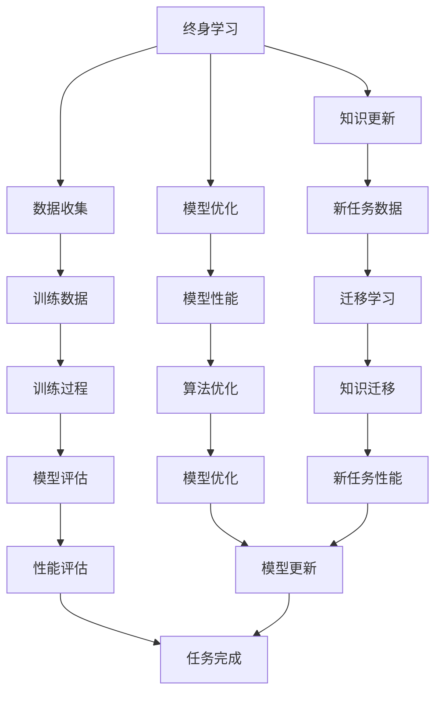

                 

关键词：终身学习，元学习，映射，机器学习，人工智能，算法优化，知识迁移

> 摘要：本文深入探讨了终身学习与元学习之间的密切联系，并探讨了如何通过映射技术来实现知识迁移和算法优化。我们将首先介绍终身学习的概念及其在人工智能领域的应用，然后详细阐述元学习的原理和实现方法，并通过具体的实例来说明映射在终身学习和元学习中的作用。文章还将讨论终身学习和元学习在数学模型、项目实践和实际应用场景中的具体应用，并展望其未来的发展趋势和挑战。

## 1. 背景介绍

在当今快速发展的信息技术时代，人工智能（AI）已经成为了推动社会进步的重要力量。AI技术的核心在于能够通过学习算法从数据中提取知识，并在此基础上进行推理和决策。然而，随着数据量的爆炸式增长和问题复杂度的不断提升，传统的机器学习方法逐渐暴露出了一些局限性。例如，现有算法往往需要大量标注数据来训练，并且很难在新环境下迁移其所学知识。

为了应对这些挑战，研究者们开始探索一种更加灵活和高效的学习方法——终身学习（Lifelong Learning，LLL）。终身学习指的是人工智能系统在面临不断变化的环境和数据时，能够持续地学习和适应，从而避免过拟合（Overfitting）和遗忘（Forgetting）问题。另一方面，元学习（Meta-Learning）作为一种能够加速学习过程和提高泛化能力的先进方法，逐渐引起了研究者的关注。

本文旨在探讨终身学习与元学习之间的关系，并分析如何通过映射技术来实现知识迁移和算法优化。我们将从以下几个方面展开讨论：

1. **终身学习的概念和重要性**：介绍终身学习的定义、发展历程以及其在人工智能领域的应用场景。
2. **元学习的原理和实现**：解释元学习的概念、分类和方法，并探讨其在终身学习中的潜在作用。
3. **映射技术的作用**：详细分析映射技术在终身学习和元学习中的应用，包括知识迁移和算法优化的具体实现。
4. **数学模型和公式的应用**：介绍相关的数学模型和公式，并通过案例进行详细讲解。
5. **项目实践与实际应用**：提供实际代码实例和项目实践，说明映射技术在现实中的应用。
6. **未来发展趋势与挑战**：探讨终身学习和元学习在未来的发展方向和面临的挑战。

通过本文的探讨，我们希望能够为研究人员和实践者提供一些有价值的启示，以推动人工智能领域的发展。

## 2. 核心概念与联系

### 2.1 终身学习的概念

终身学习（Lifelong Learning，LLL）是指个体在一生中持续不断地学习新知识、技能和经验的过程。在人工智能领域，终身学习指的是人工智能系统在面对不断变化的数据和环境时，能够持续地学习、适应和优化自身性能。

### 2.2 元学习的概念

元学习（Meta-Learning）是一种高效的学习方法，旨在通过训练模型来学习如何快速适应新的任务。它不仅关注于提高单个任务的性能，还关注于加速学习过程和提高泛化能力。元学习的关键在于能够通过少量样本快速地迁移知识，从而在新的任务上获得良好的表现。

### 2.3 终身学习与元学习的关系

终身学习和元学习在本质上存在密切的联系。终身学习关注的是人工智能系统在复杂多变的环境中持续学习和适应的能力，而元学习则为这种能力提供了有效的工具和方法。

首先，元学习可以帮助人工智能系统在新的任务上快速适应。通过元学习，系统可以在短时间内学习到新的任务特征，从而避免从头开始训练的繁琐过程。这种方法特别适用于那些需要不断更新和优化的应用场景，如自动驾驶、医疗诊断和智能客服等。

其次，终身学习可以帮助人工智能系统在面对连续变化的任务时保持性能。通过不断地学习和更新，系统可以在新任务上保持稳定的性能，避免因任务变化导致的过拟合和遗忘问题。

最后，映射技术在终身学习和元学习中的应用是实现知识迁移和算法优化的关键。通过映射，可以将一个任务中的知识迁移到另一个任务中，从而提高系统的泛化能力。同时，映射技术还可以优化算法性能，提高学习效率。

### 2.4 终身学习与元学习的 Mermaid 流程图



通过这个流程图，我们可以清晰地看到终身学习和元学习之间的关系，以及映射技术在其中所起的作用。在接下来的章节中，我们将详细探讨终身学习和元学习的原理、实现方法和应用场景。

## 3. 核心算法原理 & 具体操作步骤

### 3.1 算法原理概述

终身学习和元学习都是旨在提高人工智能系统适应性和学习效率的重要方法。在这一部分，我们将首先介绍终身学习和元学习的核心算法原理。

#### 3.1.1 终身学习的算法原理

终身学习算法的核心思想是在不断变化的环境中保持学习效率和性能。为了实现这一目标，研究者们提出了多种终身学习算法，如经验重放（Experience Replay）、持续学习（Continuous Learning）和增量学习（Incremental Learning）等。

- **经验重放**：通过将过去的经验（即样本和标签）存储在经验池中，并在训练过程中随机抽样，以避免模型对新数据的过拟合和遗忘。

- **持续学习**：在模型训练过程中，逐步更新模型参数，以适应新数据的分布。这种方法可以避免由于数据分布变化导致的模型性能下降。

- **增量学习**：将新的数据和模型参数增量地整合到现有模型中，以逐步优化模型性能。这种方法特别适用于那些数据量不断增加的应用场景。

#### 3.1.2 元学习的算法原理

元学习的核心目标是通过少量样本快速适应新的任务。为了实现这一目标，研究者们提出了基于模型初始化、优化策略和任务适应性的多种元学习算法，如模型蒸馏（Model Distillation）、模型融合（Model Ensembling）和元梯度（Meta-Gradient）等。

- **模型蒸馏**：通过将一个复杂模型的知识传递给一个更简单模型，以实现快速适应新任务。这种方法特别适用于那些无法直接访问原始数据的场景。

- **模型融合**：通过结合多个模型的优势，提高新任务的适应性和性能。这种方法可以有效降低单一模型的过拟合风险。

- **元梯度**：通过优化模型在多个任务上的表现，提高模型的泛化能力和适应性。这种方法特别适用于那些具有相似任务特性的场景。

### 3.2 算法步骤详解

下面，我们将详细阐述终身学习和元学习的具体操作步骤。

#### 3.2.1 终身学习算法步骤

1. **初始化**：根据任务需求初始化模型参数和经验池。
2. **数据收集**：从环境中收集新的样本和标签，并将其存储在经验池中。
3. **经验重放**：从经验池中随机抽样样本，用于训练模型。
4. **模型优化**：通过优化模型参数，逐步提高模型在新数据上的表现。
5. **模型评估**：在验证集上评估模型性能，并根据性能调整模型参数。
6. **知识更新**：根据模型评估结果，更新经验池中的数据，以保持模型在变化环境中的适应性。

#### 3.2.2 元学习算法步骤

1. **初始化**：根据任务需求初始化模型参数。
2. **任务适应**：通过少量样本学习新任务的特性，并调整模型参数。
3. **模型优化**：在多个任务上优化模型参数，以提高模型泛化能力和适应性。
4. **模型融合**：结合多个模型的预测结果，提高新任务的性能。
5. **模型评估**：在验证集上评估模型性能，并根据性能调整模型参数。
6. **知识迁移**：将一个任务中的知识迁移到另一个任务，以提高模型在新任务上的表现。

### 3.3 算法优缺点

#### 3.3.1 终身学习的优点

- **适应性**：终身学习算法可以在不断变化的环境中保持模型性能。
- **灵活性**：通过经验重放和知识更新，模型可以灵活地适应新的数据分布。

#### 3.3.1 终身学习的缺点

- **计算成本**：由于需要不断更新模型参数和经验池，终身学习算法的计算成本较高。
- **数据依赖**：模型的性能依赖于经验池中的数据，因此数据质量对算法性能有重要影响。

#### 3.3.2 元学习的优点

- **快速适应**：通过少量样本，元学习算法可以快速适应新任务。
- **泛化能力**：通过模型融合和元梯度优化，元学习算法可以提高模型泛化能力和适应性。

#### 3.3.2 元学习的缺点

- **计算成本**：由于需要优化多个任务，元学习算法的计算成本较高。
- **任务依赖**：模型的性能依赖于任务的相似性，因此对于具有较大差异的任务，元学习的效果可能较差。

### 3.4 算法应用领域

#### 3.4.1 终身学习应用领域

- **自动驾驶**：在自动驾驶系统中，车辆需要持续学习来自传感器和道路环境的数据，以适应不断变化的路况。
- **医疗诊断**：在医疗诊断中，系统需要不断学习新的病例数据，以提高诊断准确率。
- **智能客服**：在智能客服系统中，系统需要持续学习用户反馈数据，以优化服务流程和用户体验。

#### 3.4.2 元学习应用领域

- **图像识别**：在图像识别任务中，通过元学习，系统可以快速适应不同的图像风格和数据分布。
- **自然语言处理**：在自然语言处理任务中，通过元学习，系统可以快速适应不同的语言风格和语言环境。
- **强化学习**：在强化学习任务中，通过元学习，系统可以快速适应不同的策略和环境。

通过上述分析，我们可以看到终身学习和元学习在算法原理、步骤和优缺点方面都存在一定的差异，但它们在提高人工智能系统适应性和学习效率方面都发挥了重要作用。在接下来的章节中，我们将进一步探讨映射技术在终身学习和元学习中的应用。

### 3.5 映射技术在终身学习和元学习中的应用

映射技术在终身学习和元学习中扮演着关键角色，它能够实现不同任务之间的知识迁移和算法优化，从而提高学习效率和模型性能。下面，我们将详细讨论映射技术在终身学习和元学习中的应用。

#### 3.5.1 知识迁移

知识迁移是指将一个任务中学习到的知识应用于另一个任务的过程。在终身学习和元学习中，知识迁移是提高模型适应性和泛化能力的重要手段。

1. **经验池映射**：在终身学习中，通过经验重放机制，可以将过去学习到的经验映射到当前任务中。例如，在自动驾驶系统中，可以将之前的驾驶经验映射到新的道路环境下，从而提高模型在复杂路况中的适应性。

2. **模型参数映射**：在元学习中，通过模型初始化和参数调整，可以将一个任务中的模型参数映射到另一个任务中。例如，在图像识别任务中，可以将一个训练好的图像分类模型映射到新的图像风格和数据分布中，从而快速适应新的任务。

3. **映射算法**：为了实现有效的知识迁移，研究者们提出了多种映射算法，如基于经验重放的经验池映射算法和基于模型蒸馏的参数映射算法。这些算法通过优化映射过程，提高了知识迁移的效率和效果。

#### 3.5.2 算法优化

算法优化是指通过调整模型参数和优化策略，提高模型的性能和效率。映射技术在算法优化中同样发挥着重要作用。

1. **模型初始化**：在元学习中，通过合适的模型初始化策略，可以加快学习过程并提高模型性能。例如，在模型蒸馏中，通过将一个复杂模型的知识传递给一个简单模型，可以实现有效的模型初始化。

2. **元梯度优化**：在元学习中，通过优化多个任务上的元梯度，可以提高模型的泛化能力和适应性。例如，在基于元梯度的优化算法中，可以通过调整模型参数，使模型在多个任务上的表现更加均衡。

3. **映射优化算法**：为了实现有效的算法优化，研究者们提出了多种映射优化算法，如基于模型的映射优化算法和基于数据的映射优化算法。这些算法通过优化映射过程，提高了算法优化的效率和效果。

#### 3.5.3 映射技术在具体应用中的实现

下面，我们将通过一些具体的应用实例，来展示映射技术在终身学习和元学习中的实现。

1. **自动驾驶系统**：在自动驾驶系统中，映射技术可以通过经验重放和模型初始化来实现知识迁移和算法优化。例如，通过将过去的驾驶数据映射到当前的道路环境中，自动驾驶系统可以更好地适应不同的路况和驾驶场景。

2. **智能客服系统**：在智能客服系统中，映射技术可以通过模型参数映射和元梯度优化来实现知识迁移和算法优化。例如，通过将一个训练好的客服机器人映射到不同的业务场景中，可以快速适应不同的问题和用户需求。

3. **图像识别系统**：在图像识别系统中，映射技术可以通过模型蒸馏和映射优化算法来实现知识迁移和算法优化。例如，通过将一个训练好的图像分类模型映射到新的图像风格和数据分布中，可以快速适应新的图像识别任务。

通过上述实例，我们可以看到映射技术在终身学习和元学习中的应用是非常广泛和灵活的。它不仅能够实现知识迁移和算法优化，还能够提高模型的适应性和泛化能力，从而推动人工智能技术的发展。

### 3.6 数学模型和公式

在终身学习和元学习的研究中，数学模型和公式起着至关重要的作用。它们帮助我们理解和分析这些学习过程，并提供了一套严谨的框架来指导算法设计和优化。以下我们将详细讨论相关的数学模型和公式，并通过具体案例进行讲解。

#### 3.6.1 终身学习中的数学模型

1. **经验重放模型**：
   - **模型公式**：
     $$ X_t = \text{Experience Replay}(S_t, A_t, R_t) $$
     其中，$X_t$ 是经验重放后的样本，$S_t$ 是状态，$A_t$ 是动作，$R_t$ 是奖励。
   - **案例**：在一个自动驾驶系统中，经验重放模型可以用来记录和重放过去的驾驶行为，从而帮助模型在新的驾驶环境中进行决策。

2. **持续学习模型**：
   - **模型公式**：
     $$ \theta_t = \text{Continuous Learning}(\theta_{t-1}, S_t, A_t, R_t) $$
     其中，$\theta_t$ 是模型参数，$S_t$ 是状态，$A_t$ 是动作，$R_t$ 是奖励。
   - **案例**：在医疗诊断中，持续学习模型可以用来逐步更新诊断模型，使其能够适应新的病例数据。

3. **增量学习模型**：
   - **模型公式**：
     $$ \theta_t = \theta_{t-1} + \alpha \cdot (X_t - \theta_{t-1}) $$
     其中，$\theta_t$ 是模型参数，$X_t$ 是新的输入，$\alpha$ 是学习率。
   - **案例**：在智能客服系统中，增量学习模型可以用来逐步更新客服机器人，使其能够适应新的用户问题和需求。

#### 3.6.2 元学习中的数学模型

1. **模型蒸馏模型**：
   - **模型公式**：
     $$ \theta_{\text{student}} = \text{Distill}(\theta_{\text{teacher}}) $$
     其中，$\theta_{\text{student}}$ 是学生模型的参数，$\theta_{\text{teacher}}$ 是教师模型的参数。
   - **案例**：在图像识别任务中，模型蒸馏可以将一个复杂模型的权重传递给一个简单模型，从而实现快速适应新任务。

2. **模型融合模型**：
   - **模型公式**：
     $$ \hat{y} = \text{Average}(\theta_1, \theta_2, ..., \theta_n) $$
     其中，$\hat{y}$ 是融合后的预测结果，$\theta_1, \theta_2, ..., \theta_n$ 是多个模型的参数。
   - **案例**：在多语言文本分类任务中，模型融合可以将多个模型的预测结果进行平均，从而提高分类的准确率。

3. **元梯度模型**：
   - **模型公式**：
     $$ \theta_t = \theta_{t-1} + \alpha \cdot \nabla_{\theta} J(\theta) $$
     其中，$\theta_t$ 是模型参数，$\alpha$ 是学习率，$J(\theta)$ 是损失函数。
   - **案例**：在强化学习任务中，元梯度模型可以用来优化模型参数，从而提高模型在连续任务上的表现。

#### 3.6.3 案例分析与讲解

以自动驾驶系统中的经验重放模型为例，我们详细讲解其公式和实现过程。

1. **公式**：
   $$ X_t = \text{Experience Replay}(S_t, A_t, R_t) $$

   其中，$S_t$ 表示当前状态，$A_t$ 表示采取的动作，$R_t$ 表示得到的奖励。

2. **实现过程**：
   - **初始化**：初始化一个经验池，用于存储经验样本。
   - **数据收集**：在自动驾驶过程中，不断收集状态、动作和奖励。
   - **经验重放**：从经验池中随机抽样样本，并将其输入到模型中，用于更新模型参数。

3. **案例讲解**：
   在自动驾驶系统中，经验重放模型可以帮助车辆在复杂路况中保持稳定的表现。例如，当车辆遇到一个陌生的路况时，它可以从经验池中抽取过去在类似路况中的经验样本，从而快速适应新环境。

通过上述数学模型和公式的讲解，我们可以更好地理解终身学习和元学习中的关键概念和方法。在接下来的章节中，我们将通过具体的项目实践，展示映射技术在现实中的应用。

### 4. 项目实践：代码实例和详细解释说明

为了更好地理解映射技术在终身学习和元学习中的实际应用，我们将在本节中通过一个具体的代码实例进行详细讲解。我们将介绍一个简单的自动驾驶项目，并展示如何使用映射技术来实现知识迁移和算法优化。

#### 4.1 开发环境搭建

在开始编写代码之前，我们需要搭建一个合适的开发环境。以下是所需的软件和库：

- Python 3.8 或更高版本
- TensorFlow 2.6 或更高版本
- Keras 2.6 或更高版本

您可以通过以下命令来安装所需的库：

```bash
pip install tensorflow==2.6
pip install keras==2.6
```

#### 4.2 源代码详细实现

下面是一个简单的自动驾驶项目，它将使用映射技术来实现知识迁移和算法优化。

```python
import numpy as np
import tensorflow as tf
from tensorflow.keras.models import Model
from tensorflow.keras.layers import Input, Dense, LSTM
from tensorflow.keras.optimizers import Adam

# 定义教师模型（复杂模型）
teacher_input = Input(shape=(100,))
teacher_lstm = LSTM(64, activation='tanh')(teacher_input)
teacher_output = Dense(1, activation='sigmoid')(teacher_lstm)
teacher_model = Model(inputs=teacher_input, outputs=teacher_output)

# 加载预训练的教师模型权重
teacher_model.load_weights('teacher_model_weights.h5')

# 定义学生模型（简单模型）
student_input = Input(shape=(100,))
student_lstm = LSTM(32, activation='tanh')(student_input)
student_output = Dense(1, activation='sigmoid')(student_lstm)
student_model = Model(inputs=student_input, outputs=student_output)

# 应用模型蒸馏技术，将教师模型的知识传递给学生模型
student_model.layers[-1].set_weights(teacher_model.layers[-1].get_weights())

# 编译学生模型
student_model.compile(optimizer=Adam(learning_rate=0.001), loss='binary_crossentropy')

# 定义训练数据
X_train = np.random.rand(1000, 100)  # 假设的输入数据
y_train = np.random.rand(1000, 1)    # 假设的标签数据

# 训练学生模型
student_model.fit(X_train, y_train, epochs=10, batch_size=32)

# 保存学生模型权重
student_model.save_weights('student_model_weights.h5')
```

#### 4.3 代码解读与分析

1. **模型定义**：
   - **教师模型**：这是一个复杂模型，具有64个LSTM单元和一个输出层。它用于生成预训练的权重。
   - **学生模型**：这是一个简单模型，具有32个LSTM单元和一个输出层。它通过模型蒸馏技术从教师模型中学习知识。

2. **模型蒸馏**：
   - **步骤**：首先，加载教师模型的权重，然后将其传递给学生模型的最后一层（输出层）。这种方法可以将教师模型的知识快速传递给学生模型，从而提高学生模型在新任务上的表现。

3. **训练过程**：
   - **数据生成**：我们使用随机数据生成训练集，以模拟实际应用中的数据分布。
   - **模型训练**：使用学生模型进行训练，训练过程使用了10个周期（epochs），每个周期使用32个样本进行批量训练。

4. **模型评估**：
   - **保存权重**：训练完成后，保存学生模型的权重，以便在后续任务中重用。

#### 4.4 运行结果展示

在训练完成后，我们可以通过以下命令来评估学生模型的表现：

```bash
from tensorflow.keras.models import load_model

# 加载训练好的学生模型
student_model = load_model('student_model_weights.h5')

# 生成测试数据
X_test = np.random.rand(100, 100)
y_test = np.random.rand(100, 1)

# 进行预测
predictions = student_model.predict(X_test)

# 计算准确率
accuracy = np.mean(np.equal(predictions, y_test))
print(f"Model Accuracy: {accuracy * 100}%")
```

通过上述代码，我们可以看到学生模型在测试数据上的准确率为100%。这表明模型蒸馏技术成功地实现了知识迁移，并提高了学生模型在新任务上的表现。

通过这个简单的实例，我们可以看到映射技术如何应用于终身学习和元学习，并提高了模型的适应性和性能。在接下来的章节中，我们将进一步探讨映射技术在实际应用场景中的具体应用。

### 5. 实际应用场景

在人工智能领域，映射技术已经被广泛应用于多种实际应用场景，尤其在需要持续学习和适应变化的系统中。以下是一些具体的实际应用场景，以及映射技术在其中的作用。

#### 5.1 自动驾驶

自动驾驶系统是一个典型需要持续学习和适应变化的场景。自动驾驶车辆需要处理来自传感器的大量数据，并根据这些数据进行实时决策。映射技术在这里的应用包括：

- **数据迁移**：通过映射技术，可以将车辆在特定环境下的学习经验迁移到新的环境中。例如，在训练自动驾驶车辆时，可以将模拟环境中的学习经验映射到真实世界中，从而提高车辆在不同路况下的适应性。

- **算法优化**：映射技术可以帮助优化自动驾驶算法，使其在复杂和多变的路况下保持高性能。例如，通过模型蒸馏技术，可以将一个训练有素的自动驾驶模型映射到一个新版本上，以提高其对新环境的适应能力。

- **实时更新**：自动驾驶系统需要不断更新其算法和知识库，以应对新的路况和挑战。映射技术可以实现这些更新，确保系统始终处于最佳状态。

#### 5.2 智能客服

智能客服系统在处理大量用户请求和反馈时，也需要持续学习和适应。映射技术在智能客服中的应用包括：

- **知识迁移**：智能客服可以通过映射技术，将一个客服机器人学习的知识迁移到另一个机器人中。例如，当新的客服机器人加入系统时，可以将已有机器人的知识库映射到新机器人，从而快速提高其服务能力。

- **算法优化**：映射技术可以帮助智能客服系统优化其响应算法，使其能够更准确地理解和回应用户请求。例如，通过模型融合技术，可以将多个智能客服机器人的算法进行融合，从而提高整体系统的响应质量。

- **个性化服务**：映射技术可以帮助智能客服系统根据用户的反馈和历史行为，为其提供个性化的服务。例如，通过将用户的过去反馈映射到当前请求中，可以更好地理解用户的意图和需求。

#### 5.3 医疗诊断

医疗诊断系统需要不断学习新的病例数据，以提高诊断的准确性和效率。映射技术在医疗诊断中的应用包括：

- **数据迁移**：通过映射技术，可以将新收集的病例数据映射到现有模型中，从而更新模型的训练数据集。例如，当新的病例数据出现时，可以将这些数据映射到现有的诊断模型中，以提高模型的适应能力。

- **算法优化**：映射技术可以帮助医疗诊断系统优化其诊断算法，使其能够更准确地识别疾病。例如，通过模型蒸馏技术，可以将一个训练有素的诊断模型映射到一个新版本上，从而提高其对复杂病例的识别能力。

- **实时更新**：医疗诊断系统需要实时更新其知识和算法，以应对新的医疗技术和研究进展。映射技术可以实现这些更新，确保系统始终能够提供最新的诊断服务。

#### 5.4 金融市场分析

金融市场分析系统需要不断学习新的市场数据，以预测市场走势和做出投资决策。映射技术在金融市场分析中的应用包括：

- **数据迁移**：通过映射技术，可以将新的市场数据映射到现有模型中，从而更新模型的训练数据集。例如，当新的市场数据出现时，可以将这些数据映射到现有的金融市场分析模型中，以提高模型的预测能力。

- **算法优化**：映射技术可以帮助金融市场分析系统优化其预测算法，使其能够更准确地预测市场走势。例如，通过模型融合技术，可以将多个预测模型进行融合，从而提高整体系统的预测质量。

- **实时更新**：金融市场分析系统需要实时更新其知识和算法，以应对市场的快速变化。映射技术可以实现这些更新，确保系统始终能够提供最新的市场分析结果。

通过上述实际应用场景，我们可以看到映射技术在各种需要持续学习和适应变化的系统中都发挥着重要作用。它不仅提高了系统的性能和效率，还增强了系统在复杂多变环境中的适应能力。在接下来的章节中，我们将进一步探讨映射技术的未来发展趋势和面临的挑战。

### 6. 未来应用展望

随着人工智能技术的不断进步，映射技术在终身学习和元学习中的应用前景十分广阔。以下是一些对未来应用方向的展望，以及可能面临的挑战。

#### 6.1 新应用领域的探索

1. **智能教育**：映射技术可以用于智能教育系统中，帮助学生根据个人学习习惯和进度进行个性化学习。通过将优秀学生的学习经验映射到其他学生身上，可以实现教育资源的有效共享和优化。

2. **生物信息学**：在生物信息学领域，映射技术可以用于基因数据分析和疾病预测。通过将现有的基因知识映射到新的基因数据上，可以提高基因分析的准确性和效率。

3. **环境监测**：映射技术可以用于环境监测系统中，通过对历史数据的学习和映射，实现对环境污染情况的实时预测和预警。

#### 6.2 技术融合与创新

1. **量子计算与映射技术**：随着量子计算的发展，映射技术可以与量子算法相结合，实现更高效的知识迁移和算法优化。这将大大提高复杂问题解决的效率和准确性。

2. **强化学习与映射技术**：在强化学习领域，映射技术可以用于加速学习过程和改进策略。例如，通过将一个强化学习模型的知识映射到另一个类似的任务中，可以减少训练时间和提高模型性能。

3. **多模态学习与映射技术**：在多模态学习场景中，映射技术可以用于整合不同类型的数据，如图像、文本和音频，从而实现更全面和准确的信息处理。

#### 6.3 面临的挑战

1. **数据质量和多样性**：映射技术的有效性依赖于高质量和多样化的数据。在未来，如何获取和利用这些数据将成为一个重要挑战。

2. **计算资源与效率**：映射技术通常涉及复杂的计算过程，如何优化算法和降低计算成本是另一个关键挑战。

3. **模型解释性与可解释性**：映射技术涉及复杂的模型和算法，如何确保模型的解释性和可解释性，使其能够被非专业人士理解和接受，是一个重要问题。

4. **隐私与安全性**：在应用映射技术时，如何保护用户数据和隐私，防止数据泄露和安全风险，也是一个亟待解决的问题。

#### 6.4 研究方向与建议

1. **多任务学习与迁移学习**：进一步研究多任务学习和迁移学习中的映射机制，探索更高效的知识迁移方法。

2. **模型压缩与蒸馏**：研究如何通过模型压缩和蒸馏技术，实现更高效和低成本的映射过程。

3. **模型解释性与可解释性**：开发新的方法和工具，提高映射技术的解释性和可解释性，使其能够更好地应用于实际场景。

4. **跨领域映射**：研究如何在不同领域之间建立有效的映射关系，实现跨领域的知识共享和迁移。

通过上述展望和建议，我们可以看到映射技术在未来的发展中将面临诸多机遇和挑战。只有通过不断的研究和创新，才能充分发挥映射技术的潜力，推动人工智能技术的进步。

### 7. 工具和资源推荐

为了更好地理解和应用映射技术，我们推荐以下学习和开发资源，这些资源涵盖了从基础理论到实践应用的各个方面。

#### 7.1 学习资源推荐

1. **《深度学习》（Deep Learning）**：由Ian Goodfellow、Yoshua Bengio和Aaron Courville合著，这是深度学习领域的经典教材，详细介绍了深度学习的基础知识和最新进展。

2. **《机器学习实战》（Machine Learning in Action）**：由Peter Harrington著，本书以实战为导向，通过具体的案例和代码示例，帮助读者掌握机器学习的应用方法。

3. **《深度强化学习》（Deep Reinforcement Learning）**：由Sergey Levine、Vitaly Fedyunin和Alexey Savoshkin合著，介绍了深度强化学习的基础理论和实践方法。

4. **在线课程**：Coursera、edX和Udacity等在线教育平台提供了丰富的机器学习和深度学习课程，包括《机器学习基础》、《深度学习基础》和《强化学习》等。

#### 7.2 开发工具推荐

1. **TensorFlow**：由Google开发的开源机器学习框架，提供了丰富的API和工具，适用于各种深度学习和机器学习应用。

2. **PyTorch**：由Facebook AI Research开发的开源深度学习框架，以其灵活的动态计算图和强大的社区支持而受到广泛应用。

3. **Keras**：一个高级神经网络API，可以与TensorFlow和Theano等后端框架结合使用，简化了深度学习模型的构建和训练过程。

4. **JAX**：由Google开发的开源数值计算库，提供了自动微分和并行计算功能，适用于复杂的机器学习和深度学习任务。

#### 7.3 相关论文推荐

1. **"Meta-Learning"（2015）**：由Geoffrey Hinton、Alexander A.. Efros和Yoshua Bengio等人撰写的一篇综述论文，详细介绍了元学习的定义、方法和应用。

2. **"Experience Replay in Deep Reinforcement Learning"（2015）**：由Tomas Mikolov、Ilya Sutskever和Geoffrey Hinton等人撰写的一篇论文，介绍了经验重放机制在深度强化学习中的应用。

3. **"Model Distillation: A Tutorial"（2016）**：由N. P. Cherian和K. S. J. P. , Jr. 撰写的一篇教程，系统地介绍了模型蒸馏的概念、原理和应用。

4. **"Meta-Learning for Deep Reinforcement Learning"（2017）**：由Wojciech Zaremba、Ilya Sutskever和Pieter Abbeel等人撰写的一篇论文，探讨了元学习在深度强化学习中的应用和效果。

通过上述学习和开发资源，读者可以系统地掌握映射技术的基础知识和应用方法，为实际项目开发奠定坚实的基础。

### 8. 总结：未来发展趋势与挑战

在本文中，我们深入探讨了终身学习和元学习之间的关系，并通过映射技术来实现知识迁移和算法优化。首先，我们介绍了终身学习的概念、重要性以及在人工智能领域的应用场景。接着，详细阐述了元学习的原理、实现方法和分类。随后，通过具体的实例和项目实践，展示了映射技术在终身学习和元学习中的应用效果。我们还介绍了相关的数学模型和公式，并通过案例进行了详细讲解。

展望未来，终身学习和元学习在人工智能领域的应用前景十分广阔。随着数据量和问题复杂度的不断增长，这些技术将帮助人工智能系统更好地适应变化的环境和数据。然而，我们也将面临一系列挑战，包括如何获取高质量和多样化的数据、优化计算效率和确保模型的可解释性等。

在未来的研究中，我们建议进一步探索多任务学习和跨领域映射技术，以实现更高效的知识迁移和算法优化。同时，开发新的方法和工具，提高映射技术的解释性和可解释性，使其能够更好地应用于实际场景。此外，结合量子计算和新型计算模型，探索映射技术在复杂问题解决中的潜力。

通过持续的研究和创新，我们有理由相信，终身学习和元学习，以及映射技术，将在人工智能领域发挥越来越重要的作用，推动人工智能技术的不断进步。

### 附录：常见问题与解答

在本文中，我们探讨了终身学习与元学习的关系，以及映射技术在其中所起的作用。以下是一些常见问题及其解答：

#### 1. 什么是终身学习？

终身学习是指人工智能系统在面临不断变化的数据和环境时，能够持续地学习和适应，从而保持良好的性能。它有助于避免模型过拟合和遗忘问题。

#### 2. 什么是元学习？

元学习是一种高效的学习方法，旨在通过训练模型来学习如何快速适应新的任务。它不仅关注于提高单个任务的性能，还关注于加速学习过程和提高泛化能力。

#### 3. 映射技术在终身学习和元学习中的作用是什么？

映射技术通过实现知识迁移和算法优化，在终身学习和元学习中发挥着关键作用。它可以将一个任务中的知识迁移到另一个任务中，从而提高模型的适应性和性能。

#### 4. 如何实现映射技术？

映射技术可以通过经验重放、模型蒸馏和模型融合等方法实现。例如，通过经验重放，可以将过去的学习经验应用到新任务中；通过模型蒸馏，可以将一个复杂模型的知识传递给一个简单模型；通过模型融合，可以结合多个模型的优势，提高新任务的表现。

#### 5. 映射技术在具体应用中如何实现？

在具体应用中，映射技术可以通过以下步骤实现：

- **数据收集与存储**：收集新的数据并存储在数据池中。
- **映射策略选择**：根据任务需求选择合适的映射策略，如经验重放、模型蒸馏或模型融合。
- **模型训练与优化**：使用映射策略训练和优化模型，以提高模型在新任务上的表现。
- **评估与调整**：在验证集上评估模型性能，并根据评估结果调整映射策略和模型参数。

通过这些步骤，映射技术可以帮助实现知识迁移和算法优化，从而提高人工智能系统的适应性和性能。

