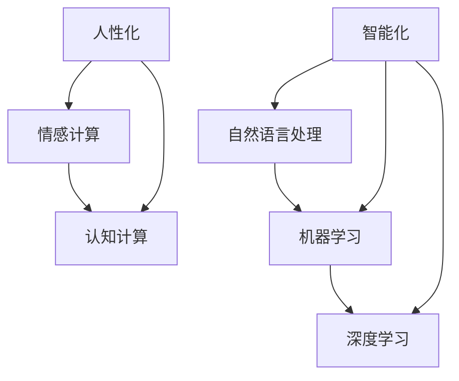

                 

在数字时代，聊天机器人已经成为我们日常生活中不可或缺的一部分。它们不仅能够提高工作效率，还能够提供个性化服务，满足用户的多样化需求。本文将探讨聊天机器人的智能化与人性化的双重特性，并探讨如何实现这两者之间的平衡。

## 关键词
- 聊天机器人
- 智能化
- 人性化
- 数字交互
- 用户体验

## 摘要
本文将分析聊天机器人的发展历程，讨论其智能化与人性化的重要性，并介绍实现这两种特性的关键技术。通过案例分析，我们将展示如何在实际项目中应用这些技术，并探讨未来的发展方向。

## 1. 背景介绍
### 1.1 聊天机器人的起源与发展
聊天机器人的概念最早可以追溯到20世纪50年代，当时的研究者们开始探索如何使计算机能够模拟人类的交流方式。随着时间的推移，聊天机器人的技术不断成熟，应用领域也日益广泛。从最初的简单文本聊天，到后来的语音识别和自然语言理解，聊天机器人的发展经历了多个阶段。

### 1.2 智能化与人性化的定义
智能化是指聊天机器人通过学习和适应用户行为，提供更准确、更高效的交互服务。人性化则强调聊天机器人能够模拟人类交流的自然性，使交互过程更加流畅和舒适。

### 1.3 聊天机器人在现代社会的应用
聊天机器人已经在各个领域得到广泛应用，如客服、教育、医疗、金融等。它们不仅能够提高服务效率，降低成本，还能够提供个性化服务，满足用户的多样化需求。

## 2. 核心概念与联系
### 2.1 智能化的核心概念
智能化的核心在于聊天机器人能够通过学习用户的行为和偏好，提供个性化的交互服务。这涉及到自然语言处理（NLP）、机器学习（ML）和深度学习（DL）等技术。

### 2.2 人性化的核心概念
人性化强调聊天机器人能够模拟人类的交流方式，包括情感表达、语用理解和上下文感知。这需要借助情感计算（Affective Computing）和认知计算（Cognitive Computing）等技术。

### 2.3 Mermaid 流程图

### 2.4 关联性分析
智能化和人性化是聊天机器人发展的两个关键方向。智能化关注的是效率和服务质量，而人性化关注的是用户体验和情感互动。两者之间存在一定的关联性，但又有明确的区别。实现智能化是为了提供高效的服务，而实现人性化则是为了让用户感到更加舒适和满意。

## 3. 核心算法原理 & 具体操作步骤

### 3.1 算法原理概述
聊天机器人的核心算法主要涉及自然语言处理和机器学习。自然语言处理旨在理解和生成人类语言，而机器学习则使聊天机器人能够从数据中学习并改进其交互能力。

### 3.2 算法步骤详解
#### 3.2.1 数据收集与预处理
首先，需要收集大量用户交互数据，并对这些数据进行清洗和预处理，以便用于训练模型。

#### 3.2.2 模型训练
使用收集到的数据对机器学习模型进行训练。常用的模型包括循环神经网络（RNN）、长短期记忆网络（LSTM）和变压器模型（Transformer）等。

#### 3.2.3 模型评估与优化
通过测试集对训练好的模型进行评估，并根据评估结果进行优化。

#### 3.2.4 模型部署
将优化后的模型部署到服务器，使其能够实时响应用户的交互请求。

### 3.3 算法优缺点
#### 3.3.1 优点
- **高效性**：机器学习模型能够快速处理大量数据，提高交互效率。
- **个性化**：通过不断学习和适应用户行为，提供个性化的服务。

#### 3.3.2 缺点
- **数据依赖**：需要大量的高质量数据来训练模型。
- **性能瓶颈**：在高并发场景下，模型可能存在性能瓶颈。

### 3.4 算法应用领域
- **客服**：提供快速、准确的客服服务。
- **教育**：提供个性化的学习建议和辅助。
- **医疗**：辅助医生进行诊断和治疗。

## 4. 数学模型和公式 & 详细讲解 & 举例说明

### 4.1 数学模型构建
聊天机器人的数学模型主要包括两部分：自然语言处理模型和机器学习模型。

#### 4.1.1 自然语言处理模型
自然语言处理模型通常使用基于统计的方法，如隐马尔可夫模型（HMM）和条件概率模型（如朴素贝叶斯分类器）。这些模型通过计算输入文本的概率分布，实现对文本的理解。

#### 4.1.2 机器学习模型
机器学习模型通常使用神经网络结构，如卷积神经网络（CNN）、循环神经网络（RNN）和变压器模型（Transformer）。这些模型通过学习输入数据和标签之间的关系，实现对输入数据的分类和预测。

### 4.2 公式推导过程
以循环神经网络（RNN）为例，其基本公式如下：

$$
h_t = \sigma(W_h \cdot [h_{t-1}, x_t] + b_h)
$$

其中，$h_t$ 表示时间步 $t$ 的隐藏状态，$x_t$ 表示时间步 $t$ 的输入，$W_h$ 和 $b_h$ 分别表示权重和偏置。

### 4.3 案例分析与讲解
假设我们有一个聊天机器人，它需要理解用户输入的文本并给出合适的回复。我们可以使用以下步骤进行模型构建和训练：

1. 数据收集：收集大量用户对话数据，包括输入文本和对应的回复。
2. 数据预处理：对输入文本进行分词、词向量化等处理，将文本转化为机器学习模型可处理的格式。
3. 模型训练：使用训练集数据训练循环神经网络（RNN）模型，通过不断调整权重和偏置，使模型能够准确预测回复。
4. 模型评估：使用测试集数据评估模型性能，根据评估结果调整模型参数。
5. 模型部署：将训练好的模型部署到服务器，使其能够实时响应用户的交互请求。

## 5. 项目实践：代码实例和详细解释说明

### 5.1 开发环境搭建
1. 安装Python和必要的库（如TensorFlow、Keras等）。
2. 准备对话数据集，并进行预处理。

### 5.2 源代码详细实现
以下是使用循环神经网络（RNN）训练聊天机器人的部分代码：

```python
from tensorflow.keras.models import Sequential
from tensorflow.keras.layers import LSTM, Dense, Embedding

# 准备数据
# ...

# 构建模型
model = Sequential()
model.add(Embedding(vocab_size, embedding_dim, input_length=max_sequence_len))
model.add(LSTM(units=50, return_sequences=True))
model.add(LSTM(units=50))
model.add(Dense(units=1, activation='sigmoid'))

# 编译模型
model.compile(optimizer='adam', loss='binary_crossentropy', metrics=['accuracy'])

# 训练模型
model.fit(X_train, y_train, epochs=100, batch_size=32)
```

### 5.3 代码解读与分析
1. **数据准备**：首先，我们需要将对话数据集进行预处理，包括分词、词向量化等。
2. **模型构建**：使用Sequential模型构建循环神经网络（RNN），包括嵌入层（Embedding）、两个LSTM层和一个全连接层（Dense）。
3. **模型编译**：编译模型，指定优化器、损失函数和评估指标。
4. **模型训练**：使用训练集数据训练模型，通过不断迭代调整模型参数，使模型能够准确预测回复。

### 5.4 运行结果展示
通过训练，我们可以得到一个能够准确预测回复的聊天机器人模型。接下来，我们可以使用测试集数据评估模型性能，并根据评估结果进行优化。

## 6. 实际应用场景

### 6.1 客服领域
在客服领域，聊天机器人能够提供24/7的全天候服务，快速响应用户的咨询和请求。例如，银行可以使用聊天机器人提供账户查询、转账等服务，从而提高客户满意度。

### 6.2 教育领域
在教育领域，聊天机器人可以为学生提供个性化的学习建议和辅助。例如，学生可以通过聊天机器人进行课后辅导、作业解答等。

### 6.3 医疗领域
在医疗领域，聊天机器人可以协助医生进行诊断和治疗。例如，它可以提供病例分析、药物咨询等服务，从而提高医疗服务的质量和效率。

### 6.4 未来应用展望
随着技术的不断进步，聊天机器人的应用领域将更加广泛。未来，我们可以期待聊天机器人能够实现更高级的智能交互，如情感理解、图像识别等。

## 7. 工具和资源推荐

### 7.1 学习资源推荐
- 《深度学习》（Goodfellow et al.）
- 《自然语言处理综合教程》（Daniel Jurafsky and James H. Martin）

### 7.2 开发工具推荐
- TensorFlow
- Keras

### 7.3 相关论文推荐
- "Seq2Seq Learning with Neural Networks and Recurrent Neural Networks"
- "Neural Machine Translation by Jointly Learning to Align and Translate"

## 8. 总结：未来发展趋势与挑战

### 8.1 研究成果总结
聊天机器人已经取得了显著的研究成果，在自然语言处理、机器学习和深度学习等领域取得了突破性进展。

### 8.2 未来发展趋势
未来，聊天机器人将继续朝着更智能化、更人性化的方向发展，实现更高效的交互和更丰富的功能。

### 8.3 面临的挑战
尽管聊天机器人取得了显著进展，但仍然面临一些挑战，如数据质量、模型可解释性、隐私保护等。

### 8.4 研究展望
为了实现聊天机器人的智能化与人性化，我们需要在多个领域进行深入研究，如多模态交互、情感理解、自适应学习等。

## 9. 附录：常见问题与解答

### 9.1 如何提高聊天机器人的智能性？
提高聊天机器人的智能性主要依赖于以下几个方面：
1. **数据质量**：收集更多高质量、多样化的数据。
2. **模型优化**：使用更先进的模型结构和优化算法。
3. **知识融合**：将外部知识库与模型融合，提高知识表达能力。

### 9.2 如何提升聊天机器人的用户体验？
提升聊天机器人的用户体验主要依赖于以下几个方面：
1. **情感表达**：使用情感计算技术，使聊天机器人能够模拟情感表达。
2. **语用理解**：使用自然语言处理技术，使聊天机器人能够更好地理解用户意图。
3. **上下文感知**：使用上下文感知技术，使聊天机器人能够更好地把握对话上下文。

---

### 附录：参考文献

- Goodfellow, I., Bengio, Y., & Courville, A. (2016). *Deep Learning*. MIT Press.
- Jurafsky, D., & Martin, J. H. (2008). *Speech and Language Processing*. Prentice Hall.
- Sutskever, I., Vinyals, O., & Le, Q. V. (2014). *Sequence to sequence learning with neural networks*. In Advances in Neural Information Processing Systems (NIPS), 3104–3112.
- Bahdanau, D., Cho, K., & Bengio, Y. (2014). *Neural machine translation by jointly learning to align and translate*. In International Conference on Learning Representations (ICLR).

### 作者署名
作者：禅与计算机程序设计艺术 / Zen and the Art of Computer Programming
----------------------------------------------------------------

