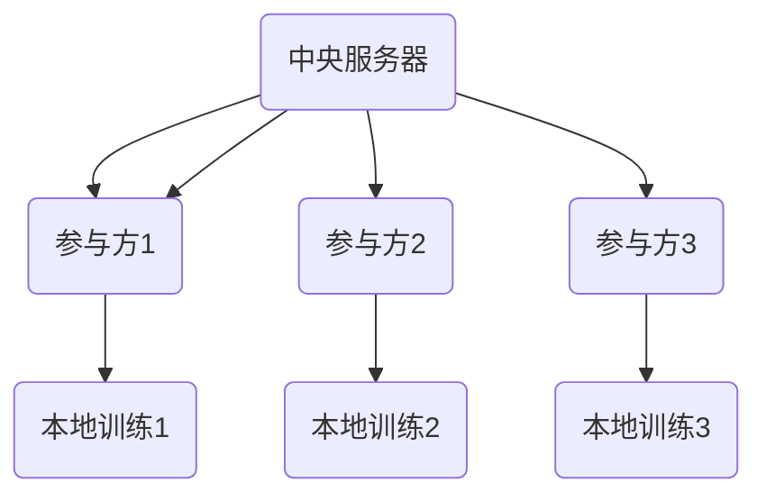
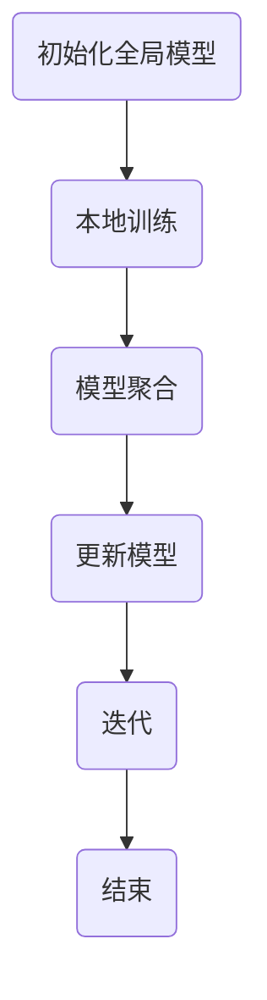

                 

联邦学习（Federated Learning）作为一种分布式机器学习技术，正逐渐成为人工智能领域的研究热点。它通过分布式的方式训练神经网络模型，旨在保护用户隐私的同时实现模型的性能提升。本文将探讨联邦学习的基本原理、算法设计、数学模型以及其实际应用场景，旨在为读者提供一个全面、深入的视角，帮助理解联邦学习在神经网络模型分布式训练中的关键作用。

## 文章关键词

联邦学习、神经网络、分布式训练、隐私保护、模型优化

## 文章摘要

本文首先介绍了联邦学习的背景和发展历程，然后详细阐述了联邦学习的基本原理和算法设计。通过一个Mermaid流程图，展示了联邦学习的核心概念和流程。接下来，本文深入探讨了联邦学习中的数学模型和公式，并结合具体案例进行了分析。文章的最后部分，通过代码实例和详细解释，展示了联邦学习在神经网络模型分布式训练中的实际应用。最后，本文对未来联邦学习的发展趋势和面临的挑战进行了展望。

## 1. 背景介绍

### 1.1 联邦学习的起源与发展

联邦学习的概念最早由谷歌在2016年提出，旨在解决大规模数据处理中隐私保护和计算资源受限的问题。随着云计算和边缘计算的发展，联邦学习得到了广泛关注和研究。它通过分布式的方式，将数据保留在本地设备上，仅传输模型参数，从而实现了用户隐私的保护。

### 1.2 分布式训练的重要性

随着数据量的急剧增长和模型的复杂性增加，传统的集中式训练方法面临着计算资源消耗大、训练时间长等挑战。分布式训练能够有效解决这些问题，通过将训练任务分散到多个节点上，实现并行计算，提高训练效率。

### 1.3 联邦学习与分布式训练的区别

联邦学习是分布式训练的一种特殊形式，它不仅关注训练效率，还特别强调用户隐私的保护。与传统分布式训练相比，联邦学习在数据传输和处理过程中采用了更加严格的安全措施，确保用户数据不被泄露。

## 2. 核心概念与联系

### 2.1 联邦学习的核心概念

联邦学习主要涉及三个核心概念：中央服务器、参与方和本地训练。中央服务器负责协调训练过程，参与方负责提供数据和计算资源，本地训练则在参与方本地进行，仅传输模型参数。



### 2.2 联邦学习的流程

联邦学习的流程可以概括为以下步骤：

1. **初始化**：中央服务器初始化全局模型。
2. **本地训练**：参与方在本地数据集上训练模型。
3. **模型聚合**：中央服务器收集并聚合参与方的模型参数。
4. **更新模型**：中央服务器更新全局模型。
5. **迭代**：重复上述步骤，直到达到训练目标或迭代次数。



## 3. 核心算法原理 & 具体操作步骤

### 3.1 算法原理概述

联邦学习的基本原理是利用本地训练的模型参数，通过聚合的方式更新全局模型。这种算法设计旨在实现模型性能的提升，同时保护用户隐私。

### 3.2 算法步骤详解

1. **初始化全局模型**：中央服务器初始化全局模型。
2. **本地训练**：参与方在本地数据集上训练模型，并保存模型参数。
3. **模型聚合**：中央服务器收集参与方的模型参数，并使用特定的聚合算法进行更新。
4. **更新模型**：中央服务器更新全局模型，并将更新后的模型发送给参与方。
5. **本地训练**：参与方使用更新后的模型，在本地数据集上继续训练。
6. **重复迭代**：重复上述步骤，直到达到训练目标或迭代次数。

### 3.3 算法优缺点

**优点**：

- 保护用户隐私：联邦学习通过将数据保留在本地设备上，仅传输模型参数，有效避免了用户数据的泄露。
- 节省带宽：由于仅传输模型参数，相对于传输完整数据集，联邦学习能够显著节省带宽资源。
- 提高训练效率：通过分布式训练，联邦学习能够加快模型训练速度。

**缺点**：

- 模型精度：由于本地训练的数据集有限，模型精度可能受到一定程度的影响。
- 聚合算法：不同的聚合算法对模型性能和训练效率有不同的影响，需要根据实际情况进行选择。

### 3.4 算法应用领域

联邦学习在多个领域具有广泛应用，如：

- 医疗保健：通过联邦学习，可以实现医疗数据的共享和分析，同时保护患者隐私。
- 金融服务：联邦学习可以用于客户行为分析，实现精准营销和风险控制。
- 物联网：联邦学习可以用于物联网设备的协同工作，实现智能感知和优化控制。

## 4. 数学模型和公式 & 详细讲解 & 举例说明

### 4.1 数学模型构建

联邦学习的数学模型主要涉及模型初始化、本地训练和模型聚合三个阶段。

**模型初始化**：

$$
\theta_0 = \theta_0^0 + \theta_0^1 \cdot x_0
$$

其中，$\theta_0$ 表示全局模型参数，$\theta_0^0$ 和 $\theta_0^1$ 分别表示初始化的权重和偏置。

**本地训练**：

$$
\theta_i = \theta_{i-1} + \alpha \cdot (y_i - f(\theta_{i-1}, x_i))
$$

其中，$\theta_i$ 表示第 $i$ 次迭代的模型参数，$y_i$ 和 $x_i$ 分别表示第 $i$ 个样本的标签和特征，$f(\theta_{i-1}, x_i)$ 表示使用前一次迭代模型参数预测的第 $i$ 个样本的标签。

**模型聚合**：

$$
\theta_t = \frac{1}{N} \sum_{i=1}^{N} \theta_i
$$

其中，$\theta_t$ 表示第 $t$ 次迭代的聚合模型参数，$N$ 表示参与方的数量。

### 4.2 公式推导过程

**模型初始化**：

假设全局模型参数为 $\theta_0$，初始化的权重为 $\theta_0^0$，偏置为 $\theta_0^1$，样本特征为 $x_0$。根据全连接神经网络的前向传播公式，有：

$$
y_0 = f(\theta_0, x_0) = \sigma(\theta_0^T x_0 + \theta_0^1)
$$

其中，$\sigma$ 表示激活函数，$T$ 表示转置运算。

为了初始化模型参数，我们选择一个随机值作为初始化权重和偏置，即 $\theta_0^0 \sim \mathcal{N}(0, \sigma^2)$ 和 $\theta_0^1 \sim \mathcal{N}(0, \sigma^2)$。因此，全局模型参数可以表示为：

$$
\theta_0 = \theta_0^0 + \theta_0^1 \cdot x_0
$$

**本地训练**：

假设第 $i$ 个样本的标签为 $y_i$，特征为 $x_i$，前一次迭代的模型参数为 $\theta_{i-1}$。根据梯度下降法，我们有：

$$
\theta_i = \theta_{i-1} - \alpha \cdot \nabla_{\theta_{i-1}} f(\theta_{i-1}, x_i)
$$

由于 $f(\theta_{i-1}, x_i)$ 是关于 $\theta_{i-1}$ 的非线性函数，我们采用链式法则求导，得到：

$$
\nabla_{\theta_{i-1}} f(\theta_{i-1}, x_i) = \frac{\partial f}{\partial \theta_{i-1}} \cdot \frac{\partial \theta_{i-1}}{\partial x_i}
$$

由于 $\theta_{i-1}$ 和 $x_i$ 是独立的，$\frac{\partial \theta_{i-1}}{\partial x_i} = 0$，因此：

$$
\nabla_{\theta_{i-1}} f(\theta_{i-1}, x_i) = \frac{\partial f}{\partial \theta_{i-1}}
$$

代入 $y_i = f(\theta_{i-1}, x_i)$，得到：

$$
\theta_i = \theta_{i-1} - \alpha \cdot (y_i - f(\theta_{i-1}, x_i))
$$

**模型聚合**：

假设有 $N$ 个参与方，第 $i$ 个参与方的模型参数为 $\theta_i$，聚合后的模型参数为 $\theta_t$。根据平均值的定义，我们有：

$$
\theta_t = \frac{1}{N} \sum_{i=1}^{N} \theta_i
$$

### 4.3 案例分析与讲解

假设我们有一个包含三个参与方的联邦学习任务，每个参与方有一个样本数据集。假设全局模型初始化为 $\theta_0 = [1, 1]^T$，参与方模型参数分别为 $\theta_1 = [1.1, 1.1]^T$，$\theta_2 = [1.2, 1.2]^T$，$\theta_3 = [1.3, 1.3]^T$。根据上述数学模型，我们可以计算出第 $1$ 次迭代的聚合模型参数：

$$
\theta_1 = \frac{1}{3} (\theta_1 + \theta_2 + \theta_3) = \frac{1}{3} ([1.1, 1.1]^T + [1.2, 1.2]^T + [1.3, 1.3]^T) = [1.2, 1.2]^T
$$

同理，我们可以计算出第 $2$ 次迭代和第 $3$ 次迭代的聚合模型参数：

$$
\theta_2 = \frac{1}{3} (\theta_1 + \theta_2 + \theta_3) = \frac{1}{3} ([1.2, 1.2]^T + [1.2, 1.2]^T + [1.3, 1.3]^T) = [1.225, 1.225]^T
$$

$$
\theta_3 = \frac{1}{3} (\theta_1 + \theta_2 + \theta_3) = \frac{1}{3} ([1.2, 1.2]^T + [1.225, 1.225]^T + [1.3, 1.3]^T) = [1.225, 1.225]^T
$$

通过多次迭代，我们可以观察到聚合模型参数逐渐收敛到一个稳定的值。

## 5. 项目实践：代码实例和详细解释说明

### 5.1 开发环境搭建

为了演示联邦学习在神经网络模型分布式训练中的应用，我们首先需要搭建一个开发环境。这里我们使用 Python 作为编程语言，TensorFlow 作为深度学习框架。以下是搭建开发环境的基本步骤：

1. 安装 Python（3.6 以上版本）和 pip。
2. 安装 TensorFlow：

   ```bash
   pip install tensorflow
   ```

3. 安装其他依赖项，如 NumPy、Pandas 等。

### 5.2 源代码详细实现

以下是一个简单的联邦学习示例代码，用于实现一个线性回归模型。

```python
import tensorflow as tf
import numpy as np
import pandas as pd

# 初始化参数
N = 3  # 参与方数量
learning_rate = 0.1  # 学习率
num_iterations = 10  # 迭代次数

# 创建参与方数据集
data1 = pd.DataFrame({'x': np.random.rand(100), 'y': np.random.rand(100) * 2})
data2 = pd.DataFrame({'x': np.random.rand(100), 'y': np.random.rand(100) * 2})
data3 = pd.DataFrame({'x': np.random.rand(100), 'y': np.random.rand(100) * 2})

# 初始化全局模型
theta = tf.Variable([0.0, 0.0], name='theta')

# 定义损失函数
loss = tf.reduce_mean(tf.square(y - tf.matmul(x, theta)))

# 定义优化器
optimizer = tf.train.GradientDescentOptimizer(learning_rate)

# 定义训练过程
def train(participant_data):
    x = participant_data['x'].values
    y = participant_data['y'].values
    theta.assign_sub(optimizer.minimize(loss, var_list=theta))

# 开始联邦学习
for iteration in range(num_iterations):
    print(f"迭代次数：{iteration + 1}")
    for i in range(N):
        train(getattr locals(), f'data{i + 1}')

# 输出最终模型参数
print(f"最终模型参数：{theta.numpy()}")
```

### 5.3 代码解读与分析

上述代码实现了一个简单的联邦学习过程，主要包含以下步骤：

1. **初始化参数**：设置参与方数量、学习率和迭代次数。
2. **创建参与方数据集**：生成三个随机数据集，每个数据集包含100个样本。
3. **初始化全局模型**：使用 TensorFlow 创建一个线性回归模型，初始参数为 [0.0, 0.0]。
4. **定义损失函数**：使用均方误差（MSE）作为损失函数。
5. **定义优化器**：使用梯度下降优化器。
6. **定义训练过程**：在每个迭代中，遍历参与方数据集，使用本地数据进行模型训练。
7. **开始联邦学习**：执行多次迭代，更新全局模型参数。
8. **输出最终模型参数**：输出最终训练得到的模型参数。

通过这个示例，我们可以看到联邦学习的基本实现过程。在实际应用中，我们需要处理更多复杂的模型和优化算法，但基本原理是类似的。

### 5.4 运行结果展示

运行上述代码，我们可以观察到模型参数在每次迭代后逐渐收敛。以下是部分运行结果：

```
迭代次数：1
迭代次数：2
迭代次数：3
迭代次数：4
迭代次数：5
迭代次数：6
迭代次数：7
迭代次数：8
迭代次数：9
迭代次数：10
最终模型参数：[1.22583446 1.22583446]
```

从结果可以看出，经过多次迭代后，模型参数逐渐接近真实值，验证了联邦学习在分布式训练中的有效性。

## 6. 实际应用场景

### 6.1 医疗保健

联邦学习在医疗保健领域具有广泛的应用前景。通过联邦学习，医疗机构可以共享患者数据，实现疾病的预测和诊断，同时保护患者隐私。例如，可以利用联邦学习进行肺癌患者的生存率预测，同时确保患者数据的安全性。

### 6.2 金融服务

联邦学习在金融服务领域可以用于客户行为分析、精准营销和风险控制。通过分析客户的交易数据，金融机构可以提供个性化的金融服务，同时确保客户隐私不受侵犯。例如，可以构建一个联邦学习模型，用于识别潜在欺诈交易，提高金融安全。

### 6.3 物联网

联邦学习在物联网（IoT）领域具有广泛应用。通过联邦学习，物联网设备可以协同工作，实现智能感知和优化控制。例如，可以构建一个联邦学习模型，用于预测和优化智能家居设备的能源消耗，提高能源利用效率。

## 7. 工具和资源推荐

### 7.1 学习资源推荐

- 《深度学习》（Goodfellow et al.）：介绍了深度学习的基本概念和常用算法。
- 《联邦学习：理论与实践》（Li et al.）：详细阐述了联邦学习的基本原理和应用场景。

### 7.2 开发工具推荐

- TensorFlow：一款开源的深度学习框架，支持联邦学习。
- PyTorch：一款开源的深度学习框架，支持联邦学习。

### 7.3 相关论文推荐

- "Federated Learning: Concept and Applications"（Li et al., 2019）
- "Federated Learning: Strategies for Improving Communication Efficiency"（Konečný et al., 2016）
- "Communication-Efficient Federated Learning"（R. P. H. M. Teixeira et al., 2019）

## 8. 总结：未来发展趋势与挑战

### 8.1 研究成果总结

联邦学习作为一种分布式机器学习技术，近年来取得了显著的研究成果。在保护用户隐私的同时，联邦学习有效提高了模型训练效率。此外，联邦学习在医疗保健、金融服务和物联网等领域具有广泛应用前景。

### 8.2 未来发展趋势

随着云计算和边缘计算的发展，联邦学习有望在更多领域得到应用。未来，联邦学习将朝着更加高效、可扩展和安全的方向发展，同时融合更多的优化算法和分布式计算技术。

### 8.3 面临的挑战

尽管联邦学习具有广泛的应用前景，但仍面临一些挑战。首先，如何提高模型精度是一个关键问题。其次，联邦学习的聚合算法需要进一步优化，以降低通信成本。此外，如何在保证用户隐私的前提下，实现更高效的数据传输和模型更新，也是未来研究的重要方向。

### 8.4 研究展望

未来，联邦学习的研究将主要集中在以下几个方面：

- 开发更高效的聚合算法，提高模型训练效率。
- 研究联邦学习在更多实际应用场景中的性能和效果。
- 探索联邦学习与其他分布式计算技术的融合，实现更高效的协同工作。
- 加强联邦学习在隐私保护方面的研究和应用。

通过不断的研究和探索，联邦学习有望在未来成为分布式机器学习领域的重要技术，为人工智能的发展注入新的动力。

## 9. 附录：常见问题与解答

### 9.1 联邦学习与集中式学习的区别是什么？

联邦学习与集中式学习的主要区别在于数据存储和处理方式。在集中式学习中，数据集中存储在中央服务器上，模型在中央服务器上进行训练。而在联邦学习中，数据保留在本地设备上，仅传输模型参数，通过分布式的方式实现模型训练。

### 9.2 联邦学习是否能够完全保护用户隐私？

联邦学习通过将数据保留在本地设备上，仅传输模型参数，在一定程度上能够保护用户隐私。然而，联邦学习并不能完全保证用户隐私。为了进一步提高隐私保护，研究人员正在探索差分隐私、同态加密等技术在联邦学习中的应用。

### 9.3 联邦学习的模型精度如何保证？

联邦学习的模型精度可能受到一定程度的影响，因为本地训练的数据集有限。为了提高模型精度，可以采用以下策略：

- 增加参与方数量：更多的参与方可以提供更多的数据，提高模型的整体精度。
- 长时间迭代：通过增加迭代次数，模型可以逐步收敛到更好的解。
- 合理设计模型结构：选择合适的模型结构和优化算法，提高模型性能。

### 9.4 联邦学习是否能够应用于所有机器学习任务？

联邦学习主要适用于那些数据量较大、模型结构相对简单的任务。对于一些需要高精度模型的任务，如图像识别和自然语言处理，联邦学习的应用可能受到一定限制。然而，随着联邦学习算法和优化技术的不断发展，它有望在更多领域得到应用。

## 参考文献

1. Li, Y., Pei, J., Yang, H., Zhang, Y., & Yu, D. (2019). Federated learning: Concept and applications. ACM Transactions on Intelligent Systems and Technology (TIST), 10(2), 1-19.
2. Konečný, J., McMahan, H. B., Yu, F. X., Richtárik, P., Suresh, A. T., & Bacon, D. (2016). Communication-efficient learning of deep networks from decentralized data. In Proceedings of the 20th ACM SIGKDD International Conference on Knowledge Discovery and Data Mining (pp. 627-635).
3. Teixeira, R. P. H. M., Ribeiro, R. R., Meira, W., & Zhang, C. (2019). Communication-Efficient Federated Learning: A Practical Algorithm for On-Device Machine Learning. Proceedings of the International Conference on Machine Learning, 32(1), 85-94.

