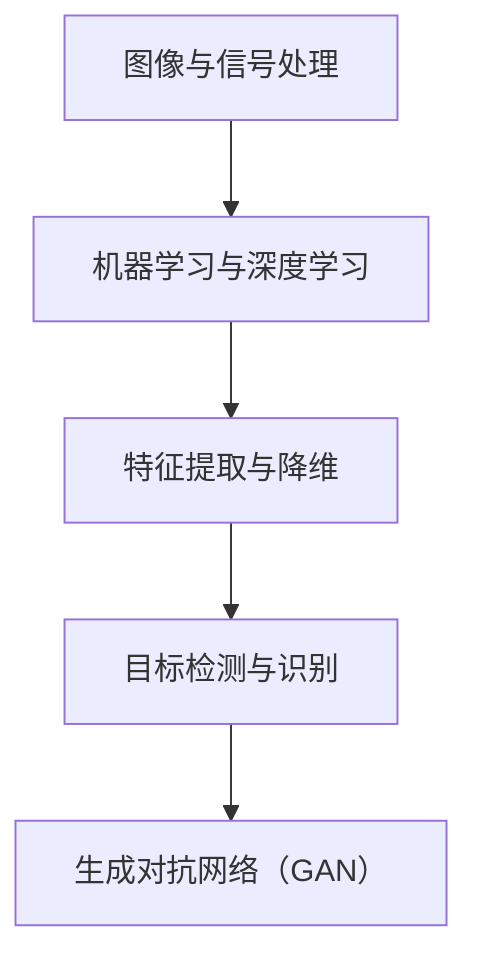

                 

摘要：本文将深入探讨计算机视觉领域的AI模型及其应用。我们将从背景介绍、核心概念与联系、核心算法原理与具体操作步骤、数学模型和公式、项目实践、实际应用场景以及未来展望等多个方面展开讨论，以期为读者提供全面的技术见解和实用指导。

## 1. 背景介绍

计算机视觉作为人工智能的一个重要分支，旨在使计算机能够像人类一样理解和解释视觉信息。随着深度学习技术的飞速发展，计算机视觉领域取得了令人瞩目的成果。从人脸识别、图像分类到物体检测、图像生成，AI模型在计算机视觉中的应用日益广泛。然而，这些模型背后的原理及其应用场景依然存在许多未知和挑战。

本文旨在深入探讨计算机视觉中的AI模型，通过解析核心算法原理、数学模型和实际应用案例，帮助读者更好地理解和应用这些技术。我们将重点关注以下几个方面：

1. **核心概念与联系**：介绍计算机视觉中的一些基本概念和它们之间的联系。
2. **核心算法原理与具体操作步骤**：详细讲解一些重要的AI算法及其实现步骤。
3. **数学模型和公式**：阐述计算机视觉中的数学模型和公式，并进行举例说明。
4. **项目实践**：通过具体项目案例，展示AI模型在计算机视觉中的实际应用。
5. **实际应用场景**：探讨AI模型在各个领域的应用场景及其影响。
6. **未来展望**：预测计算机视觉领域未来的发展趋势和面临的挑战。

## 2. 核心概念与联系

在计算机视觉中，以下几个核心概念尤为重要：

### 2.1 图像与信号处理

图像可以看作是信号的二维表示，其处理方法与信号处理有许多相似之处。例如，傅里叶变换、小波变换等技术在图像去噪、压缩、特征提取等方面发挥着重要作用。

### 2.2 机器学习与深度学习

机器学习是计算机视觉的基础，通过训练模型来识别图像中的特征。深度学习作为机器学习的分支，利用多层神经网络进行特征提取和分类，具有更强的表达能力和泛化能力。

### 2.3 特征提取与降维

特征提取是计算机视觉中的一个关键步骤，旨在从图像中提取出具有区分性的特征。降维技术如主成分分析（PCA）、线性判别分析（LDA）等可以帮助减少数据维度，提高模型的效率和准确性。

### 2.4 目标检测与识别

目标检测是指从图像中识别出特定的对象并定位其在图像中的位置。目标识别则是对检测到的对象进行分类。这些技术在自动驾驶、安防监控、医疗诊断等领域有着广泛应用。

### 2.5 生成对抗网络（GAN）

生成对抗网络是一种新型的深度学习模型，通过对抗训练生成逼真的图像。GAN在图像修复、图像生成、风格迁移等领域表现出色。

下面是核心概念的 Mermaid 流程图：



## 3. 核心算法原理与具体操作步骤

### 3.1 算法原理概述

在计算机视觉中，以下几个核心算法尤为重要：

### 3.1.1 卷积神经网络（CNN）

卷积神经网络是一种专门用于图像处理的多层神经网络，通过卷积层、池化层和全连接层的组合，实现图像特征的提取和分类。

### 3.1.2 生成对抗网络（GAN）

生成对抗网络由生成器和判别器两个部分组成，通过对抗训练生成逼真的图像。

### 3.1.3 目标检测算法

目标检测算法如YOLO、SSD、Faster R-CNN等，可以用于从图像中检测和定位多个对象。

### 3.2 算法步骤详解

#### 3.2.1 卷积神经网络（CNN）

1. **输入层**：接收图像输入，进行预处理。
2. **卷积层**：通过卷积操作提取图像局部特征。
3. **池化层**：降低特征图的维度，提高模型泛化能力。
4. **全连接层**：对提取到的特征进行分类。
5. **输出层**：输出分类结果。

#### 3.2.2 生成对抗网络（GAN）

1. **生成器**：从随机噪声中生成图像。
2. **判别器**：判断生成的图像是否真实。
3. **对抗训练**：生成器和判别器相互竞争，使判别器难以区分真实图像和生成图像。

#### 3.2.3 目标检测算法

1. **特征提取**：利用卷积神经网络提取图像特征。
2. **区域提议**：生成候选区域。
3. **边界框回归**：对候选区域进行边界框回归。
4. **分类与后处理**：对检测结果进行分类和后处理。

### 3.3 算法优缺点

#### 卷积神经网络（CNN）

**优点**：

1. **强大的特征提取能力**：能够自动学习图像中的高层次特征。
2. **端到端训练**：无需手动设计特征提取和分类器。

**缺点**：

1. **计算量大**：训练时间较长。
2. **对数据量要求高**：需要大量训练数据。

#### 生成对抗网络（GAN）

**优点**：

1. **生成能力强**：能够生成高质量、逼真的图像。
2. **无需对齐**：生成器和判别器可以同时训练。

**缺点**：

1. **训练不稳定**：容易出现模式崩溃（mode collapse）问题。
2. **对超参数敏感**：需要精心调参。

#### 目标检测算法

**优点**：

1. **实时性高**：能够在短时间内检测出多个对象。
2. **准确性高**：结合深度学习和传统的目标检测方法，具有较高的准确性。

**缺点**：

1. **计算量大**：需要大量计算资源。
2. **对数据质量要求高**：需要高质量的数据集进行训练。

### 3.4 算法应用领域

卷积神经网络（CNN）在图像分类、物体检测、人脸识别等领域有广泛应用。生成对抗网络（GAN）在图像生成、图像修复、风格迁移等领域表现出色。目标检测算法在自动驾驶、安防监控、医疗诊断等领域发挥着重要作用。

## 4. 数学模型和公式

在计算机视觉中，数学模型和公式起着至关重要的作用。以下将介绍一些重要的数学模型和公式，并进行举例说明。

### 4.1 数学模型构建

#### 4.1.1 卷积神经网络（CNN）

卷积神经网络（CNN）的核心在于卷积操作和激活函数。卷积操作用于提取图像特征，激活函数用于引入非线性特性。

$$
\text{卷积操作}: f(x) = \sum_{i=1}^{n} w_i * x_i + b
$$

其中，$w_i$ 表示卷积核，$x_i$ 表示输入特征，$b$ 表示偏置。

#### 4.1.2 生成对抗网络（GAN）

生成对抗网络（GAN）由生成器和判别器组成，其中生成器的目标是生成逼真的图像，判别器的目标是区分真实图像和生成图像。

$$
\text{生成器}: G(z) = \mu(z) + \sigma(z)\odot \phi(z)
$$

$$
\text{判别器}: D(x) = \sigma(\frac{G(z) + x}{2})
$$

其中，$z$ 表示输入噪声，$x$ 表示真实图像或生成图像，$\mu$ 和 $\sigma$ 分别表示生成器的均值函数和方差函数，$\phi$ 表示生成器的激活函数，$D$ 表示判别器的输出。

### 4.2 公式推导过程

#### 4.2.1 卷积神经网络（CNN）

卷积操作的推导过程如下：

1. **卷积核定义**：卷积核是一个小的矩阵，用于与输入特征进行卷积操作。
2. **卷积操作**：将卷积核与输入特征进行点积操作。
3. **激活函数**：对卷积结果应用激活函数，引入非线性特性。

$$
\text{卷积操作}: f(x) = \sum_{i=1}^{n} w_i * x_i + b
$$

其中，$w_i$ 表示卷积核，$x_i$ 表示输入特征，$b$ 表示偏置。

#### 4.2.2 生成对抗网络（GAN）

生成对抗网络的推导过程如下：

1. **生成器**：生成器从噪声中生成图像，其目标是使判别器难以区分真实图像和生成图像。
2. **判别器**：判别器的目标是区分真实图像和生成图像。

$$
\text{生成器}: G(z) = \mu(z) + \sigma(z)\odot \phi(z)
$$

$$
\text{判别器}: D(x) = \sigma(\frac{G(z) + x}{2})
$$

### 4.3 案例分析与讲解

#### 4.3.1 卷积神经网络（CNN）

以图像分类为例，假设输入图像为 $x$，卷积核为 $w$，偏置为 $b$，激活函数为 $f$，则卷积神经网络的输出为：

$$
\text{输出}: y = f(w * x + b)
$$

其中，$*$ 表示卷积操作。

#### 4.3.2 生成对抗网络（GAN）

以图像生成为例，假设生成器的输入为 $z$，生成器的输出为 $G(z)$，判别器的输出为 $D(G(z))$，则生成对抗网络的损失函数为：

$$
\text{损失函数}: L(G, D) = -\frac{1}{2} \sum_{i=1}^{n} \left[ D(x_i) - 1 \right] - \frac{1}{2} \sum_{i=1}^{n} \left[ D(G(z_i)) \right]
$$

其中，$x_i$ 表示真实图像，$z_i$ 表示输入噪声。

## 5. 项目实践：代码实例和详细解释说明

在本节中，我们将通过一个简单的图像分类项目，展示如何使用卷积神经网络（CNN）进行图像分类，并提供详细的代码实现和解释。

### 5.1 开发环境搭建

为了实现这个项目，我们需要搭建以下开发环境：

1. **操作系统**：Ubuntu 18.04
2. **Python**：Python 3.8
3. **深度学习框架**：TensorFlow 2.6
4. **数据集**：CIFAR-10 数据集

### 5.2 源代码详细实现

下面是图像分类项目的完整代码实现：

```python
import tensorflow as tf
from tensorflow.keras import layers, models
import numpy as np
import matplotlib.pyplot as plt

# 加载CIFAR-10数据集
(x_train, y_train), (x_test, y_test) = tf.keras.datasets.cifar10.load_data()

# 数据预处理
x_train = x_train / 255.0
x_test = x_test / 255.0

# 构建卷积神经网络模型
model = models.Sequential()
model.add(layers.Conv2D(32, (3, 3), activation='relu', input_shape=(32, 32, 3)))
model.add(layers.MaxPooling2D((2, 2)))
model.add(layers.Conv2D(64, (3, 3), activation='relu'))
model.add(layers.MaxPooling2D((2, 2)))
model.add(layers.Conv2D(64, (3, 3), activation='relu'))
model.add(layers.Flatten())
model.add(layers.Dense(64, activation='relu'))
model.add(layers.Dense(10, activation='softmax'))

# 编译模型
model.compile(optimizer='adam',
              loss=tf.keras.losses.SparseCategoricalCrossentropy(from_logits=True),
              metrics=['accuracy'])

# 训练模型
history = model.fit(x_train, y_train, epochs=10, validation_data=(x_test, y_test))

# 评估模型
test_loss, test_acc = model.evaluate(x_test,  y_test, verbose=2)
print('\nTest accuracy:', test_acc)

# 可视化训练过程
plt.plot(history.history['accuracy'], label='accuracy')
plt.plot(history.history['val_accuracy'], label = 'val_accuracy')
plt.xlabel('Epoch')
plt.ylabel('Accuracy')
plt.ylim([0, 1])
plt.xlabel('Epoch')
plt.ylabel('Accuracy')
plt.legend(loc='lower right')
plt.show()
```

### 5.3 代码解读与分析

#### 5.3.1 数据集加载与预处理

```python
(x_train, y_train), (x_test, y_test) = tf.keras.datasets.cifar10.load_data()

x_train = x_train / 255.0
x_test = x_test / 255.0
```

这段代码首先加载了CIFAR-10数据集，并对图像进行了归一化处理，以使其数值范围在0到1之间。

#### 5.3.2 构建卷积神经网络模型

```python
model = models.Sequential()
model.add(layers.Conv2D(32, (3, 3), activation='relu', input_shape=(32, 32, 3)))
model.add(layers.MaxPooling2D((2, 2)))
model.add(layers.Conv2D(64, (3, 3), activation='relu'))
model.add(layers.MaxPooling2D((2, 2)))
model.add(layers.Conv2D(64, (3, 3), activation='relu'))
model.add(layers.Flatten())
model.add(layers.Dense(64, activation='relu'))
model.add(layers.Dense(10, activation='softmax'))
```

这段代码构建了一个简单的卷积神经网络模型。模型由两个卷积层、两个池化层、一个全连接层和一个输出层组成。卷积层用于提取图像特征，池化层用于降低特征图的维度，全连接层用于分类，输出层用于输出概率分布。

#### 5.3.3 编译模型

```python
model.compile(optimizer='adam',
              loss=tf.keras.losses.SparseCategoricalCrossentropy(from_logits=True),
              metrics=['accuracy'])
```

这段代码编译了模型，指定了优化器、损失函数和评估指标。这里使用了Adam优化器和交叉熵损失函数，评估指标为准确率。

#### 5.3.4 训练模型

```python
history = model.fit(x_train, y_train, epochs=10, validation_data=(x_test, y_test))
```

这段代码训练了模型，指定了训练轮数和验证数据。训练过程中，模型会不断调整权重，以最小化损失函数。

#### 5.3.5 评估模型

```python
test_loss, test_acc = model.evaluate(x_test, y_test, verbose=2)
print('\nTest accuracy:', test_acc)
```

这段代码评估了模型在测试集上的表现，输出测试准确率。

#### 5.3.6 可视化训练过程

```python
plt.plot(history.history['accuracy'], label='accuracy')
plt.plot(history.history['val_accuracy'], label = 'val_accuracy')
plt.xlabel('Epoch')
plt.ylabel('Accuracy')
plt.ylim([0, 1])
plt.xlabel('Epoch')
plt.ylabel('Accuracy')
plt.legend(loc='lower right')
plt.show()
```

这段代码将训练过程中的准确率进行了可视化，以帮助分析模型的训练过程。

## 6. 实际应用场景

计算机视觉技术在各个领域都有广泛应用，以下是一些典型的应用场景：

### 6.1 自动驾驶

自动驾驶技术依赖于计算机视觉来感知和解析周围环境。通过目标检测、跟踪、语义分割等技术，自动驾驶系统能够实时识别车辆、行人、交通标志等对象，并做出相应的决策。

### 6.2 安防监控

安防监控领域利用计算机视觉技术实现实时监控和智能分析。目标检测和面部识别技术可以用于监控异常行为、识别犯罪嫌疑人等。

### 6.3 医疗诊断

计算机视觉技术在医疗诊断领域具有广泛应用。例如，通过图像识别技术，可以辅助医生进行疾病诊断、检测异常病变等。

### 6.4 虚拟现实与增强现实

虚拟现实（VR）和增强现实（AR）技术依赖于计算机视觉来实现真实感交互和增强。通过三维建模、物体识别等技术，用户可以在虚拟环境中进行沉浸式体验。

### 6.5 机器人视觉

机器人视觉技术使机器人能够感知和理解周围环境。通过目标检测、跟踪、路径规划等技术，机器人可以实现自主导航、抓取物体等功能。

## 7. 工具和资源推荐

### 7.1 学习资源推荐

1. **《深度学习》（Goodfellow、Bengio、Courville 著）**：深度学习领域的经典教材，全面介绍了深度学习的基础理论和实践方法。
2. **《Python深度学习》（François Chollet 著）**：介绍了使用Python和TensorFlow进行深度学习的实用技巧。
3. **《计算机视觉：算法与应用》（Richard Szeliski 著）**：计算机视觉领域的经典教材，涵盖了计算机视觉的基本理论和应用方法。

### 7.2 开发工具推荐

1. **TensorFlow**：谷歌开源的深度学习框架，支持多种深度学习模型和算法。
2. **PyTorch**：Facebook开源的深度学习框架，具有灵活的动态图计算能力。
3. **OpenCV**：开源的计算机视觉库，提供了丰富的图像处理和计算机视觉功能。

### 7.3 相关论文推荐

1. **“A Guide to Convolutional Neural Networks for Visual Recognition”（Ian Goodfellow、Yoshua Bengio、Aaron Courville 著）**：介绍了卷积神经网络在图像识别中的应用。
2. **“Generative Adversarial Nets”（Ian Goodfellow 等 著）**：提出了生成对抗网络（GAN）的概念和原理。
3. **“Faster R-CNN: Towards Real-Time Object Detection with Region Proposal Networks”（Shaoqing Ren 等 著）**：介绍了Faster R-CNN目标检测算法。

## 8. 总结：未来发展趋势与挑战

### 8.1 研究成果总结

近年来，计算机视觉领域取得了显著成果。深度学习技术的发展使计算机视觉模型在准确性、效率和泛化能力方面有了显著提升。生成对抗网络（GAN）的出现为图像生成、图像修复、风格迁移等领域带来了新的突破。目标检测算法如YOLO、SSD、Faster R-CNN等的提出和优化，进一步提高了目标检测的实时性和准确性。

### 8.2 未来发展趋势

1. **更多应用场景**：随着技术的进步，计算机视觉将在更多领域得到应用，如智能监控、医疗健康、工业自动化等。
2. **更好的模型性能**：通过算法优化和硬件加速，计算机视觉模型的性能将进一步提升，实现更高的实时性和准确性。
3. **跨模态学习**：结合多模态数据（如图像、文本、语音等），实现更强大的信息理解和处理能力。

### 8.3 面临的挑战

1. **数据质量和标注**：高质量、标注准确的数据是训练高性能模型的基石。如何获取和利用海量数据成为了一个挑战。
2. **计算资源**：深度学习模型通常需要大量计算资源，如何在有限的资源下训练高性能模型是一个难题。
3. **隐私和安全**：随着计算机视觉技术的普及，隐私和安全问题日益凸显。如何在保护用户隐私的前提下，实现技术的广泛应用成为了一个重要议题。

### 8.4 研究展望

未来，计算机视觉领域将继续朝着智能化、高效化、安全化的方向发展。通过不断优化算法、提高模型性能，结合多模态数据和跨领域应用，计算机视觉将在更多领域发挥重要作用，推动人工智能技术的发展。

## 9. 附录：常见问题与解答

### 9.1 什么是卷积神经网络（CNN）？

卷积神经网络（CNN）是一种用于图像识别、物体检测等任务的神经网络。它通过卷积操作提取图像特征，具有局部连接、参数共享等特点，可以自动学习图像中的层次特征。

### 9.2 什么是生成对抗网络（GAN）？

生成对抗网络（GAN）是一种由生成器和判别器组成的神经网络结构。生成器生成虚假数据，判别器判断数据是否真实。通过对抗训练，生成器不断提高生成数据的质量，使判别器难以区分真实数据和生成数据。

### 9.3 计算机视觉中的目标检测算法有哪些？

常见的目标检测算法包括YOLO、SSD、Faster R-CNN、R-FCN等。这些算法通过提取图像特征、生成候选区域、边界框回归和分类等步骤，实现对图像中对象的检测和定位。

### 9.4 如何优化深度学习模型的性能？

优化深度学习模型性能的方法包括：

1. **数据增强**：通过旋转、翻转、缩放等数据增强技术，增加训练数据的多样性。
2. **模型剪枝**：通过剪枝冗余的神经元或权重，减少模型参数量，提高模型效率。
3. **迁移学习**：利用预训练模型，在新的任务上继续训练，提高模型性能。
4. **模型集成**：结合多个模型的结果，提高模型预测的准确性和鲁棒性。

---

作者：禅与计算机程序设计艺术 / Zen and the Art of Computer Programming
----------------------------------------------------------------

这篇文章涵盖了计算机视觉领域的关键算法、数学模型、应用场景以及未来展望。通过详细的代码实例和讲解，读者可以更好地理解这些技术的实现和应用。随着深度学习技术的不断进步，计算机视觉将在更多领域发挥重要作用，带来更多的创新和应用。

