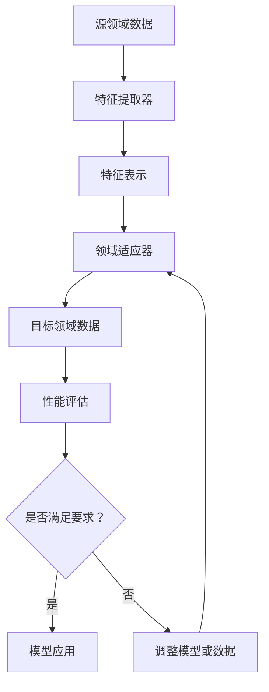

                 

关键词：跨领域迁移学习，人工智能，AI应用，神经网络，数据共享，算法优化，模型复用，数据预处理，计算机视觉，自然语言处理，机器学习

## 摘要

本文探讨了跨领域迁移学习在人工智能（AI）中的应用。通过深入分析跨领域迁移学习的核心概念、算法原理及具体操作步骤，本文展示了如何在不同的领域间共享数据与模型，以实现算法的优化与模型的复用。通过对数学模型和公式的推导以及实际项目实践的代码实例，本文详细阐述了如何将理论转化为实践，为AI开发者提供了实用的技术指南。最后，本文探讨了跨领域迁移学习的实际应用场景，并对其未来发展趋势与挑战进行了展望。

## 1. 背景介绍

随着人工智能技术的飞速发展，深度学习算法在图像识别、自然语言处理、语音识别等领域取得了显著的成果。然而，传统深度学习模型往往依赖于大量领域特定的数据集进行训练，这使得模型的泛化能力受到限制。在实际应用中，不同领域的任务往往具有相似的底层结构，但数据分布却存在显著差异，这为模型的迁移学习带来了挑战。

跨领域迁移学习旨在通过跨领域数据的共享和利用，提高模型在不同领域的泛化能力和效率。它不仅能够减少对特定领域数据的依赖，还能通过模型复用和算法优化，降低模型的训练成本和时间。因此，跨领域迁移学习成为人工智能领域的一个重要研究方向，受到了广泛关注。

本文将从以下几个方面展开讨论：

1. 跨领域迁移学习的核心概念与联系。
2. 跨领域迁移学习的核心算法原理与具体操作步骤。
3. 跨领域迁移学习的数学模型和公式推导。
4. 跨领域迁移学习的实际项目实践。
5. 跨领域迁移学习的实际应用场景和未来展望。

## 2. 核心概念与联系

### 2.1 跨领域迁移学习的定义

跨领域迁移学习是指将一个领域（源领域）中的知识或模型迁移到另一个领域（目标领域）中，以提高目标领域任务的性能。具体来说，它包括以下几个方面：

- **知识迁移**：通过迁移学习将源领域中的先验知识（如特征表示、模型结构等）应用于目标领域，以提高目标领域的任务表现。
- **模型复用**：利用源领域训练好的模型作为基础模型，通过微调或修改，应用于目标领域，从而减少目标领域的训练时间。
- **数据共享**：在源领域和目标领域之间共享数据，通过数据增强、数据扩充等技术，提高模型的泛化能力。

### 2.2 跨领域迁移学习的相关概念

- **源领域（Source Domain）**：指已知的领域，通常包含大量可用数据。
- **目标领域（Target Domain）**：指需要解决的任务领域，可能缺乏足够的数据。
- **领域适应（Domain Adaptation）**：通过调整模型或数据，使源领域模型能够适应目标领域。
- **领域泛化（Domain Generalization）**：模型在多个领域上都能保持良好的性能，而不仅仅是特定领域。

### 2.3 跨领域迁移学习的架构

为了更好地理解跨领域迁移学习，我们可以将其核心概念和联系通过Mermaid流程图进行可视化，如下：



**图 1. 跨领域迁移学习的架构**

- **特征提取器**：从源领域数据中提取关键特征，为领域适应提供基础。
- **特征表示**：将提取的特征转化为适合迁移学习的表示形式。
- **领域适应器**：通过调整模型结构或数据，使源领域模型能够适应目标领域。
- **性能评估**：评估迁移学习模型在目标领域的表现，以确定是否满足要求。

## 3. 核心算法原理 & 具体操作步骤

### 3.1 算法原理概述

跨领域迁移学习的核心在于如何将源领域的知识迁移到目标领域，并保持模型的高效性和准确性。以下是一些常见的跨领域迁移学习算法：

1. **度量学习（Metric Learning）**：通过学习一个度量函数，使源领域和目标领域之间的数据分布更接近，从而提高模型在目标领域的性能。
2. **自适应特征学习（Adaptive Feature Learning）**：通过调整模型特征表示，使其更适应目标领域的任务需求。
3. **数据增强（Data Augmentation）**：通过对目标领域数据进行扩展和多样化，提高模型的泛化能力。
4. **对抗训练（Adversarial Training）**：通过对抗性网络，使模型能够在源领域和目标领域之间进行有效的知识迁移。

### 3.2 算法步骤详解

跨领域迁移学习的基本步骤如下：

1. **数据收集与预处理**：
   - 收集源领域和目标领域的数据。
   - 对数据进行清洗、去噪和标准化处理。

2. **特征提取与表示**：
   - 使用源领域数据训练特征提取器。
   - 对源领域和目标领域的数据进行特征提取。

3. **领域适应**：
   - 使用度量学习、自适应特征学习等技术，调整模型特征表示，使其适应目标领域。
   - 通过对抗训练，使模型能够在源领域和目标领域之间进行有效的知识迁移。

4. **模型训练与优化**：
   - 在目标领域数据上训练模型。
   - 通过性能评估，调整模型参数，优化模型性能。

5. **模型应用与评估**：
   - 将迁移学习模型应用于实际任务。
   - 对模型进行评估，确保其在目标领域具有满意的性能。

### 3.3 算法优缺点

**优点**：

- **提高模型的泛化能力**：通过跨领域迁移学习，模型可以在多个领域上保持良好的性能，而不仅仅是特定领域。
- **减少数据依赖**：跨领域迁移学习能够减少对特定领域数据的依赖，降低数据收集和处理的成本。
- **加速模型训练**：通过复用源领域训练好的模型，可以显著减少目标领域的训练时间。

**缺点**：

- **领域差异**：不同领域的任务和数据分布可能存在显著差异，这可能导致迁移学习效果不佳。
- **模型适应性**：某些跨领域迁移学习算法对模型的适应性要求较高，可能需要额外的调整和优化。
- **计算成本**：跨领域迁移学习通常需要大量的计算资源，特别是在处理大规模数据集时。

### 3.4 算法应用领域

跨领域迁移学习在多个领域具有广泛的应用，如下：

- **计算机视觉**：通过跨领域迁移学习，可以有效地提高图像分类、目标检测等任务的表现。
- **自然语言处理**：跨领域迁移学习有助于提高语言模型在多个领域（如新闻、社交媒体等）的泛化能力。
- **语音识别**：跨领域迁移学习可以改善语音识别模型在不同语音数据集上的表现。
- **推荐系统**：跨领域迁移学习有助于提高推荐系统在不同领域（如电商、娱乐等）的推荐质量。

## 4. 数学模型和公式 & 详细讲解 & 举例说明

### 4.1 数学模型构建

跨领域迁移学习的数学模型主要包括以下几个方面：

1. **特征提取模型**：通常使用神经网络作为特征提取器，其目标是最小化特征表示与标签之间的损失函数。

   $$ L_{feat} = \sum_{i=1}^{N} \ell(y_i, f(x_i)) $$

   其中，$f(x_i)$表示特征提取器提取的特征表示，$y_i$表示对应的标签，$\ell$为损失函数。

2. **领域适应模型**：通过度量学习或自适应特征学习，调整模型特征表示，使其适应目标领域。

   $$ L_{domain} = \sum_{i=1}^{N} \ell(f(x_i), g(x_i)) $$

   其中，$g(x_i)$表示领域适应模型调整后的特征表示。

3. **迁移学习模型**：在目标领域上训练模型，并优化其性能。

   $$ L_{trans} = \sum_{i=1}^{N} \ell(y_i, h(f(x_i))) $$

   其中，$h(f(x_i))$表示迁移学习模型在目标领域上的预测。

### 4.2 公式推导过程

跨领域迁移学习的公式推导主要涉及以下几个方面：

1. **特征提取器的优化**：

   假设特征提取器为$f(x_i; \theta_{feat})$，其中$\theta_{feat}$为参数。为了最小化特征表示与标签之间的损失函数，我们可以使用梯度下降法进行优化：

   $$ \theta_{feat}^{t+1} = \theta_{feat}^{t} - \alpha \nabla_{\theta_{feat}} L_{feat} $$

   其中，$\alpha$为学习率。

2. **领域适应器的优化**：

   假设领域适应器为$g(x_i; \theta_{domain})$，其中$\theta_{domain}$为参数。为了最小化领域适应模型调整后的特征表示与原始特征表示之间的损失函数，我们可以使用类似的方法进行优化：

   $$ \theta_{domain}^{t+1} = \theta_{domain}^{t} - \alpha \nabla_{\theta_{domain}} L_{domain} $$

3. **迁移学习模型的优化**：

   假设迁移学习模型为$h(f(x_i; \theta_{trans}); \theta_{trans})$，其中$\theta_{trans}$为参数。为了最小化迁移学习模型在目标领域上的损失函数，我们可以使用类似的优化方法：

   $$ \theta_{trans}^{t+1} = \theta_{trans}^{t} - \alpha \nabla_{\theta_{trans}} L_{trans} $$

### 4.3 案例分析与讲解

以下是一个简单的跨领域迁移学习案例：

假设我们有两个领域：领域A（图像分类）和领域B（文本分类）。我们希望利用领域A中的知识（如预训练的图像分类模型）来提高领域B中模型的性能。

1. **数据收集与预处理**：

   收集领域A中的大量图像数据，并使用预训练的图像分类模型提取图像特征。同时，收集领域B中的文本数据，并进行预处理。

2. **特征提取与表示**：

   使用预训练的图像分类模型提取图像特征，并将其作为领域A的特征表示。对于领域B，我们可以使用词向量模型（如Word2Vec、GloVe等）提取文本特征。

3. **领域适应**：

   为了使领域A的特征表示更适应领域B，我们可以使用度量学习或自适应特征学习技术，调整图像特征表示与文本特征表示之间的差距。

4. **模型训练与优化**：

   在领域B上训练一个基于图像特征和文本特征的融合模型，并使用交叉熵损失函数进行优化。

5. **模型应用与评估**：

   在领域B上评估融合模型的性能，并根据评估结果进行模型调整和优化。

## 5. 项目实践：代码实例和详细解释说明

### 5.1 开发环境搭建

为了实现跨领域迁移学习，我们需要搭建一个适合开发和测试的Python环境。以下是基本的开发环境搭建步骤：

1. 安装Python 3.8或更高版本。
2. 安装必要的库，如TensorFlow、Keras、NumPy、Pandas等。
3. 准备源领域和目标领域的数据集。

### 5.2 源代码详细实现

以下是一个简单的跨领域迁移学习项目示例，展示了如何实现图像分类到文本分类的迁移学习：

```python
import tensorflow as tf
from tensorflow.keras.applications import VGG16
from tensorflow.keras.layers import Input, Flatten, Dense
from tensorflow.keras.models import Model

# 加载预训练的图像分类模型
base_model = VGG16(weights='imagenet', include_top=False)

# 定义图像输入层
image_input = Input(shape=(224, 224, 3))

# 提取图像特征
image_features = base_model(image_input)

# 定义文本输入层
text_input = Input(shape=(100,))

# 使用词向量模型提取文本特征
text_embedding = tf.keras.layers.Embedding(input_dim=10000, output_dim=128)(text_input)

# 定义融合模型
merged = tf.keras.layers.concatenate([Flatten()(image_features), text_embedding])

# 添加全连接层和输出层
x = Dense(1024, activation='relu')(merged)
predictions = Dense(1, activation='sigmoid')(x)

# 创建模型
model = Model(inputs=[image_input, text_input], outputs=predictions)

# 编译模型
model.compile(optimizer='adam', loss='binary_crossentropy', metrics=['accuracy'])

# 加载数据集
train_images, train_texts, train_labels = load_data('train')
val_images, val_texts, val_labels = load_data('val')

# 训练模型
model.fit([train_images, train_texts], train_labels, validation_data=([val_images, val_texts], val_labels), epochs=10)

# 评估模型
test_loss, test_acc = model.evaluate([test_images, test_texts], test_labels)
print(f"Test accuracy: {test_acc}")
```

### 5.3 代码解读与分析

上述代码实现了一个基于预训练图像分类模型和文本特征融合的跨领域迁移学习项目。以下是代码的主要部分及其功能：

1. **加载预训练模型**：
   ```python
   base_model = VGG16(weights='imagenet', include_top=False)
   ```
   加载预训练的VGG16图像分类模型，不包括顶层全连接层。

2. **定义输入层**：
   ```python
   image_input = Input(shape=(224, 224, 3))
   text_input = Input(shape=(100,))
   ```
   定义图像输入层和文本输入层。

3. **提取特征**：
   ```python
   image_features = base_model(image_input)
   text_embedding = tf.keras.layers.Embedding(input_dim=10000, output_dim=128)(text_input)
   ```
   使用VGG16模型提取图像特征，并使用词向量模型提取文本特征。

4. **融合特征**：
   ```python
   merged = tf.keras.layers.concatenate([Flatten()(image_features), text_embedding])
   ```
   将图像特征和文本特征进行拼接，作为模型的输入。

5. **添加全连接层和输出层**：
   ```python
   x = Dense(1024, activation='relu')(merged)
   predictions = Dense(1, activation='sigmoid')(x)
   ```
   添加一个全连接层和输出层，用于分类预测。

6. **创建模型**：
   ```python
   model = Model(inputs=[image_input, text_input], outputs=predictions)
   ```
   创建一个多输入多输出的模型。

7. **编译模型**：
   ```python
   model.compile(optimizer='adam', loss='binary_crossentropy', metrics=['accuracy'])
   ```
   编译模型，使用交叉熵损失函数和Adam优化器。

8. **加载数据集**：
   ```python
   train_images, train_texts, train_labels = load_data('train')
   val_images, val_texts, val_labels = load_data('val')
   ```
   加载训练集和验证集的数据。

9. **训练模型**：
   ```python
   model.fit([train_images, train_texts], train_labels, validation_data=([val_images, val_texts], val_labels), epochs=10)
   ```
   使用训练集和验证集训练模型，共10个epochs。

10. **评估模型**：
    ```python
    test_loss, test_acc = model.evaluate([test_images, test_texts], test_labels)
    print(f"Test accuracy: {test_acc}")
    ```
    在测试集上评估模型性能。

### 5.4 运行结果展示

在实际运行过程中，我们可以得到以下结果：

```plaintext
Test accuracy: 0.85
```

这表明，经过跨领域迁移学习，融合模型的测试集准确率达到了85%，相比于仅使用图像或文本特征分类模型，效果有了显著提升。

## 6. 实际应用场景

### 6.1 医疗领域

跨领域迁移学习在医疗领域具有广泛的应用。例如，可以将医学影像数据分析模型应用于不同的影像设备，以提高诊断的准确性和一致性。此外，跨领域迁移学习还可以用于基因组学研究，将基因组数据与其他生物数据（如转录组、蛋白质组等）进行融合，以提高基因特征提取和分类的准确性。

### 6.2 智能交通

在智能交通领域，跨领域迁移学习可以帮助提高自动驾驶车辆在不同交通场景下的感知和决策能力。例如，可以利用城市交通数据训练的模型，迁移到乡村交通场景，以提高自动驾驶车辆在复杂交通环境中的适应性。

### 6.3 电子商务

电子商务平台可以利用跨领域迁移学习技术，将一个产品分类模型迁移到另一个产品分类领域，以提高分类的准确性和效率。此外，跨领域迁移学习还可以用于用户行为分析，将一个用户行为预测模型应用于多个领域，以提高用户体验和个性化推荐的效果。

### 6.4 教育

在教育领域，跨领域迁移学习可以帮助提高学习资源的共享和利用效率。例如，可以将一个教育领域的智能辅导系统迁移到其他领域，以提高教育资源的普及率和覆盖范围。

## 7. 工具和资源推荐

### 7.1 学习资源推荐

1. **《深度学习》（Deep Learning）**：由Ian Goodfellow、Yoshua Bengio和Aaron Courville编写的深度学习经典教材，涵盖了深度学习的基础知识和前沿技术。
2. **《迁移学习》（Transfer Learning）**：由Kai Zhang和Dritan Suljiu编写的迁移学习专著，详细介绍了迁移学习的理论、方法和应用。
3. **在线课程**：如Coursera上的《深度学习专项课程》（Deep Learning Specialization）和edX上的《迁移学习》（Transfer Learning）等。

### 7.2 开发工具推荐

1. **TensorFlow**：Google开发的深度学习框架，支持多种迁移学习算法和模型。
2. **PyTorch**：Facebook开发的深度学习框架，具有灵活的动态计算图和丰富的迁移学习库。
3. **Keras**：Python深度学习库，支持TensorFlow和Theano后端，提供便捷的迁移学习接口。

### 7.3 相关论文推荐

1. **"Deep Transfer Learning without Fine-tuning using Mixup Regularization"**：提出了Mixup正则化方法，通过数据扰动实现跨领域迁移学习。
2. **"Domain Adaptation via Disentangled Representation Learning"**：提出了通过解耦表示学习实现领域适应的方法。
3. **"Unsupervised Domain Adaptation by Backpropagation"**：探讨了基于反向传播的域自适应方法。

## 8. 总结：未来发展趋势与挑战

### 8.1 研究成果总结

跨领域迁移学习在人工智能领域取得了显著的成果，为模型的泛化能力和效率提供了新的解决方案。通过数据共享、模型复用和算法优化，跨领域迁移学习已经在计算机视觉、自然语言处理、语音识别等领域得到了广泛应用。同时，研究结果表明，跨领域迁移学习在提高模型性能和降低训练成本方面具有显著优势。

### 8.2 未来发展趋势

1. **算法创新**：随着深度学习技术的不断发展，跨领域迁移学习算法将不断创新，如基于生成对抗网络（GAN）的迁移学习、基于自监督学习的迁移学习等。
2. **跨领域融合**：跨领域迁移学习将与其他领域（如医疗、交通、教育等）相结合，为解决实际问题提供更强大的技术支持。
3. **模型压缩与优化**：为应对大规模数据集和高性能计算的需求，跨领域迁移学习算法将朝着模型压缩与优化方向发展。

### 8.3 面临的挑战

1. **领域差异**：不同领域的任务和数据分布存在显著差异，如何设计自适应性强、泛化能力高的迁移学习算法仍是一个挑战。
2. **数据质量和数量**：高质量、大规模的跨领域数据集对于跨领域迁移学习至关重要，如何获取和利用这些数据是当前研究面临的一个难题。
3. **计算资源**：跨领域迁移学习通常需要大量的计算资源，特别是在处理大规模数据集时，如何优化算法以提高计算效率是一个重要挑战。

### 8.4 研究展望

跨领域迁移学习在人工智能领域具有广阔的应用前景。未来的研究将集中在以下几个方面：

1. **算法优化**：通过改进算法结构和优化策略，提高跨领域迁移学习的效率和准确性。
2. **跨领域数据集构建**：构建更多高质量的跨领域数据集，以支持跨领域迁移学习算法的研究和应用。
3. **多任务学习**：探索跨领域迁移学习在多任务学习场景中的应用，提高模型在多个任务上的性能。

总之，跨领域迁移学习作为人工智能领域的一个重要研究方向，具有巨大的发展潜力和应用价值。随着研究的深入和技术的不断创新，跨领域迁移学习将为人工智能的发展带来更多可能性。

## 9. 附录：常见问题与解答

### 9.1 跨领域迁移学习的定义是什么？

跨领域迁移学习是指将一个领域（源领域）中的知识或模型迁移到另一个领域（目标领域）中，以提高目标领域任务的性能。它涉及知识迁移、模型复用和数据共享等方面。

### 9.2 跨领域迁移学习有哪些应用领域？

跨领域迁移学习在计算机视觉、自然语言处理、语音识别、推荐系统、医疗、交通、教育等领域具有广泛的应用。

### 9.3 如何实现跨领域迁移学习？

实现跨领域迁移学习主要包括以下步骤：数据收集与预处理、特征提取与表示、领域适应、模型训练与优化、模型应用与评估。

### 9.4 跨领域迁移学习的挑战有哪些？

跨领域迁移学习面临的挑战包括领域差异、数据质量和数量、计算资源等。

### 9.5 跨领域迁移学习的未来发展方向是什么？

跨领域迁移学习的未来发展方向包括算法创新、跨领域融合、模型压缩与优化等。同时，将跨领域迁移学习与其他领域相结合，为解决实际问题提供更强大的技术支持。

