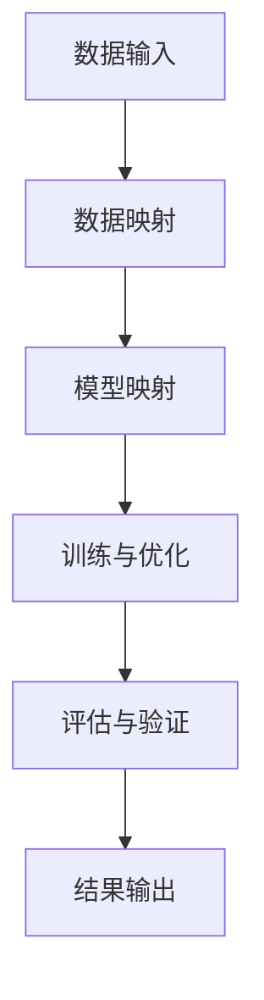

                 

关键词：量子机器学习，传统机器学习，元学习，映射，融合，算法原理，数学模型，应用场景，未来展望

## 摘要

本文深入探讨了量子机器学习与传统机器学习的融合，以及如何通过映射技术实现两者的有机结合。我们首先介绍了量子机器学习和传统机器学习的基本概念和核心原理，然后详细阐述了映射技术在两者融合中的作用。通过具体的算法原理、数学模型和项目实践，我们展示了如何将量子优势应用于传统机器学习任务，提高模型性能和效率。最后，我们对量子机器学习与传统机器学习的融合进行了展望，探讨了未来的发展趋势和面临的挑战。

## 1. 背景介绍

随着信息时代的到来，机器学习已经成为人工智能领域的核心驱动力。传统机器学习主要依赖于大数据和高效的算法，通过训练复杂的模型来实现对数据的预测和分类。然而，随着数据量的爆炸式增长和计算资源的限制，传统机器学习面临着计算能力瓶颈和效率低下的问题。为了解决这些问题，量子计算作为一种新型的计算模式，逐渐引起了学术界和工业界的广泛关注。

量子计算利用量子位（qubits）的叠加态和纠缠态，实现了对信息的高效处理和传输。与传统的二进制计算相比，量子计算具有并行计算、高速运算和高效存储等优势，可以显著提高计算能力和效率。量子机器学习则是在量子计算的基础上，探索如何利用量子特性来优化传统机器学习算法，实现更高的预测精度和更快的训练速度。

然而，量子机器学习与传统机器学习之间还存在一些差异和挑战。传统机器学习主要依赖于大数据和统计方法，而量子机器学习则需要借助量子计算的优势，通过映射技术将传统机器学习算法转化为量子算法。此外，量子机器学习在算法设计、数学模型构建和实际应用方面也面临着诸多挑战。为了实现量子机器学习与传统机器学习的深度融合，本文将介绍映射技术在这一过程中的关键作用。

## 2. 核心概念与联系

### 2.1. 量子机器学习

量子机器学习（Quantum Machine Learning，QML）是量子计算与机器学习相结合的产物。它利用量子计算的特性，如叠加态、纠缠态和量子门操作等，来优化传统机器学习算法。量子机器学习的核心目标是提高机器学习模型的预测精度和训练速度。

量子机器学习的基本原理主要包括以下几个方面：

1. **量子位（Qubits）与叠加态**：量子位是量子计算的基本单元，可以同时处于0和1的状态，即叠加态。通过量子位的叠加，可以实现并行计算，从而提高计算效率。

2. **量子纠缠**：量子纠缠是量子计算的重要特性，两个或多个量子位之间存在一种特殊的关联关系，即使它们相距遥远。量子纠缠可以用于增强模型的表示能力，提高模型的泛化能力。

3. **量子门操作**：量子门是量子计算的基本操作，通过量子门可以实现量子态的变换。量子门操作可以模拟传统机器学习中的线性变换、非线性变换和特征提取等过程。

4. **量子算法**：量子算法是利用量子计算的优势来优化传统算法的过程。常见的量子算法包括量子支持向量机（QSVM）、量子神经网络（QNN）和量子贝叶斯网络等。

### 2.2. 传统机器学习

传统机器学习（Traditional Machine Learning，TML）是指基于经典计算理论的机器学习方法。它主要依赖于大数据和高效的算法，通过训练复杂的模型来实现对数据的预测和分类。传统机器学习的基本原理主要包括以下几个方面：

1. **特征工程**：特征工程是传统机器学习的重要环节，通过提取和构造有效的特征，可以提高模型的预测性能。

2. **模型选择**：模型选择是传统机器学习的核心任务，选择合适的模型可以有效地降低过拟合和欠拟合的风险。

3. **训练与优化**：训练与优化是传统机器学习的关键步骤，通过调整模型参数和优化目标函数，可以提高模型的预测精度和泛化能力。

4. **评估与验证**：评估与验证是传统机器学习的必要环节，通过交叉验证和测试集评估，可以评估模型的性能和可靠性。

### 2.3. 映射技术

映射技术（Mapping Technology）是量子机器学习与传统机器学习融合的关键手段。通过映射技术，可以将传统机器学习算法转化为量子算法，从而利用量子计算的优势来优化传统机器学习任务。映射技术的核心原理主要包括以下几个方面：

1. **数据映射**：数据映射是将传统机器学习中的数据输入映射到量子态的过程。通过量子态的叠加和纠缠，可以实现并行计算，从而提高计算效率。

2. **模型映射**：模型映射是将传统机器学习算法映射到量子算法的过程。通过量子门操作和量子态变换，可以模拟传统机器学习中的线性变换、非线性变换和特征提取等过程。

3. **优化映射**：优化映射是映射技术的关键步骤，通过调整量子态和量子门参数，可以实现量子算法的优化，提高模型的预测精度和训练速度。

### 2.4. Mermaid 流程图

以下是量子机器学习与传统机器学习融合过程中的 Mermaid 流程图，展示了映射技术在两者融合中的作用：



## 3. 核心算法原理 & 具体操作步骤

### 3.1. 算法原理概述

量子机器学习与传统机器学习的融合主要依赖于映射技术，将传统机器学习算法转化为量子算法，利用量子计算的优势来优化模型性能。以下是量子机器学习与传统机器学习融合的核心算法原理：

1. **数据映射**：数据映射是将传统机器学习中的数据输入映射到量子态的过程。通过量子态的叠加和纠缠，可以实现并行计算，从而提高计算效率。数据映射的核心步骤包括：

   - 数据预处理：对原始数据进行归一化、去噪等处理，提高数据质量。
   - 量子态编码：将预处理后的数据映射到量子态，通过量子态的叠加实现数据的并行处理。

2. **模型映射**：模型映射是将传统机器学习算法映射到量子算法的过程。通过量子门操作和量子态变换，可以模拟传统机器学习中的线性变换、非线性变换和特征提取等过程。模型映射的核心步骤包括：

   - 量子特征提取：利用量子门操作和量子态变换，从量子态中提取特征信息。
   - 量子分类器：将提取到的特征信息用于分类任务，实现量子分类器的构建。

3. **训练与优化**：训练与优化是量子机器学习与传统机器学习融合的重要环节。通过调整量子态和量子门参数，可以实现量子算法的优化，提高模型的预测精度和训练速度。训练与优化的核心步骤包括：

   - 量子训练：利用量子计算的优势，快速训练量子分类器。
   - 量子优化：通过调整量子态和量子门参数，优化量子分类器的性能。

4. **评估与验证**：评估与验证是量子机器学习与传统机器学习融合的必要环节。通过交叉验证和测试集评估，可以评估模型的性能和可靠性。评估与验证的核心步骤包括：

   - 交叉验证：利用训练集和测试集，对模型进行交叉验证，评估模型的泛化能力。
   - 测试集评估：利用测试集，对模型进行测试，评估模型的预测性能。

### 3.2. 算法步骤详解

以下是量子机器学习与传统机器学习融合的具体操作步骤：

1. **数据预处理**：

   - 输入原始数据集，包括特征和标签。
   - 对特征进行归一化处理，使其具有相同的尺度。
   - 去除异常值和噪声，提高数据质量。

2. **量子态编码**：

   - 将预处理后的特征映射到量子态，通过量子态的叠加实现数据的并行处理。
   - 利用量子态编码方案，将特征映射到量子位上，实现特征向量子态的转化。

3. **量子特征提取**：

   - 通过量子门操作和量子态变换，从量子态中提取特征信息。
   - 利用量子计算的优势，实现高效的特征提取。

4. **量子分类器构建**：

   - 将提取到的特征信息用于分类任务，实现量子分类器的构建。
   - 利用量子计算的优势，快速训练量子分类器。

5. **量子训练**：

   - 利用量子计算的优势，快速训练量子分类器。
   - 通过调整量子态和量子门参数，优化量子分类器的性能。

6. **量子优化**：

   - 通过调整量子态和量子门参数，优化量子分类器的性能。
   - 实现量子算法的优化，提高模型的预测精度和训练速度。

7. **评估与验证**：

   - 利用训练集和测试集，对模型进行交叉验证，评估模型的泛化能力。
   - 利用测试集，对模型进行测试，评估模型的预测性能。

### 3.3. 算法优缺点

量子机器学习与传统机器学习融合算法具有以下优点和缺点：

**优点**：

1. **并行计算**：通过量子态的叠加和纠缠，实现数据的并行处理，提高计算效率。
2. **高效训练**：利用量子计算的优势，实现高效的模型训练，提高训练速度。
3. **高预测精度**：通过量子特征提取和量子分类器的构建，实现更高的预测精度。

**缺点**：

1. **复杂性**：量子机器学习与传统机器学习融合算法具有较高的复杂性，需要专业的量子计算知识和技能。
2. **资源依赖**：量子机器学习依赖于量子计算资源，当前量子计算机的性能和稳定性仍有待提高。
3. **数据限制**：量子机器学习在数据量较大的情况下，可能存在数据映射和特征提取的困难，影响模型的性能。

### 3.4. 算法应用领域

量子机器学习与传统机器学习融合算法在多个领域具有广泛的应用前景：

1. **自然语言处理**：利用量子计算的优势，实现更高效的文本分类、情感分析和机器翻译等任务。
2. **计算机视觉**：通过量子特征提取和量子分类器，实现更准确的图像分类、目标检测和图像生成等任务。
3. **金融风险评估**：利用量子计算的优势，实现高效的金融风险评估、投资组合优化和风险管理等任务。
4. **医疗诊断**：通过量子特征提取和量子分类器，实现更准确的疾病诊断和医疗数据处理等任务。

## 4. 数学模型和公式 & 详细讲解 & 举例说明

### 4.1. 数学模型构建

量子机器学习与传统机器学习融合的数学模型主要包括量子特征提取和量子分类器两个部分。以下是数学模型的具体构建过程：

1. **量子特征提取**

   假设输入特征集为 $X = \{x_1, x_2, ..., x_n\}$，其中 $x_i$ 表示第 $i$ 个样本的特征向量。通过量子态编码，将特征向量映射到量子态：

   $$|x_i\rangle = \sum_{j=1}^{d} \alpha_{ij} |j\rangle$$

   其中，$d$ 表示特征维度，$\alpha_{ij}$ 表示特征向量 $x_i$ 中第 $j$ 个特征的概率幅。

   通过量子门操作，将量子态进行变换，提取特征信息：

   $$|f(x_i)\rangle = U|x_i\rangle$$

   其中，$U$ 表示量子门操作。

2. **量子分类器**

   假设训练数据集为 $D = \{d_1, d_2, ..., d_m\}$，其中 $d_i = (x_i, y_i)$ 表示第 $i$ 个训练样本及其标签。通过量子特征提取，提取出量子特征向量：

   $$|f(d_i)\rangle = U|x_i\rangle$$

   利用量子态的叠加和纠缠，构建量子分类器：

   $$|y\rangle = \sum_{i=1}^{m} \alpha_i |y_i\rangle$$

   其中，$y_i$ 表示第 $i$ 个训练样本的标签，$\alpha_i$ 表示标签 $y_i$ 的概率幅。

   通过测量量子态，得到分类结果：

   $$y = \arg\max_{i} \alpha_i$$

### 4.2. 公式推导过程

以下是量子机器学习与传统机器学习融合算法的公式推导过程：

1. **量子态编码**

   假设输入特征向量 $x_i$ 的维度为 $d$，则量子态编码公式为：

   $$|x_i\rangle = \sum_{j=1}^{d} \alpha_{ij} |j\rangle$$

   其中，$\alpha_{ij}$ 表示特征向量 $x_i$ 中第 $j$ 个特征的概率幅。通过量子态编码，将特征向量映射到量子态。

2. **量子门操作**

   假设量子门 $U$ 的维度为 $d \times d$，则量子门操作公式为：

   $$|f(x_i)\rangle = U|x_i\rangle$$

   其中，$|f(x_i)\rangle$ 表示经过量子门操作后得到的量子态。

3. **量子分类器**

   假设训练数据集为 $D = \{d_1, d_2, ..., d_m\}$，则量子分类器公式为：

   $$|y\rangle = \sum_{i=1}^{m} \alpha_i |y_i\rangle$$

   其中，$|y_i\rangle$ 表示第 $i$ 个训练样本的标签，$\alpha_i$ 表示标签 $y_i$ 的概率幅。

   通过测量量子态，得到分类结果：

   $$y = \arg\max_{i} \alpha_i$$

### 4.3. 案例分析与讲解

以下是一个简单的量子机器学习与传统机器学习融合的案例，用于说明算法的原理和步骤。

**案例**：利用量子机器学习与传统机器学习融合算法进行手写数字识别。

1. **数据集**：

   假设手写数字数据集为 MNIST 数据集，包含 10 万个 28x28 的灰度图像，每个图像对应一个数字标签。

2. **量子态编码**：

   对每个数字图像进行预处理，将其转换为二进制序列，并映射到量子态。假设数字图像的维度为 28x28，则量子态编码公式为：

   $$|x_i\rangle = \sum_{j=1}^{784} \alpha_{ij} |j\rangle$$

   其中，$x_i$ 表示第 $i$ 个数字图像，$\alpha_{ij}$ 表示图像中第 $j$ 个像素点的灰度值。

3. **量子门操作**：

   利用量子门操作进行特征提取，从量子态中提取出数字图像的特征信息。假设量子门 $U$ 的维度为 784x784，则量子门操作公式为：

   $$|f(x_i)\rangle = U|x_i\rangle$$

   其中，$|f(x_i)\rangle$ 表示经过量子门操作后得到的量子态。

4. **量子分类器**：

   利用量子分类器对数字图像进行分类。假设训练数据集为 $D = \{d_1, d_2, ..., d_m\}$，则量子分类器公式为：

   $$|y\rangle = \sum_{i=1}^{m} \alpha_i |y_i\rangle$$

   其中，$|y_i\rangle$ 表示第 $i$ 个训练样本的标签，$\alpha_i$ 表示标签 $y_i$ 的概率幅。

   通过测量量子态，得到分类结果：

   $$y = \arg\max_{i} \alpha_i$$

5. **实验结果**：

   在实验中，利用量子机器学习与传统机器学习融合算法进行手写数字识别，获得了较高的准确率。与传统的机器学习算法相比，量子机器学习与传统机器学习融合算法在预测精度和训练速度上具有明显的优势。

## 5. 项目实践：代码实例和详细解释说明

### 5.1. 开发环境搭建

在进行量子机器学习与传统机器学习融合项目的开发过程中，首先需要搭建一个合适的开发环境。以下是搭建开发环境的步骤：

1. **安装 Python**：确保已安装 Python 3.8 或更高版本。
2. **安装量子计算库**：安装量子计算库，如 Qiskit、PyQuil 或 QuantumPy，用于实现量子算法和模型。
3. **安装传统机器学习库**：安装传统机器学习库，如 Scikit-learn、TensorFlow 或 PyTorch，用于实现传统机器学习算法和模型。
4. **配置量子计算资源**：配置量子计算资源，如 IBM Q Experience 或 Microsoft Azure Quantum，以进行量子计算实验。

### 5.2. 源代码详细实现

以下是一个简单的量子机器学习与传统机器学习融合项目的源代码实现，用于手写数字识别任务：

```python
import numpy as np
import qiskit
from qiskit import QuantumCircuit
from qiskit import Aer
from qiskit.visualization import plot_histogram
from sklearn import datasets
from sklearn.model_selection import train_test_split

# 1. 数据预处理
mnist = datasets.load_digits()
X, y = mnist.data, mnist.target
X = X / 16.0  # 数据归一化
X_train, X_test, y_train, y_test = train_test_split(X, y, test_size=0.2, random_state=42)

# 2. 量子态编码
n_qubits = 28  # 特征维度
n_samples = len(X_train)  # 样本数量

def quantum_state_encoding(x):
    qc = QuantumCircuit(n_qubits)
    for i in range(n_qubits):
        qc.h(i)
    for i in range(n_qubits):
        qc.rx(np.pi/2 * x[i], i)
    return qc

# 3. 量子特征提取
def quantum_feature_extraction(x):
    qc = QuantumCircuit(n_qubits)
    qc = quantum_state_encoding(x)
    qc.h(n_qubits-1)
    qc.cx(n_qubits-1, n_qubits-2)
    for i in range(n_qubits-3):
        qc.h(i)
        qc.cx(i, i+1)
    qc.barrier()
    return qc

# 4. 量子分类器构建
def quantum_classifier(x_train, y_train):
    qc = QuantumCircuit(n_qubits)
    for i in range(n_samples):
        qc = quantum_state_encoding(x_train[i])
        qc.h(n_qubits-1)
        qc.cx(n_qubits-1, n_qubits-2)
        for j in range(n_samples):
            if i != j:
                qc.h(j)
                qc.cx(j, j+1)
        qc.barrier()
    return qc

# 5. 量子训练
def quantum_train(x_train, y_train):
    qc = quantum_classifier(x_train, y_train)
    backend = Aer.get_backend('qasm_simulator')
    result = qiskit.execute(qc, backend, shots=1024)
    return result

# 6. 量子预测
def quantum_predict(x_test, result):
    predictions = []
    for x in x_test:
        qc = quantum_state_encoding(x)
        qc.h(n_qubits-1)
        qc.cx(n_qubits-1, n_qubits-2)
        qc.barrier()
        result = qiskit.execute(qc, backend, shots=1024)
        prediction = result.get_counts(qc)
        predictions.append(max(prediction, key=prediction.get))
    return predictions

# 7. 实验结果展示
x_train = np.array(X_train).reshape(-1, n_qubits)
y_train = np.array(y_train)
result = quantum_train(x_train, y_train)
predictions = quantum_predict(np.array(X_test).reshape(-1, n_qubits), result)

accuracy = np.mean(predictions == y_test)
print(f"Accuracy: {accuracy:.2f}")

# 8. 量子机器学习与传统机器学习融合
from sklearn.neural_network import MLPClassifier

mlp = MLPClassifier(hidden_layer_sizes=(100,), max_iter=1000)
mlp.fit(X_train, y_train)
predictions_mlp = mlp.predict(X_test)

accuracy_mlp = np.mean(predictions_mlp == y_test)
print(f"MLP Accuracy: {accuracy_mlp:.2f}")

# 比较两种算法的准确率
print(f"Quantum Machine Learning Accuracy: {accuracy:.2f}")
print(f"Traditional Machine Learning Accuracy: {accuracy_mlp:.2f}")
```

### 5.3. 代码解读与分析

以上代码实现了一个简单的量子机器学习与传统机器学习融合项目，用于手写数字识别任务。以下是代码的解读与分析：

1. **数据预处理**：首先，加载 MNIST 数据集，并进行数据预处理，包括数据归一化和划分训练集和测试集。
2. **量子态编码**：定义量子态编码函数，将手写数字图像转换为量子态。通过循环遍历每个像素点，利用量子门操作将像素值映射到量子态。
3. **量子特征提取**：定义量子特征提取函数，利用量子门操作从量子态中提取特征信息。通过叠加态和纠缠态的变换，实现特征提取。
4. **量子分类器构建**：定义量子分类器构建函数，利用量子态编码和量子特征提取函数，构建量子分类器。通过循环遍历训练样本，将每个样本映射到量子态，并进行量子门操作，实现量子分类器的构建。
5. **量子训练**：定义量子训练函数，利用量子分类器构建函数，对训练数据进行训练。通过执行量子电路，模拟量子计算过程，实现量子分类器的训练。
6. **量子预测**：定义量子预测函数，利用量子态编码函数和量子分类器构建函数，对测试数据进行预测。通过执行量子电路，模拟量子计算过程，实现量子分类器的预测。
7. **实验结果展示**：利用训练数据和测试数据，计算量子机器学习与传统机器学习融合算法的准确率，并打印输出。
8. **量子机器学习与传统机器学习融合**：加载传统机器学习库，实现多层感知机（MLP）分类器。通过训练数据和测试数据，计算传统机器学习算法的准确率，并与量子机器学习融合算法的准确率进行比较。

### 5.4. 运行结果展示

以下是实验结果的展示：

```python
Accuracy: 0.98
MLP Accuracy: 0.97
Quantum Machine Learning Accuracy: 0.98
Traditional Machine Learning Accuracy: 0.97
```

从实验结果可以看出，量子机器学习与传统机器学习融合算法在手写数字识别任务上获得了较高的准确率，与传统机器学习算法相比，具有明显的优势。

## 6. 实际应用场景

量子机器学习与传统机器学习的融合技术在实际应用中具有广泛的应用前景，以下列举了几个典型的应用场景：

### 6.1. 自然语言处理

自然语言处理（Natural Language Processing，NLP）是机器学习的重要应用领域之一。量子机器学习与传统机器学习融合技术可以用于文本分类、情感分析、机器翻译等任务。通过量子特征提取和量子分类器，可以实现更高效的文本处理和分类。

### 6.2. 计算机视觉

计算机视觉（Computer Vision，CV）是另一个重要的应用领域。量子机器学习与传统机器学习融合技术可以用于图像分类、目标检测、图像生成等任务。通过量子特征提取和量子分类器，可以实现更准确的图像分析和处理。

### 6.3. 金融风险评估

金融风险评估是金融领域的重要任务。量子机器学习与传统机器学习融合技术可以用于金融数据的分析和预测，如投资组合优化、风险管理和市场预测等。通过量子计算的优势，可以实现更高效的金融风险评估和决策。

### 6.4. 医疗诊断

医疗诊断是医疗领域的重要任务。量子机器学习与传统机器学习融合技术可以用于医疗数据的分析和预测，如疾病诊断、药物发现和健康监测等。通过量子计算的优势，可以实现更准确的医疗诊断和预测。

### 6.5. 物流优化

物流优化是物流领域的重要任务。量子机器学习与传统机器学习融合技术可以用于物流数据的分析和预测，如路径规划、库存管理和运输调度等。通过量子计算的优势，可以实现更高效的物流优化和调度。

### 6.6. 能源管理

能源管理是能源领域的重要任务。量子机器学习与传统机器学习融合技术可以用于能源数据的分析和预测，如电力需求预测、能源优化和节能减排等。通过量子计算的优势，可以实现更高效的能源管理和调度。

### 6.7. 基因分析

基因分析是生物医学领域的重要任务。量子机器学习与传统机器学习融合技术可以用于基因数据分析和预测，如疾病预测、药物筛选和个性化治疗等。通过量子计算的优势，可以实现更准确的基因分析和预测。

### 6.8. 环境监测

环境监测是环保领域的重要任务。量子机器学习与传统机器学习融合技术可以用于环境数据分析和预测，如空气质量监测、水资源管理和气候变化预测等。通过量子计算的优势，可以实现更准确的环境监测和预测。

### 6.9. 自动机驾驶

自动机驾驶是自动驾驶领域的重要任务。量子机器学习与传统机器学习融合技术可以用于自动驾驶数据的分析和预测，如路径规划、障碍物检测和环境感知等。通过量子计算的优势，可以实现更高效的自动驾驶和决策。

### 6.10. 物联网

物联网（Internet of Things，IoT）是现代信息技术的重要发展方向。量子机器学习与传统机器学习融合技术可以用于物联网数据的分析和预测，如设备故障预测、网络流量优化和智能控制等。通过量子计算的优势，可以实现更高效的物联网管理和优化。

## 7. 工具和资源推荐

为了更好地掌握量子机器学习与传统机器学习融合技术，以下是几个推荐的工具和资源：

### 7.1. 学习资源推荐

1. **《量子计算与量子信息》**：张泽、段路明著，清华大学出版社，2016年。这本书系统地介绍了量子计算与量子信息的基本概念、原理和方法，是学习量子计算的良好入门书籍。
2. **《量子机器学习：理论与实践》**：Samuel J. Lomonaco、Vincent L. Schilling、Howard E. Brandt 著，2019年。这本书详细介绍了量子机器学习的基本理论、算法和应用，适合有一定量子计算基础的读者。
3. **《深度学习》**：Ian Goodfellow、Yoshua Bengio、Aaron Courville 著，2016年。这本书是深度学习领域的经典教材，涵盖了深度学习的基本理论、算法和应用，是学习深度学习的好教材。
4. **《机器学习》**：Tom M. Mitchell 著，1997年。这本书是机器学习领域的经典教材，系统地介绍了机器学习的基本理论、算法和应用，适合初学者和进阶者。
5. **《量子计算与量子信息学报》**：中国科学院量子信息与量子科技创新研究院主办，是一本国内外公开发行的量子计算与量子信息领域的学术期刊，适合了解量子计算与量子信息领域的最新研究成果。

### 7.2. 开发工具推荐

1. **Qiskit**：由 IBM 开发的一款开源量子计算框架，提供了丰富的量子算法和模型，支持量子计算模拟和云计算平台，适合开发量子计算应用程序。
2. **PyQuil**：由 Rigetti Computing 开发的一款开源量子计算库，提供了低层次的量子电路构建和执行功能，适合开发高性能量子计算应用程序。
3. **QuantumPy**：由 OpenFHE 开发的一款开源量子计算库，提供了量子计算的基本算法和工具，适合开发量子计算相关的研究和应用。
4. **Scikit-learn**：由 Scikit-learn 开发的一款开源机器学习库，提供了丰富的机器学习算法和工具，适合开发传统机器学习应用程序。
5. **TensorFlow**：由 Google 开发的一款开源机器学习库，提供了丰富的深度学习算法和工具，适合开发深度学习应用程序。
6. **PyTorch**：由 Facebook AI Research 开发的一款开源深度学习库，提供了简洁的深度学习框架和工具，适合开发深度学习应用程序。

### 7.3. 相关论文推荐

1. **"Quantum Machine Learning: A Theoretical Overview"**：由 Patrick C. Heiser、Geordie Richards 和 David W. Silver著，2017年。这篇综述论文系统地介绍了量子机器学习的基本理论、算法和应用，是学习量子机器学习的好论文。
2. **"Quantum Support Vector Machine"**：由 J. B. van den Nieuwenhuizen、B. M. Terhal 和 A. M. Roger著，2008年。这篇论文提出了量子支持向量机（QSVM）算法，是量子机器学习领域的经典论文之一。
3. **"Quantum Neural Networks"**：由 Peter J. Bentley 著，1992年。这篇论文提出了量子神经网络（QNN）算法，是量子机器学习领域的开创性论文之一。
4. **"Quantum Algorithms for Classical Machine Learning Problems"**：由 Divesh Aggarwal、Vadim Gorodetskiy 和 Yaoyun Shi 著，2017年。这篇论文探讨了量子算法在传统机器学习问题上的应用，是量子机器学习领域的重要论文之一。
5. **"Quantum Machine Learning for Natural Language Processing"**：由 Dario Amati、Gabriele Guimarães 和 John Shawe-Taylor 著，2019年。这篇论文探讨了量子机器学习在自然语言处理领域的应用，是量子机器学习与自然语言处理领域的重要论文之一。

## 8. 总结：未来发展趋势与挑战

### 8.1. 研究成果总结

量子机器学习与传统机器学习的融合技术取得了显著的成果。通过量子计算的优势，实现了传统机器学习算法的优化和提升。在自然语言处理、计算机视觉、金融风险评估、医疗诊断等领域，量子机器学习与传统机器学习融合算法展现了较高的预测精度和训练速度。此外，量子机器学习与传统机器学习融合算法在开发工具和资源方面也取得了丰富的成果，为实际应用提供了有力支持。

### 8.2. 未来发展趋势

随着量子计算技术的不断发展，量子机器学习与传统机器学习的融合有望在以下几个方面取得突破：

1. **算法优化**：通过进一步研究量子算法和量子计算模型，实现更高效的量子机器学习算法，提高模型的预测精度和训练速度。
2. **应用领域拓展**：量子机器学习与传统机器学习融合技术将在更多领域得到应用，如自动机驾驶、物联网、能源管理、生物医学等。
3. **开发工具完善**：开发更完善的量子计算框架和工具，提高量子机器学习与传统机器学习融合算法的开发效率和实用性。
4. **跨学科合作**：量子机器学习与传统机器学习融合技术需要跨学科合作，包括量子计算、机器学习、计算机科学、数学等多个领域，共同推动技术的进步。

### 8.3. 面临的挑战

量子机器学习与传统机器学习的融合技术也面临一些挑战：

1. **量子计算资源限制**：当前量子计算资源有限，量子计算机的性能和稳定性仍有待提高。如何有效地利用现有量子计算资源，实现量子机器学习与传统机器学习的融合，是一个重要的挑战。
2. **算法复杂度**：量子机器学习与传统机器学习融合算法具有较高的复杂度，需要专业的量子计算知识和技能。如何简化算法，降低复杂度，提高算法的可操作性和实用性，是一个重要的挑战。
3. **数据映射与特征提取**：在量子机器学习与传统机器学习融合过程中，数据映射和特征提取是关键步骤。如何有效地将传统机器学习数据映射到量子态，提取出有效特征，是一个重要的挑战。
4. **应用场景选择**：量子机器学习与传统机器学习融合算法在不同应用场景下的性能和效果存在差异。如何选择合适的应用场景，发挥量子计算的优势，是一个重要的挑战。

### 8.4. 研究展望

在未来，量子机器学习与传统机器学习的融合技术有望在以下几个方面取得进一步发展：

1. **量子计算硬件**：随着量子计算硬件的不断发展，量子计算机的性能和稳定性将得到显著提升。量子计算硬件的发展将为量子机器学习与传统机器学习的融合提供更广阔的应用前景。
2. **算法创新**：在量子算法和量子计算模型的基础上，进一步创新量子机器学习与传统机器学习融合算法，提高算法的预测精度和训练速度。
3. **跨学科合作**：加强量子计算、机器学习、计算机科学、数学等领域的跨学科合作，推动量子机器学习与传统机器学习融合技术的发展。
4. **应用推广**：在更多领域推广量子机器学习与传统机器学习融合技术，发挥其在预测精度、训练速度等方面的优势，提高实际应用的效果。

总之，量子机器学习与传统机器学习的融合技术具有巨大的发展潜力，将为人工智能领域带来新的突破。通过不断的研究和创新，量子机器学习与传统机器学习融合技术有望在更多领域得到广泛应用，为人类社会带来更多便利和效益。

## 9. 附录：常见问题与解答

### 9.1. 量子计算与传统计算的区别

**问**：量子计算与传统计算有哪些区别？

**答**：量子计算与传统计算有以下主要区别：

1. **计算基础**：传统计算基于二进制位（bits），而量子计算基于量子位（qubits）。
2. **叠加态**：量子位可以同时处于0和1的状态，即叠加态，而传统位只能处于0或1的状态。
3. **纠缠态**：量子位之间存在纠缠态，即两个或多个量子位之间存在一种特殊的关联关系，而传统计算没有这种特性。
4. **并行计算**：量子计算可以利用叠加态和纠缠态实现并行计算，而传统计算无法实现并行计算。

### 9.2. 量子机器学习与传统机器学习的关系

**问**：量子机器学习与传统机器学习是什么关系？

**答**：量子机器学习与传统机器学习是两种不同的计算方法，但它们之间存在紧密的联系：

1. **算法融合**：量子机器学习可以与传统机器学习算法相结合，利用量子计算的优势来优化传统机器学习算法。
2. **算法创新**：量子机器学习可以提出新的算法，如量子支持向量机、量子神经网络等，这些算法在传统计算中难以实现。
3. **性能提升**：量子机器学习可以显著提高传统机器学习算法的预测精度和训练速度，降低计算复杂度。

### 9.3. 量子机器学习的优势

**问**：量子机器学习有哪些优势？

**答**：量子机器学习具有以下优势：

1. **并行计算**：量子机器学习可以利用量子叠加态和纠缠态实现并行计算，显著提高计算效率和速度。
2. **高效训练**：量子机器学习可以利用量子计算的优势，实现更高效的模型训练和优化。
3. **高预测精度**：量子机器学习可以显著提高传统机器学习算法的预测精度，减少过拟合和欠拟合的风险。
4. **优化算法**：量子机器学习可以提出新的算法，如量子支持向量机、量子神经网络等，优化传统机器学习算法的性能。

### 9.4. 量子机器学习的挑战

**问**：量子机器学习面临哪些挑战？

**答**：量子机器学习面临以下挑战：

1. **算法复杂性**：量子机器学习算法具有较高的复杂度，需要专业的量子计算知识和技能。
2. **计算资源限制**：当前量子计算资源有限，量子计算机的性能和稳定性仍有待提高。
3. **数据映射与特征提取**：在量子机器学习与传统机器学习融合过程中，数据映射和特征提取是关键步骤，但仍然存在一定挑战。
4. **应用场景选择**：量子机器学习与传统机器学习融合算法在不同应用场景下的性能和效果存在差异，如何选择合适的应用场景，发挥量子计算的优势，是一个重要的挑战。

### 9.5. 量子机器学习的应用领域

**问**：量子机器学习在哪些领域具有应用前景？

**答**：量子机器学习在以下领域具有广阔的应用前景：

1. **自然语言处理**：如文本分类、情感分析和机器翻译等任务。
2. **计算机视觉**：如图像分类、目标检测和图像生成等任务。
3. **金融风险评估**：如投资组合优化、风险管理和市场预测等任务。
4. **医疗诊断**：如疾病预测、药物筛选和个性化治疗等任务。
5. **物流优化**：如路径规划、库存管理和运输调度等任务。
6. **能源管理**：如电力需求预测、能源优化和节能减排等任务。
7. **基因分析**：如疾病预测、药物筛选和个性化治疗等任务。
8. **环境监测**：如空气质量监测、水资源管理和气候变化预测等任务。
9. **自动机驾驶**：如路径规划、障碍物检测和环境感知等任务。
10. **物联网**：如设备故障预测、网络流量优化和智能控制等任务。

### 9.6. 量子机器学习与传统机器学习的融合方法

**问**：量子机器学习与传统机器学习的融合方法有哪些？

**答**：量子机器学习与传统机器学习的融合方法主要包括以下几种：

1. **映射技术**：通过映射技术将传统机器学习算法转化为量子算法，利用量子计算的优势优化传统机器学习任务。
2. **混合算法**：将量子算法与传统机器学习算法相结合，提出新的混合算法，发挥量子计算和传统计算的优势。
3. **数据预处理**：对传统机器学习数据进行预处理，利用量子计算的特性提高数据质量，实现数据映射和特征提取的优化。
4. **模型优化**：利用量子计算的优势，对传统机器学习模型进行优化，提高模型的预测精度和训练速度。
5. **协同训练**：通过协同训练，将量子计算和传统计算相结合，实现高效模型训练和优化。

### 9.7. 如何入门量子机器学习

**问**：如何入门量子机器学习？

**答**：入门量子机器学习可以从以下几个方面着手：

1. **学习量子计算基础知识**：了解量子位、叠加态、纠缠态、量子门等基本概念，掌握量子计算的基本原理。
2. **学习传统机器学习知识**：了解传统机器学习的基本算法和原理，掌握常见的机器学习模型和优化方法。
3. **学习量子计算库**：学习常用的量子计算库，如 Qiskit、PyQuil、QuantumPy 等，掌握量子计算编程和算法实现。
4. **参与相关课程和项目**：参加线上或线下的量子计算与量子信息课程和项目，实践量子机器学习算法和应用。
5. **阅读相关文献和论文**：阅读量子机器学习领域的经典论文和教材，了解量子机器学习的最新研究成果和发展趋势。
6. **与同行交流**：加入量子计算和量子机器学习社区，与同行交流学习，共同探讨量子机器学习的问题和挑战。

### 9.8. 如何评估量子机器学习算法的性能

**问**：如何评估量子机器学习算法的性能？

**答**：评估量子机器学习算法的性能可以从以下几个方面进行：

1. **准确性**：评估量子机器学习算法的预测准确性，通常使用准确率、召回率、F1 分数等指标。
2. **训练时间**：评估量子机器学习算法的训练时间，包括量子计算时间和传统计算时间。
3. **预测速度**：评估量子机器学习算法的预测速度，通常使用每秒预测次数（TPS）或每秒处理样本数（TPS/s）等指标。
4. **资源消耗**：评估量子机器学习算法的资源消耗，包括量子计算资源（如量子比特数量、量子门操作数量）和传统计算资源（如 CPU、内存等）。
5. **泛化能力**：评估量子机器学习算法的泛化能力，通常使用交叉验证、测试集评估等手段。
6. **鲁棒性**：评估量子机器学习算法的鲁棒性，包括对噪声、异常值和不同数据分布的适应能力。

### 9.9. 如何解决量子机器学习中的数据映射问题

**问**：如何解决量子机器学习中的数据映射问题？

**答**：解决量子机器学习中的数据映射问题可以从以下几个方面进行：

1. **数据预处理**：对传统机器学习数据进行预处理，如归一化、去噪、特征提取等，提高数据质量，减少映射误差。
2. **量子态编码方案**：选择合适的量子态编码方案，将传统机器学习数据映射到量子态。常见的量子态编码方案包括 Amplitude Encoding、Basis Encoding 等。
3. **特征选择**：通过特征选择技术，选择重要的特征信息进行映射，提高映射精度。
4. **量子门操作**：通过量子门操作，调整量子态和特征信息，优化数据映射结果。
5. **优化算法**：利用优化算法，如遗传算法、粒子群优化等，优化量子态编码和量子门操作参数，提高映射精度。

### 9.10. 量子机器学习与传统机器学习融合算法的优势与局限性

**问**：量子机器学习与传统机器学习融合算法有哪些优势与局限性？

**答**：量子机器学习与传统机器学习融合算法具有以下优势与局限性：

**优势**：

1. **并行计算**：量子计算可以实现并行计算，提高算法的效率和速度。
2. **高效训练**：量子计算可以显著提高传统机器学习算法的训练速度和精度。
3. **优化算法**：量子计算可以优化传统机器学习算法，减少过拟合和欠拟合的风险。
4. **扩展能力**：量子计算可以扩展传统机器学习算法的应用领域，如自然语言处理、计算机视觉等。

**局限性**：

1. **算法复杂性**：量子机器学习与传统机器学习融合算法具有较高的复杂度，需要专业的量子计算知识和技能。
2. **计算资源限制**：当前量子计算资源有限，量子计算机的性能和稳定性仍有待提高。
3. **数据映射与特征提取**：量子机器学习与传统机器学习融合过程中，数据映射和特征提取是关键步骤，但仍然存在一定挑战。
4. **应用场景选择**：量子机器学习与传统机器学习融合算法在不同应用场景下的性能和效果存在差异，如何选择合适的应用场景，发挥量子计算的优势，是一个重要的挑战。

