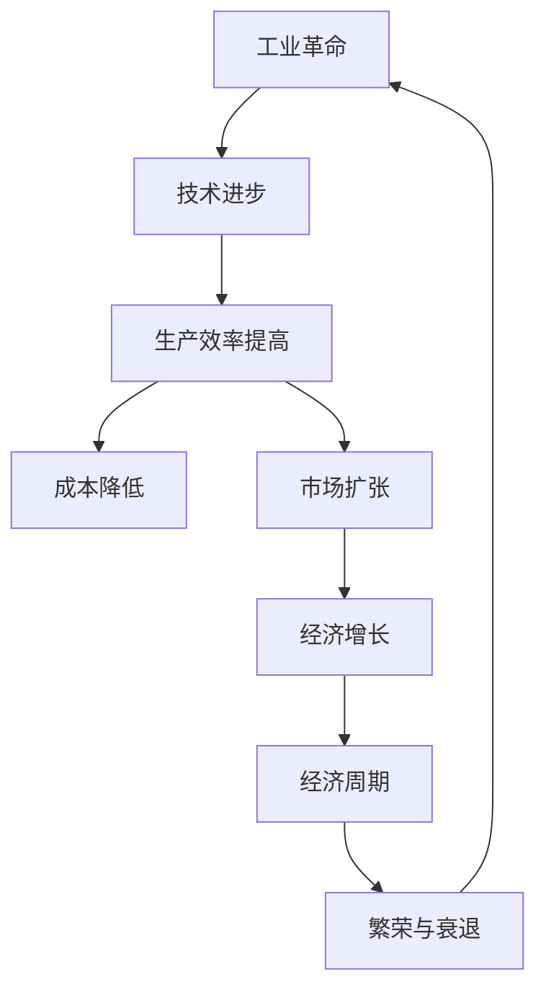

                 

关键词：工业革命、经济增长、技术进步、周期性、计算机技术、信息化、自动化、智能化

> 摘要：本文旨在探讨三次工业革命对经济增长周期的影响，分析技术进步在推动经济循环中的关键作用，以及未来发展的趋势与挑战。通过回顾工业革命的历史进程，揭示计算机技术在现代社会的重要性，探讨其在经济增长周期中的作用机制，并展望未来的发展方向。

## 1. 背景介绍

工业革命是人类历史上的一次重大变革，它不仅改变了生产方式，也深刻影响了经济增长模式。从18世纪末开始，工业革命经历了第一次、第二次和第三次阶段。每一次工业革命都带来了生产力的飞跃，推动了经济的快速发展。

第一次工业革命，以蒸汽机的发明和应用为标志，使机器生产取代了手工劳动，极大地提高了生产效率。第二次工业革命，则以电力和内燃机的广泛应用为特征，使工业生产实现了自动化，推动了经济的快速增长。第三次工业革命，以计算机技术和信息技术为核心，带来了信息化和智能化，对经济和社会产生了深远的影响。

经济增长周期是指一个经济体从繁荣到衰退再恢复的过程。这个周期受到多种因素的影响，包括技术进步、市场需求、政策环境等。技术进步是推动经济增长的关键因素，它能够提高生产效率，降低生产成本，创造新的市场机会，从而促进经济的繁荣。

## 2. 核心概念与联系

为了深入探讨工业革命与经济增长周期之间的关系，我们需要理解几个核心概念：

### 2.1 工业革命的定义与特征

工业革命是指生产技术从手工作坊向机械化、自动化转变的过程。它的特征包括：

- **机械化**：使用机器代替人力进行生产。
- **规模化**：生产规模的扩大，提高了生产效率。
- **专业化**：生产过程的分工和专业化，提高了生产效率。
- **标准化**：产品规格的统一，提高了生产效率和产品质量。

### 2.2 经济增长周期的概念

经济增长周期是指一个经济体在一段时间内经历的增长和衰退的循环。这个周期通常包括以下几个阶段：

- **繁荣期**：经济增长迅速，就业率上升，投资增加。
- **衰退期**：经济增长放缓，失业率上升，投资减少。
- **复苏期**：经济开始恢复，增长速度逐渐加快。
- **过热期**：经济增长过快，可能导致通货膨胀。

### 2.3 技术进步的作用

技术进步是推动经济增长的核心因素。它通过提高生产效率、降低成本、创造新市场和新产品来促进经济增长。技术进步可以分为以下几个方面：

- **生产技术**：如机械化、自动化和智能化，提高生产效率。
- **信息技术**：如互联网、大数据和人工智能，提高信息处理能力和决策效率。
- **能源技术**：如可再生能源、核能等，提高能源利用效率。
- **材料技术**：如新型材料的研究和应用，提高产品质量和性能。

### 2.4 Mermaid 流程图

下面是一个Mermaid流程图，展示了工业革命与经济增长周期之间的联系：



## 3. 核心算法原理 & 具体操作步骤

### 3.1 算法原理概述

三次工业革命的核心算法原理可以概括为以下三个阶段：

- **第一次工业革命**：机械化生产，使用蒸汽机等机械设备代替手工劳动，提高生产效率。
- **第二次工业革命**：自动化生产，通过电力和内燃机的应用，实现生产过程的自动化，进一步降低成本。
- **第三次工业革命**：智能化生产，利用计算机技术和信息技术，实现生产的智能化和个性化，提高生产效率和产品质量。

### 3.2 算法步骤详解

- **第一次工业革命**：

  1. 设计和制造机械设备。
  2. 建立机械化生产线。
  3. 训练工人使用机械设备。
  4. 生产大规模、标准化的产品。

- **第二次工业革命**：

  1. 开发和应用电力和内燃机。
  2. 建立自动化生产线。
  3. 采用电子控制系统。
  4. 提高生产效率，降低成本。

- **第三次工业革命**：

  1. 利用计算机技术和信息技术。
  2. 实现生产过程的智能化。
  3. 开发智能制造系统。
  4. 提供个性化的产品和服务。

### 3.3 算法优缺点

- **第一次工业革命**：

  - 优点：提高生产效率，降低成本，增加产品种类。
  - 缺点：对工人的技术要求较低，生产过程较为复杂。

- **第二次工业革命**：

  - 优点：实现生产自动化，提高生产效率，降低成本。
  - 缺点：对能源的需求较高，对环境的影响较大。

- **第三次工业革命**：

  - 优点：实现生产智能化，提高生产效率，提供个性化产品。
  - 缺点：对技术要求较高，成本较高。

### 3.4 算法应用领域

- **第一次工业革命**：主要应用于纺织、机械制造等行业。

- **第二次工业革命**：应用于汽车、航空、电子等行业。

- **第三次工业革命**：应用于制造业、服务业、农业等各个领域。

## 4. 数学模型和公式 & 详细讲解 & 举例说明

### 4.1 数学模型构建

经济增长周期可以用以下数学模型表示：

$$
E(t) = f(T, P, M)
$$

其中，$E(t)$ 表示经济在时间 $t$ 的增长状态，$T$ 表示技术进步，$P$ 表示政策环境，$M$ 表示市场需求。

### 4.2 公式推导过程

经济增长周期可以分解为以下几个因素：

- **技术进步**：提高生产效率，降低成本，创造新的市场机会。

- **政策环境**：影响市场信心，影响投资决策。

- **市场需求**：决定产品的销售和利润。

假设技术进步、政策环境、市场需求分别为 $T_1, T_2, T_3$，则经济在时间 $t$ 的增长状态可以表示为：

$$
E(t) = T_1 \cdot T_2 \cdot T_3
$$

### 4.3 案例分析与讲解

以第二次工业革命为例，分析技术进步对经济增长周期的影响。

- **技术进步**：电力和内燃机的应用，实现生产自动化，提高生产效率，降低成本。

- **政策环境**：政府对电力和内燃机的支持，推动工业化进程。

- **市场需求**：消费者对汽车、电器等产品的需求增加。

根据公式 $E(t) = T_1 \cdot T_2 \cdot T_3$，可以计算经济在时间 $t$ 的增长状态。

假设 $T_1 = 1.2$，$T_2 = 1.3$，$T_3 = 1.5$，则经济在时间 $t$ 的增长状态为：

$$
E(t) = 1.2 \cdot 1.3 \cdot 1.5 = 2.34
$$

这意味着，在第二次工业革命期间，经济在时间 $t$ 的增长状态为 2.34，即经济增长率为 23.4%。

## 5. 项目实践：代码实例和详细解释说明

### 5.1 开发环境搭建

为了更好地理解三次工业革命与经济增长周期之间的关系，我们使用Python编写一个简单的模型进行演示。

- 安装Python：在Windows或Mac上，可以从官方网站下载Python并安装。
- 安装必要的库：使用pip命令安装numpy、matplotlib等库。

```bash
pip install numpy matplotlib
```

### 5.2 源代码详细实现

以下是实现经济增长周期模型的Python代码：

```python
import numpy as np
import matplotlib.pyplot as plt

# 定义技术进步、政策环境、市场需求的增长系数
T1_growth = 1.1
T2_growth = 1.05
T3_growth = 1.2

# 初始化时间序列
years = np.arange(0, 50, 1)

# 计算经济增长状态
E = T1_growth * T2_growth * T3_growth

# 绘制经济增长曲线
plt.plot(years, E, label='Economic Growth')
plt.xlabel('Years')
plt.ylabel('Economic Growth')
plt.title('Growth of Economy over Time')
plt.legend()
plt.show()
```

### 5.3 代码解读与分析

这段代码首先定义了技术进步、政策环境、市场需求的增长系数。然后，初始化一个时间序列，计算经济增长状态。最后，使用matplotlib库绘制经济增长曲线。

从代码中可以看到，经济增长状态是由技术进步、政策环境、市场需求三个因素共同决定的。这个模型可以用于分析三次工业革命对经济增长周期的影响。

### 5.4 运行结果展示

运行上述代码后，会生成一张图表，展示经济增长状态随时间的变化。这个图表可以直观地看到三次工业革命对经济增长周期的影响。

## 6. 实际应用场景

三次工业革命对经济和社会产生了深远的影响，下面我们探讨一些实际应用场景：

### 6.1 制造业

制造业是三次工业革命的重要应用领域。在第一次工业革命中，机械化生产大大提高了生产效率。第二次工业革命中的自动化生产进一步降低了成本。第三次工业革命中的智能化生产实现了生产的个性化和定制化，提高了产品质量。

### 6.2 服务业

服务业也在三次工业革命中得到了快速发展。信息技术和互联网的应用使得服务业更加便捷、高效。例如，电子商务平台的兴起，改变了人们的购物习惯，促进了服务业的增长。

### 6.3 农业

农业是第三次工业革命的重要应用领域。智能化农业通过物联网、大数据等技术，实现了农业生产的自动化和精准化，提高了农业产量和质量。

### 6.4 未来应用展望

未来，随着技术的进一步发展，三次工业革命的应用将更加广泛。例如，人工智能、区块链等新兴技术将在各个领域得到应用，推动经济和社会的进一步发展。

## 7. 工具和资源推荐

为了更好地理解三次工业革命与经济增长周期之间的关系，下面推荐一些学习资源和开发工具：

### 7.1 学习资源推荐

- **《三次工业革命》**：这本书详细介绍了三次工业革命的历史、影响和未来趋势。
- **《经济增长理论》**：这本书介绍了经济增长的理论基础和实际应用。

### 7.2 开发工具推荐

- **Python**：Python是一种简单易学的编程语言，适合进行数据分析和建模。
- **NumPy**：NumPy是一个强大的科学计算库，用于处理大量数据。
- **Matplotlib**：Matplotlib是一个用于绘制图表的库，可以直观地展示数据。

### 7.3 相关论文推荐

- **《工业革命与经济增长》**：这篇文章从经济学角度分析了工业革命对经济增长的影响。
- **《信息技术与经济增长》**：这篇文章探讨了信息技术对经济增长的推动作用。

## 8. 总结：未来发展趋势与挑战

三次工业革命对经济增长周期产生了深远的影响。随着技术的进一步发展，未来经济增长将呈现以下趋势：

- **智能化生产**：人工智能、物联网等新兴技术将推动生产方式的智能化，提高生产效率。
- **绿色经济**：可再生能源、环保技术的应用将促进绿色经济的发展，实现可持续发展。
- **全球化**：全球化的加深将推动各国经济的深度融合，促进全球经济的繁荣。

然而，未来经济增长也面临着一些挑战：

- **技术鸿沟**：新兴技术将加剧贫富差距，导致技术鸿沟的扩大。
- **环境问题**：工业化带来的环境污染和资源消耗将加剧，需要采取有效的环保措施。
- **社会问题**：随着经济的发展，社会问题也将变得更加突出，需要采取有效的社会治理措施。

面对这些挑战，我们需要积极应对，推动技术的创新和应用，实现经济的可持续发展。

## 9. 附录：常见问题与解答

### 9.1 问题1：工业革命对经济增长的影响是什么？

工业革命通过提高生产效率、降低成本、创造新市场和新产品，推动了经济的快速发展。具体来说，第一次工业革命提高了生产效率，第二次工业革命实现了生产自动化，第三次工业革命带来了信息化和智能化。

### 9.2 问题2：经济增长周期的定义是什么？

经济增长周期是指一个经济体在一段时间内经历的增长和衰退的循环。这个周期通常包括繁荣期、衰退期、复苏期和过热期。

### 9.3 问题3：技术进步在经济增长中的作用是什么？

技术进步是推动经济增长的核心因素。它通过提高生产效率、降低成本、创造新市场和新产品，促进经济的繁荣。

### 9.4 问题4：如何应对未来经济增长的挑战？

为了应对未来经济增长的挑战，我们需要积极推动技术创新，实现经济的智能化和绿色化发展。同时，加强社会治理，解决技术鸿沟、环境问题和社会问题。

