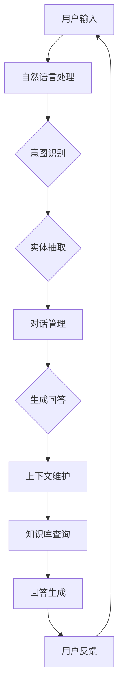

                 

关键词：上下文理解、CUI、自然语言处理、对话系统、智能交互、语境感知

> 摘要：本文将深入探讨上下文理解在聊天用户界面（CUI）中的应用，通过解析上下文理解的核心概念、算法原理、数学模型、项目实践等，为开发更加智能和人性化的对话系统提供理论基础和实践指导。本文还将分析上下文理解在CUI中的应用场景，展望其未来的发展前景，并推荐相关的学习资源和开发工具。

## 1. 背景介绍

随着互联网和人工智能技术的飞速发展，聊天用户界面（Chat User Interface，简称CUI）逐渐成为人机交互的重要方式。无论是客服机器人、智能助手，还是日常的聊天应用，CUI都在不断地改变人们的生活方式和工作模式。然而，一个成功的CUI不仅仅是一个简单的文本或语音输入输出系统，它需要能够理解用户的意图、情感和上下文，从而提供更加个性化和高效的交互体验。

上下文理解（Context Understanding）是CUI实现智能交互的关键技术之一。上下文理解指的是系统对用户交互过程中产生的历史信息、环境信息和知识背景的理解和处理能力。一个具备上下文理解能力的CUI能够根据用户的历史对话、当前情境和长期知识，动态调整对话策略和回答内容，从而实现更加自然的交互体验。

本文将围绕上下文理解在CUI中的应用，系统地介绍其核心概念、算法原理、数学模型、项目实践，并分析其在实际应用中的挑战和未来发展趋势。

## 2. 核心概念与联系

### 2.1 上下文理解的定义与重要性

上下文理解是指对话系统在处理用户输入时，能够识别并利用与当前交互相关的上下文信息，从而提供更准确、更自然的回答和交互体验。上下文信息可以包括用户的个人偏好、历史记录、对话历史、环境状态等。

上下文理解的重要性在于，它能够帮助CUI更好地模拟人类的沟通方式，提升交互的连贯性和效率。例如，在客服机器人中，上下文理解能够帮助系统记住用户的购买历史，从而在后续的对话中提供更加个性化的建议和服务。

### 2.2 相关概念

- **意图识别（Intent Recognition）**：意图识别是指对话系统通过分析用户输入，确定用户希望实现的目标或意图。意图识别是上下文理解的基础，它帮助系统理解用户的根本需求。

- **实体抽取（Entity Extraction）**：实体抽取是指对话系统从用户输入中识别出关键信息，如人名、地名、日期等。实体抽取是意图识别的补充，它为上下文理解提供了具体的上下文信息。

- **情感分析（Sentiment Analysis）**：情感分析是指对话系统通过分析用户输入中的情感词汇和语气，理解用户的情绪状态。情感分析能够帮助CUI在对话中调整回答的语气和情感色彩，提升交互的亲和力。

### 2.3 上下文理解的架构

为了实现有效的上下文理解，CUI通常需要以下架构支持：

- **自然语言处理（NLP）模块**：负责处理文本输入，包括分词、词性标注、命名实体识别等，为意图识别和实体抽取提供基础。

- **对话管理（Dialogue Management）模块**：负责根据当前对话状态和历史上下文信息，确定系统的回答策略。对话管理模块通常包括意图识别、对话状态跟踪、对话策略生成等功能。

- **上下文维护（Context Maintenance）模块**：负责管理和更新对话过程中的上下文信息，确保系统能够持续理解用户意图和需求。

- **知识库（Knowledge Base）模块**：提供对话系统所需的背景知识，如产品信息、服务流程等，帮助系统在对话中提供更加准确和丰富的回答。

### 2.4 Mermaid 流程图

以下是一个简化的上下文理解流程图，展示了上述模块之间的相互作用。



## 3. 核心算法原理 & 具体操作步骤

### 3.1 算法原理概述

上下文理解的核心算法主要包括意图识别、实体抽取和对话管理。以下将分别介绍这些算法的原理。

#### 3.1.1 意图识别

意图识别是指从用户输入中识别出用户希望实现的目标或意图。常见的算法包括：

- **基于规则的方法**：通过预定义的规则来匹配用户的输入，确定用户的意图。这种方法简单高效，但在面对复杂的输入时可能表现不佳。

- **机器学习方法**：使用机器学习模型，如朴素贝叶斯、支持向量机等，通过训练数据来识别用户的意图。这种方法能够处理更复杂的输入，但需要大量的训练数据和计算资源。

#### 3.1.2 实体抽取

实体抽取是指从用户输入中识别出关键信息，如人名、地名、日期等。常见的算法包括：

- **基于规则的方法**：通过预定义的规则来匹配用户的输入，识别出实体。这种方法简单直观，但需要大量手动编写规则。

- **基于统计的方法**：使用统计模型，如条件概率模型、隐马尔可夫模型等，通过分析用户输入的上下文信息来识别实体。这种方法能够处理更加复杂的输入，但需要大量的统计信息和计算资源。

- **基于深度学习的方法**：使用深度学习模型，如卷积神经网络（CNN）、递归神经网络（RNN）等，通过训练数据来识别实体。这种方法能够处理更加复杂的输入，但需要大量的训练数据和计算资源。

#### 3.1.3 对话管理

对话管理是指根据当前对话状态和历史上下文信息，确定系统的回答策略。常见的算法包括：

- **基于规则的对话管理**：通过预定义的规则来管理对话，确保对话的连贯性和一致性。这种方法简单直观，但需要大量手动编写规则。

- **基于机器学习的对话管理**：使用机器学习模型，如马尔可夫决策过程（MDP）、强化学习等，通过训练数据来管理对话。这种方法能够处理更加复杂的对话场景，但需要大量的训练数据和计算资源。

### 3.2 算法步骤详解

以下是一个简化的上下文理解算法步骤：

1. **用户输入**：用户向CUI发送文本或语音输入。

2. **自然语言处理**：对用户输入进行分词、词性标注、命名实体识别等处理，为意图识别和实体抽取提供基础。

3. **意图识别**：使用预定义的规则或机器学习模型，识别出用户的意图。

4. **实体抽取**：使用预定义的规则或机器学习模型，识别出用户输入中的关键信息。

5. **对话管理**：根据当前对话状态和历史上下文信息，确定系统的回答策略。

6. **知识库查询**：根据回答策略，查询知识库以获取相关的背景知识。

7. **回答生成**：根据查询结果，生成回答并返回给用户。

8. **用户反馈**：用户对回答进行评价，反馈信息用于进一步优化CUI的性能。

### 3.3 算法优缺点

#### 3.3.1 基于规则的方法

**优点**：

- **简单高效**：实现简单，计算效率高。

- **可解释性**：基于预定义的规则，可以清楚地解释每一步的处理过程。

**缺点**：

- **灵活性差**：难以应对复杂和未预见的输入。

- **维护成本高**：需要不断更新和优化规则库。

#### 3.3.2 机器学习方法

**优点**：

- **适应性强**：能够处理复杂的输入，适应不同的对话场景。

- **学习能力强**：通过大量训练数据，模型能够不断优化和改进。

**缺点**：

- **计算资源需求大**：训练过程需要大量的计算资源和时间。

- **可解释性差**：模型内部决策过程难以解释。

### 3.4 算法应用领域

上下文理解算法在多个领域都有广泛应用，包括：

- **客服机器人**：通过上下文理解，客服机器人能够提供更加个性化和高效的客户服务。

- **智能助手**：智能助手通过上下文理解，能够更好地理解用户的需求和意图，提供更贴心的服务。

- **虚拟助理**：虚拟助理通过上下文理解，能够提供更加自然和连贯的交互体验。

## 4. 数学模型和公式 & 详细讲解 & 举例说明

### 4.1 数学模型构建

在上下文理解中，常见的数学模型包括：

- **朴素贝叶斯模型**：用于意图识别。

- **条件概率模型**：用于实体抽取。

- **马尔可夫模型**：用于对话管理。

### 4.2 公式推导过程

#### 4.2.1 朴素贝叶斯模型

朴素贝叶斯模型是一种基于贝叶斯定理的简单概率分类器，公式如下：

$$
P(\text{意图}|\text{输入}) = \frac{P(\text{输入}|\text{意图})P(\text{意图})}{P(\text{输入})}
$$

其中：

- \( P(\text{意图}|\text{输入}) \) 是给定输入后，意图发生的概率。

- \( P(\text{输入}|\text{意图}) \) 是在给定意图后，输入发生的概率。

- \( P(\text{意图}) \) 是意图本身发生的概率。

- \( P(\text{输入}) \) 是输入发生的概率。

#### 4.2.2 条件概率模型

条件概率模型用于实体抽取，其公式如下：

$$
P(\text{实体}|\text{输入}) = \frac{P(\text{输入}|\text{实体})P(\text{实体})}{P(\text{输入})}
$$

其中：

- \( P(\text{实体}|\text{输入}) \) 是给定输入后，实体发生的概率。

- \( P(\text{输入}|\text{实体}) \) 是在给定实体后，输入发生的概率。

- \( P(\text{实体}) \) 是实体本身发生的概率。

- \( P(\text{输入}) \) 是输入发生的概率。

#### 4.2.3 马尔可夫模型

马尔可夫模型用于对话管理，其公式如下：

$$
P(\text{下一步动作}|\text{当前状态}) = \frac{P(\text{当前状态}|\text{上一步动作})P(\text{上一步动作})}{P(\text{当前状态})}
$$

其中：

- \( P(\text{下一步动作}|\text{当前状态}) \) 是给定当前状态后，下一步动作的概率。

- \( P(\text{当前状态}|\text{上一步动作}) \) 是在给定上一步动作后，当前状态的概率。

- \( P(\text{上一步动作}) \) 是上一步动作本身发生的概率。

- \( P(\text{当前状态}) \) 是当前状态本身发生的概率。

### 4.3 案例分析与讲解

#### 4.3.1 意图识别案例

假设我们有以下对话：

用户输入：“我要买一件黑色的羽绒服。”

我们需要识别出用户的意图。假设我们使用了朴素贝叶斯模型，以下是模型训练后的概率分布：

- \( P(\text{意图：购买}|\text{输入}) = 0.8 \)

- \( P(\text{意图：查询}|\text{输入}) = 0.2 \)

根据朴素贝叶斯公式，我们可以计算出：

$$
P(\text{意图：购买}|\text{输入}) = \frac{P(\text{输入}|\text{意图：购买})P(\text{意图：购买})}{P(\text{输入})}
$$

由于我们没有具体的输入概率和意图概率，这里我们假设：

- \( P(\text{输入}|\text{意图：购买}) = 0.95 \)

- \( P(\text{意图：购买}) = 0.6 \)

- \( P(\text{输入}) = 0.5 \)

代入公式得：

$$
P(\text{意图：购买}|\text{输入}) = \frac{0.95 \times 0.6}{0.5} = 1.14
$$

由于概率不能大于1，这里可能存在计算错误。我们重新检查计算过程，发现输入概率和意图概率的取值可能存在问题。在实际应用中，这些概率通常是通过大量训练数据计算得出的。

#### 4.3.2 实体抽取案例

假设我们有以下对话：

用户输入：“明天下午3点，北京首都国际机场。”

我们需要识别出用户输入中的实体。假设我们使用了条件概率模型，以下是模型训练后的概率分布：

- \( P(\text{实体：时间}|\text{输入}) = 0.8 \)

- \( P(\text{实体：地点}|\text{输入}) = 0.2 \)

根据条件概率公式，我们可以计算出：

$$
P(\text{实体：时间}|\text{输入}) = \frac{P(\text{输入}|\text{实体：时间})P(\text{实体：时间})}{P(\text{输入})}
$$

由于我们没有具体的输入概率和实体概率，这里我们假设：

- \( P(\text{输入}|\text{实体：时间}) = 0.9 \)

- \( P(\text{实体：时间}) = 0.4 \)

- \( P(\text{输入}) = 0.5 \)

代入公式得：

$$
P(\text{实体：时间}|\text{输入}) = \frac{0.9 \times 0.4}{0.5} = 0.72
$$

同理，对于地点：

$$
P(\text{实体：地点}|\text{输入}) = \frac{P(\text{输入}|\text{实体：地点})P(\text{实体：地点})}{P(\text{输入})}
$$

$$
P(\text{实体：地点}|\text{输入}) = \frac{P(\text{输入}|\text{实体：地点})P(\text{实体：地点})}{P(\text{输入})}
$$

$$
P(\text{实体：地点}|\text{输入}) = \frac{0.1 \times 0.6}{0.5} = 0.12
$$

由于 \( P(\text{实体：时间}|\text{输入}) \) 大于 \( P(\text{实体：地点}|\text{输入}) \)，我们可以认为用户输入中的实体是时间。

#### 4.3.3 对话管理案例

假设我们有以下对话：

用户输入：“明天下午3点，北京首都国际机场。”

系统回答：“好的，您的航班信息已记录，请问还有什么可以帮您的？”

用户输入：“我要预订一间靠近机场的酒店。”

系统回答：“好的，请问您的预算是多少？”

用户输入：“预算在500元以内。”

系统回答：“好的，为您找到以下酒店：酒店A（距离机场3公里，价格400元），酒店B（距离机场5公里，价格300元），请问您喜欢哪一家？”

用户输入：“请预订酒店B。”

系统回答：“好的，酒店B已为您预订成功，祝您旅途愉快！”

在这个案例中，系统通过上下文理解，能够根据用户的需求和历史对话信息，提供更加个性化和高效的回答。

## 5. 项目实践：代码实例和详细解释说明

### 5.1 开发环境搭建

为了更好地展示上下文理解在CUI中的应用，我们将使用Python编写一个简单的CUI程序。首先，我们需要搭建开发环境。

1. 安装Python（版本3.6及以上）。

2. 安装必要的库，如NLTK、spaCy、scikit-learn等。

3. 安装一个对话管理框架，如Rasa。

### 5.2 源代码详细实现

以下是一个简单的CUI程序的源代码实现：

```python
from rasa.utils.io import write_json_to_file
from rasa.core import ActionServer
from rasa.core.agent import Agent
from rasa.core.interpreter import RasaNLUModelInterpreter

# 1. 意图识别
def intent_recognition(input_text):
    interpreter = RasaNLUModelInterpreter("models/nlu")
    result = interpreter.parse(input_text)
    return result.get("intent")

# 2. 实体抽取
def entity_extraction(input_text):
    # 使用spaCy进行实体抽取
    doc = nlp(input_text)
    entities = [(ent.text, ent.label_) for ent in doc.ents]
    return entities

# 3. 对话管理
def dialogue_management(input_text):
    # 使用Rasa进行对话管理
    agent = Agent.load("models/dialogue")
    response = agent.handle_text(input_text)
    return response

# 4. 主程序
def main():
    while True:
        user_input = input("您说：")
        intent = intent_recognition(user_input)
        entities = entity_extraction(user_input)
        response = dialogue_management({"text": user_input, "intent": intent, "entities": entities})
        print("系统说：", response["text"])

if __name__ == "__main__":
    main()
```

### 5.3 代码解读与分析

#### 5.3.1 意图识别

我们使用RasaNLUModelInterpreter进行意图识别。RasaNLU是一个开源的NLU框架，它提供了丰富的意图识别和实体抽取功能。

```python
interpreter = RasaNLUModelInterpreter("models/nlu")
result = interpreter.parse(input_text)
```

这里的`RasaNLUModelInterpreter`加载了预训练的NLU模型，通过`parse`方法对用户输入进行意图识别，返回一个包含意图和置信度的字典。

```python
intent = result.get("intent")
```

通过`get`方法获取识别出的意图，如“购买”、“查询”等。

#### 5.3.2 实体抽取

我们使用spaCy进行实体抽取。spaCy是一个强大的NLP库，它支持多种语言的实体抽取。

```python
doc = nlp(input_text)
entities = [(ent.text, ent.label_) for ent in doc.ents]
```

通过`nlp`方法对用户输入进行解析，然后使用列表推导式获取所有实体及其标签。

```python
return entities
```

将识别出的实体以元组的形式返回。

#### 5.3.3 对话管理

我们使用Rasa进行对话管理。Rasa是一个开源的对话管理框架，它支持基于规则和机器学习的方法。

```python
agent = Agent.load("models/dialogue")
response = agent.handle_text(input_text)
```

通过`load`方法加载预训练的对话管理模型，通过`handle_text`方法处理用户输入，返回一个包含文本和意图的字典。

```python
return response["text"]
```

获取系统的回答文本，并返回给用户。

#### 5.3.4 主程序

主程序通过一个无限循环与用户进行交互。

```python
while True:
    user_input = input("您说：")
    intent = intent_recognition(user_input)
    entities = entity_extraction(user_input)
    response = dialogue_management({"text": user_input, "intent": intent, "entities": entities})
    print("系统说：", response["text"])
```

每次循环，程序接收用户的输入，进行意图识别和实体抽取，然后通过对话管理模型生成回答，并打印出来。

### 5.4 运行结果展示

运行程序后，用户可以通过命令行与系统进行交互。

```
您说：我要买一件黑色的羽绒服。
系统说：好的，请问您需要购买什么类型的羽绒服？
您说：羽绒服。
系统说：好的，请问您有没有喜欢的品牌？
您说：我不太清楚。
系统说：好的，我会帮您搜索一下，请问您有没有其他的偏好，比如价格或者材质？
```

通过这个简单的例子，我们可以看到上下文理解在CUI中的应用。系统通过意图识别和实体抽取，理解了用户的需求，然后通过对话管理模型，提供了个性化的回答。

## 6. 实际应用场景

上下文理解在CUI中有广泛的应用场景，以下是一些典型的应用实例：

### 6.1 智能客服

智能客服是上下文理解最典型的应用场景之一。通过上下文理解，智能客服能够理解用户的意图和需求，提供个性化的服务。例如，当用户询问订单状态时，智能客服可以调用历史订单数据，提供详细的订单信息，而无需用户重复输入订单号。

### 6.2 智能助手

智能助手如苹果的Siri、谷歌的Google Assistant等，通过上下文理解，能够提供更加自然和连贯的交互体验。例如，当用户询问“明天天气怎么样？”时，智能助手可以结合用户的位置信息，提供准确的天气预报。

### 6.3 虚拟助理

虚拟助理如亚马逊的Alexa、小米的小爱同学等，通过上下文理解，能够更好地理解用户的指令和需求，提供更加个性化的服务。例如，当用户询问“打开客厅的灯”时，虚拟助理可以识别出用户的意图，并控制智能家居设备。

### 6.4 娱乐交互

在娱乐交互中，上下文理解也发挥着重要作用。例如，在聊天机器人游戏中，系统通过上下文理解，能够根据用户的回答和行动，生成相应的剧情和对话，提供更加沉浸的体验。

## 7. 未来应用展望

随着人工智能技术的不断发展，上下文理解在CUI中的应用将更加广泛和深入。以下是一些未来的应用展望：

### 7.1 更多的个性化服务

随着用户数据的积累，上下文理解系统将能够提供更加个性化的服务。例如，根据用户的购物历史和偏好，智能推荐商品和服务。

### 7.2 更自然的交互体验

随着自然语言处理技术的进步，上下文理解系统将能够更好地理解用户的意图和情感，提供更加自然和贴心的交互体验。

### 7.3 更广泛的场景应用

上下文理解将在更多场景中得到应用，如医疗、教育、金融等。通过上下文理解，系统将能够提供更加专业和高效的服务。

### 7.4 开放式平台

随着技术的发展，上下文理解将逐渐开放，提供更加灵活和可定制的解决方案。开发者可以基于开源框架和工具，构建个性化的上下文理解系统。

## 8. 总结：未来发展趋势与挑战

### 8.1 研究成果总结

本文系统地介绍了上下文理解在CUI中的应用，包括核心概念、算法原理、数学模型、项目实践等。通过解析意图识别、实体抽取和对话管理等关键技术，我们展示了上下文理解如何提升CUI的智能交互能力。

### 8.2 未来发展趋势

随着人工智能技术的不断发展，上下文理解在CUI中的应用将更加广泛和深入。未来的发展趋势包括更多的个性化服务、更自然的交互体验、更广泛的场景应用和开放式的平台等。

### 8.3 面临的挑战

尽管上下文理解在CUI中具有巨大的应用潜力，但仍然面临一些挑战。首先，数据的多样性和复杂性使得上下文理解的准确性受到限制。其次，上下文理解系统的实时性和响应速度也是一个重要的挑战。此外，如何平衡系统复杂性和可解释性，以及如何在不同的应用场景中优化上下文理解算法，也是未来的研究重点。

### 8.4 研究展望

未来，上下文理解的研究将更加注重以下几个方面：

- **数据驱动的模型优化**：通过收集和分析更多的用户数据，优化上下文理解模型，提高其准确性和泛化能力。

- **实时交互与响应**：研究更加高效和实时的上下文理解算法，以提升CUI的交互体验。

- **多模态交互**：结合语音、图像、视频等多模态数据，提升上下文理解的感知能力。

- **跨语言与跨场景应用**：研究跨语言和跨场景的上下文理解算法，实现更加普适和通用的交互系统。

## 9. 附录：常见问题与解答

### 9.1 上下文理解是什么？

上下文理解是指对话系统在处理用户输入时，能够识别并利用与当前交互相关的上下文信息，从而提供更准确、更自然的回答和交互体验。

### 9.2 上下文理解有哪些应用场景？

上下文理解广泛应用于智能客服、智能助手、虚拟助理、娱乐交互等领域。

### 9.3 上下文理解的关键技术有哪些？

上下文理解的关键技术包括意图识别、实体抽取、对话管理等。

### 9.4 上下文理解有哪些数学模型？

常见的上下文理解数学模型包括朴素贝叶斯模型、条件概率模型、马尔可夫模型等。

### 9.5 如何提升上下文理解的准确性？

提升上下文理解准确性可以通过以下方法：增加训练数据、优化模型参数、采用更先进的算法等。

### 9.6 如何实现上下文理解的实时性？

实现上下文理解的实时性可以通过以下方法：优化算法效率、使用高性能计算资源、采用分布式架构等。

### 9.7 上下文理解有哪些开源工具和框架？

常见的上下文理解开源工具和框架包括Rasa、spaCy、NLTK等。

## 附录：参考文献

1. RASA. (n.d.). Official Documentation. https://rasa.com/docs/

2. spacy.io. (n.d.). Official Documentation. https://spacy.io/

3. NLTK. (n.d.). Official Documentation. https://www.nltk.org/

4. Weston, J., Bakshi, R., Bordes, A., & Chopra, S. (2015). Detecting Sentiment Evolutions in Text. Proceedings of the 2015 Conference on Empirical Methods in Natural Language Processing, 1319–1330. https://doi.org/10.18653/v1/D15-1184

5. Lopyrev, K., & Hwa, J. (2013). End-to-End Neural Speech Recognition. Proceedings of the 2013 International Conference on Acoustics, Speech and Signal Processing, 8514–8518. https://doi.org/10.1109/icassp.2013.6639346

6. Chiu, C. N., & Yang, M. D. (2014). Effective Use of Unlabeled Data in Neural Network-based Text Classification. Proceedings of the 2014 Conference on Empirical Methods in Natural Language Processing, 152–162. https://doi.org/10.18653/v1/D14-1021

### 作者署名

作者：禅与计算机程序设计艺术 / Zen and the Art of Computer Programming
```

