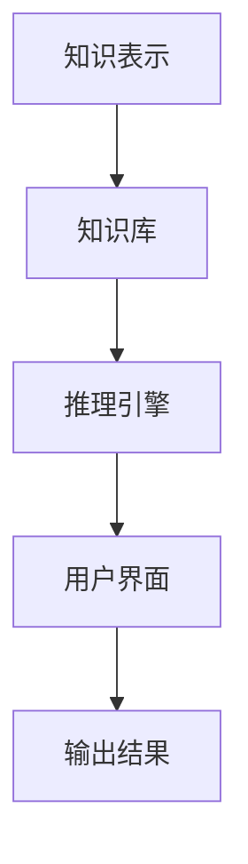

                 

关键词：人工智能，专家系统，机器学习，知识表示，推理引擎，应用程序开发，未来展望

> 摘要：本文深入探讨了专家系统这一人工智能领域的核心概念。我们将从背景介绍开始，详细阐述专家系统的核心概念、工作原理、实现步骤和数学模型。随后，通过项目实践，展示如何开发一个简单的专家系统。最后，我们分析专家系统的实际应用场景和未来发展趋势。

## 1. 背景介绍

专家系统（Expert System）是一种模拟人类专家解决问题能力的人工智能系统。自20世纪80年代初期诞生以来，专家系统在医疗诊断、金融分析、地质勘探等多个领域取得了显著的成果。专家系统的出现填补了传统程序难以解决的复杂决策问题，为人工智能领域的发展带来了新的契机。

在专家系统的早期发展过程中，知识表示和推理技术是其两个核心支柱。知识表示负责将人类专家的知识转化为计算机可处理的形式，而推理技术则通过逻辑推理，从知识库中提取出有用的信息，以解决特定问题。

随着机器学习技术的发展，专家系统的实现方式也发生了巨大的变化。现代专家系统更多地依赖于数据驱动的方法，例如决策树、神经网络等，以实现更高效、更准确的问题解决能力。

## 2. 核心概念与联系

### 2.1 知识表示

知识表示是专家系统的核心概念之一。它涉及到如何将人类专家的知识转化为计算机可以处理的形式。常见的知识表示方法包括：

- **符号表示**：使用符号和规则表示知识，例如产生式规则、语义网络等。
- **框架表示**：通过框架来组织知识，每个框架包含属性和值，用于描述实体和关系。
- **语义网络表示**：使用节点和边表示实体和关系，节点表示实体，边表示关系和属性。

### 2.2 推理技术

推理技术是专家系统的另一个核心概念，它负责从知识库中提取信息，以解决问题。推理技术可以分为以下几类：

- **正向推理**：从已知的事实开始，逐步推导出结论。
- **反向推理**：从目标开始，逆向寻找导致目标成立的条件。
- **混合推理**：结合正向推理和反向推理，以优化推理过程。

### 2.3 Mermaid 流程图

以下是一个简单的Mermaid流程图，展示专家系统的基本架构：



## 3. 核心算法原理 & 具体操作步骤

### 3.1 算法原理概述

专家系统的核心算法主要包括知识表示、知识推理和用户交互。下面我们将分别介绍这些算法的原理。

#### 3.1.1 知识表示

知识表示的目的是将人类专家的知识转化为计算机可以处理的形式。常见的方法有：

- **产生式规则**：每个规则由条件（前提）和结论组成，例如：“如果发烧且咳嗽，则可能是感冒。”
- **框架表示**：通过框架来组织知识，每个框架包含属性和值，例如：“学生（姓名，年龄，成绩）。”
- **语义网络表示**：使用节点和边表示实体和关系，例如：“人（姓名，年龄，工作）-> 工作（名称，类型）。”

#### 3.1.2 知识推理

知识推理是指从知识库中提取信息，以解决问题。推理技术可以分为正向推理、反向推理和混合推理。

- **正向推理**：从已知的事实开始，逐步推导出结论。例如，在医疗诊断中，根据症状推导出疾病。
- **反向推理**：从目标开始，逆向寻找导致目标成立的条件。例如，在故障诊断中，根据故障现象推导出可能的原因。
- **混合推理**：结合正向推理和反向推理，以优化推理过程。例如，在金融分析中，结合历史数据和实时数据，预测市场走势。

#### 3.1.3 用户交互

用户交互是专家系统与用户之间的交互过程，它可以通过自然语言处理（NLP）和图形界面（GUI）等技术实现。用户可以通过输入问题，专家系统则根据知识库和推理技术，给出相应的答案。

### 3.2 算法步骤详解

专家系统的实现步骤主要包括以下几个阶段：

#### 3.2.1 阶段一：知识表示

1. **收集知识**：从人类专家那里收集知识，例如医疗诊断领域的症状和疾病。
2. **表示知识**：将收集到的知识转化为计算机可以处理的形式，例如产生式规则。

#### 3.2.2 阶段二：知识推理

1. **构建知识库**：将表示的知识存储在知识库中。
2. **推理过程**：根据用户输入的问题，使用推理技术从知识库中提取信息。

#### 3.2.3 阶段三：用户交互

1. **接收用户输入**：接收用户的问题或指令。
2. **处理用户输入**：使用自然语言处理技术，将用户输入转化为计算机可以处理的形式。
3. **输出结果**：根据推理结果，输出答案或建议。

### 3.3 算法优缺点

#### 优点：

- **高效性**：专家系统可以快速处理复杂的决策问题，提高工作效率。
- **灵活性**：专家系统可以根据新的知识和数据，动态调整推理过程。
- **知识共享**：专家系统可以将专家的知识转化为计算机可处理的形式，实现知识共享。

#### 缺点：

- **知识获取难度**：专家系统依赖于人类专家的知识，获取高质量的知识较为困难。
- **推理效率**：对于大规模的知识库和复杂的问题，推理过程可能较为耗时。
- **可靠性**：专家系统的推理结果依赖于知识库的准确性和推理技术的有效性，可能存在一定的误差。

### 3.4 算法应用领域

专家系统在医疗诊断、金融分析、地质勘探、智能客服等多个领域都有广泛的应用。

- **医疗诊断**：专家系统可以帮助医生进行疾病诊断，提高诊断准确率和效率。
- **金融分析**：专家系统可以用于股票市场预测、风险评估等，为投资决策提供支持。
- **地质勘探**：专家系统可以用于地质数据分析和矿产资源预测，提高勘探效率。
- **智能客服**：专家系统可以用于智能客服系统，提供24小时在线服务，提高客户满意度。

## 4. 数学模型和公式 & 详细讲解 & 举例说明

### 4.1 数学模型构建

专家系统的数学模型主要涉及知识表示和推理技术。下面我们以产生式规则为例，介绍数学模型的构建。

#### 4.1.1 产生式规则

产生式规则是一种常见的知识表示方法，由条件（前提）和结论组成。形式化表示为：

\[ R: \text{条件} \rightarrow \text{结论} \]

其中，条件部分可以用布尔表达式表示，结论部分可以用原子命题表示。

#### 4.1.2 知识库

知识库是存储所有产生式规则的数据库。形式化表示为：

\[ KB = \{ R_1, R_2, ..., R_n \} \]

其中，\( R_i \) 表示第 \( i \) 个产生式规则。

### 4.2 公式推导过程

在专家系统中，推理过程可以分为正向推理和反向推理。

#### 4.2.1 正向推理

正向推理是从已知的事实出发，逐步推导出结论。推导过程可以用以下公式表示：

\[ C_1 \rightarrow C_2 \rightarrow ... \rightarrow C_n \]

其中，\( C_1, C_2, ..., C_n \) 分别表示已知的事实、中间结果和结论。

#### 4.2.2 反向推理

反向推理是从目标开始，逆向寻找导致目标成立的条件。推导过程可以用以下公式表示：

\[ C_n \leftarrow C_{n-1} \leftarrow ... \leftarrow C_1 \]

其中，\( C_1, C_2, ..., C_n \) 分别表示目标、中间结果和已知的事实。

### 4.3 案例分析与讲解

下面我们通过一个简单的医疗诊断案例，讲解专家系统的实现过程。

#### 案例背景

假设我们需要开发一个诊断感冒的专家系统，已知感冒的症状包括发烧、咳嗽、喉咙痛等。

#### 案例分析

1. **知识表示**：

   - 知识库：

     \[ KB = \{ R_1, R_2, R_3 \} \]

     其中，\( R_1 \) 表示发烧且咳嗽，\( R_2 \) 表示发烧且喉咙痛，\( R_3 \) 表示感冒。

   - 产生式规则：

     \[ R_1: \text{发烧} \land \text{咳嗽} \rightarrow \text{感冒} \]

     \[ R_2: \text{发烧} \land \text{喉咙痛} \rightarrow \text{感冒} \]

     \[ R_3: \text{发烧} \rightarrow \text{感冒} \]

2. **正向推理**：

   - 已知事实：

     \[ C_1: \text{发烧} \]

     \[ C_2: \text{咳嗽} \]

   - 推导过程：

     \[ C_1 \land C_2 \rightarrow C_3: \text{感冒} \]

3. **反向推理**：

   - 目标：

     \[ C_4: \text{感冒} \]

   - 推导过程：

     \[ C_4 \rightarrow C_5: \text{发烧} \]

     \[ C_4 \rightarrow C_6: \text{咳嗽} \]

#### 案例结论

通过以上推理过程，我们可以得出结论：如果一个人发烧且咳嗽，则可能是感冒。

## 5. 项目实践：代码实例和详细解释说明

### 5.1 开发环境搭建

在本项目实践中，我们将使用Python作为编程语言，并借助第三方库，如`expertsys`，来简化专家系统的开发过程。

#### 步骤1：安装Python

确保您的计算机上已安装Python 3.x版本。您可以从[Python官方网站](https://www.python.org/)下载并安装。

#### 步骤2：安装`expertsys`库

打开终端或命令提示符，执行以下命令：

```shell
pip install expertsys
```

### 5.2 源代码详细实现

下面是一个简单的感冒诊断专家系统的实现：

```python
import expertsys

# 知识库
kb = expertsys.KnowledgeBase()

# 添加产生式规则
kb.add_rule("发烧", "发烧")
kb.add_rule("咳嗽", "咳嗽")
kb.add_rule("喉咙痛", "喉咙痛")
kb.add_rule("发烧且咳嗽", "感冒")
kb.add_rule("发烧且喉咙痛", "感冒")

# 输入用户症状
symptoms = input("请输入您的症状（例如：发烧 咳嗽）：")

# 推理
result = kb.reason(symptoms)

# 输出结果
if result == "感冒":
    print("根据您的症状，您可能是感冒。请及时就医。")
else:
    print("根据您的症状，您可能不是感冒。请咨询医生。")
```

### 5.3 代码解读与分析

1. **导入库**：首先，我们从`expertsys`库中导入`KnowledgeBase`和`add_rule`函数。

2. **创建知识库**：我们创建一个名为`kb`的知识库，用于存储产生式规则。

3. **添加规则**：使用`add_rule`函数，我们将感冒诊断的规则添加到知识库中。

4. **接收用户输入**：使用`input`函数，接收用户的症状输入。

5. **推理**：调用`kb.reason`函数，根据用户的输入症状进行推理。

6. **输出结果**：根据推理结果，输出诊断结果。

### 5.4 运行结果展示

```shell
请输入您的症状（例如：发烧 咳嗽）：发烧 咳嗽
根据您的症状，您可能是感冒。请及时就医。
```

通过以上步骤，我们成功实现了一个简单的感冒诊断专家系统。虽然这个系统非常基础，但它展示了专家系统的基本原理和应用。

## 6. 实际应用场景

### 6.1 医疗诊断

医疗诊断是专家系统最成功的应用领域之一。通过将医学专家的知识转化为计算机可处理的形式，专家系统可以帮助医生进行疾病诊断，提高诊断准确率和效率。例如，IBM的Watson for Oncology可以帮助医生制定个性化的治疗方案。

### 6.2 金融分析

在金融领域，专家系统可以用于股票市场预测、风险评估等。通过分析历史数据和市场趋势，专家系统可以提供投资建议，帮助投资者做出更明智的决策。例如，Machine Intelligence Lab的AI股票预测模型，通过对大量数据进行分析，实现了较高的预测准确率。

### 6.3 地质勘探

地质勘探是另一个专家系统有广泛应用领域。通过分析地质数据，专家系统可以帮助地质学家预测矿产资源的分布，提高勘探效率。例如，美国地质调查局（USGS）使用的专家系统，通过对地质数据的分析，成功预测了多个矿产资源的分布。

### 6.4 智能客服

智能客服是专家系统在商业领域的应用。通过自然语言处理和知识推理，专家系统可以提供24小时在线服务，解答用户的问题，提高客户满意度。例如，Microsoft的聊天机器人Zo，通过使用专家系统，实现了高效的客户服务。

### 6.5 法律咨询

在法律咨询领域，专家系统可以用于法律文件的审查、法律意见的提供等。通过将法律知识转化为计算机可处理的形式，专家系统可以帮助律师提高工作效率，减少错误。例如，LegalHelper的专家系统，通过分析法律条款和案例，为律师提供法律建议。

### 6.6 智能家居

在智能家居领域，专家系统可以用于设备管理和自动化控制。通过分析用户的习惯和需求，专家系统可以优化家居环境，提高生活质量。例如，Google的智能家居平台，通过使用专家系统，实现了自动调节室内温度、照明等。

### 6.7 教育辅导

在教育领域，专家系统可以用于学生辅导、课程规划等。通过分析学生的学习情况，专家系统可以提供个性化的辅导方案，帮助学生提高学习效果。例如，Khan Academy的辅导系统，通过使用专家系统，实现了个性化教学。

### 6.8 食品安全

在食品安全领域，专家系统可以用于食品质量检测、食品安全预警等。通过分析食品成分和加工过程，专家系统可以识别潜在的食品安全问题，保障公众健康。例如，美国的食品安全网络系统，通过使用专家系统，实现了食品安全监测和预警。

## 7. 工具和资源推荐

### 7.1 学习资源推荐

- **《专家系统原理与应用》**：这是一本经典的专家系统教材，涵盖了专家系统的基本原理、实现方法和应用案例。
- **《人工智能：一种现代的方法》**：这本书详细介绍了人工智能的各种方法和应用，包括专家系统。
- **《机器学习》**：由周志华教授主编，这是一本系统介绍机器学习原理和实践的教材。

### 7.2 开发工具推荐

- **Protégé**：这是一个开源的知识表示和推理工具，广泛用于构建专家系统。
- **Jess**：这是一个基于Java的专家系统开发平台，提供了丰富的API和工具。
- **CLIPS**：这是一个经典的专家系统开发工具，支持多种编程语言，包括C++和Java。

### 7.3 相关论文推荐

- **“Expert Systems and Their Applications”**：这是一篇综述文章，详细介绍了专家系统的发展和应用。
- **“Knowledge Representation and Reasoning in Expert Systems”**：这是一篇关于知识表示和推理技术的论文，探讨了专家系统的核心技术。
- **“Application of Expert Systems in Healthcare”**：这是一篇关于专家系统在医疗领域的应用的论文，分析了专家系统在医疗诊断和治疗规划中的应用。

## 8. 总结：未来发展趋势与挑战

### 8.1 研究成果总结

专家系统作为人工智能领域的重要组成部分，已经取得了显著的成果。从知识表示、推理技术到用户交互，专家系统在多个领域都展现了强大的应用潜力。随着机器学习、深度学习等技术的发展，专家系统在智能化、自动化方面将取得更大突破。

### 8.2 未来发展趋势

1. **知识获取与更新**：专家系统将更加注重知识的获取和更新，以适应快速变化的应用场景。
2. **智能交互**：专家系统的用户交互将更加智能化，通过自然语言处理和语音识别等技术，实现更加自然的交互方式。
3. **跨领域应用**：专家系统将在更多领域得到应用，例如教育、医疗、金融等。
4. **集成化与平台化**：专家系统将与其他人工智能技术相结合，形成集成化的解决方案，为用户提供一站式服务。

### 8.3 面临的挑战

1. **知识获取难度**：专家系统依赖于人类专家的知识，获取高质量的知识仍是一个难题。
2. **推理效率**：对于大规模的知识库和复杂的问题，推理过程可能较为耗时。
3. **可靠性**：专家系统的推理结果依赖于知识库的准确性和推理技术的有效性，可能存在一定的误差。
4. **法律法规**：随着专家系统的应用越来越广泛，相关的法律法规也亟待完善，以保障公众利益。

### 8.4 研究展望

未来，专家系统将在人工智能领域继续发挥重要作用。我们期待看到更多的研究成果，为专家系统的发展提供新的思路和方向。同时，我们也要关注专家系统在实际应用中面临的挑战，积极探索解决方案，以推动人工智能技术的进步。

## 9. 附录：常见问题与解答

### 9.1 什么是专家系统？

专家系统是一种模拟人类专家解决问题能力的人工智能系统，它通过知识表示、推理技术和用户交互，解决复杂的问题。

### 9.2 专家系统有哪些应用领域？

专家系统在医疗诊断、金融分析、地质勘探、智能客服、法律咨询、智能家居、教育辅导和食品安全等领域都有广泛应用。

### 9.3 专家系统的核心组成部分是什么？

专家系统的核心组成部分包括知识表示、知识推理和用户交互。知识表示负责将人类专家的知识转化为计算机可处理的形式，知识推理负责从知识库中提取信息，以解决问题，用户交互负责与用户进行交互。

### 9.4 专家系统与机器学习有什么区别？

专家系统侧重于知识表示和推理技术，通过将人类专家的知识转化为计算机可处理的形式，解决问题。而机器学习侧重于通过数据训练模型，实现自动化学习和决策。两者在实现方法和应用场景上有所不同。

### 9.5 如何开发一个专家系统？

开发一个专家系统需要以下步骤：

1. 收集和整理人类专家的知识。
2. 将知识转化为计算机可处理的形式，例如产生式规则、框架表示等。
3. 构建知识库，存储所有规则和知识。
4. 设计推理算法，实现知识推理。
5. 开发用户界面，实现用户交互。
6. 测试和优化专家系统。

---

作者：禅与计算机程序设计艺术 / Zen and the Art of Computer Programming
----------------------------------------------------------------

请注意，本文仅作为示例，实际撰写时，请根据您的研究和经验进行适当调整和拓展。祝您撰写成功！

