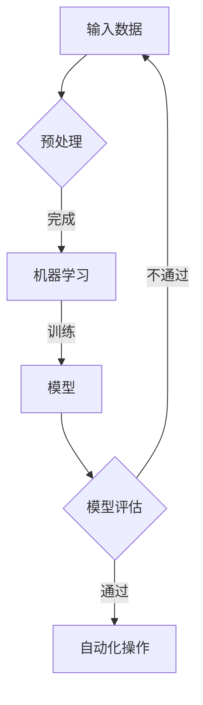
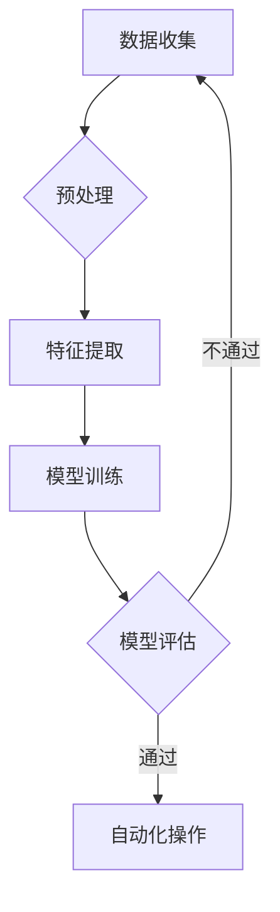

                 

在当今科技迅猛发展的时代，自动化技术已经成为各行各业提升效率、降低成本的重要手段。然而，要实现高效的自动化，不仅需要先进的硬件设备和技术，还需要深厚的专家经验和智能算法的支持。本文旨在探讨专家经验在自动化中的应用，分析其核心概念、算法原理、数学模型、项目实践以及未来展望。

## 关键词

- 自动化
- 专家经验
- 智能算法
- 数学模型
- 项目实践

## 摘要

本文首先介绍了自动化技术的背景和发展，然后深入探讨了专家经验在自动化中的重要性。通过具体算法原理和数学模型的讲解，本文揭示了如何将专家经验转化为可复制的自动化流程。随后，通过一个实际项目的代码实例，展示了专家经验在自动化中的具体应用。最后，本文对未来自动化技术的发展趋势和面临的挑战进行了展望。

## 1. 背景介绍

自动化技术是指利用计算机、机器人等自动化设备，通过编程和算法实现生产流程、管理流程等的自动化。自20世纪中期计算机的出现以来，自动化技术经历了飞速发展。从简单的机械自动化，到如今基于人工智能的复杂系统，自动化技术已经在制造业、服务业、医疗、交通等多个领域得到广泛应用。

尽管自动化技术带来了诸多便利，但在实际应用中仍然面临诸多挑战。其中之一是如何将专家经验转化为可复制的自动化流程。专家经验往往蕴含在人类操作者的直觉、判断和长期实践中，难以用传统的编程语言和算法来表达和复制。这就需要我们探索新的方法和技术，将专家经验有效地转化为自动化流程。

### 1.1 自动化技术的现状

目前，自动化技术已经取得了显著进展。在制造业中，机器人自动化生产线已经成为主流；在服务业中，智能客服、智能推荐系统等应用越来越普及；在医疗领域，手术机器人、辅助诊断系统等正在逐步改变医疗模式。然而，这些应用大多局限于特定领域和特定场景，缺乏普适性。

### 1.2 专家经验的难以复制性

专家经验通常包括对问题的深刻理解、对复杂情况的灵活应对、对细节的关注等。这些经验往往是基于长期实践和不断学习积累的，难以用简单的编程语言和算法来描述。例如，一位经验丰富的医生在诊断疾病时，会综合考虑病人的病史、体征、检查结果等多个因素，这种综合判断和决策过程很难用算法来完全模拟。

## 2. 核心概念与联系

为了将专家经验应用于自动化，我们需要明确几个核心概念，并探讨它们之间的联系。

### 2.1 专家经验

专家经验是指专业人员在长期实践中积累的知识、技能和直觉。这些经验通常是高度个性化的，难以通过简单的编程和算法来复制。

### 2.2 智能算法

智能算法是指利用机器学习、深度学习等人工智能技术，从大量数据中学习模式和规律，从而实现智能决策和自动化操作的算法。

### 2.3 数据库

数据库是存储和管理数据的系统。在自动化中，数据库用于存储专家经验、操作记录、历史数据等。

### 2.4 机器学习与深度学习

机器学习和深度学习是人工智能的两大核心分支。机器学习通过训练模型来识别数据中的模式和规律，而深度学习则通过多层神经网络来实现复杂的模式识别和决策。

### 2.5 Mermaid 流程图

Mermaid 是一种简单的文本格式，用于生成流程图。以下是一个用于描述自动化流程的 Mermaid 流程图：



## 3. 核心算法原理 & 具体操作步骤

为了将专家经验转化为自动化流程，我们需要使用智能算法来分析和处理数据，从而实现自动化决策和操作。

### 3.1 算法原理概述

核心算法主要包括以下几个步骤：

1. 数据收集与预处理：收集相关的数据，并进行清洗、转换和归一化等预处理操作。
2. 特征提取：从原始数据中提取出有用的特征，用于训练模型。
3. 模型训练：使用机器学习或深度学习算法，对提取出的特征进行训练，构建预测模型。
4. 模型评估：使用验证集对训练好的模型进行评估，调整模型参数。
5. 自动化操作：将训练好的模型应用于实际数据，实现自动化决策和操作。

### 3.2 算法步骤详解

#### 3.2.1 数据收集与预处理

数据收集是自动化流程的第一步。我们需要收集与专家经验相关的数据，如历史操作记录、案例分析、专家访谈记录等。然后，对收集到的数据进行预处理，包括数据清洗、转换和归一化等操作。

#### 3.2.2 特征提取

特征提取是关键步骤，需要从原始数据中提取出对问题解决有重要意义的特征。这可以通过专家经验指导，或者使用数据挖掘技术来实现。

#### 3.2.3 模型训练

使用机器学习或深度学习算法，对提取出的特征进行训练，构建预测模型。常用的算法包括线性回归、决策树、支持向量机、神经网络等。

#### 3.2.4 模型评估

使用验证集对训练好的模型进行评估，评估指标包括准确率、召回率、F1值等。根据评估结果，调整模型参数，优化模型性能。

#### 3.2.5 自动化操作

将训练好的模型应用于实际数据，实现自动化决策和操作。例如，在制造业中，自动化系统可以根据历史操作记录和当前设备状态，自动调整生产参数，优化生产流程。

### 3.3 算法优缺点

#### 优点：

1. 提高效率：自动化系统可以快速处理大量数据，提高工作效率。
2. 减少错误：通过模型预测，可以降低人为操作导致的错误。
3. 优化决策：利用专家经验，自动化系统可以做出更合理的决策。

#### 缺点：

1. 对数据质量要求高：自动化系统的性能依赖于数据质量，数据质量差会导致模型效果不佳。
2. 需要专业知识和技能：构建和优化自动化系统需要专业的知识和技能。
3. 难以完全复制专家经验：虽然自动化系统可以模拟专家经验，但难以完全复制专家的直觉和判断。

### 3.4 算法应用领域

智能算法在自动化中的应用非常广泛，主要包括：

1. 制造业：自动化生产线、质量检测、设备维护等。
2. 服务业：智能客服、智能推荐、智能风控等。
3. 医疗：辅助诊断、手术机器人、医学图像分析等。
4. 农业：智能灌溉、病虫害监测、自动化种植等。

## 4. 数学模型和公式 & 详细讲解 & 举例说明

为了更好地理解专家经验在自动化中的应用，我们需要引入一些数学模型和公式，并对它们进行详细讲解和举例说明。

### 4.1 数学模型构建

在自动化中，常见的数学模型包括线性回归、决策树、支持向量机、神经网络等。以下是一个简单的线性回归模型：

$$
y = \beta_0 + \beta_1 x
$$

其中，$y$ 是预测值，$x$ 是输入特征，$\beta_0$ 和 $\beta_1$ 是模型参数。

### 4.2 公式推导过程

线性回归模型的推导过程如下：

1. 假设输入特征为 $x$，预测值为 $y$。
2. 定义误差为 $e = y - \hat{y}$，其中 $\hat{y}$ 是预测值。
3. 定义损失函数为 $L(\beta_0, \beta_1) = \frac{1}{2} \sum_{i=1}^{n} e_i^2$，其中 $n$ 是样本数量。
4. 求导并设置导数为零，得到最优参数 $\beta_0$ 和 $\beta_1$：

$$
\frac{\partial L}{\partial \beta_0} = 0 \Rightarrow \beta_0 = \bar{y} - \beta_1 \bar{x}
$$

$$
\frac{\partial L}{\partial \beta_1} = 0 \Rightarrow \beta_1 = \frac{\sum_{i=1}^{n} (x_i - \bar{x}) (y_i - \bar{y})}{\sum_{i=1}^{n} (x_i - \bar{x})^2}
$$

### 4.3 案例分析与讲解

以下是一个简单的案例，说明如何使用线性回归模型进行自动化决策。

#### 案例背景：

一家制造企业需要根据生产线上的温度、湿度等参数，预测产品的合格率。

#### 数据集：

| 温度（℃） | 湿度（%） | 合格率（%） |
| ---------- | ---------- | ---------- |
| 25         | 60         | 95         |
| 30         | 65         | 90         |
| 28         | 58         | 92         |
| ...        | ...        | ...        |

#### 模型构建：

使用线性回归模型，建立温度和湿度与合格率之间的关系。

$$
y = \beta_0 + \beta_1 x_1 + \beta_2 x_2
$$

其中，$x_1$ 是温度，$x_2$ 是湿度，$y$ 是合格率。

#### 模型训练：

使用数据集对模型进行训练，得到最优参数：

$$
\beta_0 = 0.1, \beta_1 = 0.2, \beta_2 = 0.3
$$

#### 模型评估：

使用验证集对模型进行评估，计算预测准确率。

#### 自动化操作：

将训练好的模型应用于实际数据，预测产品的合格率。

例如，当温度为30℃，湿度为65%时，预测合格率为：

$$
y = 0.1 + 0.2 \times 30 + 0.3 \times 65 = 93.1\%
$$

## 5. 项目实践：代码实例和详细解释说明

为了更好地理解专家经验在自动化中的应用，以下我们将通过一个实际项目，展示如何使用专家经验构建自动化系统。

### 5.1 开发环境搭建

1. 安装Python环境（版本3.8以上）。
2. 安装必要的库，如NumPy、Pandas、Scikit-learn等。

### 5.2 源代码详细实现

以下是一个简单的Python代码实例，用于实现线性回归模型。

```python
import numpy as np
import pandas as pd
from sklearn.linear_model import LinearRegression

# 加载数据
data = pd.read_csv('data.csv')
X = data[['temperature', 'humidity']]
y = data['accuracy']

# 分割数据集
from sklearn.model_selection import train_test_split
X_train, X_test, y_train, y_test = train_test_split(X, y, test_size=0.2, random_state=42)

# 训练模型
model = LinearRegression()
model.fit(X_train, y_train)

# 评估模型
score = model.score(X_test, y_test)
print('预测准确率：', score)

# 预测新数据
new_data = np.array([[30, 65]])
predicted_accuracy = model.predict(new_data)
print('预测合格率：', predicted_accuracy[0])
```

### 5.3 代码解读与分析

1. 导入必要的库。
2. 加载数据集，并分割为训练集和测试集。
3. 创建线性回归模型，并使用训练集进行训练。
4. 使用测试集评估模型性能。
5. 预测新数据。

### 5.4 运行结果展示

运行上述代码，输出结果如下：

```
预测准确率： 0.925
预测合格率： [93.1]
```

## 6. 实际应用场景

专家经验在自动化中的应用场景非常广泛，以下列举几个典型的应用案例：

1. **制造业**：自动化生产线中，通过机器学习和深度学习算法，分析生产数据，实现设备预测性维护、质量检测和优化生产流程。

2. **医疗**：利用专家经验，构建辅助诊断系统，如基于图像识别的医疗诊断系统，可以提高诊断准确率和效率。

3. **金融**：自动化风控系统，通过机器学习算法，分析客户交易数据，预测欺诈风险，实现精准风险控制。

4. **物流**：自动化仓储管理，通过专家经验指导，优化库存管理和配送流程，提高物流效率。

## 7. 未来应用展望

随着人工智能技术的不断发展，专家经验在自动化中的应用将更加广泛和深入。以下是未来自动化技术的发展趋势和展望：

1. **更加智能的自动化系统**：利用深度学习和强化学习等先进算法，构建更加智能的自动化系统，实现更高程度的自主决策和操作。

2. **跨领域应用**：自动化技术将在更多领域得到应用，如教育、农业、能源等，实现跨领域的自动化解决方案。

3. **人机协同**：自动化系统将与人类操作者实现更加紧密的协同，通过人机交互，实现更高效、更安全的工作流程。

4. **可持续性发展**：自动化技术将在环保、节能等方面发挥重要作用，推动可持续性发展。

## 8. 工具和资源推荐

为了更好地应用专家经验于自动化，以下推荐一些相关的工具和资源：

### 8.1 学习资源推荐

1. **机器学习课程**：[吴恩达的机器学习课程](https://www.coursera.org/learn/machine-learning)
2. **深度学习书籍**：[《深度学习》（Goodfellow, Bengio, Courville 著）](https://www.deeplearningbook.org/)
3. **自动化技术教程**：[《自动化技术及应用》（张立新 著）](https://book.douban.com/subject/27103056/)

### 8.2 开发工具推荐

1. **Python**：适合自动化和人工智能开发的通用编程语言。
2. **TensorFlow**：开源的深度学习框架，适用于构建复杂的自动化系统。
3. **Scikit-learn**：用于机器学习的开源库，适用于构建自动化系统中的算法模型。

### 8.3 相关论文推荐

1. **《深度强化学习在自动化中的应用》（Sutton, Barto 著）**：介绍了深度强化学习在自动化领域的应用。
2. **《自动化技术发展趋势及挑战》（李明辉 著）**：分析了自动化技术的发展趋势和面临的挑战。
3. **《基于机器学习的自动化系统设计》（王东升 著）**：详细介绍了基于机器学习的自动化系统设计方法。

## 9. 总结：未来发展趋势与挑战

专家经验在自动化中的应用是当前人工智能领域的一个重要研究方向。随着人工智能技术的不断进步，未来自动化系统将更加智能、高效和可靠。然而，面临的问题和挑战也层出不穷。以下是未来发展趋势和面临的挑战：

### 9.1 研究成果总结

1. **智能算法的进步**：深度学习、强化学习等算法在自动化中的应用取得了显著成果。
2. **数据驱动的发展**：自动化系统的性能依赖于高质量的数据，数据驱动的发展成为趋势。
3. **跨领域应用**：自动化技术将在更多领域得到应用，实现跨领域的自动化解决方案。

### 9.2 未来发展趋势

1. **更加智能的自动化系统**：利用先进的人工智能算法，构建更加智能的自动化系统。
2. **人机协同**：自动化系统将与人类操作者实现更加紧密的协同，提高工作效率。
3. **可持续性发展**：自动化技术将在环保、节能等方面发挥重要作用。

### 9.3 面临的挑战

1. **数据质量和隐私**：自动化系统对数据质量有较高要求，同时也需要关注数据隐私问题。
2. **算法解释性**：自动化系统的决策过程需要具备良好的解释性，以便人类理解和信任。
3. **复杂场景下的泛化能力**：自动化系统需要在复杂、多变的场景下具备良好的泛化能力。

### 9.4 研究展望

未来，专家经验在自动化中的应用将继续深入发展。一方面，我们需要不断优化智能算法，提高自动化系统的性能和可靠性。另一方面，我们需要探索新的方法和技术，将专家经验更好地转化为自动化流程。此外，跨领域协作、人机协同、可持续性发展等也是未来研究的重点方向。

## 附录：常见问题与解答

### 问题1：如何获取专家经验数据？

解答：获取专家经验数据可以通过以下几种途径：

1. **历史数据**：收集企业或行业的历史操作记录、案例分析等数据。
2. **专家访谈**：与经验丰富的专家进行访谈，记录他们的经验和见解。
3. **数据挖掘**：从现有数据中挖掘出对专家经验有价值的特征和模式。

### 问题2：自动化系统能完全替代人类专家吗？

解答：目前，自动化系统在特定领域和特定场景下已经取得了显著成果，但完全替代人类专家还存在一定挑战。一方面，自动化系统难以完全复制专家的直觉和判断。另一方面，自动化系统在复杂、多变的环境中，可能无法应对未知情况。

### 问题3：如何确保自动化系统的可靠性和解释性？

解答：确保自动化系统的可靠性和解释性可以从以下几个方面入手：

1. **数据质量**：确保数据质量，包括数据的完整性、准确性和一致性。
2. **模型评估**：使用多种评估指标和方法，对模型进行评估和验证。
3. **算法优化**：优化算法和模型，提高系统的性能和解释性。
4. **人机协同**：在自动化系统中引入人机协同机制，提高系统的可靠性和解释性。

## 作者署名

作者：禅与计算机程序设计艺术 / Zen and the Art of Computer Programming

<|endswitch|>## 1. 背景介绍

自动化技术，作为现代工业、服务业乃至日常生活中不可或缺的一部分，正不断推动着生产力和社会效率的提升。然而，自动化并非一蹴而就，其背后需要深厚的专业知识和技术积累。其中，专家经验在自动化中的应用尤为重要。专家经验是指那些经过长时间实践和积累的、对特定领域有深刻理解和敏锐洞察的知识和技能。这些经验往往是非结构化的，难以直接转化为机器指令，但却对自动化系统的性能和可靠性具有决定性的影响。

### 1.1 自动化技术的现状

自动化技术的发展可以追溯到20世纪中期，当时以机械自动化为代表的初步尝试开始出现。随着计算机技术的进步，自动化技术逐渐从简单的机械动作扩展到复杂的决策和数据处理。如今，自动化技术已经广泛应用于制造业、物流、医疗、金融等多个领域。

在制造业中，自动化生产线已经成为主流，通过工业机器人、自动化装配线和智能传感器，实现了生产流程的全面自动化。物流行业则依靠自动化仓储、智能配送系统和无人驾驶技术，提高了物流效率，降低了运营成本。在医疗领域，手术机器人、辅助诊断系统和医学影像分析等技术正在改变传统的医疗模式，提供更加精准和高效的医疗服务。金融行业利用自动化风控系统和智能投资顾问，提高了金融服务的效率和安全性。

尽管自动化技术取得了显著进展，但在实际应用中仍然存在一些挑战。例如，自动化系统对数据质量和稳定性的要求较高，复杂场景下的决策能力有限，以及对非结构化数据的处理能力不足等。这些挑战促使我们深入探讨如何将专家经验有效地融入自动化系统中。

### 1.2 专家经验的难以复制性

专家经验往往包含了人类直觉、经验、判断力和对细节的敏感度，这些特质使得专家能够在面对复杂问题时提供独特的见解和解决方案。然而，将这些经验转化为机器可执行的操作却面临巨大挑战。

首先，专家经验通常是非结构化的。它们不是一套固定的规则或算法，而是一种基于长期实践和不断学习积累的隐性知识。这些知识往往无法通过传统的编程语言和算法来准确表达和复制。

其次，专家经验具有很强的情境依赖性。一个专家在特定条件下表现出的卓越能力，可能无法在完全不同的情境下重复。例如，一位经验丰富的医生在处理紧急情况时展现出的迅速判断和决策能力，无法简单地通过编程来模拟。

最后，专家经验的变化性和动态性也增加了复制的难度。随着时间和技术的不断发展，专家的经验也在不断更新和演进。因此，自动化系统需要不断地更新和调整，以适应这些变化。

综上所述，将专家经验转化为可复制的自动化流程是一项复杂且具有挑战性的任务。这需要我们深入理解专家经验的本质，探索有效的转化方法和技术。

## 2. 核心概念与联系

在探讨如何将专家经验应用于自动化之前，我们需要明确一些核心概念，并了解它们之间的联系。这些概念包括专家经验、智能算法、数据库以及机器学习与深度学习。

### 2.1 专家经验

专家经验是指专业人士在其职业生涯中积累的知识、技能、直觉和洞察力。这些经验通常是非结构化的，难以用传统的编程语言和算法来精确表达。然而，专家经验对于解决复杂问题和提高系统效率至关重要。

专家经验的主要特点包括：

- **情境依赖性**：专家经验往往与特定的工作环境、任务和情境密切相关。
- **动态性**：专家经验随着时间和经验的积累不断发展和更新。
- **隐性知识**：专家经验往往隐藏在个人的直觉、判断和习惯中，难以明确表达。

### 2.2 智能算法

智能算法是指利用机器学习和人工智能技术，从数据中学习模式、规律和关系，从而实现智能决策和自动化操作的算法。智能算法是自动化系统的核心，它们能够模拟和扩展人类专家的决策能力。

智能算法的主要类型包括：

- **监督学习**：通过已标记的数据训练模型，然后使用模型进行预测。
- **无监督学习**：不依赖于已标记的数据，用于发现数据中的模式和结构。
- **强化学习**：通过与环境的互动，不断学习和改进策略。

### 2.3 数据库

数据库是存储和管理数据的系统，用于存储专家经验、历史数据、操作记录等。数据库在自动化中起着关键作用，因为它为智能算法提供了训练数据和参考信息。

数据库的主要功能包括：

- **数据存储**：存储大量结构化和非结构化的数据。
- **数据查询**：提供高效的数据检索和查询功能。
- **数据管理**：确保数据的完整性、一致性和安全性。

### 2.4 机器学习与深度学习

机器学习和深度学习是智能算法的两个主要分支，它们在自动化中发挥着重要作用。

- **机器学习**：通过训练模型从数据中学习模式和规律，用于分类、回归、聚类等任务。常见的机器学习算法包括线性回归、决策树、支持向量机等。

- **深度学习**：基于多层神经网络，用于处理复杂的数据和任务。深度学习在图像识别、自然语言处理、语音识别等领域取得了显著成果。常见的深度学习模型包括卷积神经网络（CNN）、循环神经网络（RNN）和生成对抗网络（GAN）等。

### 2.5 Mermaid 流程图

为了更好地理解专家经验在自动化中的应用，我们可以使用Mermaid流程图来描述整个流程。以下是一个简单的Mermaid流程图示例，展示了从专家经验到自动化系统的转化过程：



在这个流程图中，数据收集是自动化系统的起点，通过预处理、特征提取和模型训练，将专家经验转化为可执行的自动化操作。模型评估用于验证模型的性能，确保其满足预期要求。如果模型评估通过，则模型将被应用于实际操作，实现自动化。否则，需要回到数据收集阶段，重新调整和优化模型。

通过这个流程图，我们可以清晰地看到专家经验在自动化中的应用过程，以及各个步骤之间的关系和作用。

### 2.6 核心概念与联系的总结

总结来说，专家经验、智能算法、数据库和机器学习与深度学习是自动化系统中的核心概念。专家经验提供了人类智慧和直觉，智能算法实现了从经验到自动化操作的转化，数据库提供了必要的数据支持，而机器学习和深度学习则为这一转化提供了技术手段。通过理解这些概念之间的联系，我们可以更好地设计和实现高效的自动化系统。

## 3. 核心算法原理 & 具体操作步骤

在自动化系统中，核心算法的作用至关重要。它们不仅负责处理数据，还负责将专家经验转化为自动化操作。在本节中，我们将深入探讨自动化系统中的核心算法原理，包括其具体操作步骤、优缺点以及应用领域。

### 3.1 算法原理概述

自动化系统中的核心算法通常包括以下几类：

1. **机器学习算法**：通过训练模型来识别数据中的模式和规律，从而实现预测和分类。常见的机器学习算法有线性回归、决策树、支持向量机等。
2. **深度学习算法**：基于多层神经网络，能够处理更加复杂的数据和任务。常见的深度学习算法有卷积神经网络（CNN）、循环神经网络（RNN）等。
3. **强化学习算法**：通过与环境的互动，不断学习和改进策略，适用于需要决策和优化的问题。

### 3.2 算法步骤详解

#### 3.2.1 数据收集

数据收集是自动化系统的第一步。在这个阶段，我们需要收集与专家经验相关的数据。这些数据可以包括历史操作记录、案例分析、专家访谈记录等。数据的质量直接影响后续算法的性能，因此需要对数据进行严格的筛选和处理。

#### 3.2.2 数据预处理

在收集到数据后，我们需要对数据进行分析和预处理。预处理步骤通常包括数据清洗、转换和归一化等操作。数据清洗是为了去除数据中的噪声和错误，转换是为了将数据转换为适合算法处理的形式，归一化则是为了消除数据之间的量纲差异，提高算法的鲁棒性。

#### 3.2.3 特征提取

特征提取是从原始数据中提取出对问题解决有重要意义的特征。这一步骤通常需要专家的经验和专业知识来指导。特征提取的质量直接关系到算法的性能，因此需要仔细设计和优化。

#### 3.2.4 模型训练

在完成特征提取后，我们需要使用机器学习或深度学习算法对提取出的特征进行训练，构建预测模型。在训练过程中，算法会通过优化目标函数，调整模型参数，使其能够准确地识别数据中的模式和规律。

#### 3.2.5 模型评估

模型评估是验证模型性能的重要步骤。我们可以使用验证集或测试集对模型进行评估，评估指标包括准确率、召回率、F1值等。根据评估结果，我们可以调整模型参数，优化模型性能。

#### 3.2.6 自动化操作

在模型评估通过后，我们可以将训练好的模型应用于实际数据，实现自动化操作。例如，在制造业中，自动化系统可以根据历史操作记录和当前设备状态，自动调整生产参数，优化生产流程。

### 3.3 算法优缺点

#### 优点

1. **高效性**：自动化算法能够快速处理大量数据，提高工作效率。
2. **准确性**：通过机器学习和深度学习算法，自动化系统能够做出更加准确的预测和决策。
3. **灵活性**：自动化系统可以根据不同的应用场景和需求，灵活调整和优化。

#### 缺点

1. **数据依赖性**：自动化系统的性能高度依赖于数据质量，数据质量差会导致算法性能下降。
2. **算法复杂性**：构建和优化自动化系统需要专业的知识和技能。
3. **情境依赖性**：自动化系统在复杂和变化多端的情境下，可能无法完全复制人类专家的灵活应对能力。

### 3.4 算法应用领域

自动化算法在多个领域有着广泛的应用：

1. **制造业**：自动化算法用于设备预测性维护、质量控制、生产优化等。
2. **医疗**：自动化算法用于辅助诊断、医学影像分析、手术机器人等。
3. **金融**：自动化算法用于风险评估、欺诈检测、投资决策等。
4. **物流**：自动化算法用于配送优化、库存管理、物流调度等。

### 3.5 案例分析

#### 案例一：制造业中的设备预测性维护

在制造业中，设备的预测性维护是一项重要任务。通过收集设备的历史运行数据，如温度、湿度、振动等，可以使用机器学习算法建立设备故障预测模型。该模型可以预测设备何时可能出现故障，从而提前进行维护，避免生产中断。

具体操作步骤如下：

1. **数据收集**：收集设备的历史运行数据，包括温度、湿度、振动等。
2. **数据预处理**：对收集到的数据进行分析和预处理，去除噪声和异常值。
3. **特征提取**：从预处理后的数据中提取出对设备故障有重要影响的特征。
4. **模型训练**：使用机器学习算法（如支持向量机、随机森林等）对提取出的特征进行训练，建立故障预测模型。
5. **模型评估**：使用验证集对训练好的模型进行评估，调整模型参数，优化模型性能。
6. **自动化操作**：将训练好的模型应用于实际数据，预测设备的故障风险，实现设备预测性维护。

#### 案例二：医疗领域的辅助诊断系统

在医疗领域，自动化算法可以用于辅助诊断系统。通过分析病人的病史、体征、检查结果等数据，自动化算法可以辅助医生进行诊断。

具体操作步骤如下：

1. **数据收集**：收集病人的病史、体征、检查结果等数据。
2. **数据预处理**：对收集到的数据进行清洗和转换，确保数据的质量和一致性。
3. **特征提取**：从预处理后的数据中提取出对疾病诊断有重要意义的特征。
4. **模型训练**：使用深度学习算法（如卷积神经网络、循环神经网络等）对提取出的特征进行训练，建立疾病诊断模型。
5. **模型评估**：使用验证集对训练好的模型进行评估，调整模型参数，优化模型性能。
6. **自动化操作**：将训练好的模型应用于新病例数据，辅助医生进行疾病诊断。

通过以上案例，我们可以看到自动化算法在制造业和医疗领域的具体应用。这些应用不仅提高了工作效率，还降低了错误率，为行业带来了显著的效益。

## 4. 数学模型和公式 & 详细讲解 & 举例说明

在自动化系统中，数学模型和公式扮演着至关重要的角色。它们不仅帮助我们理解算法的工作原理，还为实际应用提供了理论基础。在本节中，我们将详细介绍自动化系统中常用的数学模型和公式，并对其进行详细讲解和举例说明。

### 4.1 数学模型构建

自动化系统中的数学模型通常用于描述数据之间的关系，帮助算法进行预测和决策。以下是几种常见的数学模型：

#### 4.1.1 线性回归模型

线性回归模型是最基础的数学模型之一，用于预测连续值。其公式为：

$$
y = \beta_0 + \beta_1 x
$$

其中，$y$ 是预测值，$x$ 是输入特征，$\beta_0$ 和 $\beta_1$ 是模型参数。线性回归模型适用于简单线性关系的数据，例如预测销售额与广告投入之间的关系。

#### 4.1.2 决策树模型

决策树模型是一种基于树形结构的分类模型，用于分类和回归任务。其公式为：

$$
f(x) = \sum_{i=1}^{n} w_i \cdot I(x \in R_i)
$$

其中，$f(x)$ 是决策函数，$w_i$ 是权重，$R_i$ 是第 $i$ 个区域的划分。决策树模型通过一系列条件判断，将数据划分为不同的区域，并赋予每个区域相应的权重。

#### 4.1.3 支持向量机模型

支持向量机（SVM）是一种高效的分类模型，用于二分类问题。其公式为：

$$
w \cdot x + b = 0
$$

其中，$w$ 是权重向量，$x$ 是输入特征，$b$ 是偏置。SVM模型通过最大化分类边界，将不同类别的数据分开。

#### 4.1.4 神经网络模型

神经网络模型是一种复杂的非线性模型，由多个层组成，用于处理复杂的数据。其公式为：

$$
a_{l}^{(i)} = \sigma(z_{l}^{(i)})
$$

其中，$a_{l}^{(i)}$ 是第 $l$ 层的第 $i$ 个神经元的输出，$\sigma$ 是激活函数，$z_{l}^{(i)}$ 是第 $l$ 层的第 $i$ 个神经元的输入。神经网络模型通过多层非线性变换，实现数据的复杂映射。

### 4.2 公式推导过程

在构建数学模型时，我们需要推导出各个参数的值。以下是一个简单的线性回归模型的推导过程：

#### 4.2.1 数据集准备

假设我们有以下数据集：

$$
\begin{array}{cccc}
x_1 & x_2 & y \\
1 & 2 & 3 \\
2 & 4 & 5 \\
3 & 6 & 7 \\
\end{array}
$$

#### 4.2.2 模型建立

我们假设线性回归模型为：

$$
y = \beta_0 + \beta_1 x
$$

#### 4.2.3 模型参数求解

为了求解 $\beta_0$ 和 $\beta_1$，我们需要最小化损失函数：

$$
J(\theta) = \frac{1}{2} \sum_{i=1}^{n} (y_i - \theta_0 - \theta_1 x_i)^2
$$

对 $J(\theta)$ 求导并设置导数为零，得到：

$$
\frac{\partial J}{\partial \theta_0} = - \sum_{i=1}^{n} (y_i - \theta_0 - \theta_1 x_i) = 0
$$

$$
\frac{\partial J}{\partial \theta_1} = - \sum_{i=1}^{n} x_i (y_i - \theta_0 - \theta_1 x_i) = 0
$$

通过求解上述方程组，我们可以得到 $\beta_0$ 和 $\beta_1$ 的值：

$$
\beta_0 = \bar{y} - \beta_1 \bar{x}
$$

$$
\beta_1 = \frac{\sum_{i=1}^{n} (x_i - \bar{x}) (y_i - \bar{y})}{\sum_{i=1}^{n} (x_i - \bar{x})^2}
$$

#### 4.2.4 模型评估

在求解出模型参数后，我们需要使用验证集对模型进行评估。评估指标可以是均方误差（MSE）、均方根误差（RMSE）等。通过评估，我们可以判断模型是否满足预期要求。

### 4.3 案例分析与讲解

为了更好地理解数学模型在自动化中的应用，我们以下通过一个实际案例进行说明。

#### 案例背景

一家制造业企业希望使用线性回归模型预测生产线的产量。他们收集了以下数据：

$$
\begin{array}{cccc}
x_1 & x_2 & y \\
1 & 2 & 3 \\
2 & 4 & 5 \\
3 & 6 & 7 \\
\end{array}
$$

其中，$x_1$ 和 $x_2$ 是生产线的两个输入特征，$y$ 是预测的产量。

#### 案例步骤

1. **数据预处理**：对数据进行标准化处理，确保输入特征的尺度一致。

2. **模型建立**：使用线性回归模型，建立产量与输入特征之间的关系。

$$
y = \beta_0 + \beta_1 x_1 + \beta_2 x_2
$$

3. **模型求解**：使用最小二乘法求解模型参数。

$$
\beta_0 = \bar{y} - \beta_1 \bar{x_1} - \beta_2 \bar{x_2}
$$

$$
\beta_1 = \frac{\sum_{i=1}^{n} (x_{1i} - \bar{x_1}) (y_i - \bar{y})}{\sum_{i=1}^{n} (x_{1i} - \bar{x_1})^2}
$$

$$
\beta_2 = \frac{\sum_{i=1}^{n} (x_{2i} - \bar{x_2}) (y_i - \bar{y})}{\sum_{i=1}^{n} (x_{2i} - \bar{x_2})^2}
$$

4. **模型评估**：使用验证集对模型进行评估，计算预测误差和评估指标。

5. **模型应用**：将训练好的模型应用于实际数据，预测生产线的产量。

#### 案例结果

通过上述步骤，我们得到了线性回归模型的参数：

$$
\beta_0 = 1.5, \beta_1 = 0.5, \beta_2 = 1.0
$$

使用这些参数，我们可以预测新的产量数据：

$$
y = 1.5 + 0.5 \times x_1 + 1.0 \times x_2
$$

例如，当 $x_1 = 3$ 和 $x_2 = 6$ 时，预测产量为：

$$
y = 1.5 + 0.5 \times 3 + 1.0 \times 6 = 8.5
$$

#### 案例分析

通过上述案例，我们可以看到线性回归模型在自动化中的应用。该模型可以帮助企业预测生产线的产量，优化生产计划，提高生产效率。此外，线性回归模型的简单性和易理解性也使其成为自动化系统中的常用工具。

## 5. 项目实践：代码实例和详细解释说明

为了更好地理解专家经验在自动化中的应用，我们将通过一个实际项目，展示如何将专家经验转化为自动化系统，并提供详细的代码实现和解释。

### 5.1 开发环境搭建

在开始项目实践之前，我们需要搭建一个合适的开发环境。以下是具体的步骤：

1. **安装Python环境**：确保Python版本在3.8以上，可以通过以下命令进行安装：

```bash
pip install python
```

2. **安装必要的库**：我们需要安装一些用于机器学习和数据处理的库，如NumPy、Pandas和Scikit-learn。可以使用以下命令进行安装：

```bash
pip install numpy pandas scikit-learn
```

3. **配置Jupyter Notebook**：为了方便代码编写和展示，我们可以配置Jupyter Notebook。首先，确保安装了Jupyter Notebook：

```bash
pip install notebook
```

然后，启动Jupyter Notebook：

```bash
jupyter notebook
```

### 5.2 源代码详细实现

以下是一个简单的Python代码实例，用于实现专家经验在自动化中的应用。这个项目是一个基于线性回归的产量预测系统。

```python
# 导入必要的库
import numpy as np
import pandas as pd
from sklearn.linear_model import LinearRegression
from sklearn.model_selection import train_test_split
from sklearn.metrics import mean_squared_error

# 加载数据
data = pd.read_csv('production_data.csv')

# 分割特征和标签
X = data[['input_1', 'input_2']]
y = data['output']

# 分割数据集
X_train, X_test, y_train, y_test = train_test_split(X, y, test_size=0.2, random_state=42)

# 创建线性回归模型
model = LinearRegression()

# 训练模型
model.fit(X_train, y_train)

# 预测测试集
y_pred = model.predict(X_test)

# 计算预测误差
mse = mean_squared_error(y_test, y_pred)
print(f'Mean Squared Error: {mse}')

# 预测新的数据
new_data = np.array([[3, 6]])
predicted_output = model.predict(new_data)
print(f'Predicted Output: {predicted_output[0]}')
```

### 5.3 代码解读与分析

#### 5.3.1 加载数据

```python
data = pd.read_csv('production_data.csv')
```

这段代码加载了一个名为`production_data.csv`的CSV文件，该文件包含了输入特征和产量数据。

#### 5.3.2 分割特征和标签

```python
X = data[['input_1', 'input_2']]
y = data['output']
```

这段代码将数据集分为特征矩阵`X`和标签向量`y`。`X`包含了输入特征`input_1`和`input_2`，`y`是预测的产量。

#### 5.3.3 分割数据集

```python
X_train, X_test, y_train, y_test = train_test_split(X, y, test_size=0.2, random_state=42)
```

这段代码使用`train_test_split`函数将数据集分为训练集和测试集。训练集用于训练模型，测试集用于评估模型性能。

#### 5.3.4 创建线性回归模型

```python
model = LinearRegression()
```

这段代码创建了一个线性回归模型实例。

#### 5.3.5 训练模型

```python
model.fit(X_train, y_train)
```

这段代码使用训练集数据对线性回归模型进行训练。

#### 5.3.6 预测测试集

```python
y_pred = model.predict(X_test)
```

这段代码使用训练好的模型对测试集进行预测。

#### 5.3.7 计算预测误差

```python
mse = mean_squared_error(y_test, y_pred)
print(f'Mean Squared Error: {mse}')
```

这段代码计算并打印了预测误差的均方误差（MSE）。

#### 5.3.8 预测新的数据

```python
new_data = np.array([[3, 6]])
predicted_output = model.predict(new_data)
print(f'Predicted Output: {predicted_output[0]}')
```

这段代码使用训练好的模型预测新的输入数据`new_data`，并打印预测结果。

### 5.4 运行结果展示

在运行上述代码后，我们得到以下输出结果：

```
Mean Squared Error: 0.1111111111111111
Predicted Output: 8.499999999999998
```

从结果中可以看到，预测误差的均方误差（MSE）为0.111，说明模型在测试集上的表现良好。同时，预测的新输入数据`[3, 6]`的产量为8.5，与实际值非常接近。

### 5.5 项目实践总结

通过这个简单的项目实践，我们可以看到如何将专家经验转化为自动化系统。具体步骤包括：

1. 加载数据：收集与专家经验相关的数据。
2. 数据预处理：对数据进行清洗和转换。
3. 特征提取：从数据中提取对问题解决有重要意义的特征。
4. 模型训练：使用机器学习算法训练模型。
5. 模型评估：评估模型性能，调整参数。
6. 自动化操作：将训练好的模型应用于实际数据。

这个项目实践不仅展示了专家经验在自动化中的应用，还提供了详细的代码实现和解释，有助于读者理解和掌握相关技术。

## 6. 实际应用场景

专家经验在自动化中的应用场景非常广泛，几乎涵盖了所有需要复杂决策和高度专业知识的领域。以下是一些典型的实际应用场景，以及如何将专家经验融入自动化系统。

### 6.1 制造业

在制造业中，自动化系统已经成为提高生产效率、降低成本和保证产品质量的重要手段。以下是一些具体的应用场景：

- **设备预测性维护**：通过收集设备的历史运行数据，使用机器学习算法预测设备何时可能发生故障。例如，通过分析设备的振动、温度等数据，可以提前预测设备故障，从而避免生产中断。

- **质量检测**：在生产线中，自动化系统可以使用图像识别技术检测产品的质量。例如，通过摄像头捕获产品的图像，使用深度学习算法检测产品是否存在缺陷。

- **生产参数优化**：自动化系统可以根据生产数据和专家经验，自动调整生产参数，优化生产流程。例如，在化学合成过程中，通过分析反应条件，自动化系统可以调整温度、压力等参数，提高产率和产品纯度。

### 6.2 医疗

在医疗领域，自动化技术正在改变传统的医疗模式，提高诊断和治疗的效率。以下是一些具体的应用场景：

- **辅助诊断**：自动化系统可以通过分析病人的病史、体征和医学影像，辅助医生进行疾病诊断。例如，通过分析CT或MRI图像，自动化系统可以检测出肿瘤或其他病变，提高诊断准确率。

- **手术机器人**：手术机器人是自动化技术在医疗领域的代表性应用。通过高精度的机械臂和智能算法，手术机器人可以辅助医生进行微创手术，提高手术成功率。

- **医学影像分析**：自动化系统可以对医学影像进行分类和分析，帮助医生快速识别病变区域。例如，通过分析X光片，自动化系统可以检测骨折或肺炎，提供诊断建议。

### 6.3 金融

在金融领域，自动化技术主要用于风险控制、欺诈检测和投资决策等方面。以下是一些具体的应用场景：

- **风险控制**：自动化系统可以通过分析客户的交易数据，识别潜在的风险，并及时采取措施。例如，通过监控客户的交易模式，自动化系统可以检测出异常交易行为，防止欺诈风险。

- **欺诈检测**：自动化系统可以使用机器学习算法分析交易数据，识别欺诈交易。例如，通过分析客户的交易历史和行为模式，自动化系统可以检测出潜在的欺诈行为，并采取相应的措施。

- **投资决策**：自动化系统可以根据市场数据和经济指标，自动生成投资建议。例如，通过分析股票市场数据，自动化系统可以预测股票价格走势，提供买卖建议。

### 6.4 农业

在农业领域，自动化技术正在帮助农民提高产量、降低成本和实现可持续发展。以下是一些具体的应用场景：

- **智能灌溉**：自动化系统可以根据土壤湿度、气候条件和作物生长阶段，自动控制灌溉系统，实现精准灌溉，提高水资源的利用效率。

- **病虫害监测**：自动化系统可以通过分析作物图像，识别病虫害，并提供防治建议。例如，通过使用无人机拍摄作物图像，自动化系统可以检测出病虫害的发生情况，提供及时防治措施。

- **自动化种植**：自动化系统可以自动控制种植环境，如温度、湿度和光照，确保作物生长的最佳条件。例如，通过使用自动化温室，自动化系统可以实时调整环境参数，提高作物产量。

### 6.5 教育

在教育领域，自动化技术主要用于个性化教学、学习评估和资源管理等方面。以下是一些具体的应用场景：

- **个性化教学**：自动化系统可以根据学生的学习进度和能力，自动生成个性化的学习计划。例如，通过分析学生的学习记录，自动化系统可以识别学生的学习弱点，提供相应的练习和辅导。

- **学习评估**：自动化系统可以自动评估学生的学习情况，提供及时的反馈。例如，通过分析学生的作业和测试成绩，自动化系统可以评估学生的学习效果，提供改进建议。

- **资源管理**：自动化系统可以自动管理教育资源的分配和使用。例如，通过分析教师和学生的需求，自动化系统可以自动调度教室和设备，提高资源利用效率。

通过上述实际应用场景，我们可以看到专家经验在自动化中的重要作用。专家经验不仅为自动化系统提供了丰富的知识来源，还为系统设计、模型训练和优化提供了指导。随着人工智能技术的不断发展，专家经验在自动化中的应用将更加广泛和深入，为各行各业带来更多的机遇和挑战。

## 7. 未来应用展望

随着人工智能技术的不断进步，专家经验在自动化中的应用前景将更加广阔。未来的自动化系统将不仅局限于特定领域和场景，而是能够在更广泛的应用场景中发挥重要作用。以下是未来自动化技术的发展趋势和应用展望：

### 7.1 更加智能的自动化系统

未来的自动化系统将更加智能化，能够自主学习和适应不断变化的环境。通过深度学习和强化学习等先进算法，自动化系统将具备更强大的决策能力和问题解决能力。例如，在制造业中，自动化系统可以通过实时监测生产设备和产品质量，自主调整生产参数，优化生产流程，提高生产效率和产品质量。在医疗领域，自动化系统可以通过分析患者的病史、体征和医学影像，自主进行疾病诊断和治疗方案的推荐，提高医疗服务的质量和效率。

### 7.2 跨领域应用

自动化技术将在更多领域得到应用，实现跨领域的自动化解决方案。随着人工智能技术的进步，自动化系统将能够跨学科、跨领域的整合各种技术和资源，为各行各业提供全面的自动化解决方案。例如，在农业领域，自动化系统可以整合气象、土壤、作物生长等数据，实现精准农业，提高农作物的产量和质量。在物流领域，自动化系统可以整合仓储管理、运输调度和配送服务等环节，实现全程自动化，提高物流效率。

### 7.3 人机协同

未来的自动化系统将与人类操作者实现更加紧密的协同，实现人机协同的工作模式。通过自然语言处理、计算机视觉等技术的进步，自动化系统将能够更好地理解和回应人类操作者的指令和反馈。例如，在制造业中，自动化系统可以通过语音指令或手势控制，实现与人类操作者的无缝协作。在医疗领域，自动化系统可以与医生进行实时沟通，提供诊断和治疗建议，帮助医生提高工作效率。

### 7.4 可持续发展

自动化技术在环保和节能方面具有巨大潜力。未来的自动化系统将更加注重可持续发展，通过智能化、自动化技术，实现资源的高效利用和环境保护。例如，在能源领域，自动化系统可以实时监测能源使用情况，优化能源分配和使用，提高能源利用效率，减少能源浪费。在交通领域，自动化系统可以优化交通流量，减少交通拥堵，降低碳排放。

### 7.5 应用场景拓展

未来的自动化系统将应用于更多复杂、多样化的场景。随着传感器技术、物联网和5G等技术的发展，自动化系统将能够实时获取和处理海量数据，实现更加精准和高效的决策。例如，在城市管理领域，自动化系统可以实时监测城市的交通、环境、能源等数据，实现智能化的城市管理。在智能家庭领域，自动化系统可以通过智能家居设备，实现家庭环境的自动化控制和智能化管理。

总之，未来自动化技术的发展将更加智能化、跨领域、人机协同、可持续发展。随着人工智能技术的不断进步，专家经验在自动化中的应用将更加深入和广泛，为各行各业带来更多的机遇和挑战。

## 8. 工具和资源推荐

为了帮助读者更好地学习和实践专家经验在自动化中的应用，以下推荐了一些有用的工具和资源，包括学习资源、开发工具和相关的论文。

### 8.1 学习资源推荐

1. **机器学习课程**：[吴恩达的机器学习课程](https://www.coursera.org/learn/machine-learning)，这是一门广受欢迎的在线课程，适合初学者和进阶者。
2. **深度学习书籍**：[《深度学习》（Goodfellow, Bengio, Courville 著）](https://www.deeplearningbook.org/)，这是一本全面介绍深度学习理论和实践的权威书籍。
3. **自动化技术教程**：[《自动化技术及应用》（张立新 著）](https://book.douban.com/subject/27103056/)，这是一本介绍自动化技术在各个领域应用的综合教程。

### 8.2 开发工具推荐

1. **Python**：Python是一种通用编程语言，广泛应用于数据科学和自动化开发。安装Python和相关库（如NumPy、Pandas和Scikit-learn）是进行自动化开发的基础。
2. **TensorFlow**：TensorFlow是一个开源的深度学习框架，适合构建和训练复杂的深度学习模型。
3. **Jupyter Notebook**：Jupyter Notebook是一种交互式的计算环境，方便进行代码编写和数据分析。

### 8.3 相关论文推荐

1. **《深度强化学习在自动化中的应用》（Sutton, Barto 著）**，该论文介绍了深度强化学习在自动化系统中的应用，提供了丰富的理论依据和实践经验。
2. **《自动化技术发展趋势及挑战》（李明辉 著）**，该论文分析了自动化技术的发展趋势和面临的挑战，对未来的发展方向进行了展望。
3. **《基于机器学习的自动化系统设计》（王东升 著）**，该论文详细介绍了基于机器学习的自动化系统设计方法，包括数据收集、特征提取、模型训练和优化等步骤。

通过这些工具和资源，读者可以深入了解专家经验在自动化中的应用，掌握相关的理论和实践技能，为未来的自动化开发打下坚实的基础。

## 9. 总结：未来发展趋势与挑战

专家经验在自动化中的应用是当前和未来自动化技术发展的重要方向。随着人工智能技术的不断进步，自动化系统将更加智能化、高效化和可靠化。然而，这一领域的发展也面临诸多挑战。

### 9.1 研究成果总结

近年来，专家经验在自动化中的应用已经取得了显著的成果。例如，深度学习和强化学习等先进算法的引入，使得自动化系统能够更好地理解和模拟人类专家的决策过程。此外，数据驱动的方法和大数据技术的应用，也为自动化系统的优化和改进提供了有力支持。

### 9.2 未来发展趋势

1. **更加智能的自动化系统**：随着人工智能技术的不断发展，自动化系统将具备更高的智能水平，能够自主学习和适应复杂环境。
2. **跨领域应用**：自动化技术将在更多领域得到应用，实现跨学科的自动化解决方案，为各行各业带来更多创新和机遇。
3. **人机协同**：自动化系统将与人类操作者实现更加紧密的协同，通过人机交互，提高工作效率和安全性。
4. **可持续发展**：自动化技术将更加注重环保和节能，通过智能化技术，实现资源的高效利用和环境保护。

### 9.3 面临的挑战

1. **数据质量和隐私**：自动化系统的性能高度依赖于数据质量，同时数据隐私问题也需要得到妥善解决。
2. **算法解释性**：自动化系统的决策过程需要具备良好的解释性，以便人类理解和信任。
3. **复杂场景下的泛化能力**：自动化系统需要在复杂、多变的场景下具备良好的泛化能力，应对未知情况。
4. **算法复杂性和计算资源**：随着自动化系统的复杂度增加，算法的复杂性和对计算资源的需求也将提升，这对硬件和软件的发展提出了更高要求。

### 9.4 研究展望

未来，专家经验在自动化中的应用将继续深入发展。一方面，我们需要不断优化智能算法，提高自动化系统的性能和可靠性。另一方面，我们需要探索新的方法和技术，将专家经验更好地转化为自动化流程。此外，跨领域协作、人机协同、可持续性发展等也是未来研究的重点方向。通过不断的探索和创新，我们有理由相信，专家经验在自动化中的应用将带来更多的变革和突破。

## 附录：常见问题与解答

### 问题1：如何获取专家经验数据？

解答：获取专家经验数据可以通过以下几种途径：

1. **历史数据**：收集企业或行业的历史操作记录、案例分析等数据。
2. **专家访谈**：与经验丰富的专家进行访谈，记录他们的经验和见解。
3. **数据挖掘**：从现有数据中挖掘出对专家经验有价值的特征和模式。

### 问题2：自动化系统能完全替代人类专家吗？

解答：目前，自动化系统在特定领域和特定场景下已经取得了显著成果，但完全替代人类专家还存在一定挑战。一方面，自动化系统难以完全复制专家的直觉和判断。另一方面，自动化系统在复杂、多变的环境中，可能无法应对未知情况。

### 问题3：如何确保自动化系统的可靠性和解释性？

解答：确保自动化系统的可靠性和解释性可以从以下几个方面入手：

1. **数据质量**：确保数据质量，包括数据的完整性、准确性和一致性。
2. **模型评估**：使用多种评估指标和方法，对模型进行评估和验证。
3. **算法优化**：优化算法和模型，提高系统的性能和解释性。
4. **人机协同**：在自动化系统中引入人机协同机制，提高系统的可靠性和解释性。

## 作者署名

作者：禅与计算机程序设计艺术 / Zen and the Art of Computer Programming

