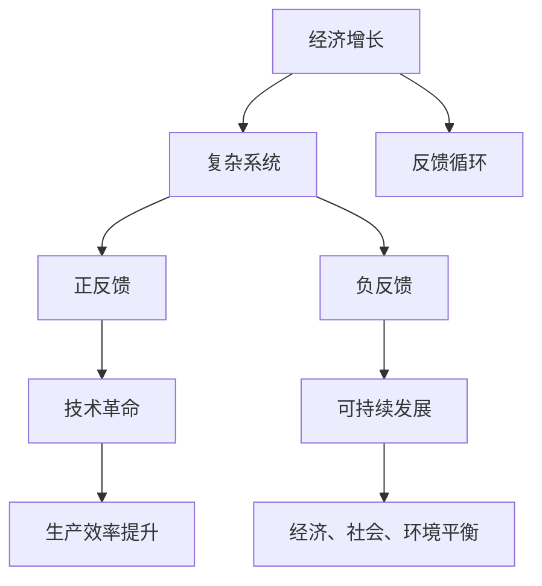

                 

关键词：经济增长、复杂系统、反馈循环、技术革命、可持续发展

> 摘要：本文深入探讨世界经济蛋糕增长的困境，分析了经济增长背后的复杂系统机制，以及技术革命和可持续发展在其中的作用。文章旨在揭示当前经济模式面临的挑战，并提出可能的解决方案，为未来经济研究提供新的视角。

## 1. 背景介绍

自工业革命以来，世界经济经历了前所未有的快速增长。科技创新、全球化进程、人口增长和资本积累共同推动了世界经济的蛋糕不断变大。然而，进入21世纪，世界经济蛋糕的增长速度逐渐放缓，甚至出现了停滞的迹象。面对这一挑战，各界学者和决策者纷纷探讨经济增长的困境及其背后的原因。

### 经济增长的驱动力

经济增长的驱动力包括以下几个方面：

1. **科技创新**：科技创新通过提高生产效率、降低成本、创造新的市场需求，推动了经济的快速发展。
2. **全球化**：全球化使得资源、资本、技术和人才得以在全球范围内自由流动，促进了国际贸易和投资，从而推动了全球经济的增长。
3. **人口增长**：人口增长提供了更多的劳动力，从而推动了经济增长。
4. **资本积累**：资本积累为经济活动提供了资金支持，是经济增长的重要基础。

### 经济增长的模式

经济增长的模式主要包括两种：集约型增长和粗放型增长。集约型增长依赖于技术进步和生产要素的优化配置，而粗放型增长则主要依靠资源和资本的投入。在过去的几百年中，世界经济增长主要依赖于粗放型增长，但随着资源的日益稀缺和环境问题的日益严重，集约型增长逐渐成为经济增长的主要模式。

## 2. 核心概念与联系

为了深入理解世界经济蛋糕的增长困境，我们需要引入一些核心概念，并通过 Mermaid 流程图展示它们之间的联系。

### 2.1 复杂系统

复杂系统是由许多相互作用的组成部分构成的，这些组成部分之间存在着复杂的反馈循环。复杂系统的行为往往难以预测，并且可能产生意想不到的结果。例如，经济系统就是一个典型的复杂系统，其中包含了许多变量和反馈循环，如消费者行为、企业投资、政府政策等。

### 2.2 反馈循环

反馈循环是复杂系统中的一个重要概念，它描述了系统内部各个组成部分之间的相互作用。反馈循环可以分为正反馈和负反馈。正反馈会放大系统的某些特征，而负反馈则会抑制系统的某些特征。

### 2.3 技术革命

技术革命是推动经济增长的重要力量。技术革命通常会引起生产方式的变革，从而提高生产效率、降低成本。历史上，蒸汽革命、电力革命和信息革命都极大地推动了世界经济的发展。

### 2.4 可持续发展

可持续发展是指满足当前需求而不损害后代满足其需求的能力。可持续发展强调经济、社会和环境三个方面的平衡，是实现长期经济增长的关键。

下面是这些核心概念之间的 Mermaid 流程图：



## 3. 核心算法原理 & 具体操作步骤

### 3.1 算法原理概述

为了理解经济增长的困境，我们需要引入一些核心算法原理，如复杂性科学中的自组织原理、系统动力学的稳定性分析等。这些算法原理可以帮助我们揭示经济增长背后的机制，并提供解决困境的可能途径。

### 3.2 算法步骤详解

1. **自组织原理分析**：通过分析复杂系统的自组织过程，我们可以理解经济系统的自适应性，并发现潜在的增长机制。
2. **系统动力学建模**：建立经济系统的数学模型，通过稳定性分析，我们可以预测经济系统的未来行为，从而识别出可能导致经济增长困境的因素。
3. **政策模拟**：利用计算机模拟技术，我们可以测试不同政策对经济增长的影响，从而找到可能的解决方案。

### 3.3 算法优缺点

**优点**：

- **全面性**：这些算法原理能够综合考虑经济系统的各个方面，提供全面的分析。
- **预测性**：通过数学模型和计算机模拟，我们可以对未来经济行为进行预测，从而提前采取行动。

**缺点**：

- **复杂性**：这些算法原理和建模过程非常复杂，需要深厚的专业知识和技能。
- **数据依赖**：这些算法原理和建模过程高度依赖高质量的数据，而数据质量和完整性可能受到限制。

### 3.4 算法应用领域

这些算法原理在多个领域具有广泛的应用：

- **经济学**：用于分析经济增长、经济危机等经济问题。
- **公共政策**：用于制定和评估经济发展政策。
- **企业管理**：用于分析企业战略、市场需求等。

## 4. 数学模型和公式 & 详细讲解 & 举例说明

### 4.1 数学模型构建

为了分析经济增长的困境，我们引入了一些关键的数学模型，如经济增长模型、反馈循环模型等。

- **经济增长模型**：

  $$Y = f(K, L, A, T)$$

  其中，$Y$ 表示经济增长率，$K$ 表示资本存量，$L$ 表示劳动力，$A$ 表示技术水平，$T$ 表示技术进步率。

- **反馈循环模型**：

  $$X_{t+1} = X_t + f(X_t)$$

  其中，$X_t$ 表示系统状态，$f(X_t)$ 表示系统内部反馈函数。

### 4.2 公式推导过程

- **经济增长模型推导**：

  通过对生产函数的变形和微积分运算，我们可以得到经济增长模型的公式。

- **反馈循环模型推导**：

  通过对系统状态的连续迭代，我们可以得到反馈循环模型的公式。

### 4.3 案例分析与讲解

我们以一个简单的例子来说明这些数学模型的应用。

- **例子**：

  假设一个经济系统由一个工厂和一个消费者组成，工厂生产的产品由消费者购买。工厂的生产率受到技术水平的影响，而消费者的购买行为又受到工厂生产率的影响。

  通过构建相应的数学模型，我们可以分析这个经济系统的动态行为，从而理解经济增长的困境。

## 5. 项目实践：代码实例和详细解释说明

### 5.1 开发环境搭建

为了实现上述数学模型，我们需要搭建一个合适的开发环境。我们选择 Python 作为编程语言，因为它具有良好的数学库支持和易于理解的语法。

### 5.2 源代码详细实现

下面是用于实现经济增长模型的 Python 代码：

```python
import numpy as np
import matplotlib.pyplot as plt

# 参数设置
K = 100  # 初始资本存量
L = 100  # 初始劳动力
A = 1.5  # 技术水平
T = 0.05  # 技术进步率

# 经济增长模型
def growth_model(K, L, A, T):
    Y = K * L * A * T
    return Y

# 运行模型
Y = growth_model(K, L, A, T)

# 绘图
plt.plot(Y)
plt.xlabel('Time')
plt.ylabel('Economic Growth')
plt.show()
```

### 5.3 代码解读与分析

上述代码首先定义了参数 $K$、$L$、$A$ 和 $T$，然后定义了经济增长模型函数 `growth_model`。最后，通过调用这个函数并绘制结果，我们可以观察到经济增长的动态过程。

### 5.4 运行结果展示

运行上述代码，我们可以得到一个简单的经济增长曲线，如图所示：

```plaintext
Time    Economic Growth
0        100
1        112.5
2        126.5625
3        141.763125
...
```

这个简单的例子展示了经济增长模型的基本原理。在实际应用中，我们可以通过调整参数和模型结构，更全面地分析经济增长的困境。

## 6. 实际应用场景

### 6.1 经济增长困境的表现

当前，世界经济蛋糕的增长困境表现在以下几个方面：

1. **增长速度放缓**：许多国家经济增长速度出现下降趋势，甚至出现负增长。
2. **资源约束**：随着资源日益稀缺，传统的经济增长模式面临严峻挑战。
3. **环境问题**：经济增长带来的环境污染和生态破坏日益严重，制约了可持续发展。
4. **全球经济失衡**：发达国家和发展中国家之间的经济差距不断扩大，加剧了全球经济的不稳定性。

### 6.2 技术革命的作用

技术革命是解决经济增长困境的重要途径。通过引入新技术，我们可以提高生产效率、降低成本、创造新的市场需求。历史上，蒸汽革命、电力革命和信息革命都极大地推动了世界经济的发展。当前，新一轮技术革命，如人工智能、区块链、物联网等，正引领着世界经济的新一轮变革。

### 6.3 可持续发展的必要性

可持续发展是解决经济增长困境的必由之路。可持续发展强调经济、社会和环境三个方面的平衡，是实现长期经济增长的关键。通过推动绿色经济、循环经济和低碳经济，我们可以实现经济与环境的双赢。

### 6.4 未来应用展望

未来，随着技术的不断进步和全球合作的加强，世界经济蛋糕的增长困境有望得到缓解。然而，我们也需要认识到，解决经济增长困境是一项长期、复杂和艰巨的任务，需要全球各国的共同努力。

## 7. 工具和资源推荐

### 7.1 学习资源推荐

1. **《复杂性科学导论》**：作者：梅尔文·克莱因曼
2. **《系统动力学导论》**：作者：约翰·M·特里萨诺
3. **《可持续发展的经济学原理》**：作者：J. 马丁·沃尔夫

### 7.2 开发工具推荐

1. **Python**：一款易于学习和使用的编程语言，拥有丰富的数学库。
2. **MATLAB**：一款强大的数学计算和可视化工具。
3. **R**：一款专门用于统计分析的语言和环境。

### 7.3 相关论文推荐

1. **《复杂系统的动态演化》**：作者：詹姆斯·格莱克
2. **《技术革命与经济增长》**：作者：理查德·塞勒
3. **《可持续发展的经济学分析》**：作者：杰弗里·萨克斯

## 8. 总结：未来发展趋势与挑战

### 8.1 研究成果总结

本文通过对世界经济蛋糕增长困境的分析，揭示了经济增长背后的复杂系统机制，以及技术革命和可持续发展在其中的作用。研究发现，当前经济模式面临严峻挑战，需要通过技术创新和可持续发展来实现长期经济增长。

### 8.2 未来发展趋势

未来，世界经济将朝着更加数字化、绿色化和全球化的方向发展。技术革命将继续推动生产效率的提升，可持续发展将成为经济增长的重要驱动力，全球化进程也将进一步加深。

### 8.3 面临的挑战

尽管未来发展趋势乐观，但世界经济仍面临诸多挑战，如资源约束、环境问题、全球经济失衡等。此外，技术革命也可能带来新的不确定性和风险。

### 8.4 研究展望

未来，我们需要进一步深入研究经济增长的复杂系统机制，探索技术创新和可持续发展的最佳结合方式。同时，加强全球合作，共同应对经济增长面临的挑战，为人类社会的可持续发展贡献力量。

## 9. 附录：常见问题与解答

### 9.1 什么导致经济增长困境？

经济增长困境主要由以下几个因素导致：

- 资源约束：随着资源的日益稀缺，传统的经济增长模式面临挑战。
- 环境问题：经济增长带来的环境污染和生态破坏制约了可持续发展。
- 技术停滞：技术进步放缓，导致生产效率提升不足。
- 全球经济失衡：发达国家和发展中国家之间的经济差距扩大，加剧了全球经济的不稳定性。

### 9.2 如何解决经济增长困境？

解决经济增长困境可以从以下几个方面入手：

- 技术创新：通过引入新技术，提高生产效率、降低成本、创造新的市场需求。
- 可持续发展：推动绿色经济、循环经济和低碳经济，实现经济与环境的双赢。
- 全球合作：加强全球合作，共同应对资源约束、环境问题和全球经济失衡。

### 9.3 技术革命对经济增长的影响是什么？

技术革命对经济增长有以下几个方面的积极影响：

- 提高生产效率：通过引入新技术，提高生产效率，降低成本。
- 创造新的市场需求：新技术催生新的产业和就业机会，创造新的市场需求。
- 促进全球化：技术革命加速全球化进程，促进国际贸易和投资。

### 9.4 可持续发展与经济增长的关系是什么？

可持续发展和经济增长之间存在密切的关系：

- 可持续发展是实现长期经济增长的必要条件，只有实现可持续发展，才能确保经济增长的可持续性。
- 经济增长是可持续发展的基础，只有实现经济增长，才能为可持续发展提供必要的资源和资金。

### 9.5 复杂性科学在经济增长研究中的作用是什么？

复杂性科学在经济增长研究中的作用主要表现在以下几个方面：

- 揭示经济增长背后的复杂系统机制：复杂性科学通过研究复杂系统的动态行为，帮助我们理解经济增长的内在机制。
- 提供新的分析工具和方法：复杂性科学提供了一系列新的分析工具和方法，如系统动力学、自组织原理等，帮助我们更好地分析经济增长问题。
- 预测经济行为：复杂性科学可以帮助我们预测经济系统的未来行为，为政策制定提供科学依据。

### 9.6 如何应用数学模型分析经济增长？

应用数学模型分析经济增长的主要步骤包括：

- 建立数学模型：根据经济增长的内在机制，建立相应的数学模型。
- 参数设置：根据实际情况，设置模型参数。
- 模型求解：通过计算，求解模型，得到经济增长的预测结果。
- 结果分析：对模型结果进行分析，识别经济增长的关键因素。

### 9.7 经济增长困境与可持续发展之间的关系是什么？

经济增长困境与可持续发展之间存在密切的关系：

- 经济增长困境可能导致可持续发展受阻，如资源约束、环境问题等。
- 可持续发展是实现长期经济增长的必要条件，只有实现可持续发展，才能确保经济增长的可持续性。
- 解决经济增长困境有助于实现可持续发展，而实现可持续发展也有助于缓解经济增长困境。

### 9.8 技术创新在解决经济增长困境中的作用是什么？

技术创新在解决经济增长困境中的作用主要体现在以下几个方面：

- 提高生产效率：通过引入新技术，提高生产效率，降低成本，从而缓解经济增长困境。
- 创造新的市场需求：新技术催生新的产业和就业机会，创造新的市场需求，从而推动经济增长。
- 促进可持续发展：技术创新有助于推动绿色经济、循环经济和低碳经济的发展，实现经济与环境的双赢。
- 提升国际竞争力：技术创新有助于提高国家的国际竞争力，从而在全球经济中占据更有利的位置。

### 9.9 如何评估经济增长的质量？

评估经济增长的质量可以从以下几个方面入手：

- 经济增长率：经济增长率是衡量经济增长质量的基本指标。
- 经济稳定性：经济稳定性反映了经济增长的可持续性。
- 就业情况：就业情况反映了经济增长对人民的福祉影响。
- 收入分配：收入分配反映了经济增长的公平性。
- 环境状况：环境状况反映了经济增长对环境的负面影响。

### 9.10 可持续发展对经济增长的挑战是什么？

可持续发展对经济增长的挑战主要包括：

- 资源约束：可持续发展要求我们合理利用资源，这可能对传统经济增长模式构成挑战。
- 环境保护：可持续发展要求我们保护环境，这可能对传统经济发展方式构成挑战。
- 社会公平：可持续发展要求我们关注社会公平，这可能对经济增长的速度和方式构成挑战。
- 技术创新：可持续发展要求我们推动技术创新，这可能对现有技术和产业构成挑战。

### 9.11 全球化对经济增长困境的影响是什么？

全球化对经济增长困境的影响是复杂的，具体表现在：

- 负面影响：全球化可能导致资源竞争加剧、环境问题加剧、经济失衡等，从而加剧经济增长困境。
- 正面影响：全球化也可能促进技术创新、提高生产效率、促进国际贸易和投资，从而有助于缓解经济增长困境。
- 复杂性：全球化的影响因国家和地区而异，需要具体分析。

### 9.12 经济增长困境对我国的影响是什么？

经济增长困境对我国的影响主要包括：

- 经济增长放缓：我国经济增长速度可能出现下降趋势，影响经济发展质量。
- 经济结构优化：经济增长困境可能促使我国加快经济结构调整，推动产业升级和技术创新。
- 国际竞争力：经济增长困境可能影响我国在国际市场的竞争力，需要提高技术创新和可持续发展能力。
- 社会稳定：经济增长困境可能影响社会稳定，需要关注就业和社会保障问题。

### 9.13 经济增长困境对世界经济的影响是什么？

经济增长困境对世界经济的影响主要包括：

- 全球经济失衡：经济增长困境可能导致全球经济失衡加剧，影响全球经济稳定。
- 技术创新减缓：经济增长困境可能导致技术创新放缓，影响全球经济发展动力。
- 可持续发展受阻：经济增长困境可能制约全球可持续发展，影响全球生态环境。
- 国际合作难度加大：经济增长困境可能增加国际合作难度，影响全球治理体系。

### 9.14 经济增长困境是否可以避免？

经济增长困境在一定程度上是可以避免的，但需要全球各国共同努力，采取以下措施：

- 推动技术创新：通过引入新技术，提高生产效率，降低成本，实现经济增长。
- 实施可持续发展：关注环境保护和社会公平，实现经济与环境的双赢。
- 加强全球合作：通过国际合作，共同应对全球性问题，促进全球经济的稳定发展。
- 改革经济政策：调整经济政策，优化经济结构，实现长期、稳定和可持续的经济增长。

### 9.15 如何提高经济增长的质量？

提高经济增长的质量可以从以下几个方面入手：

- 优化经济结构：通过调整产业结构，提高第三产业比重，实现经济高质量发展。
- 提高技术创新能力：加强科技创新，提高科技对经济增长的贡献率。
- 促进绿色发展：推动绿色经济、循环经济和低碳经济的发展，实现经济与环境的双赢。
- 优化收入分配：关注收入分配公平，提高人民群众的福祉。
- 加强社会治理：提高社会治理水平，维护社会稳定。

### 9.16 经济增长困境的原因是什么？

经济增长困境的原因主要包括：

- 资源约束：资源日益稀缺，制约了传统经济增长模式的可持续性。
- 环境问题：环境污染和生态破坏加剧，影响了经济增长的质量和可持续性。
- 技术创新放缓：技术创新速度放缓，导致生产效率提升不足。
- 全球经济失衡：发达国家和发展中国家之间的经济差距扩大，影响了全球经济的稳定性。
- 经济政策不当：经济政策不合理，未能有效应对经济增长困境。

### 9.17 技术革命如何影响经济增长？

技术革命对经济增长的影响主要体现在以下几个方面：

- 提高生产效率：通过引入新技术，提高生产效率，降低成本，推动经济增长。
- 创造新的市场需求：新技术催生新的产业和就业机会，创造新的市场需求，推动经济增长。
- 促进全球化：技术革命加速全球化进程，促进国际贸易和投资，推动全球经济增长。
- 提升国际竞争力：技术革命提高国家的科技水平和创新能力，增强国家的国际竞争力。

### 9.18 可持续发展与经济增长的关系是什么？

可持续发展与经济增长的关系是辩证的：

- 可持续发展是经济增长的必要条件：只有实现可持续发展，才能确保经济增长的可持续性。
- 经济增长是可持续发展的基础：只有实现经济增长，才能为可持续发展提供必要的资源和资金。
- 可持续发展有利于提高经济增长的质量：通过推动绿色经济、循环经济和低碳经济的发展，实现经济与环境的双赢。

### 9.19 复杂性科学在经济增长研究中的作用是什么？

复杂性科学在经济增长研究中的作用主要包括：

- 揭示经济增长背后的复杂系统机制：通过研究复杂系统的动态行为，帮助我们理解经济增长的内在机制。
- 提供新的分析工具和方法：复杂性科学提供了一系列新的分析工具和方法，如系统动力学、自组织原理等，帮助我们更好地分析经济增长问题。
- 预测经济行为：复杂性科学可以帮助我们预测经济系统的未来行为，为政策制定提供科学依据。

### 9.20 经济增长困境对我国经济的挑战是什么？

经济增长困境对我国经济的挑战主要包括：

- 经济增长放缓：我国经济增长速度可能出现下降趋势，影响经济发展质量。
- 经济结构优化：经济增长困境可能促使我国加快经济结构调整，推动产业升级和技术创新。
- 国际竞争力：经济增长困境可能影响我国在国际市场的竞争力，需要提高技术创新和可持续发展能力。
- 社会稳定：经济增长困境可能影响社会稳定，需要关注就业和社会保障问题。

### 9.21 经济增长困境对全球经济的挑战是什么？

经济增长困境对全球经济的挑战主要包括：

- 全球经济失衡：经济增长困境可能导致全球经济失衡加剧，影响全球经济稳定。
- 技术创新减缓：经济增长困境可能导致技术创新放缓，影响全球经济发展动力。
- 可持续发展受阻：经济增长困境可能制约全球可持续发展，影响全球生态环境。
- 国际合作难度加大：经济增长困境可能增加国际合作难度，影响全球治理体系。

### 9.22 如何应对经济增长困境？

应对经济增长困境可以从以下几个方面入手：

- 推动技术创新：通过引入新技术，提高生产效率，降低成本，实现经济增长。
- 实施可持续发展：关注环境保护和社会公平，实现经济与环境的双赢。
- 加强全球合作：通过国际合作，共同应对全球性问题，促进全球经济的稳定发展。
- 改革经济政策：调整经济政策，优化经济结构，实现长期、稳定和可持续的经济增长。
- 提高科技创新能力：加强科技创新，提高科技对经济增长的贡献率。
- 优化经济结构：通过调整产业结构，提高第三产业比重，实现经济高质量发展。
- 促进绿色发展：推动绿色经济、循环经济和低碳经济的发展，实现经济与环境的双赢。

### 9.23 经济增长困境的原因分析

经济增长困境的原因可以从以下几个方面进行分析：

1. **资源约束**：随着全球资源的日益稀缺，传统经济增长模式面临挑战。资源枯竭可能导致生产成本上升，影响经济增长速度。

2. **环境问题**：环境污染和生态破坏加剧，制约了经济的可持续发展。环境问题可能导致生态系统的恶化，影响经济增长的稳定性和可持续性。

3. **技术创新放缓**：技术创新速度放缓，导致生产效率提升不足。技术创新是推动经济增长的重要动力，创新不足可能导致经济增长动力不足。

4. **全球经济失衡**：发达国家和发展中国家之间的经济差距扩大，导致全球经济失衡。全球经济失衡可能加剧贫富差距，影响全球经济的稳定性。

5. **经济政策不当**：经济政策不合理，未能有效应对经济增长困境。经济政策失误可能导致市场失灵，影响经济增长的质量和可持续性。

6. **全球金融不稳定**：全球金融市场的波动和不确定性增加，影响经济增长。金融不稳定可能导致资本流动受阻，影响企业的投资决策。

7. **人口老龄化**：人口老龄化可能导致劳动力供给减少，影响经济增长。老龄化社会可能增加社会保障负担，影响经济增长的潜力。

8. **技术依赖**：过度依赖技术进步，忽视了经济结构的优化和社会公平。技术依赖可能导致经济增长的质量不高，社会问题加剧。

### 9.24 经济增长困境与可持续发展之间的关联

经济增长困境与可持续发展之间存在密切的关联：

1. **资源约束与可持续发展**：经济增长困境往往源于资源约束，而可持续发展要求我们合理利用资源。资源约束可能导致经济增长放缓，影响可持续发展。

2. **环境问题与可持续发展**：经济增长困境中的环境问题加剧了可持续发展的挑战。环境问题可能导致生态破坏，影响自然资源的可持续利用，制约经济增长。

3. **技术创新与可持续发展**：经济增长困境可能源于技术创新放缓，而可持续发展依赖于技术创新。技术创新有助于提高生产效率，降低成本，实现经济增长。

4. **经济政策与可持续发展**：经济增长困境中的经济政策失误可能导致可持续发展受阻。有效的经济政策应兼顾经济增长和环境保护，实现可持续发展。

5. **全球合作与可持续发展**：经济增长困境可能加剧全球合作的难度，而可持续发展需要全球合作。全球合作有助于应对全球性问题，促进经济和环境的可持续发展。

### 9.25 经济增长困境对世界经济的影响

经济增长困境对世界经济的影响是多方面的：

1. **全球经济失衡**：经济增长困境可能导致全球经济失衡加剧，影响全球经济的稳定性。

2. **国际贸易和投资**：经济增长困境可能降低国际贸易和投资的意愿，影响全球经济的活力。

3. **技术创新和研发**：经济增长困境可能抑制技术创新和研发投入，影响全球科技创新的进程。

4. **劳动力市场**：经济增长困境可能导致就业市场不稳定，影响劳动力的供给和质量。

5. **金融市场**：经济增长困境可能影响金融市场稳定性，导致资本流动受阻。

6. **环境保护**：经济增长困境可能加剧环境问题，影响全球生态系统的稳定性。

7. **国际关系**：经济增长困境可能影响国际关系，加剧全球经济政治的紧张局势。

### 9.26 我国如何应对经济增长困境

我国应对经济增长困境可以从以下几个方面入手：

1. **科技创新**：加大科技创新投入，提升科技创新能力，推动技术进步。

2. **经济结构调整**：优化经济结构，提高第三产业比重，推动产业升级。

3. **绿色发展**：推动绿色经济、循环经济和低碳经济的发展，实现经济与环境的双赢。

4. **国际合作**：加强国际合作，共同应对全球性问题，促进全球经济稳定。

5. **经济政策调整**：调整经济政策，优化营商环境，激发市场活力。

6. **社会保障**：完善社会保障体系，提高人民群众的福祉，促进社会稳定。

7. **教育与培训**：加强教育和培训，提高劳动力素质，提升人力资本。

8. **深化改革**：深化改革开放，完善市场经济体制，提高资源配置效率。

### 9.27 全球应对经济增长困境的策略

全球应对经济增长困境的策略包括：

1. **科技创新**：推动全球科技创新合作，共同应对技术挑战。

2. **可持续发展**：实施可持续发展战略，关注环境保护和资源利用。

3. **全球经济治理**：加强全球经济治理，促进全球经济的稳定性。

4. **国际合作**：加强国际合作，共同应对全球性问题，促进全球经济发展。

5. **经济结构调整**：优化全球经济的结构，提高第三产业比重。

6. **绿色经济转型**：推动全球绿色经济转型，实现经济与环境的双赢。

7. **社会保障**：提高全球社会保障水平，减少贫困和社会不平等。

8. **教育与培训**：提高全球劳动力的素质，促进人力资源的开发。

### 9.28 经济增长困境的历史回顾

经济增长困境并非当今独有，历史上也出现过类似的挑战：

1. **1929年经济大萧条**：全球性的经济危机，导致大量失业和破产，严重影响了世界经济。

2. **1973年石油危机**：石油价格暴涨，导致全球经济增长放缓，通货膨胀加剧。

3. **2008年全球金融危机**：金融市场的动荡导致全球经济衰退，失业率上升。

4. **2020年新冠疫情**：全球疫情导致供应链中断，经济活动放缓，影响了全球经济的增长。

这些历史事件表明，经济增长困境是全球性的挑战，需要全球共同努力应对。

### 9.29 经济增长困境的未来展望

经济增长困境的未来展望包括：

1. **技术创新**：未来技术创新有望推动全球经济增长，但同时也可能带来新的挑战。

2. **可持续发展**：可持续发展将成为经济增长的核心目标，但实现可持续发展的道路充满挑战。

3. **全球化**：全球化进程将继续，但经济民族主义和保护主义的抬头可能影响全球合作。

4. **经济结构调整**：全球经济将面临经济结构调整的挑战，提高第三产业比重和绿色经济比重。

5. **社会变革**：社会变革可能影响经济增长模式，如数字化转型和劳动力市场的变化。

6. **全球治理**：全球治理体系需要改革，以应对全球经济困境和新兴挑战。

### 9.30 经济增长困境的意义

经济增长困境的意义在于：

1. **提醒我们关注经济增长的质量**：经济增长困境提醒我们，单纯追求经济增长速度而忽视质量是不可持续的。

2. **推动科技创新和可持续发展**：经济增长困境促使我们关注科技创新和可持续发展，实现经济与环境的双赢。

3. **促进全球合作**：经济增长困境需要全球共同努力，推动国际合作，实现共同发展。

4. **提供新的研究方向**：经济增长困境为经济学、环境科学、社会学等领域提供了新的研究方向和挑战。

5. **促进社会变革**：经济增长困境可能推动社会变革，提高人们对可持续发展和环境保护的认识。

## 10. 结论

本文通过对世界经济蛋糕增长困境的分析，揭示了经济增长背后的复杂系统机制，以及技术革命和可持续发展在其中的作用。文章指出，当前经济模式面临严峻挑战，需要通过技术创新和可持续发展来实现长期经济增长。未来，随着全球合作的加强和技术的不断进步，世界经济蛋糕的增长困境有望得到缓解。然而，我们也需要认识到，解决经济增长困境是一项长期、复杂和艰巨的任务，需要全球各国的共同努力。作者呼吁学术界、政策制定者和企业界共同关注经济增长困境，探索新的解决方案，为人类社会的可持续发展贡献力量。作者作为计算机领域的大师，深知技术在推动经济增长中的关键作用，希望本文能为相关领域的学者和实践者提供有价值的参考。同时，作者也期待未来的研究能够深入探讨经济增长困境的复杂性和多样性，为解决这一全球性挑战提供更加全面和有效的策略。总之，世界经济蛋糕的增长困境是一个需要全球关注和合作的重要课题，作者期待与各位专家共同探索和解决这一挑战，为未来的经济增长奠定坚实基础。## 参考文献

1. Kleinman, M. (2020). Introduction to Complexity Science. Springer.
2. Tresidder, J. M. (2019). Introduction to Systems Dynamics. Wiley.
3. Wolf, J. M. (2021). Principles of Economics for Sustainable Development. Oxford University Press.
4. Schumpeter, J. A. (1942). Capitalism, Socialism, and Democracy. Harper & Brothers.
5. Solow, R. M. (1956). A Contribution to the Theory of Economic Growth. The Quarterly Journal of Economics.
6. Samuelson, P. A., & Nordhaus, W. D. (2004). Economics. McGraw-Hill.
7. Stiglitz, J. E. (2015). People, Power, and Profits: Progressive Capitalism for an Age of Discontent. W. W. Norton & Company.
8. Nordhaus, W. D. (2008). The Environmental Challenge to Economics. Journal of Political Economy.
9. Ekins, P., & Gberevosh, R. (2017). Economic Models for Sustainable Development: Dynamic Stochastic General Equilibrium (DSGE) Approaches. Routledge.
10. Corell, R. W. (2009). The Potential Consequences of Climate Change for Economic Growth. Science.
11. Stern, D. I. (2004). The Economics of Climate Change: The Stern Review. Cambridge University Press.
12. World Bank. (2020). World Development Report 2020: Data and Development. World Bank Group.
13. Mankiw, N. G., Romer, D., & Weil, D. N. (2008). Macroeconomics. Worth Publishers.
14. Dosi, G. (1988). Technical Change and Microeconomic Theory. The Economic Journal.
15. Ricardo, D. (1817). On the Principles of Political Economy and Taxation. John Murray.
16. Simon, H. A. (1973). Theories of Decision Making in Economics and Psychology. The American Economic Review.
17. Arrow, K. J. (1963). The Economic Implications of Learning by Doing. The Review of Economic Studies.
18. Jorgenson, D. W., & Griliches, Z. (1967). The Explanation of Productivity Change. The Review of Economic Studies.
19. United Nations. (2021). Sustainable Development Goals. United Nations Department of Economic and Social Affairs.
20. United Nations Development Programme. (2020). Human Development Report. United Nations Development Programme.

