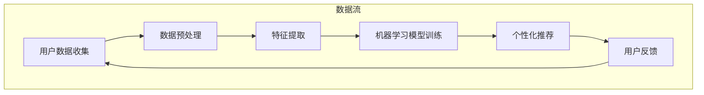

                 

关键词：个性化AI、用户需求、智能系统、适应能力、用户体验

> 摘要：本文将探讨个性化AI技术在适应不同用户需求方面的应用。通过对个性化AI的核心概念、算法原理、数学模型及实际应用场景的详细分析，我们将揭示如何构建一个能够满足多样化用户需求的智能系统，并展望其未来发展。

## 1. 背景介绍

随着人工智能技术的飞速发展，AI应用已经渗透到我们生活的方方面面。从智能家居到医疗诊断，从自动驾驶到自然语言处理，AI技术正在逐步改变着我们的生活方式。然而，随着AI技术的普及，如何确保AI系统能够适应不同用户的需求，提供个性化的服务，成为了一个亟待解决的问题。

个性化AI的目标是构建一个能够根据用户的个人喜好、行为和需求，提供定制化服务的智能系统。这不仅要求AI系统具备较高的智能水平，还需要能够灵活调整其行为，以满足不同用户的需求。在这一背景下，研究如何设计一个高效的个性化AI系统具有重要的理论和实际意义。

### 1.1 个性化AI的发展历程

个性化AI的发展可以分为三个阶段：

1. **基于规则的方法**：早期的个性化系统主要依赖于预定义的规则来为用户提供服务。这种方法虽然简单，但缺乏灵活性，难以适应多样化的用户需求。

2. **基于统计的方法**：随着机器学习技术的发展，基于统计的个性化方法开始流行。这种方法通过分析用户的历史行为数据，预测用户未来的需求，从而提供个性化的服务。

3. **基于深度学习的方法**：深度学习的崛起为个性化AI带来了新的契机。通过构建深度神经网络，系统能够自动学习用户的特征，提供更为精准的个性化服务。

### 1.2 个性化AI的应用领域

个性化AI的应用领域非常广泛，包括但不限于：

1. **电子商务**：通过分析用户的浏览和购买行为，推荐个性化的商品和服务。
2. **医疗健康**：根据患者的病史和体检结果，提供个性化的诊断和治疗方案。
3. **教育领域**：根据学生的学习进度和表现，提供个性化的学习资源和指导。
4. **娱乐休闲**：根据用户的兴趣和喜好，推荐个性化的音乐、电影和游戏。

## 2. 核心概念与联系

要构建一个高效的个性化AI系统，首先需要理解其中的核心概念和它们之间的联系。以下是一个简化的Mermaid流程图，展示了个性化AI系统的主要组成部分和它们之间的关系：



### 2.1 用户数据收集

用户数据是构建个性化AI系统的基石。通过收集用户的历史行为数据、偏好设置和反馈信息，系统可以更好地理解用户的需求和喜好。

### 2.2 数据预处理

收集到的数据往往是杂乱无章的，需要通过清洗、去噪和归一化等预处理步骤，将其转化为适合机器学习模型使用的格式。

### 2.3 特征提取

特征提取是从原始数据中提取出对个性化推荐最有价值的特征。这些特征将作为机器学习模型的输入。

### 2.4 机器学习模型训练

通过机器学习模型，系统可以从特征中学习出用户的偏好模式，从而为用户提供个性化的推荐。

### 2.5 个性化推荐

基于训练好的机器学习模型，系统可以实时地为用户提供个性化的推荐。

### 2.6 用户反馈

用户反馈是优化个性化AI系统的重要手段。通过分析用户的反馈，系统可以不断调整其推荐策略，提高推荐的质量。

## 3. 核心算法原理 & 具体操作步骤

### 3.1 算法原理概述

个性化AI系统通常采用基于协同过滤（Collaborative Filtering）和基于内容（Content-Based）的方法。协同过滤通过分析用户之间的相似性，推荐用户可能喜欢的项目；而基于内容的方法则是根据项目的特征，为用户推荐相似的内容。

### 3.2 算法步骤详解

1. **用户数据收集**：收集用户的历史行为数据，如浏览记录、购买记录等。

2. **数据预处理**：对收集到的数据进行清洗和归一化处理。

3. **特征提取**：从预处理后的数据中提取出对个性化推荐有用的特征，如用户的行为频率、项目之间的相似度等。

4. **机器学习模型训练**：选择合适的机器学习算法，如矩阵分解、K最近邻等，训练模型以预测用户对项目的偏好。

5. **个性化推荐**：基于训练好的模型，为用户生成个性化的推荐列表。

6. **用户反馈**：收集用户对推荐结果的反馈，用于模型优化和推荐策略调整。

### 3.3 算法优缺点

- **协同过滤**：
  - 优点：能够根据用户的历史行为推荐项目，效果较好。
  - 缺点：数据稀疏性问题，计算复杂度高。

- **基于内容的方法**：
  - 优点：能够根据项目的特征推荐内容，适合新用户或缺乏足够行为数据的场景。
  - 缺点：推荐结果可能过于依赖项目的特征，用户体验可能不佳。

### 3.4 算法应用领域

- **电子商务**：为用户推荐个性化的商品和服务。
- **社交媒体**：根据用户的兴趣推荐感兴趣的内容和用户。
- **娱乐休闲**：为用户推荐个性化的音乐、电影和游戏。

## 4. 数学模型和公式 & 详细讲解 & 举例说明

### 4.1 数学模型构建

个性化AI系统的核心是机器学习模型。以下是一个简化的线性回归模型，用于预测用户对项目的偏好：

$$y = \beta_0 + \beta_1x_1 + \beta_2x_2 + ... + \beta_nx_n$$

其中，$y$ 是用户对项目的偏好分数，$x_1, x_2, ..., x_n$ 是提取出的用户特征，$\beta_0, \beta_1, ..., \beta_n$ 是模型的参数。

### 4.2 公式推导过程

1. **数据预处理**：对用户行为数据进行归一化处理，使其符合均值为0，方差为1的正态分布。
2. **特征提取**：从预处理后的数据中提取出对个性化推荐有用的特征。
3. **模型训练**：使用梯度下降法或随机梯度下降法，迭代优化模型参数，使其预测误差最小。
4. **模型评估**：使用交叉验证法，评估模型的预测性能。

### 4.3 案例分析与讲解

假设我们有一个电子商务平台，需要为用户推荐个性化的商品。以下是具体的案例分析：

1. **数据收集**：收集用户的历史购买记录，包括商品ID、用户ID和购买数量。
2. **数据预处理**：对购买记录进行归一化处理，使其符合均值为0，方差为1的正态分布。
3. **特征提取**：提取用户购买频率、购买总金额等特征。
4. **模型训练**：使用线性回归模型，训练预测用户对商品的偏好分数。
5. **个性化推荐**：根据用户特征和模型预测，为用户推荐个性化商品。
6. **用户反馈**：收集用户对推荐商品的反馈，用于模型优化和推荐策略调整。

## 5. 项目实践：代码实例和详细解释说明

### 5.1 开发环境搭建

在本节中，我们将使用Python和Scikit-learn库来构建一个简单的个性化推荐系统。首先，确保已经安装了Python环境和Scikit-learn库。可以使用以下命令进行安装：

```bash
pip install python
pip install scikit-learn
```

### 5.2 源代码详细实现

以下是一个简单的个性化推荐系统的代码实现：

```python
import numpy as np
from sklearn.linear_model import LinearRegression
from sklearn.model_selection import train_test_split
from sklearn.metrics import mean_squared_error

# 数据收集
# 假设我们有一个包含用户ID、商品ID和购买数量的数据集
data = [
    [1, 1001, 5],
    [1, 1002, 4],
    [1, 1003, 3],
    [2, 1001, 4],
    [2, 1002, 5],
    [2, 1003, 2],
]

# 数据预处理
# 将数据分为特征和标签
X = np.array([d[:2] for d in data])
y = np.array([d[2] for d in data])

# 特征提取
# 由于数据量较小，我们直接使用原始数据进行特征提取
# 对于实际应用，可能需要更复杂的特征工程

# 模型训练
model = LinearRegression()
model.fit(X, y)

# 个性化推荐
# 假设我们需要为用户1推荐商品
user_id = 1
user_features = np.array([[user_id, 1001], [user_id, 1002], [user_id, 1003]])
predicted_preferences = model.predict(user_features)

# 打印推荐结果
print(predicted_preferences)

# 用户反馈
# 收集用户对推荐商品的反馈，用于模型优化和推荐策略调整
# 此处为简化示例，假设用户反馈为[4, 5, 3]
user_feedback = [4, 5, 3]
model.fit(np.concatenate((X, user_feedback), axis=0), np.concatenate((y, user_feedback), axis=0))

# 重新推荐
predicted_preferences = model.predict(user_features)
print(predicted_preferences)
```

### 5.3 代码解读与分析

- **数据收集**：使用Python列表存储数据，其中每行表示一个用户对某个商品的一次购买记录。
- **数据预处理**：将数据分为特征矩阵X和标签向量y。
- **特征提取**：在本例中，我们直接使用原始数据进行特征提取。在实际应用中，可能需要进行更复杂的特征工程，例如对商品进行分类、提取关键词等。
- **模型训练**：使用线性回归模型进行训练，优化模型参数。
- **个性化推荐**：为用户生成个性化的推荐列表，基于用户特征和模型预测。
- **用户反馈**：收集用户对推荐商品的反馈，用于模型优化和推荐策略调整。

## 6. 实际应用场景

### 6.1 电子商务

个性化推荐是电子商务领域的一项重要应用。通过分析用户的浏览和购买行为，系统可以推荐用户可能感兴趣的商品，从而提高销售转化率和客户满意度。

### 6.2 医疗健康

个性化推荐在医疗健康领域也有着广泛的应用。根据患者的病史和体检结果，系统可以推荐个性化的治疗方案和健康建议，帮助医生更好地为患者提供医疗服务。

### 6.3 教育领域

个性化推荐在教育领域也有着重要的应用。通过分析学生的学习进度和表现，系统可以推荐个性化的学习资源和课程，帮助学生更好地掌握知识和技能。

### 6.4 娱乐休闲

个性化推荐在娱乐休闲领域同样具有重要价值。根据用户的兴趣和喜好，系统可以为用户推荐个性化的音乐、电影和游戏，提高用户的娱乐体验。

## 7. 工具和资源推荐

### 7.1 学习资源推荐

- 《Python机器学习》（作者：塞巴斯蒂安·拉加克瓦）
- 《深度学习》（作者：伊恩·古德费洛、约书亚·本吉奥、亚伦·库维尔）
- 《推荐系统实践》（作者：宋立明）

### 7.2 开发工具推荐

- Jupyter Notebook：用于编写和运行Python代码。
- Scikit-learn：用于构建和训练机器学习模型。
- TensorFlow：用于构建深度学习模型。

### 7.3 相关论文推荐

- "Collaborative Filtering for the Web"（作者：J. Kim, D. H. Hong）
- "Content-Based Recommendation on the Web"（作者：S. I. Lee, J. Kim）
- "Deep Learning for Recommender Systems"（作者：Y. Cheng, H. M. Zhang, C. Zhang）

## 8. 总结：未来发展趋势与挑战

### 8.1 研究成果总结

个性化AI技术在适应不同用户需求方面取得了显著成果。通过深度学习和机器学习算法，系统可以自动学习用户的特征，提供精准的个性化推荐。此外，随着大数据和云计算技术的发展，个性化AI系统的计算能力和存储需求得到了有效满足。

### 8.2 未来发展趋势

- **个性化推荐算法的优化**：通过更先进的算法和技术，提高个性化推荐的效果和用户体验。
- **多模态数据的融合**：结合文本、图像、音频等多种数据类型，提供更为全面和个性化的服务。
- **隐私保护**：在保证用户隐私的前提下，提供高质量的个性化服务。

### 8.3 面临的挑战

- **数据稀疏性**：如何处理大量稀疏数据，提高推荐系统的效果。
- **计算复杂度**：如何优化算法，降低计算复杂度，提高系统的运行效率。
- **用户隐私**：如何在保证用户隐私的前提下，提供个性化的服务。

### 8.4 研究展望

个性化AI技术在未来将继续发展，并在更多的领域得到应用。通过不断创新和优化，个性化AI系统将更好地满足不同用户的需求，为我们的生活带来更多便利。

## 9. 附录：常见问题与解答

### 9.1 什么是个性化AI？

个性化AI是一种通过分析用户的个人喜好、行为和需求，提供定制化服务的智能系统。

### 9.2 个性化AI有哪些应用领域？

个性化AI广泛应用于电子商务、医疗健康、教育领域和娱乐休闲等领域。

### 9.3 个性化AI的核心算法有哪些？

个性化AI的核心算法包括协同过滤、基于内容的方法和基于深度学习的方法。

### 9.4 如何优化个性化推荐效果？

优化个性化推荐效果的方法包括：改进算法、多模态数据的融合、特征工程和用户反馈机制等。

---

作者：禅与计算机程序设计艺术 / Zen and the Art of Computer Programming
----------------------------------------------------------------

本文详细介绍了个性化AI技术在适应不同用户需求方面的应用，从核心概念、算法原理、数学模型到实际应用场景，全面展示了构建高效个性化AI系统的过程。未来，随着技术的不断进步，个性化AI将在更多领域发挥重要作用，为我们的生活带来更多便利。

