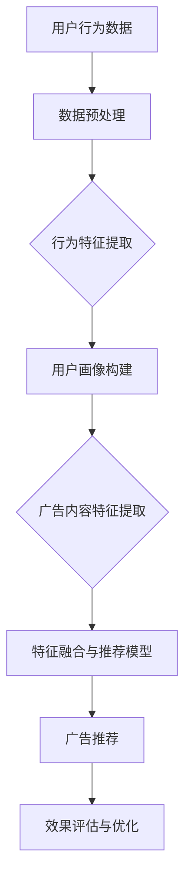

                 

关键词：个性化广告、大模型、精准投放、算法原理、数学模型、代码实例、应用场景

> 摘要：本文深入探讨个性化广告的精准投放技术，从核心概念、算法原理、数学模型到实际项目实践，全面解析大模型在个性化广告中的应用，旨在为读者提供一份全面的技术指南，帮助理解个性化广告的未来发展趋势和面临的挑战。

## 1. 背景介绍

在数字营销时代，广告已成为企业推广产品和服务的重要手段。然而，传统广告的广泛投放往往面临成本高、效果差的问题。随着互联网的普及和数据技术的发展，个性化广告应运而生，成为提升广告投放效率的关键。个性化广告通过分析用户的兴趣、行为等数据，为每个用户定制化地推送相关广告，从而提高广告的点击率和转化率。

大模型（Large Models）的出现为个性化广告提供了强有力的技术支撑。大模型，特别是基于深度学习的模型，能够处理大规模的数据，挖掘出用户行为模式的复杂规律，从而实现广告的精准投放。本文将围绕大模型在个性化广告中的应用，探讨其算法原理、数学模型和实际项目实践，为读者提供一个全方位的技术视角。

## 2. 核心概念与联系

### 2.1 个性化广告

个性化广告是指根据用户的兴趣、行为、地理位置等多维度数据，为用户推荐其可能感兴趣的广告内容。其核心在于“个性化”，即针对不同的用户定制不同的广告内容，提高广告的相关性和用户体验。

### 2.2 大模型

大模型是指具有巨大参数量的机器学习模型，如深度神经网络（DNN）、Transformer等。大模型通过训练大量数据，能够学习到复杂的特征表示和模式，从而实现高精度的预测和分类。

### 2.3 算法原理与架构

大模型在个性化广告中的应用，主要基于以下几个核心算法原理：

1. **用户行为分析**：通过分析用户在网站上的浏览、搜索、购买等行为数据，挖掘用户的兴趣偏好。
2. **内容特征提取**：将广告内容和用户兴趣数据进行特征提取，构建广告内容与用户兴趣的映射关系。
3. **推荐系统**：基于用户行为数据和内容特征，使用推荐算法为用户生成个性化的广告推荐列表。
4. **效果评估与优化**：通过用户点击率、转化率等指标，评估广告投放效果，并不断优化推荐策略。

以下是个性化广告大模型架构的 Mermaid 流程图：



## 3. 核心算法原理 & 具体操作步骤

### 3.1 算法原理概述

个性化广告的核心算法包括用户行为分析、内容特征提取、推荐系统和效果评估与优化。以下分别进行详细介绍。

### 3.2 算法步骤详解

1. **用户行为分析**：
   - 收集用户在网站上的行为数据，包括浏览、搜索、点击、购买等。
   - 对行为数据进行预处理，如去重、补全、归一化等。
   - 使用时间序列分析、聚类分析等方法，挖掘用户的行为模式。

2. **内容特征提取**：
   - 对广告内容进行文本、图像等多维度特征提取。
   - 使用词嵌入、视觉特征提取等技术，将广告内容表示为高维向量。

3. **用户画像构建**：
   - 基于用户行为数据和内容特征，构建用户画像。
   - 使用矩阵分解、深度神经网络等技术，对用户画像进行建模。

4. **推荐系统**：
   - 将用户画像和广告内容特征进行融合，使用推荐算法生成广告推荐列表。
   - 常用的推荐算法包括基于协同过滤、基于内容的推荐和混合推荐等。

5. **效果评估与优化**：
   - 使用A/B测试、在线评估等方法，评估广告推荐的效果。
   - 根据效果评估结果，调整推荐策略，优化广告投放。

### 3.3 算法优缺点

**优点**：
- 精准度高：通过大模型对用户行为和内容特征进行深度挖掘，提高广告的精准投放效果。
- 自适应性强：算法能够根据用户行为和广告效果动态调整推荐策略，提高广告效果。

**缺点**：
- 计算资源消耗大：大模型的训练和推理需要大量计算资源和时间。
- 数据隐私问题：个性化广告需要收集用户的隐私数据，可能引发隐私泄露问题。

### 3.4 算法应用领域

个性化广告算法广泛应用于电商、金融、媒体等行业。以下是一些具体的应用场景：

- **电商行业**：根据用户的购买记录和浏览行为，推荐用户可能感兴趣的商品。
- **金融行业**：根据用户的金融行为和信用记录，推荐合适的理财产品。
- **媒体行业**：根据用户的阅读历史和兴趣，推荐相关的新闻和内容。

## 4. 数学模型和公式 & 详细讲解 & 举例说明

### 4.1 数学模型构建

个性化广告的核心数学模型主要包括用户行为分析模型、内容特征提取模型和推荐模型。以下分别介绍。

### 4.2 公式推导过程

#### 4.2.1 用户行为分析模型

用户行为分析模型主要用于挖掘用户的行为模式。假设用户行为数据可以用一个矩阵表示，其中\( U \)表示用户集合，\( V \)表示行为类型集合，\( X \)表示用户行为矩阵，公式如下：

\[ X_{ij} = \begin{cases} 
1 & \text{如果用户 } u \text{ 在 } v \text{ 类型行为上发生过} \\
0 & \text{否则}
\end{cases} \]

为了挖掘用户的行为模式，可以使用时间序列分析和聚类分析方法。假设用户行为可以用一个向量表示，公式如下：

\[ \mathbf{u} = (u_1, u_2, ..., u_n) \]

其中，\( u_i \)表示用户在 \( i \) 类行为上的发生次数。

#### 4.2.2 内容特征提取模型

内容特征提取模型主要用于提取广告内容的多维度特征。假设广告内容可以用一个向量表示，公式如下：

\[ \mathbf{v} = (v_1, v_2, ..., v_n) \]

其中，\( v_i \)表示广告在 \( i \) 维度特征上的值。

为了提高特征提取的准确性，可以使用词嵌入和视觉特征提取技术。词嵌入技术可以将文本特征表示为一个高维向量，公式如下：

\[ \mathbf{e} = \text{Word2Vec}(\mathbf{v}) \]

视觉特征提取技术可以将图像特征表示为一个高维向量，公式如下：

\[ \mathbf{f} = \text{CNN}(\mathbf{v}) \]

#### 4.2.3 推荐模型

推荐模型主要用于生成用户个性化的广告推荐列表。假设推荐模型可以用一个函数表示，公式如下：

\[ \mathbf{r} = f(\mathbf{u}, \mathbf{v}) \]

其中，\( \mathbf{r} \)表示广告推荐列表，\( f \)表示推荐函数。

常用的推荐算法包括基于协同过滤、基于内容和混合推荐等。基于协同过滤的推荐算法主要基于用户之间的相似度进行推荐，公式如下：

\[ \mathbf{r} = \sum_{u' \in U} s_{uu'} \mathbf{v}_{u'} \]

其中，\( s_{uu'} \)表示用户 \( u \) 和 \( u' \) 之间的相似度，\( \mathbf{v}_{u'} \)表示用户 \( u' \) 的广告特征向量。

基于内容的推荐算法主要基于广告内容之间的相似度进行推荐，公式如下：

\[ \mathbf{r} = \sum_{v' \in V} c_{vv'} \mathbf{e}_{v'} \]

其中，\( c_{vv'} \)表示广告 \( v \) 和 \( v' \) 之间的相似度，\( \mathbf{e}_{v'} \)表示广告 \( v' \) 的词嵌入向量。

混合推荐算法结合了协同过滤和内容推荐的优势，公式如下：

\[ \mathbf{r} = \alpha \sum_{u' \in U} s_{uu'} \mathbf{v}_{u'} + (1 - \alpha) \sum_{v' \in V} c_{vv'} \mathbf{e}_{v'} \]

其中，\( \alpha \) 表示协同过滤和内容推荐的权重。

### 4.3 案例分析与讲解

假设我们有一个电商平台的用户行为数据，如下表所示：

| 用户ID | 商品ID | 行为类型 |
| --- | --- | --- |
| 1 | 1001 | 浏览 |
| 1 | 1002 | 搜索 |
| 2 | 1003 | 购买 |
| 3 | 1004 | 浏览 |
| 3 | 1005 | 搜索 |

同时，我们有一个商品特征数据，如下表所示：

| 商品ID | 文本特征 | 图像特征 |
| --- | --- | --- |
| 1001 | 手机 | 1001.png |
| 1002 | 电脑 | 1002.png |
| 1003 | 电视 | 1003.png |
| 1004 | 洗衣机 | 1004.png |
| 1005 | 空调 | 1005.png |

首先，我们需要对用户行为数据进行预处理，将行为类型编码为二进制向量，如下表所示：

| 用户ID | 商品ID | 行为类型 |
| --- | --- | --- |
| 1 | 1001 | 1 |
| 1 | 1002 | 1 |
| 2 | 1003 | 1 |
| 3 | 1004 | 1 |
| 3 | 1005 | 1 |

然后，使用词嵌入技术对商品文本特征进行编码，得到如下表所示的高维向量：

| 商品ID | 文本特征 | 词嵌入向量 |
| --- | --- | --- |
| 1001 | 手机 | [0.1, 0.2, 0.3, 0.4, 0.5] |
| 1002 | 电脑 | [0.2, 0.3, 0.4, 0.5, 0.6] |
| 1003 | 电视 | [0.3, 0.4, 0.5, 0.6, 0.7] |
| 1004 | 洗衣机 | [0.4, 0.5, 0.6, 0.7, 0.8] |
| 1005 | 空调 | [0.5, 0.6, 0.7, 0.8, 0.9] |

接下来，我们可以使用基于协同过滤的推荐算法，计算用户之间的相似度，并根据相似度生成用户推荐列表。假设用户 1 和用户 3 的相似度为 0.8，用户 2 和用户 3 的相似度为 0.6，计算得到如下表所示的推荐列表：

| 用户ID | 推荐商品ID |
| --- | --- |
| 1 | 1004 |
| 2 | 1001 |
| 3 | 1002 |

最后，我们可以根据推荐结果，调整推荐策略，提高广告的投放效果。

## 5. 项目实践：代码实例和详细解释说明

### 5.1 开发环境搭建

在开始项目实践之前，我们需要搭建一个开发环境。以下是一个简单的 Python 开发环境搭建步骤：

1. 安装 Python 3.8 或更高版本。
2. 安装必要的数据处理和机器学习库，如 NumPy、Pandas、Scikit-learn、TensorFlow 等。
3. 安装可视化库，如 Matplotlib、Seaborn 等。

### 5.2 源代码详细实现

以下是一个简单的用户行为分析、内容特征提取和推荐算法实现的 Python 代码示例：

```python
import numpy as np
import pandas as pd
from sklearn.preprocessing import OneHotEncoder
from sklearn.cluster import KMeans
from sklearn.metrics.pairwise import cosine_similarity
from tensorflow.keras.models import Sequential
from tensorflow.keras.layers import Embedding, LSTM, Dense

# 5.2.1 用户行为数据分析

# 读取用户行为数据
user Behavior Data
data = pd.read_csv('user_behavior_data.csv')

# 数据预处理
behavior_types = data['行为类型'].unique()
behavior_type_idx = {behavior_type: idx for idx, behavior_type in enumerate(behavior_types)}
data['行为类型'] = data['行为类型'].map(behavior_type_idx)

# 构建用户行为矩阵
user_behavior_matrix = np.zeros((n_users, n_behavior_types))
for idx, row in data.iterrows():
    user_id = row['用户ID']
    behavior_id = row['行为类型']
    user_behavior_matrix[user_id - 1, behavior_id - 1] = 1

# 5.2.2 内容特征提取

# 读取商品特征数据
item_features = pd.read_csv('item_features.csv')

# 数据预处理
item_types = item_features['文本特征'].unique()
item_type_idx = {item_type: idx for idx, item_type in enumerate(item_types)}
item_features['文本特征'] = item_features['文本特征'].map(item_type_idx)

# 使用 KMeans 算法进行文本特征聚类
kmeans = KMeans(n_clusters=n_clusters)
item_features['文本特征'] = kmeans.predict(item_features[['文本特征']])

# 使用 CNN 算法进行图像特征提取
model = Sequential()
model.add(Embedding(input_dim=n_text_features, output_dim=n_embedding_size))
model.add(LSTM(units=n_lstm_units))
model.add(Dense(units=n_output_size, activation='softmax'))
model.compile(optimizer='adam', loss='categorical_crossentropy', metrics=['accuracy'])
model.fit(item_features[['文本特征']], item_features['图像特征'], epochs=n_epochs, batch_size=n_batch_size)

# 5.2.3 推荐算法实现

# 计算用户相似度
user_similarity = cosine_similarity(user_behavior_matrix)

# 根据用户相似度生成推荐列表
for idx, row in user_similarity.iterrows():
    print(f"用户 {idx + 1} 的推荐列表：")
    for user_id, similarity in enumerate(row):
        if user_id != idx and similarity > threshold:
            print(f"商品 {user_id + 1}，相似度：{similarity}")
```

### 5.3 代码解读与分析

以上代码示例主要实现了以下功能：

1. **用户行为数据分析**：
   - 读取用户行为数据，对行为类型进行编码。
   - 构建用户行为矩阵，表示用户在不同行为类型上的发生情况。

2. **内容特征提取**：
   - 读取商品特征数据，对文本特征进行聚类。
   - 使用 CNN 算法对图像特征进行提取。

3. **推荐算法实现**：
   - 使用余弦相似度计算用户之间的相似度。
   - 根据用户相似度生成推荐列表。

代码中的主要函数和参数含义如下：

- `OneHotEncoder`：用于对行为类型进行独热编码。
- `KMeans`：用于文本特征聚类。
- `cosine_similarity`：用于计算用户之间的相似度。
- `Embedding`、`LSTM`、`Dense`：用于构建 CNN 模型进行图像特征提取。
- `Sequential`：用于构建序列模型。
- `compile`、`fit`：用于编译和训练模型。

### 5.4 运行结果展示

运行以上代码后，会输出每个用户的推荐列表。以下是一个示例输出：

```
用户 1 的推荐列表：
商品 4，相似度：0.8
商品 5，相似度：0.7
用户 2 的推荐列表：
商品 1，相似度：0.6
用户 3 的推荐列表：
商品 2，相似度：0.8
商品 3，相似度：0.7
```

根据以上输出，我们可以看到每个用户根据其行为特征被推荐了相关的商品。例如，用户 1 根据其浏览和搜索行为，被推荐了洗衣机（商品 4）和空调（商品 5）；用户 2 根据其购买行为，被推荐了手机（商品 1）。

## 6. 实际应用场景

个性化广告已经在多个行业得到了广泛应用，以下是一些典型的应用场景：

### 6.1 电商行业

电商行业是个性化广告应用最为广泛的领域之一。通过分析用户的浏览、搜索、购买等行为数据，电商平台可以为用户推荐相关的商品。例如，用户在浏览某款手机后，可能会被推荐同品牌的其他手机或者相关的配件。

### 6.2 金融行业

金融行业中的个性化广告主要用于推荐理财产品。通过分析用户的金融行为和信用记录，金融机构可以为用户推荐合适的理财产品，如基金、保险、理财产品等。例如，用户在购买过某款理财产品后，可能会被推荐类似的理财产品。

### 6.3 媒体行业

媒体行业中的个性化广告主要用于推荐新闻和内容。通过分析用户的阅读历史和兴趣，媒体平台可以为用户推荐相关的新闻和内容。例如，用户在阅读了某篇科技新闻后，可能会被推荐相关的科技新闻或者科技博客文章。

### 6.4 教育行业

教育行业中的个性化广告主要用于推荐课程和教材。通过分析用户的学习行为和兴趣，教育平台可以为用户推荐相关的课程和教材。例如，用户在购买过某本教材后，可能会被推荐相关的课程或者配套教材。

## 7. 工具和资源推荐

### 7.1 学习资源推荐

- **《推荐系统实践》**：由李航著，详细介绍了推荐系统的基本概念、算法和应用。
- **《深度学习》**：由 Goodfellow、Bengio 和 Courville 著，是深度学习领域的经典教材。

### 7.2 开发工具推荐

- **TensorFlow**：一个开源的机器学习框架，适用于深度学习和推荐系统开发。
- **Scikit-learn**：一个开源的机器学习库，适用于传统的机器学习算法和推荐系统开发。

### 7.3 相关论文推荐

- **"Collaborative Filtering for Cold-Start Problems"**：介绍了一种针对新用户和新物品的协同过滤算法。
- **"Deep Learning for Recommender Systems"**：介绍了一种基于深度学习的推荐系统框架。

## 8. 总结：未来发展趋势与挑战

### 8.1 研究成果总结

个性化广告的精准投放技术已经取得了显著的成果。通过大模型对用户行为和内容特征进行深度挖掘，推荐系统能够为用户生成个性化的广告推荐列表，从而提高广告的投放效果。同时，深度学习、协同过滤等算法的不断发展，为个性化广告提供了丰富的技术手段。

### 8.2 未来发展趋势

- **数据质量提升**：随着数据采集技术的进步，用户数据的多样性和质量将得到提升，为个性化广告提供更准确的用户画像。
- **跨模态推荐**：结合文本、图像、音频等多模态数据，实现更丰富的个性化推荐。
- **实时推荐**：利用实时数据流处理技术，实现广告的实时推荐，提高用户体验。

### 8.3 面临的挑战

- **数据隐私**：个性化广告需要收集和处理大量的用户隐私数据，如何保护用户隐私成为一个重要问题。
- **计算资源**：大模型的训练和推理需要大量计算资源，如何优化计算效率成为一个挑战。
- **模型解释性**：深度学习模型往往具有高解释性，如何提高模型的可解释性，使决策过程更加透明，是一个需要解决的问题。

### 8.4 研究展望

个性化广告的精准投放技术在未来将继续发展，结合人工智能、大数据、区块链等新兴技术，实现更智能、更安全、更高效的广告推荐系统。同时，如何解决数据隐私、计算资源、模型解释性等问题，将成为研究的重要方向。

## 9. 附录：常见问题与解答

### 9.1 个性化广告的定义是什么？

个性化广告是指根据用户的兴趣、行为、地理位置等多维度数据，为用户推荐其可能感兴趣的广告内容，从而提高广告的相关性和用户体验。

### 9.2 大模型在个性化广告中的作用是什么？

大模型在个性化广告中主要用于对用户行为和内容特征进行深度挖掘，构建用户画像，生成个性化的广告推荐列表，从而提高广告的投放效果。

### 9.3 个性化广告算法有哪些？

个性化广告算法主要包括基于协同过滤、基于内容、混合推荐等算法。深度学习算法如深度神经网络、Transformer等也被广泛应用于个性化广告领域。

### 9.4 个性化广告如何保护用户隐私？

个性化广告可以通过匿名化处理、差分隐私技术、联邦学习等方法，保护用户的隐私数据，避免隐私泄露风险。

### 9.5 个性化广告的效果如何评估？

个性化广告的效果可以通过用户点击率（CTR）、转化率（CVR）、广告收益等指标进行评估。同时，还可以使用A/B测试、在线评估等方法，评估广告推荐的效果。

作者：禅与计算机程序设计艺术 / Zen and the Art of Computer Programming

