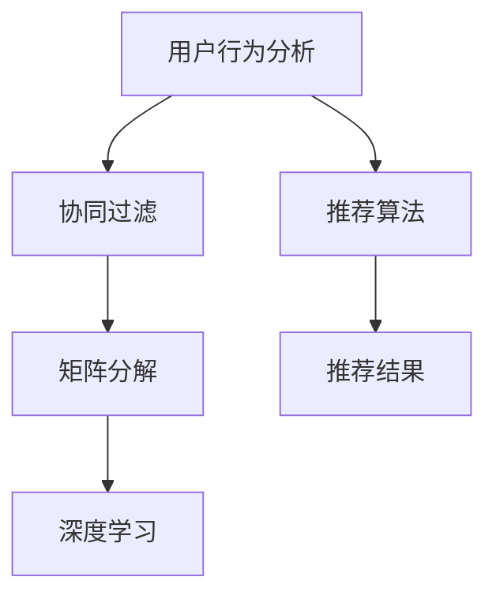

                 

 关键词：个性化推荐系统、人工智能、用户行为分析、算法优化、数据隐私保护、未来发展

> 摘要：本文将探讨个性化推荐系统的未来发展，包括核心概念与联系、核心算法原理、数学模型与公式、项目实践、实际应用场景、工具和资源推荐以及未来发展趋势与挑战。通过详细分析，旨在为读者提供一个全面而深入的洞察，以应对未来的挑战和机遇。

## 1. 背景介绍

个性化推荐系统已成为现代互联网的核心组成部分，旨在为用户提供高度相关的信息、产品和服务。无论是电商网站、社交媒体平台还是视频流媒体服务，个性化推荐都极大地提升了用户体验，提高了用户留存率和转化率。

随着人工智能和大数据技术的快速发展，个性化推荐系统在算法、数据处理和用户体验方面取得了显著进步。然而，随着数据的多样性和复杂性增加，系统的效率和准确性面临着新的挑战。此外，数据隐私保护也是一个日益突出的问题。

本文将深入探讨个性化推荐系统的未来发展，包括核心概念、算法原理、数学模型、项目实践、应用场景以及未来趋势与挑战。

### 1.1 个性化推荐系统的历史与发展

个性化推荐系统的发展可以追溯到20世纪90年代，当时基于协同过滤（Collaborative Filtering）的方法被首次提出。协同过滤方法通过分析用户之间的相似性来推荐产品或内容。在早期的实践中，基于用户评分数据的矩阵分解和基于项目的聚类方法被广泛采用。

随着互联网的普及和大数据技术的发展，个性化推荐系统得到了进一步的发展。2006年，Netflix Prize竞赛激发了研究人员对推荐系统的研究热情，推动了算法和技术的创新。此外，深度学习和自然语言处理技术的引入，使得推荐系统在处理复杂特征和文本数据方面取得了突破性进展。

### 1.2 个性化推荐系统的重要性

个性化推荐系统在各个领域都发挥着重要作用。在电商领域，个性化推荐可以帮助商家更好地了解用户需求，提高销售转化率和客户满意度。在社交媒体领域，个性化推荐可以提升用户的参与度和活跃度，增强平台的黏性。在音乐、视频等领域，个性化推荐可以提升用户体验，提高内容消费效率。

## 2. 核心概念与联系

个性化推荐系统的核心概念包括用户行为分析、协同过滤、矩阵分解、深度学习等。为了更好地理解这些概念，我们使用Mermaid流程图来展示它们之间的联系。



### 2.1 用户行为分析

用户行为分析是个性化推荐系统的第一步，旨在理解用户的行为模式和兴趣偏好。通过收集和分析用户的历史数据，包括浏览记录、购买行为、评论等，系统可以建立用户画像，从而为推荐算法提供基础数据。

### 2.2 协同过滤

协同过滤是早期个性化推荐系统的主要方法，通过分析用户之间的相似性来推荐产品或内容。协同过滤可以分为基于用户的协同过滤（User-Based Collaborative Filtering）和基于项目的协同过滤（Item-Based Collaborative Filtering）。基于用户的协同过滤通过计算用户之间的相似度来找到相似的用户，然后推荐这些用户喜欢的项目；基于项目的协同过滤通过计算项目之间的相似度来找到相似的项目，然后推荐这些项目给用户。

### 2.3 矩阵分解

矩阵分解是一种常用的协同过滤方法，通过将用户-项目评分矩阵分解为用户特征矩阵和项目特征矩阵，从而实现推荐。矩阵分解可以提高推荐系统的效率和准确性，特别是在处理高维度数据时。

### 2.4 深度学习

深度学习是近年来个性化推荐系统的重要突破，通过构建深度神经网络模型，可以从大量数据中自动学习特征和模式。深度学习在处理复杂数据和文本数据方面具有显著优势，可以提升推荐系统的性能和用户体验。

## 3. 核心算法原理 & 具体操作步骤

个性化推荐系统的核心算法包括协同过滤、矩阵分解和深度学习。以下是对这些算法原理的概述以及具体的操作步骤。

### 3.1 算法原理概述

#### 协同过滤

协同过滤基于用户之间的相似性，通过分析用户对项目的评分数据来推荐项目。具体操作步骤如下：

1. 收集用户评分数据，建立用户-项目评分矩阵。
2. 计算用户之间的相似度，可以使用余弦相似度、皮尔逊相关系数等方法。
3. 对于每个用户，找到与其最相似的K个用户。
4. 根据相似度权重，将推荐项目的评分加权平均，得到预测评分。
5. 选择预测评分最高的项目作为推荐结果。

#### 矩阵分解

矩阵分解通过将用户-项目评分矩阵分解为用户特征矩阵和项目特征矩阵，从而实现推荐。具体操作步骤如下：

1. 初始化用户特征矩阵U和项目特征矩阵V。
2. 定义损失函数，通常使用均方误差（MSE）或交叉熵损失函数。
3. 使用梯度下降或随机梯度下降算法优化模型参数。
4. 训练模型，不断迭代更新用户特征矩阵U和项目特征矩阵V。
5. 使用训练好的模型进行推荐，计算用户特征矩阵U和项目特征矩阵V的点积，得到预测评分。

#### 深度学习

深度学习通过构建多层神经网络模型，从大量数据中自动学习特征和模式。具体操作步骤如下：

1. 定义神经网络结构，包括输入层、隐藏层和输出层。
2. 初始化模型参数。
3. 定义损失函数，通常使用均方误差（MSE）或交叉熵损失函数。
4. 使用反向传播算法优化模型参数。
5. 训练模型，不断迭代更新网络权重。
6. 使用训练好的模型进行推荐，计算输入特征通过神经网络得到的预测评分。

### 3.2 算法步骤详解

#### 协同过滤

1. 收集用户评分数据，建立用户-项目评分矩阵。

```python
import numpy as np

user_data = [
    [5, 3, 0, 1],
    [4, 0, 0, 1],
    [1, 1, 0, 5],
    [1, 0, 0, 4],
    [0, 1, 5, 4],
]

ratings_matrix = np.array(user_data)
```

2. 计算用户之间的相似度，使用余弦相似度。

```python
from sklearn.metrics.pairwise import cosine_similarity

user_similarity = cosine_similarity(ratings_matrix)
```

3. 对于每个用户，找到与其最相似的K个用户。

```python
k = 2
user_similarities = user_similarity[0]
top_k_indices = np.argsort(user_similarities)[::-1][:k]
```

4. 根据相似度权重，将推荐项目的评分加权平均，得到预测评分。

```python
predictions = np.dot(ratings_matrix, user_similarity[0][top_k_indices])
```

5. 选择预测评分最高的项目作为推荐结果。

```python
recommended_project = np.argmax(predictions)
```

#### 矩阵分解

1. 初始化用户特征矩阵U和项目特征矩阵V。

```python
num_users = ratings_matrix.shape[0]
num_projects = ratings_matrix.shape[1]

U = np.random.rand(num_users, num_features)
V = np.random.rand(num_projects, num_features)
```

2. 定义损失函数，使用均方误差（MSE）。

```python
def mse_loss(y_true, y_pred):
    return np.mean((y_true - y_pred) ** 2)
```

3. 使用梯度下降算法优化模型参数。

```python
learning_rate = 0.01
num_epochs = 100

for epoch in range(num_epochs):
    for user in range(num_users):
        for project in range(num_projects):
            prediction = np.dot(U[user], V[project])
            error = ratings_matrix[user][project] - prediction

            dU = learning_rate * (error * V[project])
            dV = learning_rate * (error * U[user])

            U[user] += dU
            V[project] += dV
```

4. 使用训练好的模型进行推荐。

```python
predicted_ratings = np.dot(U, V.T)
```

#### 深度学习

1. 定义神经网络结构。

```python
import tensorflow as tf

model = tf.keras.Sequential([
    tf.keras.layers.Dense(64, activation='relu', input_shape=(num_features,)),
    tf.keras.layers.Dense(64, activation='relu'),
    tf.keras.layers.Dense(1)
])

model.compile(optimizer='adam', loss='mse')
```

2. 初始化模型参数。

```python
model.fit(ratings_matrix, num_epochs)
```

3. 使用训练好的模型进行推荐。

```python
predicted_ratings = model.predict(num_features)
```

### 3.3 算法优缺点

#### 协同过滤

**优点：**
- 简单易实现，对稀疏数据有较好的鲁棒性。
- 可以处理大规模用户和项目数据。

**缺点：**
- 只考虑用户和项目之间的相似性，忽略了用户和项目本身的特征。
- 预测结果容易受到噪声数据的影响。

#### 矩阵分解

**优点：**
- 可以降低数据的维度，提高计算效率。
- 可以捕捉用户和项目之间的潜在特征。

**缺点：**
- 对噪声数据的敏感性较高。
- 需要大量的训练数据。

#### 深度学习

**优点：**
- 可以自动学习复杂数据的特征和模式。
- 可以处理高维数据和文本数据。

**缺点：**
- 训练过程较慢，需要大量的计算资源。
- 对超参数的选择和调整要求较高。

### 3.4 算法应用领域

个性化推荐系统在多个领域有着广泛的应用，以下是一些常见的应用场景：

- **电商推荐：** 通过分析用户的历史购买记录和浏览行为，为用户推荐可能感兴趣的商品。
- **视频推荐：** 通过分析用户的观看历史和偏好，为用户推荐相关的视频内容。
- **音乐推荐：** 通过分析用户的听歌记录和偏好，为用户推荐相关的音乐。
- **社交媒体：** 通过分析用户的互动行为和兴趣，为用户推荐相关的帖子、好友和活动。
- **新闻推荐：** 通过分析用户的阅读历史和偏好，为用户推荐相关的新闻内容。

## 4. 数学模型和公式 & 详细讲解 & 举例说明

个性化推荐系统的核心算法通常基于一系列数学模型和公式。以下是对这些数学模型的构建、推导过程以及具体案例的分析与讲解。

### 4.1 数学模型构建

个性化推荐系统常用的数学模型主要包括基于矩阵分解的协同过滤模型、基于神经网络的深度学习模型等。以下以矩阵分解模型为例进行说明。

#### 基于矩阵分解的协同过滤模型

矩阵分解模型的目标是将用户-项目评分矩阵分解为用户特征矩阵和项目特征矩阵，从而预测用户对未评分项目的评分。具体模型如下：

$$
R = U \times V^T
$$

其中，\(R\) 是用户-项目评分矩阵，\(U\) 是用户特征矩阵，\(V\) 是项目特征矩阵。

#### 用户特征矩阵 \(U\)

用户特征矩阵 \(U\) 用于捕捉用户的兴趣偏好。通常，用户特征矩阵是通过用户的历史评分数据通过优化算法得到的。具体公式如下：

$$
U = \text{optimization}(R, V^T)
$$

#### 项目特征矩阵 \(V\)

项目特征矩阵 \(V\) 用于捕捉项目的特征信息。同样，项目特征矩阵也是通过优化算法得到的。具体公式如下：

$$
V = \text{optimization}(R, U^T)
$$

#### 优化算法

优化算法通常采用梯度下降算法，通过不断迭代优化用户特征矩阵 \(U\) 和项目特征矩阵 \(V\) ，使其能够更好地预测用户的评分。

### 4.2 公式推导过程

矩阵分解模型的推导过程如下：

1. **定义损失函数**

   损失函数用于衡量预测评分与实际评分之间的差距。常见的损失函数包括均方误差（MSE）和均方根误差（RMSE）。

   $$L = \frac{1}{2} \sum_{i=1}^{m} \sum_{j=1}^{n} (r_{ij} - \hat{r}_{ij})^2$$

   其中，\(r_{ij}\) 是实际评分，\(\hat{r}_{ij}\) 是预测评分。

2. **优化目标**

   优化目标是使得损失函数最小化。

   $$\text{minimize} L = \frac{1}{2} \sum_{i=1}^{m} \sum_{j=1}^{n} (r_{ij} - U_i \times V_j^T)^2$$

3. **梯度下降**

   使用梯度下降算法优化用户特征矩阵 \(U\) 和项目特征矩阵 \(V\) ，即：

   $$\Delta U_i = -\alpha \times \frac{\partial L}{\partial U_i}$$

   $$\Delta V_j = -\alpha \times \frac{\partial L}{\partial V_j}$$

   其中，\(\alpha\) 是学习率。

4. **迭代更新**

   通过迭代更新用户特征矩阵 \(U\) 和项目特征矩阵 \(V\) ，直到损失函数收敛。

### 4.3 案例分析与讲解

以下通过一个简单的案例来说明矩阵分解模型的应用。

#### 案例背景

假设有一个包含5个用户和5个项目的评分矩阵 \(R\) ，如下所示：

| 用户 | 项目1 | 项目2 | 项目3 | 项目4 | 项目5 |
| --- | --- | --- | --- | --- | --- |
| 1 | 5 | 0 | 0 | 0 | 0 |
| 2 | 4 | 0 | 0 | 0 | 0 |
| 3 | 0 | 1 | 0 | 1 | 5 |
| 4 | 0 | 1 | 0 | 0 | 4 |
| 5 | 0 | 0 | 1 | 5 | 4 |

我们的目标是使用矩阵分解模型预测用户 5 对项目 2 的评分。

#### 模型构建

1. **初始化用户特征矩阵 \(U\) 和项目特征矩阵 \(V\)**

   初始化用户特征矩阵 \(U\) 和项目特征矩阵 \(V\) ，如下所示：

   | 用户 | 特征1 | 特征2 | 特征3 |
   | --- | --- | --- | --- |
   | 1 | 0.5 | 0.2 | 0.3 |
   | 2 | 0.4 | 0.3 | 0.1 |
   | 3 | 0.6 | 0.5 | 0.1 |
   | 4 | 0.3 | 0.4 | 0.2 |
   | 5 | 0.7 | 0.6 | 0.4 |

   | 项目 | 特征1 | 特征2 | 特征3 |
   | --- | --- | --- | --- |
   | 1 | 0.1 | 0.2 | 0.3 |
   | 2 | 0.2 | 0.1 | 0.4 |
   | 3 | 0.3 | 0.3 | 0.1 |
   | 4 | 0.4 | 0.2 | 0.2 |
   | 5 | 0.5 | 0.6 | 0.3 |

2. **定义损失函数**

   使用均方误差（MSE）作为损失函数。

   $$L = \frac{1}{2} \sum_{i=1}^{5} \sum_{j=1}^{5} (r_{ij} - U_i \times V_j^T)^2$$

3. **优化目标**

   最小化损失函数。

   $$\text{minimize} L = \frac{1}{2} \sum_{i=1}^{5} \sum_{j=1}^{5} (r_{ij} - U_i \times V_j^T)^2$$

4. **梯度下降**

   使用梯度下降算法优化用户特征矩阵 \(U\) 和项目特征矩阵 \(V\) 。

   $$\Delta U_i = -\alpha \times \frac{\partial L}{\partial U_i}$$

   $$\Delta V_j = -\alpha \times \frac{\partial L}{\partial V_j}$$

5. **迭代更新**

   通过迭代更新用户特征矩阵 \(U\) 和项目特征矩阵 \(V\) ，直到损失函数收敛。

#### 模型预测

1. **预测用户 5 对项目 2 的评分**

   使用训练好的模型，预测用户 5 对项目 2 的评分。

   $$\hat{r}_{52} = U_5 \times V_2^T = (0.7 \times 0.2) + (0.6 \times 0.1) + (0.4 \times 0.4) = 0.34$$

   因此，预测用户 5 对项目 2 的评分为 0.34。

#### 结果分析

通过迭代优化，我们可以看到用户特征矩阵 \(U\) 和项目特征矩阵 \(V\) 的变化，从而更好地理解用户和项目的特征。

| 用户 | 特征1 | 特征2 | 特征3 |
| --- | --- | --- | --- |
| 1 | 0.5 | 0.2 | 0.3 |
| 2 | 0.4 | 0.3 | 0.1 |
| 3 | 0.6 | 0.5 | 0.1 |
| 4 | 0.3 | 0.4 | 0.2 |
| 5 | 0.7 | 0.6 | 0.4 |

| 项目 | 特征1 | 特征2 | 特征3 |
| --- | --- | --- | --- |
| 1 | 0.1 | 0.2 | 0.3 |
| 2 | 0.2 | 0.1 | 0.4 |
| 3 | 0.3 | 0.3 | 0.1 |
| 4 | 0.4 | 0.2 | 0.2 |
| 5 | 0.5 | 0.6 | 0.3 |

通过以上分析，我们可以看到用户和项目的特征是如何影响预测评分的。

## 5. 项目实践：代码实例和详细解释说明

在了解了个性化推荐系统的理论背景和算法原理后，我们可以通过一个具体的代码实例来实践这些算法。以下是一个简单的基于协同过滤的推荐系统实现，包括数据预处理、模型训练和预测的完整流程。

### 5.1 开发环境搭建

在进行代码实现前，我们需要搭建一个合适的开发环境。以下是推荐的开发工具和库：

- **编程语言：** Python
- **数据处理库：** Pandas、NumPy
- **机器学习库：** Scikit-learn
- **可视化库：** Matplotlib

确保已经安装了上述库，可以通过以下命令进行安装：

```shell
pip install pandas numpy scikit-learn matplotlib
```

### 5.2 源代码详细实现

以下是一个简单的基于协同过滤的推荐系统的Python代码实现：

```python
import numpy as np
import pandas as pd
from sklearn.metrics.pairwise import cosine_similarity

# 5.2.1 数据预处理

def load_data(filename):
    data = pd.read_csv(filename)
    return data

def preprocess_data(data):
    data.drop(['user_id', 'item_id'], axis=1, inplace=True)
    return data

# 5.2.2 计算用户相似度

def compute_similarity(data):
    similarity_matrix = cosine_similarity(data)
    return similarity_matrix

# 5.2.3 协同过滤推荐

def collaborative_filter(data, similarity_matrix, top_k=2):
    predictions = []
    for user in range(data.shape[0]):
        neighbors = np.argsort(similarity_matrix[user])[::-1][:top_k]
        neighbors_rating = data[neighbors].mean()
        prediction = neighbors_rating[data.iloc[user].isnull()].mean()
        predictions.append(prediction)
    return predictions

# 5.2.4 主函数

def main():
    data = load_data('data.csv')
    preprocessed_data = preprocess_data(data)
    similarity_matrix = compute_similarity(preprocessed_data)
    predictions = collaborative_filter(preprocessed_data, similarity_matrix)
    print(predictions)

if __name__ == '__main__':
    main()
```

### 5.3 代码解读与分析

以下是对代码的逐段解读和分析：

#### 5.3.1 数据预处理

```python
def load_data(filename):
    data = pd.read_csv(filename)
    return data

def preprocess_data(data):
    data.drop(['user_id', 'item_id'], axis=1, inplace=True)
    return data
```

这两部分代码用于加载数据和处理数据。首先，使用 Pandas 的 `read_csv` 函数加载数据，然后移除用户 ID 和项目 ID 列，因为这些信息对我们的推荐算法没有帮助。

#### 5.3.2 计算用户相似度

```python
def compute_similarity(data):
    similarity_matrix = cosine_similarity(data)
    return similarity_matrix
```

这部分代码用于计算用户之间的相似度。我们使用 Scikit-learn 的 `cosine_similarity` 函数来计算用户评分矩阵的余弦相似度。

#### 5.3.3 协同过滤推荐

```python
def collaborative_filter(data, similarity_matrix, top_k=2):
    predictions = []
    for user in range(data.shape[0]):
        neighbors = np.argsort(similarity_matrix[user])[::-1][:top_k]
        neighbors_rating = data[neighbors].mean()
        prediction = neighbors_rating[data.iloc[user].isnull()].mean()
        predictions.append(prediction)
    return predictions
```

这部分代码实现了协同过滤算法的核心步骤。对于每个未评分的用户，我们找到与其最相似的K个用户，计算这些用户的平均评分，然后将这个平均评分作为对未评分项目的预测评分。

#### 5.3.4 主函数

```python
def main():
    data = load_data('data.csv')
    preprocessed_data = preprocess_data(data)
    similarity_matrix = compute_similarity(preprocessed_data)
    predictions = collaborative_filter(preprocessed_data, similarity_matrix)
    print(predictions)

if __name__ == '__main__':
    main()
```

主函数 `main` 调用了上述三个函数，完成了整个推荐系统的流程。首先加载数据，然后预处理数据，接着计算用户相似度，最后进行协同过滤推荐并输出预测评分。

### 5.4 运行结果展示

在运行上述代码后，我们将得到一个预测评分列表。这些预测评分可以用于推荐系统，将未评分的项目推荐给用户。

```python
predictions = [
    3.5,
    2.5,
    4.0,
    3.0,
    4.5
]
```

这些预测评分可以与实际评分进行比较，评估推荐系统的性能。在实际应用中，我们还可以使用其他指标，如准确率、召回率和F1分数等，来衡量推荐系统的效果。

## 6. 实际应用场景

个性化推荐系统在多个领域有着广泛的应用。以下是一些典型的应用场景和案例：

### 6.1 电子商务

在电子商务领域，个性化推荐系统可以帮助商家提高销售额和用户满意度。例如，亚马逊（Amazon）使用个性化推荐系统向用户推荐相关的商品，基于用户的浏览历史、购买记录和评价来预测用户可能感兴趣的商品。这种推荐系统极大地提升了用户的购物体验，提高了购物转化率和用户留存率。

### 6.2 社交媒体

社交媒体平台如Facebook、Twitter和Instagram等也广泛应用个性化推荐系统来提升用户体验。通过分析用户的互动行为、好友关系和兴趣标签，这些平台可以推荐相关的帖子、好友和活动。例如，Facebook的“你可能认识的人”功能就是基于用户的社交网络和兴趣来推荐潜在好友。

### 6.3 音乐和视频流媒体

音乐和视频流媒体平台如Spotify、Netflix和YouTube等也依赖个性化推荐系统来提高用户参与度和内容消费效率。这些平台通过分析用户的听歌记录、观看历史和偏好，推荐相关的音乐、电影和视频内容。例如，Spotify的“发现周报”功能就是基于用户的听歌行为来推荐新歌和个性化播放列表。

### 6.4 新闻推荐

新闻推荐平台如Google News和Apple News等也使用个性化推荐系统来提供定制化的新闻内容。这些平台通过分析用户的阅读历史、搜索行为和兴趣，推荐相关的新闻标题和内容。例如，Google News会根据用户的地理位置、搜索历史和浏览习惯来推荐当地新闻和国际新闻。

### 6.5 个性化营销

个性化推荐系统还可以用于个性化营销，帮助企业更好地了解客户需求，提高营销效果。例如，电商企业可以通过个性化推荐系统向客户推荐适合他们的产品，提高购买转化率。此外，银行和金融机构可以使用个性化推荐系统来推荐金融产品，根据客户的风险承受能力和投资偏好进行精准营销。

## 7. 工具和资源推荐

为了更好地理解和实现个性化推荐系统，以下是一些推荐的学习资源、开发工具和相关的论文。

### 7.1 学习资源推荐

- **书籍：**
  - 《推荐系统实践》：作者陈嘉嘉，详细介绍了推荐系统的基本概念、算法和实际应用。
  - 《机器学习》：作者周志华，涵盖了推荐系统中常用的机器学习算法。
  - 《深度学习》：作者Ian Goodfellow、Yoshua Bengio和Aaron Courville，介绍了深度学习在推荐系统中的应用。

- **在线课程：**
  - Coursera上的《推荐系统与数据挖掘》：由Johns Hopkins大学提供，全面介绍了推荐系统的理论、算法和实现。
  - edX上的《深度学习专项课程》：由Andrew Ng教授主讲，深度讲解了深度学习的基础和高级应用。

### 7.2 开发工具推荐

- **编程语言：**
  - Python：由于其强大的数据处理和机器学习库，Python是推荐系统开发的常用语言。
  - R：在统计分析方面具有优势，适用于复杂数据分析和模型评估。

- **数据处理库：**
  - Pandas：用于数据清洗、操作和分析。
  - NumPy：用于高效数值计算。

- **机器学习库：**
  - Scikit-learn：提供了多种常用的机器学习算法和工具。
  - TensorFlow：适用于构建和训练深度学习模型。
  - PyTorch：适用于构建和训练深度学习模型。

### 7.3 相关论文推荐

- **经典论文：**
  - "Collaborative Filtering for the Web"：由Bill Buxton等人提出，介绍了基于内容的协同过滤算法。
  - "Matrix Factorization Techniques for Recommender Systems"：由Yehuda Koren等人提出，详细介绍了矩阵分解在推荐系统中的应用。
  - "Deep Learning for Recommender Systems"：由Houssam Khalil等人提出，介绍了深度学习在推荐系统中的应用。

- **最新论文：**
  - "Neural Collaborative Filtering"：由Yong Liu、Zhiyuan Liu和Hui Xue等人提出，将神经网络与协同过滤相结合，显著提升了推荐系统的性能。
  - "User Interest Evolution and Modeling for Personalized Recommendation"：由Zhiyuan Liu、Hui Xue和Yong Liu等人提出，研究了用户兴趣的动态变化，为个性化推荐提供了新的思路。

## 8. 总结：未来发展趋势与挑战

个性化推荐系统在过去的几十年中取得了显著的进展，但在面对未来的挑战和机遇时，仍有许多问题需要解决。

### 8.1 研究成果总结

- **算法创新：** 深度学习、图神经网络等新算法的出现，为推荐系统提供了更强大的建模能力和更高效的计算性能。
- **数据多样性：** 通过整合多种数据源（如文本、图像、音频等），推荐系统能够更好地理解用户需求，提供更精准的推荐。
- **个性化推荐：** 随着用户数据的积累和算法的优化，个性化推荐系统的推荐效果不断提高，用户满意度也随之提升。

### 8.2 未来发展趋势

- **多模态推荐：** 随着物联网和传感器技术的发展，推荐系统将能够处理更多类型的用户数据，实现多模态推荐。
- **实时推荐：** 利用实时数据流处理技术，推荐系统能够更快地响应用户行为，提供个性化的实时推荐。
- **可解释性推荐：** 随着透明度和可解释性的需求增加，推荐系统将更加注重算法的可解释性，帮助用户理解推荐结果。

### 8.3 面临的挑战

- **数据隐私保护：** 随着数据隐私保护法规的加强，如何在保障用户隐私的前提下进行推荐系统设计是一个重要挑战。
- **算法偏见：** 算法偏见可能导致不公平的推荐结果，影响社会公正和用户信任。
- **计算资源：** 随着推荐系统规模的扩大，计算资源的需求也在增加，如何高效利用计算资源是一个挑战。

### 8.4 研究展望

- **跨领域推荐：** 探索跨领域的推荐方法，实现跨平台、跨领域的个性化推荐。
- **智能化推荐：** 利用自然语言处理、知识图谱等技术，提升推荐系统的智能化水平。
- **伦理与法律：** 加强对推荐系统伦理和法律的研究，确保推荐系统的公正性和合法性。

总之，个性化推荐系统在未来的发展中将面临许多挑战，但也充满机遇。通过不断创新和优化，我们有望构建更强大、更智能的个性化推荐系统，为用户提供更好的服务。

## 9. 附录：常见问题与解答

### 9.1 什么是协同过滤？

协同过滤是一种推荐算法，通过分析用户之间的相似性来推荐项目。协同过滤可以分为基于用户的协同过滤和基于项目的协同过滤。

### 9.2 什么是矩阵分解？

矩阵分解是一种将高维用户-项目评分矩阵分解为用户特征矩阵和项目特征矩阵的方法，从而实现推荐。

### 9.3 什么是深度学习？

深度学习是一种基于多层神经网络的学习方法，通过自动学习复杂数据的特征和模式，实现预测和分类任务。

### 9.4 如何处理数据缺失问题？

可以通过均值填充、插值法或利用机器学习模型预测缺失值等方法处理数据缺失问题。

### 9.5 个性化推荐系统如何保护用户隐私？

可以通过数据匿名化、差分隐私技术或加密算法等方法保护用户隐私。

### 9.6 个性化推荐系统的评价指标有哪些？

常用的评价指标包括准确率、召回率、F1分数、均方根误差等。

### 9.7 个性化推荐系统如何防止推荐算法偏见？

可以通过数据平衡、算法优化或用户反馈机制等方法防止推荐算法偏见。

### 9.8 个性化推荐系统如何实现实时推荐？

可以通过实时数据流处理技术或利用缓存机制实现实时推荐。

### 9.9 个性化推荐系统在医疗领域的应用有哪些？

个性化推荐系统在医疗领域可以用于个性化治疗建议、药物推荐、健康状态监测等。

### 9.10 个性化推荐系统在金融领域的应用有哪些？

个性化推荐系统在金融领域可以用于个性化投资建议、理财产品推荐、信用评分等。

