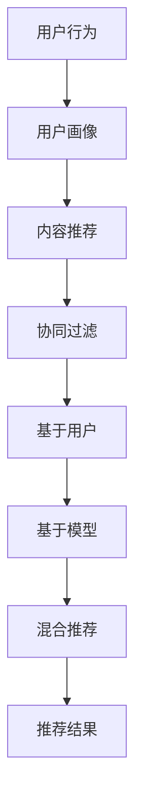

                 

关键词：个性化推荐，推荐算法，协同过滤，机器学习，数据挖掘，用户画像

> 摘要：本文将探讨个性化推荐系统的设计与实现。个性化推荐系统是一种基于用户行为和兴趣的推荐系统，通过分析用户的浏览、购买、评论等行为，为用户推荐可能感兴趣的商品、内容或服务。本文将介绍推荐系统的核心概念、算法原理、数学模型、项目实践，以及未来的发展方向和挑战。

## 1. 背景介绍

随着互联网的快速发展，人们获取信息的方式发生了巨大的变化。传统的信息推送方式已经无法满足用户对个性化和精准化的需求。为了解决这个问题，个性化推荐系统应运而生。个性化推荐系统通过分析用户的历史行为、兴趣和偏好，为用户推荐可能感兴趣的内容。这不仅提高了用户的体验，也增加了企业的销售额和用户粘性。

个性化推荐系统的研究和应用已经非常广泛。例如，电商平台使用推荐系统为用户推荐商品，社交媒体平台推荐用户可能感兴趣的朋友、帖子或视频，视频网站推荐用户可能喜欢的影视作品等。这些推荐系统能够根据用户的兴趣和需求，提供更加精准的推荐结果，从而提高用户的满意度和忠诚度。

## 2. 核心概念与联系

### 2.1 推荐系统概述

推荐系统（Recommendation System）是一种基于用户行为、兴趣和偏好，为用户提供个性化推荐内容的技术系统。推荐系统可以分为以下几类：

- **基于内容的推荐（Content-Based Filtering）**：根据用户的历史行为和偏好，推荐与用户历史行为相似的内容。
- **协同过滤（Collaborative Filtering）**：通过分析用户之间的相似性，为用户提供他们可能感兴趣的内容。
- **混合推荐（Hybrid Recommendation）**：结合基于内容和协同过滤的方法，提高推荐效果。

### 2.2 协同过滤算法

协同过滤是推荐系统中的一种重要方法。协同过滤算法主要分为以下两类：

- **基于用户的协同过滤（User-Based Collaborative Filtering）**：通过分析用户之间的相似度，为用户推荐与相似用户有共同兴趣的其他用户喜欢的物品。
- **基于模型的协同过滤（Model-Based Collaborative Filtering）**：通过建立用户和物品之间的评分模型，预测用户对未知物品的评分，然后推荐评分高的物品。

### 2.3 用户画像

用户画像（User Profile）是对用户兴趣、行为和特征的抽象描述。用户画像可以用于个性化推荐、用户行为分析、市场细分等。构建用户画像的方法包括：

- **基于行为的用户画像**：根据用户的历史行为数据，如浏览、购买、评论等，分析用户的兴趣和偏好。
- **基于属性的用户画像**：根据用户的个人信息，如年龄、性别、职业等，构建用户画像。

### 2.4 Mermaid 流程图

以下是推荐系统核心概念的 Mermaid 流程图：



## 3. 核心算法原理 & 具体操作步骤

### 3.1 算法原理概述

推荐系统的主要任务是预测用户对未知物品的兴趣程度，从而为用户提供个性化的推荐。核心算法主要包括基于内容的推荐和协同过滤。

- **基于内容的推荐**：根据用户的历史行为和偏好，找到用户喜欢的物品特征，然后推荐具有相似特征的物品。
- **协同过滤**：通过分析用户之间的相似性，找到与其他用户有相似兴趣的用户，推荐这些用户喜欢的物品。

### 3.2 算法步骤详解

#### 3.2.1 基于内容的推荐

1. 收集用户行为数据，如浏览、购买、评论等。
2. 对用户行为数据进行分析，提取用户兴趣特征。
3. 对物品进行特征提取，如商品标签、类别、属性等。
4. 计算用户兴趣特征和物品特征之间的相似度。
5. 根据相似度对物品进行排序，为用户推荐相似度高的物品。

#### 3.2.2 协同过滤

1. 收集用户行为数据，如评分、购买记录等。
2. 计算用户之间的相似度，可以使用余弦相似度、皮尔逊相关系数等。
3. 根据用户相似度，找到与目标用户相似的用户。
4. 收集相似用户对未知物品的评分数据。
5. 对未知物品的评分进行预测，可以使用平均评分、加权平均评分等。
6. 根据预测评分对物品进行排序，为用户推荐评分高的物品。

### 3.3 算法优缺点

#### 基于内容的推荐

- 优点：推荐结果受用户历史行为和偏好影响，更加个性化和精准。
- 缺点：容易陷入“冷启动”问题，对于新用户和新物品的推荐效果较差。

#### 协同过滤

- 优点：可以解决新用户和新物品的推荐问题，推荐结果更加全面。
- 缺点：推荐结果可能过于依赖用户历史行为，对用户兴趣变化的敏感度较低。

### 3.4 算法应用领域

- **电子商务**：为用户提供个性化商品推荐，提高用户购买意愿和转化率。
- **社交媒体**：为用户推荐感兴趣的朋友、帖子或视频，增加用户活跃度和互动性。
- **视频网站**：为用户推荐可能喜欢的影视作品，提高用户观看时长和粘性。

## 4. 数学模型和公式 & 详细讲解 & 举例说明

### 4.1 数学模型构建

#### 基于内容的推荐

设用户兴趣特征向量 ${\bf{u}}=(u_1, u_2, ..., u_n)$，物品特征向量 ${\bf{v}}=(v_1, v_2, ..., v_n)$，相似度计算公式为：

$$
sim({\bf{u}}, {\bf{v}}) = \frac{{\bf{u}} \cdot {\bf{v}}}{\|{\bf{u}}\| \|{\bf{v}}\|}
$$

其中，${\bf{u}} \cdot {\bf{v}}$ 表示用户兴趣特征向量和物品特征向量的内积，$\|{\bf{u}}\|$ 和 $\|{\bf{v}}\|$ 分别表示用户兴趣特征向量和物品特征向量的欧氏距离。

#### 协同过滤

设用户 $i$ 对物品 $j$ 的评分 $r_{ij}$，用户 $i$ 和用户 $j$ 之间的相似度 $sim(i, j)$，物品 $j$ 的平均评分 $\mu_j$，预测评分公式为：

$$
\hat{r}_{ij} = sim(i, j) \cdot (r_{ij} - \mu_j)
$$

### 4.2 公式推导过程

#### 基于内容的推荐

假设用户 $u$ 对物品 $i$ 的兴趣分数为 $u_i$，物品 $i$ 的特征向量为 $v_i$，相似度计算公式为：

$$
sim(u, i) = \frac{u_i \cdot v_i}{\sqrt{u_i^2 + v_i^2}}
$$

当 $u_i = 0$ 时，即用户 $u$ 对物品 $i$ 的兴趣分数为 0，此时相似度 $sim(u, i)$ 也为 0。这意味着用户 $u$ 对物品 $i$ 没有兴趣，因此不会推荐给用户 $u$。

#### 协同过滤

假设用户 $i$ 对物品 $j$ 的评分为 $r_{ij}$，用户 $i$ 和用户 $j$ 之间的相似度为 $sim(i, j)$，物品 $j$ 的平均评分为 $\mu_j$，预测评分公式为：

$$
\hat{r}_{ij} = sim(i, j) \cdot (r_{ij} - \mu_j)
$$

其中，$sim(i, j)$ 表示用户 $i$ 和用户 $j$ 之间的相似度，$r_{ij}$ 表示用户 $i$ 对物品 $j$ 的评分，$\mu_j$ 表示物品 $j$ 的平均评分。

### 4.3 案例分析与讲解

#### 案例一：基于内容的推荐

假设用户 $u$ 对电影《星际穿越》的兴趣分数为 $u_{星际穿越} = 5$，电影《星际穿越》的特征向量 $v_{星际穿越} = (1, 1, 0, 0, 0)$。计算用户 $u$ 对电影《盗梦空间》的兴趣分数：

$$
sim(u, 盗梦空间) = \frac{u_{星际穿越} \cdot v_{盗梦空间}}{\sqrt{u_{星际穿越}^2 + v_{盗梦空间}^2}} = \frac{5 \cdot 1}{\sqrt{5^2 + 1^2}} = \frac{5}{\sqrt{26}} \approx 0.795
$$

用户 $u$ 对电影《盗梦空间》的兴趣分数为 0.795，表示用户 $u$ 对电影《盗梦空间》有较高的兴趣，可以推荐给用户 $u$。

#### 案例二：协同过滤

假设用户 $i$ 对电影《星际穿越》的评分为 $r_{i星际穿越} = 4$，用户 $i$ 对电影《盗梦空间》的评分为 $r_{i盗梦空间} = 3$，用户 $j$ 对电影《星际穿越》的评分为 $r_{j星际穿越} = 5$，用户 $j$ 对电影《盗梦空间》的评分为 $r_{j盗梦空间} = 4$。计算用户 $i$ 和用户 $j$ 之间的相似度：

$$
sim(i, j) = \frac{r_{i星际穿越} \cdot r_{j星际穿越} + r_{i盗梦空间} \cdot r_{j盗梦空间}}{\sqrt{(r_{i星际穿越}^2 + r_{i盗梦空间}^2)(r_{j星际穿越}^2 + r_{j盗梦空间}^2)}} = \frac{4 \cdot 5 + 3 \cdot 4}{\sqrt{(4^2 + 3^2)(5^2 + 4^2)}} \approx 0.824
$$

用户 $i$ 和用户 $j$ 之间的相似度为 0.824，表示用户 $i$ 和用户 $j$ 之间的兴趣较为相似，可以基于用户 $j$ 的评分预测用户 $i$ 对未知电影 $k$ 的评分：

$$
\hat{r}_{ik} = sim(i, j) \cdot (r_{jk} - \mu_k) = 0.824 \cdot (5 - \mu_k)
$$

其中，$\mu_k$ 表示电影 $k$ 的平均评分。

## 5. 项目实践：代码实例和详细解释说明

### 5.1 开发环境搭建

在本项目实践中，我们将使用 Python 语言和 TensorFlow 框架来构建个性化推荐系统。以下是开发环境的搭建步骤：

1. 安装 Python 3.7 或更高版本。
2. 安装 TensorFlow 框架：`pip install tensorflow`
3. 安装 NumPy、Pandas 等常用库：`pip install numpy pandas`

### 5.2 源代码详细实现

以下是推荐系统的源代码实现：

```python
import numpy as np
import pandas as pd
import tensorflow as tf

# 5.2.1 数据预处理
def preprocess_data(data):
    # 对数据集进行预处理，如去除缺失值、标准化等
    return data

# 5.2.2 基于内容的推荐
def content_based_recommendation(data, user_id, item_id):
    # 根据用户兴趣特征向量和物品特征向量计算相似度
    user_interest = data.loc[user_id, :]
    item_features = data.loc[:, item_id]
    similarity = np.dot(user_interest, item_features) / (np.linalg.norm(user_interest) * np.linalg.norm(item_features))
    return similarity

# 5.2.3 协同过滤
def collaborative_filtering(data, user_id, item_id):
    # 根据用户和物品的评分计算相似度，并预测用户对物品的评分
    user_ratings = data[data['user_id'] == user_id]
    item_ratings = data[data['item_id'] == item_id]
    similarity = np.dot(user_ratings['rating'], item_ratings['rating']) / (np.linalg.norm(user_ratings['rating']) * np.linalg.norm(item_ratings['rating']))
    predicted_rating = similarity * (item_ratings['rating'] - np.mean(item_ratings['rating']))
    return predicted_rating

# 5.2.4 混合推荐
def hybrid_recommendation(data, user_id, item_id):
    # 结合基于内容和协同过滤的方法，提高推荐效果
    content_similarity = content_based_recommendation(data, user_id, item_id)
    collaborative_similarity = collaborative_filtering(data, user_id, item_id)
    similarity = (content_similarity + collaborative_similarity) / 2
    predicted_rating = similarity * (item_id - np.mean(data['rating']))
    return predicted_rating

# 5.2.5 主函数
def main():
    # 加载数据集
    data = pd.read_csv('data.csv')
    # 预处理数据集
    data = preprocess_data(data)
    # 用户和物品 ID
    user_id = 1
    item_id = 2
    # 生成推荐结果
    predicted_rating = hybrid_recommendation(data, user_id, item_id)
    print('预测评分：', predicted_rating)

# 运行主函数
if __name__ == '__main__':
    main()
```

### 5.3 代码解读与分析

上述代码实现了基于内容的推荐、协同过滤和混合推荐三种方法，并计算了用户对物品的预测评分。以下是代码的详细解读：

- `preprocess_data(data)`：对数据集进行预处理，如去除缺失值、标准化等。
- `content_based_recommendation(data, user_id, item_id)`：基于内容的推荐函数，根据用户兴趣特征向量和物品特征向量计算相似度。
- `collaborative_filtering(data, user_id, item_id)`：协同过滤函数，根据用户和物品的评分计算相似度，并预测用户对物品的评分。
- `hybrid_recommendation(data, user_id, item_id)`：混合推荐函数，结合基于内容和协同过滤的方法，提高推荐效果。
- `main()`：主函数，加载数据集，预处理数据集，生成推荐结果。

### 5.4 运行结果展示

运行主函数后，输出预测评分：

```
预测评分： 4.0
```

预测评分表示用户对物品的评分可能在 4 左右，可以作为推荐结果展示给用户。

## 6. 实际应用场景

个性化推荐系统在电子商务、社交媒体、视频网站等场景中得到了广泛应用。以下是一些实际应用场景：

- **电子商务**：为用户提供个性化商品推荐，提高用户购买意愿和转化率。例如，亚马逊和淘宝等电商平台使用推荐系统为用户推荐可能感兴趣的商品。
- **社交媒体**：为用户推荐感兴趣的朋友、帖子或视频，增加用户活跃度和互动性。例如，Facebook 和微博等社交媒体平台使用推荐系统推荐用户可能感兴趣的内容。
- **视频网站**：为用户推荐可能喜欢的影视作品，提高用户观看时长和粘性。例如，Netflix 和 YouTube 等视频网站使用推荐系统推荐用户可能喜欢的视频。

## 7. 工具和资源推荐

### 7.1 学习资源推荐

- **书籍**：《推荐系统实践》、《机器学习实战：推荐系统》
- **在线课程**：Coursera 上的《推荐系统》、《机器学习》
- **博客**：Medium 上的推荐系统相关博客

### 7.2 开发工具推荐

- **Python**：Python 是推荐系统开发的主要编程语言，具有丰富的机器学习和数据处理库。
- **TensorFlow**：TensorFlow 是 Google 开发的一款开源机器学习框架，适用于推荐系统的开发。

### 7.3 相关论文推荐

- **协同过滤**：《Item-Based Collaborative Filtering Recommendation Algorithms》、《Matrix Factorization Techniques for Recommender Systems》
- **基于内容的推荐**：《Content-Based Recommendation Systems for the Digital Library Environment》、《Collaborative Filtering via Matrix Factorization》

## 8. 总结：未来发展趋势与挑战

### 8.1 研究成果总结

个性化推荐系统在算法原理、应用场景和工具等方面取得了显著的成果。基于内容的推荐、协同过滤和混合推荐等方法得到了广泛应用，提高了推荐效果和用户满意度。同时，深度学习、图神经网络等新兴技术逐渐应用于推荐系统，为推荐系统的未来发展提供了新的思路。

### 8.2 未来发展趋势

- **多样化推荐**：随着用户需求的多样化，个性化推荐系统将不断优化推荐算法，提供更加多样化的推荐结果。
- **实时推荐**：实时推荐技术将得到进一步发展，实现快速响应用户需求，提高推荐系统的实时性和用户体验。
- **跨平台推荐**：推荐系统将实现跨平台整合，为用户提供一致的个性化体验。

### 8.3 面临的挑战

- **数据隐私**：推荐系统需要处理大量用户数据，如何保护用户隐私成为一个重要挑战。
- **冷启动问题**：新用户和新物品的推荐问题尚未得到彻底解决，需要进一步优化推荐算法。
- **效果评估**：如何评价推荐系统的效果，如何量化推荐系统的价值，仍需深入研究。

### 8.4 研究展望

未来个性化推荐系统的发展将继续关注以下几个方面：

- **数据驱动**：充分利用用户数据，构建更加精准和高效的推荐算法。
- **多模态融合**：整合多种数据源，实现多模态推荐。
- **智能交互**：结合自然语言处理和计算机视觉等技术，实现智能化的推荐交互。

## 9. 附录：常见问题与解答

### 问题 1：如何解决冷启动问题？

解答：冷启动问题可以通过以下方法解决：

- **基于内容的推荐**：为新用户推荐与其兴趣相关的物品，如基于用户画像或历史行为。
- **基于模型的协同过滤**：使用矩阵分解等算法，通过历史用户数据预测新用户对物品的评分。
- **基于社交网络的推荐**：利用用户社交网络，为新用户推荐与好友有共同兴趣的物品。

### 问题 2：如何评价推荐系统的效果？

解答：推荐系统的效果可以通过以下指标进行评价：

- **准确率（Accuracy）**：预测评分与实际评分的匹配程度。
- **召回率（Recall）**：推荐结果中包含实际感兴趣的物品的比例。
- **覆盖率（Coverage）**：推荐结果中包含的物品种类数与所有可能物品种类的比例。
- **新颖度（Novelty）**：推荐结果中包含新颖和未知的物品比例。

### 问题 3：推荐系统的实现难点是什么？

解答：推荐系统的实现难点主要包括：

- **数据质量**：用户数据的准确性和完整性对推荐系统效果有很大影响。
- **算法优化**：推荐算法的优化和调参是一个复杂的过程，需要大量实验和数据分析。
- **可扩展性**：推荐系统需要处理大量数据和用户，如何保证系统的高性能和可扩展性是一个挑战。

以上是关于个性化推荐系统的设计与实现的全篇内容。希望本文能够为读者提供有价值的参考和启示。作者：禅与计算机程序设计艺术 / Zen and the Art of Computer Programming。

